# Red Hat RHCE 8.0 认证体系课程：RH134：Shell基础03


## 概述
在本节课中，我们将深入学习Bash Shell的一些扩展知识。主要内容包括特殊字符的处理、变量扩展、命令替换、算术运算以及循环控制结构。这些概念是编写高效Shell脚本的基础。

---

## 特殊字符与引用

在Bash Shell中，某些字符具有特殊含义。有时我们需要使用它们的字面值，这时就需要用到转义或引号。

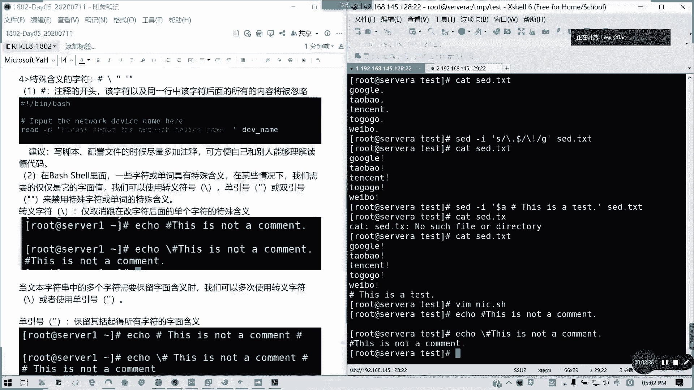

### 注释符：`#`
井号 `#` 在Bash Shell中作为注释的开头。该字符及其同一行后面的所有内容都会被Shell忽略，不会执行。

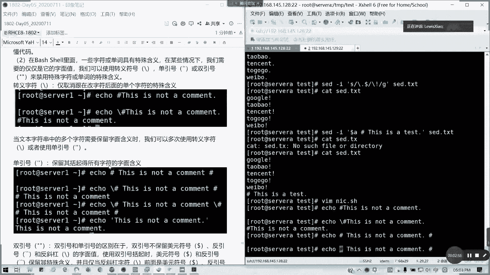

**建议**：在编写脚本或配置文件时，尽量多加注释，以便自己和他人理解代码。

### 转义与引号
当需要禁用字符的特殊含义时，可以使用反斜杠 `\`、单引号 `'` 或双引号 `"`。

*   **反斜杠 `\`**：只能取消紧随其后的单个字符的特殊含义。
*   **单引号 `'`**：会保留括号内所有字符的字面含义，不进行任何转义或替换。这是一种“绝对引用”。
*   **双引号 `"`**：会保留美元符号 `$`、反引号 `` ` `` 和反斜杠 `\` 的特殊含义，用于变量扩展和命令替换。反斜杠 `\` 仅在它位于 `$`、`` ` ``、`"`、`\` 或换行符之前时才保留其转义功能。

**示例**：
```bash
echo # This is a comment
# 输出为空，整行被注释

echo \# This is not a comment
# 输出: # This is not a comment

echo '# This is a literal string $HOME `pwd`'
# 输出原样: # This is a literal string $HOME `pwd`

echo "# This is a string with expansion: $HOME"
# 输出: # This is a string with expansion: /home/username
```

**注意**：为变量分配字符串值时，通常应用引号括起来。如果不加引号，Shell会将空格解释为单词分隔符，可能导致错误。

---

## 变量扩展与花括号

通过变量扩展可以调用变量的值。通常使用 `$variable` 语法，这是 `${variable}` 的简化形式。

在某些情况下，必须使用花括号 `{}` 来消除歧义。

**示例**：
```bash
first=Zhong
last=Green
name_1=$first$last
echo $name_1
# 输出: ZhongGreen

# 如果需要引用一个名为 `first_` 的变量（假设已定义），直接写 `$first_` 会产生歧义。
# 正确做法是使用花括号：
echo ${first}_$last
# 输出: Zhong_Green
```

---

## 命令替换

命令替换允许我们将命令的输出结果捕获，并赋值给变量或直接使用。

有两种语法形式：
1.  反引号：`` `command` ``
2.  `$(command)` （**首选**，因为它更清晰且支持嵌套）

**示例**：
```bash
today=$(date)
echo "Today is: $today"
# 输出: Today is: Tue Oct 26 18:00:00 CST 2023

# 两种方式效果相同，但 `$()` 支持嵌套
file_count=$(ls $(pwd) | wc -l)
```

---

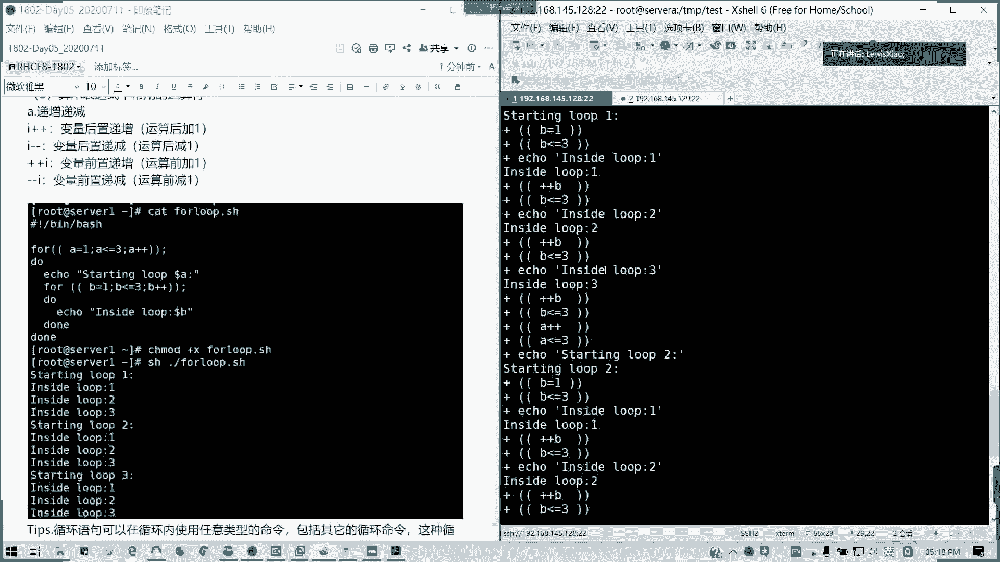

## 算术扩展

Bash Shell 可以执行简单的整数算术运算。

语法是：`$(( expression ))`。Shell会对括号内的表达式求值，并用结果替换整个表达式。表达式内允许进行变量扩展和命令替换，也支持嵌套。

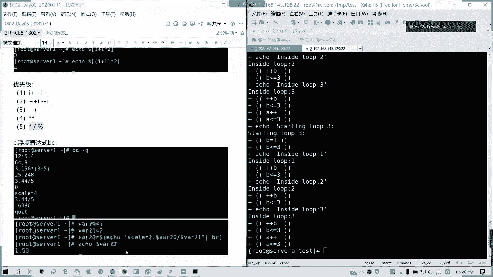

**示例**：
```bash
a=5
b=3
c=$((a + b))
echo $c
# 输出: 8

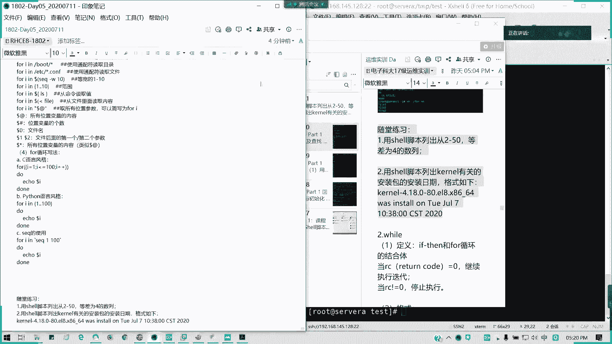

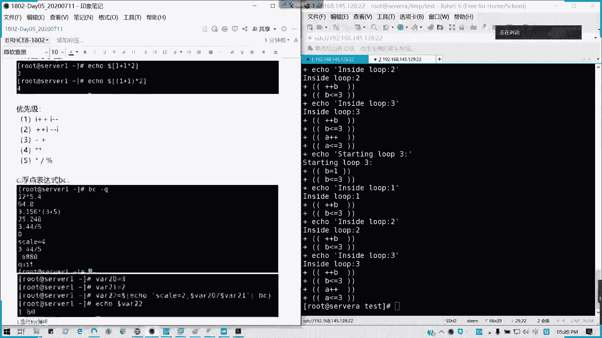

echo $(( 2 * (a + b) ))
# 输出: 16

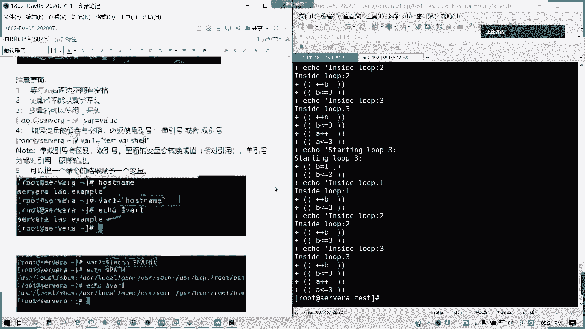

# 使用 `bc` 命令进行更复杂的数学运算（非Bash内置）
result=$(echo "scale=2; $a / $b" | bc)
echo $result
# 输出: 1.66
```

**常用运算符**：
*   `++`, `--`：递增、递减
*   `+`, `-`：一元加、减
*   `**`：求幂
*   `*`, `/`, `%`：乘、除、取余
*   `+`, `-`：加、减

运算符遵循优先级规则，可以使用括号 `()` 改变运算顺序。

---

## 循环控制结构

### `for` 循环
`for` 循环用于遍历一个项目列表。

**语法**：
```bash
for variable in item1 item2 ... itemN
do
    commands
done
```

**项目列表的来源**：
1.  直接列出：`for i in 1 2 3`
2.  命令替换：`for file in $(ls *.txt)`
3.  花括号扩展：`for num in {1..10}`
4.  位置参数：`for arg in "$@"` 或简写 `for arg`

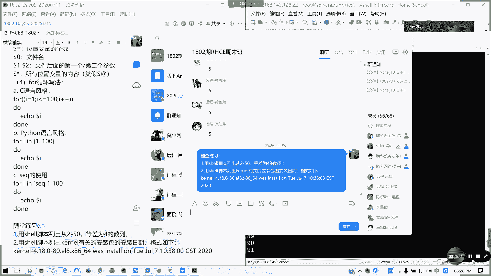

**示例**：
```bash
# 使用 `seq` 命令生成序列
for i in $(seq 1 5)
do
    echo "Iteration: $i"
done
```

### `while` 循环
`while` 循环在测试条件为真（退出状态码为0）时，持续执行循环体。

**语法**：
```bash
while test-commands
do
    commands
done
```

**关键**：循环体内必须有改变测试条件的语句，否则可能成为无限循环。

**示例**：
```bash
count=5
while [[ $count -gt 0 ]]
do
    echo "Countdown: $count"
    ((count--))
done
```

### `until` 循环
`until` 循环与 `while` 循环相反。它在测试条件为假（退出状态码非0）时执行循环体，条件为真时停止。

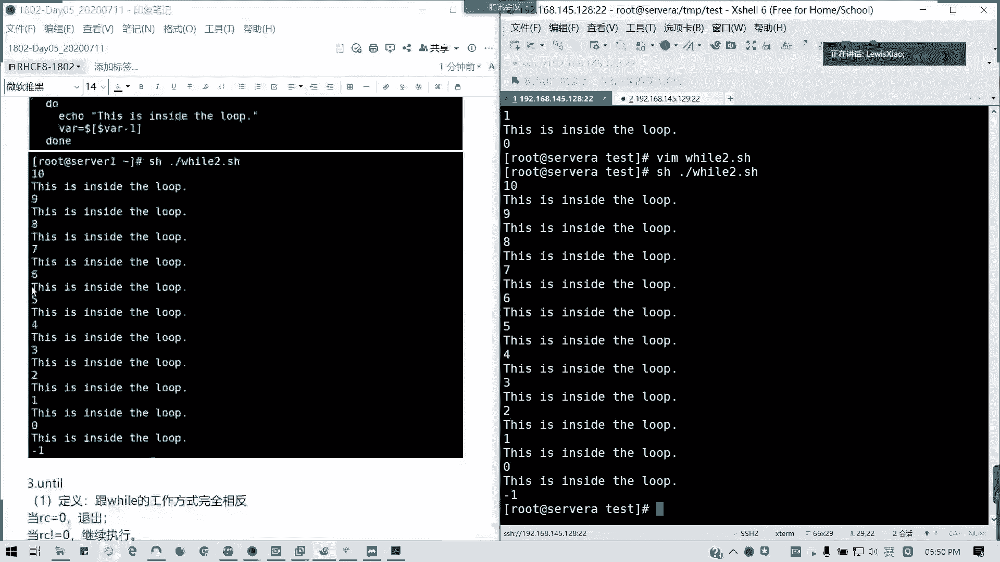

**语法**：
```bash
until test-commands
do
    commands
done
```

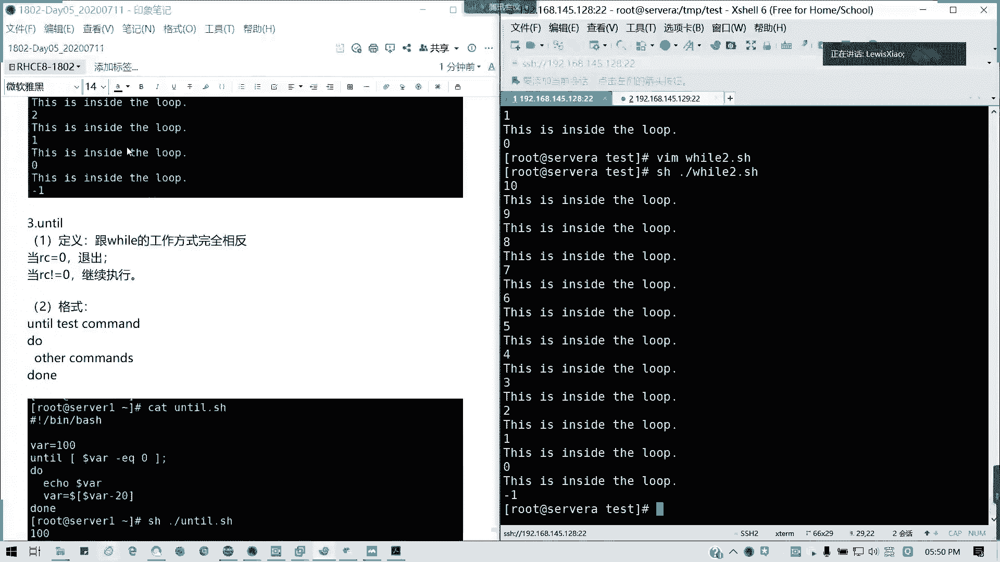

**示例**：
```bash
num=1
until [[ $num -gt 5 ]]
do
    echo "Number: $num"
    ((num++))
done
```

**注意**：对于 `while` 和 `until`，如果使用多个测试命令，只有最后一个命令的退出状态码决定是否继续循环。

---

## 总结
本节课我们一起深入学习了Bash Shell的核心扩展功能。

我们首先了解了如何使用转义符和引号来处理具有特殊含义的字符。接着，探讨了变量扩展，特别是使用花括号消除歧义的方法。然后，学习了命令替换和算术扩展，这两项功能使得Shell脚本能够动态获取信息并进行计算。最后，我们详细讲解了 `for`、`while` 和 `until` 三种循环控制结构，它们是实现自动化任务和流程控制的关键。

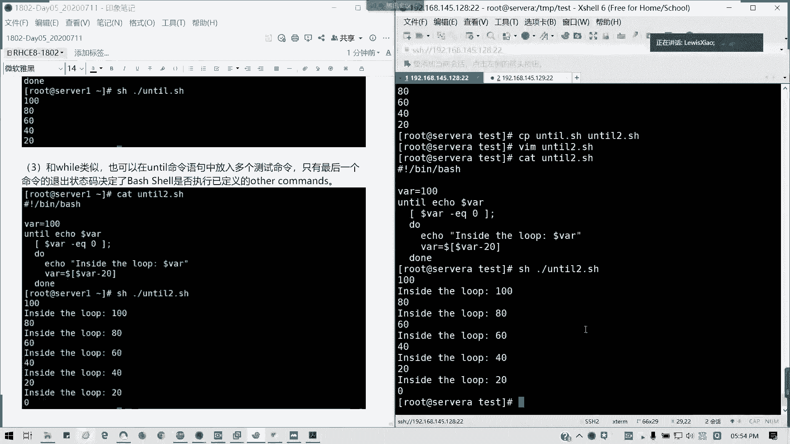

掌握这些知识，将为编写更复杂、更强大的Shell脚本打下坚实的基础。下节课我们将继续学习条件判断、正则表达式等高级主题。