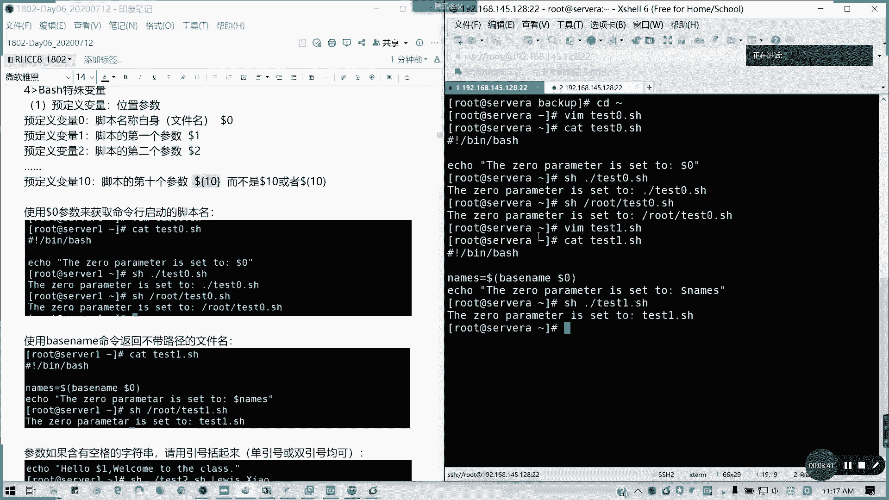

# 拿下证书！Redhat红帽 RHCE8.0认证体系课程 RH124+RH134+RH294三门认证视频教程 - P33：33_Video_Day06_RH134_Ch01_Shell基础04 - 16688888 - BV1734y117vT

我们来看第二部分的基础。

任我们任务控制里面，我们讲到一个特殊变量啊，我这里就清一下屏啊。特殊变量特殊变量呢这里有一个叫做预定义变量。就刚才我们涉及到一些什么多了零到多了一多了2。对不对？

这些是叫我们有一个预定义变量叫未置参数啊，未置参数。我们要知道几个东西。第一个多了零多了零是我们的脚本名称的自自自身，对不对？就自己嘛，我们讲简单说就是一个我们脚本的一个文件名。对吧在伴水里面都多了零。

对不对？对吧。然后第一个参数多了一，第二个参数多了2，再后次到第10个参数，就是它的。位置参数超过两位数的时候，麻烦大家用大括号括起来。而不是这样多了1。或者是这样子。都不对。如果写多了1的话。

它就变成把多了一是吧？多了一的那个值值取出来，后面加个0。懂我意思吧？所以要取多的十的话，请用大括号括起来啊。

请用大括号括起来证明它是一个整体，这也是为了消除歧义，对不对？那我们看看多了零，我们来写一个脚本。并b是吧，ele。the zero就第零个节第一个节啊，parameter is set to。

to多了0。我这写一句话。对吧我的脚本就这么写。😊，那我们运行一下。是不是他把那个后面的我们的脚本的名称已经输出来。然后如果我就把它完整名称写了。它是不是输出一个完整完整的路径啊，对不对？

但我们也可以用base name这个命令啊。base name这个命令呢，我们可以加进去，我们获得一个仅仅是文件名，不带任何路径。names等于我们用。命令传输结果啊。

base snap dollar0。同样我们A这句话。记住这里不要单引号，端引单引号的话，你绝对引用的theze。Parameter。Yes。Set to。对吧。

能理解啊。

他只输出我们的文件名了，他没有带任何的路径，能理解啊。然后接下来如果有空格的字符串呢，有空格字符串，那我们我们是不是要用。

所以是我们要用引号括起来。我的脚本我来写一个t2点SH。每次且基本上我们解析器。然后呢。我们直接就一口一句话。hello，多了一。因为我们文件名是多了零嘛，那么第一个参数就不写多了一，对不对？

可以大家跟我一起写啊，都没问题啊。welcome to the class，就这样写。那我们看一下看一下那个t2。对吧，我们据我们脚本是这样。然后呢，我现在我做带空格啊。比如说写我的英文名都is点消啊。

就是这样。那这样的话，他如果空格的话，它是不是会识别成两个参数啊？对不对？如果我们不在任何引号，然后我我这个名字我这个。多了一我本来的一个名称是带空带空格的，它是不是会识别成两个参数？

那如何那如何解决这问题，单引号算以号括起来。对吧。

这个就是我要想表达的一个东西。

能理解啊，这三个东西能理解不能理解的话，请打个A小A啊。

其实这些在原本8。0我们都不讲了。原本8。0我们不讲这些东西，这是原本7。0的东西。但是在7。0里面，我们就照讲吧，按照7。0来讲，哎呀，虫此都飞过，有蚊子都飞过来了啊。然后呢。

我们来看一下多了锌跟多了A的区别。刚才我们是不是讲到一个它可以含括所有的变量。

我们看一下列一个例子。但略有差别啊，我们这里先讲在多的新的时候呢，所有参数就被视为一个单词啊，就把它横向输出。但是如果是多了A的话，每个单每个参数都是一个单独的，也是纵向输出啊。我们来看一下例子。

并ba。four。I in。用这容双引号啊，勾了心。就是读取一个文件列表的，对不对？读有个列表了，度。do里面呢。Apple菠了。学完体结束。那我再写我再复制，我我再复制一下啊，我这是不是一个。

So A R G FR。我们这里把多了星换成多了 at。多了 c跟多了M嘛，他说都是韩国所有的未知参数，对不对？那我们看一下，我们看一下。对吧两个区别仅仅在我们的列表里面采用多了C跟多了A。

那我们现在分别执行两个脚本。我这里就1234，他是不是横排输出？相当于我们把它视为一个对吧？一个单词懂我意思吗？1234这样排过来，然后如果是二的话。多的癌。每个参数是单独的，所以它是纵向输出来。

对吧一列一个嘛，1234这样列出来，懂我意思吗？然后还有一个就是do的景。它是传传传输给脚本的面含参数数量，用一证验证任何参数的传值是不是传到脚本里面，对不对？

我们来看一下啊，我们在后面加一句加一句话。我们在分别在两个脚本里后面加一句话。嗯。他这些预制变量，我们不用去单独定义的。哎，我写错字啊，ECHO啊，如果写错的话，它不会变色的。好，我们现在把这两个讲本。

我们再给他看一遍。多了井嘛多了井是传递变量未知个数。那我们现在执行一遍脚本。对吧1234它有4个，对不对？我们传出了4个变量，对不对？如果把这里堆起来。是是一个啊。这是不是两个啊？

对吧他对这个参数的个数会传。就是这个是一个预定义的一个变量。然后像我们的。如果是我们就是设为一个单词情况下，它也是视为四个变量，只不过是纵向输出而已。对吧。像这样是不是两个啊？懂吧。

所谓的单词识别上就是它到底是一个还是。还是一个还是一个整体。就是这样一个区别而已，没了。懂我意思吧？有问题吗？

然后接下来我们来接下来啊，我们呃这个这块如果有问题，没有问题，请打个小B。然后接下来我们要讲一个多的括大括号，画括号的一个一键用法。

最位没问题，请打个小B。然后我们要讲多的花货的简单用法，这个其实很好玩啊。也就一个通一一里面一个通配符了，通配符，然后呢来获取一些不同结果。比如说我们来看一下多的画框。

我们一个预定一个变量叫做firere。

截取吗。这个其实虽然用的可能不多。我的一个完整的文件名。对啊，截取嘛，因为截取用像firere，我们定义的这个文件名，我就跟例子写一模一样。这样的话大家可以容易理解啊。然后我用前面变量名。

后面的话就景星杠是吧？然后A口一下，我直接再这A口，我就不再写命令啊，不再写脚本了。Fire。Jingxing。斜杠。就把第一个斜杠及其前面的。都去掉了，对不对？所以他是不是少了一个斜杠。

就变成TNP后面的一个东西。对吧。警心杠。紧紧心杠。把锁把最后一个斜杠及其左边的字符串拿掉了，那是不是只是一个文件名？对吧。请。一个前面一个啊单个符号。是最小操作，两个符号是最大操作啊最大操作。然后呢。

景心点把斜杠换成点的话，它最其实第三位就是我们的一个识别的一个符号啊，就第三个第二个是代表是任意，第一个景是吧？景是左边，对不对？任意。然后第三个呢是你的识别符，就是你的那个。你这个字符啊这个识别字符。

然后比如说景星点的话。他会拿掉第一个点击左边这不串，是不是点就变成他点距这了，对不对？对吧。然后如果是仅紧星点。最后一个拿掉了。所有点是吧，就所有点拿掉之后，是不是剩下一个距离在了？懂我意思吧。

然后还有就是百分号。仅是左边，百分号是右边啊。百分号。斜杠星啊。那就是拿掉我们的。最后一条点击右边右边的字符串，那是不是TMP test，对不对？后面的鞋杠不后面那都被拿掉了。对吧。两个百分号。空空白。

所有的鞋就第一个斜杠几其右边的全拿掉，是不是整个整个变成空白了，空行。对吧能理解吗？好，然后接下来。百分号点心拿掉最后一个点击右边字符串。两个摆放号。那是到passWD了，对不对？

简单记忆法井号是去掉左边，因为键盘上面井号在多了在多了的左边，对吧？百分号是拿在右边，也就是我们百分号是不是数字五上面的那个在多了的。右边对不对？单一符号是最小匹配，两个符号是最大匹配。这样好记吧。

对吧。这样比较好记哈。然后呢还有一个就是提取字节跟变量替换。来看一下，比如说我这里fire。Doll of。Ale啊，这张A口一下多了 fire。冒号零冒号5，那就提取最左边的5个字节。

杠TMP杠是不是杠好5个？对吧。提取最左边的5个。那我可以这里改把起始位置改成5，那是不是题我们从第五个字节前面右边的连续5个字节。对不对？就变是不是就从T开始。从第5个啊01234，它从零开始的对吧？

第五个是不是刚好就test这个TTEST斜杠。对不对？然后呢，变量值替换呢，比如说我要把第一个小S。斜杠啊变成了一个大S。是不是我这里一个第1个S是不是TTST这个S，对不对？小写换大写。

然后如果两个斜杠。最大。把所有的S全换了。能懂吗？这12个东西这12个其实都是我们的。替就是用那个花火的一个替换啊。换两个啊。怎么换两个这第。第一个第二个我想想啊。你你你可以自己想一想怎么弄，你想想。

只有两个佛的最大，一个是最小，那怎么换呢？你想想。也可以啊。🎼你要换两个，比如说哎。如会。但是你要你要是要不知道是不是连续的嘛，这个是连续的才行。我来知道。对啊。这个要自己考虑一下啊，如果这块明白的。

请打一个C哈。如果换两个怎么办？你们想想啊。

这个的话告诉大家也在8。0里面没有了。

然后我们再讲两个内容，我们休息一下啊，再讲两个内容，一个叫做退出啊，我们叫退出代码，或者叫状态返回码，也就一个东西叫return code，对不对？我们每个命令我们执行之后都会返回一个退出状态啊。

通常在我们linux里面，对吧？每个命令执行之后都会返回一个退出状态，通常也叫做状返回状态码，或者是叫状态返回码都可以，或者是叫一个叫退出代码，所以说两个名称都是同一个东西。

一个叫return code，一个叫sic code啊。

然后呢，如果命令执行成功呢，它的一个退出代码为0，对不对？如果不成功，他就是非零。非林有很多种情况啊，命令退出这些代码呢将由我们的附相传到附近层并存储在我们的问号变量。

然后我们调调用呢已执行命令的退出代码呢，有没有多的问号？对不对？用do的问号的值来检索啊，它这个退出代码呢，或者是我们叫状，我们叫返回状态码，它是1个0到255之间的一个整数值。在命令结束运行的时候。

有命令传递给cll。对，需要解锁命令的话，必须马上啊在运行完毕之后立刻查看啊。或者是使用多多的问号变量，因为它的值呢会不断的被迭代替换，它只保存最后一就我们最近一条执行命令的一个退出返回一个返回码状态。

懂我意思吗？那我们来看一下例，看一下它的状态返回码。我这里return code是吧，零代表成功执行，一代表一一般性未知错误。比如说我们参数不存在。对吧。像第二个的话就是不适合的需要命令不适合涉要命令。

比如说我们的那个文件目录找不到。懂我意思吧？这不适合了，126是命令不能执行，127命令没找到，128无效的退出参数。128加1个X呢是一个信号的严重错误。其中130是通过cttrol加C。的中断退出。

我们是不是命令执行完一半，执行完一半，我们是不是我们ctrl加是可以退出来？就break掉了。2，我是正常退出以外的状态嘛，那我们再来看一下以下例子。

我们这是一个正常的命令，然后我们马上echo dollar问号，它的状态码是不是零啊？对吧。然后我输入一个不存在参数，它是不是提示一个叫invaried date多分T，对不对？那我们此时的退出代码。

一。对吧。他就是它一的话就是一般性的未知错误。也就是我这个代码，我我这个参数我不存在，对吧？所以他的那个。退出状态是一。然后呢。我这个目录我不存在，我的退出代码是2。

也就是他说不适合。

这个命令不适合啊，也就是我这个这个我代码没找到它不适合的需要命令嘛，对不对？然后接下来。

我新建一个范尔一。没权限是吧，他因为他默认的那个权限是不可执行，对不对？然后我在直屏发一，然后他推出代码是。18000。对吧。我这个没有权限执行，命令不可执行吧。116。然后。

com慢 no found这种情况呢。代码是127。就我这个命令没找到嘛。他的退出代码是127。然后比如说我延迟10秒是吧，睡眠10秒，我contl C退出来。他的状态代码是130。

那是惩熟在C中断退出的。

是吧。130啊，然后我们讲一个exit退出啊，退出代码啊，退出一个命令啊，在脚本里面使用退出代码exit它这个脚本呢将会处理所有之后退出，所以所有内容之后退出。有时候呢可能需要在中途退出脚本的话。

比如说遇到错误条件的时候。

可以在脚本里面使用S命令来实现这个目的。也就是我们可以。自定义我们的返回码对吧？自定我们返回码。当脚本遇到S命令值的时候呢，脚本将立即退出，并且跳过对脚本剩余内容的一个处理。我们也可以使用刚才说的啊。

0到25这个整数值要执行S命令，它允许的话，指定一个退出代码。如果不任何如果不使用任何调用的S命令呢，它脚本要退出，并且将。最后执行命令的一个退出状态码传递给付金成啊，状态状态退出。

退出码啊状状态退出代码。如果我们不指定S值，我们它就会以最后一条命令执行为准。懂我意思吧？

比如说我们这里我们可以举个例子啊。我们就看一下t3，我 for I in。我这里就写1个SEQ。我们生成1到5之间的一个等差数列。と。爱le哆啦爱。啊，我后面加了一个X等于1。Esic一。

我当前因为执行了我们的那个。VI命令我们成功执行了是吧？所以的话它的催出状态码为0。那我们执行脚本之前呢，我们就我们这再验证它是不是退出状态码为0，对不对？那我们在执行这个退出状态码就变成一了。

能理解不？为什么变为一呢？因为是它起的作用。

对吧是我们指定的退出代码起的作用。懂我意思吗？对懂我意思吧。对啊，不是，是我们这个命令本来是正常执行的，但是我们就就另外指定了一个退出代码。就指定指定为一般性未知数嘛。

有时候呢我们程序里面要用不同的退出代码来判断我们的一个条件，对吧？也是不同一个出口。所以的话这这个的话也是在实际中是有用途的。

然后讲到这里，我们先稍微歇一会儿，15分钟之后我们来讲如何去测试脚本书，也就是我们的一个。

他的比较判断。啊，这一块的话我们会接下来会讲。大家可以留要这个做一个做一个练习，然后把如果可以的话，其实练习五的话，它就有涉及到这个退出代码的东西。我们刚才发的练习第五题。大家可以趁这个时间做一下。

也可以啊。

