# Shell脚本编程：P33：Shell基础04


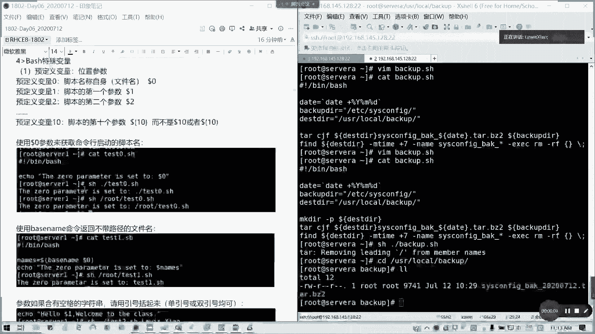

## 概述

在本节课中，我们将要学习Shell脚本编程中的几个核心概念，包括特殊变量（位置参数）、花括号扩展的字符串操作、命令的退出状态码以及脚本的退出控制。这些知识是编写健壮、灵活脚本的基础。

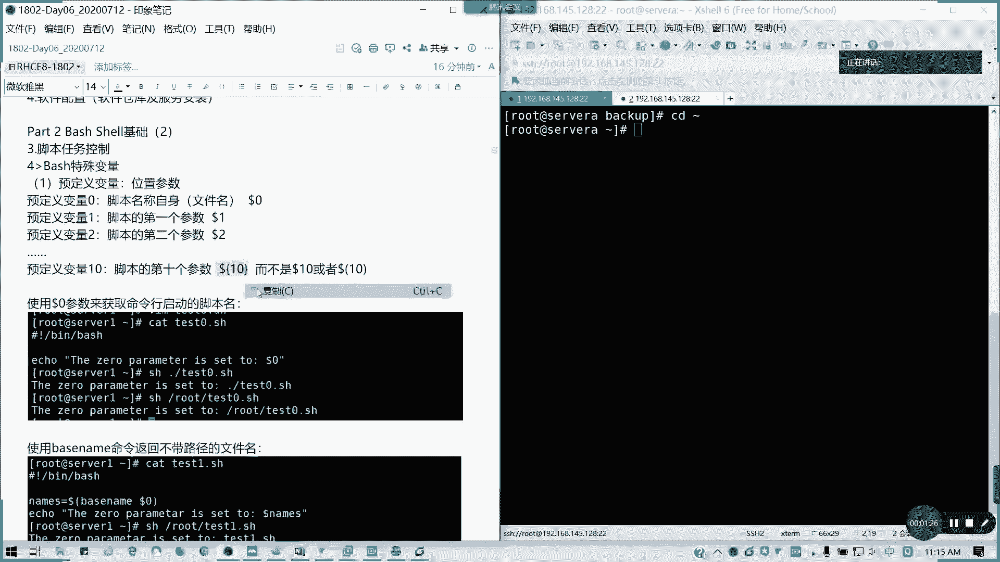

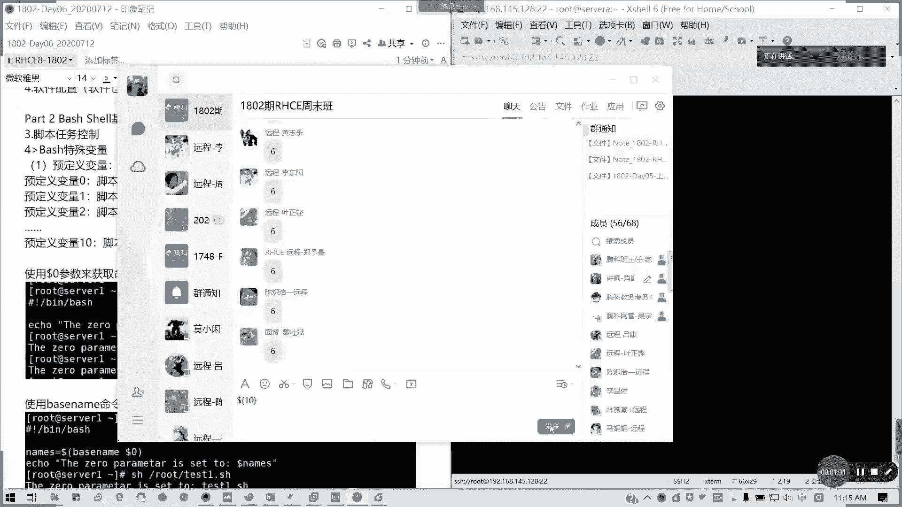

上一节我们介绍了任务控制，本节中我们来看看Shell中的特殊变量。

## 特殊变量（位置参数）

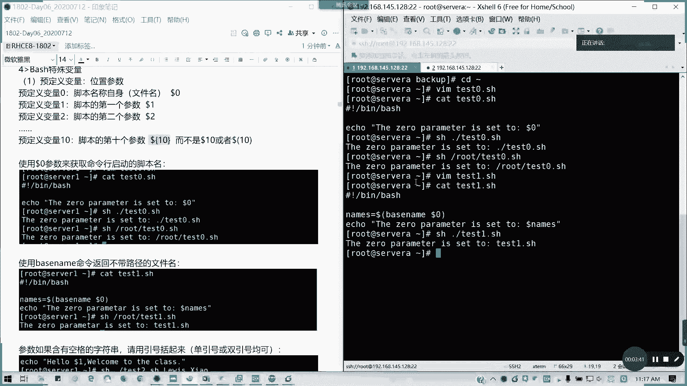

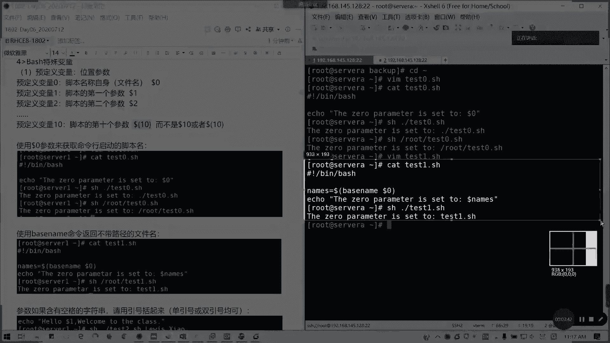

在Shell脚本中，有一些预定义的变量，称为位置参数。它们用于接收传递给脚本的参数。

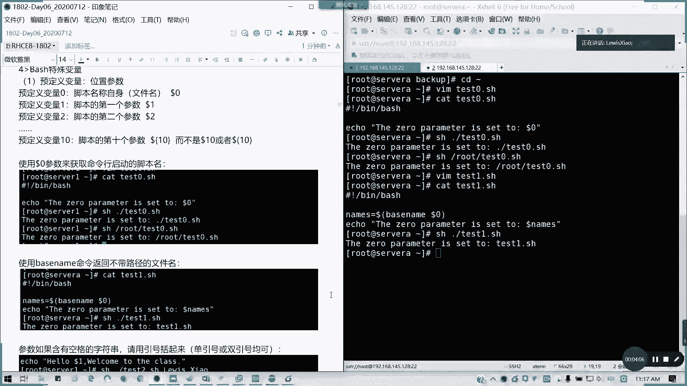

以下是几个重要的位置参数：
*   **`$0`**：代表脚本自身的名称（即文件名）。
*   **`$1`**, **`$2`**, ..., **`$9`**：分别代表传递给脚本的第一个、第二个到第九个参数。
*   **`${10}`**, **`${11}`**, ...：当参数位置超过9时，必须使用大括号`{}`将数字括起来，例如`${10}`。这是为了消除歧义，否则`$10`会被解释为`$1`后面拼接了一个字符`0`。

我们来看一个例子，理解`$0`的用法：
```bash
#!/bin/bash
# 脚本名称：t1.sh
name=$(basename $0)
echo "The script name is: $name"
```
运行脚本`./t1.sh`，输出结果为`The script name is: t1.sh`。`basename $0`命令去掉了路径，只保留了文件名。

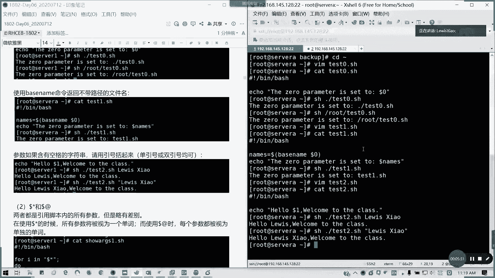

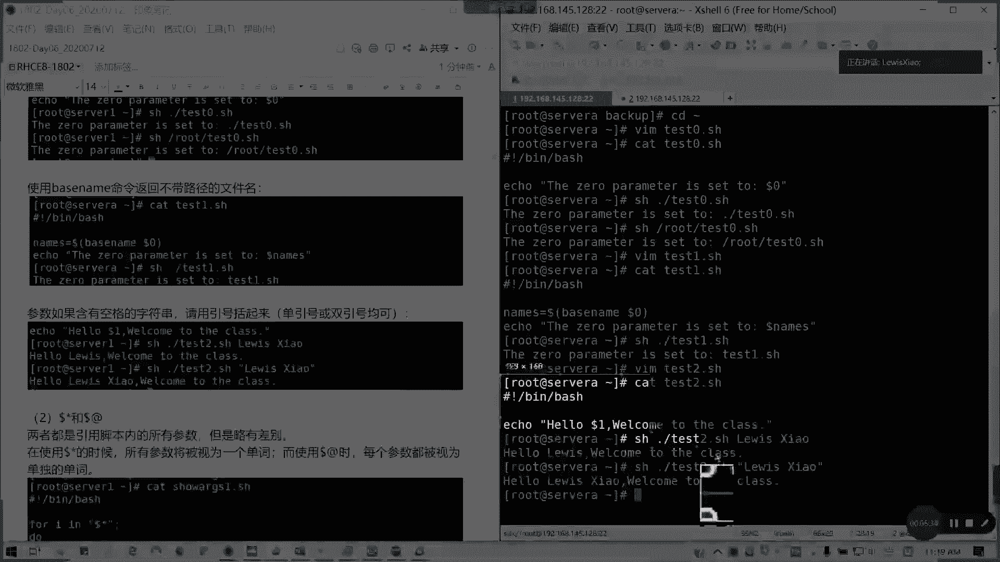

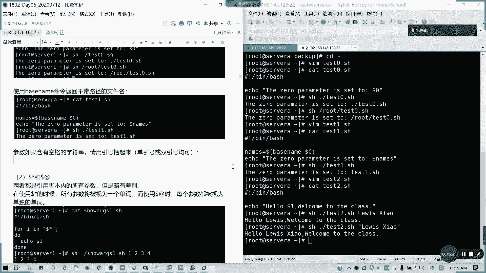

接下来，我们看看如何传递带空格的参数。创建一个脚本`t2.sh`：
```bash
#!/bin/bash
# 脚本名称：t2.sh
echo "Hello $1, welcome to the class."
```
如果直接运行`./t2.sh Tom Smith`，`Tom`和`Smith`会被识别为两个独立的参数`$1`和`$2`。为了让Shell将`Tom Smith`识别为一个整体参数（即`$1`），需要使用引号：
```bash
./t2.sh "Tom Smith"
```
这样，输出就是`Hello Tom Smith, welcome to the class.`。

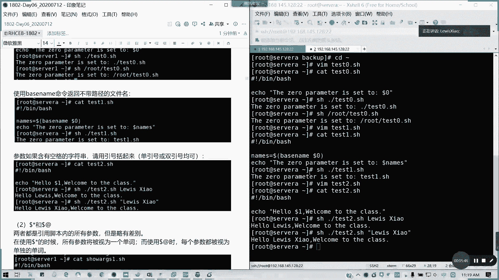

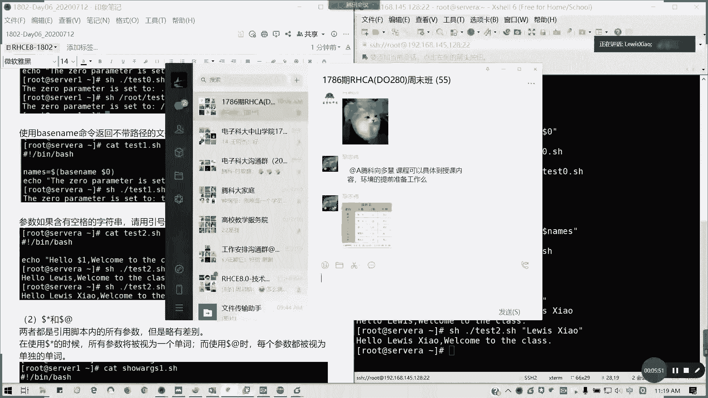

## `$*` 与 `$@` 的区别

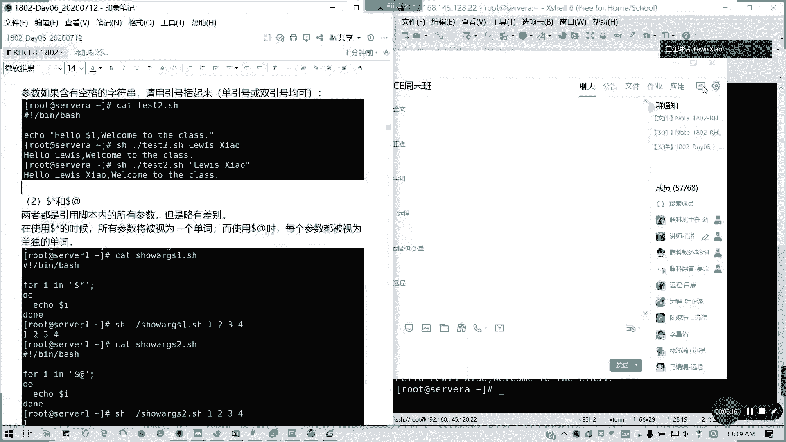

`$*`和`$@`都代表所有的位置参数，但它们在循环处理时有细微差别。

*   **`$*`**：将所有参数视为一个**整体单词**。
*   **`$@`**：将每个参数视为**独立的单词**。

我们通过一个例子来观察区别。创建脚本`loop_star.sh`和`loop_at.sh`：
```bash
#!/bin/bash
# loop_star.sh
for i in "$*"
do
    echo $i
done
echo "Number of parameters: $#"
```
```bash
#!/bin/bash
# loop_at.sh
for i in "$@"
do
    echo $i
done
echo "Number of parameters: $#"
```
运行这两个脚本并传入参数`1 2 3 4`：
*   运行`./loop_star.sh 1 2 3 4`，输出为一行`1 2 3 4`，然后输出参数个数`4`。
*   运行`./loop_at.sh 1 2 3 4`，输出为四行，分别是`1`、`2`、`3`、`4`，然后输出参数个数`4`。

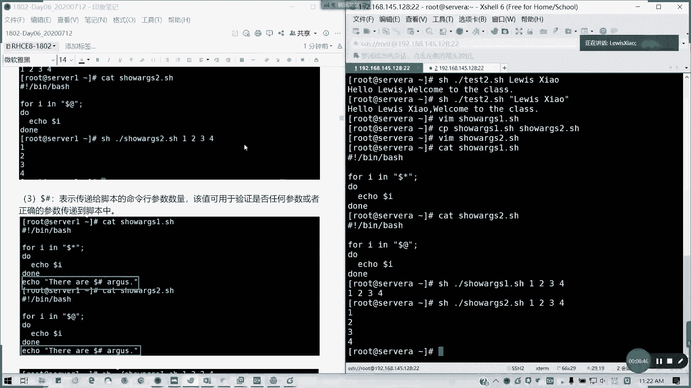

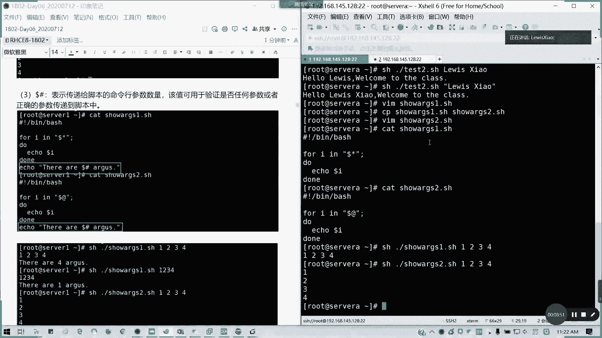

**`$#`** 是一个特殊的预定义变量，它表示传递给脚本的参数个数。

## 花括号的字符串操作

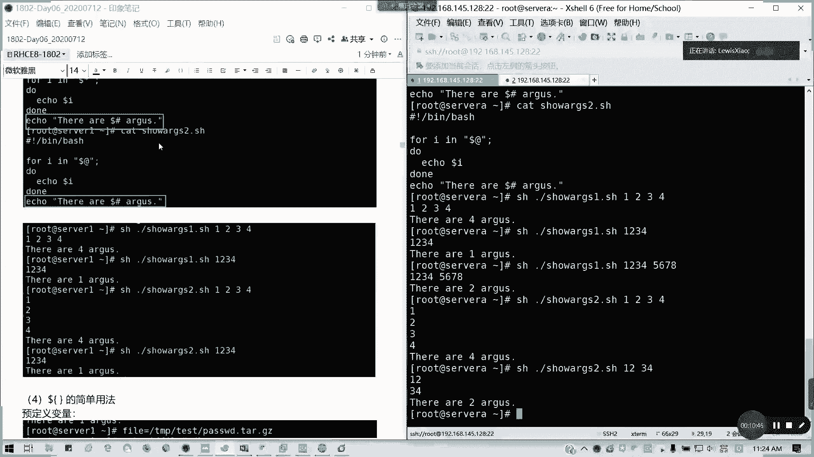

花括号`{}`配合特定符号可以对变量存储的字符串进行截取和替换操作。这是一种强大的字符串处理技巧。

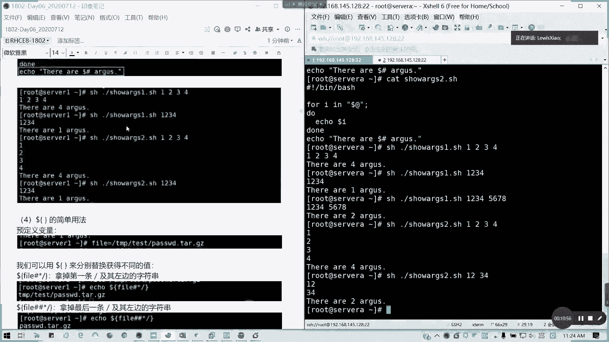

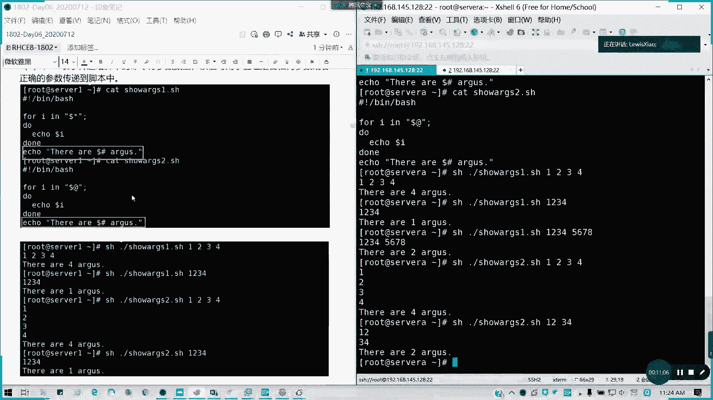

定义一个变量：
```bash
file="/tmp/test/file.tar.gz"
```

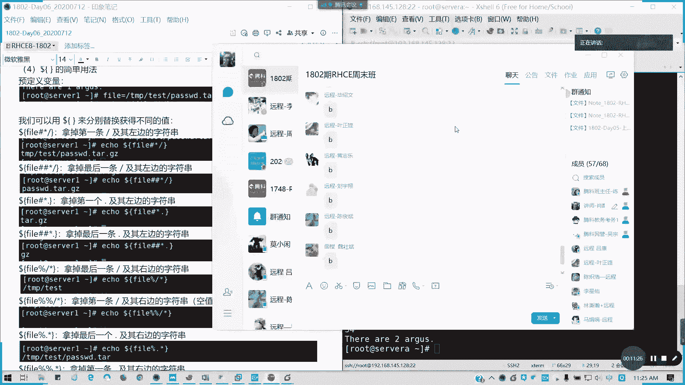

以下是基于`$file`变量的操作示例：

**1. 删除匹配的字符串（从左侧开始）**
*   **`${file#*/}`**：删除**第一个**`/`及其左边的部分。结果：`tmp/test/file.tar.gz`
*   **`${file##*/}`**：删除**最后一个**`/`及其左边的部分。结果：`file.tar.gz`

**2. 删除匹配的字符串（从右侧开始）**
*   **`${file%/*}`**：删除**最后一个**`/`及其右边的部分。结果：`/tmp/test`
*   **`${file%%/*}`**：删除**第一个**`/`及其右边的部分。结果：（空）

**记忆技巧**：`#`在键盘上位于`$`的左边，所以代表从**左边**删除。`%`在键盘上位于`$`的右边，所以代表从**右边**删除。单个符号是最小匹配，两个符号是最大匹配。

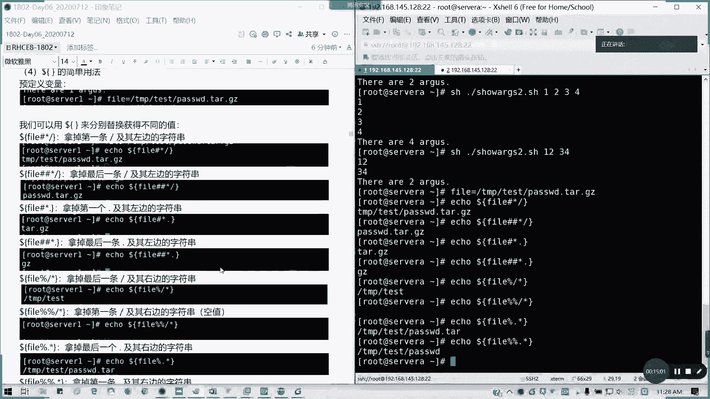

**3. 提取子字符串**
*   **`${file:0:5}`**：从第0个字符开始，提取5个字符。结果：`/tmp/`
*   **`${file:5:5}`**：从第5个字符开始，提取5个字符。结果：`test/`

**4. 字符串替换**
*   **`${file/s/S}`**：将**第一个**小写`s`替换为大写`S`。结果：`/tmp/teSt/file.tar.gz`
*   **`${file//s/S}`**：将**所有**小写`s`替换为大写`S`。结果：`/tmp/teSt/file.tar.gz`

## 命令退出状态码

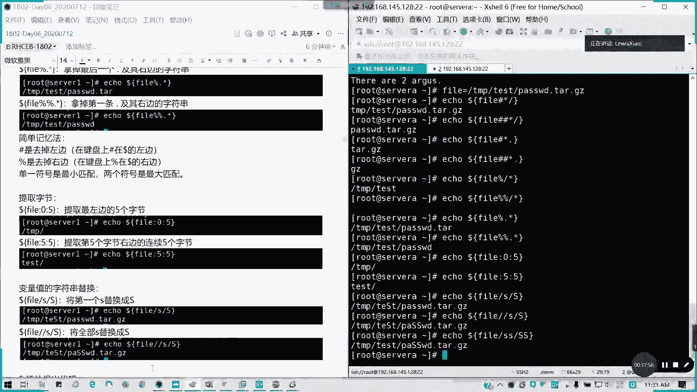

在Linux中，每个命令执行后都会返回一个退出状态码（Exit Status），也称为返回码（Return Code）。

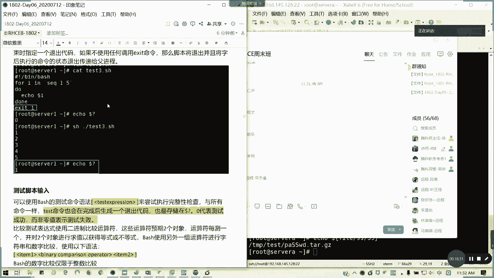

*   **`0`**：表示命令**成功执行**。
*   **非`0`**：表示命令**执行失败**，不同的非零值代表不同的错误类型。

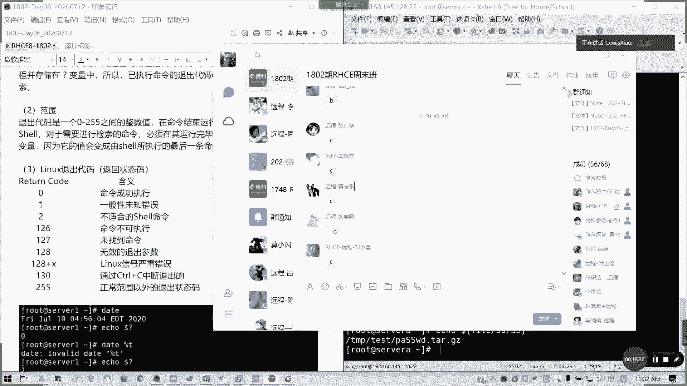

退出状态码存储在特殊变量 **`$?`** 中。需要注意的是，`$?`的值总是**上一次执行命令**的退出码，它会不断被覆盖。

常见的退出状态码及其含义：
*   **`0`**：成功
*   **`1`**：一般性未知错误（例如，无效参数）
*   **`2`**：误用Shell命令（例如，文件或目录不存在）
*   **`126`**：命令不可执行（例如，权限不足）
*   **`127`**：命令未找到
*   **`130`**：命令被`Ctrl+C`中断

我们通过命令行来验证：
```bash
ls /tmp        # 成功执行
echo $?        # 输出 0

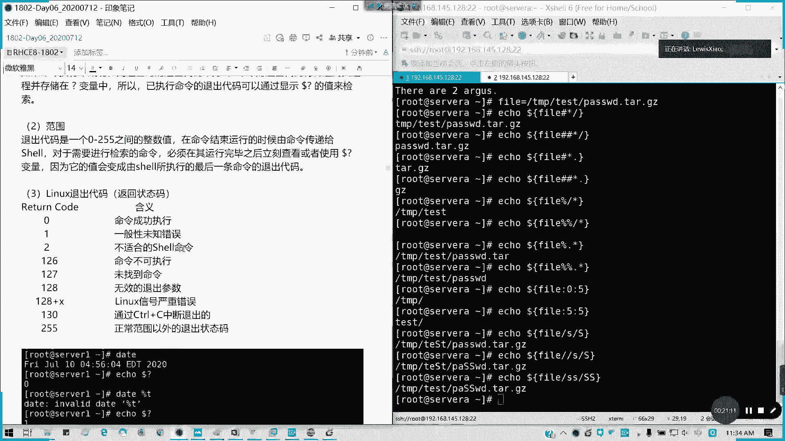

ls /nonexistent # 目录不存在
echo $?        # 输出 2

./a_script_without_x_permission # 执行一个没有执行权限的脚本
echo $?        # 输出 126

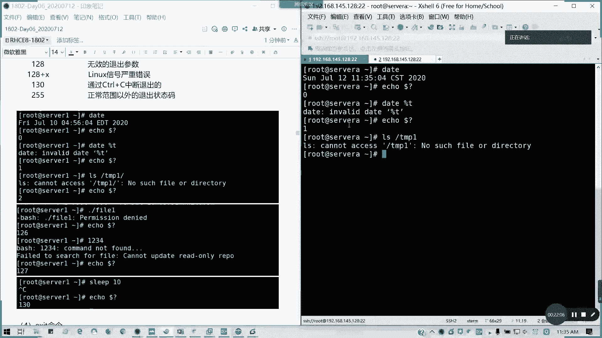

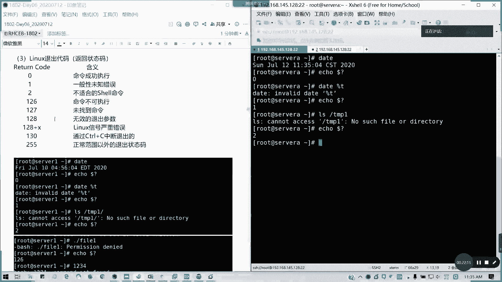

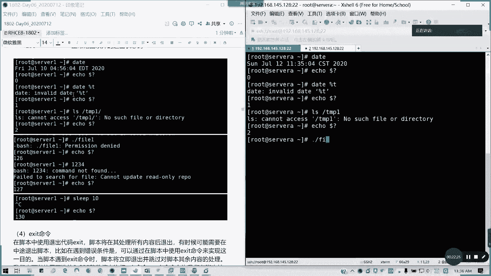

thiscommandnotfound # 输入一个不存在的命令
echo $?        # 输出 127

sleep 10       # 在睡眠期间按 Ctrl+C 中断
echo $?        # 输出 130
```

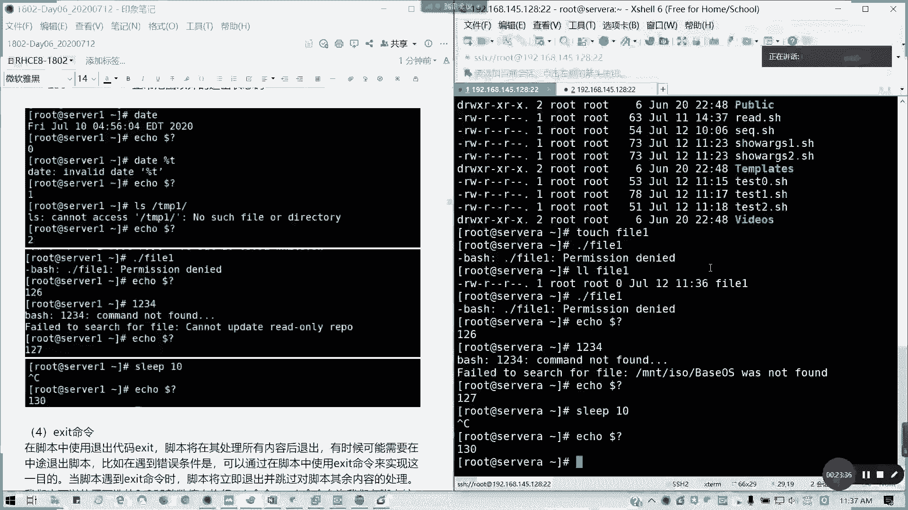

## 使用 `exit` 控制脚本退出

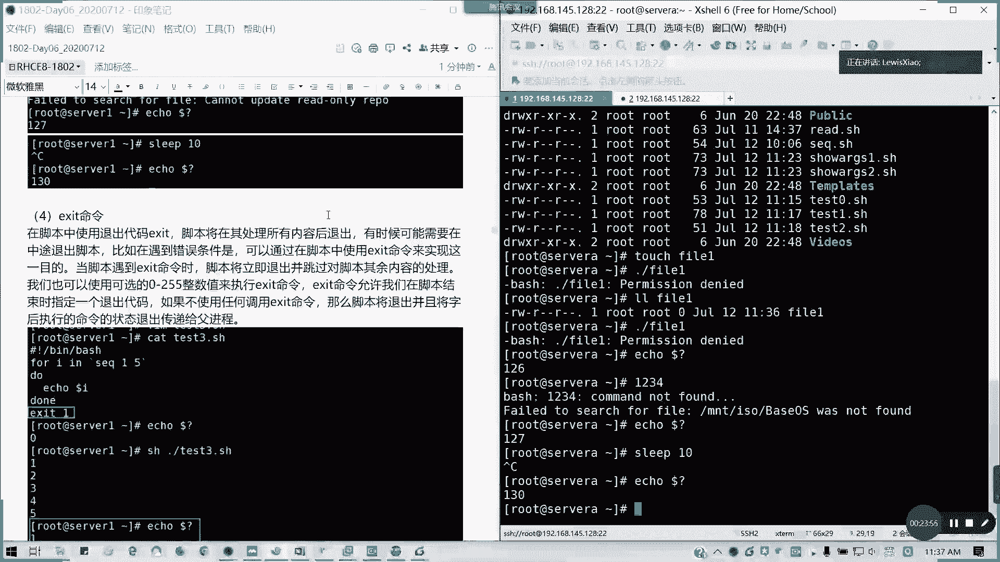

在脚本中，可以使用 **`exit`** 命令来立即终止脚本的运行。

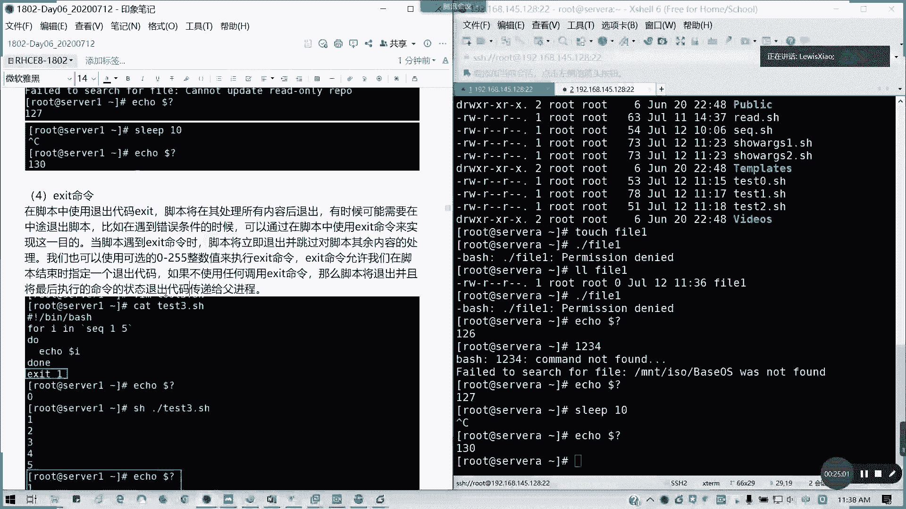

*   `exit` 后面可以跟一个 **0 到 255** 之间的整数，作为脚本的退出状态码。
*   如果不指定状态码，脚本将以**最后一条命令**的退出状态码作为自己的退出状态码。
*   当脚本遇到 `exit` 时，会立即停止，其后的所有代码都不会再执行。

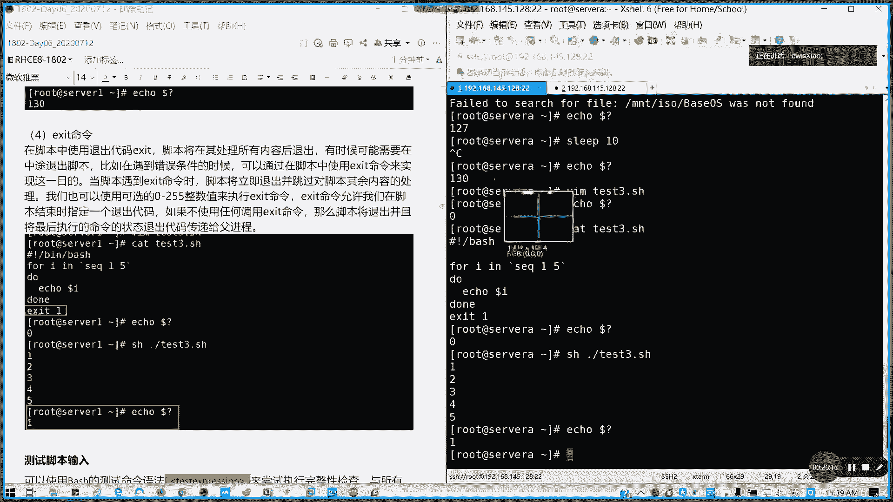

示例脚本 `t3.sh`：
```bash
#!/bin/bash
# t3.sh
for i in $(seq 1 5)
do
    echo $i
done
exit 1 # 指定退出状态码为1
echo "This line will not be printed."
```
运行脚本并检查退出码：
```bash
./t3.sh
echo $? # 输出 1，而不是 0
```
尽管循环成功执行并打印了数字，但由于脚本以 `exit 1` 结束，所以整个脚本的退出状态码被我们手动设置为了 `1`。`exit` 后面的 `echo` 命令也不会执行。

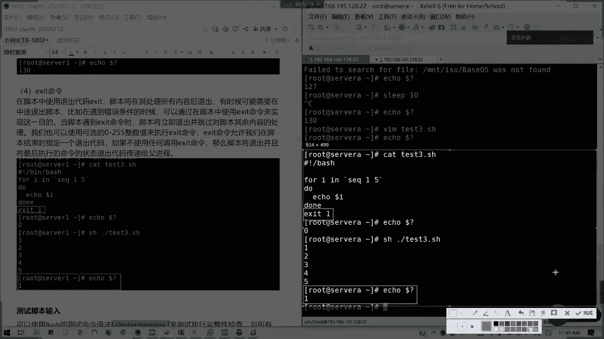

## 总结

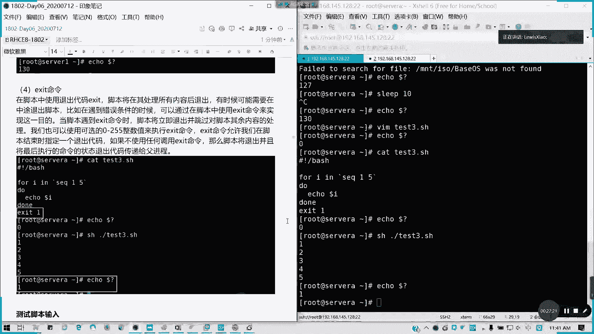

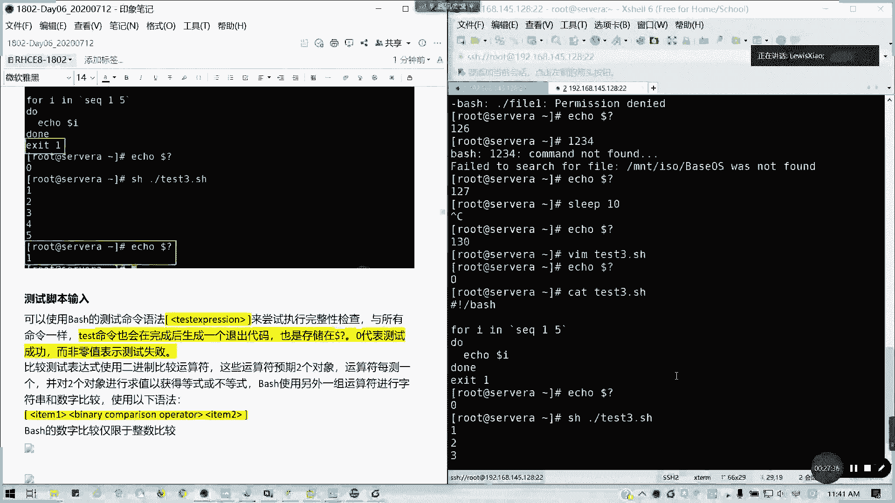

本节课中我们一起学习了Shell脚本编程的几个重要基础。
1.  **特殊变量**：了解了 `$0`, `$1-${n}`, `$#`, `$*`, `$@` 等位置参数的含义和用法，特别是处理带空格参数以及 `$*` 与 `$@` 在循环中的区别。
2.  **字符串操作**：掌握了使用花括号 `{}` 进行字符串删除、提取和替换的快捷操作，并学习了 `#`, `##`, `%`, `%%`, `:` 等操作符的用法。
3.  **退出状态码**：明白了命令执行成功与否的判断标准（0为成功，非0为失败），以及如何通过 `$?` 变量获取上一条命令的退出码。
4.  **脚本退出控制**：学会了使用 `exit` 命令在脚本中主动退出，并可以自定义脚本的退出状态码，这对于脚本的错误处理和流程控制非常有用。

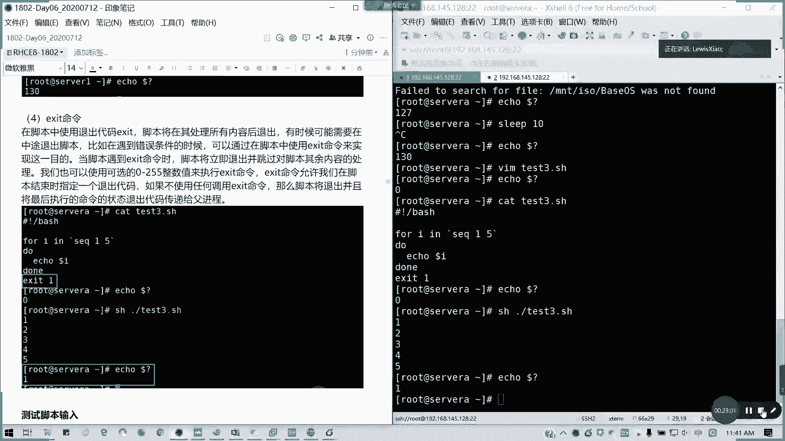

掌握这些概念，是编写更复杂、更可靠Shell脚本的基石。下一节，我们将开始学习如何在脚本中进行条件测试和判断。