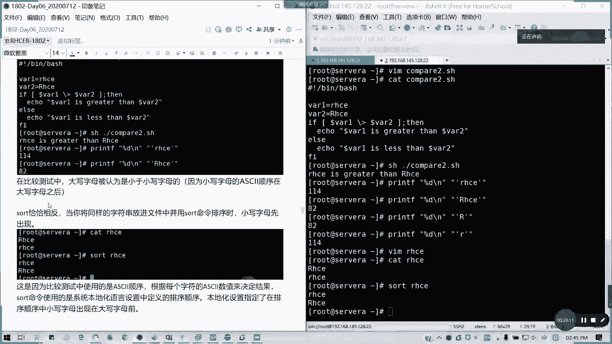
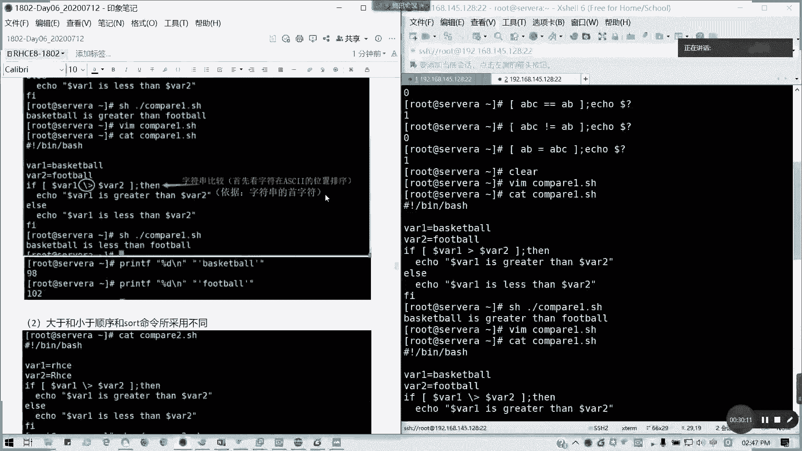

# 拿下证书！Redhat红帽 RHCE8.0认证体系课程 RH124+RH134+RH294三门认证视频教程 - P34：34_Video_Day06_RH134_Ch01_Shell基础05 - 16688888 - BV1734y117vT

好，那我们下午啊阅冰时间14点17分啊，北京时间14点17分。那我们接下来继续炫耀的内容。我们上午讲了呃，到讲到退出代码。现在接下来我会讲一下测试脚本输入，可以使我们可以使用fsh命令的测试语法。

叫做ts expression。就是我们里面有一个叫做测试表达式。测试表达式啊，我们来尝试执行我们完整性检查，跟所有命令一样。test命令呢，我们的测试命令也会在。完成啊完成之后呢，生成一个退出代码。

也是存储在我们的doode井doode问号啊，doode问号上面，doode问号上面呢。0如果是返回值为零的话，代表测试成功，非零则代表测试失败。比较测试表达式呢，我们通常使用二进制的比较运算符。

这些运算符呢预期为两个对象。运算符每测一个呢并用两个对象进行求值来获得等式或不等式。通常来说，我们bes是使用另外一种运算符来进行字符串和数字比较，使用以下语法item一，我们的二进制表达式item2。

我们通常看到啊，首先我们的数字比较。数字比较呢。仅限于整数啊，我们的整数比较符啊，大家看一看。我们bech啊，我看到我们的投影或者是我们的会议啊。

bech的数字仅仅限于整数比较以下二进制比啊以下二进制运算符在bech的数字比较里面可以用像杠1Q是等于也就是equals啊，英文的简写equals等于。N一n equals不等于对不对？

杠N1杠GT greater than大于杠G1。greater equals大于等于是吧？greater等于 equals大于等于LTless than对对？

小于小于等于是LE less than equals啊，这个能理解。那我们现在看一下例子啊，看一个例子。我们我这里清一下屏，我们开始看一下例子。比如说我这里我就不再写脚本，我通过b share的运算。

我的直接通过命令来比较，好不好？为什么说仅限数字呢？比如说我要直接有一个浮点数。是吧要浮点数。来比较看行不行呢？记住啊，我们这个括号里面的一个比较比较的话，我们前后。前后加空格啊。

我们这里养成一个良好习惯，前后加空格。然后我运行两个命令是吧？他这里是要求说那个。会出这个错误啊错误，它返回值返回二了啊，因为它要求是整数，所以3。14是不行的，懂吗？就不能用浮点类型，要这种整形。

那我们现在用这是一个错误的示范。那我们现在开始。比如说。我一。等于一。然后我同样输出一个e的多的问号。对吧我们每执每执比较一个执行个多罗问号状态，它是通过比较值啊，就是比较成。测试成功的话。

它会输出一个零，对吧？也就是条件符合，对吧？我们前面的条件一等于是不是为真啊？为帧的话，它它那个多的问号是不是零啊？对不对？那如果把它改成一不等于一，它的测试结果就为。E的do的问号是不是一呀？

一不等于这条件为甲。对吧我的测试表达式为甲，那它的那个多的问号就是一了。还有呢。5不等于3。这个是多少呢？零对吧？表达式为真。如果把它换成GT呢？也是0，对不对？然后呢，还有。这样呢。也是零，对吧？

二大于等于2正正确的。然后呢，我不如我换换成杠LT。Yeah。输出一对对，非0。如果是他。零对不对？2小于等于2这个成这个为真，对不对？还有个办。对，这一小于一小于等于2为真，对不对？

那还有我如果我们用比较复杂一点，我们用判断。对吧。比如说这样子一大于等于2等是吧？这是我们的我们的那个条件判断的写法。这里我就直接可以直接可以在sll里面啊。这里我们可以直接用sll来执行我们的那个。

我们的语句都没有问题啊，因为它都是用s解析器。就把一句学成一堂。输出什么结果？没错的。然后还有呢。我们可以我们也可以用那个。我们既可以。用方框，我们用那个表达式，我们也可以用两个括号括起来。

两个小过括起来也是可以做算术运算，对不对？所以这里的话也是同理啊，两种用法一一模一样，你可以用杠GT是吧？或者是如果要我们要用数学符号的话。就是用两个括号括起来。对，以上截图是我们的。

数学运算符吗？数学运算嘛，上次不是讲了吗？昨天。两个括号嘛等于方括号这样子一个里面表达式。两两个小窝括起来。对。就等于上面的这个。这两有有没有发现他上下两个等同的？

所以我截图放这里。

都是一系列例子啊。好，接下来我们讲完数次讲字符串啊。它既有数字比较。

也有我们的字符串比较。

字符算比较呢，我们有三种啊。3个一个是等于一个是横等于。一个是不小不等于哈。其实这两个等这个恒等于是绝对的啊。我们通常如果要绝对性比较的话，这两个是很等于的话，这两个是一模一样的。我们来看一看。例子啊。

同样也是我们前面一个表达式，后面一个多的问号。🎼ABC等ABC。0对不对？恒等于的话也是0，没有错。ABC等于AB呢。那就是输出一啦。然后还有一个不等于。对吧不等于。那刚才等于这个AB等于ABC呢。

同样是一哈。其实通常来说，我们习惯来说是写两个等于号，也就横等于。

我待会我再截图啊，请大家在线。然后呢，我们来看一看当我们。比较。当我们比较这一个啊。比较这个什么呢？比较这个四分大小时候呢，我们要必须注意以下问题。第一个我们的大于号小于号。必须转移啊。

我们大于号小于号必须转移啊，否则他们会当成一个重定向。懂我意思吗？就不拖到重新向符号帮字符直穿变成文件名了。因为它是有特殊含义的。加反斜杠没有错。就如果是这分大小，如果就大于小于的话，大于小于号啊。

就是变成这样了。这是这是大于。这是小鱼对不对？那我们来看一看啊。再看一个例子啊。我们写一个脚本。compare1点SH我们来看一看。这脚本我们怎么写呢？我想想啊，这个脚本要怎么写好？同样我们解析器。

然后呢，我们通常我们定两个变量。万一。本于。basketball篮球就字符算比较啊。one2等于football足球。好了。我们写一个判断条件，if。VIR dollar了VRE。大鱼。这是一个表达式。

所以它大于号的话，它是不用写这个的啊。大于V2。That。哎好。多了。Z1。Is greater。哎，我的。符号票跑了is。Greater。Then。到了。Y2对吧。然后。Elf。要你们说什么呢？

Ele。就输出另外一个信息，对吧？VRE。Is less than。到了白22。然后呢，后面FI结束啊，这个待会儿我们讲到如何去写判断的，选选这个条件判断。这里我保存退出。然到这里啊。对吧文字封面比较。

是B在。F之呃B在F之前呢。对不对。这B到F之前，它就是这样子，没错，对不对？然后如果我们还有一种啊，我们把这个compare一我们。做字符算比较，如果是这样的话。加一个转移。我们会得到什么结果。

这改过的啊。为什么会出现这样的情况呢？为什么我我会加我加了一个转移之后呢？为什么出现这样情况啊？你知道为什么会出现这样的情况？

一个读长度，一个读字节的长度，读字母顺序啊。其实读字母顺序才是正确的，因为它这里为什么会这样呢？为什么图为什么一一个是读那个。一个是读字节长度是没有错的啊。它是数值的长度嘛，上面我们是读长度的。

下面呢下面为什么会B会小于F呢？这是一个，因为是阿斯柯玛的排序位置，首字母巴阿斯克玛的排序位置决定的F是在B之后。对啊，F大，所以的话B会小就basketballB小于F嘛。懂吗？家。谁数加起来的？

和这是字符串的比较哦。这比较的话，它上面是比较它的。长度啊就是就如果是不加的话。但是如果加加了之后呢，它上面是相当是数学运算啊，这个是这个长度比它大。但下面如果字分比较的话，我们加了一个几加了之后呢。

它会比较这阿玛的大小的。懂吧？阿柯玛比他大，所以所以说阿斯柯玛B比F小，对不对？

对这个我要截个图，这个是有区别的啊。所以我这里做个注释。这是数值比较。比较的是我们的字符串。长度也就是字符个数啦。对吧。然后这里的话是一个字符串比较。主要是区别在这里啊，哎我这里画个圈圈就知道了。

这稍微拖动一下，不然的话那个。先同学们改一下位置啊。不的话这会挡到的。

主后他的那个用字符做比较的话，它是有要看两种情况的啊，看两种情况。他阿斯克玛其实是确实是这么排的。然后呢，还有就是我们的大小大于小于的顺序，跟我们st命令采用的也不一样。啊。

大于小于顺序跟st里面就我们顺下来。也不一样，我们还还有另外一个例子。下面我们先不看，我们看一下例子啊，我叫compare2点SH。

那大家有没有疑问啊？对啊，对吧？它的那个数值大小，其实也就是我们孙正普同学啊补充的一个资料。

他printD是吧，我哎这里好像复制不了啊。截个图才能才能才能弄啊。哎，不截图了，我直直接写吧。Print print啊。降低是吧？杠N吧。Afootball的值。102对不对？

就比这个地方。

看一下啊。第一个。🎼我问一下大家，这是比哪的啊？对呀，阿克玛的顺序没有错啊。他存在位置是在98跟102。对吧。对啊，比这个字母嘛，那这个这串的话挺比这个字母，然后它比它大不就大了吗？就阿斯克玛。

所以字符串跟那个数值是意义上是不太一样的对吧？所以有时候人家很理解说为什么我逼别我逼别在F之前其实不是这样子的。阿斯克玛它有一个固定的存储顺序。然后呢，还有一个。还有一个就是一个。我们还有一个例子。

就是一个大于小于我们大我们那个大小写对吧？大小写我们看一看。大小写，我们同样写一个剧本，写一个脚本。我定义层VR3等于。然后其他的等一下，我把因为剧本差不脚本差不多，我把他那个脚本复制过来好了。

那我改一下。我这里同样还是VR1VR2。知知道这样会什么结果吗？我们输出的结果是小写字首字母，小写字母的小首字母的还大过它。

我们通常来说啊。因为也是因为阿斯柯玛的关系啊。在大写字母之前。所以呢为什么小写会比他大？懂我意思了吧？小写是在大写的前面。大写是小一小之后啊，说错了。对吧小写在后面，大写在前面。

它的数值其实我们可以用刚才的print D啊。114。82。对不对？

一比较就知道了。对啊。你看它是比较首字符的嘛，首字符相差32。对，所以的话这个就理解为什么说它的比较会是小，它它的小写为什么大于的了？

而且它是比较手字符啊，后面它。后面不管了。

对吧我们刚才试了一个首字符，两个字符也是一样的结果，对不对？手字符的。

所以这里的应该应该是首字符啊。

像我们的话，像salt的话是恰恰相在我们比较里面，st恰恰相反啊，它是这同样字母放放salt里面呢，它是小写字母优先。然后大然后如果是文件名呢。我这里啊直接。对编辑个文件，比如说我文件名是EGG是吧？

不啊，就是文件名叫RHC，然后RHC我就大小我大写放在小写后面。我看出来。是这样子对吧？但是我扫置出来。是小写放在大写前面了，对吧？也所以刚才我们。其实比较出来也是应该这样的结果啊。就大写字母。

为什么小于小写字母？因为就因因为就是这样的一个原因啊。小于小的字母，但是恰恰相反呢，就是那个。

我们在st排序的时候，小写字母先出现。

所以说因为我们比较测试里面是比较他在他字首字符啊，实是那个。使用的是ask克码顺序啊，ask克玛顺序，因为每个字符在ask克值是决定结果的，但salt呢。它是使用本地话的语音设置。

本地里面的是小写字母出现在大写字母前。对不对？我们我们通常如如果我们那个普通排序是不是大写，因为它的它先出现嘛，它小嘛先出现。它然后反过来我们本地话的语言的话就是小先出。

懂懂我意思吗？所以这个是有区别的。

能理解吗？能理解的话，打个一。

对我在我我结合起来写一个，就是这里是我要注释，是首字符。

主要个同学去掉。可以理解了哈。😊。

那好，我们也有一个我们还有就说了比较重嘛，还有一个叫做1元运算符。8次符算求值1元运算符。因式计算符的话，通常它是。一第一第一个一个运算符，后面加我们的一个字符串的表达式。

像我们这里啊下面下面我们表得就是它的是。唯空或不为空啊，为空或者不为空。那我们看一看啊，有一个例子给大家看一下。来，我们看一看我们用字符串。来求这个。来来进行运算符啊，我这里training。等于。

你们什么都没有。然后呢。用我用杠Z。然后引用多了str。这里也前后加一个空格，我们为了。规范啊，然后apple。高的问号猜是几？杠Z代表字符串的长度为0。也就为空啊。它是零，对不对？因为它这个条件为真。

这里是没东西啊。然后这里我们换成杠N不为空，那也是零，对不对？也也是0，因为它的条件为真，所以的话我们的1元运算符。

是这么用的。这是例思啊。接下来我们讲。第七个点啊。测试。刚才讲第六个，对不对？第个测试小本书。第七个是测试。文件。和目录。测试文件的目录呢，通过我们的字符串和二进制的运算符。

用户可以贯彻说不假定sha输入完整性的一个啊良好做法。当shall与外部实体也就是我们的文件跟目录啊，文件目录等到交互的时候，同样应该谨慎。所以我们best share呢里面提供了大量的运算符啊。

大量运算符。比如说我们里面啊。杠B就是文件存在，而且是快设备啊。快特殊的话就是一个快设备。然后呢，如果杠C的话，文件存在，并且是它是一个字符特备。杠D后面加目录，杠B杠C再带文件啊，杠D的话。

它是文件存在，并且它是目录，也就进行一个判断了啊。然后杠一文只是说文件是否已存在。杠F呢文件存在，而且是它的是常规文件。其实这种就判断我们的文件类型，懂吗？然后杠L呢就是它是一个符大L啊。

它是一个符号链接。软硬链接啊。对对，L码。然后杠R是只读权限。杠S就是它的那个文件存在，并且大小大于0，能看得清楚吗？杠S，然后杠W。有写权限杠叉就是执行权限。

然后还有就是几个还有几个那个二进制比较运算符。用于比比较说，比如说它的设备跟索引编号就是一个I know，它存在在同一个设备上，而且它的I know相同就杠CF。然后还有就是它的修改日期是吧？

比它晚比较早，一个是NT是吧？比他晚呢就是NT。比较比较早是OT啊比较早OT这几个好像也不太常用。然后呢。测试表达式括号中空格字符，以及在用于测试出表达式分隔元素控格字符并非是为了可读性啊。

不是说为了好看，它其实必须的啊。就是说我们前后面的一个空格是要留出来的。如果缺少其中的任何的一个空格字符呢，那么测试会失败或者产生不意外不正确或意外的一个结果。那我们来看一看以下的例子。看我看我右边啊。

第逼。哎，的还还没敲完呢啊。杠B。我们的DEV的。NV米林。呃，你。P1对不对？我们的分区。他这里是什么意思呢？就证明这文件存在，而且它是一个快设备。是不是零啊？但是我们分区是不是一个快设备啊？

然后字符设备。比如说我们光驱。啊，光驱博是啊。字符设备，比如说我们的。一个硬盘，而不是分区了，对吧？硬盘本身是字符设备，因为它是通过电流来控制的对吧？高低的，但是分区里面它是可以用随就随机读嘛。

所以它是一个快设备。我们在前面是不是讲了。然后呢。比如说我VRRTMP。四个目录。对吧。还有呢就是我们的文件是否存在。然后他是不是一个常规文件啊，不是啊，我这里的话我用那个。这文件不存在啊，比如说。

他是做一个常规文件，对不对？

这常规文件的话就是为0。

所以我这里我截个图啊，这也是用于我们的一个二进，我们对于文件目录的一个二进制运算符的一个测试。

明白吗？这个。这个okK的话，接下来我们会讲到一个逻辑逻辑运算符的，逻辑运算符等一等啊。这块明白的话，我看一下大家的情况，这块明白的话请打2。对对于我们的测试这一块，如果明白的话，请打2。

接下来我们讲逻辑运算符啊，逻辑运算符也就是我们的那个。我们的条件两个或两个以上的是吧？复合测试，我们的逻辑复合测试逻辑运算符。逻辑运算符呢。b的逻辑运算符，它是那个。比如说它的N跟or是吧？

N呢两它是两个N的，它逻辑是两个N的，它用于测允许用户执行负合条件测试，以了解这两个条件是否均成立啊，和的运算。那与的运算啊A的运算符与运算，然后or运算符或运算两个竖杠，对吧？

两个竖杠呢允许用户测试两这两个条件的。其中一个是否成立？所以通常我们的命令格式啊命令格式就是command一，command2comd3，对不对？我们的格式是这样子的。说明。

命令之间采用NN就两个N连接，实现逻辑语的功能。这里的我用雅黑啊，用用回雅黑DY，这样的话清楚一点啊。然后只有。这是逻辑语哈逻辑语的格式。就命令之间采用两个N连接，然后呢，只有它左边为针。

才会执行右边的命令。只要有一命令返回甲，那就帕会不会被执行。这是逻辑语的。然后我们还有一个叫逻辑货。有雨就有货嘛，这个东西。罗旗。或。逻辑获的格式啊，上面是逻辑语的格式。

就command一command2用双数线啊命令啊说明。命令用双竖线连接，然后呢，只有在左边返回为甲的时候，右边才会执行。这跟C语言。一样，因为这是要做短路逻辑，懂吗？只有左边为甲，右边才会被执行。

只要有任何一个命令法规针。只要有一个病法的证，他就不会只不会做了。所以我们来看一下我们的例子。我们看一下我们的例子啊。例直这样子的，同样我们通过数学运算来简单的说明。告诉我这个值。这个多的问号是为多少？

诶。哦，我这里找了个空格啊。不要你这到时这样空格的话是绝对不对的啊，它会别人识别这命令的。所以为什么在表达室没有空格？如果没有空格的话，它会实现成命令的。0对不对？所以为什么表达式要空格啊？

这里我要说明，刚才大家都看到了，如果不是的话，你就变成一个命令了啊。然后呢，继续写。其实我们也可以转化为。把它合成一个杠A代表N的一模一样。两种写法效果是一模一样的，用两个N的。或者。Commod一。

杠A。好慢的啊。杠A command慢子3。对不对？这两种写法。一模一样。都可以啊。好，接下来我们看一看。如果改成这样呢？告诉我结果。主要有一个是甲。对啊，就就为假了，因为它是要逻辑语嘛。

这三个就是我们上面的例子。那么这里的话同样。我们也可以写成。杠O。オ嘛。杠A就是N的，对不对？Greater than。规头镇大鱼嘛。来s代码，然后。

归等 equalsSt等 equals就大于等于更小于等于嘛。来我们来看一下罗辑货的例子。我们把上面这一道题，我们这里改成逻辑货。V0对不对？还有一个。对啊，后。这有个证的话，他后面就不会被执行了吗。

然后呢，我再看一看。两种写法。也是一样的。然后继续。这样呢。为甲好吗？2小于小2小于一。一小于0。二小于，他前面有讲，那后面的命令我才会比较啊。对吧。短路逻辑嘛。你刚才为什么前前面这个一小云。

他不会他不会管他不会管他了。对吧只要前面我一震荡，后面就不会被执行了吧。懂我意思吗？这是短路逻辑。二货这他真假返回真，对不对？甲甲返回甲。假真反为真。对吧。

这才是all的一个 old的一个我们的一个常识的一个习惯哦，对吧？这叫短路逻辑。还有我们还有一个例子啊。我们看一下。我们可以用于这是数值判断。我们可以用于一个文件判断，我们再写一个叫做。

怎么写这么多表达式之后呢，我们来写一个。刚才我们是写了compare2，我们写一个compare3。comp配3呢。我来写一个来嗯。我看是怎么写好啊。If。降低多了吼。🎼这加目录啊，多了ho and。

杠W。ho下面的一个。Ps fire。That。Ele。The fire exists。And。You can write。Not to it，然后 else。

这是一个证明你文件可可就可不可在可可不可写的过写一个简单的语法。后面FR结尾。

那我们来看一看啊。为什么出现这个结果？因为我没有这个文件，对不对？我这文件不存在，它前面你你前面的条件为真，对不对？它这个这个目录是加目录，对不对？我这这个目录存在，而且是文件夹，那后面我讲。

那我踏取一个。到 test fire。再执新这个脚本。对吧。作文件可写的。因为他的那个test file的属性，我们的那个。他就是不是作为我们的那个默认的叔主，是不是有企业权限呢？

这里的话我把这个脚本截下来。应开始的执行结果是这样子的。那么LL里面根本没有这些文件。那呢我们后面touch之后呢。因为这样我们才能把就变文文件存在，那就是可写了。因为它的权限有W嘛。

OK我们先讲这么多，待会我们讲条件结构，休息15分钟。这个这个地方明白的话，请打3。接下还有条件结构、分支结构以及排错，就剩这三个部分了，我们的shall。

