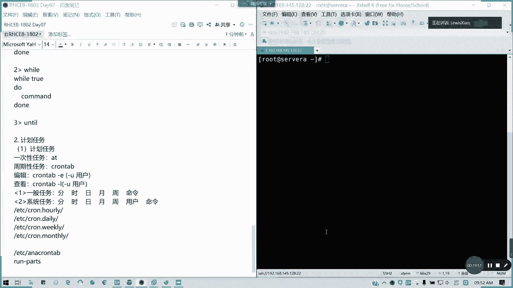

# Red Hat RHCE 8.0 认证课程：Day07：Day06 课程回顾 📚


在本节课中，我们将回顾第六天课程的核心知识点，包括Shell脚本基础、文本处理工具、变量操作、条件与循环语句以及计划任务。通过本次回顾，帮助大家巩固所学内容，为后续学习打下坚实基础。

---

## 1. 变量与赋值 🔢

上一节我们介绍了Shell脚本的基础，本节中我们来看看变量操作的核心要点。

*   **变量命名规则**：变量名不能以数字开头，可以以字母或下划线开头。
*   **变量取值**：使用 `$` 符号引用变量值，例如 `echo $VAR_NAME`。
*   **数学运算**：可以使用 `let`、`$(( ))` 或 `expr` 命令进行数值计算。

以下是变量操作的示例：
```bash
# 变量赋值
name="RHCE"
# 变量取值
echo $name
# 数学运算
result=$(( 5 + 3 ))
echo $result
```

---

## 2. 文本处理工具 🛠️

掌握了变量后，我们来看看处理文本数据的强大工具。

以下是常用的文本处理命令及其功能：

*   **`awk`**：强大的文本分析工具，可以按字段处理文本。例如，`awk -F':' '{print $1}' /etc/passwd` 会以冒号为分隔符，输出第一列（用户名）。
*   **`sed`**：流编辑器，用于对文本进行过滤和转换。它按行处理，支持正则表达式。例如，`sed 's/old/new/g' file.txt` 会将文件中所有的 “old” 替换为 “new”。
*   **`grep`**：用于搜索文本中匹配指定模式的行。常用选项包括 `-i`（忽略大小写）、`-A n`（显示匹配行及其后n行）、`-B n`（显示匹配行及其前n行）。
*   **`cut`**：用于从文件的每一行中截取部分内容。例如，`cut -d':' -f1 /etc/passwd` 效果与上面的 `awk` 示例类似。

**注意**：`sed` 命令默认只输出结果，不修改原文件。使用 `-i` 选项会直接修改原文件，操作前建议备份。

---

## 3. 正则表达式与特殊变量 🔍

文本处理离不开模式匹配，本节我们回顾正则表达式和一些特殊的Shell变量。

*   **正则表达式**：用于描述字符串匹配模式。例如：
    *   `^` 表示行首。
    *   `$` 表示行尾。
    *   `*` 匹配前一个字符零次或多次。
    *   `?` 匹配前一个字符零次或一次。
*   **特殊变量**：
    *   `$?`：上一条命令的退出状态码。`0` 表示成功，非 `0` 表示失败。
    *   `$0`：当前脚本的名称。
    *   `$1`, `$2`...：脚本或函数的位置参数。
    *   `$*` 和 `$@`：代表所有位置参数。
    *   `$#`：位置参数的个数。

为了消除变量名歧义，可以使用花括号，例如 `${VAR}name`。

---

## 4. 条件判断语句 ⚖️

在脚本中，我们经常需要根据条件执行不同的操作。

**判断类型**：
*   **文件测试**：`-e` 文件是否存在，`-f` 是否为常规文件，`-d` 是否为目录。
*   **字符串测试**：`-n` 字符串是否非空，`-z` 字符串是否为空，`=` 两个字符串是否相等。
*   **数值比较**：`-eq` 等于，`-ne` 不等于，`-lt` 小于，`-gt` 大于，`-le` 小于等于，`-ge` 大于等于。

**if 语句结构**：
```bash
if [ 条件判断 ]; then
    # 条件为真时执行的命令
elif [ 其他条件 ]; then
    # 其他条件为真时执行的命令
else
    # 所有条件都为假时执行的命令
fi
```
**注意**：`[ ]` 内条件表达式的前后必须留有空格。

---

## 5. 循环与分支语句 🔄

除了条件判断，循环和分支也是控制脚本流程的关键。

以下是三种循环结构：

*   **`for` 循环**：遍历一个列表。
    ```bash
    for i in 1 2 3 4 5; do
        echo "Number: $i"
    done
    ```
*   **`while` 循环**：当条件为真时执行循环体。
    ```bash
    count=1
    while [ $count -le 5 ]; do
        echo "Count: $count"
        ((count++))
    done
    ```
*   **`until` 循环**：与 `while` 相反，当条件为假时执行循环体。

**`case` 分支语句**：用于匹配多个可能的值。
```bash
case $variable in
    pattern1)
        命令集1
        ;;
    pattern2)
        命令集2
        ;;
    *)
        默认命令集
        ;;
esac
```

---

## 6. 计划任务 ⏰

最后，我们回顾如何让系统在特定时间自动执行任务。

计划任务分为两类：

*   **一次性任务**：使用 `at` 命令。例如，`at 14:30` 设定在下午2:30执行任务，然后输入要执行的命令，按 `Ctrl+D` 结束输入。
*   **周期性任务**：使用 `cron` 服务。
    *   编辑当前用户的计划任务：`crontab -e`
    *   查看当前用户的计划任务：`crontab -l`
    *   **任务格式**：`分 时 日 月 周 命令`
        *   例如 `0 2 * * * /backup.sh` 表示每天凌晨2点执行备份脚本。
        *   `*/5 * * * * /monitor.sh` 表示每5分钟执行一次监控脚本。

**注意**：只有root用户可以使用 `crontab -u username -e` 为其他用户编辑计划任务。系统预定义的周期性任务目录位于 `/etc/cron.hourly/`, `/etc/cron.daily/` 等。

---

## 总结 📝



本节课中我们一起回顾了第六天的核心知识。我们涵盖了Shell脚本的变量操作、文本处理工具（`awk`, `sed`, `grep`, `cut`）、正则表达式、条件判断（`if`）、循环控制（`for`, `while`, `until`）、分支选择（`case`）以及计划任务（`at`, `cron`）的配置与管理。理解并掌握这些内容是编写自动化脚本和进行系统管理的基础，请大家务必熟练运用。