# Redhat红帽 RHCE8.0认证体系课程：RH134：Ch02b_管理临时文件


在本节课程中，我们将学习如何管理Linux系统中的临时文件。虽然这部分内容在RHCE考试中不常见，但了解其管理机制对于系统维护很有帮助。我们将介绍两种管理临时文件的方法，并演示如何自定义临时文件的创建和清理规则。

## 概述

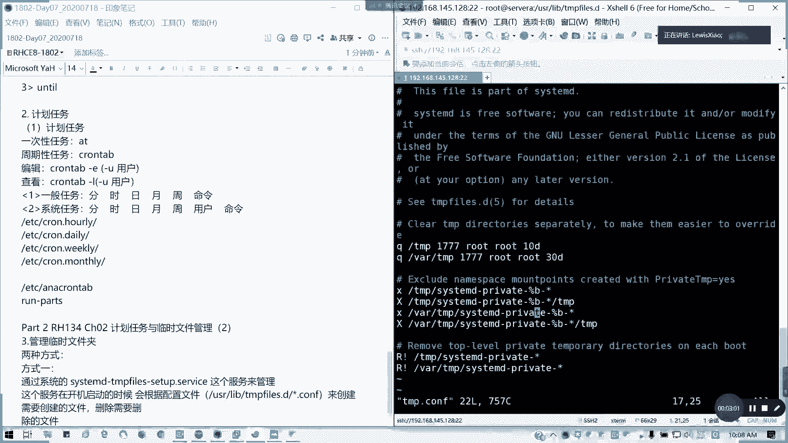

临时文件夹的管理主要通过系统服务实现。本节将讲解两种管理方式：一种是利用`systemd-tmpfiles`服务及其配置文件；另一种是手动操作。我们将重点学习如何自定义临时文件的创建与清理规则。

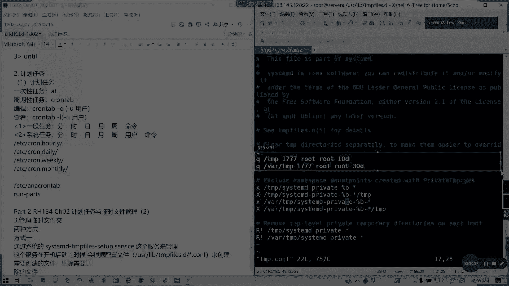

## 管理临时文件的两种方式

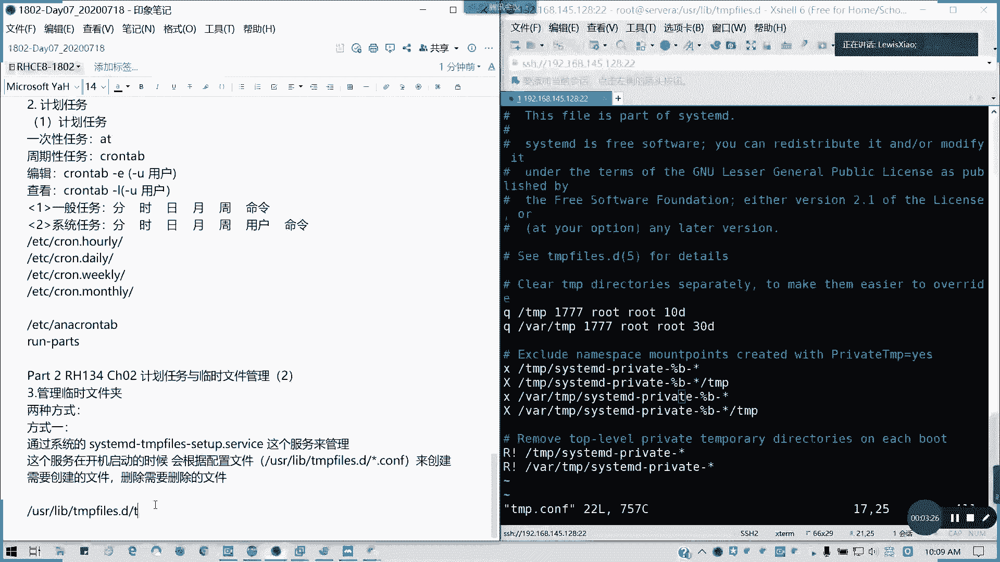

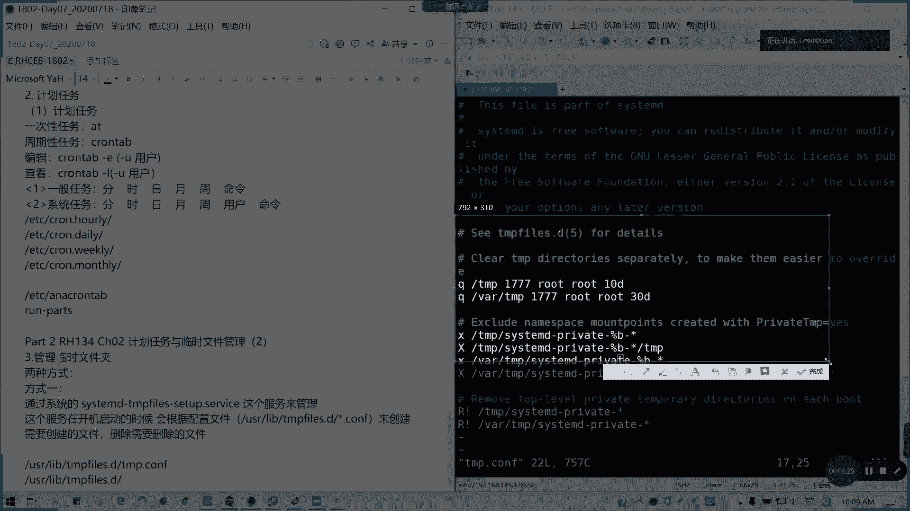

上一节我们介绍了系统服务的基本概念，本节中我们来看看如何具体管理临时文件。主要有两种方式。

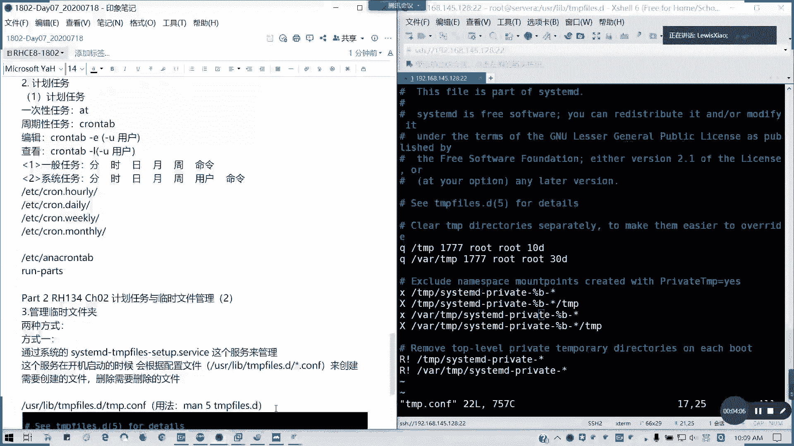

### 方式一：使用 systemd-tmpfiles 服务

第一种方式依赖于系统服务 `systemd-tmpfiles`。该服务在系统启动时，会根据 `/usr/lib/tmpfiles.d/` 目录下的配置文件来创建或删除指定的临时文件和目录。

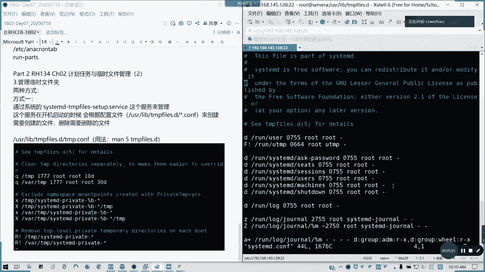

我们可以查看默认的配置文件，例如 `/usr/lib/tmpfiles.d/tmp.conf`。该文件定义了临时文件夹的路径、权限、所有者以及清理规则。

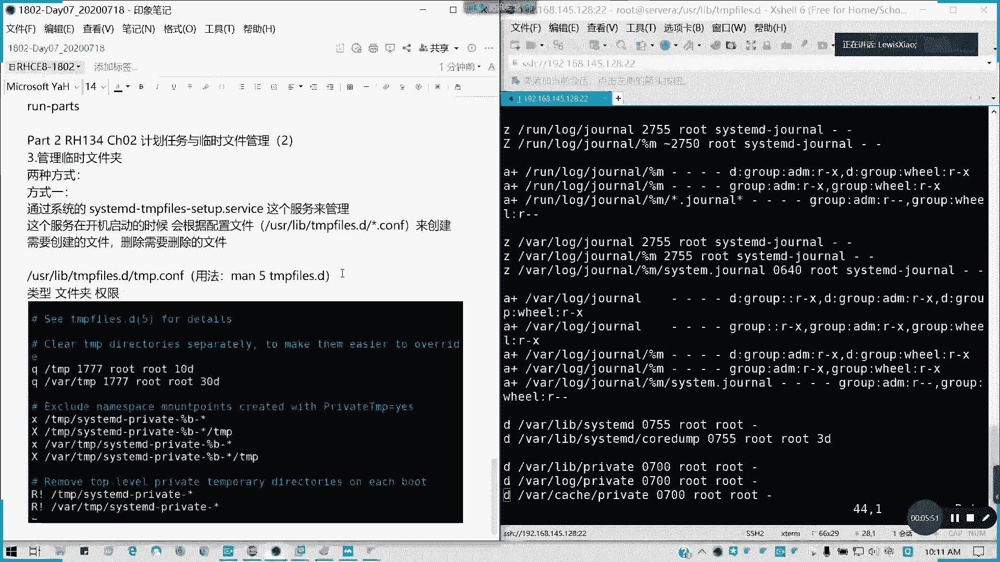

以下是配置文件中各列的含义：
*   **类型**：定义操作类型，例如 `d` 表示目录，`f` 表示文件，`x` 表示排除，`r` 表示移除，`D` 表示删除。
*   **路径**：临时文件或目录的路径。
*   **权限**：文件或目录的权限，例如 `700`。
*   **所有者**：文件或目录的所有者。
*   **属组**：文件或目录的所属组。
*   **年龄与参数**：可选字段，用于定义文件存在时间等高级清理规则。

我们可以通过 `man 5 tmpfiles.d` 命令查看配置文件的详细格式说明。

### 方式二：手动管理

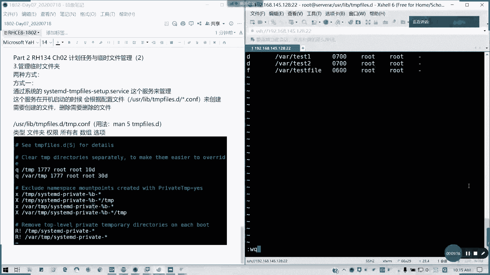

第二种方式是手动使用 `systemd-tmpfiles` 命令来即时创建或清理标记的临时文件和目录，而不依赖于开机自动运行。

## 实践：自定义临时文件管理

了解了基本概念后，我们通过实际操作来学习如何自定义临时文件管理。

### 1. 创建自定义的临时文件和目录

以下是创建自定义临时文件和目录的步骤。

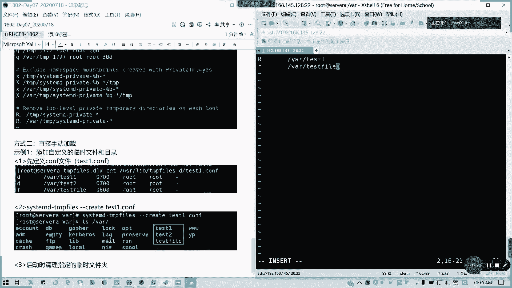

首先，我们需要在 `/usr/lib/tmpfiles.d/` 目录下创建配置文件。例如，创建文件 `t1.conf`：
```bash
# 类型 路径        权限 所有者 属组 参数
d       /var/test1  700  root   root -
f       /var/testfile 600  root   root -
```
上述配置定义了一个目录 `/var/test1` 和一个文件 `/var/testfile`。

接着，执行以下命令来创建这些临时文件和目录：
```bash
systemd-tmpfiles --create /usr/lib/tmpfiles.d/t1.conf
```
执行后，可以使用 `ls -l /var/` 命令验证 `/var/test1` 目录和 `/var/testfile` 文件是否已按配置创建。

### 2. 设置开机时清理指定临时文件夹

我们也可以配置系统在启动时自动清理特定的临时文件夹。

创建一个新的配置文件，例如 `t2.conf`：
```bash
# 类型 路径        参数
r       /var/test1
R       /var/testfile
```
配置中的 `r` 表示移除文件，`R` 表示递归移除目录及其内容。

要使此配置生效，同样需要运行创建命令：
```bash
systemd-tmpfiles --create /usr/lib/tmpfiles.d/t2.conf
```
如果需要移除某个配置规则，即取消其对临时文件夹的管理，可以使用 `--remove` 选项：
```bash
systemd-tmpfiles --remove /usr/lib/tmpfiles.d/t2.conf
```

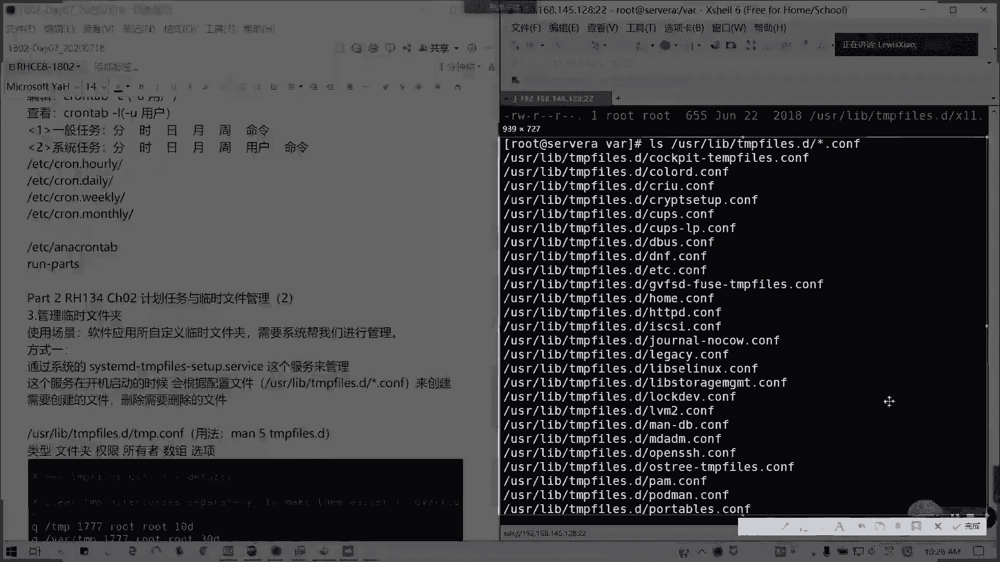

## 应用场景与总结

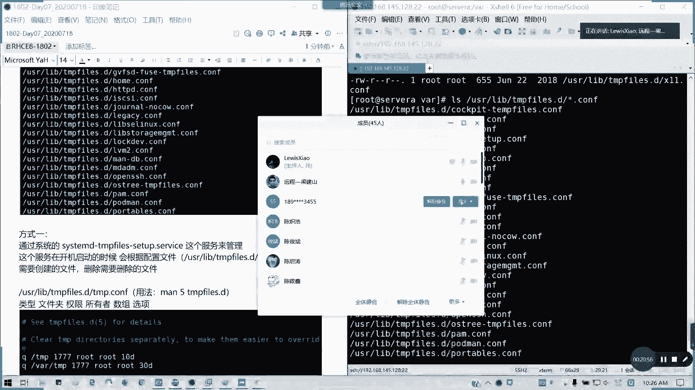

**应用场景**：自定义临时文件管理常用于管理第三方应用程序创建的临时文件。这些应用可能没有自己的清理机制，导致临时文件堆积。通过 `systemd-tmpfiles` 服务，系统可以协助定期清理这些文件，释放磁盘空间。

**总结**：本节课我们一起学习了 Linux 系统中临时文件的管理。我们介绍了两种方法：一是通过 `systemd-tmpfiles` 服务及其在 `/usr/lib/tmpfiles.d/` 下的配置文件进行管理；二是使用 `systemd-tmpfiles` 命令手动操作。关键点在于理解配置文件的格式，并掌握 `--create` 和 `--remove` 命令的使用。虽然考试不常涉及，但这是系统管理的一项实用技能。