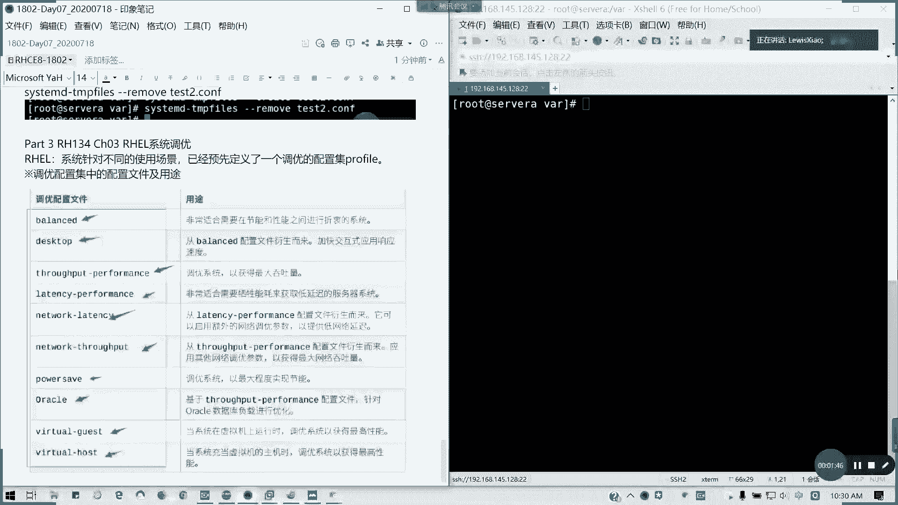
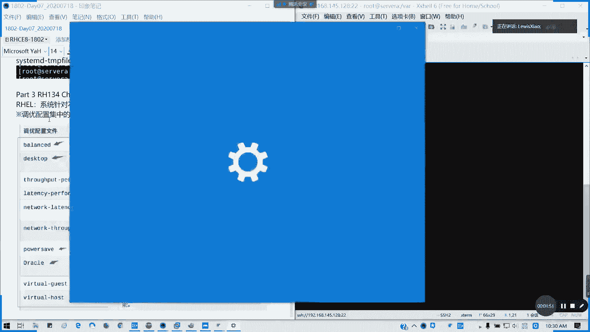
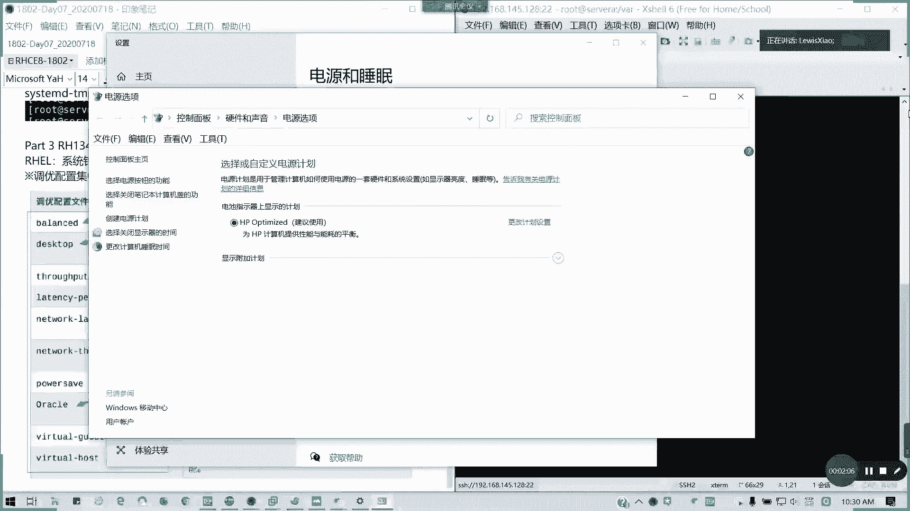
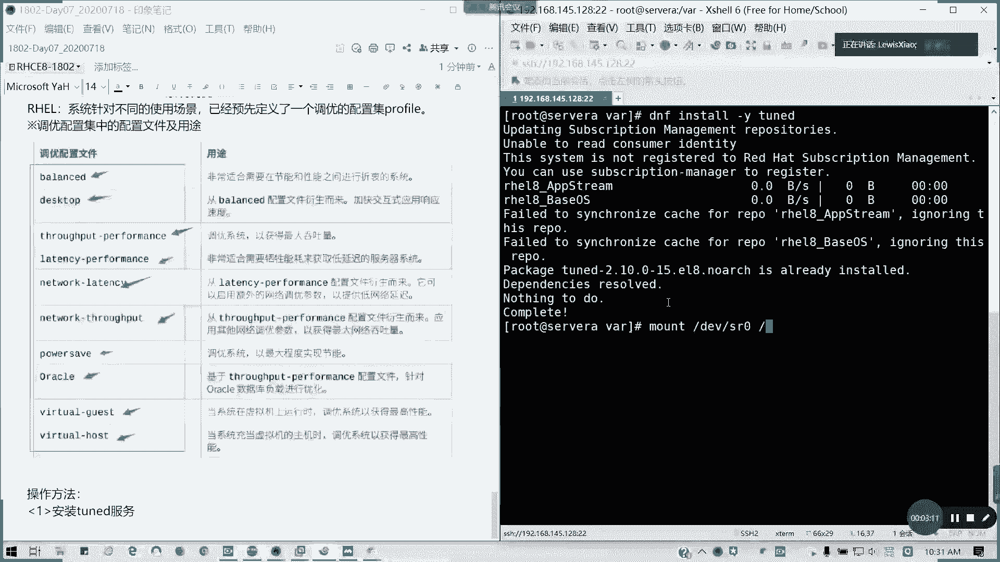

# 拿下证书！Redhat红帽 RHCE8.0认证体系课程 RH124+RH134+RH294三门认证视频教程 - P39：39_Video_Day07_RH134_Ch03_调优_Ch04_facl - 16688888 - BV1734y117vT

有不明白的及时问啊，我们接下来讲简单讲一下第三章，第三章系统调优，这个考试会有一道题，我可以告诉大家，有一道题很简单啊，我们对红帽来说，这是八，我们以前是没有这个东西的，在八点之后呢。

它以它针对我们不同的使用场景，已经预先定义了一个调优配置及配配置集叫profile，那profile里面有哪些调优配置文件呢，这里的话它已经列出了啊，我们书上也有啊，我们这里呢在c一阶段呢，我们不要求。

因为这个系统调的是以后442的内容啊，这是系统调用的那这块内容，我们这里的话主要是讲你如何会用就行了对吧，他有预先定义了哪些像我们的balance，对不就平衡啊。

还有desktop就是从bs文件衍生就加快一下速，就只能用于我们的桌面，然后还有就是最大吞吐量思路，put performance，对不对啊，lantern cy都是那些低延迟的，对不对，低延迟的。

还有网络延迟的，其实就对网络去做优化的，对网络吞吐量最优化的，对节能是不是很像我们的这个很像我们什么呢。

是不是类似于windows的电源管理选项啊。

其实说白了就好像这个东西啊对吧，类似一个我们的一个计划的一个文件，懂我意思吗，他这功能是八点以后我们有了。

然后呢它类似于这种调位配置文件，像我们他有那些像虚拟机，像oracle这些对不对的负载文件，那我们主要用我们直接我们要知道怎么用就行，那我们接下来看一下我们的一个应用方法，我们首先这个涉及到一个。

我要安装tt服务啊，看一下dnf in s杠y tod，我们之前是配的配压明对不对，哦为什么我没有啊，因为我这里我盘没挂，我因为我没做临时挂载啊。

已经装过了对吧，我我们默认我们这装了一个装我们的server with joho server的时候，他最小的可能没有，我们这个包已经装了，装完之后呢，我们有个命令叫tune的a d m。

也就是我们的一个调优配置文件的管理，我们看一下to的atm，我们可以再看一下list，中间有一个横杠的啊啊to可以刚才一起跟我一起操作啊，tt刚才dm类似，我们可以看到它这里我们当前所有的调整配置文件。

以及它会列出它会列出我们的当前active profile，它会列出门，就说我们可用的，我们可用的一些配置文件，调高配置，还有我们当前应用的，对吧，当前用的是virtual guest。

就是它是会以虚拟机系统，然后来做最高性能的对吧，所以这就拿拿这个配置文件来应用，他通常说这一步呢它会系帮系统帮我们自动调好，然后通常我们考试的问题呢就是说行，你选择你当前适合当前适合的调配置文件来应用。

考试会怎么考，其实呢就是走几步命就可以了，我们当前看到是virtual gas，对不对，然后我们可以看一下我们的active啊，对啊，我查这个active five，我们也可以用这个命令。

叫ton的dm etf可以查看我们当前的几经激活的配置文件对吧，其实也就是我们list里面显示的最末一行，然后还有呢就是我们如何查看系统的建议的配置文件。

tt的ad datm recommend recommended，建议对不对，recommended，他建议的话就当前因为我们是虚拟机，对不对，虚拟机，所以的话他的建议是virtual guest。

然后我们也可以应用成别的配置文件，比如说我要用成virtual host啊的配置集，那我们怎么怎么应用呢，应用新的配置集，痛的这是查看建议，查看建议的配置，其，第三个是查看当前启用的配置结。

第二个是列出，可用的，第一个我们是那个安装to的服务，对不对，我就把注释写上，对初学者，我怕到时真的是不会看我们怎么用我们的配置集呢，tungd啊，cf啊，然后后面跟我们list里面我们列出了一个。

对不对，但只要在前面我们list里面列出的，我们都可以用，这是预定义的，他这里没教你们怎么自定义哈，比如说应用那个数主机的虚拟化数组机的，所以说host对不对，我直接跑fire。

就后面profile后面加了一个配置及文件，这些都是我们linux帮我们预定好的，我们不用怎么去调整的，然后呢我们再看一下active，去验证一下，对吧，我们可以改我们的一个配置级的文件。

如果应用之后呢，它的内核参数，会应用virtual host，的调优配置齐，就相当于我们的电源选项，对不对，我们电源选项它我们指定哪一个，他是用哪一个，懂吗。

我们这里的对于c阶段的要求就是你会使用会修改，会查看当前我们用的是哪一个调优配置就足够了，考试一道题也是就这么搞对吧，查当前，然后他指定修改哪个，我就用哪个就够了，这道题相当于送分的啊，如果明白的话。

我们这一章已经讲完了，第三章就这么短的一个东西，只要明白我们调个配置集怎么怎么查，这个服务是服务的对吧，开机是这种启动的，然后呢咱们长按我们的那个就当前的配置以及建议的配置。

以及修改成我们新的调配置齐就可以了，明白了，请打数字三，现场没没问题啊，关注，这应用场合呢就是我们的相当于我们的电源管理啊，一个性能选项，懂我意思吗，每次只能指定一个，对没错，你不能用多个吧。

你电源管理能用多个吗，我们类似场景呢，windows，系统的电源管理，每次都只能指定一个啊，明白我娟娟，我看一下，会的重启会生效的，因为这个服务tt tt啊懂吧，同体会生效的，这个。

考试就一道题调成指定的配置题就行了，相当送分啊，然后第四章第四章我跟我跟第三章一起讲，因为内容不多，我们也讲过特定权限是吧，我们的文件，我们的特定权限对我们的访问控制列表，对不对，叫f a c l。

这里我稍微回顾一下，因为我们之前在讲第一本书的时候，已经提过了两个问题，比如说我们tx user user 1，然后student啊，有两个用户，然后一个步骤叫mt tx，一，然后呢他他的数组啊。

他的数组是root，他的全是700对吧，全是700，然后呢我们现在就是说tsc用户对于他的话是有毒的执行权限，然后呢student用户呢对于它具有多多写权限，我们实现的时候呢。

就不可以更改我们的所有者就数组，那怎么办，是不是我们直接用防护控制列表就可以了，对不对，针对一个文件目录的话，我们是可以用特殊的权限，对不对，所以其实我们是可以这么做的，我们之前我们在讲这个问题的时候。

是不是我们在讲文件权限的时候有讲过了，对不对，如何设置如何查看啊，如何设置如何查看啊，这特定目的上做的事是向r是递归哈，杠二是递归，还记得吗，我们讲过的查看，用get fc l针对左就把u变成车对吧。

删除杠x删除一个杠b是清除所有懂吧，递归这个讲过了，然后它有一个默认的有一个默认的acl，如果设置过之后呢，创建用户不会继承的啊，因为要设置默认值才行，默认cl是用是后面前面加上d。

也就是它可以遵循我们默认的一个文件访问列表的一个规则对吧，然后如果跟我们的它默认定义的是默认的a4 l定义是最大，对不对，所以的话我们如果超出他范围的话，他的有他后面就有个fect的一个有效权限。

懂我意思吗，但默认定义的是我们最大的范围，那如果超出他的有效权限，然后他后面会注会会注释的，所以第四章我们简单回顾一下，因为第四章的话我们在前面啊，前面的第六章在14124的第六章我们已经回顾过。

我们已经讲过这个东西，所以到这集我就不再费时间，好不好，明白的请打四啊，这个的话看一看就好了，这个权限的话会在那个c c的话会有一两道题这么考，这个我们前面已经讲过了，对不对，好讲过的话。

我们稍稍微休息15分钟，11点我们开始讲c linux第五章。