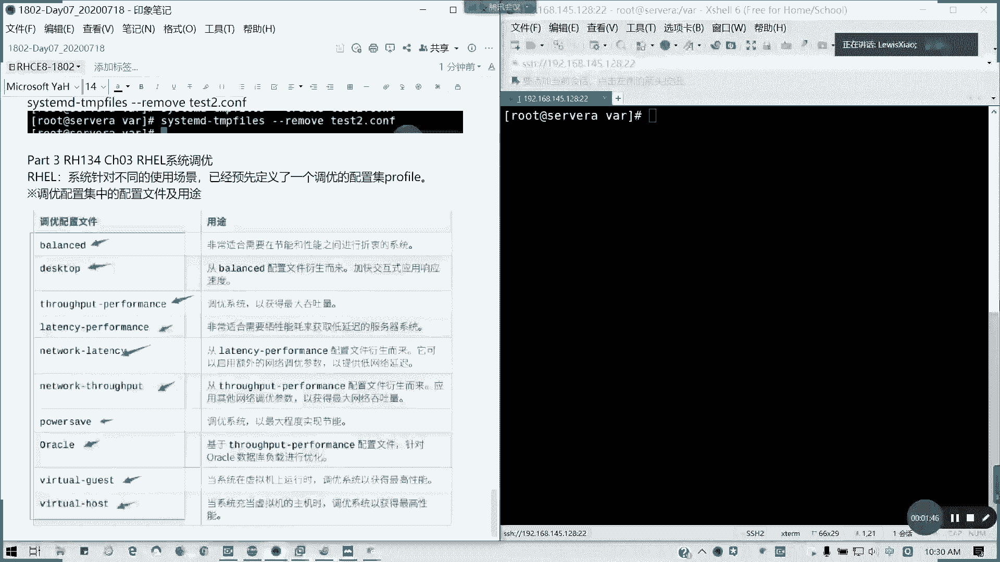
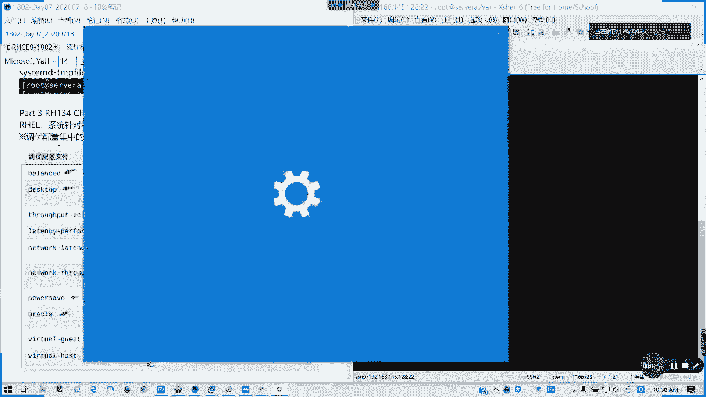
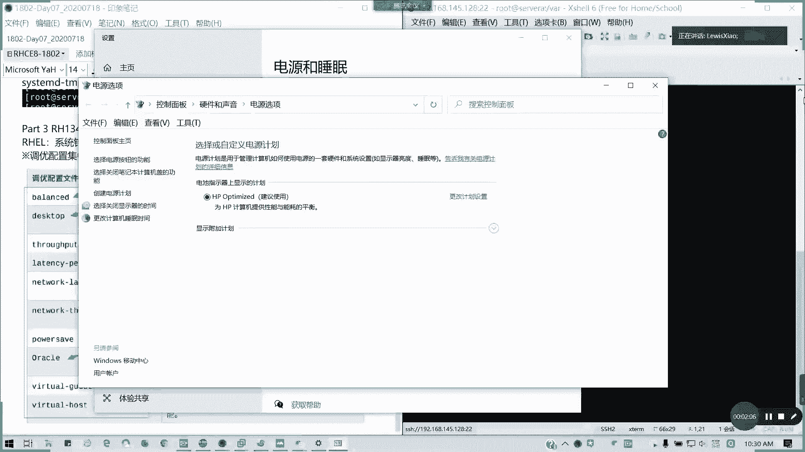
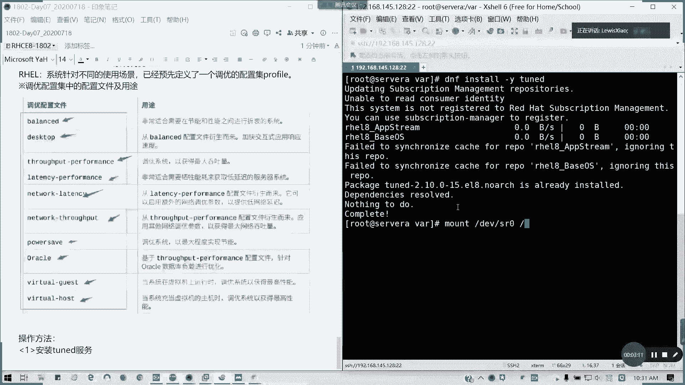

# 拿下证书！Redhat红帽 RHCE8.0认证体系课程：P39：系统调优与文件访问控制列表


在本节课中，我们将要学习RH134课程中的两个重要章节：系统调优（Tuning）和文件访问控制列表（FACL）。系统调优部分将介绍如何使用预定义的性能配置集来优化系统，而FACL部分则是对之前所学文件权限知识的回顾与巩固。这两部分内容在考试中均会出现，掌握它们对通过认证至关重要。

## 第三章：系统调优





上一节我们介绍了系统管理的基础操作，本节中我们来看看如何对系统性能进行简单的调优。



在RHEL 8及之后的版本中，系统针对不同的使用场景，预先定义了一系列调优配置集，称为 `profile`。这些配置集包含了优化系统性能的参数设置，用户无需深入了解底层细节，只需选择并应用合适的配置集即可。



以下是系统预定义的一些主要调优配置集：
*   **balanced**：平衡性能与功耗，适用于大多数场景。
*   **desktop**：源自`balanced`配置集，针对桌面环境进行了额外优化。
*   **throughput-performance**：优化系统以追求最大吞吐量。
*   **latency-performance**：优化系统以追求低延迟。
*   **network-latency**：针对网络低延迟进行优化。
*   **network-throughput**：针对网络吞吐量进行优化。
*   **powersave**：节能模式，优先降低功耗。

其功能类似于Windows操作系统中的电源管理选项，用户每次只能激活一个配置集。

### 调优配置集的应用方法

要使用系统调优功能，首先需要确保已安装 `tuned` 服务。安装命令如下：
```bash
dnf install -y tuned
```
安装完成后，即可使用 `tuned-adm` 命令来管理调优配置集。

以下是使用调优配置集的核心操作步骤列表：
1.  **列出所有可用及当前激活的配置集**：使用 `tuned-adm list` 命令。输出结果会显示所有可用的配置集，并在最后一行标明当前激活的配置集。
2.  **查看当前激活的配置集**：使用 `tuned-adm active` 命令。此命令专门用于显示当前生效的配置集。
3.  **查看系统建议的配置集**：使用 `tuned-adm recommend` 命令。系统会根据当前硬件环境（如虚拟机、物理机）给出一个建议使用的配置集。
4.  **应用新的调优配置集**：使用 `tuned-adm profile <profile_name>` 命令。将 `<profile_name>` 替换为 `list` 命令中列出的任意配置集名称即可。例如，应用 `virtual-host` 配置集：
    ```bash
    tuned-adm profile virtual-host
    ```
    应用后，系统的内核参数会立即按照新配置集进行调整。`tuned` 服务在系统启动时会自动运行，因此修改后的配置在重启后依然有效。

对于RHCE认证的初级阶段（RH134），要求是能够查看、修改和应用这些预定义的调优配置集。考试中的相关题目通常就是考查这些基本操作，例如查看当前配置，然后根据要求修改为指定的配置集。

## 第四章：文件访问控制列表

在掌握了系统性能调优后，我们回顾一个关于文件权限的高级主题——文件访问控制列表。

FACL是对标准Linux文件权限（所有者、所属组、其他人）的扩展，它允许为用户或用户组设置更精细的文件访问权限。这在需要为多个特定用户分配不同权限，而又不想改变文件所有者或所属组时非常有用。

### FACL核心命令回顾

假设有用户 `user1` 和 `student`，文件 `/tmp/test1` 的权限为 `700`（仅所有者root可读写执行）。现在需要让 `user1` 拥有读和执行权限，让 `student` 拥有读和写权限，且不能更改文件所有者。这时就需要使用FACL。

以下是FACL的常用操作命令列表：
*   **查看FACL**：使用 `getfacl` 命令。
    ```bash
    getfacl /tmp/test1
    ```
*   **设置FACL**：使用 `setfacl` 命令。
    *   为用户添加权限：`setfacl -m u:username:permissions file`
    *   为用户组添加权限：`setfacl -m g:groupname:permissions file`
    *   递归设置目录及其内容：`setfacl -R -m ...`
    *   设置默认ACL（使目录中新创建的文件继承ACL规则）：`setfacl -d -m ...`
*   **删除FACL条目**：使用 `setfacl -x` 命令。
    ```bash
    setfacl -x u:username file
    ```
*   **清除所有FACL条目**：使用 `setfacl -b` 命令。
    ```bash
    setfacl -b file
    ```

当设置的ACL权限与文件原有的用户/组权限范围冲突时，系统会计算出一个“有效权限”，并在 `getfacl` 的输出中以 `# effective:` 注释标明。

本节课中我们一起学习了RH134课程中两个相对独立但都很重要的部分。首先，我们了解了RHEL 8的系统调优机制，学会了如何使用 `tuned-adm` 命令查看、建议和应用预定义的性能配置集。接着，我们回顾了文件访问控制列表的概念和基本命令，这是对标准Linux权限模型的补充，用于实现更精细的权限控制。掌握这两部分内容，将为通过RHCE认证打下坚实基础。