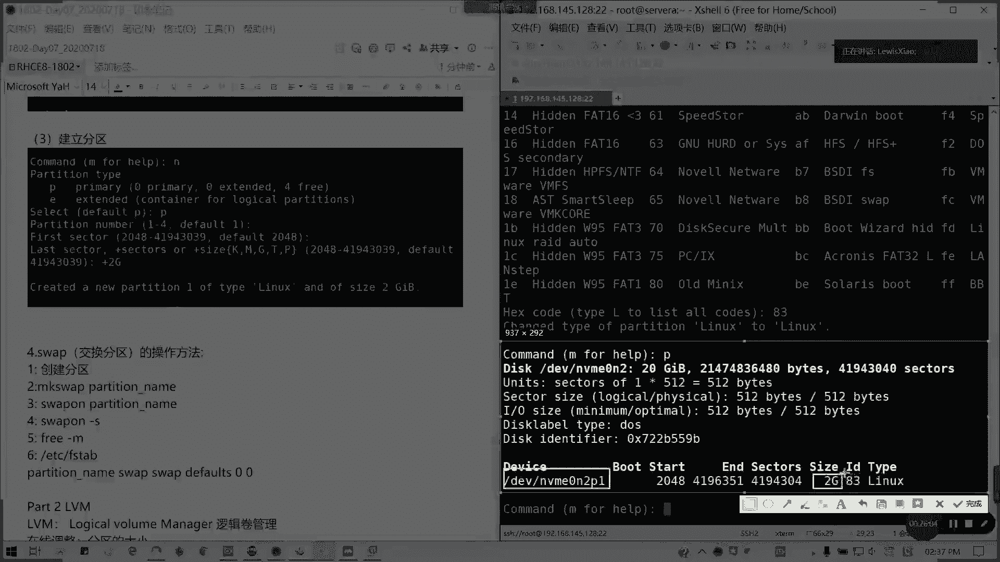

# 拿下证书！Redhat红帽 RHCE8.0认证体系课程 RH124+RH134+RH294三门认证视频教程 - P41：41_Video_Day07_RH134_Ch06a_基本分区_fdisk - 16688888 - BV1734y117vT

好的啊，我们上午的那一个问题呢，其实我们在那个编辑配置文件的时候啊，编辑配置文件的时候，我们少编辑两个地方，少编辑两个地方。一个是关于我们的。两个关于一个权限的问题，我们这录不录被把改过了。

所以导致权限错误没办法没办法去那个运行。然后至于那个SC6不明白的，我们说我们后面再讲啊，后面我们再提问。然后现在呢我们开始要讲第六章。我先看一下大家签到名单先啊。接下来我们开始讲磁盘了。

磁盘这个才是重点啊。考试每次无论是哪个版本都是必考的。

哦。磁盘啊重中之重，我们的那个所有的。考课程里面都是很基本的一个东西。首先我们来看一下啊，我们的常有一些分区工具是吧？我们从长的分区工具的话，主要是三个啊。F disk居di跟party对不对？

Fdi主要是针对我们一个叫做MBR类型。也就是master。bo record主引导记录的。对吧所以要记录是那我们的那个分区表是主文档记录类型。

也是我们现在传统的一些啊传统一些相对来说我们大多数用这种MBR类型的。它特点的话大家应该都知道，特点的话就是。单个磁盘。应该说是单个分区吧。大小不能超过两T。对吧因为它荀指位决定荀址位的话，我记得是呃。

31次方还331次方，我记得是2341次方，也就是最大小不能超过2TB的空间。那然后而且它的那个分区数量也不能不宜过多，它也是只有那个这个是第一个单个分区大小不能超过2DB，这是第一个特点。第二个的话。

它有主分区扩展分区和逻辑分区的概念。对吧主分区。最多4个。对吧我们的MBR对不对？主分区最多不超最多4个。然后呢。如果多于4个啊。多余4个。那。那就要进扩展分区了。就要。一个扩展分区。

占用一个主分区的位置。

然后在。扩展分区内。建立。逻辑分区。我们通常说我们的命名规则哈，在linux命名规则里面扩展分区的序号。那逻辑分区的序号。永远从五开始。因为从5开始，对不对？他组分是钻4，对吧？

然后扩展逻辑分区永远从5开5从5开始，这是。第二个啊。我们这里MBR在某些类，在我们Fdi里面，在我们linux类型里里面也通常叫的类型叫做MS do。然后至于dis呢。它是采用GID啊GID的方式。

怎么叫注入ID啊？它是成GPT的啊。GPT。GID的分区表啊。

我这一块可以把字名素复制一下。

看能不能复制啊，因为这里的话它肯定限制了。它启动过程啊就是说有一小它它是那个有一个特殊的一个启动上区，这是第三个啊。

像GPT的话，就那种一种UTFI的一种情情况式要全局的唯一标识啊。

这是唯唯一标识啊。这个是我们的一个它的一个逻辑啊。NBA啊基于di基于支持GPT啊，就是GGUID的全局的微标识GUIDpartition table。嗯。它分区工具我们待会儿怎么用。

我会在接下来基本磁盘的操作方法里面跟大家讲啊。它是个更先进的啊，就为了兼容性。然后后来因为支持更大内存，所以广泛被使用。现在特别是苹果啊，有GPG分区，而且它的一个特点就是不在限制分区数啊。

就设置分析数它没有已经没有主分区。我们先这我们的那种啊分区格式先先说一下啊。这里先先不说那个分居工具了，分居工具待会我们在在里面讲。没有主分区和扩展和扩展和主分区。扩展分区。和逻辑分区的说法已经没有了。

对不对？全部是采用唯一标识。然后呢，最多支持127个分区。也就是二的7次方减1啊。147个。然后可第二可以它就可以支持2TB以上的分区。对吧所以这两TB是以上分区，这个就没有没有太多关系了。

所以的话它的逻辑呢其实它的支持呢其实更大应该是要2PB吧。我记得是2PB的话，现在远远达不到，所以的话基本上没问题。然后两者的区别。是吧两者区别。以及如果选择问题，我自己截个图，因为这里不能复制。

两者区别。这种问题啊，一开始其实在引导最开始有一个MBR我们叫保护引导。为了防止设备不不被不支持UEFI引导的区别啊，全定支持。所以的话它是就是说你万一设备你如果不支道GPT的，它也可以引导，对不对？

然后呢，NBR最多是两T嘛。然后系统的话，win7就像现在win8win10的话，GPT都没太大问题了。它稳定性是不如boos在NBR的。说这个的话大家应该能理解就可以了，都知道吧。

所以对应的分区工具呢。对应的分区工具就是F disk跟Gdi了。它对应的分区工具。但么这里的话我们两其实差不多差不多啊。我们接下来讲完这个的话，我们来讲。我们磁盘的一个基本操作方法。我我们现在的话。

比如说我们可以看一下我们现现在的生用空间是不是我们那个。第一块盘我们当时装的时候20巨兵是战满的，对不对？对吧这完了，那我们现在我们为了演示我们添加一块磁盘。我们的操作准备。其实我们要添加好几块。

包括后面的逻辑券对吧？逻辑券的话其实也不用我在那个新我我在那个新加这磁盘做就行了。操好准备。要实验前准备吧。实验前准备，我们要添。在虚拟机给虚拟机。添加一块全新的磁盘。容量20G就可以了。

因为现在2十局我被占用了嘛，对不对？我跟分局占了1战17，然后其他占完的话已经没了。对不对？所以的话我们就在虚拟机里面添加一个磁盘。

来看操作。我们在搜索A一上进行。虚拟机右键设置。

好，这里我们第一块磁盘是不是MVME呀，对不对？我们这里的话点添加。选择硬盘。对我写磁饭写硬卡了。好。添加硬盘，然后用s杠4啊。啊。

我们要关闭才能添加IMVME除了scars跟沙塔是可以的那我们现在要不我们把数据机关一下机啊，那耳机要关机才能添加MVME。那我现在我用那个。

收到。

杠H闹如果添加ID跟scars跟跟scars跟s塔的话就不需要。但NVM是需要的。

好，我们把机器关了，我们点击虚拟机设置。

好，我们看到现在只有1块MVMB，对不对？我们点添加。因为为了避免，其实我都为了避免对那个现有车的操作影响之候就不扩大的荣量了。然后选择MVME项链性虚磁盘20G点下一步。前身一直下一步就可以了。

点确定。然后看到我们的那个新的一个磁盘。已经出来了，对对？截个图啊，我保存一下。

这个是我新添加的一个磁盘。这个不能用黄色，黄色的话太根本看不到。我问红色标。

然后我我这机开机。

好起来了。

怎么重新领回这个机器。

那我们可以啊时间前准备添加完一盘之后呢。我接着我们看基本啊。我看一下基本磁盘的操作方法。我这里所讲的操作方法呢，是从建立分区，对吧？到。格式化。就这张就建立分区，然后让他读取内核读取到格式化到那个。

挂载到写FSt的整个过程。好吧，那我们现在来看如何去。挂载嗯，对那如果是分区先。我们先看当前的一个硬盘词况情况啊。我们先看S disk跟L。是不是我们添加了1块20GB的叫做DBB。

MVM1是吧，MVME。02对不对？它这里下面是显示硬盘的情况，我们之前我们是用的第一块盘，对吧？我们这是我们之前一开始用的第一块牌，然后这个呢是我们刚刚新建的一个。硬盘，然后下面是分区，对不对？

下面是映射的一个分区信息，我们就用这块盘来进行操作。走吧。这是新加的盘啊。干均在申请词20G在这里，然后下面还没有任何的信息都空白的。

然后现在我们用F disk给它做一下操作。

这Gdi的同理，我这里就讲一下Fdi就可以了。因为Gdi没有分区顺计的，我们来建立一个。

两区B的分区吧。来。我们要记住它的一个磁盘号啊，磁盘我们是对磁盘进行分区，不是对某一个分区进行操作。F disk。后面跟我们的磁盘号MVME0N2。对吧。然后他现在呢。他说那个。

里面是没有那个可识别的分区表，所以说他帮我们建了一个。NBR也是dos的一个分区表。他他这个FD也告诉我们了，就就这个操作会做在内存里面出，直到你决定去将他们写入我们的分区表啊，所以让我们需要特别小心。

然后这里的话我们可以用help是吧？help这里的话很多的一些命令是吧？就是说我们的ABCDEF对吧？就是说那些命令我们是做什么用的？通常我们用geneary这些命令就够了。然后它也可以创建GPT啊。

GP分区表也是可以的，包括它也支持SGI dos，还有s的分区表啊，都可以。现在FD功能已经愈发强大了。

M是M是帮助哈。M是帮助。他已经帮我们创建一个分区表了。我们通常用。

好，我们到这里。我们现在要创建一个分区，普通分区啊基本直牌。

我的基本分区啊，basicpartition基本分区操作方法。第3个。

我问。按字母N。字母N呢？我们叫建立分区的操作啊，这按字母按他会问你我们的分区类型。然后P是代表主分区对吧？然后E是代表扩展分区，扩展分区就是一个。呃，逻辑分区的一个总容器。

container of logical partitions。然后呢，这个primary呢我们的主分区。他目前是最是不是他已经说的最多只有4个了，对吧？当前主分区0。扩展分区04个空余。

那我们现在建一个主分区。在我们在达到三个主分区之前呢，你随便建主分区都可以。然后到第四个的话，你也要建扩展分区了。因为我们确实有这样子，特别在7考试的时候，85还不知道啊。7考试的时候，它只有一块磁盘。

而且三个分区已经有东西了。那接下来怎么做？很多人就直接把主分区进到第四个了，结果惨了后面几道题不用建了，对吧？要产掉重来，所以的话我要告诉大家，如果题目，就是说你们我们要先看，如果是单一个磁盘。

我们要先看这里是不是？看这里，如果要到已经过了三个分区的话，你就要你就要建扩展分区了。如果说你的题目只有一个磁盘，但我们这里的话，我们是使用新的实盘，所以就无所谓啊？来，那我们开始我们按P。

使用主分区带我一起截图，然后分区号码1到4，默认是一，我们回车就行了。按照默认选项。其始上区我们硬盘是怎么组成的？硬盘是由扇区，对不对？由扇区组成，对不对？扇区里面有磁道，硬盘是一个物理的东西。

应该知道吧。上去里面有磁到，然后呢，迟然后迟到里面我我们是通过你通过磁道去那个词头读取磁道。然后里面我们通过格式化是不是很多这个数据块，我们我们的数据存在这数据块里面，对吧？随机的。

通过索引来索引做索引来识别。对这个我们也就称我们把磁盘称我们把磁盘分析称之为快设备的一个原因。那好，我们这期个散区，它这里因为它一开始有的有一个主引导记录，占了2047。对吧这了2047。

所以他默认从2048开始，我们就回车。他这里会有询问，最后上区，你可以用上区数或是用用我们更加懂的size。空间磁盘空间大小。对不对？成功程大小，它这里给了单位就是KGMTP。对不对？

KMGTP分别是代表是千字节什么千兆是吧？还有G啊，T还有P嘛。但现在我们词盘没有这么大，我们通常我们要建立一个两G的分区，那我们就这里加两G就可以了，或者是后面打拳叫GIB也没问题，对吧？

我们这里加两居，我们就不写那个，因为我们算算那个扇区数其实也很麻烦，因为它有一个公式的。所的不如我们直接直接点，我们我们直接点直接用单位就可以了哎。你清不掉了。哎，啊，不对啊，我把它听我把它删除啊。

我把它删除。帮法删除。

比如说我我我重新来过啊。现现在是20GB什么都没有。从新来过啊，因为刚才的话它撤不掉啊，还是P。回车回车再加两G。对吧加两区之后呢，我们已经创建了一个分区，对不对？

建在一个分区。这里啊。他它默认分区类型是那个linux啊，默认的分区类型。

我们可以用T。但T的话分区类型我们可以修改。但这里的话我们先。这里好像你进来一定要输入了，输入没关系啊。我这里的话我用8，默认是83。默认是83，这也不用管。两个lin啊，不那个我们看一下啊。

就83的话，我们按P的话，我们可以看一下分区是不是当前我们创建了1个MVM1。

嗯，0嗯呃前面是一个磁盘，对不对？后面是我们的分区，我们的一个分区的名字啊，然后大小从大从我们扇区呢，从2048到4196351，对吧？然后当当前它不我们因为我们这上面普通分区。

所以们就这里不启动标记就没有了。那大小是不是两G啊？然后他的那个type。类型是linux的普通分区，对不对？

然后现在我们分区还没有生效。专美是项因为它写在内存里面的。如果像我们的话。我们要启动设启动的话。我们要按A是吧？如果说这个分区是可启动的，我们要按A，然后给它一个。启动编号对不对？但这里的话。

我们这个操作其实我们在创建的话，我们可以不用考虑，因为它不是一个引导，不用不是一个引导分区，懂我意思吧？我们引导分区已经在第一块值班了。那我们现在的话。

看到啊我们已经有一个。我看A能不能取消啊，diable了按再次A按这个取消了。那我们按P看一下，就我们当时还是这个磁盘没有错吧，我们保存的保存W。

这就是建立分区的一个过程。建立现在就是我这个区块我就划划分两区给我们的MVM10NNM1对不对？这分区已经创建完。然后第四，然后我们接下来步骤，我们现在分区还不能用。让内核要加载新的。分区信息对吧？

我们怎么用的？part probe。就可以了。因为它这个我们磁盘我们光需要挂载，所以它报爆出一个提示，对不对？然后呢，我们用那个ABOKlist block。

我们是不是可以看到。新的分区已经出来了。对吧。他的major他的ma他的设备名字major是259，然后他的那个编号是4，这是一个物理设备的一个编号啊。

用part probe可以加载到，那我们用LSBFK可以查询，对不对？但这分区信息。那好了，我们现在。那干嘛呢？格式化。也就是我们的。写入文件系统对不对？创建文件系统。也就是格式化的一个过程。

这里我们以。现在红帽的格式啊，我们红帽的那个。🎼我看一下，现在我们通常都是用叉FS格式，对不对？以以前还是用一他D4的1214之前现在用叉FS。那我们来看一下怎么格式化。

我们有1个MKFS这个命令make发 system叫做。制造制作文件系统对吧？MKFS，然后呢。直接可以点EST4是吧？点EST点叉F或者是直接杠T。是吧。这叉S也行。

然后或者是直接直接用他的指令点叉FS也是可以的。然后呢，后面直接跟我们的磁盘，我们的分区名MVM12NMVV0N2P1。这里待会儿我要说一下。那磁盘代表什么意思啊？这磁盘代表什么意思？但我要做一下补充。

这样的话就相当于我们把那个。我们的分区已经格式化完了，这是叉FF的一个格式啊。这里的话我这我做一个注解，或者用杠T也可以。我这里找是缩小一下，或者。诶喂。MKFS杠TXFS。D E V MVM。

E0N2P1对不对？

都可以啊，这个命令都可以。

然后呢，格式化完。是要挂载才能用啊，对吧？挂载到系统上。挂载系统上呢，我们是要创建一个挂载点。比如说我创建一个挂的点。叫做。M问题。这MT data一好不好？

然后挂在怎么挂呢？第一V。帽子。MVM10N2P1，然后挂造MNTdata一这是临时挂闸。

这是临时挂载啊。

重启后就会失效的啊，重启后重启后就会就就没挂上了，临时挂台。然后我们用DF杠TH看一下。DF就是我们磁盘的一个使用状态。然后杠T呢带文件类型带H是人类可读的一个方式。

就也是把单位弄成M啊G啊、K啊这种万多字节，对吧？我们的那一个。

挂载是不是已经。有了，那我们怎么永久挂载呢？永久挂载呢，我们涉及到一个文件叫做EBC的FSt。F S tab。我要编辑这个文件，然后顺着在下面写。我们这里建议大家，我先看一下UVID。

UID是是磁盘，我们每个设备的唯一一的标识符啊。这里啊建议。建议用。硬件唯一的标识符。UUI D。来挂载，你直接挂分区也没问题。但挂分区的话，有时候你的分区发生了改变，你的挂在你你的那个源头是变了。

就会挂不上，对不对？但UIDUID的话，你这个分区你无论怎么变，你的名字怎么变都好，它的设备的名字是不会变的。对吧我们分区是不是在这里UID。对吧。看到没？它的UID是不会变的。

所以我们没有BLKID我们来来获取我们分区我们的。的一个分区的1个UUID号在这里。获取我们UID号之后呢，我们用ETCFSFS tap我们打开来。我们这里进行一个复制。

这行啊我们参照上面的这行root这行我来配置UID贴过来。然后呢。🎼后面写我们的挂载，就前面是我们的磁牌源头，对吧？这里我只会用UID来表示，如果你想直接挂DVMUMBM10N2P也是没太大问题啊。好。

这里头挂载到哪个地方呢？MNT datata一。然后它的文件系统是叉FS，然后它的挂在选项，我们写dforse就可以了。然后后面两个0或是两个一什么意思呢？

第一个开机进步进行自检FSC就检查文件检查FSCK。第二个什么意思呢？就是是进啊有进行转储备份吗？一转储备份，我们通常用两个0就可以了。这行就是我们家的东西啊。其实也可以用这个的。

对我这里我为了保险UID。好，我们保存完退出。但这个文件千万不要写错，一写错你的系统起不来的，懂我意思吗？一写错的话，它就找不到那个挂载的，所以都会起不来。那我们现在保存退出之后。

我们用mot杠A来进行确认。看是否正常。那。那德刚A来确认，然后在DF看贴取看一看。帽子杠A的话，它会自动把我们挂载上所有的分区。然后看一下这里。对吧我们的分区还是在这里好好的啊。

所以我们就可以往里面写东西了。我们就访问一下MNT的data一。踏去。读写字读写有了吧。这是我们整个的一个验证啊整个验证。然后现在我补充一下那些什么设备怎么命名的，磁么设备怎么命名的。磁盘设备。的命名。

通常是在第一B文件夹里面啊，SD。X是吧，ABCD。是吧。这个是呃我们通常说应该是。机械磁盘对吧？机械硬盘。看接口的DV，然后如果是VDXYX跟Y呢。S代表词判号Y代表分区，应该知道吧？应该知道吧。

X跟Y然后VDSY呢，那代表的是虚拟词盘，就我通过。虚需要修说虚拟出来的，就是在临子上虚拟出来的，就BDA啊VDB啊这些的对吧？通常这里种是那种像沙塔或者是scars这些。然后再MVME。X啊。

这个是MVME通道号。那VIP的话，它有个总线的总线号，我看一下那VMB。叫做。S P。MVV协议的协议的硬盘。这一是代表总限号。DVS20通常代表光驱。光驱是可以虚拟出来的啊，就它上面的一个光驱。

然后像SDA也或者是我们的。这种的话是接的磁盘或者是U盘之类的。像我们的DV的I，我们的HD是吧？通常这种是机械硬盘ID1的。这样子比较少见了。通常我们常见命名啊。常见命名就差不多这样。

如果这块理解的明白的。请扣字母A。明白的话，我们休息一下，然后讲准备讲室外分区，现在差不多快2点53，好吧，3。3点10分我们讲4外分区。讲完的话，我们这张就完了。

