# 拿下证书！Redhat红帽 RHCE8.0认证体系课程 RH124+RH134+RH294三门认证视频教程 - P47：47_Video_Day08_RH134_Ch09a_NFS_autofs - 16688888 - BV1734y117vT

OK重新讲过啊，没事。我现在剩什么东西没讲NFS还有那一个。破密码也就是我们的系统的一个故障处理。还有就是我们的。防火墙美甲，其他的我们都讲完了。web的话，我们作为选学内容看时间。

下午的话我们还有半天，我们今天把CA结束。如果能听到，请给个一啊，能听到请给个一哈。我们现在的话。来看一下。NFS访问网络附加存储。刚才前面那一段我会把我我不会再，就是说我待会儿这段我不会保存的啊。呃。

这一段我重新帮他讲啊，NFS访问网络附加存储。我们在C17的时候，以前。6更新版本最块是作为CE的内容重点内容。HCE的重点内容会考两道大题，然后在CSA又会考一个自动挂法。

但是在C8自动化语维其蚀之下，我们不考服务了。我们只考。一道简单的一个自动挂载题目。就但是你服务端需要自己搭啊，服务端可能要自己搭。所以的话我们就把基本方法先讲给大家。

首先我们来讲1个NFS我们的网络文件系统的概念。网络文件系统呢。它叫NFSnetwork find system啊，目前呢。可以啊。只主要用于不能用仅限于了啊。

主要用于unix跟linux系统之间的相互共享资源的访问。对于windows来说，现在可以用用那个FFS，但是我们需要借助第三方的工具啊，第三方工具类似情形。

你们相信你们都用过网络网上邻居也就以前的现在的网络文件共享嘛。网络文件共享在windows的话，为什么windows车型的？因为它是采用sambarsmbar作为一个工具，其实它是采用一种叫做简单啊。

公共的网络文件系统CIFS对不对？那种跨平台的，但是NFS其实安全性会更高一些。呃，我们AFS呢其实我们想的一个问题，比如说我发布了一个目录啊，发布的一个目录叫做MNT share。

或者是叫共享这个目录。然后我服务器我发布出来之后呢。我的客户端如何去访问辐射资源，就是它发布出来之后我怎么去。像好像在我本地访问一样去访问服务器段资源。共享的目录出来，这就是我们。这一章节。

要说要说的一个目的，懂我意思吧？这章节要研究就这个东西。像我们挂载的目录之后，我们可以多个客户端进行共享。然后我们挂载我们客户端就采用挂载的方式去访问我们远端的共享文件夹，但是注意你挂载还是跟以前一样。

帮括我们挂光盘，是吧？挂我们的其他的一些存储多好，我们这个共献创建目录肯定是要空的，不然的话你些查找不到，对吧？原来内容我们查不到。这是第一个，第二个的话，你如果你要想要存文件。

那必须要把我们的共享文件权限打开，比如说写权限，对吧？不然的话就只读，懂吗？第三个。本地挂载我们也可以设计权限，对吧？这些的话是不是跟我windows共享是不是很像啊？😊，然后至于我们的安全性方法呢。

这这里的话，为什么把NFS nobodyty划掉？因为我觉得这个是原来7。0方面教材讲的，它也提供了一系列安全性的一个策略。足过在8呢策略基本相同，只不过它用户名改了，对吧？如果是那样的话。

就匿名访问啊，匿名访问它的那个对服务器的写入跟允许写入的话，它将采用低规格的。就不是用我们像我们的那个客户端，我们就不是用root用户直接去操作我们的远程服务器数据，它会降集成。普通用户。

nobody啊，我们以前叫做NFS nobody，但现在到8里面改了名了，叫nobodyID为65534。我们可以看一下。对吧。它是一个cor over from user，相当于是内核的一个对吧？

内核的一个上层的一个用户，就是说权限没有多大，对吧？只能用于我们远程的访问。他的ID是6534，而且他是没有交互的，懂我意思吧？然后像默认的权限就是标准的权限去访问我们的共享目录，也就是ss啊。

默没有指定它就用这个值。好像接下来我们还要co验证，对不？co验证安全性更高。像我们用的最以前用最多的是KRB5P，也就是客户端跟服务端之些所有请求都全部加加全部加密，对不对？这个应该明白吧。

刚才我就讲了这么多，刚才9分钟没有大家没有声音的时间，我就讲了这么多。那理论说再多，我还不如来实践。对不对？实现我们这这一开始我们这这个章节，我们是需要两台机器。

所以麻烦大家把我们现在除了servA之外，把servB，我们上次不是说创建两台机器吗？把servB打开。然后现在我们来进行一个serv a的配置。首先我们servA要实现共享，我们要。😊。

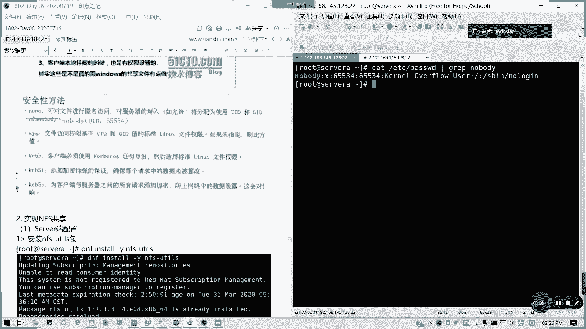

把服务端做好，对吧？你没有提供服务，你哪来的共享啊？对不对？没有发布文呢，我哪哪哪就好像我。比如说我课程没开，你怎么上课，对不对？我远程连接没开，我你怎么连接进来，同样的一个道理，好吧，那我现在。

我们装一个工具，但这个工具我们通常说在那个一开始装的NFS us。如果你们用最小化的话，你们可以装一下。DNFinstore杠Y同样是基于软件仓库的啊。

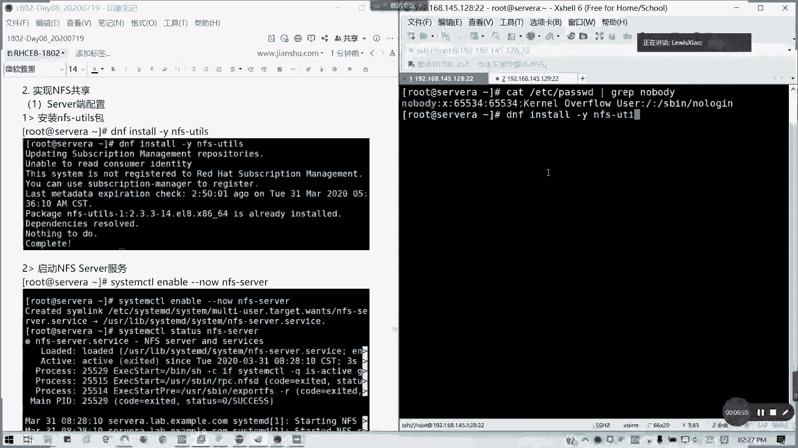

哦，我重启的时候又没挂盘啊。对吧，NFS u在我们在安完整安装我们的红帽8的时候，已经。安装成功了。所以的话如果你们最小化的话，是必须要装这个的。然后接下来装完我们启动FS设备服务。

我们直接一条命令sstem controltrol enableable。干杠闹。1粉4物。那我看一下tats。sus啊。我们服务目前是asit，因为asit，因为我们还没有做配置。

就我们把激服务已经激活了。那我们现在要创建一个共享目录啊，是不是我们接下来我们服务启动之后，我们是不是共享目录要创建了，对吧？我们要发布东西给别人。对不对？那我们创建一个。共享目录。

然后在里面生成些文件。我们可以啊。MKDRR杠T。M题 share我们就创立耀就好了。然后里面是。没有东西的。没有东西，对不对？那我们进去，我们为了让客户端能够发现，就是说能够验证我们挂载正不正常。

那我们里里面几个我们创建跟目录对一个文件就够了啊。我们to取touch我们那个MKDR。然后touch一个需要范行不行？其实这里这里要干嘛呢？其实我只是用来。就是验证我到底我的共享成不成功。

我会发现东西，对不对？而不是目录一个一个目录空空独眼，懂我意思吗？じ。并在共享目录下生成。一些啊势力的。这是我为了演示需要啊，就是让你们发让认没看到我是有东西在这里的。对吧我觉剩至这两个够了。

那么文件夹有东西了。截个图啊，哎，怎么没贴啊？那我们文件夹有东西了，那是不是要共享出去了？就我们已就现在我们已经有资源了，那是不是要共享出去啊，共享出去，我们配置一下共享目录怎么配置呢？

我们通过一个导出啊，export这个配置文件来进行。Where。配置文件啊，我看一下。ETC export sports，对不对？这个这个文件是我们要编辑的，它是这个发。

也就是说我们的一个共享文件的一个发布的一个目录配置，发布的配置文件ETC sports。那我好编辑一下。里面是空的啊，那我们怎么写呢？写的话就是我们的第一个我们服务器的一个发布目录。

MNT sharere。那我们的IP地址。我们现在是不是我们的那个lab域，我们的那个lab点，你知域是不是19在我这里啊，是192。168。14。0，对不对？对吧那我们现在的话，我们要让整个运的访问。

那我们就192。点雕68。145。0。24。刚24也就是它整个子网都可以。然后权限呢后面括号写权限。权限呢一个是可读可写RW如果是只读就RO啊。我们可读科学RW，然后加上同步。

我这里截一下图，然后我说明一下啊。就我们的格式是这样子的。共享目录，我这里用黄色会更加显眼一点啊，共享目录。那这里的话是一个。我们的网络地址范围，网络IP范围。我们可以做作用的网络。断是吧，能理解吗？

做个网络段，然后后面括号权限。然后呢，这里代表什么权限呢？RW。读写。如果说RO是只读。我把箭头好像。我这我啊我我上一步，我写到这里吧。啊，到底有权限。可读写。哦。只读。然后呢，上一课。

同步啊schronization啊schize啊同步。

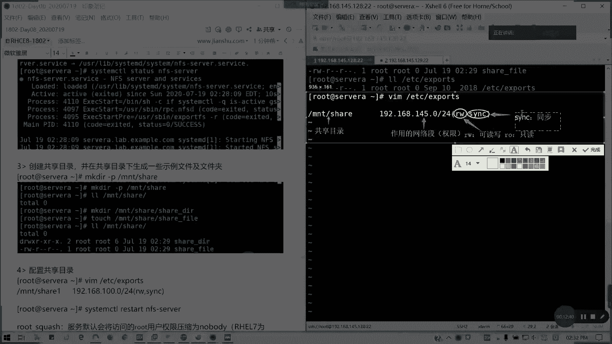

但它是定时，不是实时的啊。好，我们这把这里。能理解不这个给我截图应该都比较清晰了啊。然后呢，弄完之后，我们重启服务。记得这里是一个修改式，是一个配置文件。

所以的话我们记得要sstem controllrestar NFS server。记得要重启服务啊。然后如果通常我们也有那个root crash啊，如我们后面的一个选项。

lookot crash对于权限啊。我们如果后面加了一个rot crash呢。就比如说这样。我这里通常如果只要不降级啊。就是说按照原本权限。来说呢，就是那个。

可以用no lose suppress就不使用root那个降级。

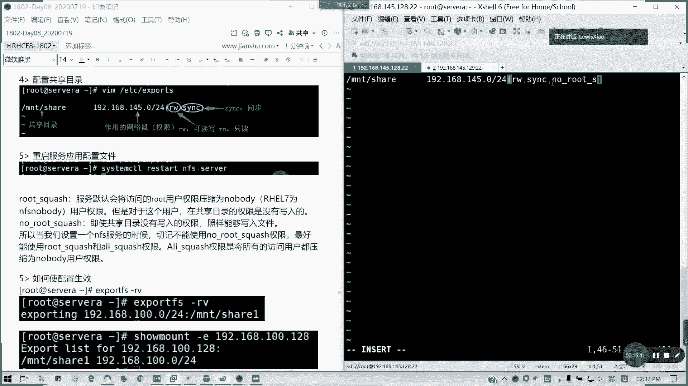

不过这样的话会很危险啊很危险，这种的话不推荐使用啊。就如果是我这也是专门说的这个啊。这里不建议使用这个权限，我所以把它擦擦掉。

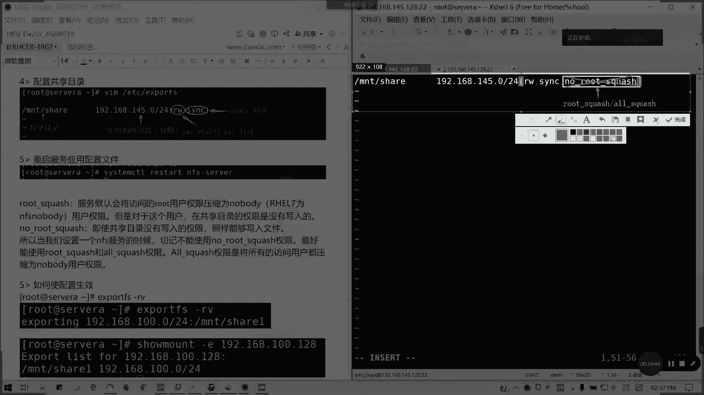

这里我们说明一下啊。这权限呢通常我们用luer crash多一点，因为。默认的话是lulucra啊，它这一个呢。是将root用户压缩成为nobody。在我们红帽期以前叫做NFS nobody啊。

的用户权限。但对这个用户的对这共享权限是没有写入权限的啊，就对这个用户没有的。也就是他是一个最低的用户能访问，对不对？然后呢。就root，你对远程文件夹你是没有写入权限的。

因为它你管只管你不是管别人的啊，管自己，对不对？所以这个能懂吧？然后像root no crash呢，那就即使没有共享显权写入权限的话，那我照样能够写入文件，那这样不是很危险吗？

所以通常我们在设置一个NFS服务的时候，切记不要使用no crash，因为这样的话，你连入侵都被人入侵都真的不知道，对吧？后门大开，懂我意思吗？是最好能使用啊，最好使用rootcra或op权限。

它就是所有用户呢都压缩nogo用户权限，那就是最安全的了。好吗？降级使使用。然后呢，如何配置生效呢？用export FSRV。这我不保存。Expose。FS就发布文件系统杠RVV是查看杠R是。低归是吧。

然后他是么。我看export FS，然后2-2是什么意思啊？我们看一下。咖啡是我们。发布啊发布这个目录啊，发布这个目录正式发布这个目录，我们只配置生效了。这些我们都不需要了，这些这些文字不需要了。

我们就直直接用图来说明export杠RV。然后这里我们发布的是145。0，然后共享这个目录。然后我们可以本地测试。用松帽子就可以你在作用的IP范围内啊。作IP范围内，我们可以看我们的那个。

看我们的发布模发布的列表，对不对？用s帽杠一可以看到我们的。就是说远端文件的一个发布列表，像我们在其他在我们serverB上也能用啊收帽。看看能不能获取到啊。

unableable to receiveive为什么？因为我们服务我我们本地是能获取，但是我们远程不行。为什么我们防火墙没放？来。就他是没权限。去接收对不对？unable to receive为什么？

我们我们没放通啊，对不对？

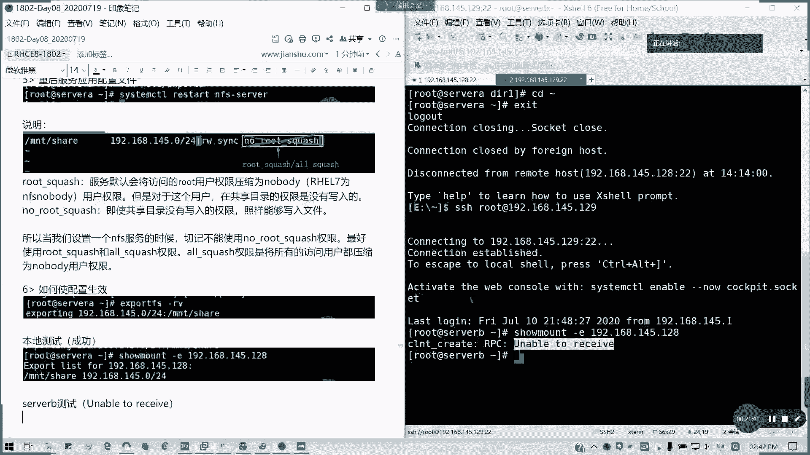

防火墙挡住了，所以这个有时候我们要想一想是不是防火墙的原因。所以这里的话我们会先讲防火墙如何放通，我们就先在我们的firework cMD里面先教大家放通几个服务，对不对？

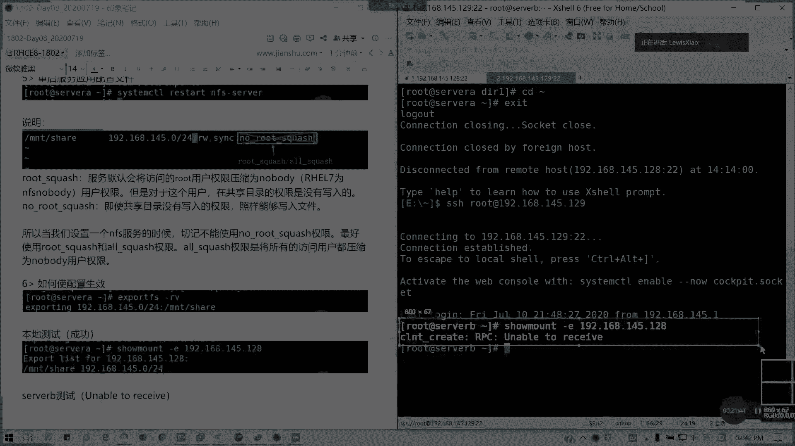

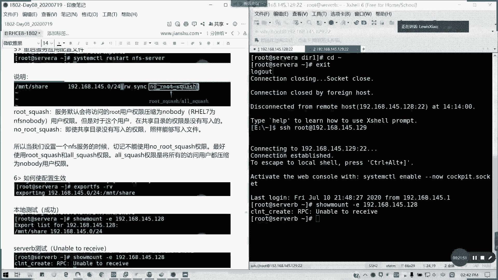

在我们servA上面，你要你要作为一个发我们作为一个服务端，是不是我们要把端口开放出来啊，开放给人家，不然的话你闭门造车啊，对不对？🎼我造个区都不知道啊，来fireworkCMD这个我们详细的内容。

我们现在下章章节就在下午晚的时候会讲，我们先讲讲基本的，我们放松几个服务permanent。他们呢是永久的意思啊，然后我们直接添永久生效意思。然后我们添加服务ad service等于放三个服务。

NFS我到我的帽滴。挂载这个服务mooteD，还有一个消息通远程消息通知的一个服务叫做RPC。干卖的。RPC如果你不会自己叫人品差，对不对？RPC杠8，这是一个消息的一个相在消息通知队列的一个通知。

RV这样办也是放通。然后呢。此时把防火箱捋漏一下。好了。那我们我们再测试啊。那我们现在serv了B再做一轮测试。可以的对吧？看到没？是不是跟我们设为A的本地测试一样的结果？

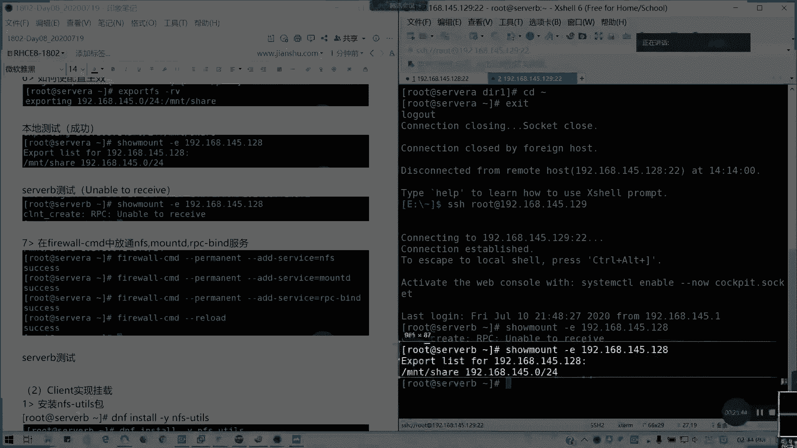

那就说说明我们serverB，我们另外一台服务器同个网段的，就我们作用域里面的服务器能够去识别到我们的一个serverA上面发布的一个目录。所以的话我们就可以。实现挂载了，对不对？

实现一个serveven B的一个挂载这块如果没有问题，请扣字母A啊，我们分客户端跟服务端来分别讲。有问题可以提问。我们soA我们搜A的服务软件配置就到此了啊，就通用的配置，而不是说我们加安全性的。

就是我们普通的配置。安全性配置这里我不会讲。讲的话其实就是给KRRP5P的一个问题。好，我们看如何实现挂载啊，实现挂载鼠标好像蓝牙点没反应，我重新看一下好了。

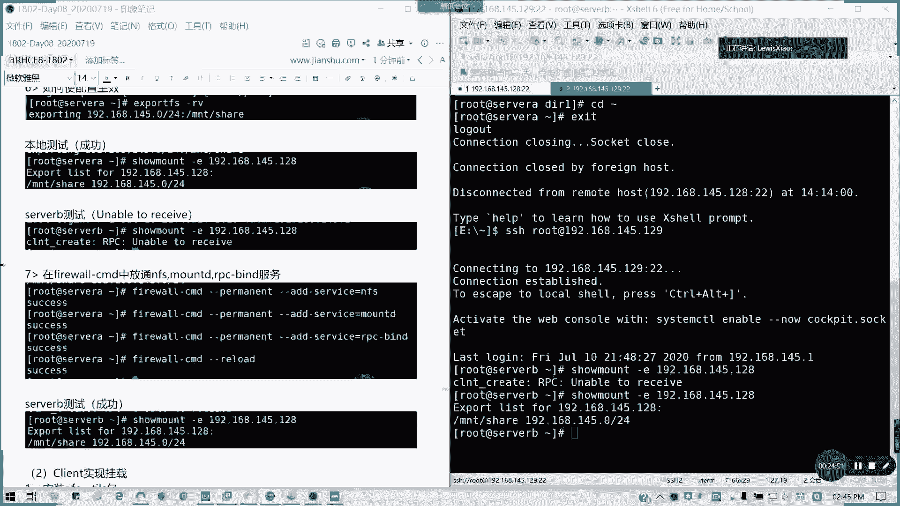

我们同样设个B，我们要装一个包叫做。

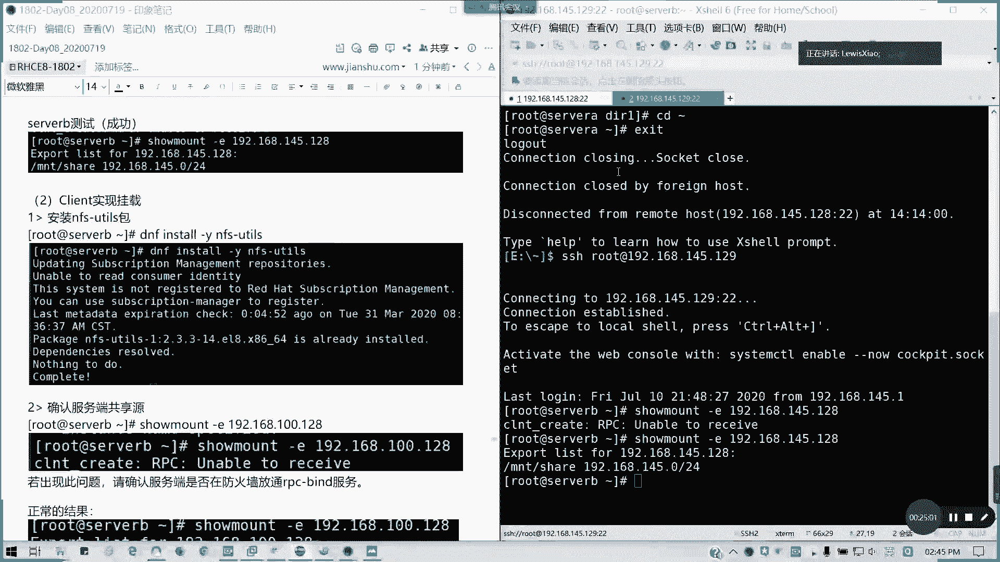

NFS us这个包。那后我们用它的客户端的功能。我们现在接下来我们切换到s位B操作。我们这里没配啊，没关系，但其实在搜索B上面，我们用RPM。杠QA。Gpe， MFS。其实已经装了的。

对吧其实我们已经装了的，默认都有了。只不过我这里我没配样元，所以的话我们用旧图，没关系啊。其实我们已经装过的，然后呢，我们要确认共享源就是我们刚才的145。128。如果像出现刚才那个问题啊。

我们刚才这个问题已经解决了，那我们正常结果我们贴过来。这原因啊，其实我这里我后面有写了，原因是这样子的啊，所以我这里我就删掉了。因为前面讲了，我就不再重复。我们正常结果应该是这样子的。

对吧那接在我挂载共享源，我比如说我要挂载在那个我这边的叫做NFS share啊，MKDRR。港皮。MNT。我都挂在MF share里面。no我可以临时挂载，我也可以永久挂载，对不对？首先我们创建挂彩点。

然后临时挂载怎么挂呢？帽子。杠TFFS。这里不用。跟跟那个smer不一样，跟smerCFS不一样，前面不有两个斜杠啊，直接192。168。14。118的号。MNT我发布出来的MNT share目录是吧？

然后我这里的话为了去分手，加前面加了个NFS share。明白吗？然后DF杠TH。看一下。是不是挂载成功了？我刚才发布的是不是成功挂载了？我们这个T的类型就是它指定的我们挂载类型是网络文件系统NFS。

明白这意思吗？这里的话记得要指定一个类型啊。然后这里是我们远程的地址。我还是写个注释吧。因为有小白带。类型是NFF。然后呢。这是服务端。IP。发布的挂载目录。发布的共享目录。呢度实系两个齐讲嘅。

那windows如果访问的话，如果是CF是两个斜杠的，但这里的话我们就直接对吧？windows其实如果我们发布了那个。发布了IFS的话，也是这样访问的对，就前面跟CFS区别，就前面没有两个斜杠。

这是本地的一个挂载点。因为这里主要是不够，所以的话它写成两行，显示成两行。哇早一点。因为我们是个挂载，然后跟本地要去访问，对不对？然后呢，我们。是吧我们挂载的结果。在这里对不对？那永久挂载呢。

FSt来了，对吧？我讲磁盘讲太多它了。对吧讲太多关于他的东西了。Where呀。ATCXt在搜索B上面做啊。那我们这里的话不是用UID了，192。168。14。

128冒号MNT冒后面是我们的服务器发布的目录，对不对？MT share，然后挂载到哪里呢？挂载到我们的。NNT的NFS shell，因为为了区分啊，不要两个搞混了搞混了，对吧？把两个混淆了。

所以的话我们就把它区分开，我名字命额有点不一样。然后呢，类型我们的文件系统是NFSG的，不是叉FS也不是E叉T4，因为它是一个网络文件系统，懂我意思吗？所以的话就用NFS然后挂载选项比fas。

默认就行了，不FIC不检启动，不检查，不转储。

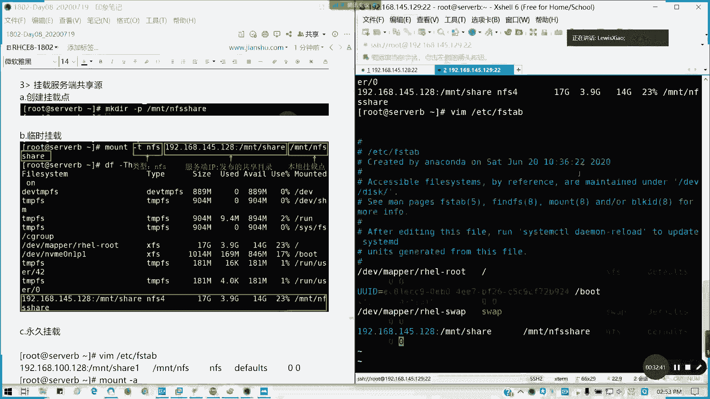

我们经常跟FSt去打交道的。

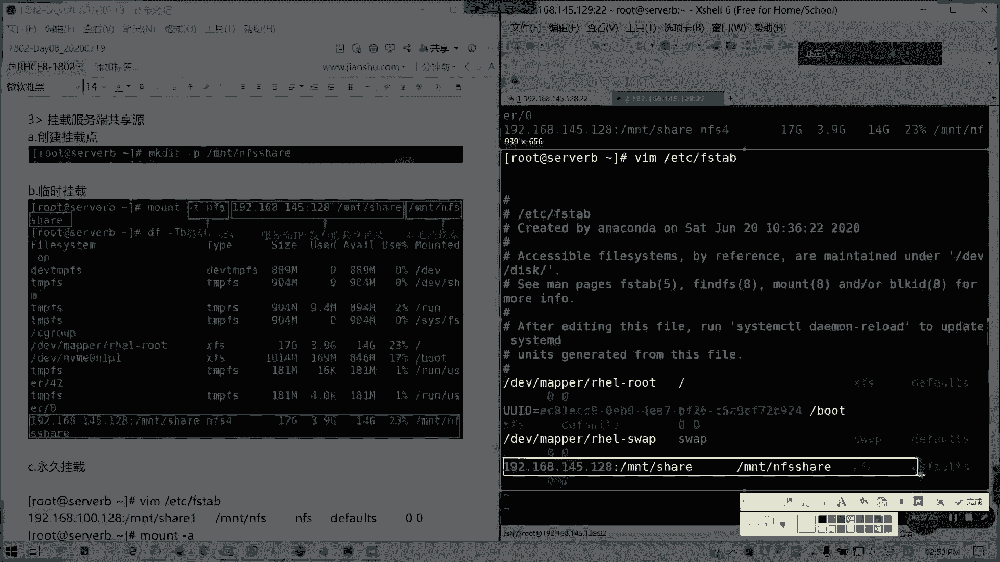

好，保存完冒杠A。冒刚A验证是否成功，然我们先可以。我们可以去CD到我的MT的NFS share目录。是不是列出里面的内容啊，对不对？我们可以列出里面内容，对不对？好。你看。我现在我没权限写入啊。

看到没有？我没钱写入，为什么权限问题啊，这写入问题是有的。要这样。我们LOL啊，我们看一下里面有没有文件。没权限啊，能看到。没有写入权限。此时啊。可以正常访问到共享目录。共享目录。问题。是。通过本地。

挂仔点。F flash。呃，MNT。靠本地的MNT。NFS share。来访问啊，但发现没有写入权限。那如何去解决写入权限问题呢？我们看下面啊，我这里是第四点，如何解解决写写入权限问题。我们。

对为这个IFS跟本我们现在采用默认权限，那采用本地的，对不对？我们本地的话，因为我们是被压缩成了那个FSM nobody了，对不对？就变成其他用户了。nobody并不在我们的法务权限里面。

你纵观你看到他的那个，我可以看一下啊。纵种观网他的他的那个所有是root，对吧？但他是别人的root，不是你的，懂我意思吗？所以的话我们要加一我们加一个雪读权限，在其他人加一个血流权限，这是方法。一。

server端的共享目，这就是说我的这边的话，我别人root对吧？server端的root，你跟客户端录制不是两回是两码事啊，对不对？就相当于我部门也。我另外我一个公司的老的。

经理跟部门经理跟另外公司部门经理，你两个不能互管，对吧？你如果没有业务网的话，是不是？那如果我要互通，我发布出来了那我要给你授权写入，那没那没问题。我在服务端，我给权限就行了。杠D哈。主要是服务端。

我们是没有给这个其他用户。对于其他的root是不是其对于其他机械root是不是对于我们，因为它是压缩权限了的，所以的话是不是对于对其他机械root是等于其他对吧？其他用户。

那我们server端共享目录设置我们的O加W权限就可以了。来。我们要杠按杠R递规。O加W。然后MT share。对吧我们建了一个写入权限。对吧相对于。是否专助其他用户，对不对？这个我刚才讲了。

那如果给他使求权限呢，对吧？我们将O加W给他之后呢，这个是搜端的。对吧设尾端我们设好了，咱们再看单看看。开展端，我现在我踏再踏出一个，我看端不是任何任何设置，我踏踏出一个发一，发现没有报错，对不对？

是不是可以这样写入啊，这是第一种方法。懂吧？这是第一种方法。第二种呢就是一个low no lose crash。但这种基于安全性考虑我们不太推荐啊，虽样可以用，我们来做一个示范。

那我现在把我我的权限收回去。然呢，我们在VIM以下ETC export。就不采不采用not的那个权限压缩。

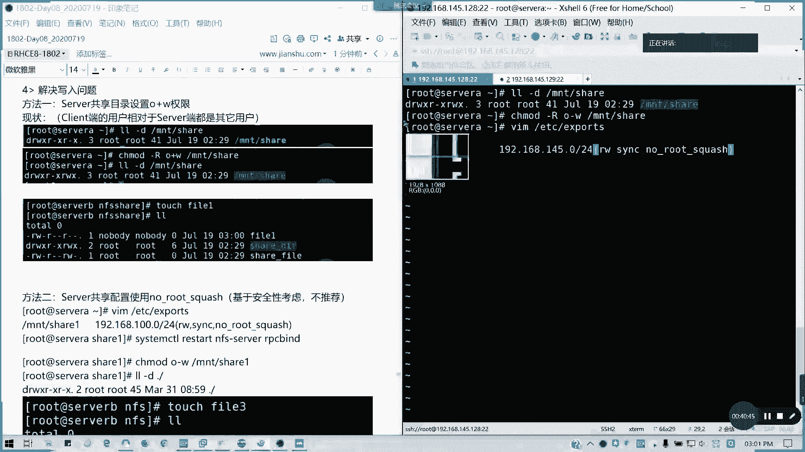

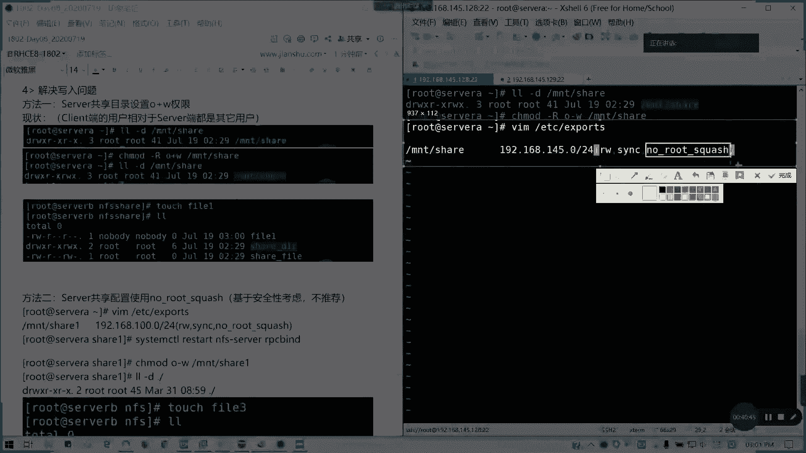

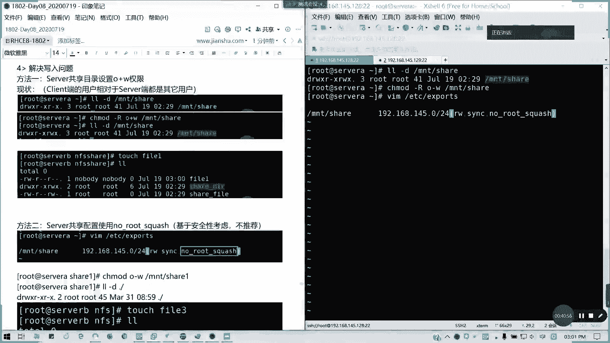

保存退出，然后重启下三个服务。没有重启一个就可以了。帮后我们把那个。我欧 w啊。同学把把OW加上去。就刚才我们发一其实是在服务端的，我们那边看起来是root，但这边是nobody，对不对？

刚才是全启用的权限压缩的。对啊，就刚才我们允许写的时说是不是noble低啊。这我也补一下截图啊，搜个B的。就部署被权限压缩了，对不对？如果刚才就是我定一个权限的色必对应啊。好，如果这样的话。

我直接我就 touchuch一个。法尔啊。那我在这这里。我直接touch，现在是LL，我看一下，现在有个发一，对不对？touch发2。这是直接用root的，对不对？就直接有权限写助了。那这种的话其实。

有点危险了。不推荐使用，还是如果我们要要给权限，还是直接在服务器中放放就可以了。在福利地方放是最好的，明白我意思吗？对应的思维我们也是可以验证的。就变成一个lookot的。好，这个能理解啊，能理解的话。

请打B，我就是我们的扩端挂杆。然后接下来我们会讲一个。我们会讲一个。怎么了？如果这个请打B哈，这个客户端挂载请打B哈。如果有有如果知道的话啊，理解的话，请打B。

然后接下来我们我们把自动挂载讲完我们再休息吧。自动挂载就这章的我们另外一个内容考试也会考的O to FS就是按需挂载啊，原理按需挂载，我们服务端不用做什么动作。

但我们要这里要把那个no scratch去掉，太危险了。

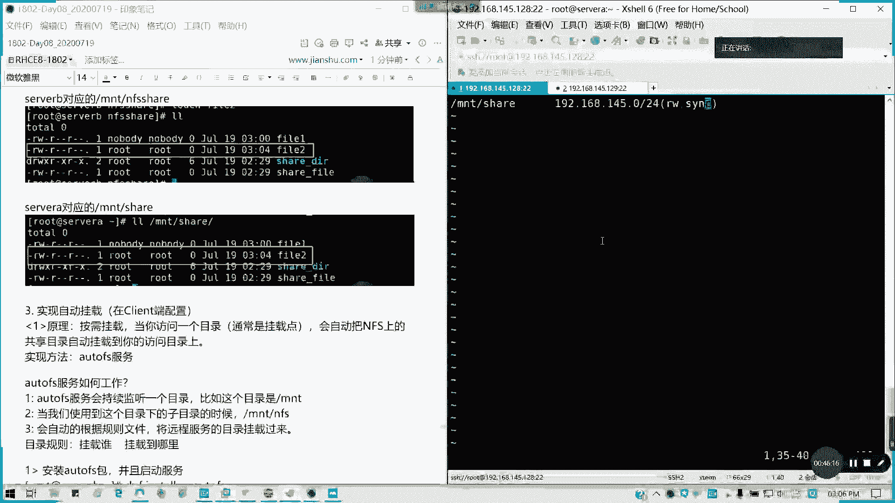

外正的开户门都不知道，懂我意思吧？所以的话按需挂载呢，当我们访问一个目录的时候，会自动把NFS的共享目挂载到你的访问目录上，这是按需的。然后如果。如果超过5分钟。没有访问。泽会。自动解除挂载。

就是这个是一个按需访问，对吧？按需访问我们实现的一个方法就是一个Oto。FF服务。OtoFS服务自动化文件系统啊，顾名思义自动文件系统。然后呢，我们OtoFS服务如何工作，它是会持续去监听一个目录啊。

所以今天一个目录，比如说这个目录是MNT是吧？然后。当我们。使用这个目录子目的时候，比如说alMATTOFS它会根据它会自动的根据我们的规则文件。张远张。这样远程目录自动挂载过来。

就你不访问它就不会不会动，你访问它就动了，我意思吗？就像是自动门一样。懂吗？我们进个自动门，我们不靠近，它就会关着的。然后你一进去，它就自动打开了，就这种自动挂载因为按需嘛。

我的目录规则就我的那个规则文件就是挂载谁挂载到哪里。那我们来看一下。具体操作方法。首先我我们在设为A。我们不做任何的操作啊，前提前提情况下，我们sA。仅在客户端。搜狗端不需要做任何动作，懂我意思吗？

色单不需要做这种动作，我们在serv。我们在serverB这里我们servB是一个客户端。安装Oto FS软件包。DNF。我再清一下屏啊。装不了，我配置的软件仓库。🎼其实我用SCP把它复制过来就可以了。

我不用去配置，对不对？对吧。那我就不用去写了，对不对？懂吧。重新。挂载一下我们的光盘。我看官盘有没有MKDR吧。好，我们DNF。Make catch。

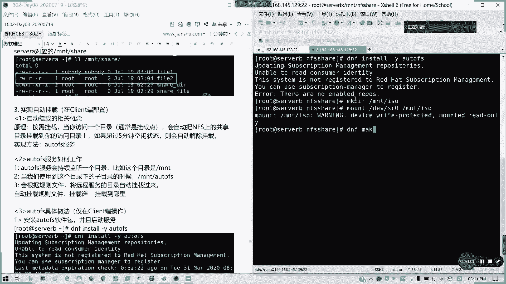

我连写都不用写了，懂吧？SCP就是那么用的。我们第一本书讲的东西啊，对不对？好，我们现在装一个Oto FS。它是属于那个base office里面的一个服务，11一个包，基本系统里面的一个包。

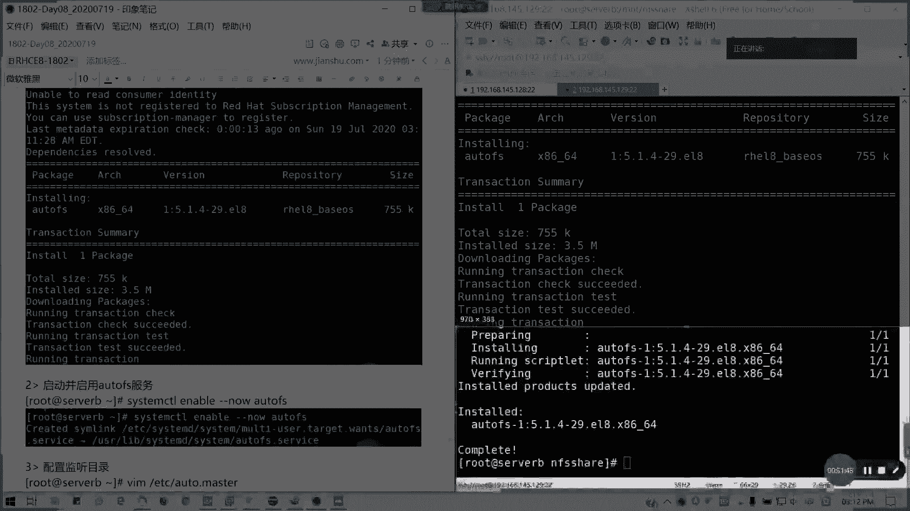

好了，弄完之后呢，我们。启动启用这个服务。它是一个服务来的。

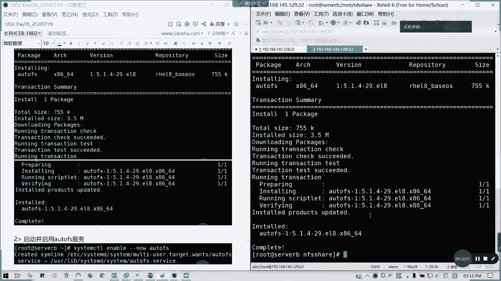

嗯。诶。没有反应了。

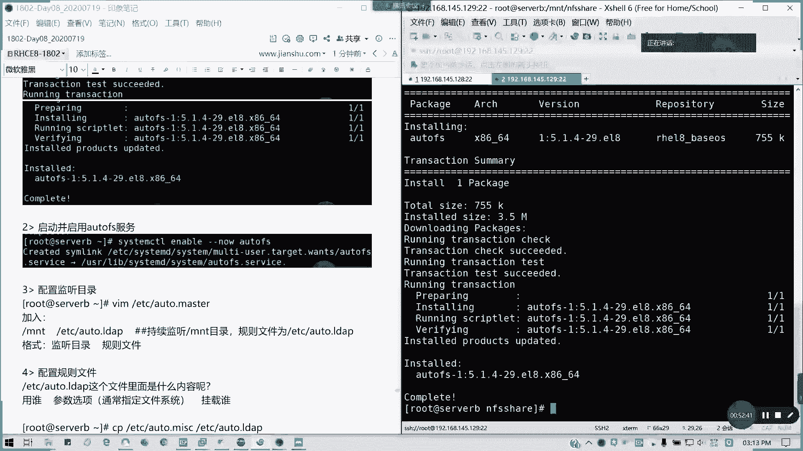

重点一下啊。

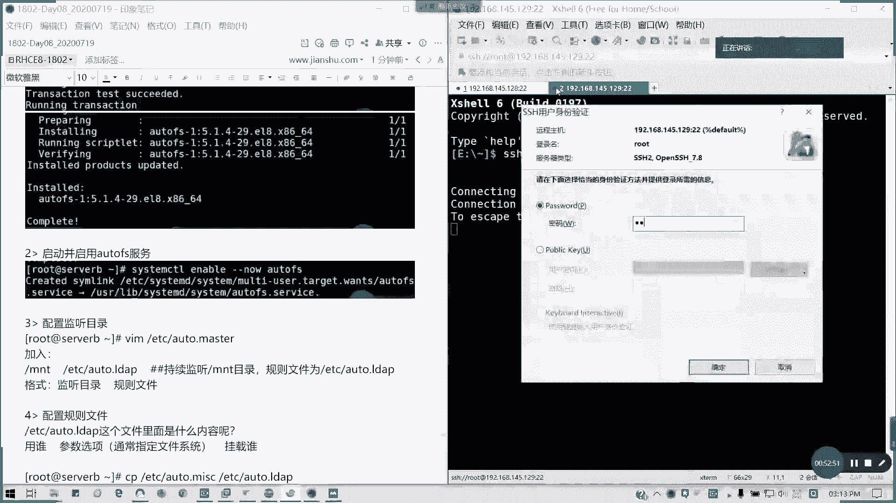

好，那连上了，我们从我们来启动启动这个服务。好了，来检查一下他状态。

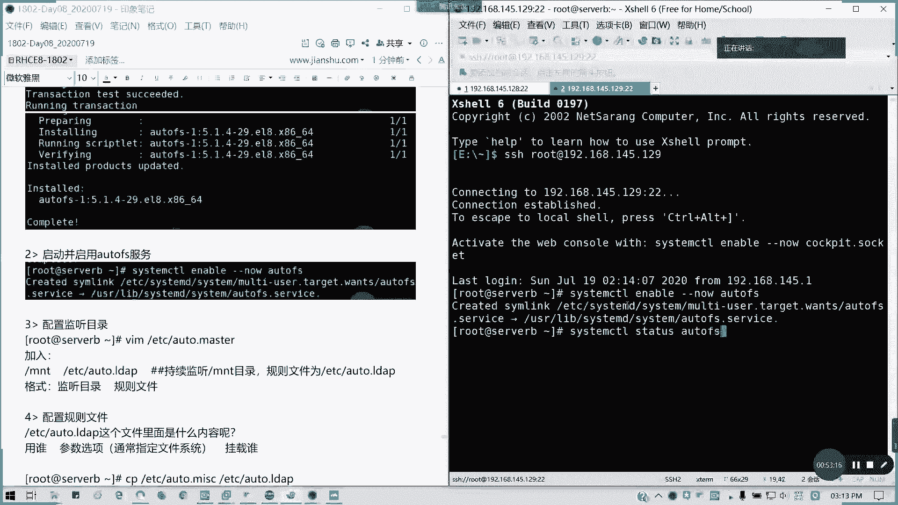

对吧它是一个I running的一个状态。都要跟着操作啊。第然后接下来我们要配置一个监听目录。先听目录啊。接替它某一个目录，然后它里面的二里面的映射文件，对不对？所以我们要编辑一个配置文件。

叫做auto masterster autoto点master。然后如果你有子配置文件的话，可以在Oto点master点D里面写。那这里我就直接编制它主配置文件就可以了。这有很多啊。

像这里有一个视例文件叫做麦克MC的。我们在这里后面加一行。对吧。现在好。我都建行1个MT目录。然后呢，规则文件我们这自己写啊，规则文件啊。LDAP这个命名可以自己命名的，我们就加入这一行。

你这把它保用黑色把它糊掉。不方便我编辑哈。好了。现在我们这里的话用otto master对不对？ottoma编辑这个，然后在这一行是怎么加入内容？规则呢它是一个。第一个监厅目录。然后后面是规则文件。

就他会持续坚定一个目录，对不对？我么规则文件。是O to点Ld这个名名字我们可以自己命名的。然后配置完保存退出，那我们是不是缺个规则文件呢？对吧我要去规则文件，那规则文件这里是什么内容呢？

所以我们可以把。我们可以把这个。可以把可以可以把这个视点文件复制过来。它有一个视例文件叫Oto。点麦克Oto。点MSC。🎼对吧我可以复制成一个O或点LW。如果你不知道怎么写的话，你就复制过来。然后呢。

VM。ETC autoto点lda。这里已经他有例子给我们了，对不对？有例子给我们，对不对？看到没？这有CD是吧？有例子给我们了。你对把它注释掉，我们来往后往下面写。已经有例子给我们的简单了。

我们这是怎么写呢？NFS我们就是挂载这MFS目录。那我们的网络文件类型。等于FFS。我件的一些FS，然后呢，我们的挂载的地方就是我们原145。128。MNT share同样是是挂在那个地方。

我这里把它滚上来啊。

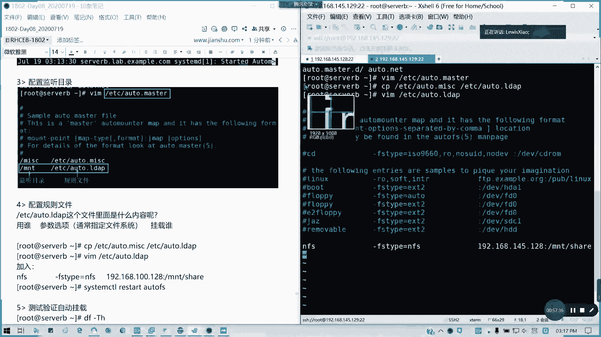

这行怎么写呢？我们的格式我们加的是这一个这个内容，其实上面就是一些例子。我且我们的格式都是。按需挂载点。就自动挂载的啊。这挂的点是谁？然后呢。参数选项。通常是指定文件系统。然后后面。后面的话是。挂法员。

对吧。我们的一个远端的一个发布的目录啊。

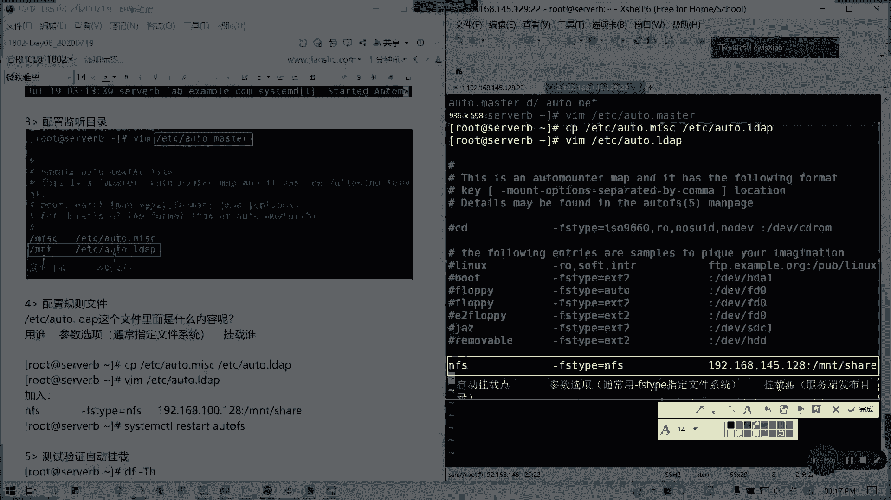

Of us。说回说了几行啊。

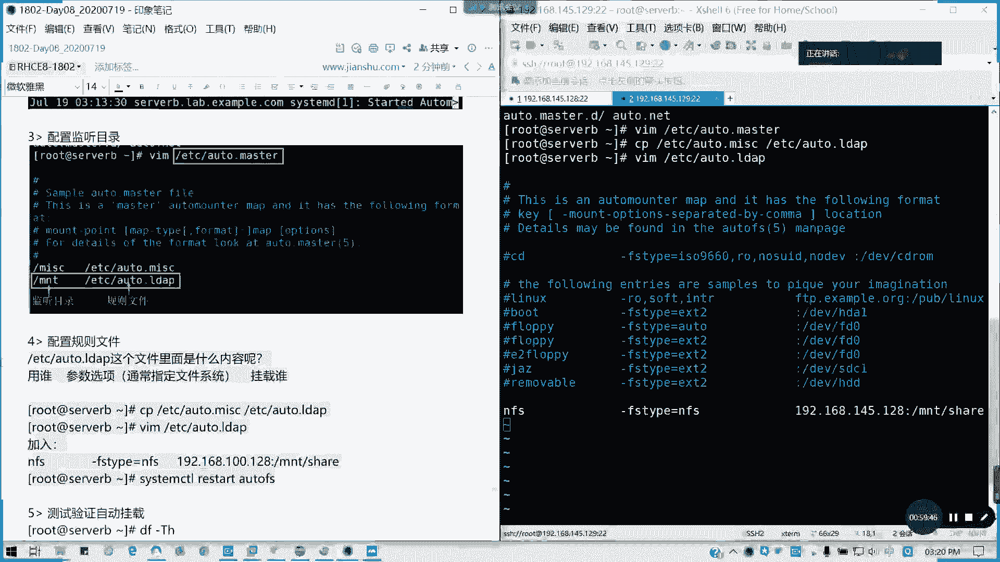

懂了吧。这个能明白吗？它上面是有例子的，我们copy了一个。参照啊。BTC。目录下的。opto点麦克。我们复制过来，我们就这么写就行了，懂我意思吗？保存退出。我们不需我们可我们配改配置文件之后呢。

我们要需要重新启动服务的。那我们来验证一下自动挂载。我在挂载那个IF，对不对？到现在我还没挂，我s尾B上面什么都没有。对不对？🎼好，我访问MNT。这个木头我们本来没见的，对不对？

但是它我们防出突然就有了。懂我意思吗？自动挂载的。然后我看一下DF杠TH。是不是多了一个就脱出来了？我们CD过去之后，我们发现DF杠贴纸是不是多了自动挂载，多了一项出来了。

就不需要我们去手动去挂这个东西都知道了。然后这里的文件事例哈，比如说我们的一个。挂载的1个NFS对不对？MATT share，然后我可以挂我的叉FS挂我们的光盘。都可以的，挂分区挂光盘都行。

那留下一个思考题，我们先我们休休息一下，然后准备讲的就是如何指定远程目录用户并挂载加目录啊。这个就是说我在本地创建个远程用户服务器是存在的。

然后如果在ho里问如如何去挂载对应的加目录文件去实现我们的远程文件共享，这是有的吧，我们的域是不是这样，对吧？有易登录是不是挂载远程文件，然后你的文件是。连文件里是不是保存在本地的。

是远程的服务器文件夹的那这种情境思考一下，我们稍后继续，大概3点40分，好吧，讲了一个小时了。都是你个。

