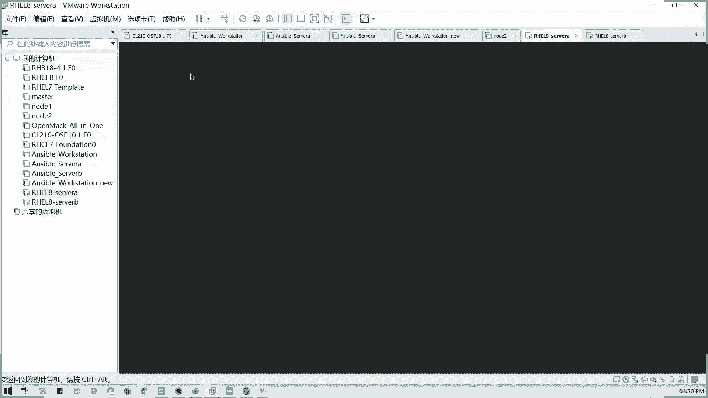
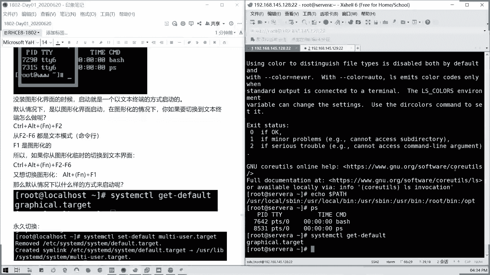
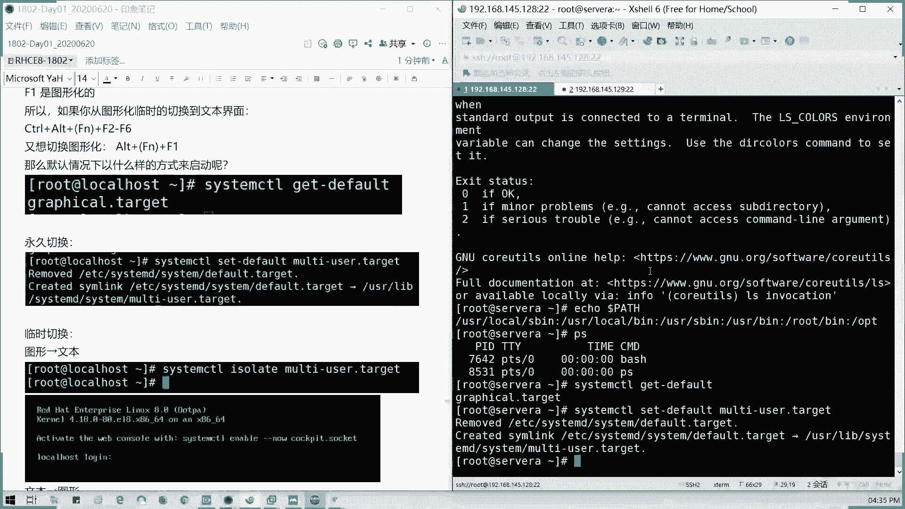
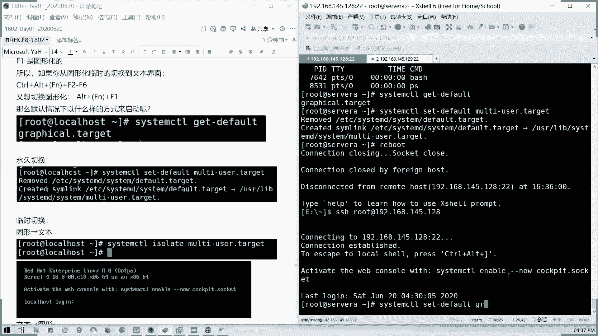
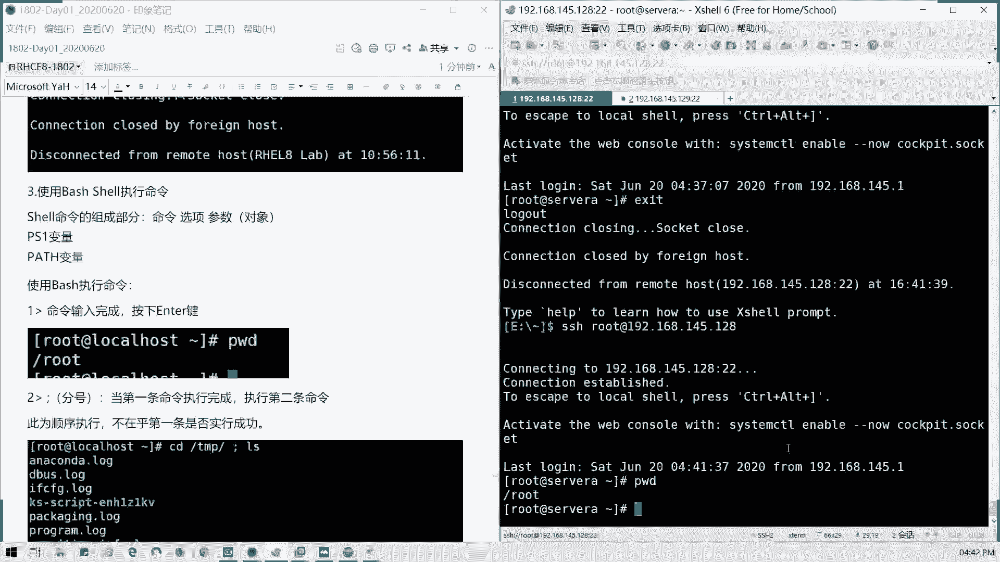

# 拿下证书！Redhat红帽 RHCE8.0认证体系课程 RH124+RH134+RH294三门认证视频教程 - P4：4_Video_Day01_Ch02b_访问命令行 - 16688888 - BV1734y117vT

服。我们继续讲啊，讲讲这节讲，我们就下课啊，就下课。然后今晚今天东西不算多，但是就相当一个基础啊，因为今天有点1点1点点那个翻车啊，没事，我们看一下系统登录这块，对于服务器的话。

是不是我们都有我们对PCG是不是直接接键盘鼠标，我们就可以连接，对不对？对服务器的话，我们除了接键盘鼠标之外，是不是都有远程控制口，对不对？同同时其实我们无论是接键盘鼠标也好，然后接远程控制口也好。

我们都是相当于一个控制台是吧？控制台模式，我们直接直连我们的那个。显示器啊就相当接键盘接显示器这样子，对不对？所以呢我们的本地登录呢就是相当于我们直接接上键盘鼠标显示器。

但是linux下面基本上鼠标很少用啊，对吧？一个键盘就搞定啊，首先我们图形界面就是我们这这个样子，对不对？图形界面文本界面就是这样啊。

就这样，然后什么叫文本啊？TTY我们我们这里的话，如果我们登录文本界面啊，如果我们直接登录文本界面，我们的那个。

我们这里是PDS是虚拟终端，就是我们通过外部连接啊。如果是文本界面TTY呢，比如说我们在那个直接在我们sll A跟slB这里，我们切换到文本界面登录。就们现在图形界面对不对？我们切换到文本界面。

是吧PS。是不是写的这是TTY对不对？这是第二个字符界面终端TTY就是基于文本的登录终端，就是TTY啊。

然后图形界面呢，比如说我看一下啊。我打开一个终端啊。

觉得这个界面呢以后我们就基本上除了考试之外，其实很少用啊，考试就是foation就这台物理机也就差不多这样的界面差不多。可能桌面会会有图标啊，比如说像我们PS，我们的PTS是不是相当于虚拟终端。

就是文们值是通过其他的方式连过去的。然后TTY就是我们的文本终端，对吧？文本终端，然后如果直接接神器呢，是是一个孔，它是一个孔受啊，我们回来对吧？

TTY是文本直接登录的登录的一个终端直接登录的标识。然后如何切换呢，对不对？我们这里如何切，我们看一下笔记啊，看一下笔记。

这里的话是吧T toYE，然后我可以切用alt AL我们键盘的AT，然后加F。加那个F加那个F，如果是笔记本的话，可能会有一个。它这里的话就是1个FN啊FN键。如果笔记本如果是笔记本话有个FN键。

如果没如果没有的话啊，通常说我们台式机的话就是一个conalt加F1到F6，我们切换文本终端，对吧？我们给大家切换终端。

对吧如果纯文本中断，我们是可以这么做的啊。我看一下设尾A啊，设尾A，我如我切文本中端的话。如果是图形切过去就alt，然后这里的话alt加F3。

怎么看哎，怎么回事？

不对啊，如果是在纯文本界面情况下，因为我们这里装的图形界面，所以等我们要加conttrorl来切啊，我要加conttrorl来切。如果是纯你们装的是那种最小化安装或者是那种纯文本界面的话，你就是or。

然后加FNF1到F6，它只有6个终端界面，好吗？就你最多你可以就像贴切换6个。

切换6个窗口啊，6个终端终端的界面啊，是不可以切6个，对吧？1到6。第一个是如果是装了图形界面的话，如果是我们没装图形界面的时候，它启动就是一个文本终端。那默认图图默认情况下，它是一个图形界面。

图形图形化界面呢，我们F1是吧cttrorl加alt加F一是不是图形化界面？

然后F2到F6是文本界面。对吧。这个FN呢是针对于你的笔记本上，如果你的FFN它有特定功能的话，对吧？

如有FN有特定功能，比如说我的那个加减音量键的话，你要实现它原本的F1到F12，是不是要加FN键啊，对吧？这个是我针对于笔记本来说的。如果是针对于我们台式电脑，我们的FN是普通过。

就是普通的F1到F12，对不对？所以当我们就不用加这个FN键啊。看到没有？我们如果切换的话，conttrol加FN加F2。加alt加FN对吧？F2到F6都是图形界面，F1是文本界面。

那如果呢我们临时切换过去的话，就切FN到F2到F6。然后如果切换图形的话，就是alt加F1，懂吗？就图形切文本文本切图形，这个应该都会啊，那默认我们怎么启动呢？我们看一下它的默认启动目标。

默认启动目标叫做啊。我们叫做啊gal点target啊，gal点tget这里可以看啊。C啊，我这里这里好像用的中文，我们用英文啊，来这边看一下system control。

I呃 get default我们。就相当我们INIT以前六版本的，以前的INIT，但现在7以后呢，全部交给sstem controll这个这个主进程来管理。现像我们现在可以ge一下default是吧？

然后呢，回车它是不是显示我们默认是以。图形化界面来。来启动是吧？那如果我要永久切换怎么办呢？这个我们后面也会讲啊，但是我这里先讲了，就如何切换永久切换图形界面跟文本界面，对不对？

像我们永久切换怎么做呢？比如说我们要切换到一个多用户界面啊，但有的有几个界面是不能切换的。比如说像永久切换，不能切换成rebo对吧？也不能切换成power of。那你永久切换是不是一开机就重启。

一开机就关机，对不对？然后还有一个叫做紧急救援模式，那一开机你就已经直接到那个就援模式下面了。那这几种模式是不能设我们的默认值的那我们可以设的就是一个多用户，还有图形界面。好吧，那我看一下怎么设啊。

比如说我要我设一下我们的serv维，我们的思尾A好吧，system。conttrol，然后我这里set default，我们既然有get default，那我们有set default，对不对？

然后里面mtyus我们叫猫，直接MUL我们用tab可以补全，对不对？对吧就不用记了mus target。那我们现在它就创相当于创建一个deer的链接到我们的一个multyus target。

那我们现在重启一下，我们看一下它引导怎么引导啊。

看一下这里。对，就相当于以前的INIT3跟IT5。对，2已经没了，就是就去掉网络链接的一个多用户模式。这个模式已经在7以后都被去掉了。对，我们以前是有几种是吧？第一个是单用户模式，对吧？

INIT12的话是去就不带网络链接的多用户模式，第三是完全的多用模式，第四留空，对吧？第五是图形化。0。

关机。6、重启对不对？以前INIT啊，现在你看我切换之后是不是这样了？这后变成文本页面了，对吧？就默认就变以成文本界面了。

那我们现在重新连接上这主机啊，我这里是145。188。

然后比如说我要临时切换啊，我回回到这个笔记，我要临时切换到我们的。

那个图形切换到文本界面，我们临时切换啊。我们可以把它设回来，对不对？system controlttrol。setty four我们可以设回来，对不对？设置回来。第一。FAULT然后。

graphal对吧？GR对吧？出来了，这里的话我们就设回默认图形启动。那我们如果临时要切换呢，就是用stem controll isolateol，对不对？比如说我这里是把图形切到文本，那文本。

切到图形呢。graphfiical对不？有没有system isolate，我们看看什么结果啊，system。control isolate。临时切换的graphal点 target好回车。

那我们看一下我们的VMware我们的原本界面。

是不是变成图形了，对吧？图形后们我们是可以通过快捷键切换，临时切换，也可以通过命令来进行临时切换和永久切换，明白吗？好，那这一块讲完之后呢，我们来看下一部分内容。

这个这一块我们就过了哈。然后远程我们来讲一个就是7页面切换。那我们讲一下远程登录。远程登录呢我们大部分的工作场景啊，第一个是从windows连接到linux，对不对？

我们通过一台windows一个跳板机，然后连接到我们的linux的生产环境。那我们windows本身它不带啊，大多数情况下，它本身不带我们的。

inux的远程工具SHH协议的远程工具，那是不是需要工具辅助啊？一般来说对吧？比如说像叉 manager，我们叉 share是是在里面，然后包括s客CIDparty，对不对？像如果像mac。

我们的苹果系统，还有lindux连点lins，那我们直接打开终端就可以连接了，对不对？明明白吧？所以的话我们通常说，比如说我这里我上我刚才不是就这么连接了吗？SSH对不对？然后用户at主机。

那这块应该都懂了啊。怎么在windows如果远程连接到我们的wininux的那个。远程连到linux主机上，这个应该知道的吧。就我们刚才我刚才已经这么做了一步了。懂吧？然后输入密码就可以了。

就我们远程格式命令，对不对？我远程之后呢，我们其实可以用我因为我们SHH的默认端口是22，那我们也可以用LS of杠I，然后冒号22，对不对？他会有那个。他有当前的一个连接情况给你显示啊，对吧？

我当前是不是设为A是吧？就传回到就我们连接通过145。1的5637SSH协议，我们把这个serv为A的灯SHH我们给到了我们我这台现在这台物理机，我们的VM网卡啊，145。1的53174端口，对不对？

懂吧？也就我们通我们这台机访问它的话，是通过53174端口，你就淘到202端口，对不对？它是建立就那就建立现在建立了一个连接的，懂我意思吗？不包括像你这里的50175也是一样的。然后我们讲的连接。

我们要讲怎么注销啊，怎么注销呢？ctrl加D，对吧？我们结束绘画，比如说这里我要结束绘画。我们先把它ctrol加D，是不是我们就退出来了。对吧ctrl这电就退出来，我现在重新叠回去。

然后还有一存数加D是一个，然后还有1个XEXIT也是一样的对吧？退出出口，对不对？你们连上如何退出啊？连上我们通过SSH的命令连上去，退出两种方法，EEXIT或者是ctl加D。对吧。

这个应该明白了啊，然后接下来我们要讲命令了，对吧？就讲了终端如何连接，如何退出是吧？还有它的变量，这些的话我知道有点困难啊。然后呢，讲了终端讲了变量之后，我们讲如何执行命令啊，执行命令。

通常说命令我们执行完，比如说我们执行PWD就是查看当前的目录，对吧？我们执行命令是不是安全键啊，对吧？我们在windows也是一样，对不对？执行命令安全键，那还我们如果执行两条命令呢。

可以用分号啊分号。比如说我这里的话分号的话，它是顺序执行啊。比如说我这里我CD下1个TMP目录。然后空我们这分号前后最好留一个留留一个空格，然后LS对不对？哦，不是LD啊LS。

是吧它是顺序执行啊，不在乎第一条命令能否执行成功，对不对？比如比如说我执行了什么TNP123，或者是我直接AA对吧？我假定这个命令我是不存在的，是不是说他还他无论第一条命令执行是否成功。

他都会执行第二条，这是分号的用法，懂吗？可以理解不？就无他你第一条命令，无论你是否能够成功，是否成功，他都会执行第二条。多个分号，我这多个分号啊。对吧多个分号就执行多条。这是分号的作用。

还有一个货啊货的话。两个。竖5杠也就我们两个管道符并成了一个，我们就货是吧？货运算符或运算符的人是当第一条命令执行失败的时候才会去执行第二条命令，懂吗？它的逻辑是这样的，而不是说成功啊，比如说我这里。

我MKDIR叫做test，我们创建一个test目录。然后我这里CD哈TMP。t，那我要。两个竖杠是吧，我看一下我这条命令，我能正常能不能正常执行啊？TNP。Test啊。是吧我只切换目录，但是我没。

🎼没有我这样子，我列一个t2啊。但是我借了一个目录梅呢。明显没有，对不对？你看我第二条命令，第一条命令不要第一条命令不要不要讲啊。第一条第一条命令的话是我就就相当于我那个切过去。

然后再建这条我们看不出来了，我们看不出来。我们第二条命令看一下是吧，这条才是正确的。我现在建了一个t目录，对不对？然后我现在我用货，我这条命令是实行成功的，切的目录，对不对？但是我后面的命令是不是。

没有执行。这是货的他的货的一个。原他的运他的货运是他的命令货运算的一个。一个啊一个基准，就是你前面你一定要是失败的对吧？所以我们如果把这条命令换成。CDTMP test2，然后我再放建对吧？

那我们看一下是不是有一个t二的目录了，对吗？懂吗？它的货运算是一定要你在前面执行失败的情况下，它会执行后面命令。然后还有相对于说就是我的与运算两个N对吧？我的预命令的与只有第一条命令执行成功的时候。

我们才会执行第一条命令。比如说。我们的刚才说的啊，我们切换到一个天。TNP test目录之后呢，我们来LL一下。TMP里面的t2。对吧。是是这个道理？我切换过去，我LL杠D啊L杠D。GMP测2。

他就会把它切过去了，第一条并成功啊。我们这是货运算啊，货运算因为第一条成功的，他第二条不会执行了。那么语音算呢会怎么样呢？我刚才是货啊，现在是雨。看到没有？他会列出来。

他会他会列他他会列出来一个里面有没有文件。如果这这杠D呢，就显示当前的目录嘛，当前目录的权限对不对？懂我意思吧？就是第一条命令，我执行成功的时候，用语音运算的话，它才会执行第二条。那如果失败呢，你看看。

我都直接不执行第二条东西了。这是逻辑与。明白吗？命令的逻辑语跟逻辑货逻辑货就跟我们我我们编程的逻辑货有什区别。编程的货呢，它是两者，只要企业能成功就能执就可以执行。但是我们在命令上面。

你必须要前提要第一条失败才可以啊，这可以明白吗？所以我们这里啊分号逻辑语跟逻辑或我们那个使用的时候啊，要注意能够区分它们的一个区别啊。然后我们如果命令太长了。我们命令太长怎么办呢？我们可以分多条。

对不对？我可以分多条。比如说我这里。一个例子，我要查找两个是吧，我要查找最两个文件的最后一行，对吧？我们有显示两个文件，最后一行，比如说我这里telltailll命令是显示文件的尾部啊，文的尾部。

然后杠N的参数就是显示我尾部多少行，对吧？尾部多少行是明白吗？这个命令tll杠N，然后后面加个一。然后这里我命令主要说我写太长了，我就加一个斜杠回车，它就会进入，它就会切到第二行。

这个命令其实还没结束的啊还没结束的。然后我输入我们的一个我们要。查看的文件，我们查看多少个文两个文件。比如说我要查看一个us色USR里面shall里面dooc，我要查看一个叫K part的S，对吧？

它的一个文档，然后查看readme。对吧那我还是加一个反斜杠，那说明这种命题还没结束，我们继续下一行输入。对吧，这种是相当于我们可视化好一点。如果说你自你我明白输到末尾的话，它就会到下一行。

那这样如果有时候分辨不清楚的话，可能会漏或是会打错或者是打残啊，缺一些东西us share啊dock里面的K mode。比如说我查Kmo的那个readme的信息。好，我们。全部我们如果这分行没有结束。

就空格反结杠回车继续再行。那这样我们回车是不是我们查看两个文件的最后一行？懂我意思吧？这叫命令分行的一个操作。我看一下有没有。啊，对李建笔是没错的啊，他这个是讲的一个逻辑啊，要区分好他的关系。好。

那这个明白了吗？那接下来我们讲一下命令的执行的快捷键啊，命令执行快捷键。首先我们要讲到是tab命令股权。tap命令补全啊，通常说我们是不是我们标准安装的之候都可以t可以补全我们命令。

但是最小化的话可能没有。我们少了这样一个包叫bash completion，对吧？所以有些我们这个生产环境里面，你始终哎，我怎么我就命令我记不全，然后我太跳它 tap不出来，对不对？所以就少了这个包嘛。

你要你要去安装这个包才可以使用这个功能。但是我们在标准安装的那个linux啊已经带了这个东西。所以我们就不用在意了啊，使用方法是吧？比如说我们针对命令啊，针对命令它如果确定啊你是唯一的命令的话。

他会帮你。股权对呗？如果不比如说我们是审C对吧？它是识别到一个唯一的命令，它会放弃股权。🎼懂吗？针对命令的话是这样子的，就唯一的命令的时候有效。然后如果是我们关键字不能唯一识别一个命令。

比如说我们在SOSSOS是不是很多东西啊？

对吧。嗯，唯一命密我按一下就出来了。然后如果他太多关联的东西，那我们按两下就是列。

把关所有关系有关的命名都会显示出来列表。这个能理解哈，typeab按一下，如果它是唯一关键字，它就直接出来了。如果不是它就会按两下，你就按一下出不来，你就按多一下tab。

它就会把相关的关键词的命令全列出来，懂吗？

然后针对命令选项，比如说我们这里配置我们的那个MSCI。我们配置我们的那个网络啊，这到时有没有讲的MNCI。是吧我们不知道道选项。🎼是吧我们对连接是吧，connection不知道他选项它会。

命选它他会列出来的，懂吗？这个命令你运习到，哎，我忘了他到底我后面要加什么。对吧后面要怎么去影响它的执行，你就按tab对吧？按tab它就会出来。我这跟这个例子一模一样的，对不对？明白我意思吗？

这是选项啊，然后还有一种就是不全的。

对啊，我不全我我命令不全的一个文件公布的名字。比如说我这里。🎼我要ca我们我们的LVIRlog目录下的那个BO是吧？这个bo点logg，这是唯一的啊。因为比如说我想想啊，像那个叫做。

这些都是唯一的啊唯唯唯一的我想想有哪些呢？比如说一些文件不。不全的啊。我看一下。我看下有没有这些多的哦，比如说我LOS我我我想LVRlog个木托车。5边是吧变贵了是吧？很多的我我这个。

我这个命令跟我这个文件目录如果说不简，就是说我们记不得了，我只记得他前前面的部分，那我们是不是可以tap出来？然后用内表在补权是吧？然后对我来说也是一个帮助，对不对？这个可以明白吗？就是对对t能明白不？

啊，远程同学能明白吗？就关于阻碍部门命令补权的一个用法，这是第一个。好，打的你，我知道啊。好，然后接下来我们对于命令快捷键，对吧？命令快捷键有时候我们非常有用的，非常有用的。比如说你打错一令怎么删除。

对不对？

这里ctrl加A。是不是跳到命令开头啊？ctrl加一到末尾去了。对吧ctrl加U，我这个位置我全删掉，对吧？末尾开这里全删掉。然后我在这里打一下啊，我我我我打一部分命令出来啊。

ctrl加一就是相当于我们如果一到末尾，是不是相在这条命令我抹掉了，我可以重输，对不对？就相当于我们退格退到底，懂吧？然后像这里的话，我移到这个位置，ctrl加K。后面的没了。对吧。然后呢。

我们还有就是我们把这个命令继续补全啊，logg，然后。🎼我命令对捕权，这就解释给大家示范一个例子啊，比如说network点log，我们这我们我的完整面是这样子的。

刚才我们已经试了cttrol加Acttrol加一cttrorl加U跟contl加K。那么cttrol加。左箭头左方向键。是跳到前一字的开头啊，它是以单词作为做，对吧？前一次开头。对吧，对么跳到前缀开头。

倒是以单词作为区分的。然后ctrl加右箭头前四的末尾。啊，可能说到R了，我可以搜索对吧？我可以搜索什。命令各位。conttrorl加R我们的以搜索命令。然后它会帮我们显示出来cttrorl加L啊。

它可以搜索某一个模式命令。比如说我搜索搜索LF，它会把最近的。最近跟他匹配的关键词是吧，显示出来，比如说这里我的c shell是不是我输的LS对吧？如果忘记某他命怎么打，就我要搜索最近的一些命令的话。

我是不是我可以通过cttrol加R，我然后我们搜嘛，对吧？我们可以搜到上面的ctrl加R，对吧？比如说我要输入一个叫做。ETC是吧，它就出来最近的一条记录。懂我意思吗？

像可像大小写都是一样的效果啊，可能说R加R啊也是。也是一样的效果啊，懂吗？所以怎么查找呢？像这里我们查找1个RPM对不对？像这里查找RPM，他就把最近的一条记录出来。但是如果你没执行过。

它其实是去找我们历史记录的。如果你没执行过，那那你是查不出来的，它是会是查一个ory。但我们讲到关键字呢就是你曾经执行过命令的某些关键字，比如说一般都输入命令啊，然后查找历史记录中包含这个关键字命令。

找到正确命令之后，我们可以按上下翻页啊，对吧我们可以按照上下翻译，如果查找的话，ctrol叫RL对吧？🎼I如果找到正确命令之后才如果找不到，我们就继续细化关键字，对吧？找不到，不能用上下方向。

上下方案的话就变成也是看着上一条跟下一条命令了。那不一样的。我们查找的话，比如说我这里LOS对吧？这这里还这里还没找到，那就IOS对不对？还有一个还有一个那个比如说be，对不对？

🎼他是只只能找到B开头的对吧？🎼所以只有找得到，我们再继续啊再继续。然后我们conttro又可以撤销掉，对不对？这个是查找命令查找，简快速查找。然后还有一个就是历史记录。历史记录呢。

windows它是可以记录你执行过的所有操作，默认是1000条啊，默认它这个容量是1000条啊。

他对创你的1000条记录，懂我意思吧？所以我们可以通过history。history啊，我们有两种读音啊，history我们可以看到我们当前执行过的所当前最最新的1000条记录，对不对？包括什么？

history我们可以查到我们执行过的所有的命令。然后呢。

如果是叹号啊，ten号加命令序号，我们可以把命令调出来再执行一遍。比如说我探93。这显示1个PWD对不对？我看第93号面是不是PWD。很快啊，这样速度很快啊，你查到命令之后，你要执行一遍。

你不用再输一遍，你就叹号后面这样命令序号就可以了。

比如说我的主要退，我我要那个查我们的那个。我们我们要查一下top，刚才探79，对不对？有79号命令。

对吧他调不出来，又执行了一遍。这是很快的。这里我一直是探讨吧就查看我们的网卡。然后小节啊小节就这么多，我们第一第二节第二章的内容就这么结束了啊。第二章关于一个命令，命就是一个那个命令行，如何访问命令行。

包括我们的提示符做什么用？然后还有呢就是一个我们的命令快捷键是吧？快捷键以及。我们的一个命令执询的与货啊，还有如我们我的界面切换以及登录注销都给大家讲了，有没有问题？没问题可以举手，有问题可以提问。

有有问题啊，没问题，请举手都没问题吧。呃，远程的没有问题，请打个Y啊没有问题，请打个Y，有问题可以提问。就针对我们下午讲的第二章的问题。多理解啊，是不是觉得太简单了。对？可以理解啊。

那我们可以我们这样子，我们插一下第二章的开头啊，有第三章的开头，我插一下啊，插一下第三章的开头。第三张开头呢就是关于啊。我看一下第三张开头，主要是关于一个。所访问命令行我们讲了。

还有一个就是命从命令行管理目管理文件。我们讲一我们先讲一下我们linux整个架构，然后其他的我们明天再讲好吧，我们讲linux架构。

我把把这个我们写在最后啊。就今天我们讲这这个东西啊。我们第三章我们开一个头。这笔记待会儿我会更新要给大家啊。第三章我们开个头。然后这里我录屏，我重新再暂停一下，然后截回来。

