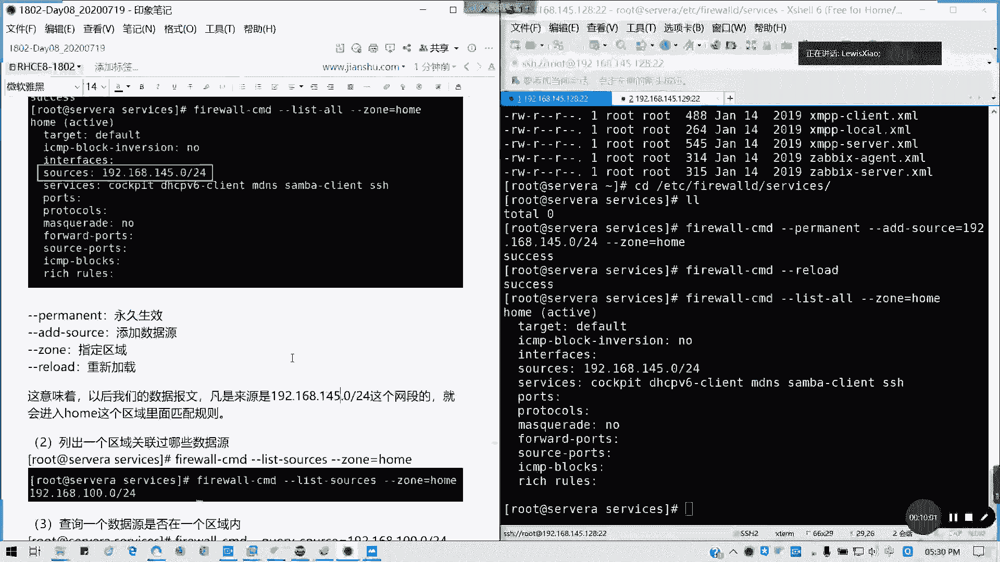
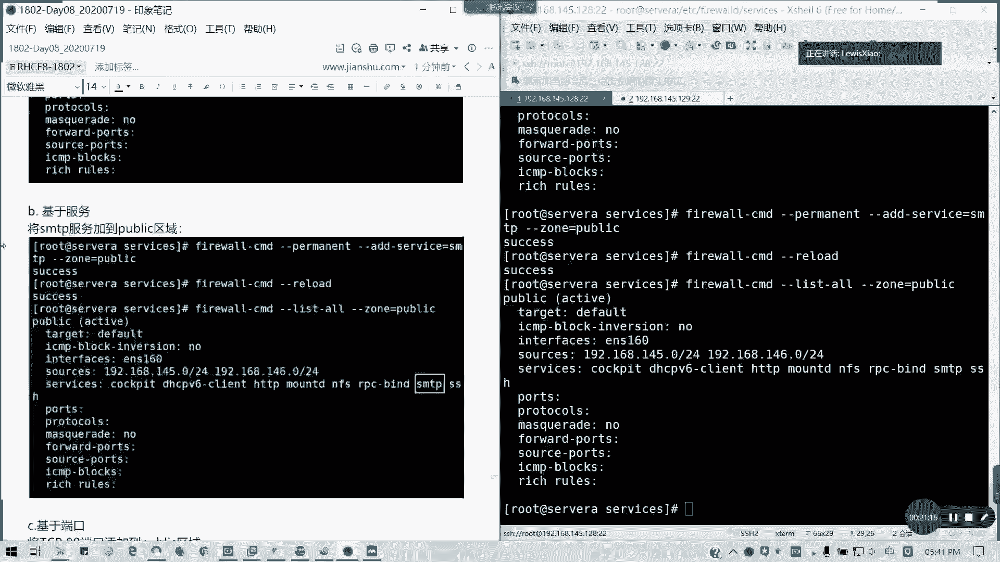
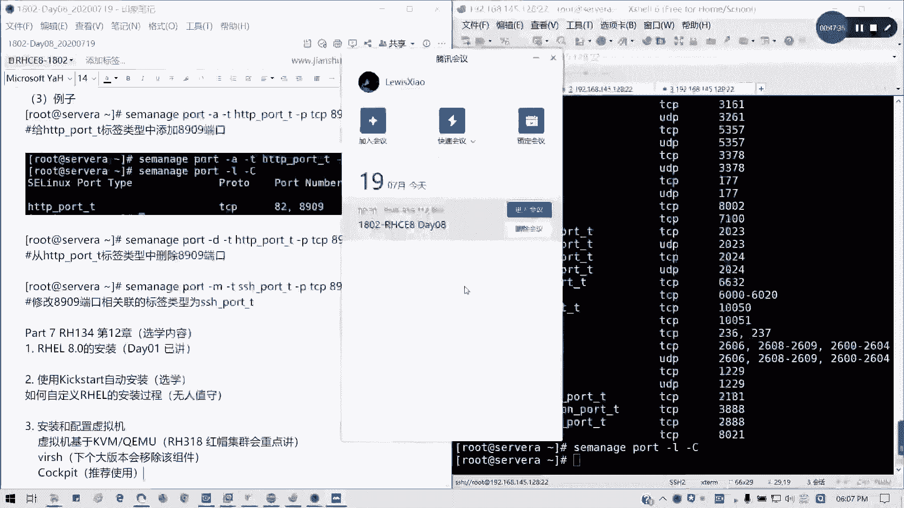

# 拿下证书！Redhat红帽 RHCE8.0认证体系课程 RH124+RH134+RH294三门认证视频教程 - P50：50_Video_Day08_RH134_Ch11_管理网络安全 - 16688888 - BV1734y117vT

好，我们开始讲最最后一点内容，讲防火墙。今天我们这次讲到6点钟啊，然后还下周还有一次6点。然后呢，我们是这样防火墙的概念知道吧？我们的防火墙规则，比如说在允许10点10。10。0访问serv。

那我们通常在linux包含的组件里面有一个叫netfr来执行包忽略操作，对吧？若需要我们netfr去帮我们做事呢，我们需要知道两个东西。第一个我们规则要怎么写，如何去匹配规则，对不对？这需要知道这两点。

对不对？像我们防火箱里面是有是有每个区域，对不对？每个区域，然后我要知道这个包的原地原地址要包关联到哪个区域，然后它这个区域就就会去到我们相关的一个区域里种里面。然后我要这个数据包这个玩法关了哪一个。

然后进入它去匹配规则，对不对？我们防火箱我们在实体的防火墙是一样，就是每一个有规则，有区域的，对不对？在linux里面也有。这样规则的话是针对我们不同的网段，我们想配置。

不同规则时候可以划分到不同的一个区域中啊。在我们配置这个防火箱之前呢，我们需要把我们的圆。跟我们的网卡的区域去配置好。在默认情况下，所有的网卡都加入一个叫public的一个区域。对不对？

这里都中在我们7里面是9个区域，在8里面加了一个li live，也就是我们虚拟机专用的一个区域。在7里面是没有的，8里面增加了，但对我们没太大影响。我们区域的默认配置可看一下。

tras是允许传输所有流量，就是我这个区域是绝对信任的，对不对？像还有对应的是block，就是拒绝。对不对？除非跟传输流量相关。然后还有DN这区域的话，就是跟我们的预定匹配。就我们对我们的一个。

外就我的外网一隔离，我我们的边界对不对？DMZ。然后还有就是我们的home啊。home啊，还有internal本地对吧？跟后me区是差不多的，就本。本地啊还有一个work，就是那个它这里是有一丢丢区别。

那public是我们通用的，对不对？如果默认的话，默认除了SSH跟DHCPB6是吧？这些放通之外，它其实他都会拒绝。所以说我们为什么刚才我们在做MF的时候，一开始你你这个流量是传不出去的，懂我意思吗？

然后通常我们firewallfwork这个服务，我们在那个。默认你就装了啊。我们的winux系统防火墙服务。默认已经都有装了，对不对？0637。七的版本可能要旧一点，但是八的话已经更新到这里。七的话。

我记得是规则只能匹配一个，但八的话你可以匹配多个规则。

然后我们fiworkCMDhelp这里面很多的东西。对不对？然后呢，我们来讲一些常见操作吧，时间关系我们讲一些常见操作。列出我们的所有区域及服务。Fwork。CMD杠CMD啊。

记得fi沃是有CMD是有带杠的啊，然后get。记得我们完整单词是前面有两个行横杠get，对不对？我们当前是有10个区域。

有10个区域，然后我们可以列出我们默认区域是public，叫get default。总对不对？我们通常呢在没有说明特定的情况下，我们把所有的服务都放我所有的区域都放在pub里里面。

然后我要一些预以订义的服务。List all。

对吧。他会会帮我们列出我们当前。预定的一些端口以及服务，对不对？这也是我们已经预定义好的，懂我意思吗？

买港东盟卡这么多网卡呢是之前我们在12张网络管理时候建立的，懂吗？所以这里个网卡的话，你看具体自己的一个数量啊，这里的list all呢。

我可以后面我其实它的简化成叫做其实我这里的简化成一个zone等于p。其实它两者命令是一样的。它默认日列就是发 publicublic区域。然后它有一个ges service，我们可以支持这些服务。

就是我们支持哪些服务去做我们的防火箱规则。ges services。

对吧这么多。其实够用了啊。一些我们常用的服务全部包含。服务的话，大就涵盖相当我们的端口。对吧。然后列出我们的预定义文件，在LLusUSRlib。fi我啲。里面的servビs。对吧。

总共我们可能你的我们新的版本之后可能会更多哈，在8。0版本上面，你已经有616个之多了，对吧？再可能在8。1可能会多一点，对吧？然后呢，在这类的话，在这个目录里面还保存了一个配置文件。

每个文件对着一个网对接一下网络服务。比如说像SSH这些。然后对内服务里面记了我们的记度我们的TCP以及UDP端口。在最新的fwork里面已经定了70多项服务，然后供我们使用在我们的那个。啊。

我们的红外8。0里面。已经有616种啊。但当默认服务不够用的或者设定义某项服务接口的时候，我们可以需要。啊，将service文件放在我们的ETC发我Dservice里面啊。目前是空的。

这里说这里的话主要是。为了自定义才用的，但通常我们还没有涉及到这么多，除非你是一些特殊的软件，对吧？特殊的一些应用。那我要自定端口服务，我要写规则，那我就放在这里。就可以了这个位置啊。

service配置好处啊，配置好处首先页件。第一个我们。服务名称来管理规则，这样会更加的人性化。然后呢，通过服务来组织端口村组织模式会更加高效，对不对？

然后每每家载项设别的配置就意外意味着开放了端口访问，懂我意思吗？那我们接下来我们要关联一下我们的防防火墙区域。放牛去，比如说我们将当前的145。0，然后加到这个重里面，然后来。

Permanent add。添加我们的来源。As a source。等于。192点，这也就有时也可以用tap补权的。干24，然后造我就要加入个home里面。然后记得我们操作每一项之后，记得捋露一下。

🎼那我们看一下啊，看一下我们的。类似哦，然后杠杠做对好。是不是把sources我们这我们刚才加了之后呢，是不是把那个要素0加到这个区域来了？对吧。

然后permanent这个perman这里呢是永久生效ad source的作用是添加我们的数据源重是指定区域reload重新加载，懂吧？

听明白吗？好，这意味着以后我们数据报文，凡是我们是192。168。145。0-24网段的，就会进入home这个区域去匹配规则，懂我懂我意思吗？然后列出一些数据啊。

列出一些我们的区域管理功能的数据员listase sources。

造等于号。

是吧。这是第二个。查询一个数据源在是否在一个区域内，我们有一个参数叫queary。Pレ sauce。等于192。118点145。0-24。然后后面造等于how。

对吧他会给出一个过值。

Yes。更改数据源到另外一个区域里面，我们可以用change source。我改到pub里里面。如果你万一我们弄错了一个。弄错了，我们的重的话，我们可以更改，对不对？面怎么写了没有没有吧。

比如说我一永久更改，我就后面加加一个permon就行了。然后在旅豆，记得每次。对规则进行修改，记得捋录一下。查询这些都不用啊，懂吧？然后怎么验证是吧？这也就弄了，然后p就y，对不对？

好，这一课应该没什么太这个应该没什么太大的疑问啊。

原问及时提出来。那呢对网卡我们可以查询网卡关联区，像像我们的list all里面。

这里网卡我4内网可能比较多，但是没事啊。

对网卡操作的。

对网卡操作呢一般不是添加ad interface，而是chanch interface，懂吗？它默认会添加到其中一个 zone里面。那我们这里只需要chanch interface就可以了。

比如说我把药店盖盖到后里面。Change interface。那等于ES160。当前只有一个网卡，中等于后。对吧。然后借律漏一下。

他这不是加的啊，因为他这个网卡本身就必须在一个区域里面的。

懂我意思吗？

然后验证。

对吧。在home里面我们就看到了有了。对不？

那我可以从指定区域内移除，然后恢复到默认的一个区域。

我可以从指定区域内移除到恢复按默认区域的话，我们就可以用remove，对吧？

他s to default，懂我意思吗？拿现诅肉一下。我们刚才是改变，还有移除。从洞里面移除，然后它是要setting zone to default。

O。然后在p里里面，我们就可以找到的。默认是在pub里面，对不对？

我又回来了。

那我们也可以将。网络添加到指定区域里面啊，就ad一个face。

O。小杰啊，所有的网卡都应该在默认区域内在正常情况下，如果我们去不想把去设置，把原分开或者网卡分开，那我们所有就设交花呗就行了。默认区域如果想分开设置，那我们就要把数据源或网卡啊。弄到对应的区域内啊。

分配到对应的区域内，这个能懂吗？

现在我们讲防火墙设置。我们通常直接用finCMD去操作就可以了，不要直接配编辑配置软件，因为这个其实太麻烦了。对吧命令这么多，然后基本规则。我们看一下。

比如说。

基本数据数它基本规则啊，它那个防火墙配置基本有基本规则跟负规则基本规则。比如说我要把一个新的网断，我要添加到我们的。他宝的里面。可以吧？比如说外来的些网段。朋man的我。Now， add source。

其加了之后就像当一个放行啊。等于192。168，比如说我1个146。024。围绕完，我再看一下list2。是不是我们加样了一个新的网段就进去了。

这种加速员它是一个放行的啊，如果不在里面，它是它就是类似于白名单模式，懂吗？黑就如果不在里面的话，相当于相当于我是拒绝的。

他这种是相当于白名单模式。

他通常说是机于我我是图贴的先啊。

这里我把猪换了啊。我们可以基于这整是几种端口服务，还有。

数据源。

居于服务。就说我加个HTTP。这里有啊，比如说我加1个FS这些。Wherehy the service。我就比如说我加1个SMTP啊，虽样我们没装啊。Don public。

如果py里盒默认是可以不用带的。原绕一下。我这也是改一下，将SMTP我们的发件服务器，对吧？25端口。加到我们的区域里面，那我们再看一下。

是不是有了白名单。在这里。对吧。

A service。就加服务的，刚才我们是不是也试过了，对不对？刚才我们在配NF的时候，是不是也试过了？

加服务对不对？

基于端口我可以加1个80端口，对不对？我也可以加端口。把这里ad service改成ad port。然后记得后面是80。斜杠我因为我们。服务我们那个端口有分TCP跟UDP的，对不对？所以记得后面要加啊。

不要说是80就没了。懂吧。re漏一下才生效，记得每次都 re露一下。你如果是你一次性交换所有规则再 re漏都可以。我这是一个例子， re漏一次，我们看一下。

至少80pos里面80TCP已经列进来了。所以虽然这里我讲的快一点，但是大家都能理解啊。看到没有？80TCP在这里。

好，接下来讲负规则，副规则是我们的自定义规则概念呢，它是也有提供一种表述性语言啊，通过这种语言呢将可以表达fire沃第基本语法中未涵盖的一些自动与防火墙规则，懂我意思吗？它规则自定义的。

他比如说啊仅仅允许单个IP，而不是某个区落的所有地址连带服务，对吧？独独立设置白名单，懂我意思吗？不规则可以表示允基本的允许拒绝，也可以表示配置记录。比如说slog audit。

这些端以及端国转发数数据限制等等。但是我们今天不讲那么多，它的入字段呢，它的基本语法就是弱来源目标，然后协议类型。是否是记录或者是那个审计，然后后面是动作，对吧？你写的副你写的负规则，你要写动作给他。

而不是说摸一味的放心，我可以把它丢弃，可以把它拒绝，对不对？

通常在我们的一个。M。通常我们可以查可查阅啊。可查阅man。然后5。fire卧低。点rich language就附规则语言。好吧，可以查。不规则的规则排序，一旦向某个区域或一般自己防火墙添加了作落规则。

规则顺序便会在很大程度上引起我们就影响我们防火墙的行为。对所有区域呢区域的规则到基本上是相同的啊。第一个出约顺序。第一个是。为该区域设置的一个任何端口转发以及伪装规则。第二是为该区域的任何记录规则。

第三是允许第四台拒绝它的一个。优先顺序。懂我意思吗？转发伪装是优先的。然后是记录允许在就记录仅记录的，然后允许他拒绝，懂吧？白名单模式。这个是白名单思维啊，懂吧？好，副规则它有4个选项处理副规则。

通常与permanent，还有重组合使用ad reach rule是添加具体复规则，移除是改成remove主我，你一跳记录，你一个负规则，我不要了。解禁了或者写错了，对吧？

用remove reach rowquely reachr就查询添加指定区域，它也是反映一个不可值。yes or no，然后还有列出来所有的副规则，对不对？

任我们任何比配置覆规则会显示list all或是list all zone里面啊。的输出结果。你是脏是吧。对，是重死的，不是重啊。然后我比如说我要拒绝我1个IP的一个流量。我配置一下14。129。

我设为A，我拒绝serv为B的流量接入，可以吗？来试一试啊。我们这试嘛？来。呃。fi我 cD。例如s我B。啊。permanent永久的ad rich role等于这里用带引号啊。如可以看得清楚了。

但引浩ru family。他的。不规则的家族是IPV4啊，我们现在通常讲IPV4没有配讲到IPV6的，懂吧？然后源头地址。源头192。168。14。129，我这里后面写不写32度无所谓。

写32度是他唯一个地址，懂吧？サービス。那。等于FHH然后reje。そうです。拿走来。OK就这样吧，好吧，我拉上去啊，看这SSH女dress是吧，我把这个源头地址的SSH服务，我不让他来拒绝掉回车。哦。

等一下啊。我这里。多了一个等号，懂吗？好了，success。🎼然后呢，我reload一下。那好，我现在我要远程一下是不A。对吧。

拒绝掉了。就要这种效果啊，懂我意思吗？拒绝192。168点145。129，也就设个B。这个SSH数据源。

的SHH流量。全入。懂我的意思吧。那我现在我连过来。

是不是不给您了？

没。验证啊很简单，如果使用sourcece destinationination跟address选项配合使用的话，如果分比例啊，我们要设置为V4或V6。然后如果要撤销，怎么撤销呢？

我刚才我比如说我要把它移除。我这里写成remove就可以了。懂吗？对吧。我解禁了，在雨录。

撤销操作也就是移除规则。不规则哈。然后现在我重新连接。可以的对吧？立竿见影的啊。这里我们补充一下retract跟jo就是reject值这范为个ICNP包，对吧？对这间范围跟ICNP包。

然后详细描述拒绝原因，然后job就丢弃了，不进行正在操作。所以的话我们通常说对于友好跟重意的网络，我们就使用你ja，至少告诉大家我为什么拒绝了，对不对？就我拒绝你，然后对恶意网络是使用撞，懂我意思吗？

那比如说。还有就是允许特定数据源的一个网络接入。那我们可以建立多一个负规则。add source同样14。024位。然后呢，我这里不是一个服务名称的。我是要。啊，我的port对吧？

我允许端080端口接进来。特殊的端口啊。ま日。就可以了，对不对？可以吧，允许这个段的8080端口访问访问进来。我们我开着这这台机8080端口，然后允许他来访问我的，明白我意思吗？

诶。看一下。sourcedress没错啊，14。024。啊，不是迷路佛哎。应该是ad。然后还还有一个proto code，我要写，就他到底是哪个协议啊？Ptoco。等于TCP对吧？的端口。

允许8080端口接入传入。允许192。168点145。024位。地四段。访问本机的8080端口。懂我意思吧？这个就是我们粒子的一个作用。所以我们的fami里这个啊都知道了啊。

IPP4来源目的IP这是格式来的。不规则格式小结。明白了吧，写法。然后端口伪装啊伪装的话，其实它就是相当于隐藏自己的IP地址啊。就比如说我未网通过外网的话，我本来40点1我就变成202。

202这样子当时伪装懂吗？伪装是一种形式的一个网络转换。到这里的话，我们伪装。的运行规则事例，就比如说我原包40。2，然后发到40。1，然后把它改成202。202，对不对？然后如果回来的话。

我就还要要做进行一个转换，懂我意思吧？也就不让大家知道我到底内网地址什么，我只知道我只公布了外网地址出去，懂我意思吗？所以我们这里的话有就有一个clely maquiad和remove ma啊例子。

在这里我们允许伪装。source，然后呢，后面我直直直接打上mque。这样就可以了，我这样的话就允许。进行伪装啊，然后重新捋露一下。说这个用的我现在我们这里用的不是太多啊。

伪装主要是为了保为了一个安全啊，对吧？为了一个网络安全。然后端口转发呢。端口转发。也就是说，相当于我把某个服务隐藏在另外一个机器机器后面，然后我用备用端口，对不对？比如说我80端口不想让别人知道。

我就弄了一个叫5423的对吧？你访问这5423，就相当于访问我们的这个80端口，懂我意思吗？这样的话是为了保护我们的端口安全，所以叫端口转发服务。我们就把原来80端口屏蔽了就行了。对啊，不对外网开放。

然后外网我只发开放另外一个端备用端口，懂我意思吗？业为环境就是安全起见嘛。然后我们端口映端转发跟映射区别就是我们快递收发是吧？端口转发主要在转上面，就所有都交给保安，保安来分发。然后端口映射呢。

就每个人装个柜子。懂我意思吧？每个人装个柜子，然后按收件的名字换投递嘛，懂我意思吗？这样就比较形象了吧，转发跟映射是不一样的。像我们做1个5423的，这个在7在那个7。0会有一道考题的啊，将那个14。

024的5423端口转发到80端口。我们在servA上面设置端口转发。同样来源是14。0-24，然后forward。Po。port等于5423，然后protocol。就它的转发的端口是5423。

我们自己定义的一个端口，懂吗？可以吗？可以懂吗？然后protocol等于TCP来自TCP的542特端口，我开放这个转发端口。然后呢，它的目的端口是到达哪里的？80。从5423转到80。

也就是我可以将80可以对外关闭。但是我访问这5423，相当于访问80端口，明白我意思吧？可以吧。捞驴漏的。我们试一下访问效果啊。口说无凭，我们以以实力来验证。老搜一必。My cure。192。168点。

100。12不145。1285423。现在为什么不行呢？

我专的这端口没放通啊。对吧。这断口没放通，我怎么行呢？那所以我要放通，对不对？对捋录一遍。我没放通，我怎么反问啊？来这边试试。还是不行哦，我的HTTP服务是不是没装啊？

我记得机器哦还原过了，所以都那个服务没装。🎼所以这一个其实我们的发默认的一个五色端是是不用去放通的。前面我们一段就行了。转完之后我们启动服务就知道了啊。然后要啊DNF。But service。

Enable。s等 controll啊。你 name冇。杠杠闹HTPD。然后呢。我们在。我们启动HTTPD服务之后呢，我们来。我们来那个写一个主页啊，写一个页面上去。拖展稍微拖展一点时间。

我们就最后讲还有一个端口上下文啊，一点点时间就够了。我们to取一下。我们把VIM啊VIR3WHTML里面的index。点HTML。然后这里我写的。This。Is the test page。好。

保存退出。然，我们现在试一下端口转发行不行？

可以的，对不对？我们的放型都不用放，我们的那个五色装其实放型都不用放的。

因为转配置转化之后，它会它是通的吧。好，然后这个145。129的80端口，这个也是可以配的。就转发到别的机器的一个。80端口。

也是可以的。不过这个通常比较少用。通常比较少用啊。也就是我们的ad forward port。port，然后等于。然2 four port，然后port等于80。postTCP啊，这个我就不再演示了。

我们就留在这里就行了。管理SA电子标记。我们想我们上次讲了那个上下文，对不对？我们讲讲了安全上下文，还有一个叫端口上下文应用情径呢主要是自定义端口。比如说我们前用一个自定义端口的时候。

像8080它是在里面的，对不对？像8909就没有。SE managerport杠L。我们8080是不是在我们的那个常见的1个HTPc里面，portT里面，但是有些端口是没有的那我们就道怎么添加。

这有时候呢就是我们的一个次定端口，你哪怕放了之后呢。你还不能被访问，懂我意思吗？所以的话我们这里的话有一个用法，就是SE manage。我们可以列出来嘛，post杠L列出一大堆。

它默认定义的一些端口上下文。对吧端上我列出来了，然后杠C的话。杠7的是我们的一些自定义端口，懂我意思吗？如果没有自定义端口，那我们就这里就不会显示。像这里我是定1个82的，所以的话它就有了。

那么怎么添加？

SED的是我们添加自定端口对吧？杠port它的多端端口类型不是叫F contestt，叫port了，对不对？port，然后呢，泡面的T杠P啊。刚P是协议TCP然后我们的类型是H类型。

看看一下你具体的像HDPHDDP我要加8909是吧？8909不是我们HTTP的默认端口啊，也不是常见端口。所以的话我们要把它加上去。

对不对？这个应该比较明白了吧。添加我们默认端口，然后这样的我们像才是会放真正的放松访问。在SE开启的情况下，懂我意思吗？然后既然有加添加就有移除，还有修改它的类型。好，十一章已经讲完了。如果明白的话。

请打11。然后12章我们就不讲了。因为12章我们有一开始已经讲过了啊。一开始已经如果第十一章明白的话，请打个1，请打11告诉我。第五。第六第七啊，刚好是第七。我们这个安装的话。

我们第一天是不是已经讲过了，对吧？这里ki star的话不做考试要求，大家可以去看一下，就如何自动化。如自定义。RHEL的安装过程。对吧主要是无人值守。对吧文字手这一块，大家可以去看一看。

安装配置虚拟机QMU。这块的话也是选学内容，但是。这一块呢，我们在。我们在HEV也就318的课程。HEV里面。红帽集权。会重点讲。最快的内容在318里面。然后VRH我们下个版本会移除这个组件。

所以的话就就9。0，我们会移除，所以就不会再讲googlepe我们在15章已经讲过了，在第一本书15章讲过了。所以呢我们到现在今天为止。前两本书，也就是我们的IHCSA8。0的部分到此全部结束啊。

重点内容我经列在笔记里面了，画出来了。然后呢，从下周7月24啊，不25号、26号开始。还有一个8月。8号也就8月15号，1月9号我那天有事情，所以说到了时候出一个调货通知啊，基本上我们就剩这么4天这样。

下下午考试部分，我们现在所讲的是所有是上午考的部分，下午全部讲S博不讲任何服务。但服务的话，我会穿插一下HTTPD的一些基本知识。因为我们经常拿它来做实验做地址。所以呢我们下周的话，大家环境不用准备。

不如果你们已经有环境也可以拿，也没问题。但是我这里的话，我告诉大家，环境不会做这样的准备，我会教大家如何去。自己亲自部署S5环境好吗？那我们今天到这里，笔记跟视频稍后上传，我们下周见。

