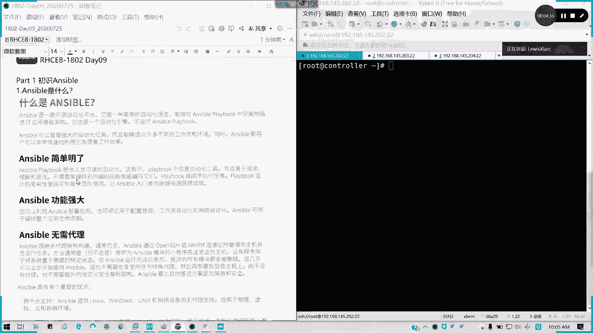
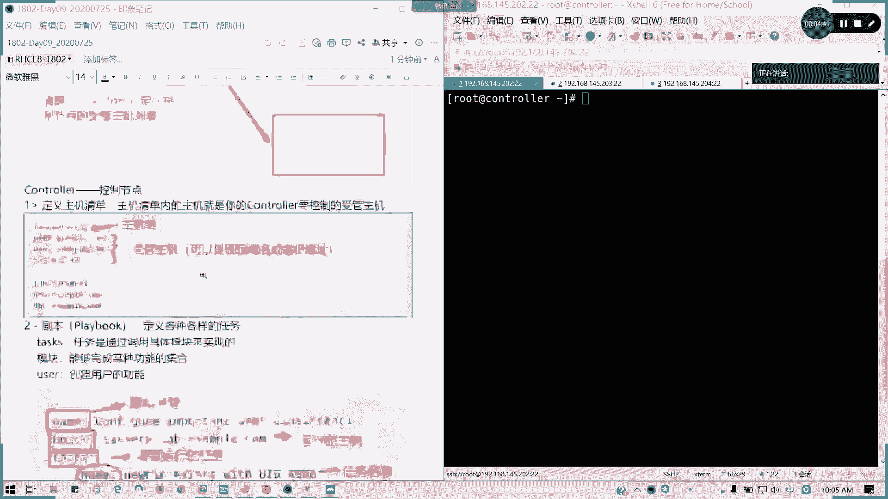
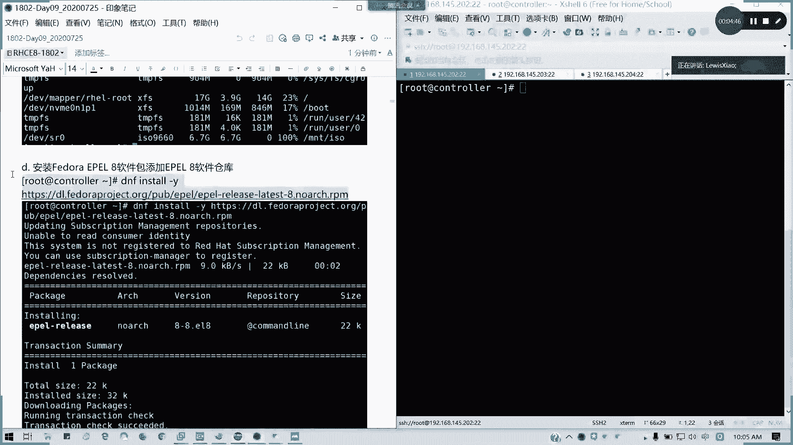
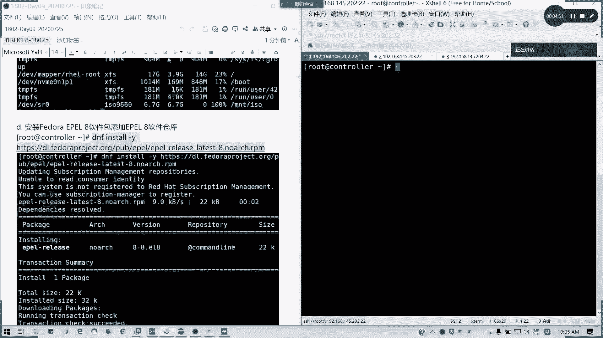
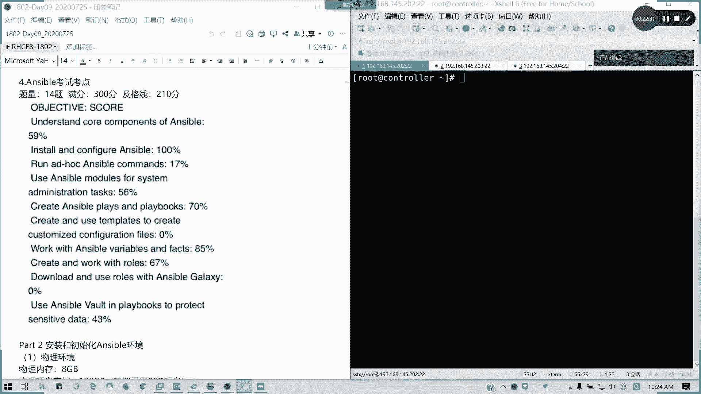
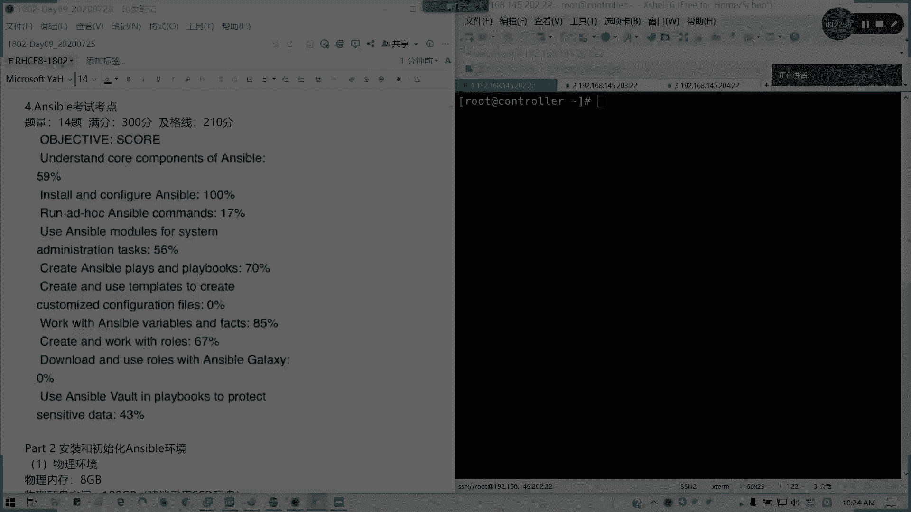
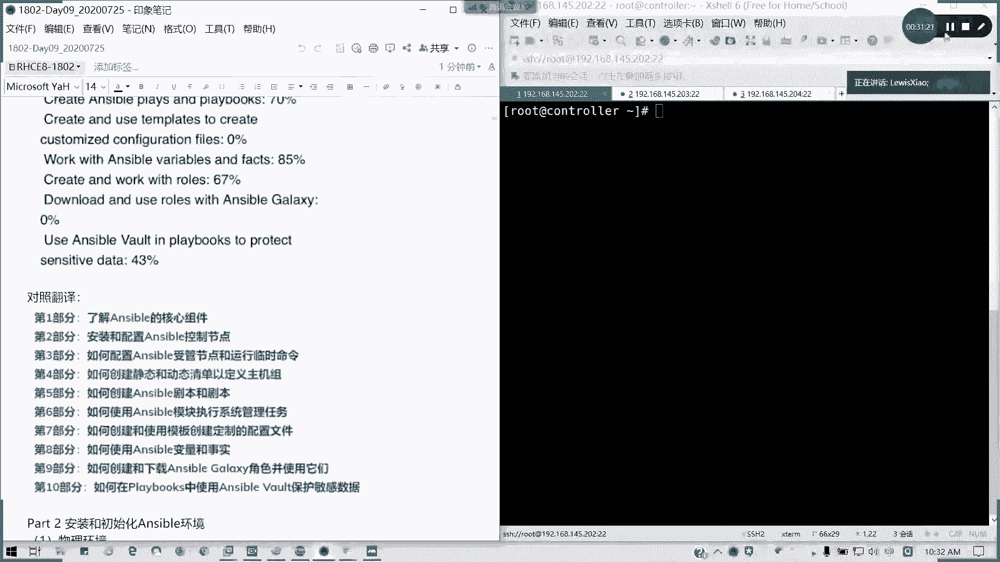

# 拿下证书！Redhat红帽 RHCE8.0认证体系课程 RH124+RH134+RH294三门认证视频教程 - P51：51_Video_Day09_Ch01a_初识Ansible - 16688888 - BV1734y117vT

🤧好，我们就不浪费时间了啊。那各位设计师妹们，各位同学们，大家早上好啊，我是小杜师兄。今天到我们课程第九天，前面8天呢，我们已经把RCC的所有的东西已经学完啊，已经学完。这个的话啊我们这个步骤呢。

待会会讲啊，这个直接直接你联网就可以安装的了，不不需要那个啊邓文西。然后呢，我们接下来会开始啊4天的时间，我们就讲ensible啊，讲ensible下午的内容。

因为最近呢刚刚7月20号以及7月23号在广州跟深圳啊，在广州跟深圳已经进行完了第一批就是RHC8。0的考试。出来结果其实就喜忧三半啊。喜忧参半，有些人犯了错啊，基本上那个通过上午的话，大家都通过了啊。

上午都都比较好，但下午的话有些人挂了，而且最低分还到11分啊，300分。放到11分，然后呢。所以的话我这里包括啊原本我是没有设计这东西，但是今天我要包括这些坑的话，因为在我们配置在讲的时候，我们会。

说大家怎么避这些坑，然后练习环境可以不用。因为我看到有些像陈雨欣这样子配置已经是很呛的那我不敢给大家用练习环境。因为练习环境的话，你16G内存要I5以上，对吧？I5以上，所以的话你的那个你都已经报了。

所以的话我用就用裸机教就可以了。我们练习环境呢留在什么时候用，留在我们考前辅导的时候用。刚才让大家准备上台机啊，如果OK的话，其他人已经回了Y的，不用不用再回啊，不用再回。然后现在弄完了回个Y给我。

我看一看人数。81234567。89101112131415。16好。17啊1819。好了，那我们今天我们不不对以前做回顾了，以前的话请大家回去自己看笔记跟录屏已经很清楚。好吧。接下来我们4天时间。

从现在开始，我们开始讲Sible内容。Sible是自动化运维啊，自动化运维啊其实难不难不了多少的，难不了多少，待会给大家一个图，一切都清楚啊。我们第一部分来我们来初始anszeible啊，我打错字啊。

初始anszeibleensible是什么呢？anzeible呢。在我们以前是407的科目啊，以前是CA的一门科目。然后考过CA的人都知道丢407是最简单，而且直接那个考完很快就出来的内种。

所以的话为了迎合现在云计算跟自动化的一个。趋势。所以的话红帽把407的大部分啊11半左右内容下放到了294，也就是我们现在的C18。0。所以以前我们C17是不考，我们是考服务的，对不对？考服务的。

现在C18全部考anserable啊，就考这个东西，自动化平台的应用。艾ible呢它是一个自动化的开开源的自动化平台，它也是一种简单的啊简自动化语言。

它能够在艾ible剧本里完美的描述我们的IT金属用架构。现在我们还很多都提停留在我们人工的这种部署阶段。因为Sible呢，它可以运行剧通过运行基本剧本来管理强大的一个字画任务。

而且能够适应不同的工作流环环境。对于我们的工作效率提升是非常大的啊，它有几个特点，一个是简单明了啊。一个是简单明了，一个是那个。这元素就过期了哈呃一个是简单明了。一个是功能强大，一个是无需代理。

简单明了，它提供了人类可读的一个自动化啊。

我把这个地址我复制一下，我看看啊。他可能有更新的不不不一定。

我做一个试验就知道了啊。我这边能下载啊，没有问题啊。你DNS配有配有问题吧，东文西。考试要自己安装啊要自己安装。考试这样说，我待会会讲呃。它简单明了呢，它提供人类可读的自动化。

这表示我们的剧本啊pri book我们叫剧本啊。剧本不仅是自动化运维工具，而且易阅读、理解跟更改，不需要掌握特别的一个编码技能。也就是我们不需要掌握很复杂的一个编程语言。就很编辑他们play book。

我们那个剧本呢是按顺序来执行任务。play book的设计的简单简易性，使其可供每个团队使用随S入门者能够快速的获得我们的成效。它功能强大是用它它主要我们的用途呢就是配置管理啊。

机构于配置管理工作的自动化跟网络自动化。它可以编排整个的生命周期。就是比如说我工作的一个我部署从部署到应用到上线到应用回收，经器回收整个流程都可以用S来进行。但我们可能只讲一些部分啊。那不需要代理哈。

不需要在客户端。装什么东西啊？它只需要通过VI默是我们的，我们这里要讲的叫做免密的open SSH的认证啊，通过公司要而不是通过密码认证来管理主机运行任务啊，通常就是把S5模块小程序推到它的主机。

然后主机呢用于将这些系统呢到制造特定状态。我们会讲到一个叫密懂性的一个东西。Sible运行任务，它只运Sible呢，如果运行完任务之后呢。整个所有模块会被删除，就几乎可以立即使用。

而不需要任何的特殊代特殊代理，然后部署到事务管主机上。由为没有代理，我也不需要去自定安全的基础架构。所以的话它的这一个效率会更加高，更加的安全。然后呢，它有几个重要优点，就是一个跨平台支持，对吧？

所有都可以啊。无代理支持啊，所有都可以通常个物理现在包括连部署opent，部署我们的s，我们我们的那个open shift其实的话都可以用S博来做啊，就我们的环境啊不需要我们银行啊去敲代码或者是跑安装。

ensible可以帮我们。一步啊，我就直接跑一个或几个剧本。如果是多个剧本的话，我们可以称之为角色啊，我们编辑一个角色，将对我们一个组件就可以完成了。然后呢，它的编写是采用样某的格式。

样某格式基于python啊，所以他这种是易于阅读。我们在明天会讲到关于剧本的编写，今天暂时不会提到，因为今天任务内容比较多啊。然后他也可以用来完美的描述啊，及记录我们应用环境。

因为我们可以通过剧本来进行每一项的更改。这是一个我们的概念的一个问题啊。还有一个就是它的一个版本控制啊。因为我们项目都全文本，我们可以设员代码啊，还有呢就是动态清单，也就我们的计算机列表是可以变化的。

还有变化的。然后呢，它可以轻松编排啊，跟其他系统集成。但这里的话我们就只讲它的一个应用，考试也只考它应用，我们不会跟那个其他的系统进行一个混合。但是它有一门高级课程啊，有几门高级课程。

比如说我们的DO407。我们DO407啊，D像我们的IHC的话是有DO407，还有DO447之类的。但适应期的话，可能以后可能考可能也比较难考了。

适应期是完整的一个answible测试期是answible啊，practice它自动练它它的一个练习。S么呢主要啊。我们这门课叫IS294，考试代码叫EX294啊，EX294主要是用于批量管理服务器啊。

主要以下场景。比如说我们的所有服务器的一个通用配置。比如说我们安装基础的安装软件包是吧？安装软件包，我们是可以用什么来做是吧？我们的重启就启动启用服务，我们的一些像文件的生成等等啊。

应用管理、服务管理啊，系统管理都会涉及。到网络我这里不会不会去详细去讲。不会详细讲，因为网络公布管理功能确实没有像我们自己的自己配置那么好的考试也不会考到啊，考试主要考自动化啊，考自动化考试呢。

待会我们讲啊，我们先看一下anible的基本架构。基本架构一个图可以搞定所有啊。如果你理解这个图啊，你们先花一分钟的时间你看一下这个图。这个图的话，如果能理解，基本上s没太的问题了。

先怡花一分钟看一下这个图。好的，我们来看到啊S的基本架构是不是如果你看到这个一拖几一拖四啊，假设一拖四，我们现在这里是一拖二。你们会觉得是不是跟司令部指挥打仗很像啊？对不对？相当于是我的一个指挥部啊。

司司令部指挥指挥部。然后。我指挥部，我跟你跟我下面的连排我士兵是吧，建立好信任关系之后呢，我是不是可以发号设定我司令部我要指哪你就打哪，对不对？懂我意思吗？

就是这asible其实我们的基本架基本的一个架构就这样子。当然了，它是怎么去发号施令呢？比如说我要让一台叫servA的机器去执行一个创建用户的一个任务，对吧？我要让创建一个指定的用户指定的UID。

然后它是要生效的。那我控制节点呢，我们的controller或者是我们叫what station。通过首先比如说我要让让node一，我们n的我们的数管主机啊，我们有两个概念叫控制节点，应该做数管主机。

宿管主机有另外一个专业的名词，我们叫资产清单啊，就那个我们可以在control里面，我们配置我们跟啊SSH方就是通过我们的open SSH这一块的话，呃，建立一个免立码，通过公司要去进行认证的一个配置。

这个配置呢，我们在之前在哪里讲到呢？在我们124还记得吗？我们第一本书。第十章。对吧管理如何去管理open SSH管理和配置open S。安全的SSH那里的话已经有讲到了如何去配置我们的一个。

尤去我们配置的我们的一个免密认证，对不对？我们相当于哎我要指挥你去干活是吧？我不要说打仗我们和平年代，我们去干活，对不对？干活是不是我要先认识你先啦？你要我我要就你我下属，我要信信任。

我上司我才能听他的话，对不对？那这个就是相当于建立一个免密连接，建立一个信任关系，然后好，建立完之后我是不是有一要要要发布任务啊，发布任务的话，我们这里充称为剧本或者是角色。

有两种角色是多个剧本的一个结合啊。按照规定的一个编排格式，然后形成一个角色，这是多剧本的一个结合。也就是我相当于一个模块，也是大额模块。然后呢。剧本应该知道吧，我们演戏啊特别特别是我们做演员对吧？

你做演员，我哪怕是当歌手都好，你是不是有个台本啊，对不对？台本上面写写摆了你的，你你要演，就我们演戏，我们做演员的时候，是不是我们要看台本去演啊？它里面是不是写你的角色，然后你要说台词，对不对？

懂我意思吗？然后包括我们歌手是不是我们有有有有有有谱了，有乐手是不是有乐手是不是有乐谱啊，歌手是不是要有歌词在在上面啊，特别是我们录音的时候，对不对？所以的话其实在an里面演是类似这样的道理。

我要让下面干，我我信任之后呢，我要让下面干活，是不是我要写一个东西啊，那东这个东西就叫剧本或角色。来定义我们需要管理一这些任务。然后呢，他这些信任的，我们下属怎么来呢？通过清单啊。

通过清单来定义我们的售管主机跟列表，他不他不只可以对一一个人一台机去发号施令，我可以对任意多台。一对相当于是一对多的一个关系。所以的话啊我简单的阐明了这一个anerible的基本架构。明白的请打。

明白的请扣个Y啊请扣个Y。然后。有疑问的可以提问，大家要理解这个架构，不然的话我后面的东西白讲，懂我意思吗？现场的你明白吗？明白的话，我们就来讲接下来的一些组件啊。控制节点控制节点它的一些用途。

第一个定义我们的主机清单。主机清单呢就是我们的控制节点需要控制的一个受管主机，也就是我们的的一个发号4令5的士兵。我的下属对吧？通常它的类似就是这样定义，我们通过一个可以帮它把它分组。

或者是把它单调出来，然后下面列确出来，它可以是界定域名或者是IP地址。当然它域名跟地址是两个的啊，我们在后面会讲到你如何定义，你就如何调用。不要说我一会儿我同样的一台机器，我一会儿写域名。

一会儿写就我调用时候调IP对吧？我写的是域名，就在我清单里面调域名，然后我写的是我那我真实调用时候，我写的IP地址，这样不行的啊。它IP的域名的话，它在清单里面是认为是两个东西的，懂我意思吗？这个是。

controller的第一个作用定义主机清单。第二个作用我们要要定义我们的剧本或角色。剧本呢是用来第个是各样的一个任务啊，定义我们各式各样的任务啊，任务我们的简单的一个列表啊，简单一个列表。

我们可以看一下它任务的一个结构。任务的结构首先我们的一个剧本名称，剧本名称，我要阐明我这个剧本是干嘛的，对不对？我这个剧本要来干嘛，我的作用是什么，我要写一个注释，但这个虽然不是必备的。

但是我们这种还是要养成一个习惯，养成一个习惯说我们这个剧本呢，我们要像我们写脚本一样，是不是我们炫有任务是不是要经常写注释，对不对？要写注释，对不对？也就是你不仅要自己明白，也要让别人去明白。

那所以的话我们这个名称是必要的。然后你这个剧本你要运行的你你要发运行在哪台主机上，也就是你要发奥示例给谁去做，也要写。然后接下来就是我们。运行任务运行着务呢就是每一个任务一个名称啊。

一个名称也是同样写注释。然后后面下面是我们的模块以及参数啊，这个例子呢是创建用务的任务剧本啊，创建务的一个任务剧本，就把刚才那个new比那个我转化成这这样子来写啊，转化这样子来写。这样的话。

大家可能不知道怎么写啊，可能一开始不知道怎么写。但是我们要等到我们学了配置完学了临时命令之后，大家自然在讲剧本，大家应该都知道了，不然的话，你连模块怎么用都不清楚啊。然后呢。

我们刚才讲连接方式啊连接方式。就是通过SOopen SSH的方式来远程到受管主机，是基于无密码认证。他是区于公私药啊公钥私药。也就是无密码认证啊，他用公司要代替我们的密码，这是第三个哈。第三个。

然后n呢售管主机也就接受我们控制端conttrol端的剧本，并且执行终端，它就是听我的听我们控制端的命令去做事就可以了。其他我不需要做任何的配置，对吧？然后只要我能完成达到我这个剧本。

我要完成的一个目达到的一个目标状态，哎，我的那个控制端，我的任务，我就完成了。这一点如果明白的话，请打A啊，请打A。然后接下来n是那个hoss没有错啊，藤子君没有错的。接下来我以前没讲。

但是接下来讲的就是一个考试考点啊，考点这么多英文的啊。题亮最近的一次考试啊，包括深圳，包括广州十4题。我已经问了十四题。然后涉及哪些范围呢？满分300分，及格分210个，跟我们CSA是一样的。

然后考哪些东西呢？我们看到接下来的我们邮件，我截出来的这个是这个这个分数是挂的啊，这分这这人家这个分数挂的，我可以告诉大家他考哪些内容。第一个。我简单的翻译一下，我这里有一个翻译啊，翻译你等等。

大家等等啊。如果是翻译的话的话，如果大家看不懂英文。看不懂英文的话，我这边我可以截图给大家告知。

对的，考点有10个部分啊10个部分。我们对照翻译如果看不懂的话，那第一个了解an的核心组件。核心组件我们要懂啊，就是我们我们的那个通通过我们的配置就可以看清楚，就哪一些你是具，哪些你是控制端是吧？

哪哪些是load，然后怎么验证的？这个是核心组件啊。核心组件包包括我们的模块文们参数，通过剧本就可以看得出来。然后第二个。

叫做第一个是叫understanding of core component component of answerible啊。

第二个是叫intall and configureensible安装和配置我们ensible的控制节点。这就是我们第一章要讲的内容啊，就第就我们第二部分要讲的内容，懂我意思吗？

第二部分讲的内容就是安装跟配置N的控制节点。第3个。叫做run at ho asible command，如何配置asible受管节点，受管受管节点和运行临时命令。

这是我们在书里面是第二章我们的第三部分的个内容，也就是我们要掌握我们的模块，懂吗？asible模块。然后考试要求是写一个shall脚本，然运行ensible的临时命令。考什么呢？配仓库。

配软件仓库懂我意思吗？这点就是配软件仓库的一个题目。第4个。Useensible models for system administration task如何创建静就是说那个关于一个静态动态清单的话。

的定一个主题组。这里段话，这是一个ensl的一个模块啊，anle模块，然后来来来那个运行我们系统管理任务，这就是我们利用ensible了那个模块或者是我们的一些剧本啊，来运行我们的一些管理。

比如说我要生成一些文件，我们要打印出来我们的系统报告。对吧打印项统报告，这些的话就是一个。点了，还有的话就是我们的一个。磁盘。对吧磁盘也是属于此类。要不这样吧，我把下载文件我共享出来给你吧，好吧。

复制换行了，我看一下。他可能啊它这个从不缓存是失败的。你看F tree都写错了，对不对？我的F tree都写错了，对不对？你看到。S train啊，就刚我看到那个邓文希，他的S train的话。

S就没大写了。对吧你的S都没大写都有问题的。好，我们继续讲第四个啊，就是管理一些任务。第五个创建ensible剧本啊，剧本还有就我们的pre任务和剧本啊任务何剧本这一块的话就是很多的题目都是这样子。

它这里翻译不是这太准确啊。第六个如何使用模板ensible模板啊，管理任务这个是有了啊，管理任务刚才有了第六个我们的一个。模板去创建自定义的配置文件，这个会考。两道题都是关于我们均价的。

均价住的均价注这一块会考啊。第7个work with animal variables and fact管理管理我们的就是说我们的如何应用啊，变量跟事实。我们在第四章明天会讲到这个东西。

变SO变量的管理跟事实管理。什么叫变量？什么叫事实啊？事实其实就是我们这里提一下。事实呢就是我们受官子队回来的东西。然后我要对这个。它的一个既定返回来的一些信息进行一些引用。我们需要输出一些东西。

把我们的打印打印报告也是基于anible的一个事实来操作来处理。第八个。角色啊创建。如何创建跟运用我们的一个anser的一个角色。角色刚才说了，就是我们剧多个剧本的一个结一个结合啊，多具有一个结合。

包括模板。第9个，downllload and use in of galaxy，就是说s of galaxy这个工具，它会考试会提供两个包，让你通过s of galaxy去下载和应用这些角色。第9个。

第1，use answervol in playbook to protect sensitive data使用anwiblevol就在我们的剧本里面使用sphonevol，也就是一个加密的一个组件啊。

S加密一个组件去保护我们的敏感数据，通常是密码或等等这些。所以这部分也是涉及了两道题目啊，两道题目。大概是这样，考点应该都清楚啊，但具体有多少个得分点，我并不好我还不知道。

因为他现在是改用百分比的一个形式来呈现。所以的话会就是说要通过多几场考试，因为今年也是第一次嘛，第一次考，然后30号30号我们还有一场8。0考试，31号还有场7。0，我们到时候我会看一下，留意一下。

到底最新反馈去会来怎么样。因为现在这些东西呢。你考试环境考官不可能给我们的，对不对？我们有练习环境，但是这些的话我是通过学员的邮件可以告诉大家，我们到底整个anible要考什么东西，能明白吗？

十4题4个小时时间啊，考试时间整整4个小时。满分300分，及格线210啊，下午好。下午就全都搞全都搞这些，然后你要非常熟练，而且你要对CSA你不要说那个CSA技础丢了。

因为包括分区磁盘还会在在我们的anerb里面再考一遍呢，懂我意思吗？所以这一块呢我们一个概念部分，我们就先讲到这里啊，明白的请打一。有疑问的可以提。然后刚才邓文希总呃邓文希的这个问题。

你应该是样明搞错了啊，样名搞样名搞错，然后导致你这个myakec根本没刷新。然后你这个下载的话还出现404，如果出现问题，我可以啊通单位，我在课间休息的时候，我把文件提起来，然后大家传进去可以吗？

那我现在休息15分钟，我们45，我们45分继续。

