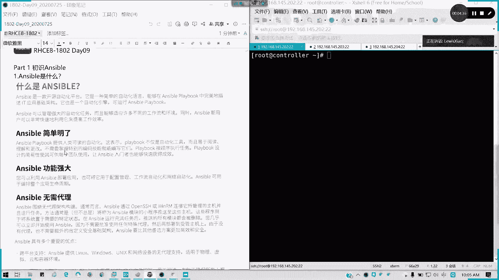
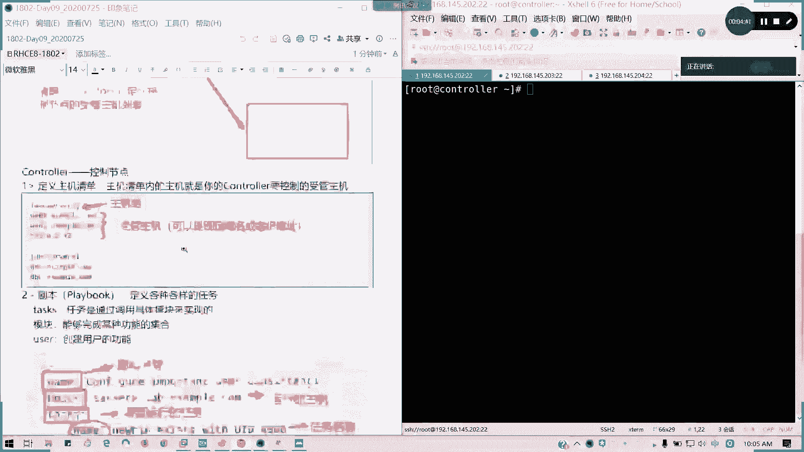
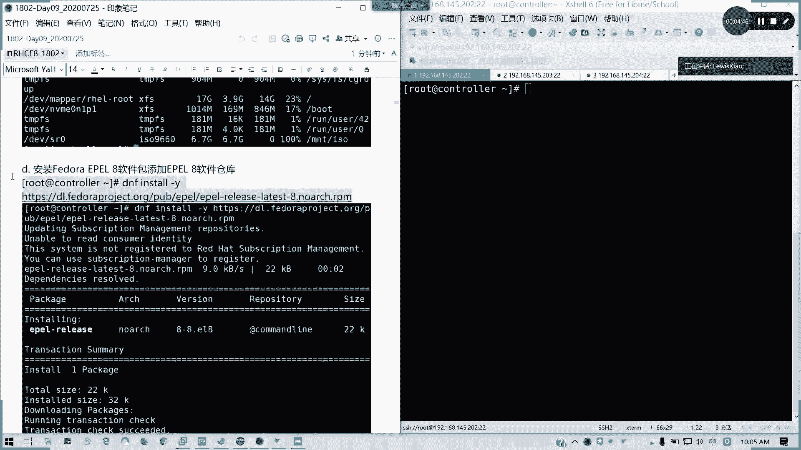
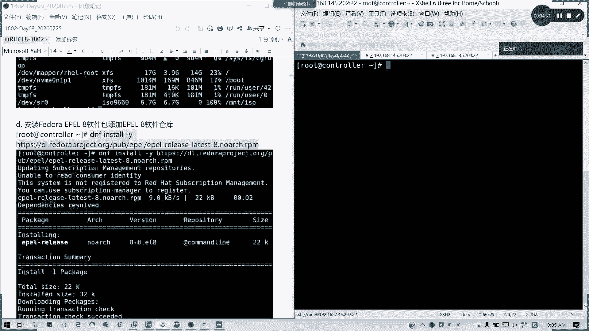
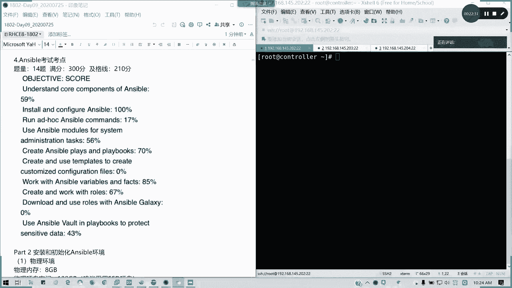
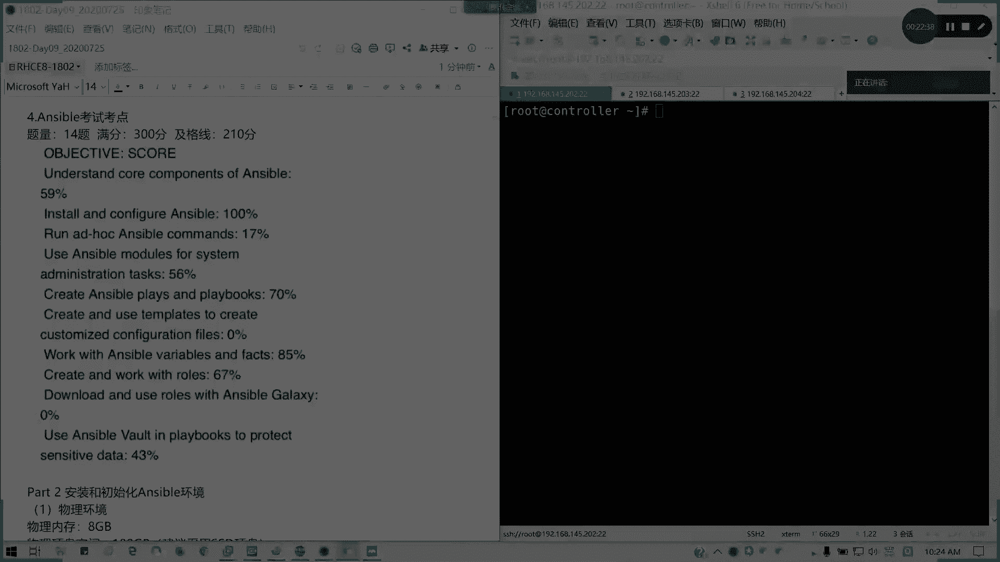
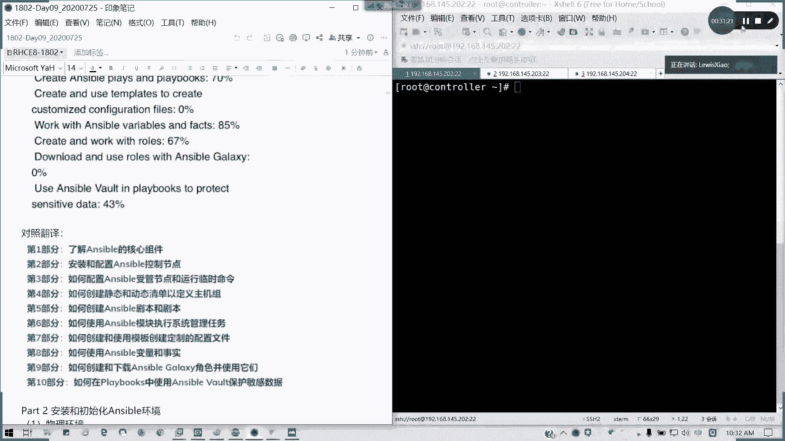

# Red Hat RHCE 8.0 认证体系课程：P51：初识 Ansible 🚀


在本节课中，我们将要学习 Ansible 自动化运维平台的基础知识。我们将了解 Ansible 是什么、它的核心架构、基本组件以及 RHCE 8.0 考试中关于 Ansible 的考点范围。

---

## 课程概述

Ansible 是红帽认证工程师（RHCE）8.0 版本的核心考试内容。它取代了之前版本中的服务配置考核，专注于自动化运维。Ansible 是一个开源自动化平台，使用简单的 YAML 语言编写剧本（Playbook），能够高效地管理 IT 基础架构。







## Ansible 简介与特点



Ansible 最初是红帽认证架构师（RHCA）中 DO407 课程的一部分。为了适应云计算和自动化趋势，红帽将其大部分内容下放至 EX294（RHCE 8.0）考试中。因此，掌握 Ansible 对于通过 RHCE 8.0 至关重要。

Ansible 具有以下几个核心特点：
*   **简单明了**：提供人类可读的自动化脚本（Playbook），易于理解、修改，无需复杂的编程技能。
*   **功能强大**：可用于配置管理、应用部署、服务编排等整个 IT 生命周期。
*   **无需代理**：无需在受管主机上安装任何代理程序，通过 SSH 和密钥认证进行管理，更加安全高效。

## Ansible 核心架构

理解 Ansible 的架构是掌握其使用的关键。其架构类似于一个指挥部指挥作战。

上一节我们介绍了 Ansible 的基本概念，本节中我们来看看它的核心工作模型。


架构包含以下核心组件：
1.  **控制节点（Control Node）**：即“指挥部”，是运行 Ansible 命令和剧本的主机。
2.  **受管主机（Managed Hosts）**：即“士兵”，是被控制节点管理的服务器列表，也称为资产清单（Inventory）。
3.  **连接方式**：控制节点通过 **OpenSSH** 与受管主机建立基于**公钥/私钥**的免密认证信任关系。
4.  **剧本与角色（Playbooks & Roles）**：即“作战指令”。剧本（Playbook）是定义了一系列任务（Tasks）的 YAML 文件。角色（Role）是组织更复杂、可重用自动化内容的方式，可以看作是多个剧本的集合。

工作流程简述：控制节点通过清单确定要管理的受管主机，通过 SSH 密钥建立信任，然后推送并执行编写好的剧本或角色中定义的任务，从而使受管主机达到预期的状态。

## Ansible 组件详解

### 控制节点（Control Node）

控制节点是 Ansible 自动化任务的发起者，主要负责以下工作：

以下是控制节点的三个主要职责：

1.  **定义主机清单（Inventory）**：清单文件列出了所有需要管理的受管主机，可以是 IP 地址或域名，并支持分组。例如：
    ```ini
    [webservers]
    web1.example.com
    web2.example.com

    [dbservers]
    db1.example.com
    ```
    注意：在清单中定义为主机名，调用时也应使用主机名，IP地址和域名在Ansible看来是不同的对象。

2.  **编写剧本与角色（Playbooks & Roles）**：在控制节点上创建 YAML 格式的剧本文件，定义需要执行的任务序列。一个简单的剧本结构如下：
    ```yaml
    ---
    # 这是一个创建用户的剧本示例
    - name: Create a new user
      hosts: webservers  # 指定在哪些主机上运行
      tasks:
        - name: Add user 'johndoe'
          user:
            name: johndoe
            uid: 1040
            state: present
    ```
    其中包含剧本名称、目标主机组和具体的任务模块（如 `user`）及其参数。

3.  **建立连接**：配置与受管主机之间的 SSH 免密登录（公钥认证），这是 Ansible 管理的基础。

### 受管主机（Managed Hosts）





受管主机是接受并执行控制节点下发任务的服务器。除了需要安装 Python 环境（通常 RHEL 8 已自带）和配置好 SSH 密钥认证外，无需安装任何特定代理（Agent）。

## RHCE 8.0 (EX294) 考试考点分析

根据近期考试反馈，EX294 考试满分 300 分，及格线为 210 分，考试时长 4 小时。主要考察以下十个方面的能力：

以下是 EX294 考试涵盖的核心技能领域：

1.  **理解 Ansible 核心组件**：了解控制节点、受管主机、模块、清单等概念。
2.  **安装和配置 Ansible 控制节点**：包括安装 `ansible` 软件包和进行基础配置。
3.  **配置受管主机并运行临时命令（Ad-hoc Commands）**：使用 `ansible` 命令行工具执行一次性任务，例如配置软件仓库。
4.  **使用 Ansible 模块执行系统管理任务**：使用模块完成如创建文件、生成系统报告、管理磁盘等操作。
5.  **创建 Ansible 剧本和任务**：编写完整的 Playbook 来实现复杂的自动化流程。
6.  **使用模板创建自定义配置文件**：利用 Jinja2 模板动态生成配置文件（重要考点）。
7.  **使用 Ansible 变量和事实（Facts）**：在剧本中定义和使用变量，并利用从受管主机收集的事实信息。
8.  **创建和使用角色（Roles）**：将剧本、变量、模板等组织成角色，实现代码复用和逻辑分离。
9.  **从 Ansible Galaxy 下载并使用角色**：使用 `ansible-galaxy` 命令获取社区共享的角色。
10. **使用 Ansible Vault 保护敏感数据**：对剧本中的密码等敏感信息进行加密。

考生需要对之前 RHCSA（RH124+RH134）的内容（如磁盘分区）保持熟练，因为部分任务会在 Ansible 环境中再次考察。

---

## 课程总结



本节课我们一起学习了 Ansible 自动化运维的基础知识。我们明确了 Ansible 在 RHCE 8.0 认证中的核心地位，理解了其无需代理、简单易用的特点。通过“指挥部-士兵”的比喻，我们掌握了 Ansible 由**控制节点**、**受管主机**、**清单**和**剧本/角色**构成的核心架构。最后，我们详细分析了 EX294 考试的十大考点，为后续的深入学习指明了方向。接下来，我们将开始实践，安装和配置我们的 Ansible 控制节点。