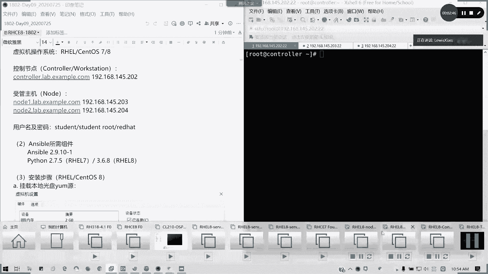
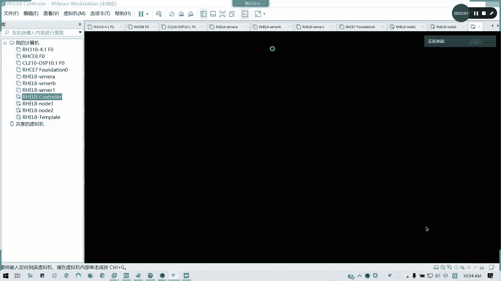
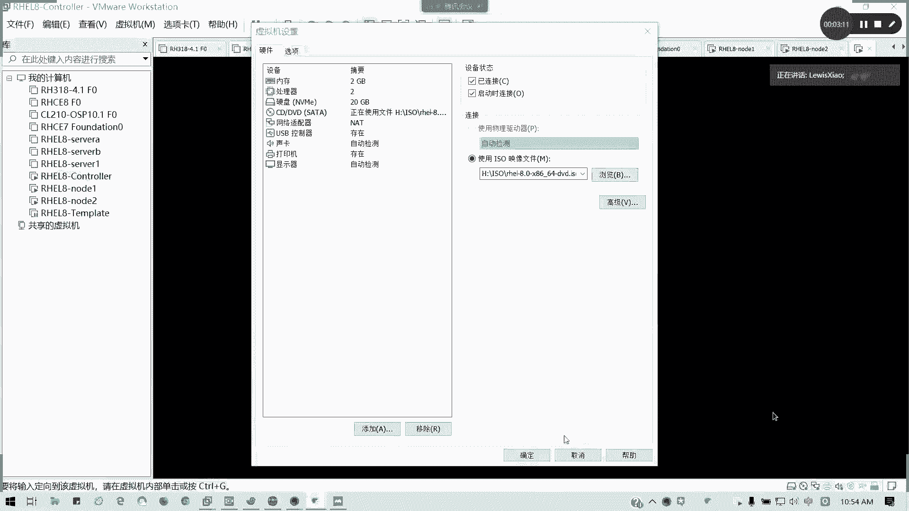
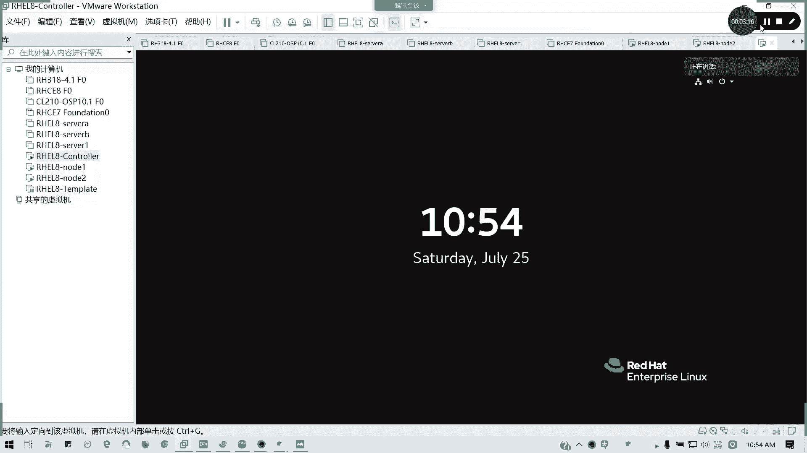
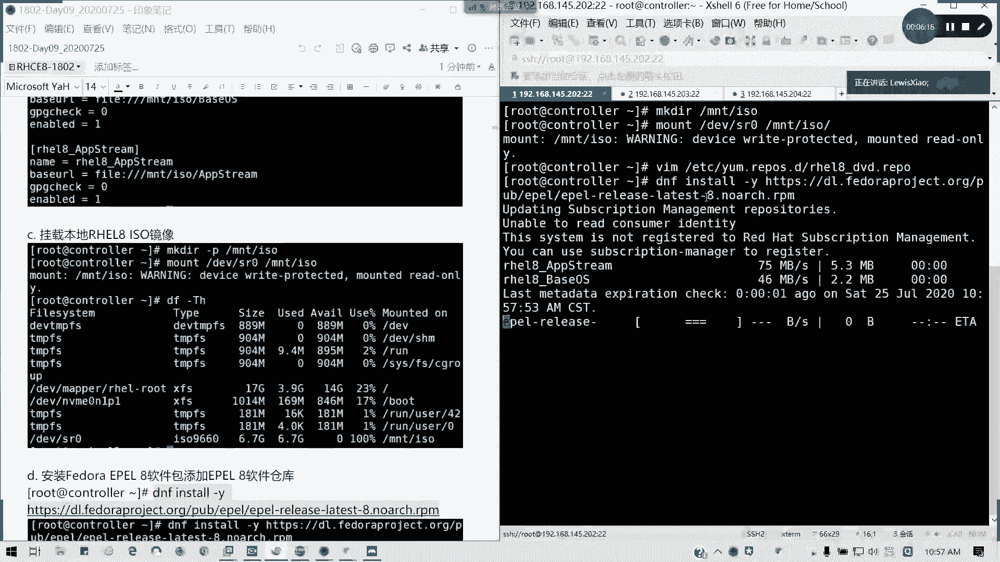
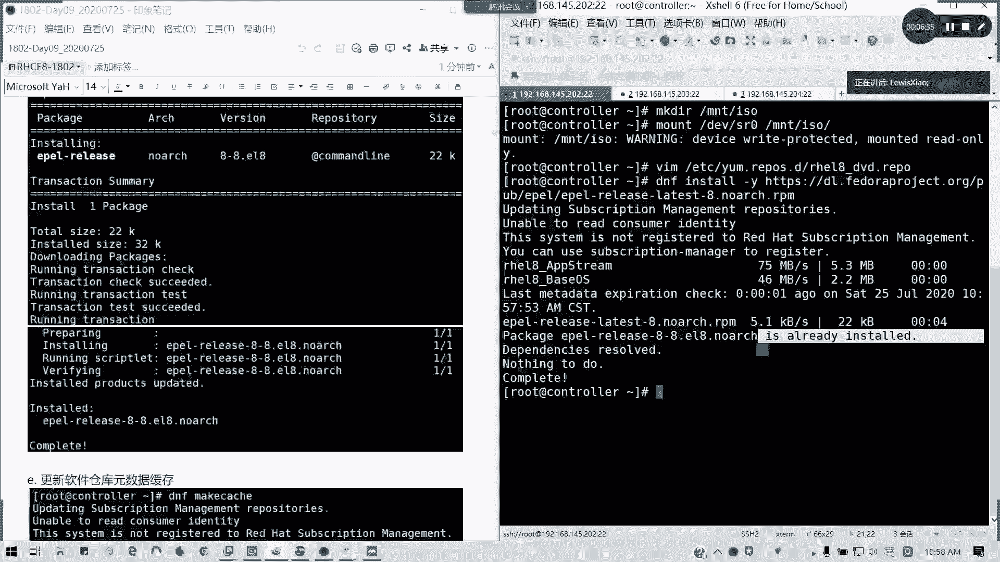
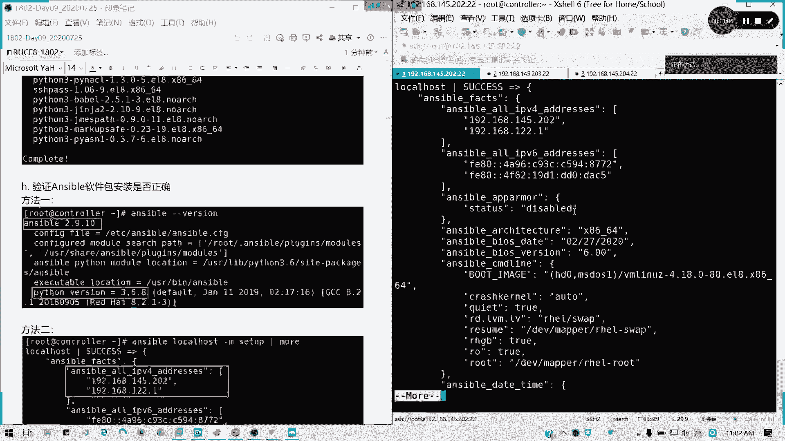

# 拿下证书！Redhat红帽 RHCE8.0认证体系课程 RH124+RH134+RH294三门认证视频教程 - P52：52_Video_Day09_Ch01b_安装Ansible - 16688888 - BV1734y117vT

接下来啊。我们来讲anible的安装跟初始化。首先讲安装啊，安装的话，很多人问我说要不要全部都装啊，我说说不需要一台就够了。另外两台我做我控制主去，我要干嘛要去装他，对不对？不然的话我就是吧？

我自当将军当士兵啊，是不可能的吧。那我们交易装，我就把什么事令部搭起来就够了吧，对不对？好，我们物理环境呢。主要是内存内存的话，如果你们用练习环境的话，要8G要16G内存。但是如果我们用裸机三台的话。

8G足够硬盘100G啊，100G至少然后建议采用我们的固态硬盘来来来跑证环境。虚拟机数量至少三台，我们这个需求，刚才也写给大家了。系统的话，我们可以在7或者八跑。但是我们这里统一为8。0啊，8。0。

主要区别的版本呢区别的地方是在python啊，主要区别的地方是在python的版本。像7的话它是用2。7。5用8的话是现在最新是3。6。8。就我上上上周吧，上上上周我们用我在那个讲其他学校的时候。

我发现用的是3。6。8。我们这里呢有三个啊三台主机，大家已经提前。就装好一台客隆两台之后呢，我们提前把我们的主机名啊，主机名，还有我们的IP地址已经设好IP地址，根据你们自己来定啊。

这是我自己这边的IP地址。然后呢，考试呢就是可能它是变成一个wa stationation，然后serv a到servD啊，考试会有5台虚拟机。我们这里的话，我们做那个课程讲解的话，我们三台就足够。

它的一个所需组件啊所需组件，一个sensible2。9。10-1，这是最目前最新的一个版本。还有呢。它的python啊python会因为我们用我们学过样，学过DNF对不对？所说DNF的话。

它可以解决我们的这个依赖关系的。但是告诉大家，sible并不在那个我们的标准包里面，也不就不在我们的那个F string跟BSOS里面。但pyython在啊。

所以的话我们需要啊这里我们需要挂在本地的安装安装的一个光盘来帮我们实现这帮我们辅助进安装，不然的话会安装会失败的。好，我们看看。先在看一下我们的。

controller啊，我们只挂controller不需要挂 node的啊。看着我们cttrol了光盘挂了没有？

我这里已经挂载了8。0的一个镜像，你们用8。18。2都没有所谓啊，我只需要它的一个样源。

然后呢，这挂完之后，我们这里我看一下啊。我新建1个MNTISO的一个目录，对吧？然后呢。Moote。DVSR0。🎼没问题。ISO我们做一个临时挂载，然后我们把亚么原我们配上，好吧。本把样么原配上。

相信大家很多人都做了啊。记得我们样么园是配一个杯aseOS跟FG吗？记得我们配样源的时候，不要用在那个方括号，我们的一个配置鞋里面不要存在空格。上次已经有说过这样的情况。如果现在不会的啊，初学者啊。

我们零基础人可以跟着我一起操作。这里应该大家练过几遍应该很熟了啊。然后我们复这里，我们直接回到我们的命令行模式，然后5YY。复制下来。P对吧？P，然后我们这里空一行，这底我们都全部改成F dream。

刚才就是那个S没大，那个目录S没大写，所以都是10元不到的。好的，保存退出。然后呢，我们通过啊。我们现在我们先安装我们fedora啊，因为它的这个东西的s它是自己带了一个stra的一个包啊。

然后我们这个sible呢是现在fedora这个计划呢，它有提供的啊，这然后我们就直接下载这个包。如果刚才下载不了的，我我已经贴着包在我们群里面，直接直接传到里面去安装就可以了。

我们用DNFintstore杠Y。下载这个直接安装这个包EPL啊。latetates8啊，我们直接装这个包。

在联网的情况下，我们直接装这个包。我这里已经安装过了啊已经安装过了，所以的话它里面是包包是将相当于我们的一个扩展包，懂吧？我们。我们fedo也是其实fedo是linkux个个人版。

它的一个扩展包就在这里了。然后做完扩展包之后，我们更新一下原数据缓存。因为它它也是其实写一个样在里面，一个文件在里面。

看到一个叫astra package，没有EPL啊，懂吗？DPO的意思就是extra package for enterpriseterprilinux，懂吧？企业把linux的额外安装包。

所以为什么说它不在那个它不在那个里面啊，然后更新完之后呢。我们来看一下我们的Anerable跟python在不在。有吧asible，然后它的一个关联的一个，它的py它的一个python也都在。

对吧拍仔也都在，那我好了，直接安装。考试它会有一个本地的样本源，考试它会有一个本地的样本源，让你安装Sl的，所以它就不用去网上去下载了。这个是我们裸机搭建的一个步骤，懂吗？所以我上次给大家说。

我不用那个环境，那环境的话，它已经ensil已经帮你搭好了。呃，深圳浦你没有，我帮你静一下音啊。然后呢，我们直接安装S什就可以了。记得在我们挂在本地样面情况下才能安装。

因为它的依赖的拍on的一个组件在我们本地光盘里面。如果不挂这一步的话，你就会发现他很多是conft了。就你的拍子你的很多都没人装。所以先我们稍等一下。呢会通过网络去下载。我看一下我们s的版本哈。

开先装asible还是2。9。10-1。我们书上的教材是2。82。8，我们现在用2。9。1-1类似。本地可以这么部署啊。好了，安装完成。拿装完成之后呢，这步骤我就贴图贴到这里了。然后呢。

我们要验证我们的anerible是不是安装成功。anible杠杠fion，你们可以看它的一个配置文件，还有我们的python版本是否能够正确的显示。它这里显示的是一个默认的一个配置文件。

在这里待会我们会讲到配置文件部分的话，我会跟大家再详细描述。然后它的一些配已配置的模块的搜索搜寻的路径。然后还有anible的一个python模块的一个location。

因为它是ensible是基于python语言去写的。还有还有我们的一个。可执行的一个location在哪里？它S命令放在user并下面啊，USR并下面拍摄版本也有了。然后还有另外一个方法。

就是我们通过运行本地的临时命令aner一个调用模块。看一下我们这边显示相关的一些信息。Anwerible local host杠M set up。然后用墨看一下。好。

我们可以看到我们显示我们已经显示有我们的那个IPV4地址，IPV6地址这些等等。这些返回来就是事实，也就是我们机器本身的一些固有的我们配置好的一些信息，约定俗成的一些。啊，愿意组成我们返回的一些结果。

所以说最快我们anerible的安装就讲这么多啊，anerible安装讲这么多，接下来给大家时间给将自己控制装enserible装完，然后呢，稍后我们讲清单，好吧，给大家10分钟时间。

15分我们讲清单。