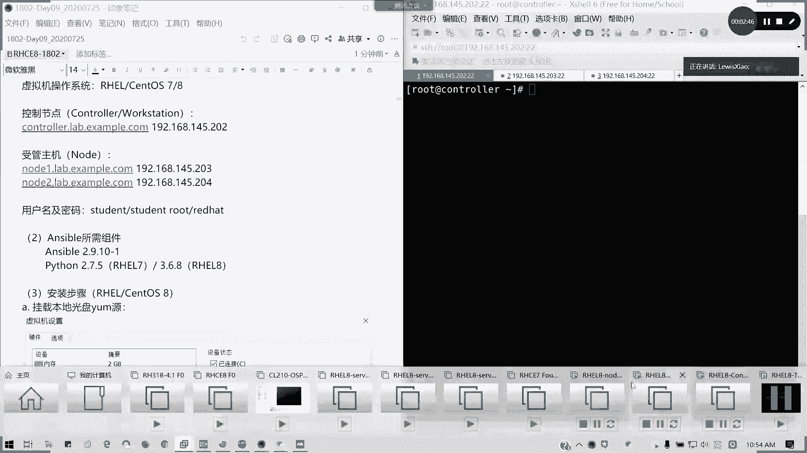
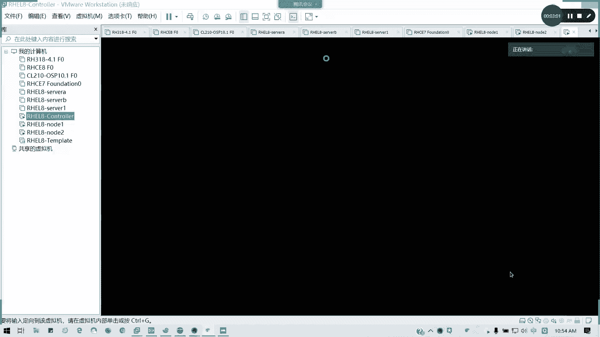
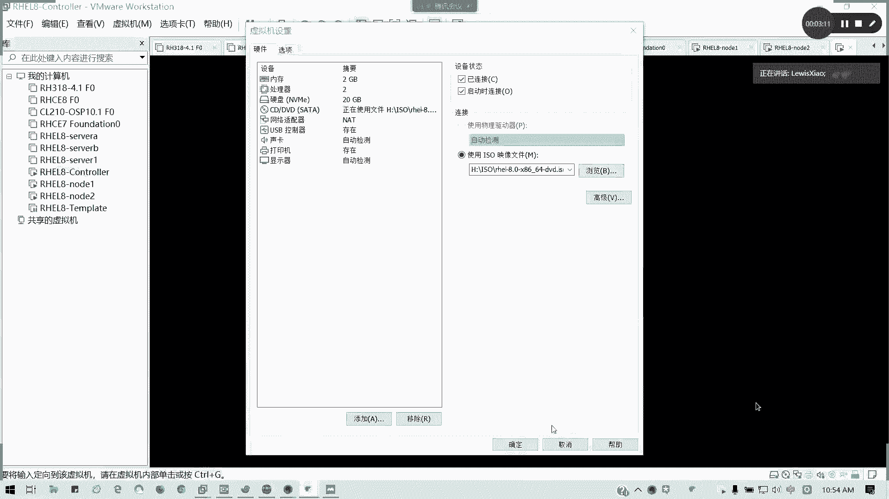
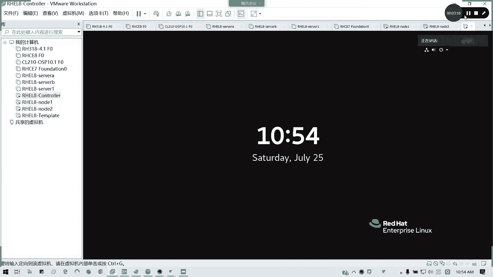
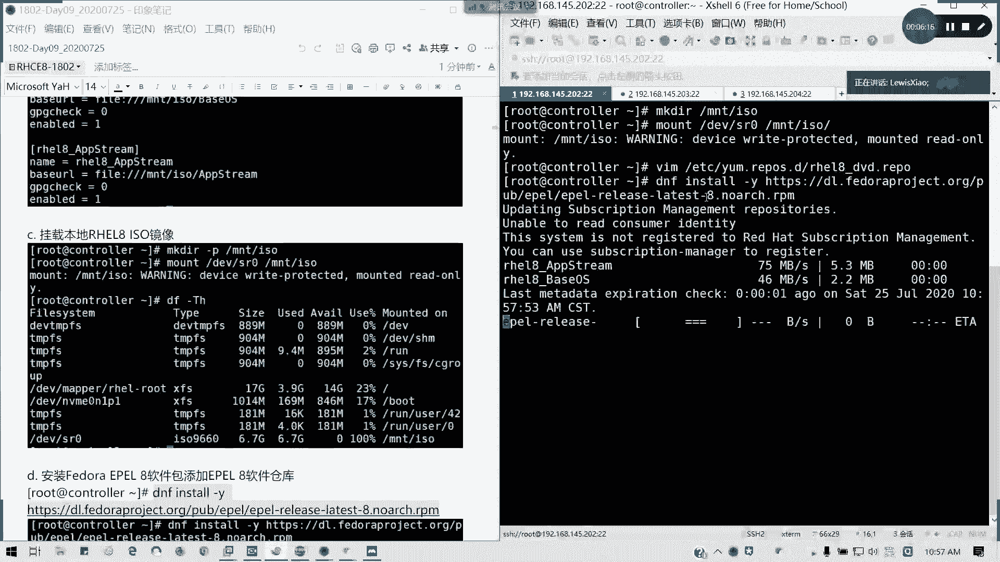
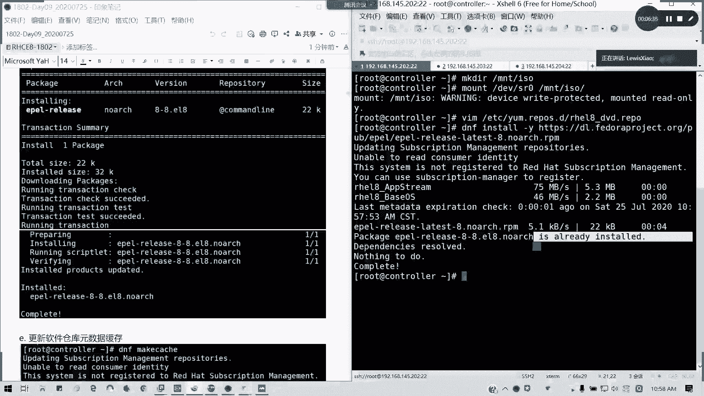
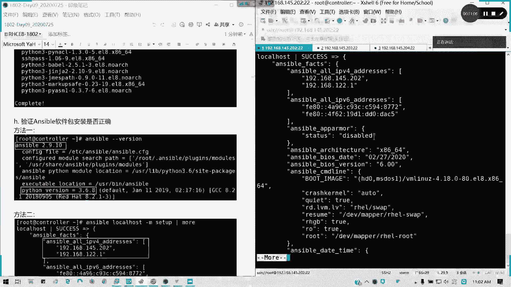
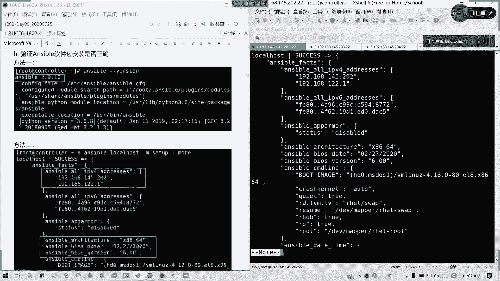

# Redhat红帽 RHCE8.0认证体系课程：P52：安装与初始化Ansible 🚀


在本节课中，我们将学习如何在控制节点上安装和初始化Ansible自动化工具。这是构建Ansible自动化环境的第一步。

## 概述 📋

Ansible的安装只需要在作为控制节点的主机上进行，被管理的节点（即目标主机）无需安装Ansible代理。本节将指导你完成控制节点的环境准备、软件包安装以及安装后的基本验证。



## 环境要求与准备







上一节我们介绍了Ansible的基本概念，本节中我们来看看安装前的准备工作。为了顺利安装和运行Ansible，需要满足以下硬件和系统要求。

以下是环境配置的具体要求：
*   **控制节点**：仅需一台主机安装Ansible。
*   **被管理节点**：无需安装Ansible。
*   **物理环境**：
    *   **内存**：练习环境建议8G-16G内存。
    *   **硬盘**：至少100G，建议使用固态硬盘。
*   **虚拟机**：至少需要三台。
*   **操作系统**：统一使用RHEL 8.0。主要区别在于Python版本（RHEL 8使用Python 3.6.8，而RHEL 7使用Python 2.7.5）。
*   **预配置**：三台主机的主机名和IP地址需要提前配置好。

## 安装Ansible



了解了环境要求后，接下来我们进行实际的安装操作。Ansible及其依赖的Python组件并不在标准Yum仓库中，因此需要配置本地安装源。



以下是安装Ansible的步骤：
1.  **挂载本地镜像**：在控制节点上挂载RHEL 8的ISO镜像文件，以提供安装依赖包所需的Yum源。
    ```bash
    mkdir /mnt/iso
    mount /dev/sr0 /mnt/iso
    ```
2.  **配置本地Yum源**：创建一个Yum仓库配置文件，指向挂载的镜像目录。注意配置文件中不要有空格。
    ```bash
    vim /etc/yum.repos.d/local.repo
    ```
    文件内容示例：
    ```ini
    [BaseOS]
    name=BaseOS
    baseurl=file:///mnt/iso/BaseOS
    enabled=1
    gpgcheck=0

    [AppStream]
    name=AppStream
    baseurl=file:///mnt/iso/AppStream
    enabled=1
    gpgcheck=0
    ```
3.  **安装EPEL仓库**：Ansible包由Fedora项目维护，存放在EPEL（Extra Packages for Enterprise Linux）仓库中。需要先安装并启用EPEL仓库。
    ```bash
    dnf install -y https://dl.fedoraproject.org/pub/epel/epel-release-latest-8.noarch.rpm
    ```
4.  **更新元数据缓存**：安装新仓库后，更新Yum缓存。
    ```bash
    dnf makecache
    ```
5.  **安装Ansible**：现在可以安装Ansible及其依赖。
    ```bash
    dnf install -y ansible
    ```

## 验证安装

安装完成后，我们需要验证Ansible是否安装成功，并确认其运行环境正常。

以下是两种验证方法：
*   **方法一：查看Ansible配置信息**
    运行 `ansible --version` 命令，可以查看Ansible的版本、配置文件路径、Python模块位置等详细信息。
    ```bash
    ansible --version
    ```
*   **方法二：运行临时命令**
    使用Ansible对本地主机执行一个临时命令，调用 `setup` 模块收集主机信息（即“事实”）。如果成功返回主机的详细信息（如IP地址），则证明安装成功。
    ```bash
    ansible localhost -m setup
    ```

## 总结 🎯





本节课中我们一起学习了Ansible的安装与初始化。我们明确了只需在控制节点安装Ansible，准备了满足要求的实验环境，通过配置本地Yum源和EPEL仓库成功安装了Ansible软件包，并最终通过两种方式验证了安装结果。安装完成后，控制节点就具备了管理其他节点的能力。接下来，我们将学习如何定义和管理被控制的主机清单。