# Redhat红帽 RHCE8.0认证体系课程：P53：管理资产清单


## 概述
在本节课中，我们将学习如何为Ansible配置和管理资产清单。资产清单文件定义了Ansible控制节点可以管理的所有受控主机。我们将学习如何定义主机、创建分组、建立SSH免密认证，并进行连通性测试。这些是使用Ansible进行自动化管理的基础。

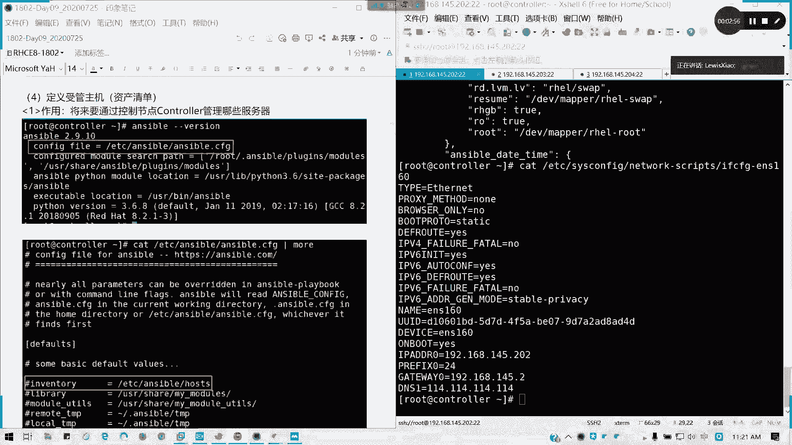

## 资产清单配置文件
Ansible默认的资产清单配置文件是 `/etc/ansible/hosts`。我们可以通过编辑这个文件来定义我们想要管理的服务器。

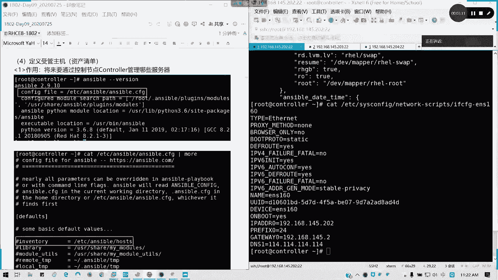

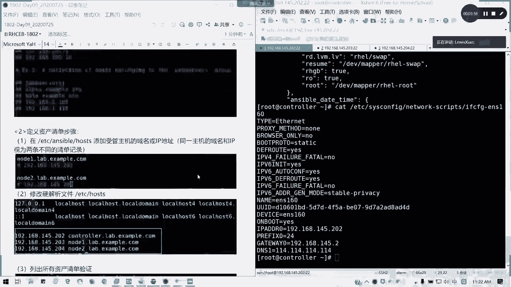

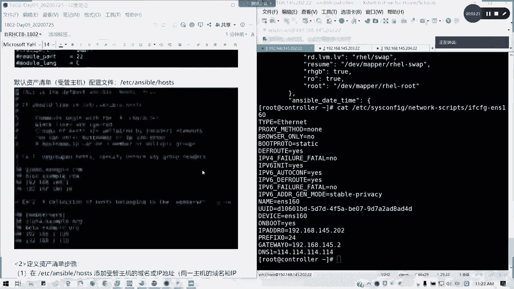

该文件本身包含了一些示例，清晰地展示了不同的定义方式。理解这些示例有助于我们编写自己的清单。

## 定义单个主机
首先，我们来看如何定义没有分组的单个主机。在配置文件中，可以直接列出主机名或IP地址。

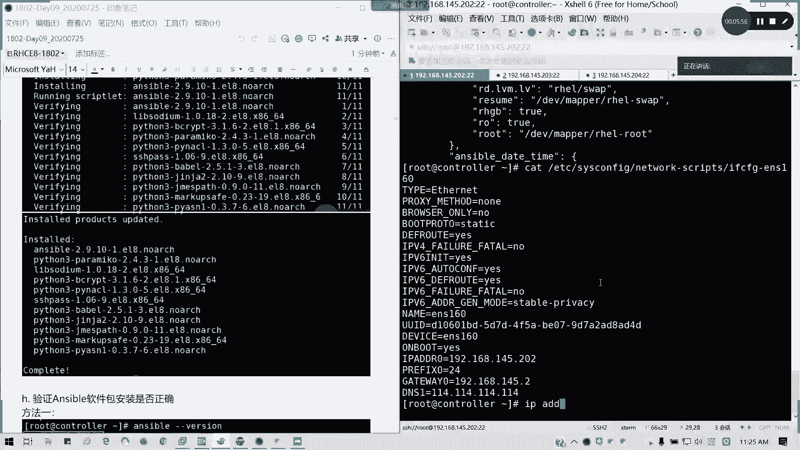

以下是定义主机的两种方式：
*   **使用域名**：`node1.lab.example.com`
*   **使用IP地址**：`192.168.145.203`

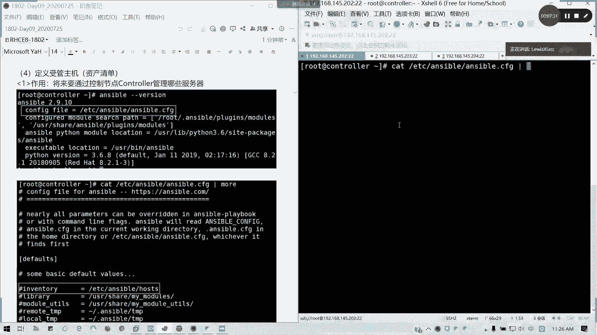

**注意**：定义的方式决定了引用的方式。如果使用域名定义，则必须通过域名引用；如果使用IP地址定义，则必须通过IP地址引用。两者不能混用。

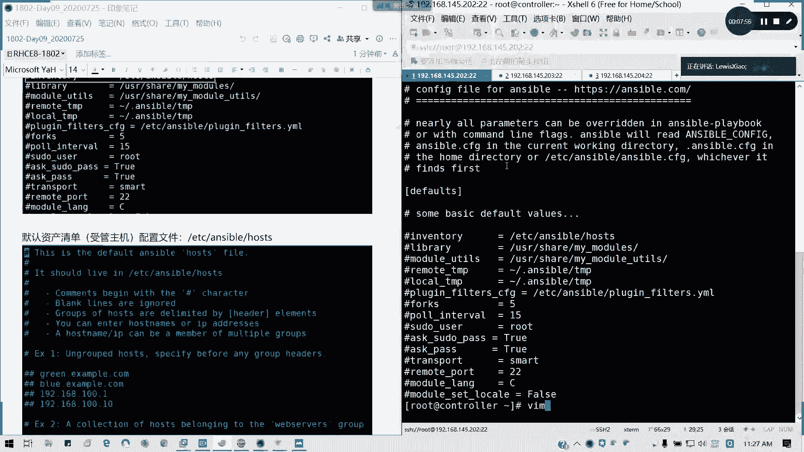

为了让控制节点能够解析我们定义的域名，需要在 `/etc/hosts` 文件中添加主机名与IP地址的映射关系。例如：
```
192.168.145.203 node1.lab.example.com
192.168.145.204 node2.lab.example.com
```

添加完成后，可以使用 `ping` 命令测试域名解析是否正常。

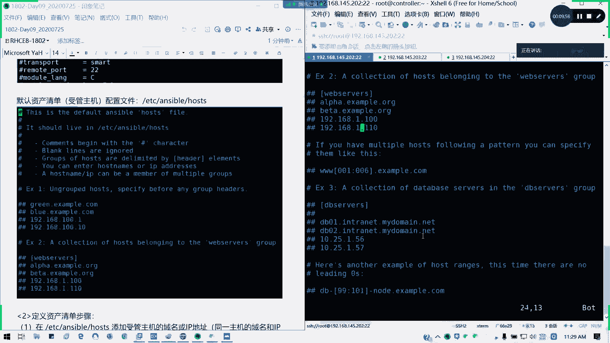

## 建立SSH免密认证
上一节我们介绍了如何定义主机，本节中我们来看看如何与控制节点建立信任关系。Ansible通过SSH协议与受控主机通信，为了无需手动输入密码，需要配置SSH免密登录。

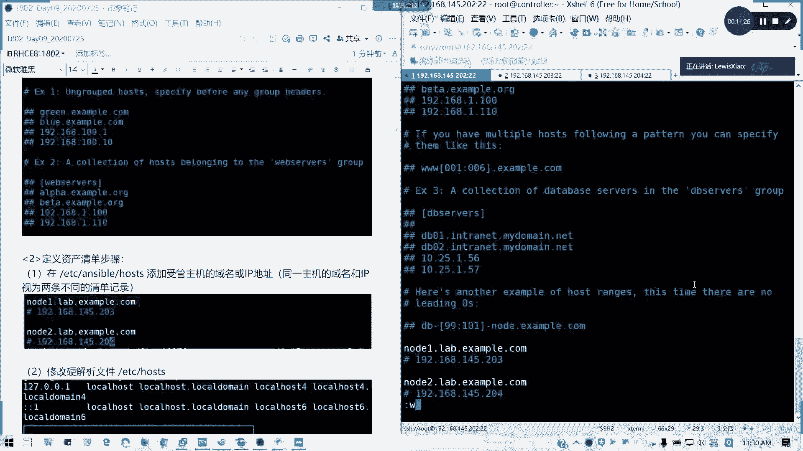

这个过程需要在**控制节点**上为每个用于执行Ansible任务的用户进行操作。主要步骤如下：
1.  生成SSH密钥对：`ssh-keygen`
2.  将公钥复制到目标受控主机：`ssh-copy-id user@hostname`

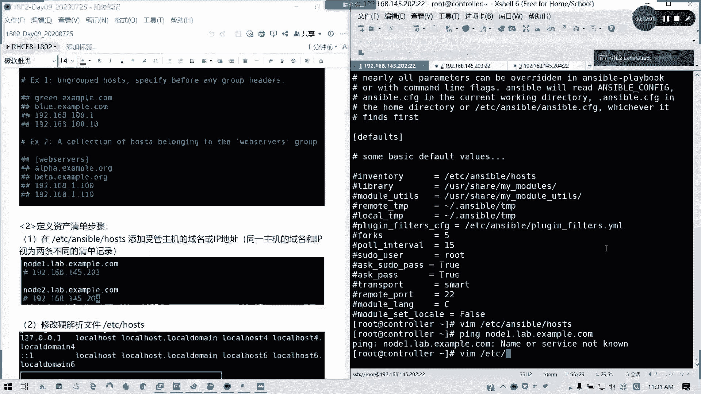

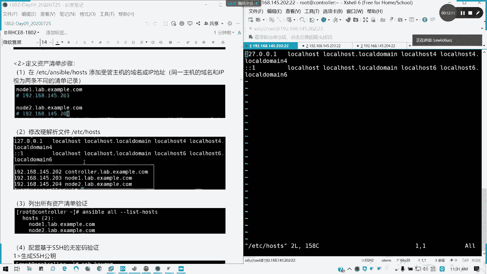

例如，为 `root` 用户配置到 `node1` 的免密登录：
```bash
ssh-copy-id root@node1.lab.example.com
```
系统会提示输入 `node1` 上 `root` 用户的密码。成功后，即可实现免密登录。

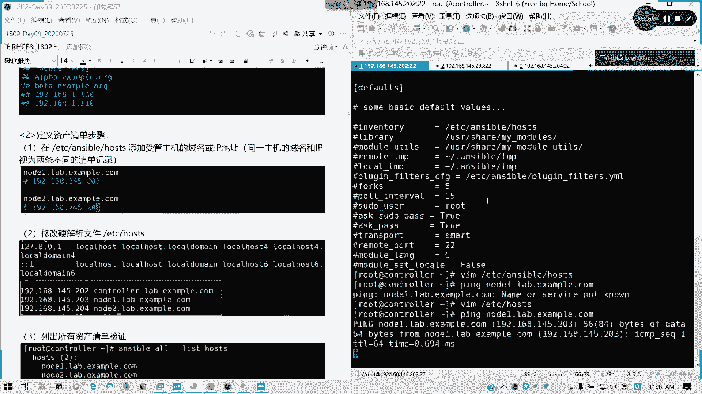

**重要提示**：在RHCE考试环境中，通常已为指定用户预先配置好免密认证，考生无需执行此步骤。但在自己的实验环境中，必须完成此配置。

## 测试Ansible连通性
建立免密认证后，就可以使用Ansible临时命令测试与受控主机的连通性。

使用 `ping` 模块测试主机 `node1.lab.example.com`：
```bash
ansible node1.lab.example.com -m ping
```
如果返回结果为绿色且包含 `"ping": "pong"`，则表示连接成功。

如果尝试连接一个未在资产清单中定义的主机（例如直接使用IP地址 `192.168.145.203`），Ansible将无法找到该主机，命令会执行失败。

可以使用以下命令列出当前资产清单中所有已定义的主机：
```bash
ansible all --list-hosts
```

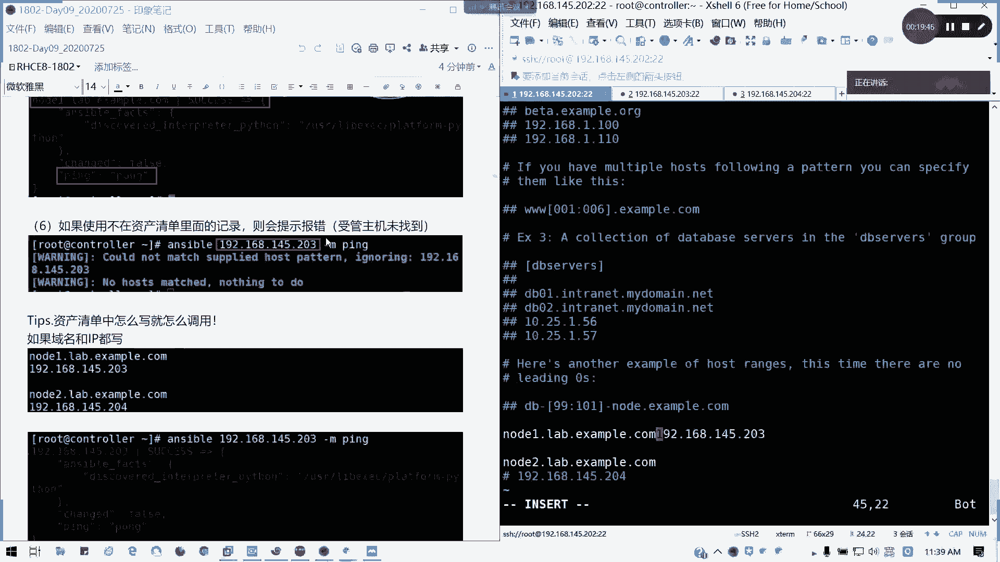

## 定义主机分组
除了定义单个主机，Ansible更强大的功能在于可以对主机进行分组管理。我们可以根据服务器的角色（如Web服务器、数据库服务器）将其归入不同的组。

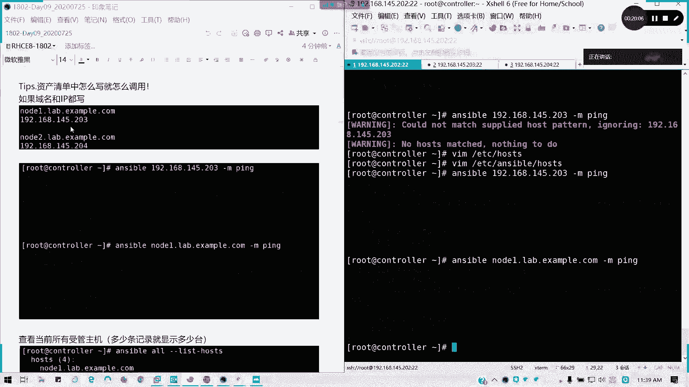

在 `/etc/ansible/hosts` 文件中，使用方括号 `[ ]` 来定义一个组。例如：
```
[webservers]
node1.lab.example.com

[dbservers]
node2.lab.example.com
```
定义分组后，可以直接使用组名来管理组内的所有主机。例如，测试 `webservers` 组内所有主机的连通性：
```bash
ansible webservers -m ping
```

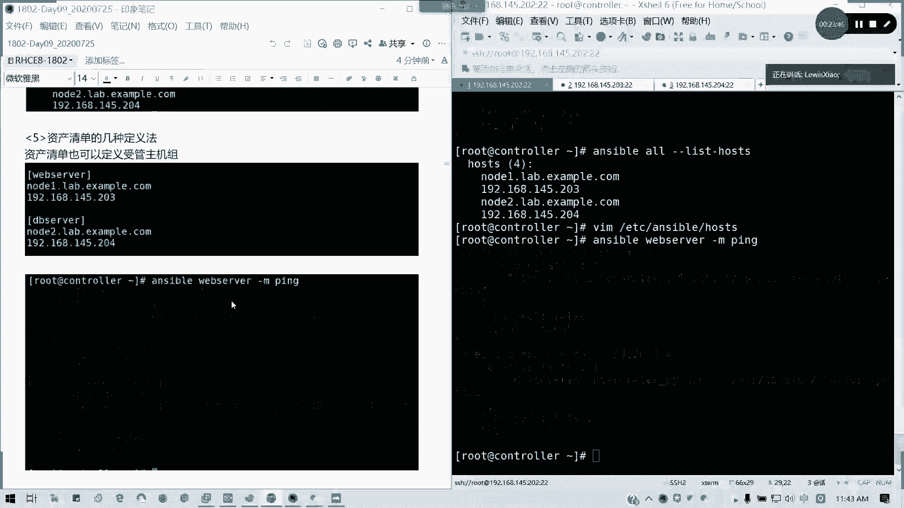

## 使用模式简化定义
当需要定义一系列具有规律主机名或IP地址的主机时，可以使用模式来简化书写。

例如，定义 `node1` 到 `node2` 的主机：
```
[webservers]
node[1:2].lab.example.com
```
或者，定义 `192.168.145.203` 到 `192.168.145.204` 的IP地址：
```
[dbservers]
192.168.145.[203:204]
```
这种方式可以极大地减少配置文件中的重复内容。

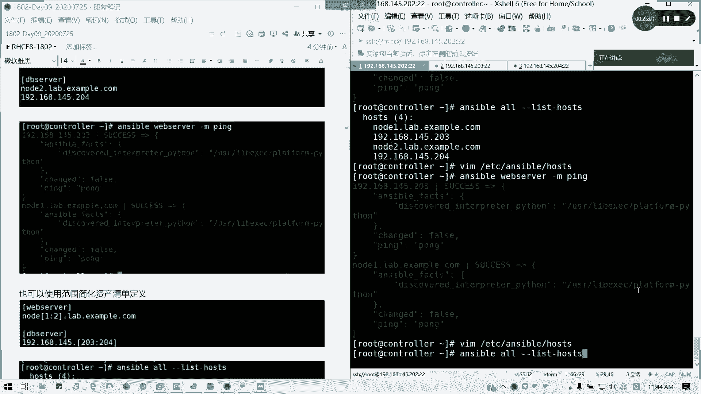

## 定义嵌套分组（组之组）
对于更复杂的架构，我们可以创建嵌套分组，即将多个小组包含在一个大组中。这通过 `:children` 后缀来实现。

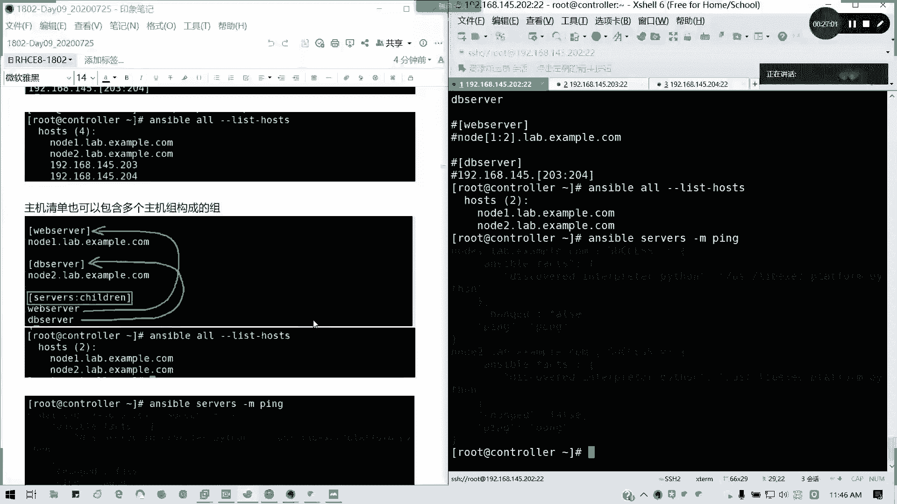

例如，定义一个名为 `services` 的大组，它包含 `webservers` 和 `dbservers` 两个小组：
```
[services:children]
webservers
dbservers
```
定义后，使用 `ansible services -m ping` 命令可以同时测试 `webservers` 和 `dbservers` 组下的所有主机。

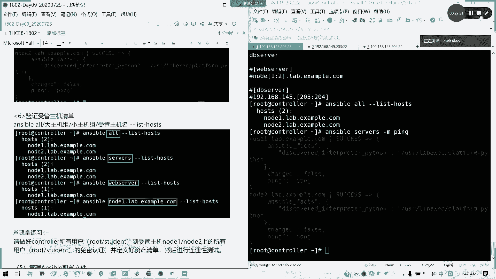

## 总结
本节课中我们一起学习了Ansible资产清单的核心管理知识。我们掌握了如何通过编辑 `/etc/ansible/hosts` 文件来定义单个主机和主机分组，包括使用模式简化定义和创建嵌套分组。同时，我们理解了在实验环境中建立SSH免密认证的必要性，并学会了使用 `ansible` 命令测试与受控主机的连通性。正确配置资产清单是使用Ansible实现自动化运维的第一步。