# 拿下证书！Redhat红帽 RHCE8.0认证体系课程 RH124+RH134+RH294三门认证视频教程 - P54：54_Video_Day09_Ch01d_管理Ansible配置文件 - 16688888 - BV1734y117vT

好的，各位各位司计师们，各位同学们啊，大家下午好。呃，北京时间2点15分，我们上午呢是讲了关于anible的一个概念基础架构以及如何安装以及及初始化配置，其中初始化配置。

我们只讲的第一部分就是我们的资产清单定义啊。相信中午啊大家已经把资产清单包括免密认证这一块，我们已经做我的练习啊，做了练习。那我们下午的话我们继续下一个环节，我们我们配置还差一个关键什么呢？叫配置文件。

所以我们来看叫讲义第二部分的第五点管理ens配置文件。S配置文件默认有一个啊在我们an杠杆version里面里面是有默认有一个啊。

默认的配置文件是ETCanswer目录下面的answerable点CFG啊。但其实呢。我们是有可以通过修改S波配置文件来制定S博的安装的一个行为啊，我们是可以这么做的。

S波控制节点上多个可能的位置之一呢，从多个可能位置之一呢，会选择它配置文件。也就是说说也就是说说说，根据不同位置，我们可以分为不同的一个优先级。优先级呢有3个啊，我这里有标数字，数字越大。

代表优先级越低。首先来看优先级最低的ETC目录下面的an点CFG，它这是一个基本的配置文件。如果找不到其他位置，我们就用它了，对不对？因为它是一个默认位置配置，可以懂吗？就是就说我们没有定义的话。

是这个，然后还有接下来。它是对全局生效的，全生效范围是全局。接下来。是对工作目录啊，对用户啊用户生效的一个。在用户的加入里面。点ansible点CFG这是一个隐藏文件哈。

enssible在用户的主目录里面查找点ensswible点CFG文件。如果配置并存在此配置，而且当前公众目录里面也没有其他的anserible点CF区文件呢。

就用这个配置对我们的默认文件或默认配置进行取代，懂我意思吗？它的生效范围。是你当前的用户啊当前用户这是杠点，杠就那个我们的加木面的点S for点C就得前面有加个点的。然后还有一个就是我们的。工作目录啊。

就我们的。工作目录也就是在目录下面点，就是说当前工作目录就点an就点有anw cF区啊，应该是当前工作目录下面的anw cFG。

如果执行anible目录是命令的目录下面存在anible点CF区则使用它而不使用全局文件以及用户的个人文件。那这样的话，其实有个好处，就是说我不同环境，我可以。放不同的一个环境或项目。

也就是我们的资产清单是吧？那后配置文件我们可以根据不同的项目来进行定义。所以的话在我们考试里面是会考第三种啊。好第三种，也就是我单独在一个目录上面。我使用我的配置，懂我意思吗？看明白吗？

优先级最高范围最小的优先级最高啊，能明白我意思就可以了。那我们来看一看啊。

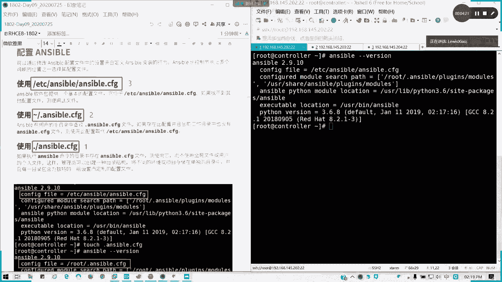

我们当前生效的配置文件是这个，对吧？那我们。新建一个，我们先不写任何配置，我们看一下优先级是不是真真的是这样，我们新建一个点ansible点CFG。然后我们看一看ansible杠亏。

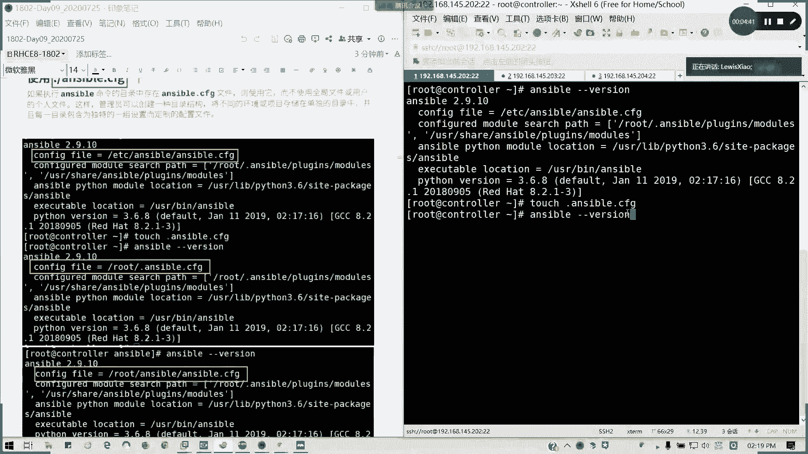

它的生效的那个配置文件是不是变成这个了？它的范围它的生效范围就是当前的。用户的将当前用户的一个。个人文件里面对吧？就是当前用户生效，而不是全局。那如果。我在。我在root用户下，我新建一个安色博目录。

我当前我在这里切还是。当前用户对不对？然后好，我在这里我建一个SC区，这里这里没有点的。是不是已经变了，对吧？最小的。最小工作目录啊这个工作目录它是最优先的，懂我意思吗？

那如果我们这两个文件我们都把它删删掉。那么们的优先级就是最低的那一个，懂我意思吗？优先级概述啊，这一块如果能懂的，请请扣啊字母一啊，就是我们的sible配置优先级，它是这么来的。

它的优先级以及生效范围字母一啊，不是数字一。我们考试呢会考最高的优先级，考最高优先级。好，优先级明白之后呢，我们来讲它的配置文件的结构。我们看一下示例文件先。我这里加个墨哈，因为它时间太长了。

我们只关注它的一个deford这个配置节。我们关注de配置有什么用呢？来。de four配置节定义了我们基本的一个anserable的一个配置文件里面的一些选项。

首先我们来看一下第一个inventory inventoryventory定义我们的资产清单，也就是我们受款主机的一个路径，这个是必要的啊。是必要的。第一个里vent有没有定义？然后下面还有一个叫做。

专位库啊，还有还有我们的model这些单元呢我们不需要去管啊。然后还有就是们remote time。local temp这是一个本地和远程执行。临时文件的一个存放路径。

在我们自己定义文件定义配置文件的时候，这两个选项是可以忽略的啊，采用默认选项就可以了。这两个可以不需要不需要管啊。还有这个ask pass ask照线pass等于te。

这里的话是连接我们的数管主机的时候，是不是需要输入密码？如果是的话，每次都要输入。那那我们通常自动化的话，我们是不需要这个东西的啊。所以的话我们默认是设为forse，在后面我们再讲。

接下来remoteremote下线port就是连接。我们受管阻机的一个远程端口。默认22。也就是我们SSH协议。如果你的主机发生了。设定的特殊的端口的话，请在这里注注明啊。

然后remote效些user这个选项呢是指明连接售管主机的一个登录用户，也就是我。在远程主机，我用哪一个用户来执行命令？等同于我们的SSH连过去，对不对？这能理解啊。配置文件我们来这样子，我们来做一个。

做一个实验前准备。我们这里。因为这里的话我在实验准备之前，为什么要做这个实验呢？为什么我要切换到普通用户，考试就是这样子，考试的那个。包括我们实际的一个应用环境，不可能用root去做所有东西，对不对？

我们ensible的话也是一个组件。那我通常我用个普通用户去执行也就够了。为了安全安全性考虑，你不能用root，那这样很麻烦的啊，root的话。我们讲过啊呃就是什么那个震荡啊。不正当的他都能干。

所以他话很危险。那我们按照考试也是一样，考试这里也要他说明啊，他要考试就过去的一次考试，它里面是有说明的，就是他已经配置了，他已经默认啊，在考试的时候已经默认指定了某个用户。

作为anible的一个啊执行用户以及他的工作目录，他已经有指定了。然后而且他有说他他某个他哪一个指定的用户跟我们的。宿管主席上面的哪一个用户已经做了一个。互信关系，也就是我们的SHH的免密认证已经做了。

所以的话在真实考试的时候，千万要看清楚他的考试说明，不要急着做题。这是。有有人就只考了，本来他做的很好的，结果为什么发下成绩只有11分，而且他就是只有ensible说的配安装配置sible满分。

然后前面拿了一丢丢之外，其他全部为0。为什么？没看清楚题目。他要求你用特定的用户去做，你用root去做，那就根本就没分的。而且你的文件也放的不对的位置。懂吧？所以的话我就根据啊以之前可能没考试。

可能没有太大去在意这个事情。但是现在开始我们要注意他的一个题目要求。比如说我们这里用st用户啊，我们s用户刚才做一个免。做了一个免密的对吧？

作为免密互信认证了那我们就用stuud用户来作为anible的一个工作的一个用户，以及他所在的加目都作为他的总目，就它下面的一个enser文件夹。那我们就按照这个设定的情境，我来开始我们的实验前准备。

首先。我们切换到st用户，大家可以跟我一起做啊。入手就完全不要管了。然后最后呢，stud等用户呢。我先。建立一个叫做an的文件夹。切换里面，我们首先先有我们资产清单。这种清单我们就叫做service。

好吧。两台服务器吧。两台触管主机嘛，对不对？分别是node一点l点影帐点com和node2点lb点一帐点com。有人说不要写太长也可以啊，你自己定义都行，但是只要能通就行。资产清单我们就写这么多。

对吧所以中间你service这中括号那里，你留不留空格都没问题。我这也是因为我的编子习惯，我就把它留出来会好一点。然后呢，接下来我们来写我们的配置文件，编辑直接编辑我们的anserible点CFG。

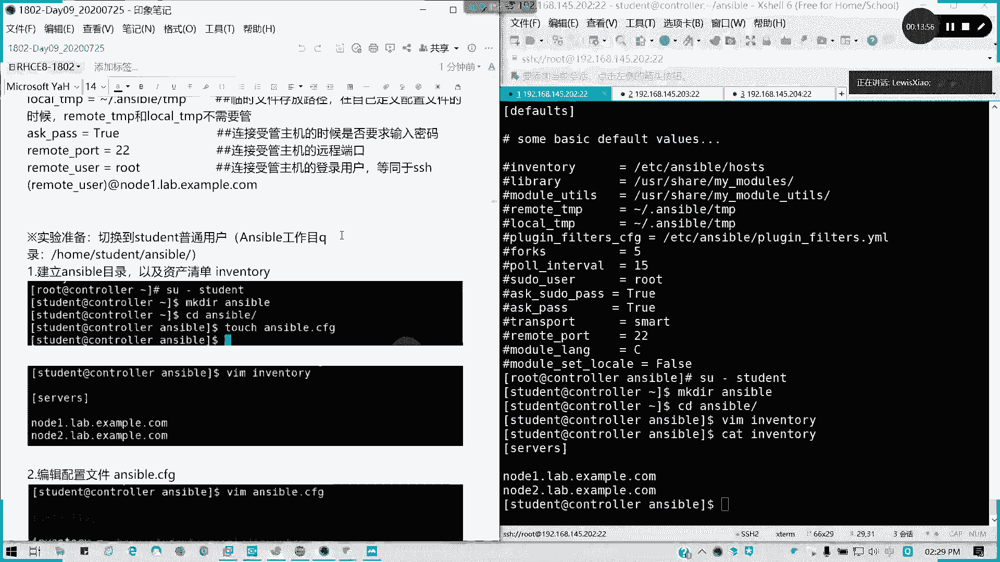

这是一个新文件。好。首先，配置节开始default DEFAULTS。配置节开始。然后首先我们要阐明我们的资产清单的一个位置。inventory这里的写法建议啊空格等号左右两边留空格，懂我意思吗？

然后在VI里面，它。只要他的配置，它的这个。配置节它是会用绿色表示，然后我的那个key跟volume就我们那个值啊，我们的那个选项是白色的，等于选项等于是白色的。然后后面的值呢。是红色的。

这样也比较容易区分。好了。我们就home studentdent answerwerable目录下面的inventory。我们的资产清单目录啊，资产金文件我们定义成这样子。然后我们的远程端口。

我这里为了一行一行，我是把它分开分开写啊，这中间为什么加一个加了一个回车，没关系啊，我。remote port我们的远程端口，我们设定为22。然后呢，remote。优色。我们用对方用root。询问密码。

这里我们暂且先用。处。

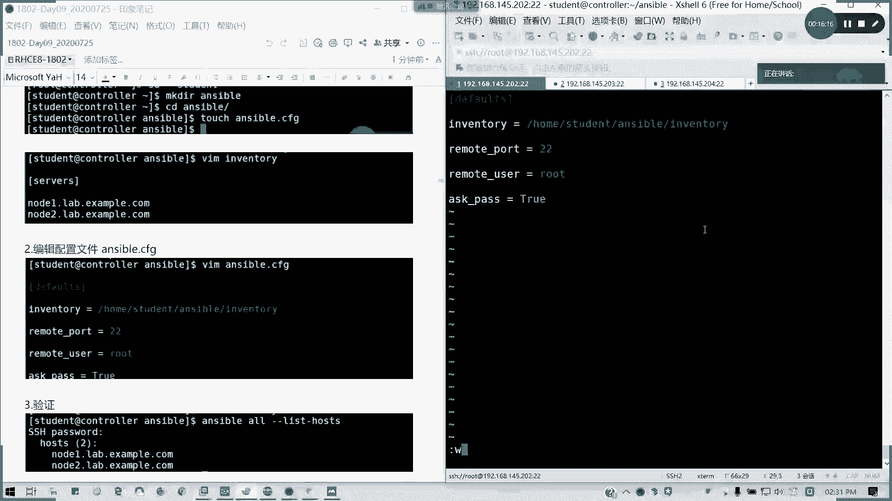

那这样我们的配置文件也就成了啊，配置文件就成了。那我们做一个验证。这里的话它会要求输入SSH的密码。是不是？说完之后，我的清单就可以列出来了。这就是我们自定配置文件的初初级啊初级步骤。那如果。

不输入密码呢怎么办？我要做两件事。第一个我们的选项。我的S本CFC区这里要改成force。这里啊，我们ask下划线pass要改成force之外呢，还要做免密认证，也就是我们早上做的事情。

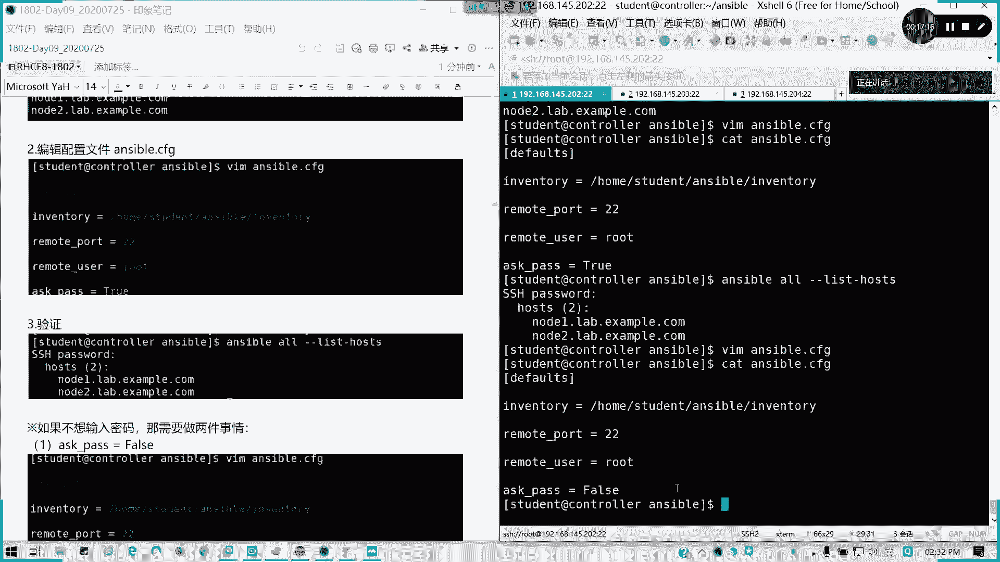

对不对？早上做事情免密认证，你才能不需要输入密码。那我现在我执行一遍，我已经做过了。对吧。对吧。没问题啊。若ask pass等于fse，然后呢，加上我们的免密认证之后，我们正常就不需要直输入密码。

我们就可以列出我们的资产现在列表，以以及我们运行我们的那个临时命令。那如果。我们远程用户不是root，而是普通用户。比如说就是student吧。

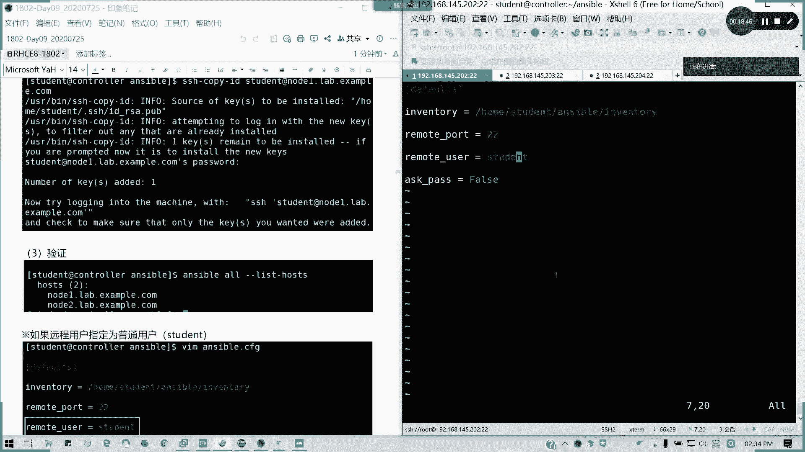

那我们来看一看。看下有些操作，看能不能做啊。但如果用普通用户啊，比如说这样拼的话，我们是能做的。但是如果要裁一个磁盘。我这里用需要模块，也就是我们相当于在直接在我们的。

对方的售管就在我们收管主机上直接运行需要命令。对不对？如果运行有些部分管理员的命令，对吧？如果运费运行有些管理员命令的话，那就运行不了了，懂我意思吗？他是一个普通用户哎。你像F disk。

你在普通户能能执行吗？我们可以试一下啊。我就简我们简单在这里试一下就知道了，就自己的这个机器。对吧。同样的一个提示，对吗？对不对？

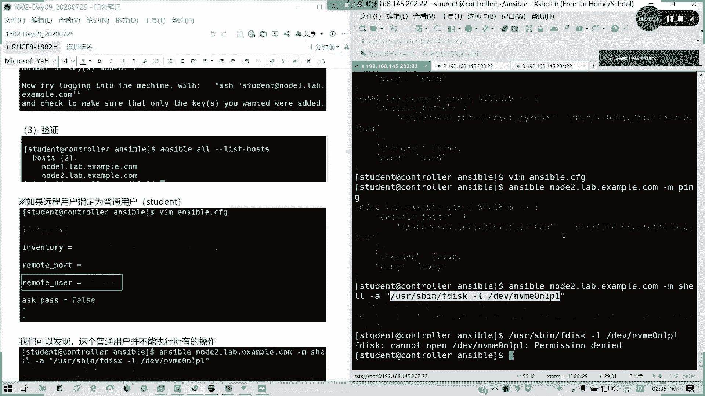

我F disk这个命令我不能。我我在普通用户上，我不能直我不能正确的得到我们的结果，它会提示我们全。权限不够啊。那如果啊这个普通用户不能执行这所有操作呢怎么办呢？那我们需要进行一个权限提升。

权限提升两种办法，一种是采用速度的一个操作啊，速度，然后也其实就是切换到一个root。第二个是直接将那个更改我们受信任的一个。将我们的系统组设为授信任啊，是授信任，而且。不啊不需要输入密码。然后呢。

另外。你要将你的那个普通的。用户加照we组推荐使用方法一，速度提全。那我们来看一看两种方法各自怎么操作。我们以note一作为速度的用速度的使用法啊，node2我们作为。

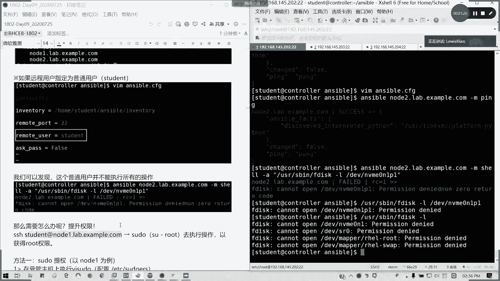

那个SU。来个题选法我们来测试啊，现在我们note一同样也是没权限的。好。我们怎么办呢？速度提全。我们首先。啊，首度的话还记得吗？在我们第一本书的讲到第六章本地管理本地用户跟组的时候已经有说过。

那我们来看一看。我们在load一上执行VI度。

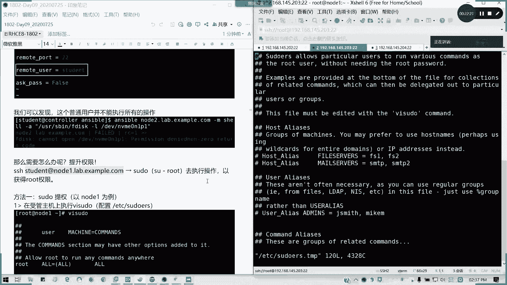

然后呢，我要添加一个用户，就是不需要输入密码，然后给直行所有东西了。但在实际情况啊，如果你要受控的话，你必须要把它权限设一下啊，而不是说那个直接放任所有啊，懂我意思吧？

我们搜vi这里就是搜到一个叫saming without a password。sam pass password，我们在这里加一行。St up。任意主机从任意主机任意用户连过来。

n pass WD空格or是吧？运行用速度运用这个用户，然后执行速度的时候。任何执行任何命令不需要输入密码。来。保存退出，这是第一步在售物管主机上配置s dos这个文件。

然后把student加入到to度里面，我不需要输入密码的这输入密码的这一行。然后接下来我们配文件提全，我们来回到我们的controller。

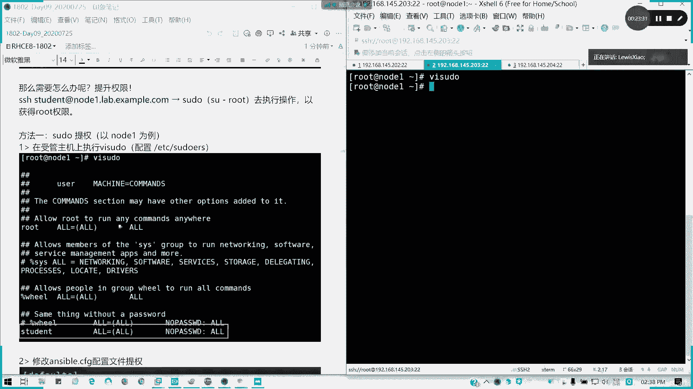

继续磨奈的Answible点CF区。我们这里选项后面还要加东西的啊，加什么呢？叫做权限提升配置项privileage ecalation。记得啊，拼写要正确啊，权限提升配音事项。

privilege下划线escalation。然后呢。配置几个项目啊，看我的笔记里面有啊，首先becom。是否要提全becom选项值为 truee。参数值位处。

然后提全的方法become下划线 method，我们用速度来做。becom需要提前到哪个目标用户，我们这里写root。become ask pass在提全的时候是否需要输入密码？如果设定为forse。

我们默认我们是设定为forse的。如果设定为forse的话，记得在配置数 do的时候，务必要加上这个no pass WD哦，对不对？要加上的。就刚才我已经加了。好，我们再来试一下note一。

我们能不能跑这个命令。对吧。显示出来这个分区的一个信息，对不对？懂吗？这是第一种方法，考试推荐使用的是度。第一种，如果明白，请打F。有问题请提问。この癒足しと今の。V都点唔得噶。

还在那个控制在我们的被控端，在我们的数万主机内VS度啊。有问题可以提问啊，这是第一种方法。我们推荐使用的VS度。

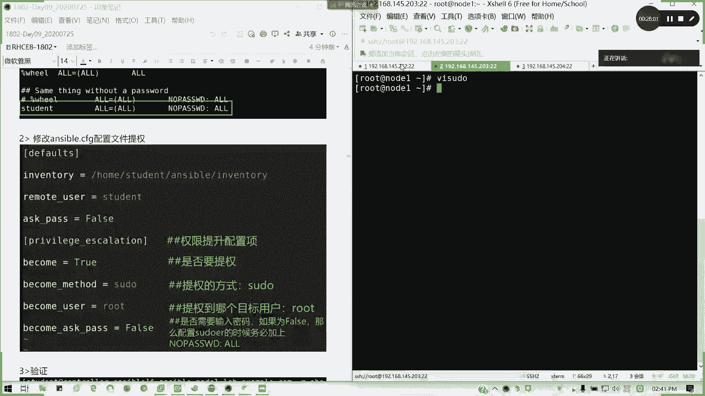

你那哎，你在哪一个用户执行呢？哦。VI速度是不是只有doot用户才能改啊？对吧。可以了吧。看清楚我的操作啊。只三个人明白吗？妈说你们在操作中。这是第一种方法。那你这一个问题啊，我可以做一个试验给你看。

我现在配置个V do我become ask pass等于处会怎么样？你看be卡 pass four，我要输当前用户的密码。🎼说什么是假的，我们实际操作一遍就知道。

所以这里呢还我还是要设定为foralth。你如果是设定个处的话，你这自自动化确实也太那个了吧。

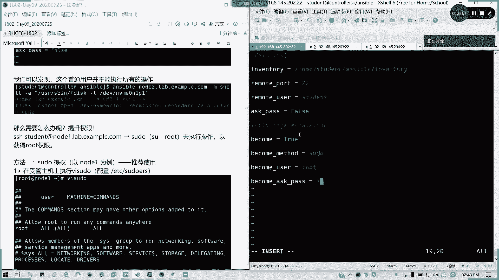

它是布时它它是用黄色显示。然后呢，还有其他问题没有？只有5个人。6个。5个5个5个啊5个，还有人这一块足第一种方法掌握的请按F。有个。7个。这是第一种方法。第一种方法，接下来我们要讲一下FU。

通过修改SU的一个配置文件。来进行提全。我们以note2作为例子。首先我们在控制节点这里啊。我们把方法作为SU啊。becomees数SU其他不变。

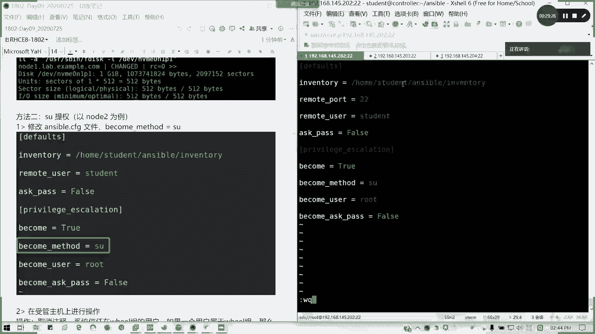

那接下来我们收管主机要操作啊。操作一个叫VIM，我们VI一个叫做。ATCPD啊里面的SU。这是我们PAM的一个文件啊。

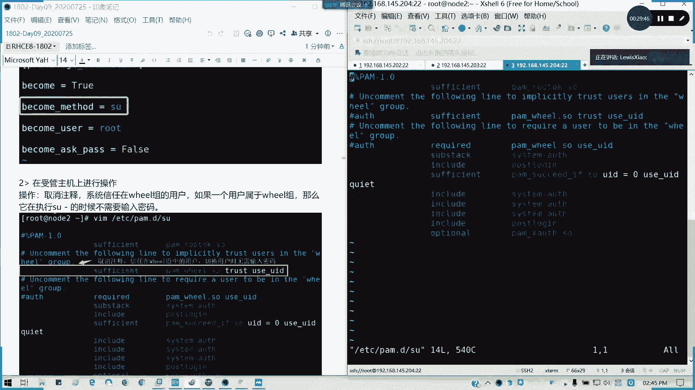

PAM是什么东西啊？P模块呢它是叫做给一个叫可插入的。认证模块它是相当于管理员，我本地管理员，它是一个共享库，它本地管理员可以随意选择程序的认证方式啊。我们的PAM啊。

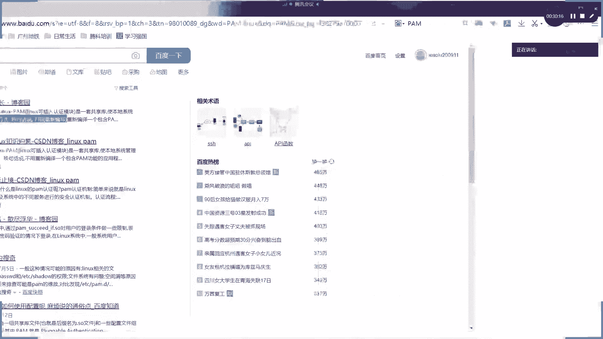

它是这样一个含义来的。那好，我们现在不先不管PI这么多啊，我们就大概知道一个东西就行了。我们在这一行。他对一个物有用户，他是可以实现一个。嗯，你认证我的UID来那个。来实现说在will组我不需要那个切。

就我切换啊，我我说will组的话，我不需要去对程序进行一个认证啊，就执行SU切换的说它不需要输入密码。正常说我们从那个普通户切root是不是需要输入密码，对不对？但是root呢切换到普通用户是不需要的。

对不对？那我们可以。对这一个进行取取消注释啊。如果你用户你是信任的话，你不需要去输入密码了。就这一行uncomment的下面的。这一行。挖学校。它上面是rootOK，也就是我root切换到其他用户。

我是不需要输入密码的。那但是它前提呢，我们用户是要在will组里面。保存退出。然后呢，我这里。

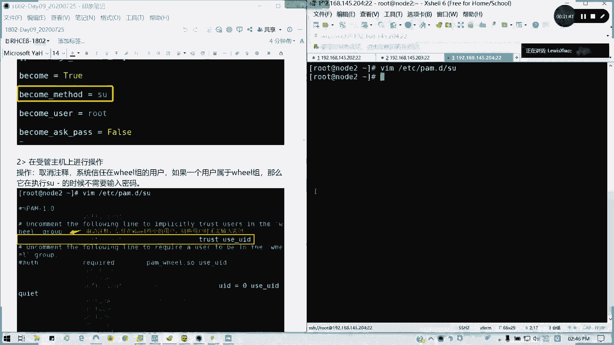

既然他的用户要在vio组，我们ID studentdent用户，他是不是在只是在stuuddent自己的一个组里面，那我们要加入他的附加组，加到vio组里面，user mode杠Gwill。

他的系统用户组。

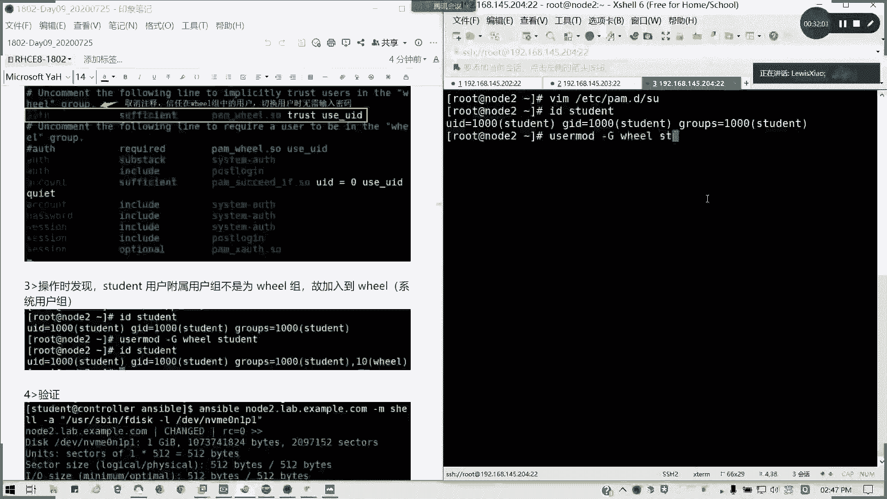

这tu里面就可以了。

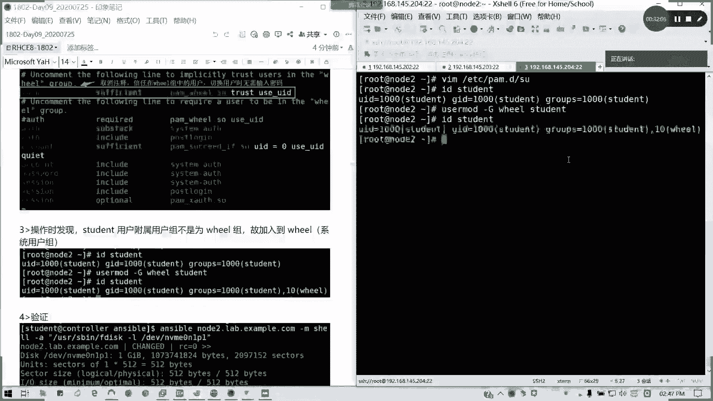

🎼但这种方法我不推荐啊。然后好，我们在这里执行一个node2。同样也能成功，对不对？明白吗？同样也是成功，这是两种方法，一个是通过PAM的可插入的一个验证模块。第一还有一种就是我们的速度啊。

速度我这里推荐大家用速度为主。所以的话我这里同样我把will主这一块的设置我先撤销啊。我先把那个pm点SU那里我改回来。这我就我是为了演示我才这么做的啊。然后呢，我通过VS度去做来更好。

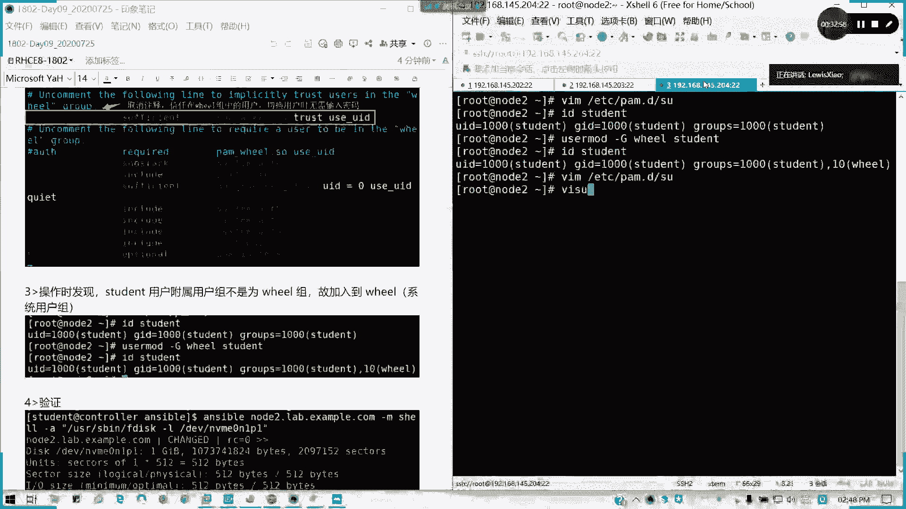

因为我们要做一个统一，后面的话就不要说两种认证分方式都来，那就乱了。那我这里在我们的那个conttrol里面，我把把这个改为速度啊，我们考试建议大家用速度的方法。好的，这块没有问题，请打字母居。

然后接下来给大家一点时间，第二两。4就我们三点钟啊，三点钟出头我们来讲第二章啊，第二章通过ansible来运行临时命令。大家现在先把我们的这个普通用户的环境配置以及提全。这块做一下实间，好吧。

