# Ansible 认证课程：P54：管理 Ansible 配置文件


## 概述
在本节课中，我们将学习如何管理 Ansible 的配置文件。我们将了解配置文件的优先级、结构，以及如何通过配置文件定义资产清单、连接参数和权限提升等关键行为，为后续使用 Ansible 执行自动化任务打下基础。

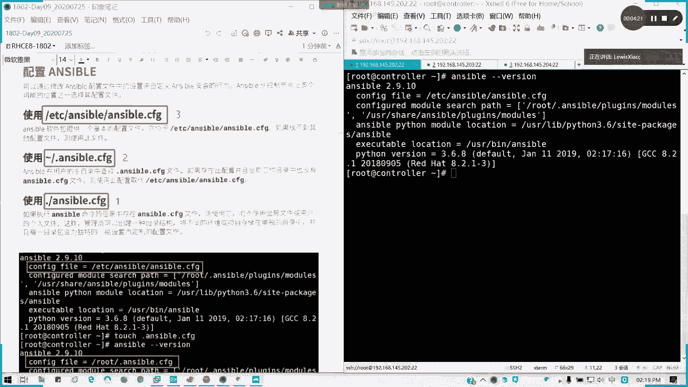

## 配置文件的优先级
Ansible 会从多个可能的位置读取配置文件，不同位置的配置文件具有不同的优先级。优先级数字越大，代表优先级越低。

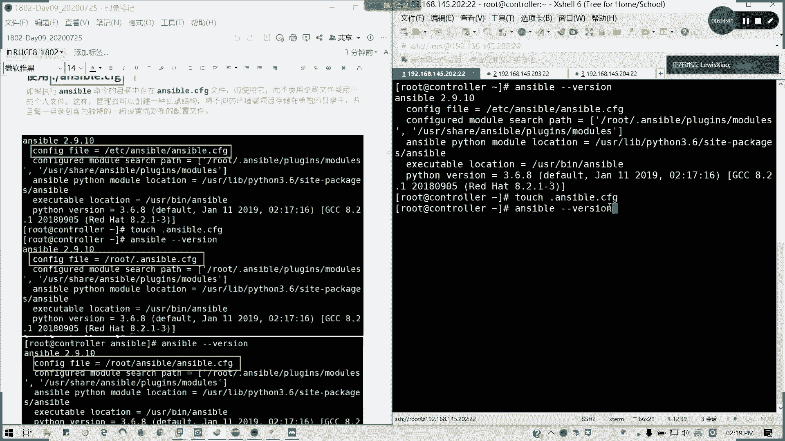

以下是配置文件的优先级顺序：

1.  **当前工作目录下的 `ansible.cfg` 文件**：如果执行 `ansible` 命令的目录中存在 `ansible.cfg` 文件，则优先使用它。其生效范围仅限于该工作目录，优先级最高。
2.  **用户家目录下的 `.ansible.cfg` 文件**：这是一个隐藏文件。如果当前工作目录没有 `ansible.cfg`，Ansible 会在用户的家目录中查找此文件。其生效范围是当前用户。
3.  **`/etc/ansible/ansible.cfg` 文件**：这是 Ansible 的全局默认配置文件。如果以上两个位置均未找到配置文件，则使用此文件。其生效范围是全局。

在考试和实际项目中，通常使用优先级最高的“当前工作目录”模式，以便为不同的项目或环境定义独立的配置。

## 配置文件的结构与关键选项
上一节我们介绍了配置文件的优先级，本节中我们来看看配置文件的具体结构和需要关注的核心配置项。

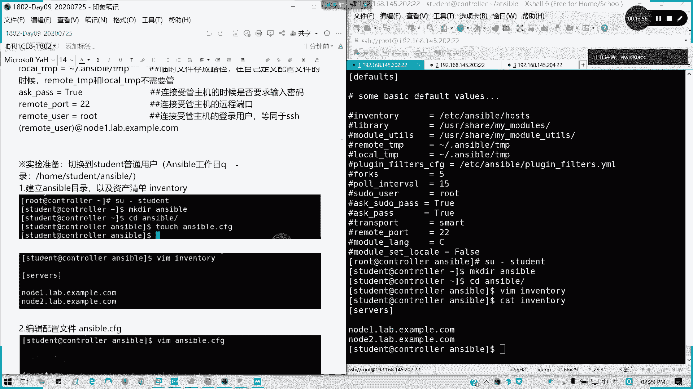

一个典型的 `ansible.cfg` 配置文件由不同的配置节（section）组成。我们主要关注 `[defaults]` 配置节，它定义了 Ansible 的基本行为。

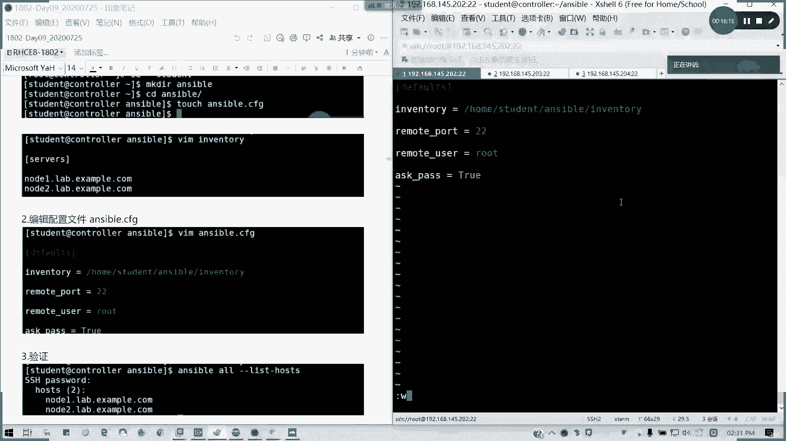

以下是 `[defaults]` 配置节中一些关键选项的说明：

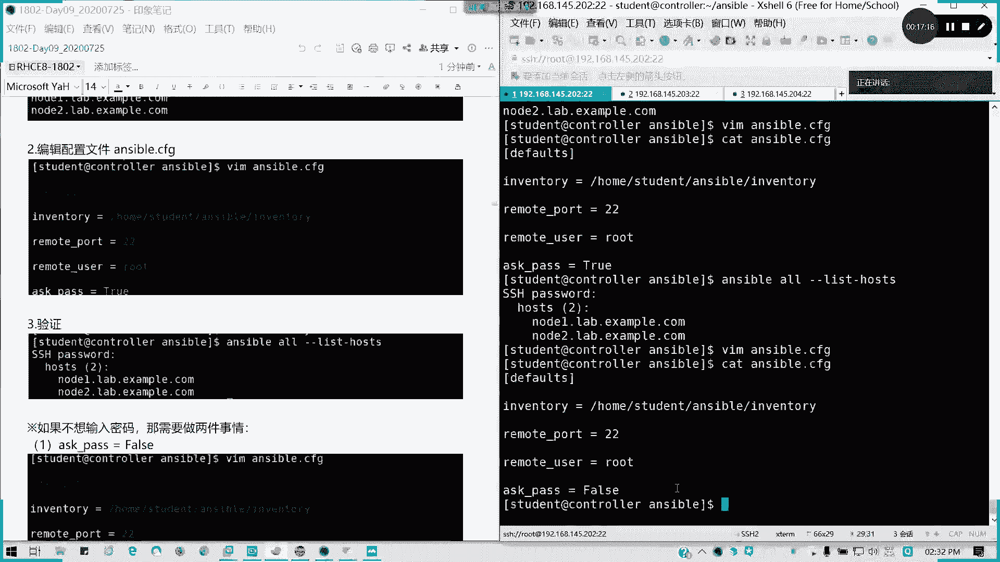

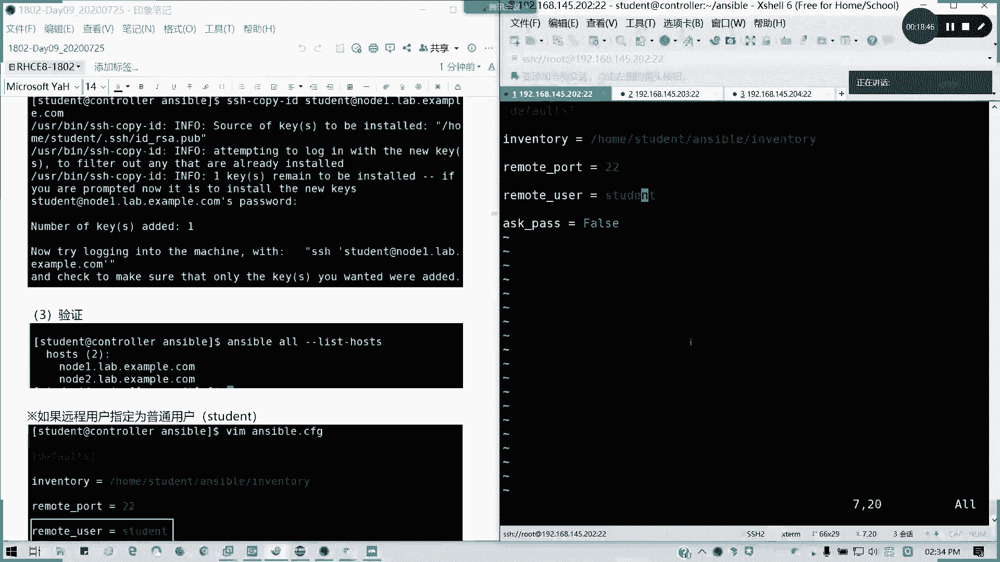

*   **`inventory`**：此选项定义了资产清单文件（即受管主机列表）的路径。这是必须配置的选项。
*   **`remote_user`**：此选项指定了连接受管主机时使用的远程用户。等同于 SSH 连接时使用的用户名。
*   **`remote_port`**：此选项指定了连接受管主机时使用的 SSH 端口，默认为 `22`。
*   **`ask_pass`**：此选项控制连接时是否需要手动输入 SSH 密码。若设为 `True`，则每次执行命令都需要输入密码；为了实现自动化，通常将其设为 `False`，并配合 SSH 密钥认证。
*   **`[privilege_escalation]`**：这是一个独立的配置节，用于配置权限提升（即如何获取 root 权限执行管理命令）。以下是其下的关键子选项：
    *   `become`：是否启用权限提升，设为 `True` 表示启用。
    *   `become_method`：权限提升的方法，常用值为 `sudo` 或 `su`。
    *   `become_user`：提升到哪个目标用户，通常为 `root`。
    *   `become_ask_pass`：在执行权限提升时是否需要输入密码。通常设为 `False`，并需要在受管主机上配置相应的 `sudo` 规则。

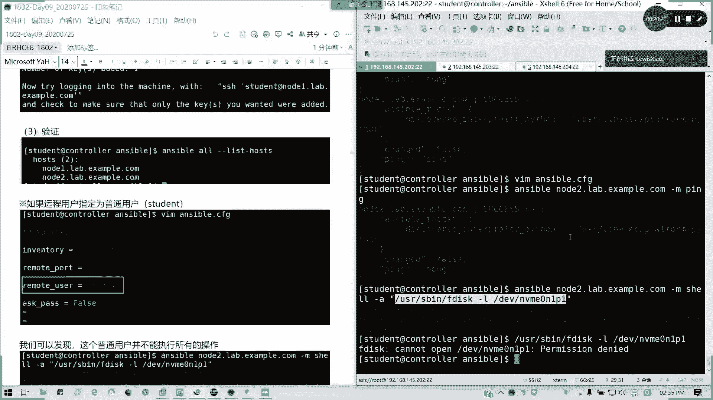

## 实战：配置 Ansible 工作环境
了解了配置文件的结构后，我们通过一个实验来配置一个完整的 Ansible 工作环境。我们将使用普通用户 `student` 进行操作，这更符合生产环境和考试要求。

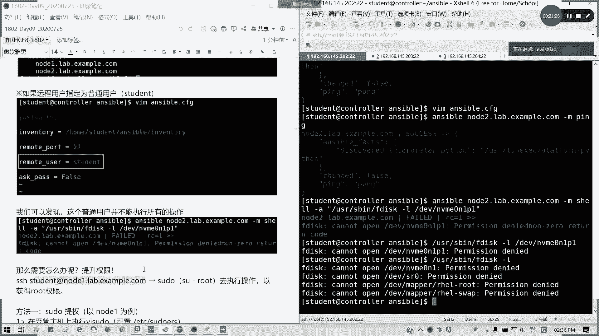

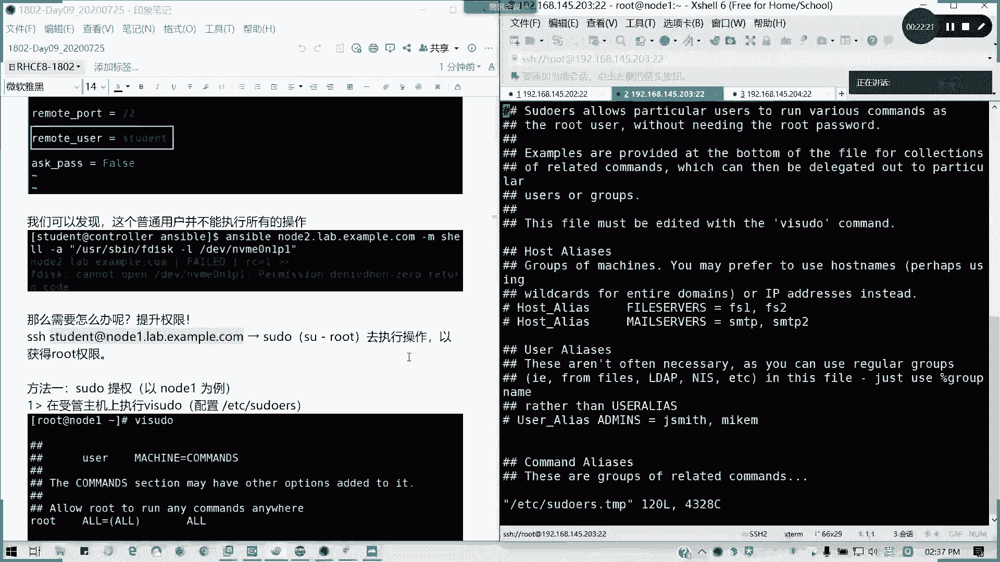

以下是配置步骤：

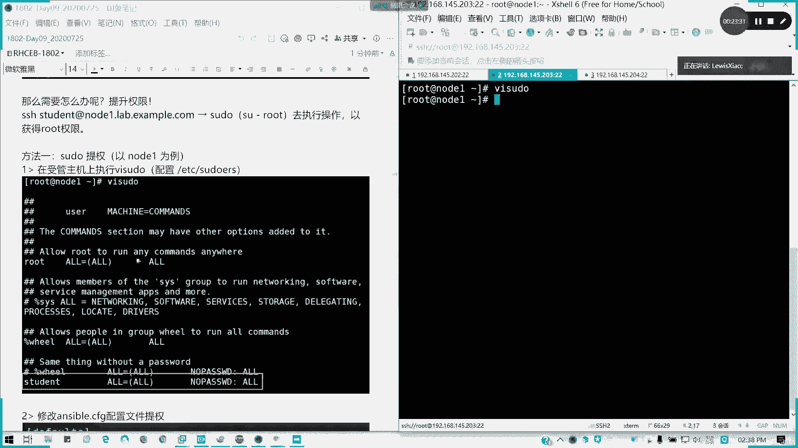

1.  **切换到工作用户并创建目录**
    首先，切换到 `student` 用户，并创建一个专门的工作目录。
    ```bash
    su - student
    mkdir ansible
    cd ansible
    ```

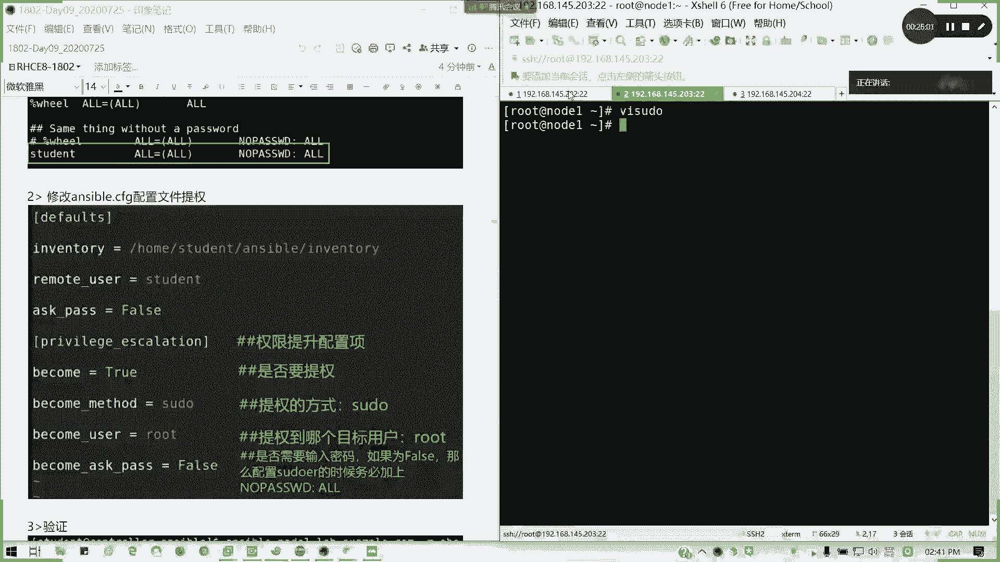

2.  **创建资产清单文件**
    在工作目录下创建名为 `inventory` 的文件，并定义两台受管主机。
    ```bash
    # 文件内容示例
    [servers]
    node1.lab.example.com
    node2.lab.example.com
    ```

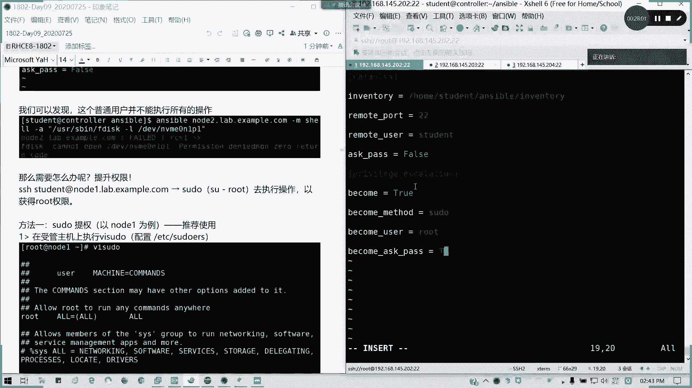

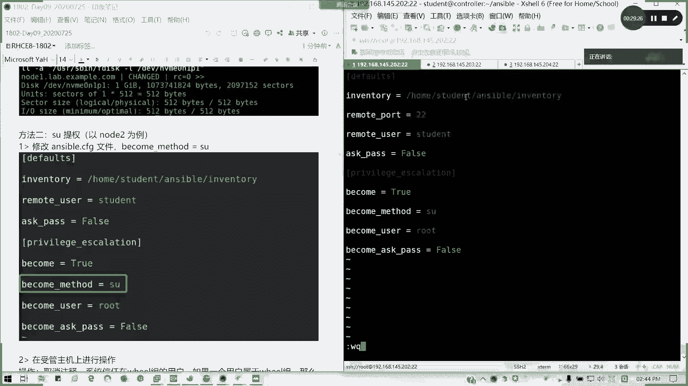

3.  **创建并编辑 Ansible 配置文件**
    在工作目录下创建 `ansible.cfg` 文件，并进行基础配置。
    ```bash
    # 文件内容示例
    [defaults]
    inventory = /home/student/ansible/inventory
    remote_user = student
    remote_port = 22
    ask_pass = False

    [privilege_escalation]
    become = True
    become_method = sudo
    become_user = root
    become_ask_pass = False
    ```
    **注意**：`ask_pass = False` 的前提是控制节点上的 `student` 用户已经与受管主机上的 `student` 用户建立了 SSH 密钥认证（免密登录）。

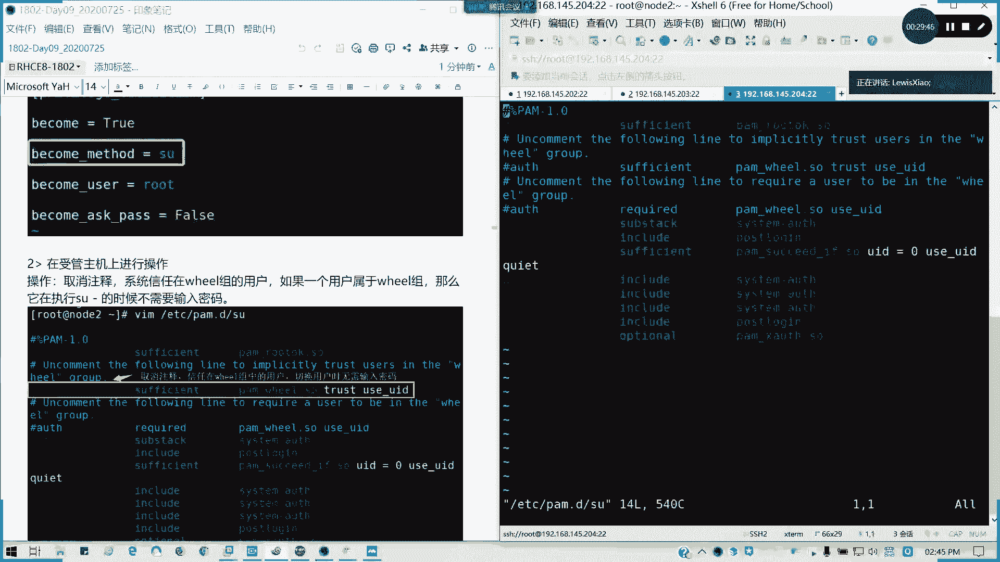


4.  **在受管主机上配置 sudo 规则（权限提升）**
    为了让 `student` 用户能够通过 `sudo` 以 `root` 身份执行命令且无需输入密码，需要在每台受管主机上进行配置。
    *   以 `root` 身份编辑 `/etc/sudoers` 文件（使用 `visudo` 命令是安全做法）。
    *   在文件中添加如下一行：
        ```bash
        student ALL=(ALL) NOPASSWD:ALL
        ```
        这表示允许 `student` 用户从任何主机以任何用户身份执行所有命令，且不需要密码。

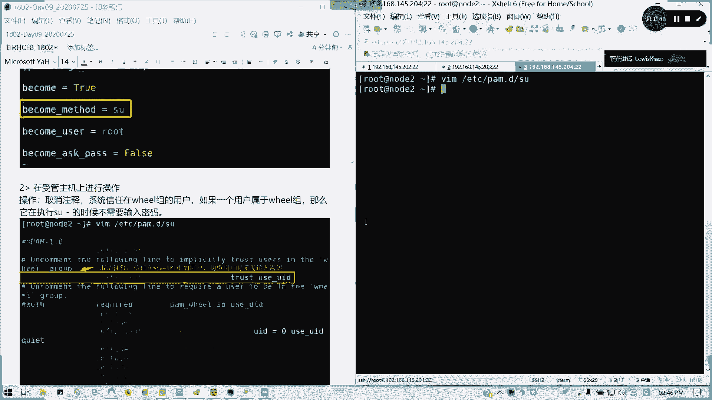

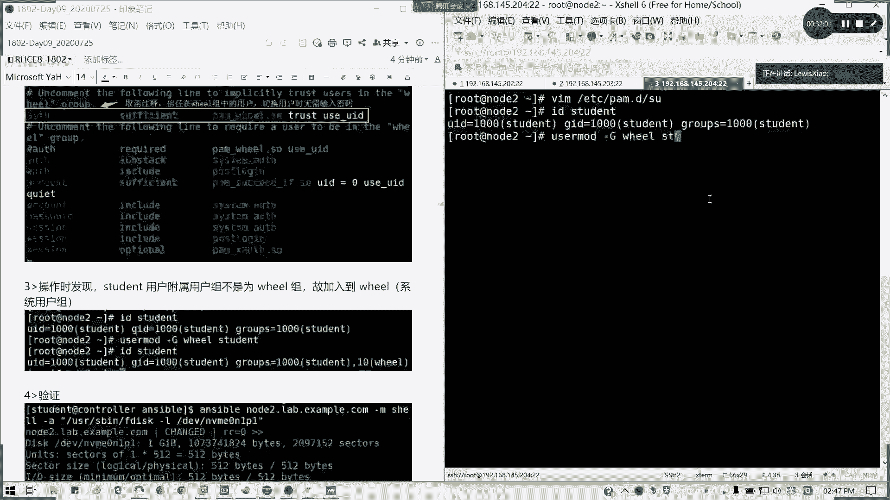

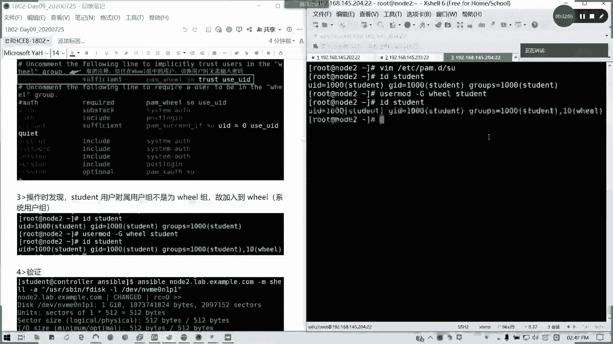

5.  **验证配置**
    完成以上步骤后，可以在控制节点的工作目录下执行命令进行验证。
    ```bash
    # 列出资产清单中的所有主机
    ansible all --list-hosts

    # 在所有受管主机上执行一个需要特权权限的命令（如查看磁盘分区）
    ansible all -m shell -a “fdisk -l”
    ```
    如果配置正确，第一条命令应能列出主机，第二条命令应能成功返回磁盘信息而无需输入密码。

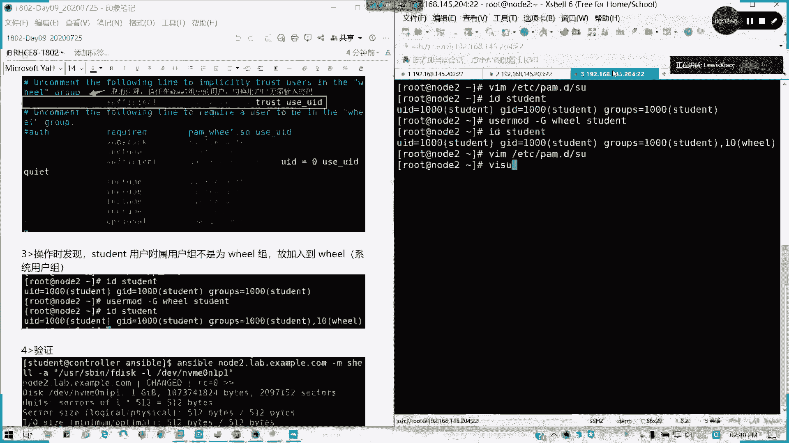

## 总结
本节课中我们一起学习了 Ansible 配置文件的管理。我们掌握了配置文件的三种位置及其优先级规则，重点学习了 `[defaults]` 和 `[privilege_escalation]` 配置节中的关键选项。通过实战演练，我们配置了一个使用普通用户 `student`、基于 SSH 密钥认证、并通过 `sudo` 实现无密码权限提升的完整 Ansible 工作环境。这是使用 Ansible 进行自动化操作的基础，请务必熟练掌握。