# Ansible课程：2a：Ansible临时命令与文件模块


在本节课中，我们将要学习Ansible临时命令的基本语法和用法，并重点介绍文件管理相关的核心模块，包括`copy`、`file`、`fetch`、`lineinfile`和`synchronize`。通过掌握这些模块，你将能够使用Ansible高效地管理远程主机上的文件。

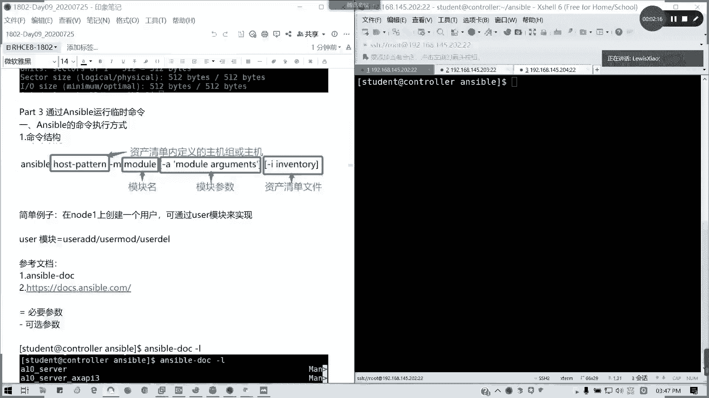

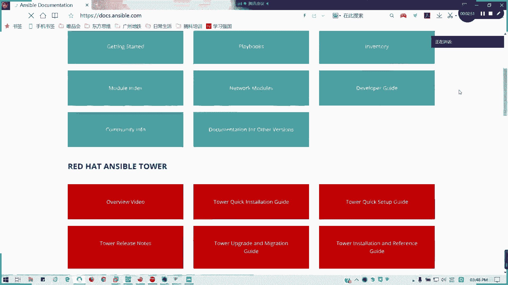

## 临时命令语法

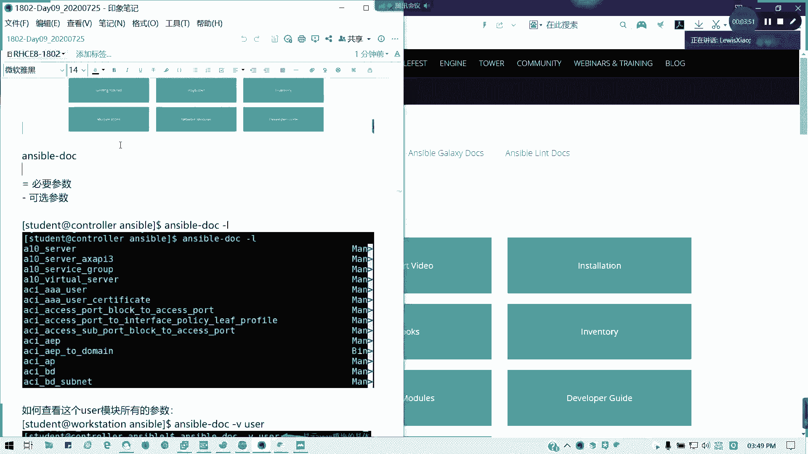

上一节我们介绍了Ansible的基本配置，本节中我们来看看如何执行临时命令。临时命令是直接在命令行中执行单条Ansible任务的快捷方式。

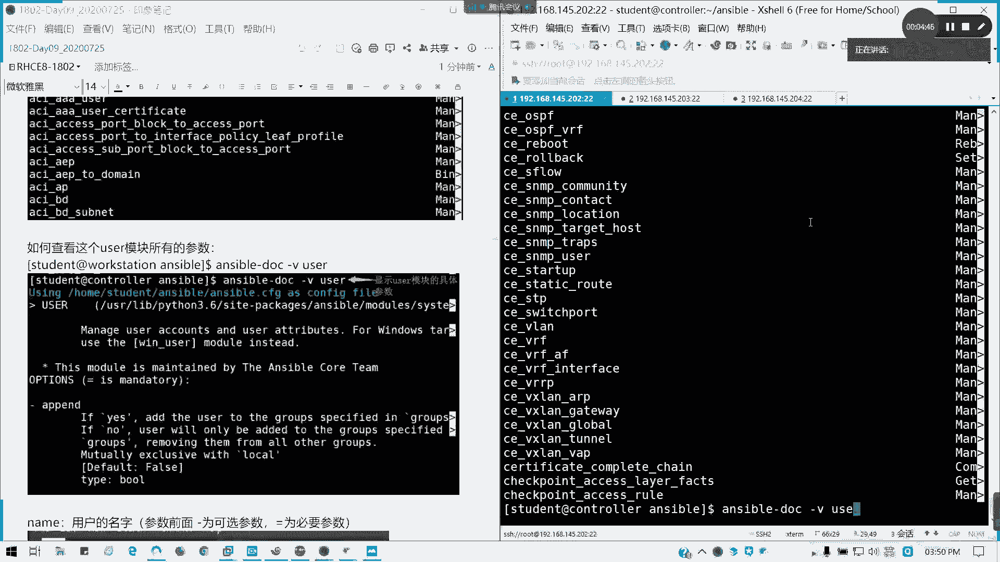

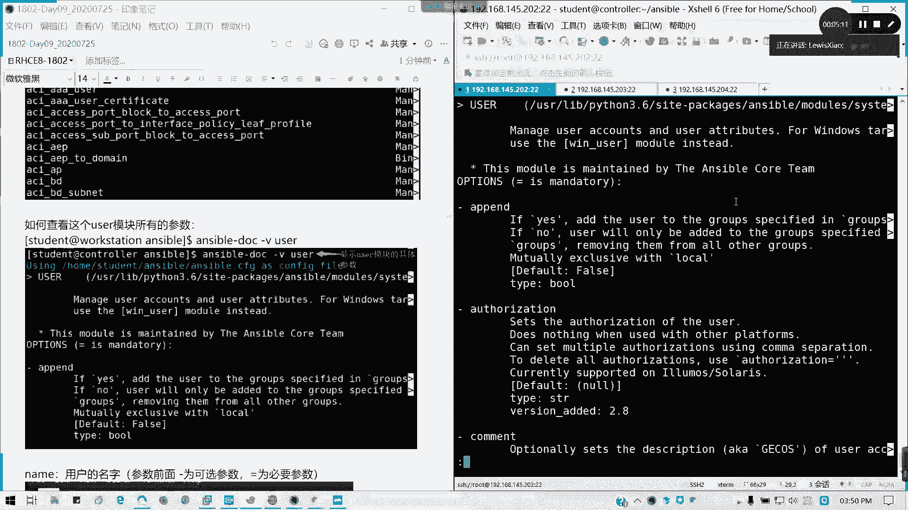

其基本语法结构如下：
```bash
ansible <主机模式> -m <模块名> -a "<模块参数>"
```
*   **`<主机模式>`**：指定目标主机，可以是资产清单中定义的主机组名、具体主机名或IP地址。
*   **`-m <模块名>`**：指定要使用的Ansible模块。
*   **`-a "<模块参数>"`**：传递给模块的参数。

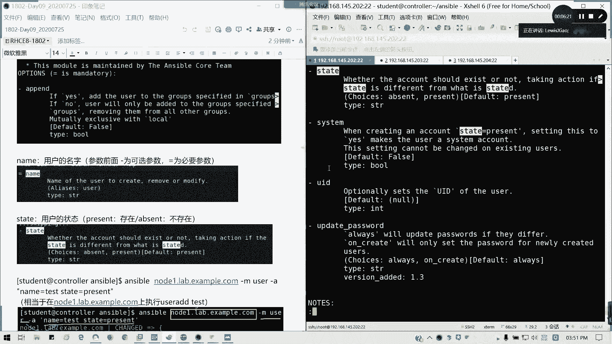

例如，要在`node1`主机上创建一个名为`ts`的用户，可以使用`user`模块：
```bash
ansible node1.lab.example.com -m user -a "name=ts"
```

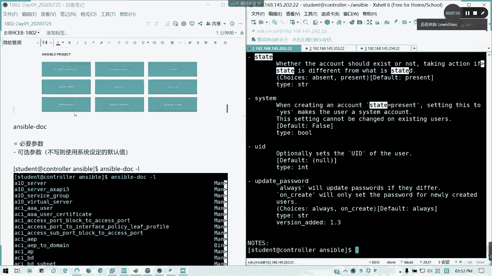

## 获取模块帮助

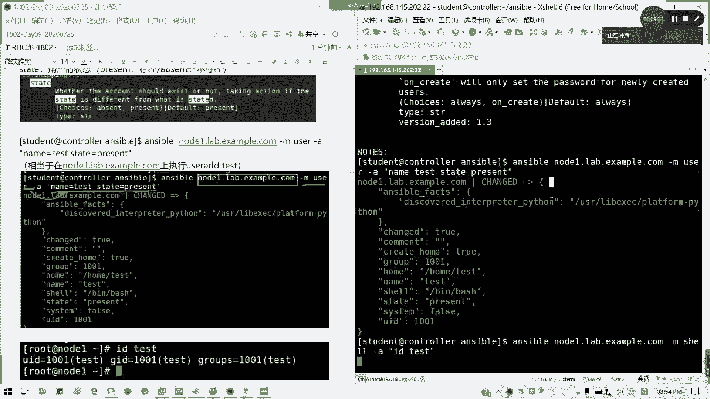

初学Ansible时，可以通过以下途径查询模块的详细用法和参数。

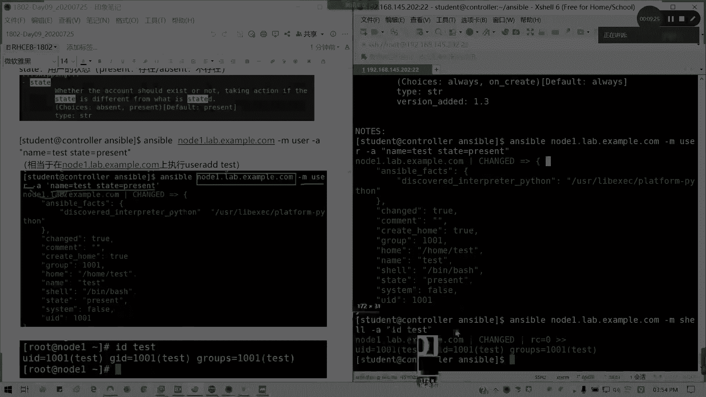

以下是两种主要的查询方式：
1.  **`ansible-doc` 命令**：在控制节点上使用此命令查看本地模块文档。例如，`ansible-doc -l`列出所有模块，`ansible-doc user`查看`user`模块的详细说明。
2.  **官方在线文档**：访问 [docs.ansible.com](https://docs.ansible.com) 获取最全面、最新的模块信息。

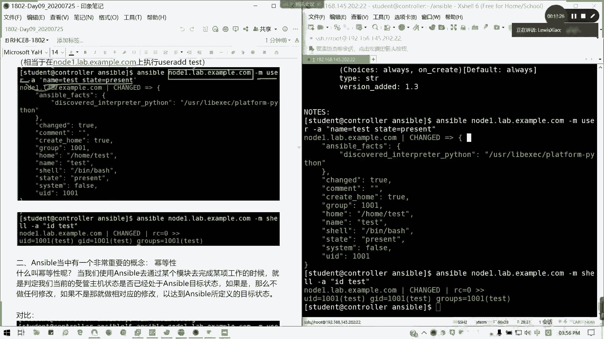

在`ansible-doc`的输出中，参数前的标记很重要：
*   **`=`**：表示该参数是必需的。
*   **`-`**：表示该参数是可选的，通常有默认值。

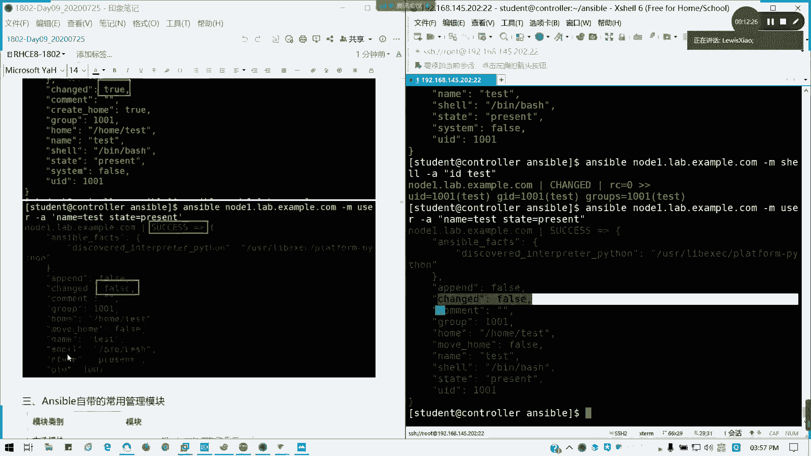

## 幂等性概念

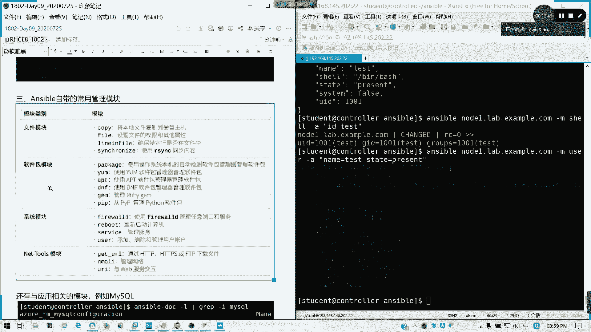

Ansible有一个非常重要的核心概念：**幂等性**。

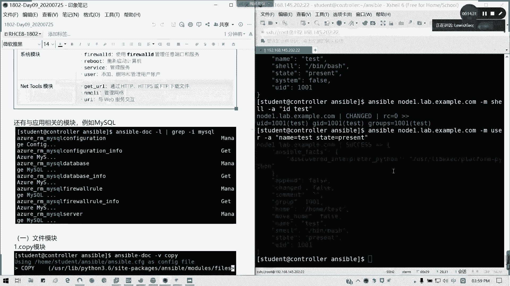

当我们使用Ansible模块执行任务时，Ansible会先判断受管主机的当前状态。如果当前状态已经符合任务期望的“目标状态”，则Ansible不会进行任何操作；只有当当前状态不符合目标状态时，Ansible才会执行必要的更改以达到目标状态。这意味着同一个Ansible任务可以安全地重复执行。

## 文件管理模块

接下来，我们将深入学习几个常用的文件管理模块。

### 📄 Copy模块

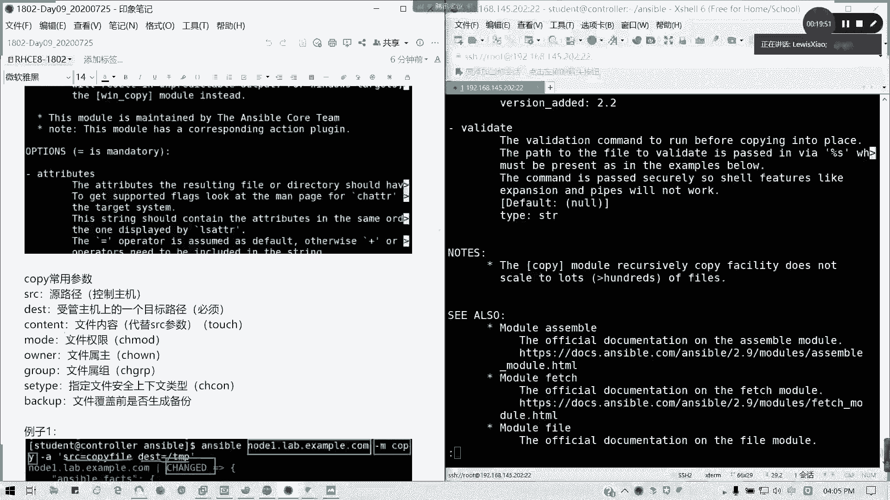

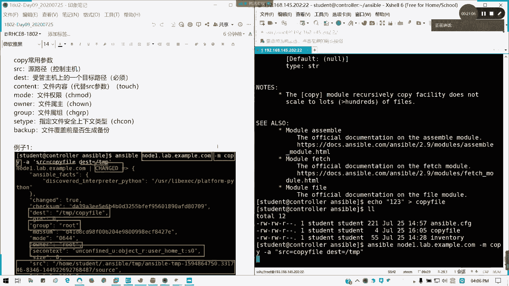

`copy`模块用于将文件从控制节点复制到受管主机。

以下是`copy`模块的常用参数：
*   **`src`**：控制节点上源文件的路径（绝对或相对路径）。如果源是目录，需在路径末尾加`/`来复制目录内容而非目录本身。此参数与`content`互斥。
*   **`dest`**：（必需）文件在受管主机上的目标路径。
*   **`content`**：直接在受管主机上创建文件并写入此参数指定的内容。与`src`互斥。
*   **`owner`**：设置文件的所有者。
*   **`group`**：设置文件的所属组。
*   **`mode`**：设置文件的权限（如 `0755`）。
*   **`seuser` / `serole` / `setype` / `selevel`**：设置SELinux上下文。
*   **`backup`**：在覆盖文件前创建备份（`yes`/`no`）。

**示例：**
1.  复制本地文件到远程主机：
    ```bash
    ansible node1 -m copy -a "src=copytest dest=/tmp/"
    ```
2.  在远程主机直接生成文件内容：
    ```bash
    ansible node1 -m copy -a "content='ts copy\n' dest=/tmp/f1"
    ```
3.  复制文件并设置属性：
    ```bash
    ansible node1 -m copy -a "src=copytest dest=/tmp/f2 owner=student group=student mode=0755 setype=httpd_sys_content_t"
    ```

### 📁 File模块

`file`模块用于在受管主机上设置文件、目录、链接的属性，或创建它们。

以下是`file`模块的常用参数：
*   **`path`**：（必需）文件/目录/链接的路径。
*   **`state`**：目标状态。常用值有：
    *   `directory`：创建目录。
    *   `touch`：创建空文件。
    *   `link`：创建软链接。
    *   `hard`：创建硬链接。
    *   `absent`：删除。
*   **`owner`** / **`group`** / **`mode`**：同`copy`模块。
*   **`src`**：当`state=link`或`hard`时，指定链接的源目标。

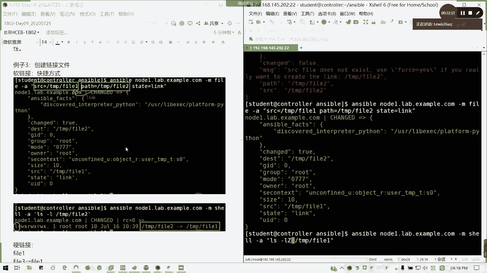

**示例：**
1.  创建目录：
    ```bash
    ansible node1 -m file -a "path=/tmp/dir1 state=directory owner=student group=student mode=0755 setype=httpd_sys_content_t"
    ```
2.  创建空文件（使用`touch`）：
    ```bash
    ansible node1 -m file -a "path=/tmp/f1 state=touch"
    ```
3.  创建软链接和硬链接：
    ```bash
    # 软链接
    ansible node1 -m file -a "src=/tmp/f1 dest=/tmp/f2 state=link"
    # 硬链接
    ansible node1 -m file -a "src=/tmp/f1 dest=/tmp/f3 state=hard"
    ```

### 📥 Fetch模块

`fetch`模块用于将文件从受管主机拉取（下载）到控制节点。

以下是`fetch`模块的常用参数：
*   **`src`**：（必需）受管主机上源文件的路径。
*   **`dest`**：（必需）控制节点上存储文件的目录。
*   **`flat`**：如果设置为`yes`，则文件会直接保存在`dest`指定的路径下，而不会按主机名创建子目录。

**示例：**
1.  拉取文件（默认按主机名创建目录结构）：
    ```bash
    ansible node1 -m fetch -a "src=/tmp/f1 dest=/home/student/ansible-fetch/"
    ```
2.  拉取文件并指定保存路径和文件名：
    ```bash
    ansible node1 -m fetch -a "src=/tmp/f1 dest=/home/student/ansible-fetch/f1 flat=yes"
    ```

### ✏️ Lineinfile模块

`lineinfile`模块用于确保某一行文本存在于（或不存在于）文件中，非常适合修改配置文件。

以下是`lineinfile`模块的常用参数：
*   **`path`**：（必需）要修改的文件路径。
*   **`regexp`**：使用正则表达式匹配需要修改的行。
*   **`line`**：替换或插入的文本行内容。
*   **`state`**：`present`（确保行存在，默认）或 `absent`（确保行不存在，即删除）。
*   **`insertafter`** / **`insertbefore`**：当`state=present`且未匹配到行时，在匹配行之后或之前插入新行。
*   **`backup`**：修改前备份原文件。

**示例：**
假设已将`/etc/selinux/config`文件复制到受管主机的`/tmp/selinux`。
1.  替换以`SELINUX=`开头的行：
    ```bash
    ansible node1 -m lineinfile -a "path=/tmp/selinux regexp='^SELINUX=' line='SELINUX=disabled'"
    ```
2.  在匹配行之后插入注释行：
    ```bash
    ansible node1 -m lineinfile -a "path=/tmp/selinux regexp='^SELINUX=' insertafter=yes line='# SELINUX is disabled now'"
    ```
3.  删除包含特定注释的行：
    ```bash
    ansible node1 -m lineinfile -a "path=/tmp/selinux regexp='^#.*disabled' state=absent"
    ```

### 🔄 Synchronize模块

`synchronize`模块是对`rsync`命令的封装，用于在控制节点和受管主机之间高效同步目录或文件。

以下是`synchronize`模块的常用参数：
*   **`src`**：同步的源路径（在控制节点上）。
*   **`dest`**：同步的目标路径（在受管主机上）。
*   **`delete`**：同步后，删除目标端存在而源端不存在的文件（慎用）。
*   **`recursive`**：递归同步子目录。

**示例：**
将控制节点当前目录下的`test`文件同步到受管主机的家目录：
```bash
ansible node1 -m synchronize -a "src=test dest=/home/student/"
```

## 总结

本节课中我们一起学习了Ansible临时命令的语法和强大的文件管理能力。我们了解了如何使用`ansible-doc`获取帮助，理解了幂等性的核心思想，并实践了`copy`、`file`、`fetch`、`lineinfile`和`synchronize`这几个关键的文件操作模块。掌握这些是编写复杂Ansible剧本的基础。