# Ansible 认证课程：P56：软件包与仓库管理模块教程


## 📋 概述
在本节课中，我们将学习 Ansible 中用于管理软件包和软件仓库的核心模块。我们将重点掌握如何使用 `yum_repository` 模块配置软件仓库，以及如何使用 `yum` 模块进行软件的安装、卸载、更新和组安装。这些操作是自动化系统管理的基础，也是 RHCE 认证考试的重点内容。

---

## 📦 软件包模块简介
上一节我们介绍了 Ansible 的基础概念和临时命令。本节中，我们来看看用于管理软件包的模块。

软件包模块的主要作用是安装或卸载软件包。执行这些操作的前提是系统中必须存在可用的软件仓库。

---

## 🗂️ 软件仓库模块 (`yum_repository`)
在配置软件包管理之前，首先需要确保软件仓库可用。在考试中，配置软件仓库是常见的考点。

手动配置软件仓库的方法是在 `/etc/yum.repos.d/` 目录下创建 `.repo` 文件。然而，在 Ansible 中，我们可以使用 `yum_repository` 模块来自动化完成此任务。

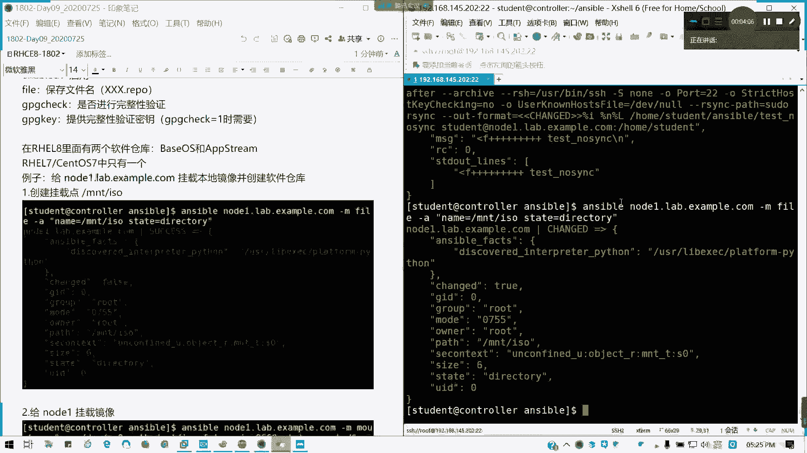

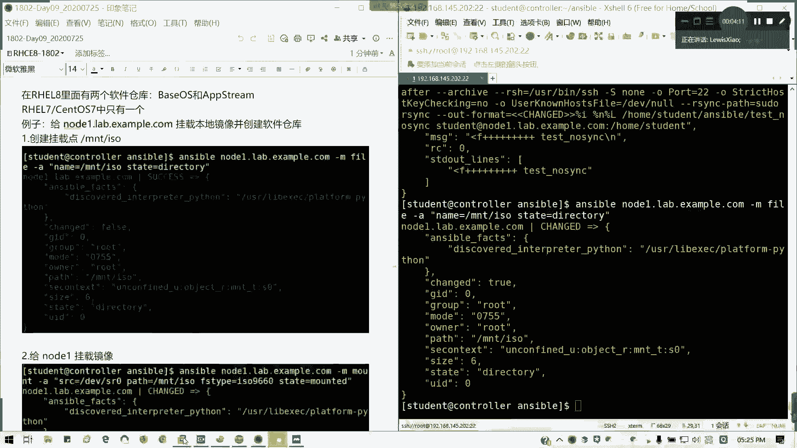

以下是 `yum_repository` 模块的常用参数，它们与手动编写的 `.repo` 文件内容相对应：

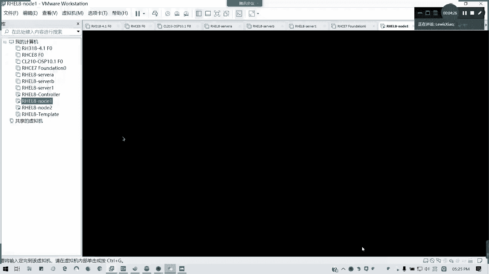

*   **`baseurl`**: 软件仓库的地址。
*   **`description`**: 软件仓库的描述信息。
*   **`enabled`**: 是否启用该仓库（1为启用，0为禁用）。
*   **`file`**: 保存配置的文件名（通常为 `xxx.repo`）。
*   **`gpgcheck`**: 是否进行软件包完整性验证（1为是，0为否）。
*   **`gpgkey`**: 提供完整性验证所需的 GPG 密钥文件路径（通常当 `gpgcheck=1` 时才需要）。

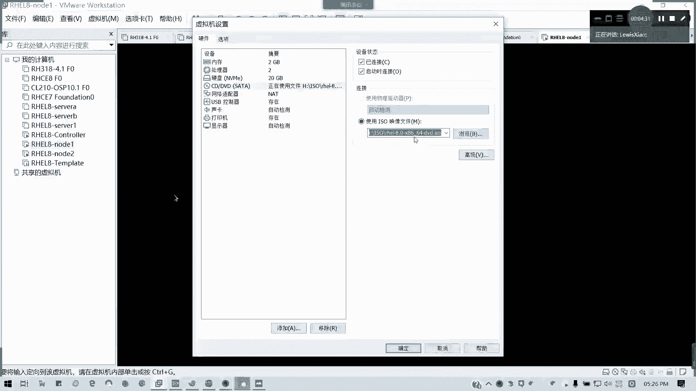


### 实践：在节点上配置本地软件仓库
我们将以 Red Hat 8 系统为例，演示如何为 `node1` 配置本地软件仓库。Red Hat 8 通常包含 `BaseOS` 和 `AppStream` 两个仓库。

首先，我们需要创建挂载点并挂载光盘镜像。这可以通过 `mount` 模块完成。

```bash
# 1. 创建挂载点目录
ansible node1.lab.example.com -m file -a "path=/mnt/iso state=directory"

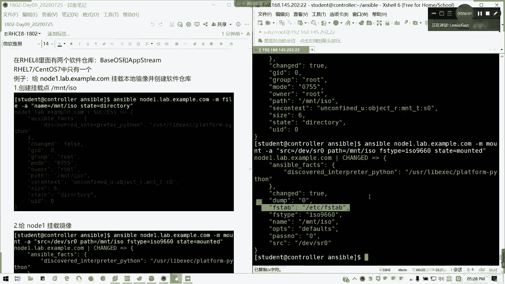

# 2. 挂载光盘镜像到该目录
ansible node1.lab.example.com -m mount -a "src=/dev/sr0 path=/mnt/iso fstype=iso9660 state=mounted"
```

接下来，我们使用 `yum_repository` 模块创建两个软件仓库配置文件。

```bash
# 3. 创建 BaseOS 仓库配置
ansible node1.lab.example.com -m yum_repository -a "name=BaseOS description='RHEL8 BaseOS' baseurl=file:///mnt/iso/BaseOS enabled=1 gpgcheck=0 state=present"

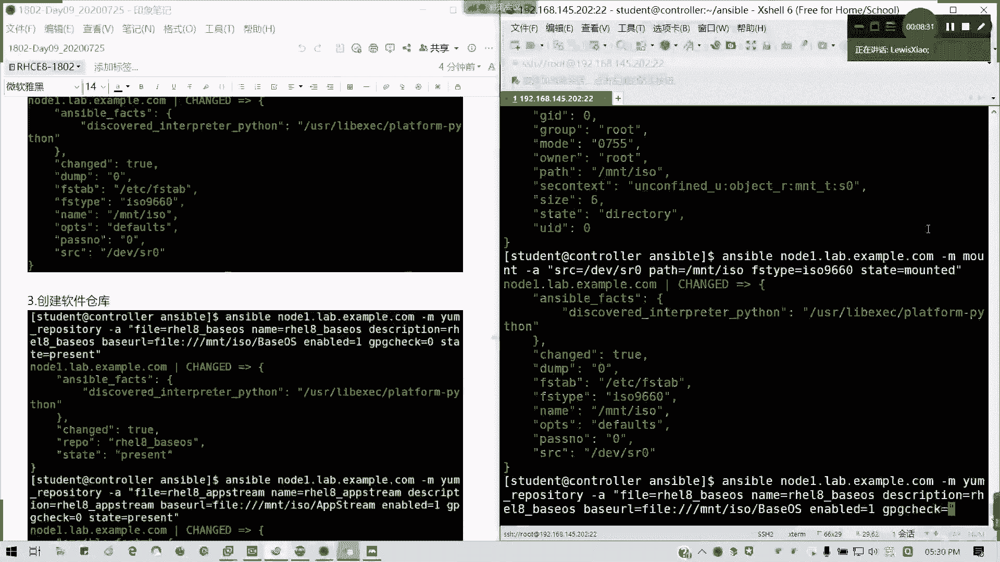

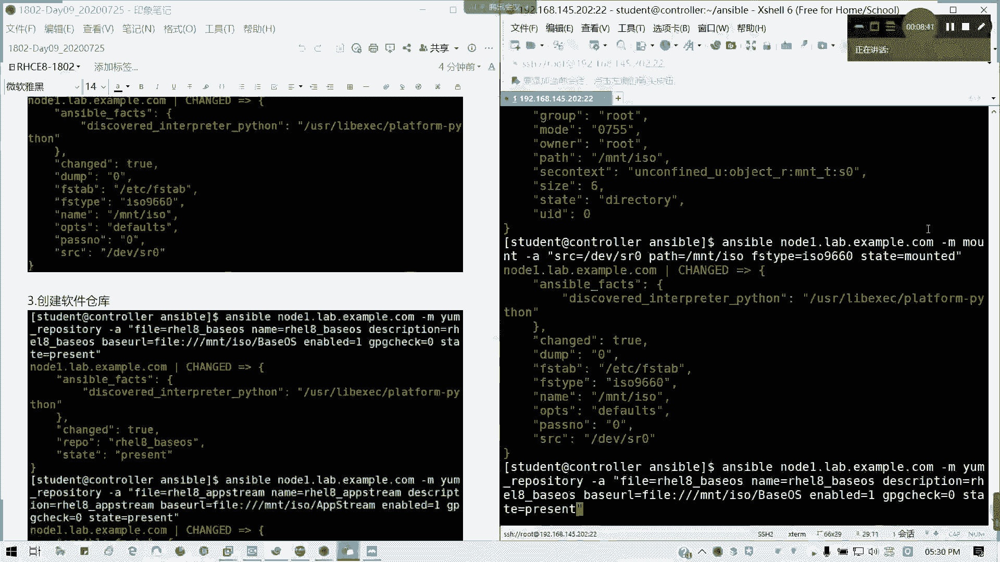

# 4. 创建 AppStream 仓库配置 (注意目录名大小写)
ansible node1.lab.example.com -m yum_repository -a "name=AppStream description='RHEL8 AppStream' baseurl=file:///mnt/iso/AppStream enabled=1 gpgcheck=0 state=present"
```

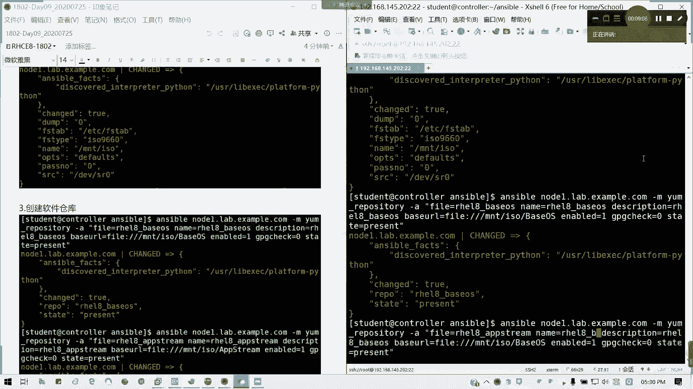

执行完成后，可以验证配置文件是否已成功创建。

```bash
# 验证配置文件内容
ansible node1.lab.example.com -m shell -a "cat /etc/yum.repos.d/BaseOS.repo"
ansible node1.lab.example.com -m shell -a "cat /etc/yum.repos.d/AppStream.repo"
```

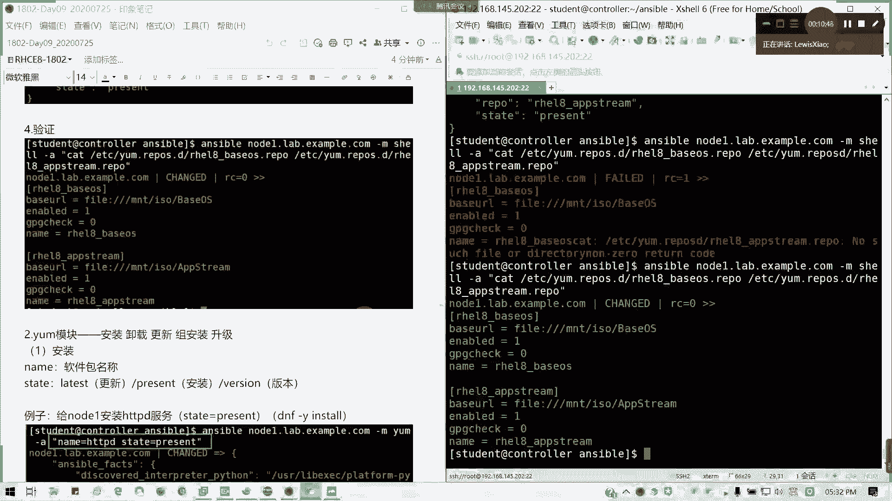

此外，也可以使用 Ansible 的 `yum` 模块来验证仓库列表，这是一种更规范的做法。

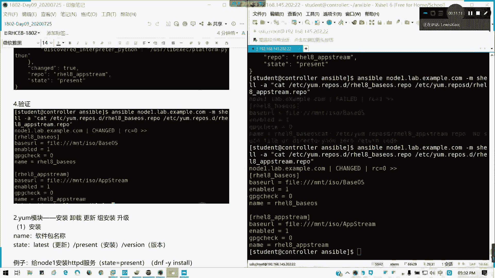

```bash
# 使用 yum 模块列出已启用的仓库
ansible node1.lab.example.com -m yum -a "list=repos"
```

---

## 📥 软件包管理模块 (`yum`)
配置好软件仓库后，我们就可以使用 `yum` 模块来管理软件包了。该模块可以用于安装、卸载、更新软件包以及进行组安装。

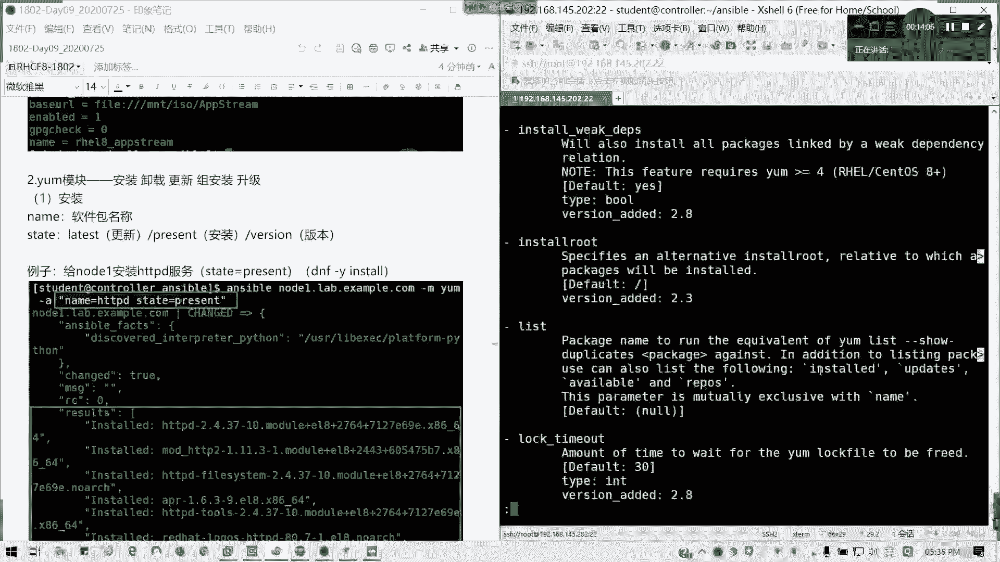

`yum` 模块的核心参数如下：
*   **`name`**: 指定软件包或软件包组的名称。
*   **`state`**: 指定操作状态，例如 `present`（安装）、`absent`（卸载）、`latest`（更新到最新）。

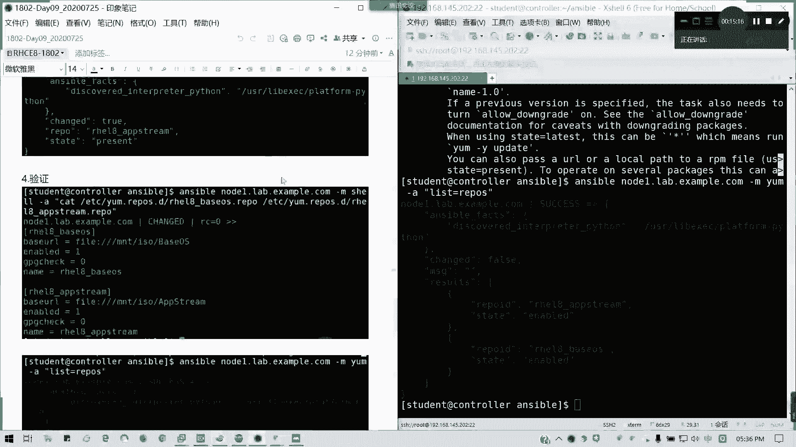

### 实践：在节点上进行软件包操作
我们继续在 `node1` 上演示 `yum` 模块的常见用法。

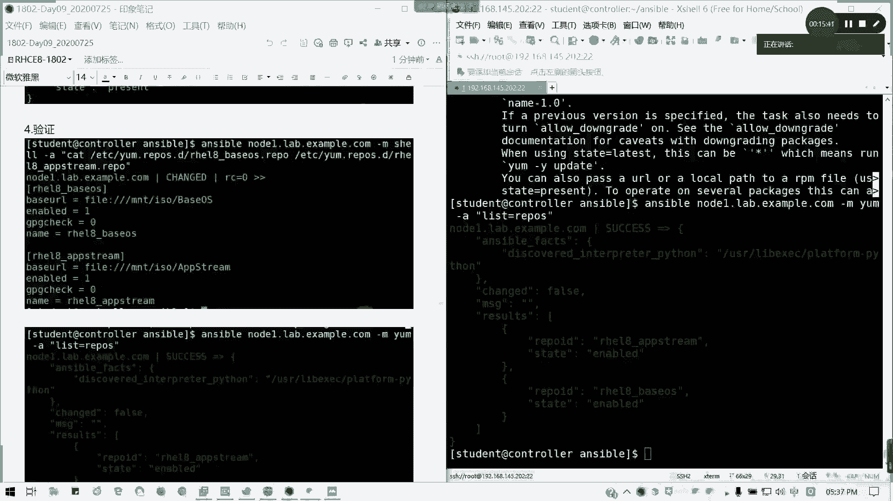

**1. 安装软件包**
安装 `httpd` 服务。

```bash
ansible node1.lab.example.com -m yum -a "name=httpd state=present"
```

**2. 卸载软件包**
卸载刚才安装的 `httpd` 服务。

```bash
ansible node1.lab.example.com -m yum -a "name=httpd state=absent"
```

**3. 组安装**
安装 `MariaDB` 数据库服务器及其所有相关组件。组名前面需要加 `@` 符号并用引号括起来。

```bash
ansible node1.lab.example.com -m yum -a "name='@mariadb' state=present"
```

**4. 更新所有软件包**
将所有已安装的 RPM 包更新到最新版本。可以使用通配符 `*`。

```bash
ansible node1.lab.example.com -m yum -a "name=* state=latest"
```

---

## 🧪 随堂练习
现在，请你在 `node2` 上重复上述步骤：
1.  配置本地软件仓库（`BaseOS` 和 `AppStream`）。
2.  尝试使用 `yum` 模块安装一个软件包（例如 `vim`）进行测试。

---

## 📝 总结
本节课中我们一起学习了 Ansible 中两个重要的系统管理模块：
1.  **`yum_repository` 模块**：用于自动化创建和管理 YUM/DNF 软件仓库配置文件，这是软件包管理的基础。
2.  **`yum` 模块**：用于执行软件包的安装 (`state=present`)、卸载 (`state=absent`)、组安装 (`name='@group'`) 和更新 (`state=latest`) 操作。

掌握这两个模块，你就能通过 Ansible 高效、批量地管理多台服务器的软件环境。请务必完成随堂练习以巩固所学知识。下一节课，我们将继续学习其他系统模块，并开始接触 Ansible Playbook 的编写。