# 拿下证书！Redhat红帽 RHCE8.0认证体系课程 RH124+RH134+RH294三门认证视频教程 - P57：57_Video_Day10_Day09回顾答疑 - 16688888 - BV1734y117vT

好的，那我们开始今天的课程，各位同学们，各位师弟师妹们，大家下午大早上好啊，大家早上好。然后呢，我是小苏师兄。今天呢真的面受空荡荡，没有一个人啊，因为很多人请假或怎么样，但是很理解啊。很理解，就是说。

工作还有各方面自己的私事等等啊。所以的话啊基本上我讲啊。我讲我的那个asible这一块呢，其实很比较重要啊比较重要。S5这比较重要啊。因为在自动化运维里面呢，我们通常就是可以取代我们人肉运维。然后呢。

昨天我发现很多啊。很多人不熟的啊很多人不熟的，懂吗？包括刚才李东阳在问我的那个问题。其实这个不羞耻啊不羞耻啊。他说切配置文件很正常，为什么？因为你在工作目录上优先是最高的，我把那个图再放出来。

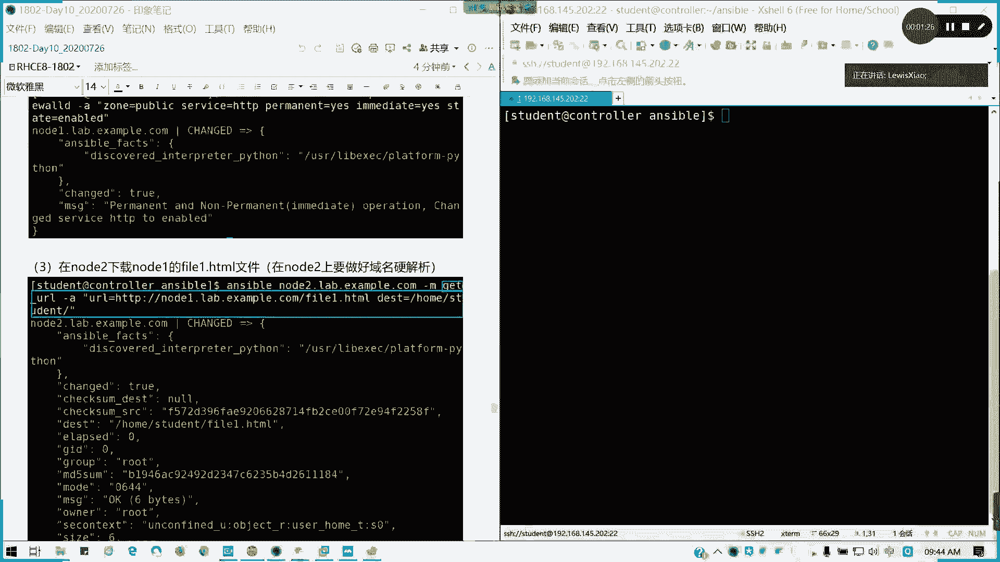

对吧优先级哪个哪个是最高的，要搞清楚啊，你多然应该现在还现在应该在听了哈。我们那个优先级哈优先级我们默认是有一个answerible点CFG的一个配置文件，默认是answer点CFG的配置文件。呃。

CFG备注文件呢，它是一般来说不可能没有我装好S5之后，肯定有一个。可就是在ETCanswible目录下面的answerible点CFG这是就是说你。默认情况下它就采用这个配置啊。

默认情况下它采用这配置。如它它生效是全局啊，生效是全局。生效是全局生效啊，基本的。然后我还有优先级更高的两个啊，类级更高的两个，一个是点sible点CFG在我们的工作目录下面。

在我们用户的工作目录不一定是root啊，在我们用户的主目录里面，也就是我们工作目录啊，加目录里面，如果有这个点sible点CFG这个隐这个原件是隐藏的。因为前面这样一个点。然后呢，有这个文件的情况下。

我会优先采用用这它这个配置。也就是说它的生效范围仅在当前用户登录下生效。呃，不是选举。然后还有一一个优先级更高，但是它作用范围更小的就是在一个指定的工作目录。

指定的工作目录里面点ansible也没有没有点了啊，ansible点CFG啊，比如说我刚我在这里我的工作目录是home student用户下面的ansible。

那它的那个作用范围呢仅在当前的工作目录下生效。但是它优先级最高啊，根据我们啊具体生产生活啊，我们且不说考试啊，就说那个具体的生产生活情况也好。都是最小范围为最佳，因为影响的是最小的。

你可以在此范围内定义自己的资产清单，执行我们ansible的一个配置，对吧？而你其他的一些。其他的你如果在其他目录上，你可以部署其他其他的S博项目，而且你不会啊受到任何的一个影响，懂我意思吗？

这个就是我先解答一下李东阳的问题，为什么要切换啊？呃，根据考试的经验，很多人在这里翻的车，不少人这里翻着车，懂我意思吗？

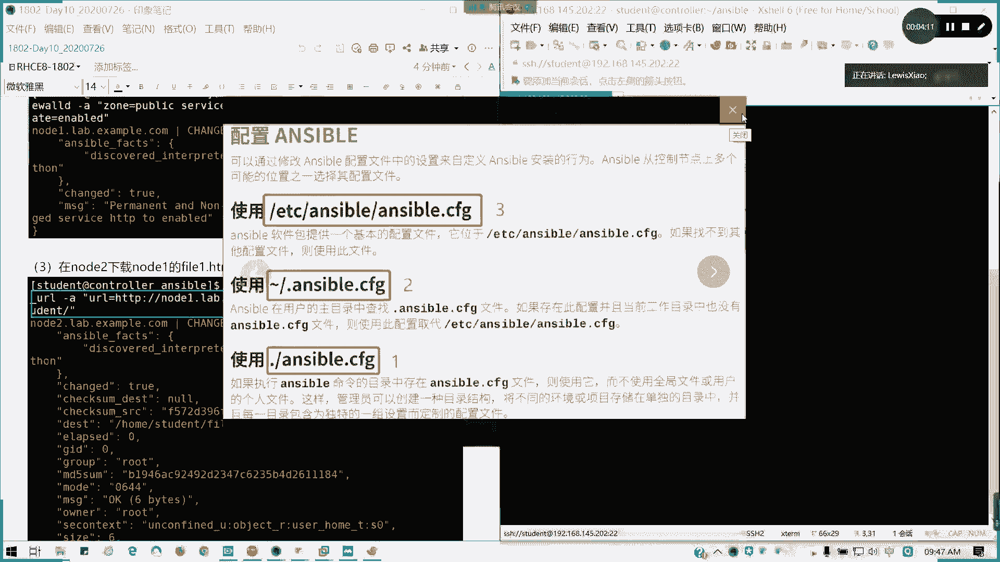

所以先看清楚这些工作目目录，不要说呃从他的一些考试说明，我包括你的那个做题的时候，你的说明都在都有跟你说这个事儿啊，论说这个事儿。如果真的不知道。哎，麻烦点一点看一看，然后不要直接愣头心。

看到看我们后面看到练习题，看到题目，直接什么都不管，我就直接在录嘴干开干对吧？部署完哎，全部跑成功了，结果呢考试。没分数啊，没没多少分数啊，反正我知道是11分。懂我意思吧？明白的话，你自己扣个一给我啊。

好的，那我们。

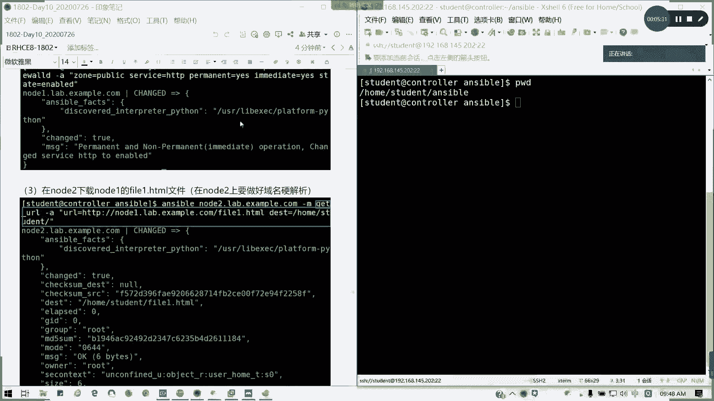

呃，这样子我们昨天我们讲到的那一个软件包，我们回大概回顾一下昨天讲的东西。呃，刚才我讲的一点呢，第一个anil基础基础基础架构，基础架构就是这个图。啊，李建明，你工作部没有的话。

你那个你工作部如果没有的话哦，没有SC区，你的工作部是在这里吗？你的工作目录在这里吗？这是个临时目录吧。你现在unerable version，你看一下嘛，对不对？ible杠杠分水。

你就看一下你的配置文件到底在哪里，然后你t到底在哪里。对吧。你这个你要知道啊，反正我进那一个目录，然后。你进到那个目录。你看一下就知道了，懂我意思吗？不要弄错啊不要弄错啊，千万不要弄错啊。

工作目录你一定要是绝对是OK的啊，绝对是OK的。不然的话呵你做到死的呢，就说我不会说考，就是说你的可你的生产环境肯定就跑不了脚本或者是会出错。如果嗯如果呢。如果你在考试的话啊，假设你就去参加考试的话。

那你也会真的是不知道这个分数丢在哪啊。但是我可以告诉你，你是明确的丢在那儿了。点S加目没有，那你的S杠 version，你现在用的是普通默认配置啊，李建明啊。你在督图用户上，你现在用的是默认配置文件啊。

还要要还要还要不要我贴那个图啊？自己设置啊，你自己touch一个，对不对？我昨天怎么写的？刘人怎么写的？手工创建手工创建啊，我以为你这文件是手工，你自动你它它自动帮你来呢？其实把书看一下。

更好理解是其实把笔记看一下也更好理解啊。我笔记我昨天有这个图的，我贴过来看一看，我先解答一下昨天大家遗留下来的问题。不要说今天真的是你昨天天天一头新的，哎啊，我会了111。

然后结果呢今天倒出来实验啥都不会啊。哎，终于有人来陪我了哈，来那对面这边。😊，对面这边，然后通过程序会连上来。因为那那那边课室的话，老师在在忙活啊。呃，我接的显示器了，所以没办法，你用腾讯会连上来吧。

特点麻烦。没有啊，不会啊，你可以用HDMI然后那个。接嘛一边看一边操作嘛，可以吗？优先我知道你昨天应该有事啊，你连事都没听。没听课，昨天的东西我现在回顾啊，我等你5分钟。

现在昨昨昨天我先解答一下别人问题，然后带我回顾一遍。没有，因为确实昨天翻车有点多啊，当我看我看了结果看配到政巡去。证书免密吧，你说的是免密认证吧。免费认的这个是需要的。看到那一段HHDMI在这里。

你看下那道线横着那些长长的线。对，就这。你接上去，你刚好把电视开了，就把电视开了，你就可以一边看一边投嘛，对吧？就把腾讯会议那边投过来，那不是很方便吗？

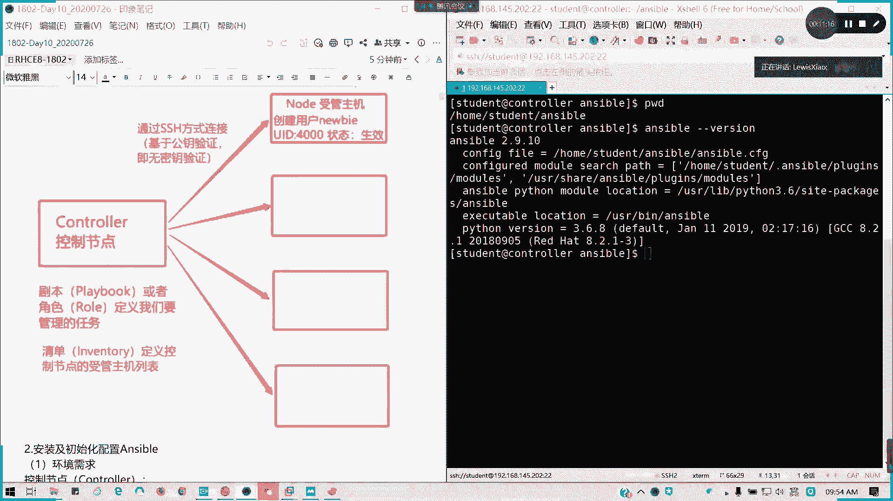

不用不用不用，你遥控直接点那个。

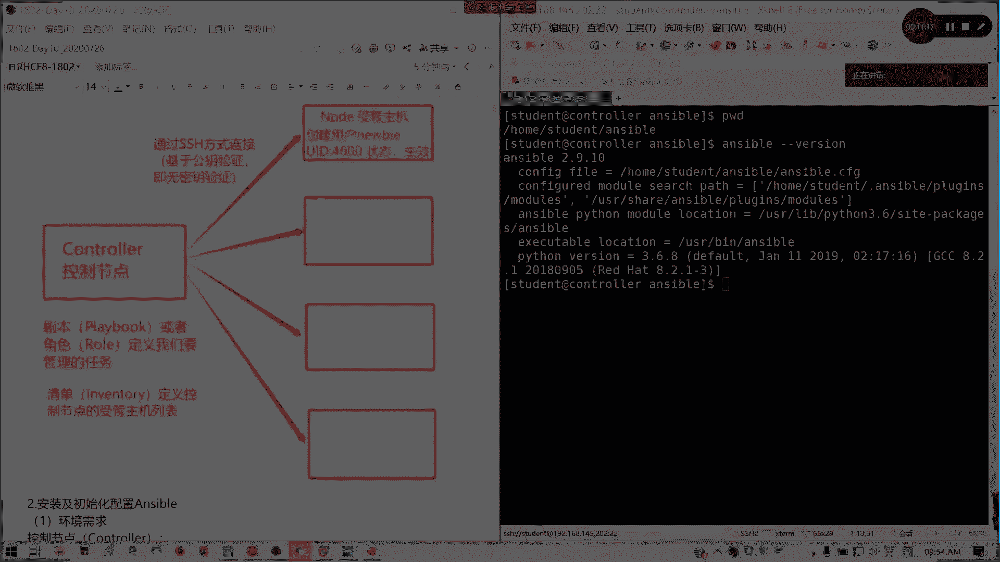

等一下都开了。我把这图贴过来啊。把图贴过来，优先级概述。你看你你把屏幕切到扩展。对你把屏幕切一下，应该就可以了。这优先级概述能理解吗？李建敏能理解吗？有了有了。你就你扩展嘛，不要复制嘛，扩展。

那你把那个腾讯会拉过来。然后对啊，把声就又搞过来了把声音关掉就可以了。你把扬声器关了就可以。好，这一块能理解吗？好呃，这一块的话我们来看一下。我们来看一下那个内容啊，我们来看一下我们的。对对对。

马娟娟没有错啊。除了这个默认的配置文件之外呢。对的啊，娟娟应该就对的。其他两个肯定自己要自己创建啊，不创建的话，你哪来配置软件，我我上天调给你啊，不可能的。好，还有其他问题吗？

我看看大家有没有其他问题啊。看到了是吧，就是这个吗？你要文件，他都说要存在的，你不存在，你哪来配置原件，我我上去调给你啊。好，陈启涛，我看一下你的问题，你这个service，你的清单。

你看看你的工作目录又有问题了吧。你的清单你的清单啊，你的工作目录，你又在你的家务干嘛呢？麻烦CDS我看一下好吗？你看这种就是翻吃翻太多了，你可以把屏幕拖过来，那这样会方便一点。就把他序换弄一下。对。

我看一下，我集现在集中时间解答大家问题，就着大家来提问题。我来看这个针对性会强一点。因为昨天很多确实是翻车的。对啊，翻了不少车，而且这个呢。我且不说那个考试啊，我看下啊。那我好死，我该讲。你的配置文件。

我看你怎么写。So was。service你这个组我看一下啊。你的你的配置文件inventor，你怎么写的？Home student as inventory。没写serv啊，什么意思？哎。😔。

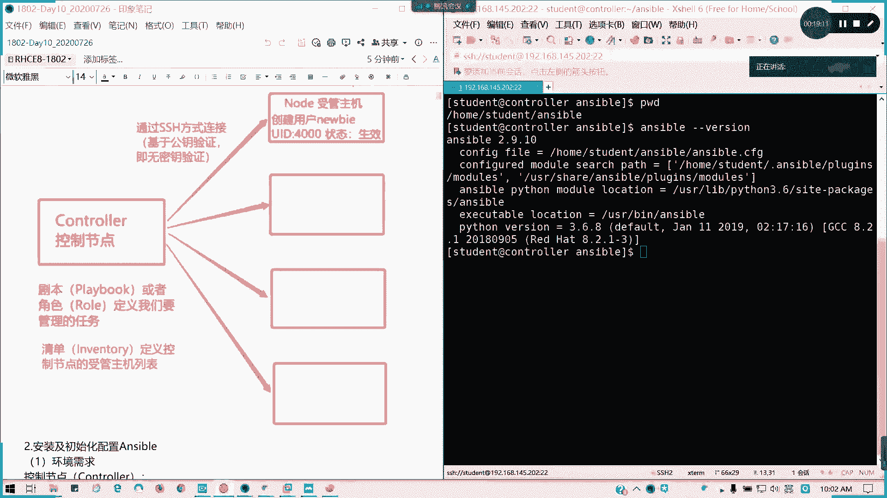

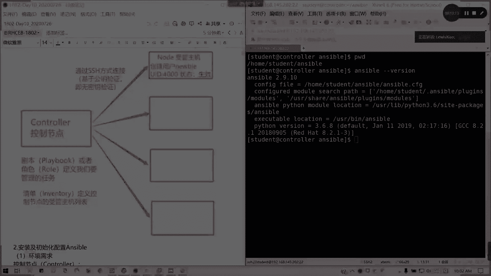

来了来了，你的那个问题我我发给你啊，我把这群我拉过来啊，拉过来。

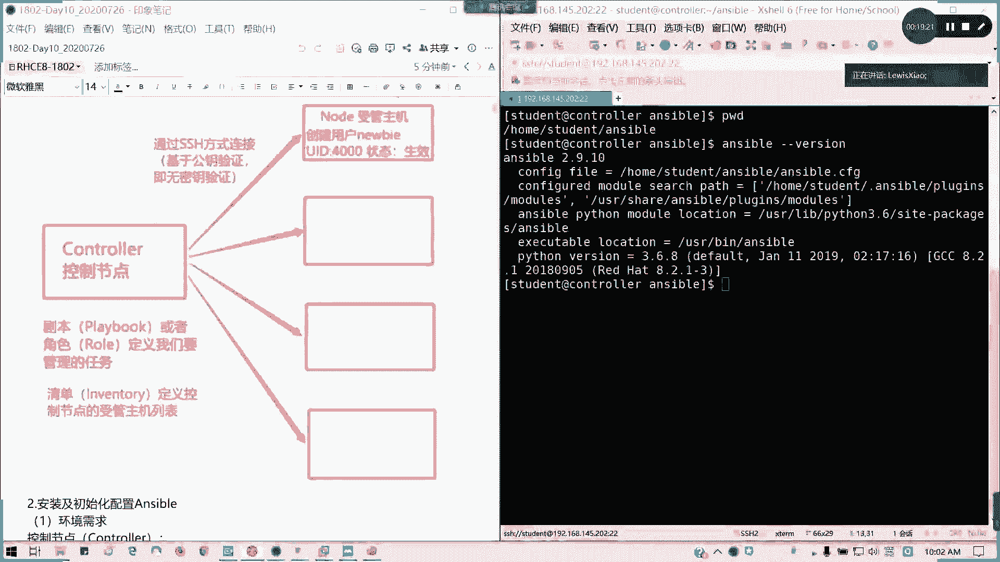

这是没有。你选择电脑音频之后呢，你把你你把那你把整个关掉就可以了。你把整个你你选择电脑音频之后，你把那个关掉。就行了。就把那个你的电脑的那个音箱那个关掉就行了。你看我这边就可以。defat啊。

你的配置节又少了一个S啊，我不知道怎么鬼啊，对不对？😊，这些很多这些翻车的东西啊。很多这些翻册东西特别是注意啊，我现在留留到10点半时间，你一个个问题你们有做提。然后我再来讲复习内容。

不然的话没什么用啊。很多翻车的啊翻翻的都自己都不知道的。对吧忘了我看下。两个样员写在一个rap文件。两个样元写在一个repper文件，你就在后面接就可以了。就昨天我的命令，昨天那条样是吧？

昨天那个你在后面接就可以了。但但是我们在练习或者是生产环境或者是哪怕在考试环境里面建议写成两条，不会错。我把那个昨天的样本再给拿出来啊，你大家稍等一下。我作业要那个拿出来。

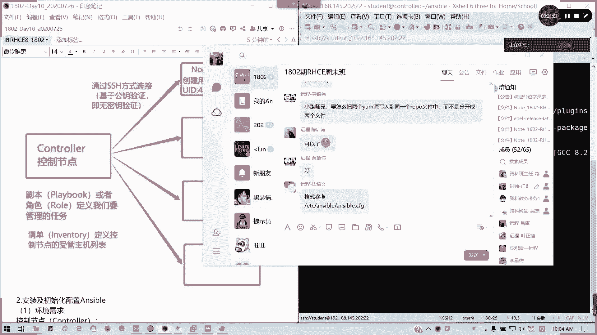

对啊，格式参考这个没有错啊，参反正他有私例文件了，你们怕什么呢？

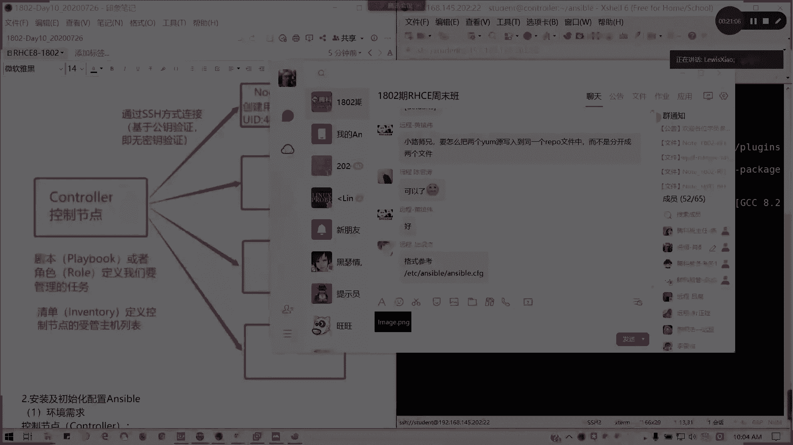

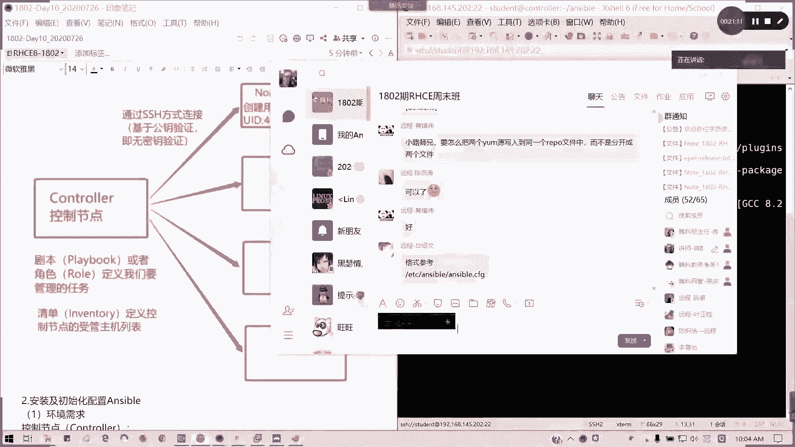

我把这个图我截一下啊。就我把这一段就把fire开始的这一段是吧？我第二个文件fire开始这一段我接在这里，我留个空格接在这里也可以。

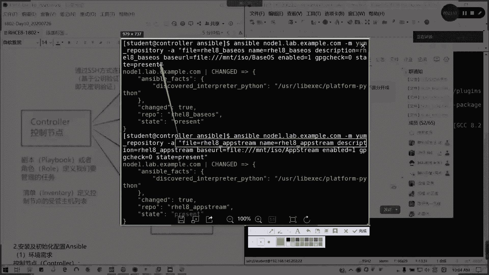

懂我意思吗？

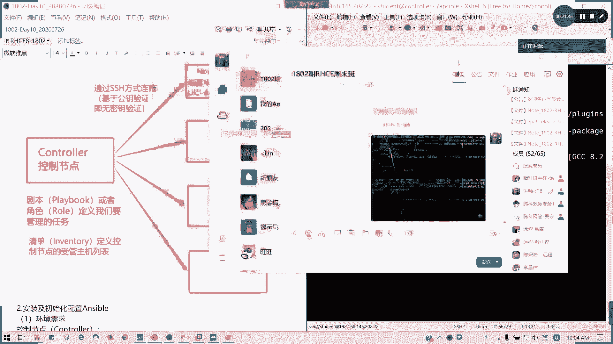

我把这里我接到我接到后面就fire，我我这里就是我杠A，你是你不是是你是不是要两就是两个配置段嘛，两个配置斜，那我把它接到后面就可以了，不用带引号直接过去就可以了。

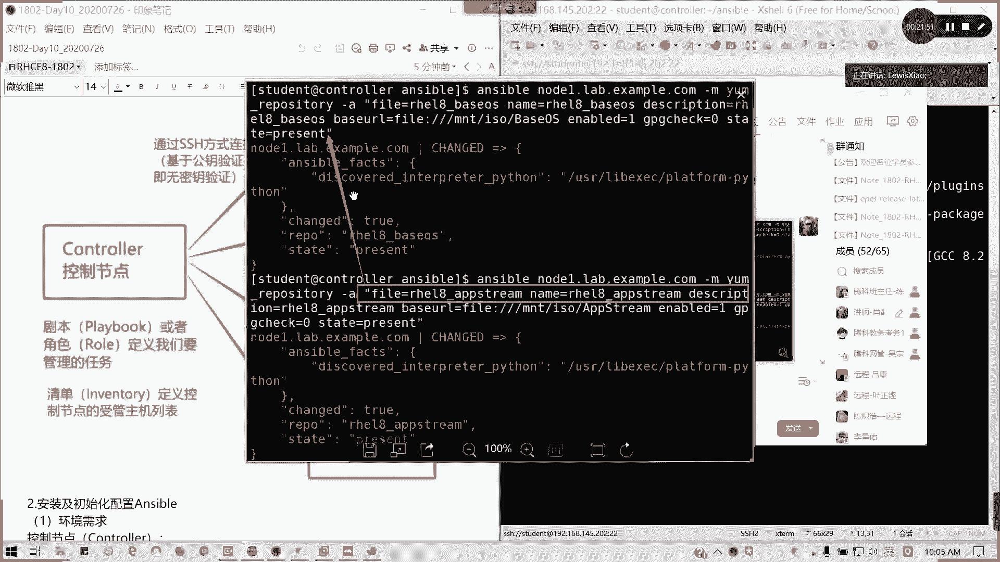

这就就可以把两个配置文件写在同一个，就两个样我们的样元的两个配置段写在同一个文件里面，这是可以的。

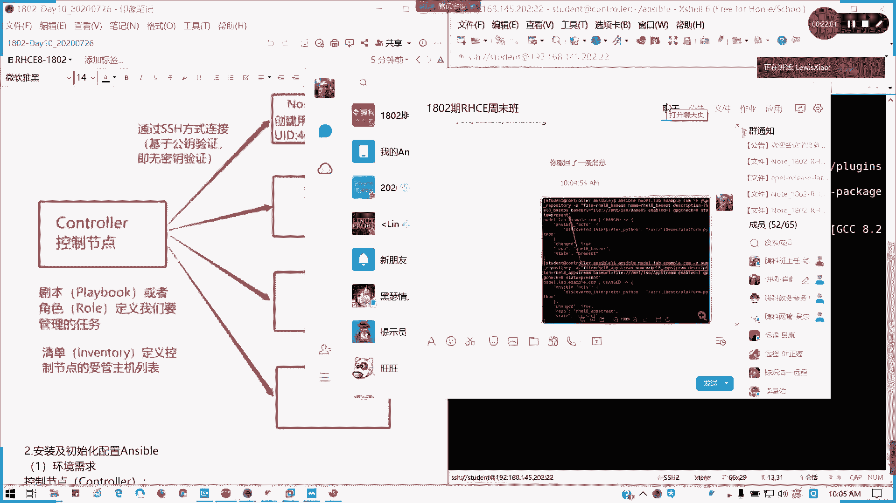

只果把那个fire你就去掉，把fire这个你不要，懂我意思吗？后面跟着就搞定了。

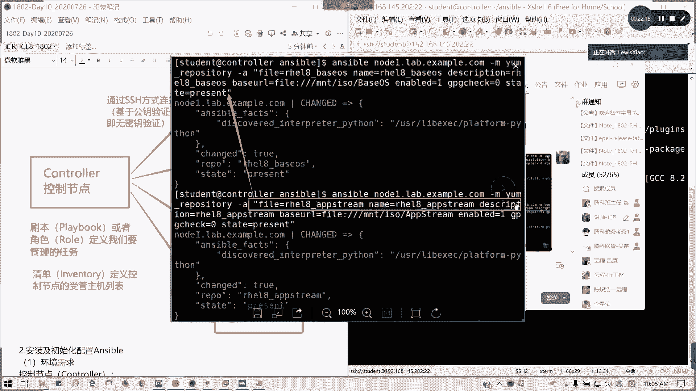

政伟知道吗？明白哈，还有其他问题吗？由今天我改由你们来提，不然的话真的不知道啊。有问题就样提啊。还有其他问题吗？尽管停。不怕你们来啊，这些基本的东西现在还没讲到和还没讲到另外一个核心叫做变量事实。

有问题吗？可以提。真没有。😊，そだま。继续提啊继续提，我看你们有什么问题，你们现在实验各种翻车，我可我可以救你们哈。在考如果在。说不好听，在考试那就惨了。不明白作为免密突然失效的问题。

昨天你就搞个搜备第搜备第一句了啊。还有其他人吗？我觉我今觉得应该今天我看一下今天听课的只有328个人，28个人估计有28个不同的问题，我相信啊。不是啊，这是创建学习区谁谁以取个名的那没问题啊。呃。

还有其他什么问题吗？有问没有问题的，请扣个Y，没确定没有问题的，请扣个Y。有问题你继续提问。这个题目有什么问题，我还没讲，有什么问题请说。创建一包含一下内容。这个我们用copy可以吗？为什么不能创建呢？

你先创建一行内容再做符号链接啊，为什么不能创建呢？你符号链接不要搞反啊。不是在这个目录上面创建的，不是在这个目录创建，是这个目录上面创建。那符号链接你估计搞反了。所号链接ss跟pass这两个不要搞反。

他应该这样子华应该是反了。反的话，你就反向链接，那就不对了。我要把它链子做应该source，我们源头是de off，对吧？我们source是应该是deve off。然后呢。

pass是才是VRWHTML那一个。这个才是对的。哎。怎么样哦，我把快件取掉啊，不然的话它会转移啊。这个才是对的。对啊，如果反过来就是就就正反了。所以这个问题啊这个问题很多人搞错了。

就到底我的快照是哪哪到哪的不是我的不是快照啊，我的软链接，我的硬链接到底是哪个到哪个，哪个是源头，要搞清楚。还有其他问题吗？反了。明显就反了。对吧明显就反了。fs不用加，你换过来就行了。

就他的那个sourcece跟pass的两个路径调换位置就对了。还有其他问题吗？继续提。包练习我不会全我不会讲，但是。我们可以啊针对你们提列列出问题，我一个个解答。这样的话我觉得你们效率会高一点。

然后待会我再通篇复习一下昨天的内容，那这最好不过了。因为昨天我们讲到了哪个地方讲到了我们的临时命令，讲了两两个大模块，一个是文件模块，一个是软件包模块啊。

今天我们还有那个系统模块以及我们的网络文件模块以及prebook以及变量事实。我们今天要讲的内容。今天是讲到5点钟的。还有其他问题吗？没有问题的各位请扣Y，有问题继续提问。没问题，请扣歪。

有问题请继续提问，真的不要说留着问题留到最后，然后。然然后真的什么都不懂，那就真的很吃亏了。然后有没有问题你们做过才知道，对不对？不做题，真的我不知道怎么说。你这里你可以放全屏都没问题。

你放全屏应该应该也可以。对啊，你这你这个同学你放全屏都。哦。不，你把旁边你可以去掉嘛，旁边你这接着你不用看了嘛？对吧你把它对，点一个箭头。对啊，这样会好一点。真的都没有问题吗？那好。

我这边我回顾一下昨天的知识啊，不浪费时间。先回顾昨天知识，然后我们休息一下啊，昨天主要是sible基础架构，ensible基础架构呢看到没有？这个图意图搞定所有，你只要理解那个图就搞定了，懂我意思吗？

一个指挥部。我要命令我下面的受贿人主席，也就是我的士兵是吧？发号司令指哪打哪，我要你干嘛，你要干嘛。那好，我们之间是不是要建立一个关系，对吧？建立一个信任关系，那就通过勉密认证的一个形式，懂我意思吗？

免密认证，我们就可以达到这个目的，免密认证，这是第一个第二个，我们的我怎么去发号司令，那我们要通过剧本或者是角色剧本昨天解释过，我们演戏是每个人有一个剧本，对不对？有一个台本。

里面写明你要演的怎么你要你的神情神态，你的台词，你的角色到底是什么，对不对？然后每个人他是分工怎么样，都有写，对不对？那ensible其实他也是利用这样一个类似的一个原理，对吧？这个原理，然后发号施令。

然后确保达到他的一个目标态。对吧所以他到目标态，然后你的这些授款主题哪里来，我们的资产清单，对吧？资产清单可以定义，对不对？懂吧？所以这个图你能理解，那我们S不就好学了，如果不理解，那没办法啊。

其实我们昨天的一个过程呢，我们第一章的一过程其实就是把这个框架当好，懂我意思吧？然后呢，环境配置需求，我们为什么不用那个练习环键？因为用练习环键的话根本不用装，对吧？都对啊，都有啦。

但是我因为考第一个考虑到大家的一个实际，我想教大家如何去自己去部署，这是第一个。第二个。第二个就是我们的有些配置啊。有些配置大家达到要求啊。有些配置达不到要求，懂吗？达不到要求。

所以所以的话我们采用最小化的就是两台考试。如果是我们的去报名考试的话，考试我听说是5台机器。啊，5台机器懂我意思吗？好，然后呢。我们手段要装其实很简单，因为主要是我们挂我们挂一个样源就可以了，对不对？

我们本地样员要装，因为他们那个拍审的那个关联组件在里面。然后我们现在的最新版本stoOS已经到2。9。112。911。然后我们的那个。然后刚才有人问啊。

刚才有考务老师有那个在刚好在插插我插插队在问那个配置的问题。我这个我记得我在第一个班的时候已经说过了啊。对吧我在第一节课是不是听已经说过了？我要求什么配置，我有讲。

然后python呢我们主要主要它的在7跟8的一个区别，就是它的python版本。7的话是2。7。58，现在是3。6。8。可能你在那个8。2的版本可能更新，对不对？8。0采用3。6。8足够了。

我们考我们的在练习环境里面是2。8，其实差不多啊，所以我教大家怎么安装是吧？这里的话安装知道吧？用其实它不在我们的标准包里面，不在我们的仓库里面。

它叫一个叫叫做extra package forentterpriselinux啊，linux的企验linux的一个叫做扩展包。我会做吗？好，然后呢安装跟验证清楚吧。

安装跟如何验证anible杠杠function我们用起来对不对？就可以了。然后呢，初始化配置，我们初始化配置要注意两个东西，一个叫做资产清单，也就是我们的主机列表。主机列表呢。要不单条记录是吧。

单条记录。然后呢，要步就是我们的分组，对不对？可以分组，对不对？可以范围用括号简化范围，可以我分组里面再创一个大组，对吧？大组扩小组，然后记得这里有一个。冒号秋人，对不对？大祖啊，就他的儿子，对不对？

然后呢呃我想想，然后分组如果你在本地实习环境呢，我可以用运解析。来做可以吗？并解析。好，然后记得我们做完之后，我们要如何连接呢？免密认证。公司要免密认证，对不对？免密认证，这不是必做的。

当然我们如果在考试或者是我们模拟练习里面，他会有说明，某个用户已经做好了针对虚拟机里面用户吗哪些指定用户的免密认证。那这步是不需要做的但是我们平时在自己部署环境的时候，必须。对吧你要建立好一个信任关系。

而不是你在运行，就是说输入密码，那不是它效率太低了吗，对吧？然后验证知道了啊，验证之道我就不再讲。好，刚才讲的配置文件，大家问题最多在这里，是不是到底我应该用哪个配置文件，直接告诉他最好是用优先级最高。

也是而且影响范围最小的，懂我意思吧？影响范围最小的就是我们的工作目录。我们在工作目录里面。他他在创建的话，它优先率最高，对吧？但是你每次你在controller的时候，你麻烦你切到你的工作幕下面。

然后如果你不确定，你就学我的。对吧所以呢就那个我们优先级配置高配置最高的，我们是推荐使用。而且考核如果是我们到考试的话，我去询问过学员，他是有这么要求啊，因为我不能过多说考试的事情啊，然后呢。记得啊。

先验一下是吧？如果我的默认啥都没有，我就用默认配置文件。然后我再加我在某个用户用户的工作部，也就是我们加户有的话，那他的生效会员数就就是他的用户啊，注意他是前面有带个点的。如果是工作目录。

那直接用工作簿的最高，对不对？然后呢，优先级概述刚才说了，然后配置文件示例啊，大家如果不会写，请看一下默认的配置文件。some basic啊，我看我再给大家看一下好不好？less一下。

这里啊some basic volumes啊，你们这里其实你可以直接拷贝的。懂吗？自己如果忘了配置项，直接拷贝过去，然后我们挑主要的就行了，挑主要就这么多，其实这两个都不需要，对吧？这两个我都不需要。

主要是这个我直接改哈，好吧。对吧。然后呢，这里的话我就改成。对吧home student目录具体到我们的练习或者考试的时候，他这跟用户是不同的，每个人都不一样。对吧。然后通常这里的话肯定不是root的。

对吧肯定不是root，我们就写这几行就行了。然后后面下面我们加一个提全。对吧。PVH ecalation这一大段知道怎么写不？要不然我再把把图宽贴过来。privilege escalation。

这里建议用速度好吧。不要说你你可note一用速度note2用SU那不是乱七八糟吗？对不对？而且SU这个方法其实不太好，为什么？你这样你把它把把把把你的那个普通用的权限无限放大，懂我意思吗？

我们所以我们在可控范围内呢，我们还是需要说那个把我们的熟度就可以了啊，我们用这个图贴过来。好，这一张我们就回顾到这里。这一张第一章内容如果没问题，请回一。数字一啊。这张往往是翻车最多的一个地方，一就。

一句话是什么来着？一招失足啊一招错误啊，弄错，满盘皆输啊，对吧？你的架你的架构都不理解，那架构你都弄错了，那我没办法喽。SU为什么出问题呢？SU为什么出问题，你的用户你不在will数里面呢？

在will组，那你那你这个注释做了没啊？

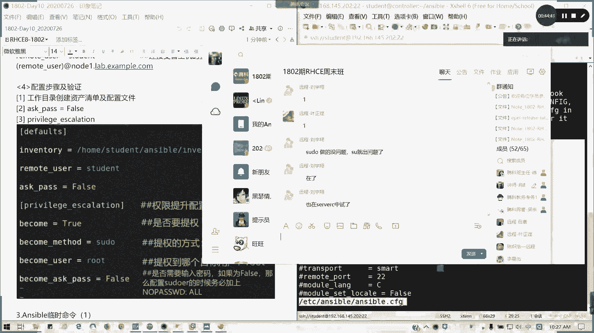

这个做对了吗？

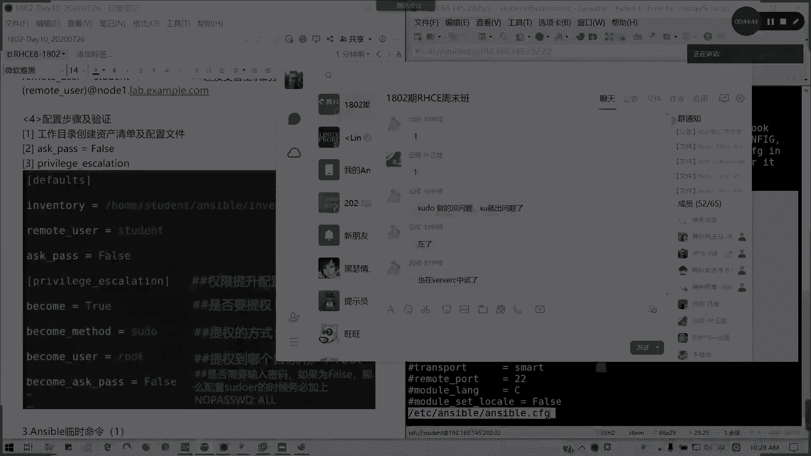

你SU这个做对了吗？这样考试两种方法都可以。

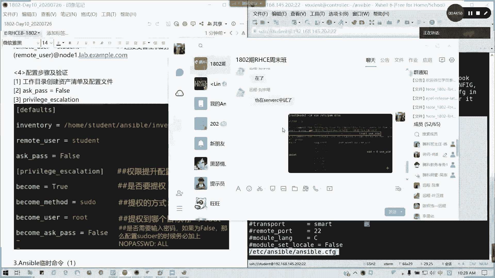

但是我建议大家用手度啊，用手度会更好。没事，我们用哪种方法顺手，用哪种方法？建议大家用熟度哈。好，这是第一章内容。第二章我们讲的第一步讲了前面的一一大半。首先，anible临时命令的格式，大家要知晓。

对不对？临时命令格式懂了吧？exible后面加资产清单里面定义的主机组或主机就是套我的作用欲在哪里？然后呢，后面我加杠M，后面带模块。如果是杠M需的话，你这个可以省略。对吧然后呢。调A。参数。

我的我的那个命我的模块里面什么参数啊，然后后面我可以自带资产清单配置文件。当然。啊，密等性大家应该知道啊，密等性刚才我已经讲过了，密等性。然后呢，我们sipible的在无论在练习，如果你不懂的话。

请推荐参考这个东西。前提你英文也要会啊，你要会看啊，懂我意思吗？Aner do非常好用的一个。不对吧。不会就dck一下啊，不会快你的啊。不会请dck一下。对吧它里面有它里面已经告诉你。

哪些模块能用哪些不能用，哪哪些模块是必备必须的对吧？等于的话就是必填项一横杠就选填项，懂我意思吗？网站的话，如果我们在上不了网环境环境的话，你这个就不能用了。除非你把整个网站下下来。但是我们得没必要。

首先S do看一看就知道了。那我们昨天昨天主要重点讲了文件模块里面的像copycopy，除了我们可以从我们的。控制主控制端复制文件到授管主机上之外呢，我们还可以直接在受管主机上生成内容。

就像我们昨天的那道练习题是吧？我要生成那个，我直接用copy就行了。然后只不过我的那一个。st我们换成content。就可以了。firere创建目录或文件啊，通常这里来设置文件属性，我们可以创建目录。

我们可以创建文件，关键空文件用touch啊，不是fire，你fire，你这个文件你要存在，懂吗？然后也我也可以拿来创建我的链接。对吧刚才讲了链接，你不要反了，sourcece是你的源头。

也就是你已经存在的文件目目文件公目录。然后你要创建软链接的话。你的pass你要写上一个你的软链接的。那个具体的位置在哪里啊？这是第二个fare。第三个falash反过来，我从售管主机拉文件到我们控制端。

对吧？如果默认的destination跟source的话，那我它就会在我们的目标端，我们控制主机这里我会新建一个目录，对吧？然后后面跟你的那一个绝对路径，就就你的绝对路径，这样目录目录下来。

如果就ft的话，就直接写文件。懂我意思吗？然后还有linening five，这个经常要用，就是比如说你的那个改某个文件，你要写具体内容，按按照行号啊，按行来具体来进行修改的话。

line five很很很实用啊，对吧？我们在生成一个文件，我们在写文件的时候，也可以用line five有没有问题，但是你要定位好你的插入你的我要修改的那个位置。

通过regular expression我们的正则表达式，对吧？这表达式来进行定位，然后用line来写修改后的内容。pass是我们的文远端文件路径，对不对？还有state，我们要写修改生效或失效。

这个默认是生效的啊。singleize文件同步，这跟其实跟我们的copy差不多。软件包模块重点yreository。软件仓库刚才有人问为什能不能两个携带起来可以。可以啊。

young repository是不是跟我们的rappper文件的那个有点类似啊？对吧或者我们可以叫做就跟央ng考fe manager其实里面默认配置是有点类似的对吧？好的，然后呢。这样直接安装对吧？

安装软件源样很简单的，懂吧？它有。呃，更新安装版本删除。记得吧？然后里面必要就是一个name软件包名称。如果这一块都明白的话，请打个2。

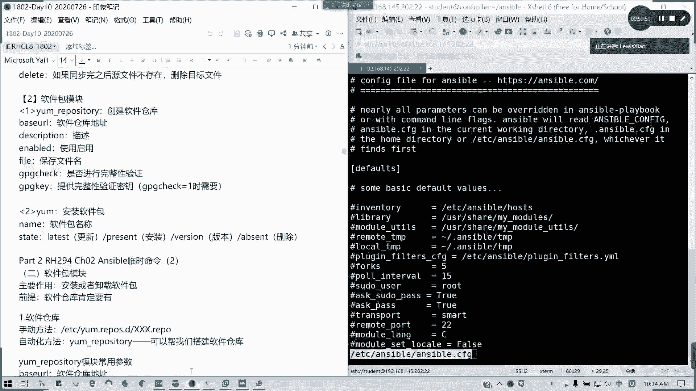

我们昨天是讲到的这里啊，我看一下马娟娟的问题。全局配置的文件，你也可以自定义。这一个文件你是可以自定义的。你只要你在anerible点CF区里面。inventory内行。就可以了，对吧？

我们这里是可以自定义的，不是说一定约定俗成，只不过我们是为了方便，为了好记是吧？懂我意思吧？马军娟OK吗？OK的话，请回个一。😊，然后其他人没有问题，请回啊。我们讲完的这一张纸前面的内容。

这文件不是死板的哈，除了answible点CFG是一定要这个命名之外其他的你随便啊，你的清单你可以自己要叫张三李四王五赵六，没问题，随便你命名，但是你要引用一定要正确。没事，你得感冒是吧？

不是我是出汗冷到了。没事没事。还好，我们这隔的比较远，还好。好的，那如果没问题，我们稍微休息15分钟，我们50分我们来讲剩下的。剩下的东西啊，我们软件帮博会已经讲过了，看一下创建样模要么的话。

我看一下你的uns parameters young theository，我看一下啊。你的F dream，你的那个baseRL就出问题了。这是第一个，然后你的GPG track你写的什么东西？诶。

我想知道你这个写的什么东西，陈志浩。有两个地方错了。这是什么东西来的？明白自己错在哪里吗？

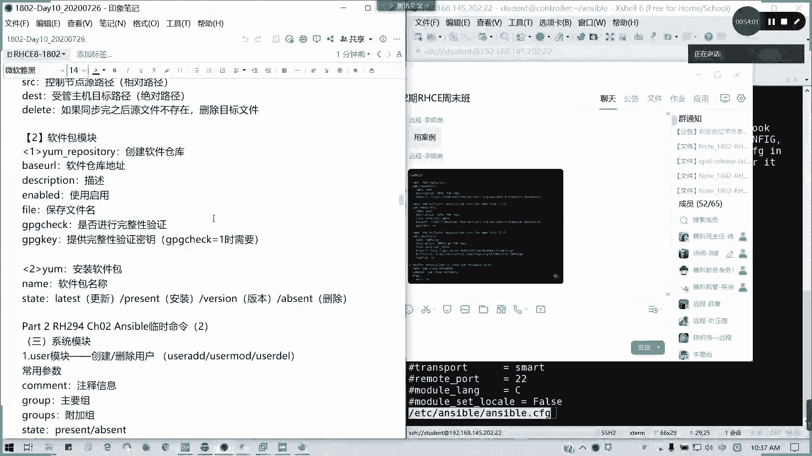

对啊，案例有，对不对？对吧它下面我们的那一个每一个ens dog杠V，是不是下面有example啊？

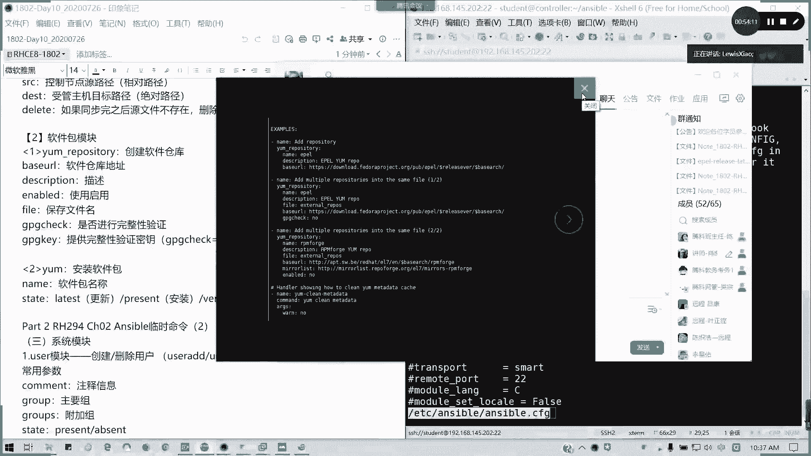

对吧。是不是有我们的example啊，看到没？有example的话，我们直接用案例就不会错了啊。对啊，手残党一大堆啊，我见过不少了。也就是归功自己不熟嘛，然后没问题的话，我们稍微休息15分钟啊，用案例。

这个是一个剧本。接下来我会教大家怎么写剧本啊。这是剧本的格式。但如果考试他要求写临时命令呢，你要会写。休息一下，稍后继续。

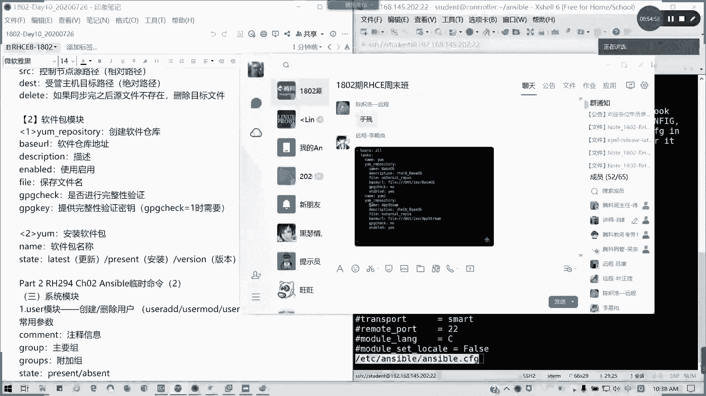