# Ansible自动化运维：第57讲：Day09回顾与答疑


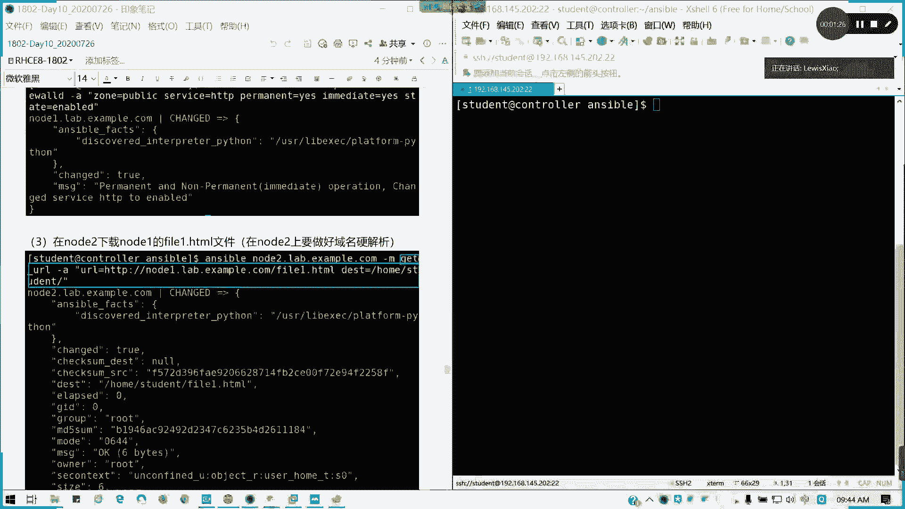

在本节课中，我们将回顾和解答关于Ansible基础架构、配置文件优先级、临时命令以及文件与软件包模块的常见问题。课程旨在帮助初学者巩固知识，确保后续学习顺利进行。

## 📚 课程概述

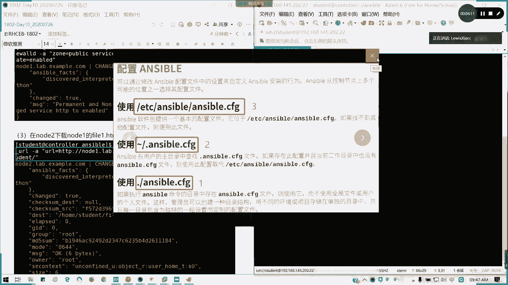

上一节我们介绍了Ansible的基础架构和核心概念。本节中，我们将回顾Day09的关键内容，并针对同学们在实验中遇到的问题进行集中解答，特别是配置文件优先级和常用模块的使用。

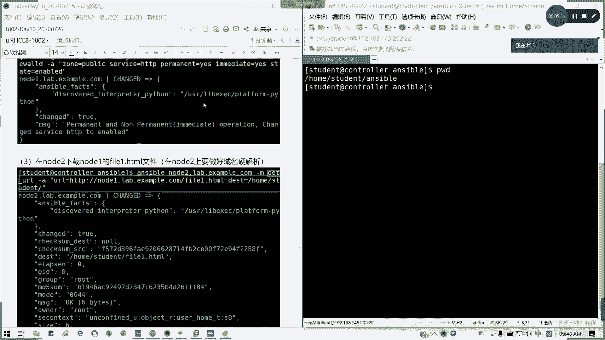

## 🔧 配置文件优先级详解

在Ansible中，配置文件的优先级决定了最终生效的配置。理解这一点对于正确设置工作环境至关重要。

以下是Ansible配置文件的优先级顺序，从高到低排列：

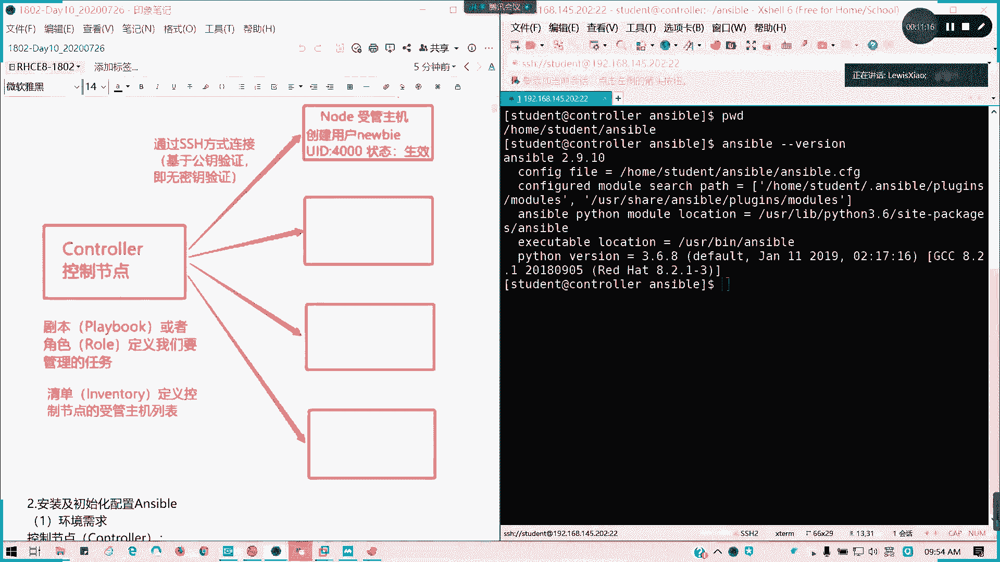

1.  **当前工作目录中的 `ansible.cfg` 文件**
    *   作用范围：仅在当前工作目录下生效。
    *   优先级：最高。
    *   说明：这是推荐的做法，影响范围最小，便于管理不同的Ansible项目。

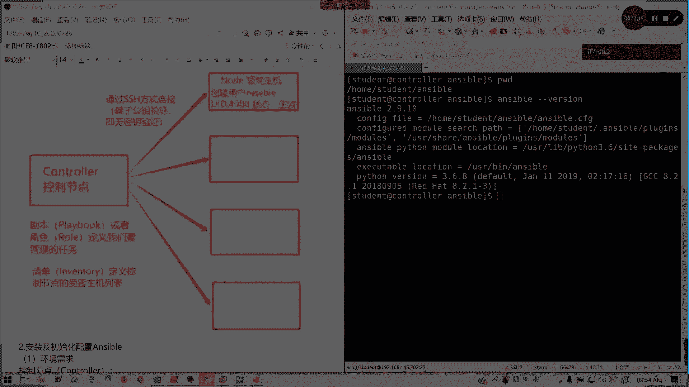

2.  **用户家目录中的 `.ansible.cfg` 文件**
    *   作用范围：对当前登录用户生效。
    *   优先级：次高。
    *   说明：文件名以点开头，是隐藏文件。

3.  **系统默认的 `/etc/ansible/ansible.cfg` 文件**
    *   作用范围：全局生效。
    *   优先级：最低。
    *   说明：安装Ansible后默认存在此文件。

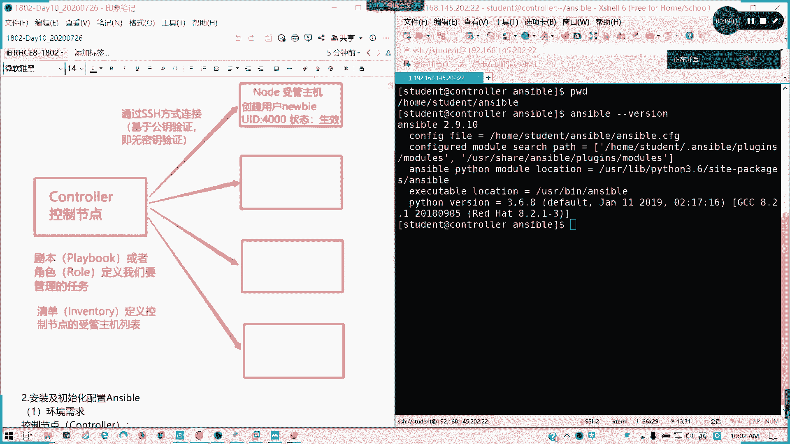

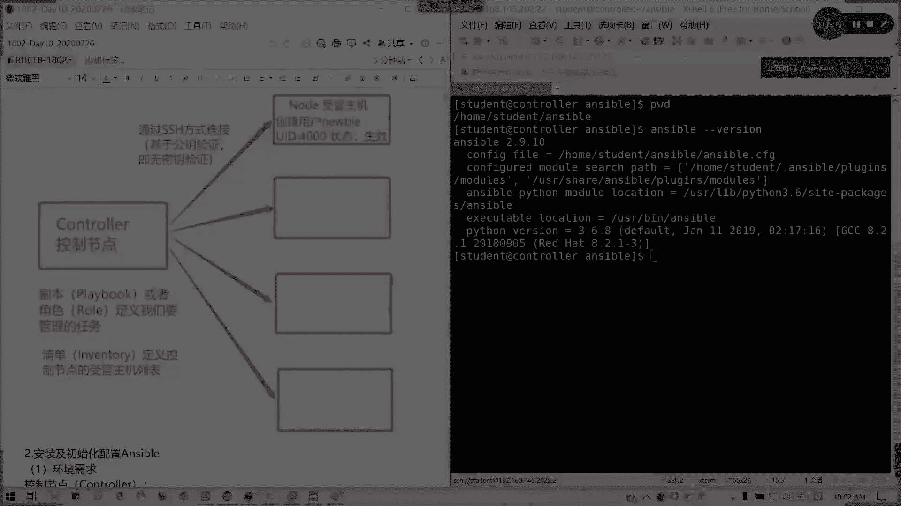

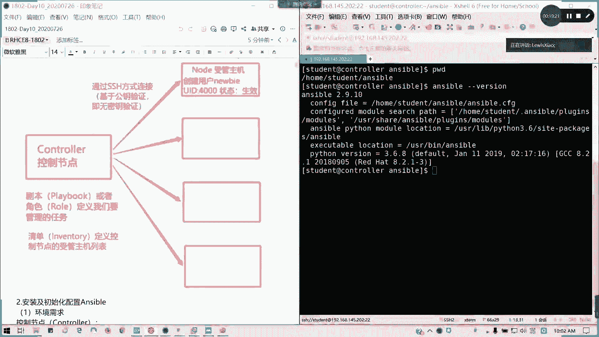

**核心建议**：在生产环境或考试中，建议使用优先级最高且影响范围最小的配置，即在**项目工作目录**中创建 `ansible.cfg` 文件。这可以确保配置的独立性，避免影响其他项目。

## 📝 配置文件示例与常见问题


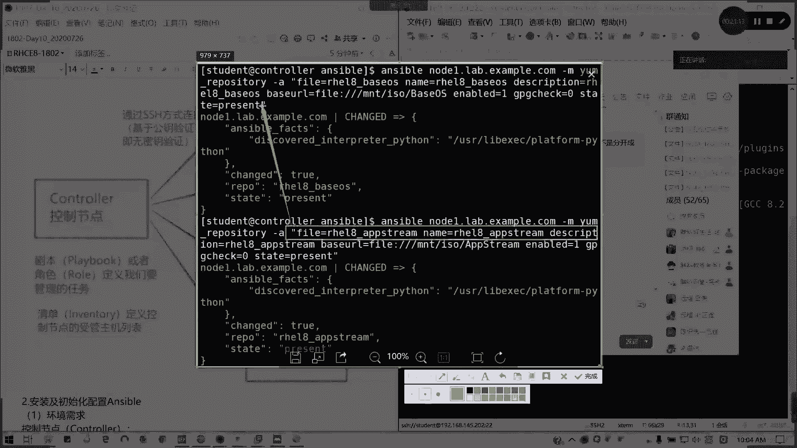

以下是一个基本的 `ansible.cfg` 配置文件示例，你可以根据需要进行修改：

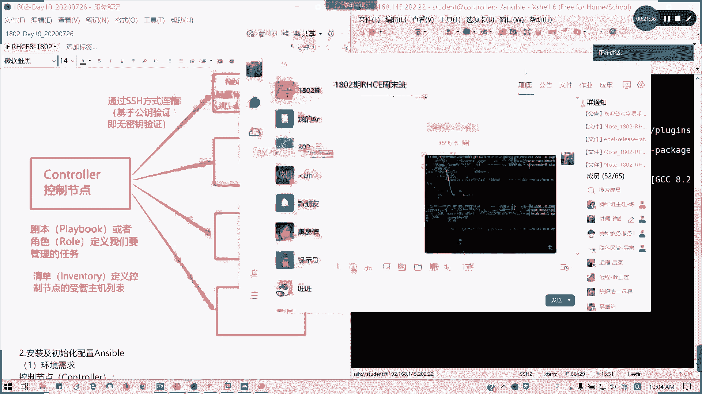

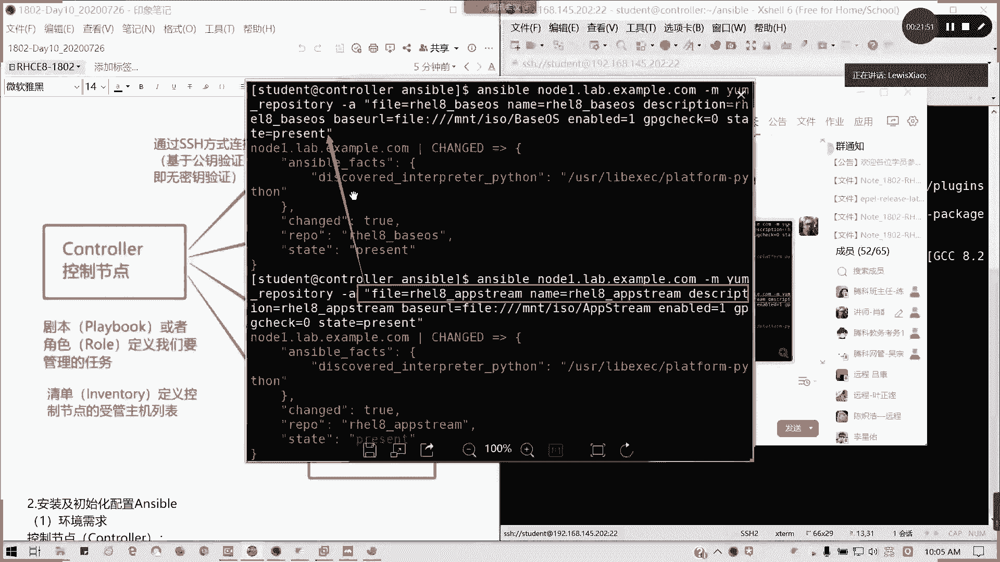

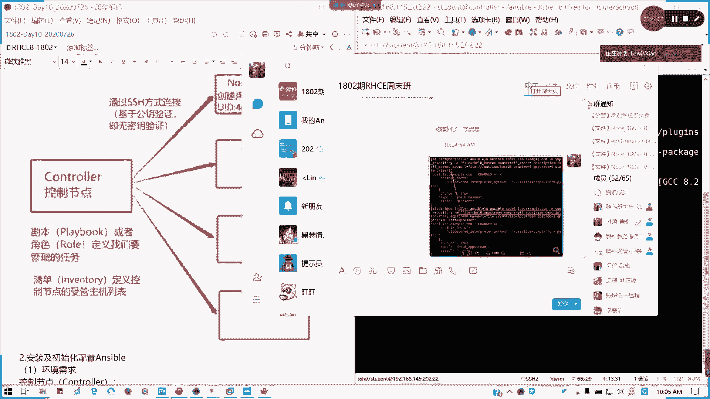

```ini
[defaults]
inventory = /home/student/ansible/inventory
remote_user = student

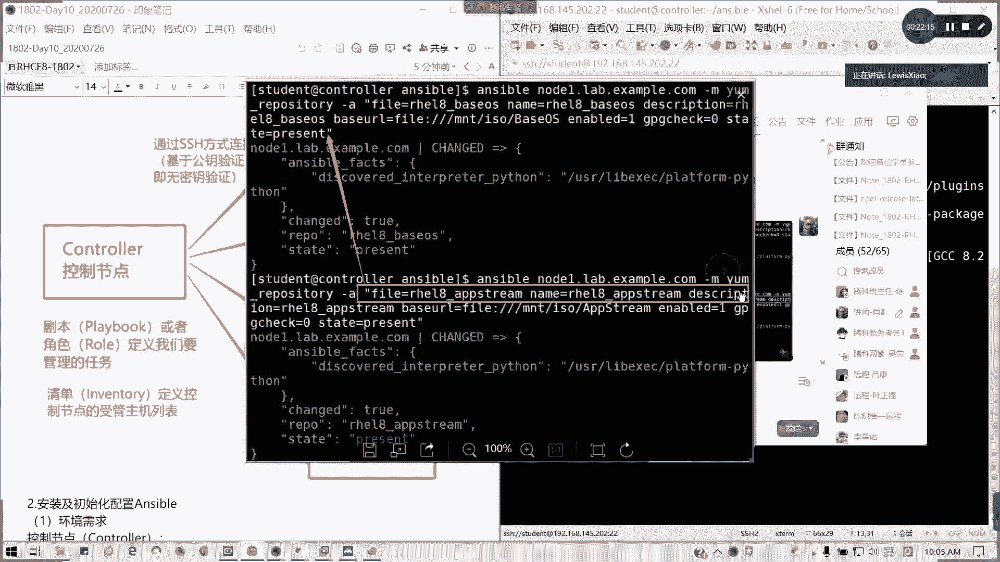

[privilege_escalation]
become = True
become_method = sudo
become_user = root
become_ask_pass = False
```

**常见问题解答**：
*   **问题**：工作目录下没有 `ansible.cfg` 文件怎么办？
    *   **解答**：该文件不会自动生成，需要手动创建。可以使用 `touch ansible.cfg` 命令创建，然后编辑其内容。
*   **问题**：如何验证当前使用的配置文件？
    *   **解答**：运行 `ansible --version` 命令，输出结果中会显示当前加载的配置文件路径。
*   **问题**：`become_method` 用 `sudo` 还是 `su`？
    *   **解答**：推荐使用 `sudo`。使用 `su` 可能需要确保执行用户在 `wheel` 组中，而 `sudo` 是更通用和可控的权限提升方式。

## ⚙️ Ansible临时命令与模块回顾

上一节我们介绍了Ansible临时命令的基本格式和两个重要模块：文件模块和软件包模块。本节我们来回顾关键点。

### 临时命令格式

一个典型的Ansible临时命令格式如下：
```bash
ansible [主机或组] -m [模块名] -a “[模块参数]”
```
*   `[主机或组]`：来自资产清单（inventory）中定义的主机或主机组。
*   `-m [模块名]`：指定要使用的Ansible模块。如果使用 `command` 或 `shell` 模块，`-m` 可以省略。
*   `-a “[模块参数]”`：传递给模块的参数。

### 文件模块关键点

以下是文件模块中几个常用功能的要点：

*   **`copy` 模块**：
    *   不仅可以将文件从控制节点复制到受管主机，还可以直接在受管主机上生成文件内容。
    *   使用 `content` 参数直接定义文件内容。
    *   **公式**：`ansible all -m copy -a “dest=/path/to/file content=‘Hello World’”`

*   **`file` 模块**：
    *   用于创建文件、目录或链接。
    *   创建空文件：`state=touch`
    *   创建目录：`state=directory`
    *   **创建软链接**：这是一个易错点。务必分清 `src`（源，已存在的文件/目录）和 `dest`（目标，链接文件的路径）。
        *   **正确示例**：`ansible all -m file -a “src=/etc/foo.conf dest=/var/www/html/foo.conf state=link”`

*   **`fetch` 模块**：
    *   将文件从受管主机拉取到控制节点。
    *   默认会在控制节点上创建一个以主机名命名的目录来存放文件。

*   **`lineinfile` 模块**：
    *   非常适合基于行号或正则表达式来修改文件的特定行。
    *   常用参数：`path`（文件路径）， `regexp`（用于定位的正则表达式）， `line`（要插入或替换的内容）。

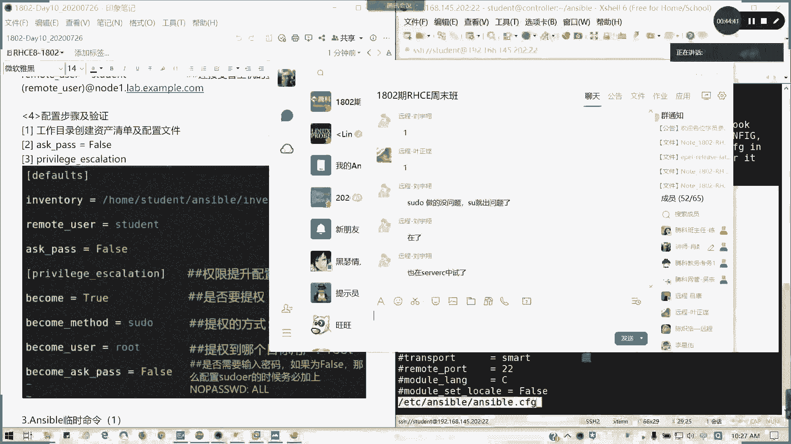


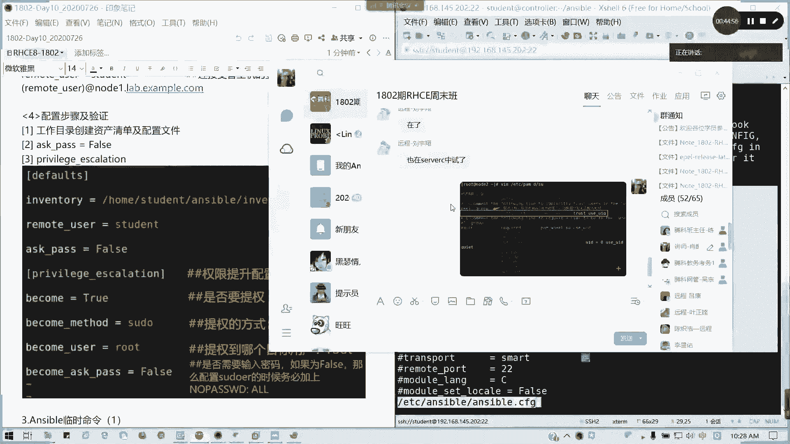

### 软件包模块关键点

以下是软件包模块（`yum`）的要点：

*   **`yum_repository` 模块**：
    *   用于配置YUM仓库。
    *   可以在一行命令内配置多个仓库，但建议在练习或考试中为每个仓库使用独立的命令或任务，更清晰且不易出错。
    *   **代码示例**（配置两个仓库）：
        ```bash
        ansible all -m yum_repository -a “name=AppStream description=‘AppStream’ baseurl=file:///media/AppStream gpgcheck=no”
        ansible all -m yum_repository -a “name=BaseOS description=‘BaseOS’ baseurl=file:///media/BaseOS gpgcheck=no”
        ```

*   **`yum` 模块**：
    *   用于安装、更新、移除软件包。
    *   核心参数：`name`（指定软件包名）， `state`（`present`安装，`latest`更新，`absent`移除）。

## 💡 学习建议与总结

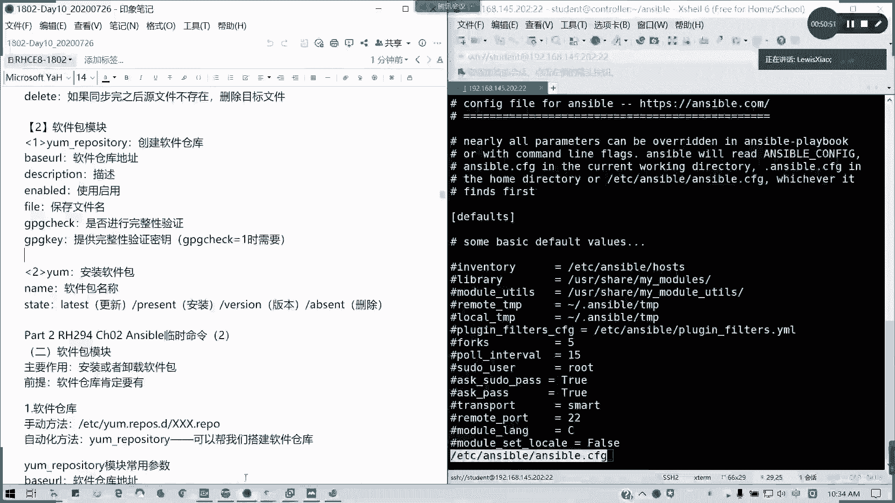

本节课中我们一起回顾了Ansible的核心基础。以下是给初学者的几点建议：

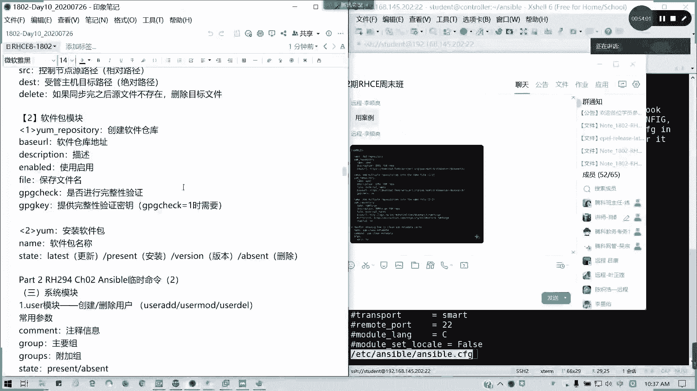

1.  **理解架构图**：将Ansible视为“指挥部-士兵”的模型，理解控制节点、受管主机、资产清单和剧本之间的关系。
2.  **善用文档**：遇到不熟悉的模块，第一时间使用 `ansible-doc [模块名]` 查看官方文档和示例。
3.  **注意细节**：配置文件路径、软链接的源和目标、参数拼写等细节往往是实验失败的主要原因。
4.  **先验证后操作**：在执行命令前，使用 `ansible --version` 确认环境，使用 `--check` 或 `-C` 参数进行模拟运行（dry-run）。

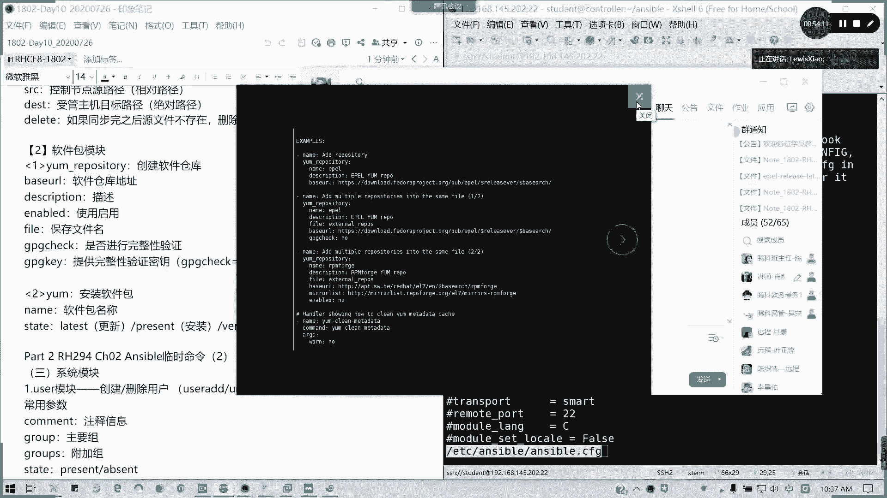

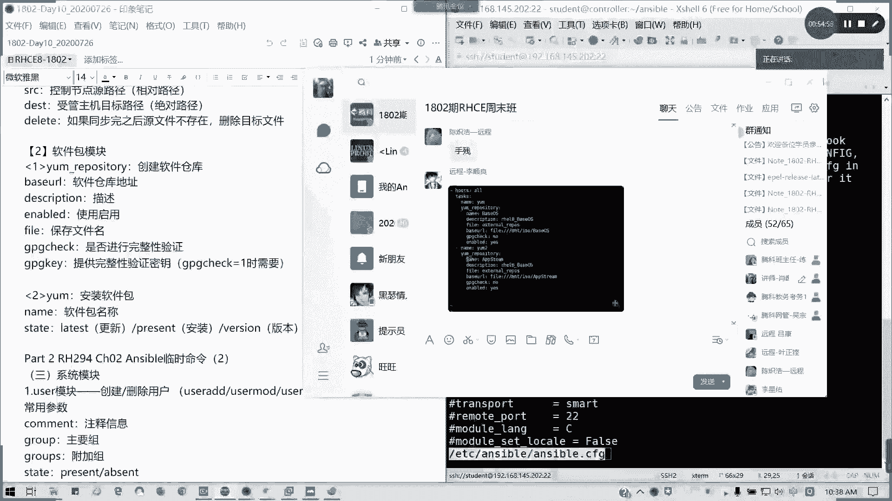

**总结**：Day09的重点在于搭建正确的Ansible工作环境（配置文件）和掌握最基本的操作命令（临时命令与核心模块）。确保这些基础牢固，是后续学习Playbook、变量、角色等高级主题的前提。多练习、多思考、多查阅文档是掌握Ansible的最佳途径。