# Ansible入门教程：第2章：Ansible临时命令与系统模块


## 概述

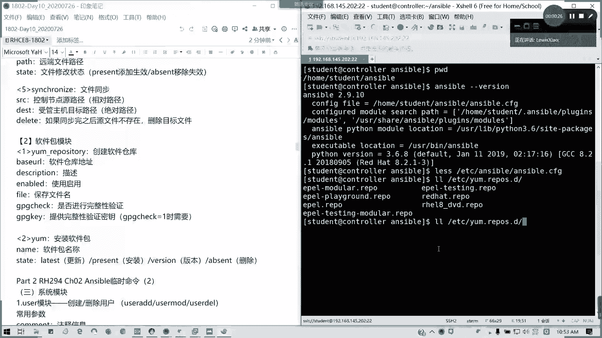

在本节课中，我们将学习Ansible临时命令的用法，并重点介绍几个核心的系统管理模块，包括用户管理、服务控制和防火墙配置。通过具体的例子，你将掌握如何使用Ansible快速执行日常的系统管理任务。

上一节我们介绍了软件包管理模块，本节中我们来看看如何使用Ansible管理用户、组、服务和防火墙。

---

## 用户与用户组管理模块

Ansible的`user`模块集成了`useradd`、`usermod`和`userdel`命令的功能，用于管理用户账户。其常用参数与我们熟悉的命令行参数类似，例如`-u`（UID）、`-c`（注释）、`-g`（主组）等。

以下是创建用户的示例：

```bash
ansible n1 -m user -a "name=test_user uid=1010 comment='test user' shell=/bin/bash state=present"
```

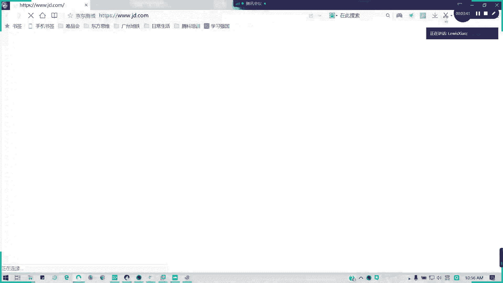

执行此命令后，Ansible会返回操作结果（称为“事实”）。我们可以通过以下命令在受管主机上验证用户是否创建成功：

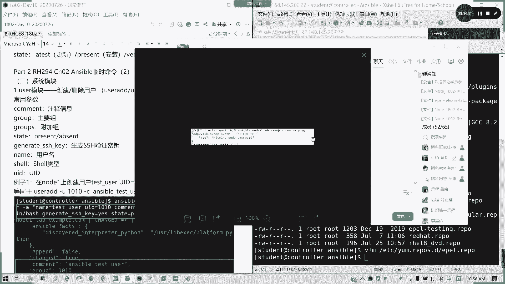

```bash
ansible n1 -a "id test_user"
# 或
ansible n1 -a "cat /etc/passwd | grep test_user"
```

要删除用户，只需将`state`参数改为`absent`。请注意，此操作仅移除用户记录，不会删除其家目录。

```bash
ansible n1 -m user -a "name=test_user state=absent"
```

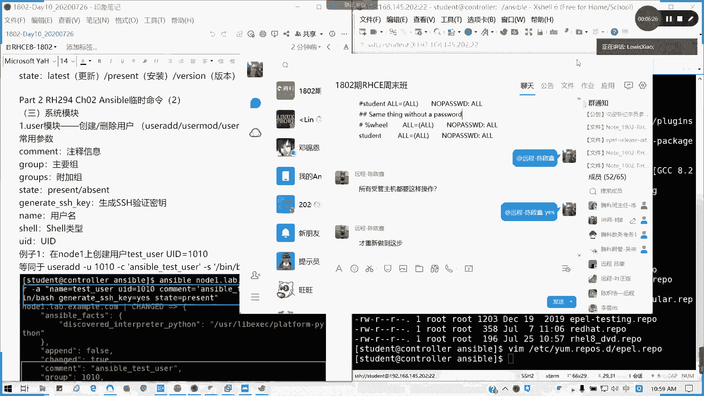

类似地，`group`模块用于管理用户组。

以下是创建用户组的示例：

```bash
ansible n1 -m group -a "name=test_group gid=1010 state=present"
```

要删除该用户组，使用以下命令：

```bash
ansible n1 -m group -a "name=test_group state=absent"
```

---

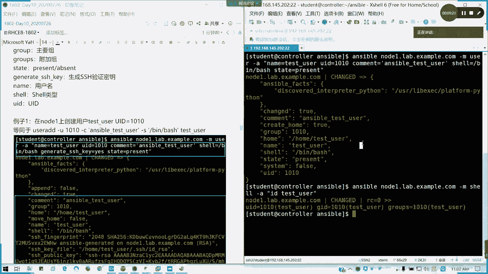

## 服务管理模块

`service`模块用于启动、停止、启用或禁用系统服务，其功能类似于`systemctl`命令。主要参数包括服务名（`name`）、期望状态（`state`）和是否开机自启（`enabled`）。

在操作服务前，请确保该服务已安装。例如，要启动并启用`httpd`服务：

```bash
# 首先确保httpd已安装
ansible n1 -m yum -a "name=httpd state=present"

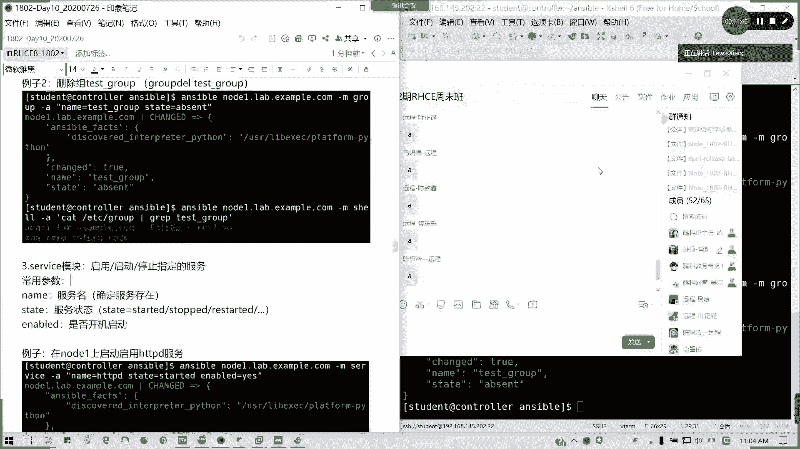

# 然后启动并启用服务
ansible n1 -m service -a "name=httpd state=started enabled=yes"
```

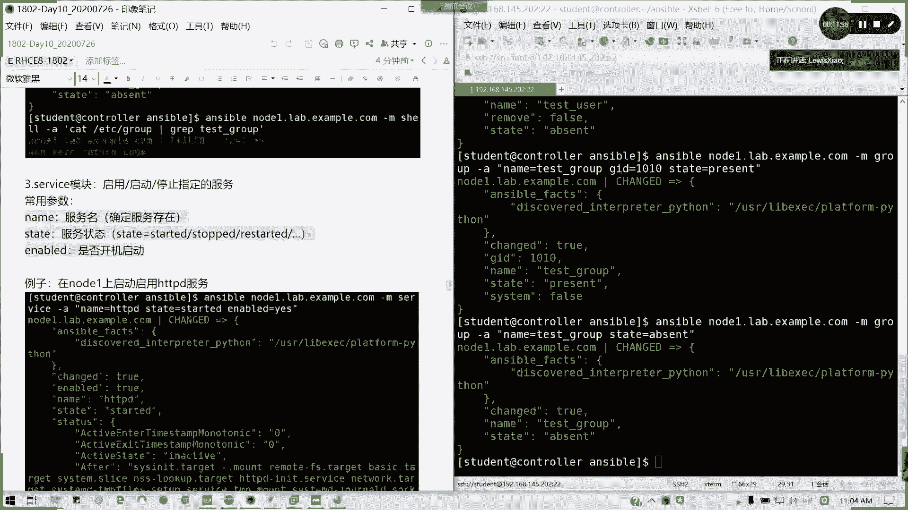

`state`参数还可以设置为`stopped`（停止）、`restarted`（重启）或`reloaded`（重载配置）。`enabled`参数可以设置为`no`来禁用开机自启。

---

## 防火墙管理模块

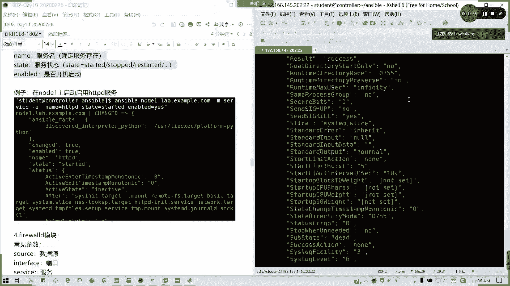

`firewalld`模块用于管理firewalld防火墙规则，其用法与`firewall-cmd`命令相似。常用参数包括：区域（`zone`）、服务（`service`）、端口（`port`）、是否永久生效（`permanent`）以及规则状态（`state`）。

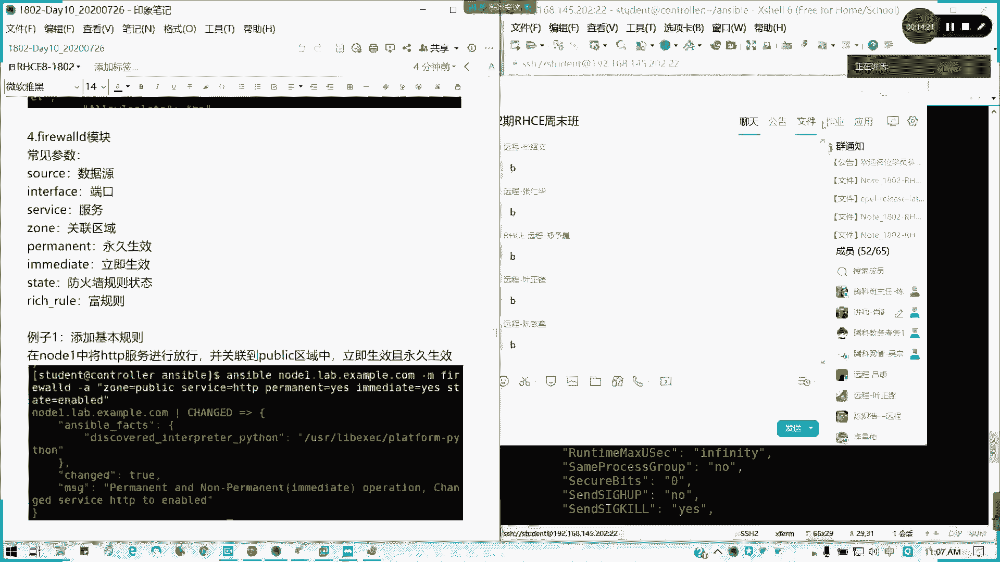

例如，要在`public`区域永久放行`http`服务，并立即生效：

```bash
ansible n1 -m firewalld -a "zone=public service=http permanent=yes immediate=yes state=enabled"
```

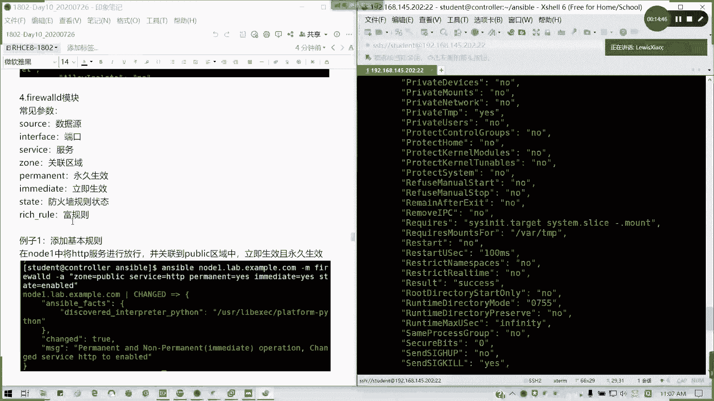

该命令会自动执行`reload`操作，无需手动进行。

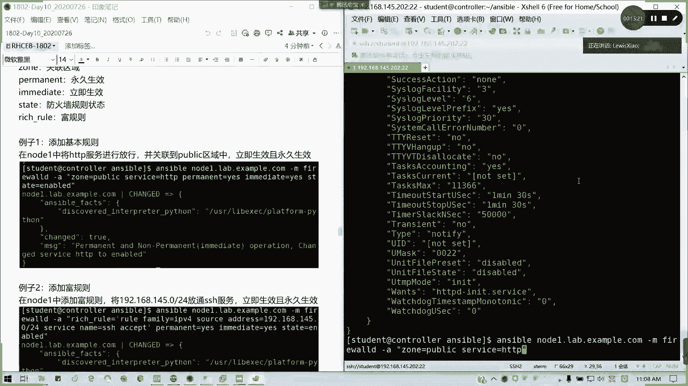

我们也可以添加更复杂的富规则。例如，允许来自`192.168.1.0/24`网段的SSH访问：

```bash
ansible n1 -m firewalld -a "zone=public rich_rule='rule family=ipv4 source address=192.168.1.0/24 service name=ssh accept' permanent=yes immediate=yes state=enabled"
```

---

## 网络工具模块：下载文件

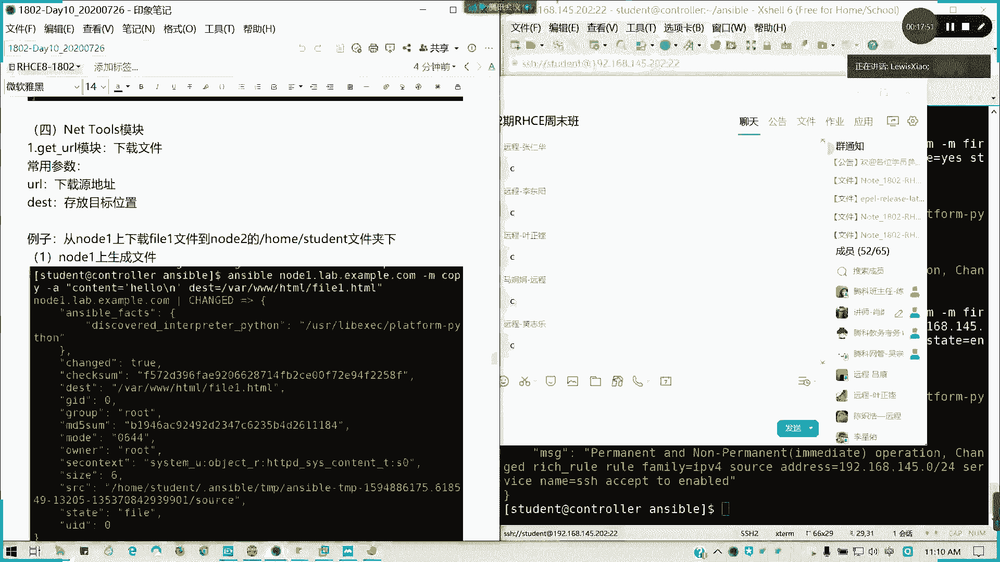

`get_url`模块用于从远程URL下载文件到受管主机。

首先，我们在`node1`上创建一个示例文件：

```bash
ansible node1 -m copy -a "content='Hello World\n' dest=/var/www/html/file.html"
```

并确保`node1`的防火墙已放行HTTP服务（上文已操作）。然后，在`node2`上下载该文件：

```bash
ansible node2 -m get_url -a "url=http://node1.example.com/file.html dest=/home/student/"
```

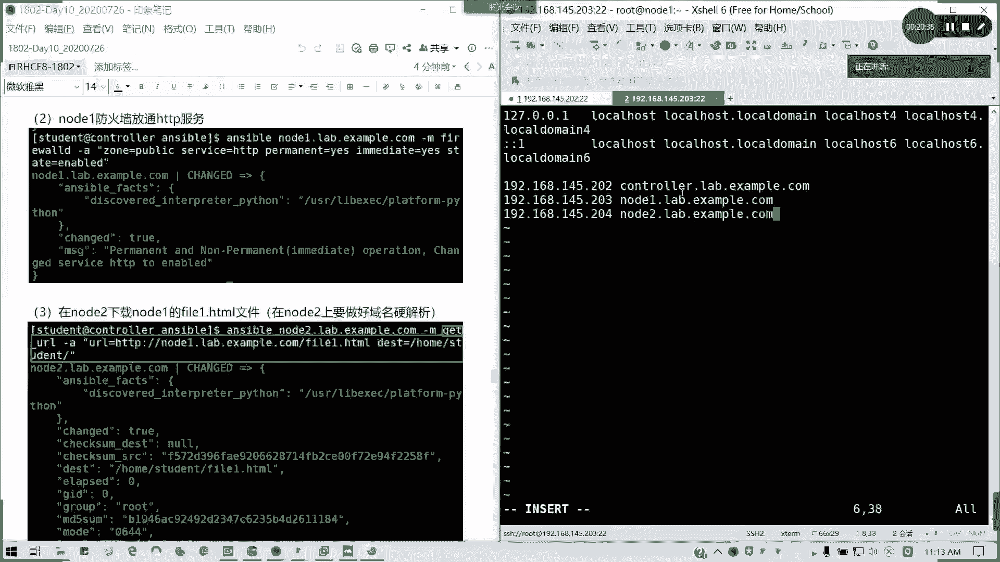

> **注意**：执行下载前，请确保`node2`能够解析`node1`的主机名（例如通过`/etc/hosts`文件配置），否则会出现“域名解析失败”的错误。

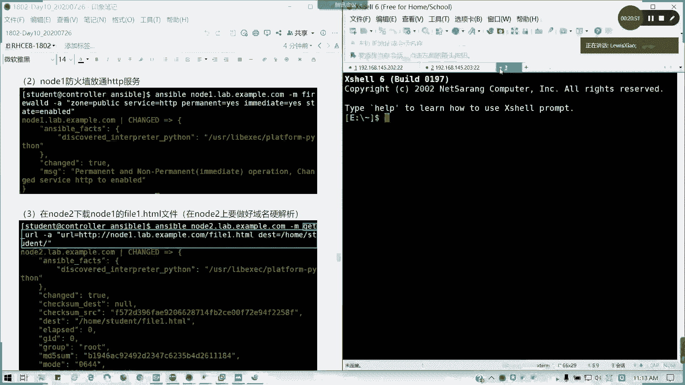

---

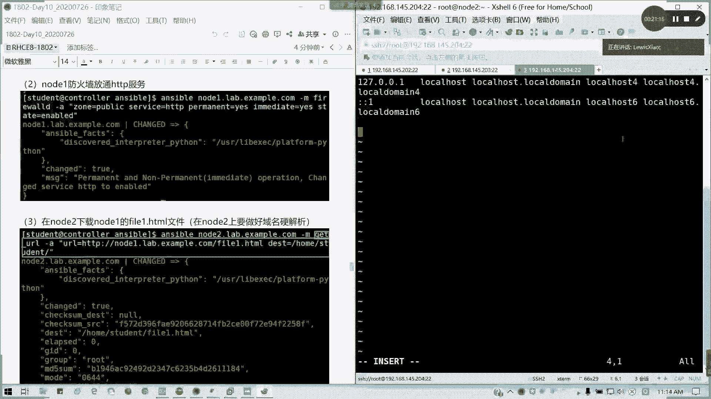

## 总结

本节课中我们一起学习了Ansible的四个核心系统管理模块：
1.  **`user`模块**：用于创建、修改和删除用户账户。
2.  **`group`模块**：用于管理用户组。
3.  **`service`模块**：用于控制系统服务的状态和自启配置。
4.  **`firewalld`模块**：用于管理防火墙规则和服务放行。
5.  **`get_url`模块**：用于从网络下载文件。

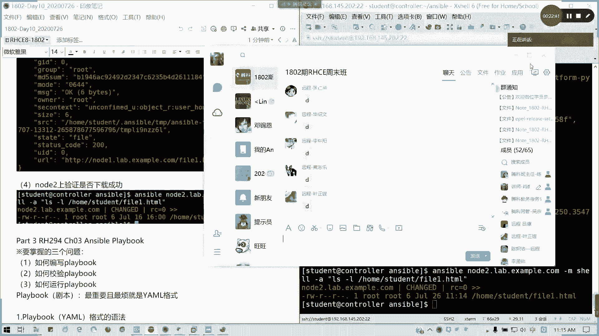

通过掌握这些临时命令，你能够高效地完成基础的Linux系统管理任务，并为后续编写更复杂的Ansible剧本打下坚实基础。