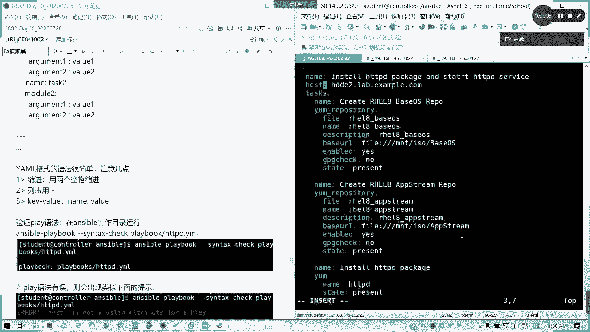
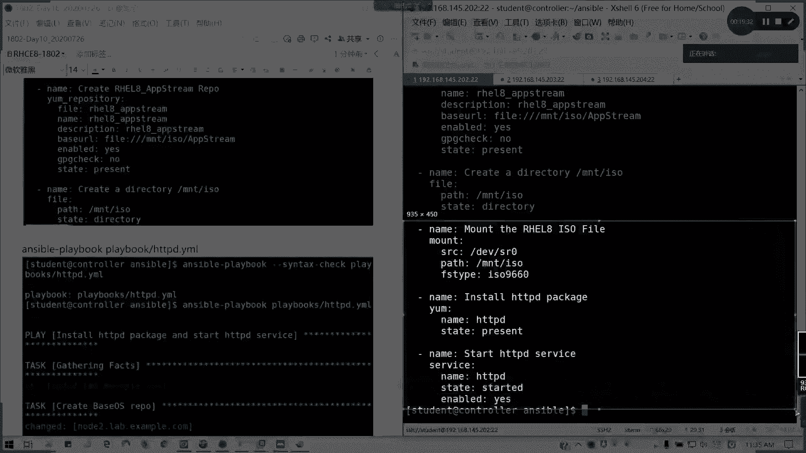

# 拿下证书！Redhat红帽 RHCE8.0认证体系课程 RH124+RH134+RH294三门认证视频教程 - P59：59_Video_Day10_Ch03a_AnsiblePlaybook - 16688888 - BV1734y117vT

好的，那我们现在开始讲我们从临时命令切换到我们的剧本。N第三章anibleplay book。要掌握三个问题。第一个我如何编写？如何校业？如何运行？其实在对于我们的playbook最重要。

最烦就是什么呢？一个样母格式YAML啊，所以所以现在我们要把我们的剧本转化成我们的样母格式。样么格式其实也它也是基于python去去写的，好吧，像S我是基于python里面开发的一个自动化工具。

那我们就遵照它的样么语言来写就可以了。好，我们为了方便我们在那个anerible里面创建一个。playイボッスモード。用于存放剧本。然后我切到我我不我不切里面。因为当前公作目录啊。

为了保证我的S我是生效的，所以我就不切公众目录了。我直接我按按照一个例子啊。按照一个例子，我来写一下啊，我边写边给大家说讲解，然后大家可以容容易理解一点。

play books里面的HTDPD点妖么YAAL或是YML都可以。啊。都支持啊，这个看具体的考试要求啊，考试我们练习的要求，看具体我们实际环境生产的要求，他要让你。写什么文件，我们就写什么文件，懂吧？

好。回车我们怎么写剧本？剧本你固然要有。我这个剧本我要干嘛的？我要作用在哪里？那我的任务，我分配的一个任务是什么？对吧我要写清楚，那好，我们开始。首先声明这个剧本三个横杠，不是破折号，三个横杠开头回车。

第一行第二行开始，我们这里是相当于一个。项目我们的一个列表，一个是一个一个项目列表，所以没用。一个横杠空格就证明它是同一个列表层级里面的对吧？它是有层级的结构。那好。

第一个我们写namename列明这一个剧本的用途。懂吗？这个剧本用途可以自己定义。但是通常来说我们建议啊就跟我们企业注释一样，要因为你这个剧本你不只要自己用的，你要给别人用的。

所以的话是不是我们要写明这个用途，但这个的话你怎么写都行，只要你要看得懂，对吧？instled，我要安装HTTP服务，对不对？我是不是我这里我要启用安装并启用HTTPD，那我把这个用途写写下去。

不要用中文哈。不要用中文啊。好了没，那样吧，写明这个剧本的用途。第二行我的作用于我的在哪里运行，对吧？Host。走吧。空格啊，记得我们这里。参数我们的选项。冒号空格后面再价值，这里很容易犯错的。

或者是你在这个列表里面你少了个空格也不对，这里少一个空格也不对，这里用拳角的冒号也不对啊，注意。这里我写作用域，如果是所有主机，我写哦。如果是多台主机，我可以用列表的形式，就是在这里我缩进空两格是吧？

我可以这样空格空格，这样列表下来，没有问题。但我这一台的话，我就跟在后面啊，懂吗？我这样讲能懂吗。我来看看啊。接下来我们的受管主记我们要写啊。node2点L点in example点COM。

就别记得啊这里怎么定义就怎么引用。怎么应怎么定义的怎么引用啊。好了，接下来。我要写什么任务啊，对吧？task记得这里我们host跟task这周有一个S的。回车，因为任务多。

我们不可能跟在后面直接堆在一起，不难看的要死，对不对？那我们接下来它是一个tsaskk里面的一个子向，那我们就用缩进啊。样本文件格式是有两个空格缩进就可以了，没不需要一个tab，四个空格，或怎么样。

我们两个空格进行缩进。好，我们第一个任务。任务的名字。是吧。第一个任务是不是我要这个包我是要先安装，对不对？好吧。名字先写不用写作用语了，因为它是一个任务。然后接下来我要写模块。我这个月我要调什么模块。

模块里面要写什么参数？对吧好，我这里模块用一样的。对吧嗯。如果我这里没有配软件仓库怎么办？我昨天我是不是是配了个弄的一。那我这里我可以改一下啊。对吧我这里完整写啊，用。我自己创建一个软件仓库吧。

yp repitory。对吧然后我们参数是什么？也是空两个，因为它属于这个模块里面的内容。啊，好，我这里的话ypoory。单本飞这这这头尾文怎么写的，我来看一看啊。😊，首先，nve。对吧我们的fire。

我们先写我们的文件。同样也是冒号啊。IL8。faceOS。对不对？那我们的m。就是我们的方框里面有。description这里我可以不写。描述啊。我写没问题啊。反正定习里面你他有要求，就我们就写呗。

faceURL，我这是完整版的啊，因为我们我们例子里面是一个就是已经配完软件仓库的。就其实就把我们等号换成冒号。空格懂我意思吧？base啊ISO然后里面的baseOS。然后后面。

enableable的这一我换的yes，对不对？或是t或 false都可以。triing check不显 no，对。State。Present。对不对？然后我可以重复再应用这几这些参数。

我这里12345677YY。Pi。对吧我把它分隔开来，这里我们改成F dream。你们是不是要创建软件仓库先啊，对不对？就把我其实把昨天题目已经讲了。就已经在讲了，只不过我换成剧本的形式而已。

App stream。懂吧？好，这是第一个任务已经完成。那我们通常我们我按我的习惯哈，我们的每个任务任务之间，我们用空格空行分开。其实这样是不是我们有层次有调理？对不对？不要多移在一块啊，nap第2。

点5。Instore。STDPD。Package。好。我们用什么呢？y么。对吧。然后呢，我们的。软件发名字叫HTTPD。其实我们用VIM机很好的。如果你写对了，它会有颜色提示的对吧？选项。

蓝色值就我们参数是蓝色值白色。对吧。然后state。Present。这是第二个任务。第三个我要启动服务了那。Start。HTTPD service。我们调用的是service模块。

刚刚讲的新切果瑞个samp。😊，HDDVD。State。in study对不对？我要启动。In label。But， yes。那我们剧本是不是写完了？很长啊，我这里有复制给大家啊。

这是完整版的一个剧本。仅供参考。然后呢，写完剧本啊。其实呢我们prebook是将我们临时命令啊划分层级区块，想用缩进样式来识别。建议大家啊给我们一行一行写就非常好了，对不对？我们的参数一行一行写，对吧？

排错也简单，一个简单的一个句母模型实，我这里不用再讲了吧。然后你如果多个，比如写一个剧本，两个剧本，你可以在一个文件里面写多个剧本都没问题。但是通常我们是一个文件写一个剧本，为者区分它的用途。

鸭某膜得式其实不仅不难啊，很简单，注意。缩进两个空格，每个层经有两个空格，列表用横杠，一个一个减号，然后空格隔开。keyep value呢我们就nameb后面有一个空格的哈。

然后呢，我们来进行验证，我们来验证我们的语法。验证语法呢，我们执行tbook的命令叫answ playbook，对吧？记得这里当前的工作目录。answ play book。

然后杠杠fin text check。语法验证啊，那么对吧？然后呢，play books里面的HTPD点m看有没有问题。哎，有啊。当pre kid啊，他有一个 warning而已。第七行。

我这里是不是我我这里是写了两个重复的啊，所以它会有提示。我这里我可以啊，我可以分开两个，它就不会有提示了。就是我这里我在那个。引用同时引用两个就可以了。这样应该就没问题了吧，看一下。单配佢。

y repository use defined value only啊。他是发现两个重复的那我们其实我们更好的就是。隔开。对吧我这可不可以得开啊？你要为保险就隔开呗。好了。

我们再看一下sentt check，没有问题了，有问题我们就把这些 warningning消掉。懂吧。然后呢，如果确实有问题，比如说我这里我突然少了个S。他虽然是高亮的啊。看到没？

Hos is not a very attribute for play。然后他会指明你这个位置到底在哪。通常在下一行或上一行。好吧。所以这里我们要改正啊。

他只会应验证母的。语法但是不会去验证我们的逻辑。

懂吧？逻辑怎么样，他不管。他只要保证你语法正确，懂我意思吧？好。

改完之后再演色一遍，没有问题啊。没有问题，那好，怎么运行？ansible。完整剧本啊，这里我不是写了吗？完整剧本好。我anable。Gplaybook。杠ang杠fin tax。

那不用再 textex了，我们检查过了，我们就直接play books里面的HTDBD。点一も。这是在你的攻通之下跑啊。好了，首先他的配啊一个play就有人开始。收集事实，然后创建我们的样源。

他每个列都列出来好了，有错误了。

n package为什么？那我没挂载呀。对吧。我没挂载啊，我这个牌没挂上去，对不对？懂吧？没挂上去，那我们就就执行一个临时命令喽，我或者我在剧本里面写喽。这个剧本我还缺认那边一丢丢东西啊。

在这里我要挂载一个光盘，对不对？네。猫蹄。帽子。对RHL8ISO five对吧？比有momount模块参数。Solf对吧。DEVF80。好吧，他的。destination或者叫pass都可以。

叫做MNTISO。那前提我们要创建1个IO，对不对？那我们的FS type它会写到我们的那个ETCFS type里面呢。ISO9660。对吧。那在前面我又要创建一个目录。这我把我把这个剧本再完整化。

老文发呀，对呗？对吧。네。叫做。呃，我想想啊。name啊，我们想想啊，我们怎么写我们创建一个目录。快尔模块啊。中案模块我们可以这样子啊。Pass。KATH。

就我们把等号换成冒号空格pass我们叫做MNTISO。State。directiory对不对？就可以了。这才是一个完整剧本啊。我把完成记用贴给大家吧，就整个步骤你对吧？

完整剧本应该是这样子的，这样就是一条龙服务，对不对？好，这里。哎，怎么滚下去了？

好。这里啊。

这个才是一个完整的剧本。懂了吧。好了，那我们现在执行一遍。我们前面已经配了样棉软件仓库，所以他就OK的。change哎 requirementforse啊。missing of state。

我漏了一个state。P咯。漏了就补嘛。

好，我们来看一下我们的运行情况。冒腿也成功了，开始装。诶。为什么呢？哪里有问题呢？我看一下。我看一下他这里是提示说那个state。在帽子那里。state哦，哎，我错了啊，我错了啊。

state不是写present，应该是写mounted。对吧。懂我为思吗？懂吗？tay应该是猫腿，我要挂载。我先执行一遍，看有没么问题先。申报头没写完，没有错啊。成功装。

对吧装完。成功了吧。所以这些就怕你们漏了啊。这个是不是写剧本，你整天又会怕漏东西啊？对吧整天会怕漏东西，然后呢。就我把完整剧本贴给大家。那我再看一下。对了啊，你们现在我觉得你们不玩精灵了。

这才是一个完整的一个过程。

懂了没？

好。明白了吧？这这个还没写完的啊，这个没写完，然后真正的。

真正的剧本要这么长。对吧所以我们在做一个任务，做一个剧本的时候，我们要方方面面我们能考虑到，对吧？我主要是这个我要缺什么东西。

说明是吧我说明的话，像我们运行一个剧本。首先你要不要你有没有连接上收款主机，这什的and get effect这个做了具体我们在管理变量事实里面会讲。然后剧本执行任务一任务2，对不对？如果是连不上。

如果如果我们这样收组连不上的话，它fa会等于一，对不对？然后突然有没有执行，如果成功做有做改变，那就是chrench。如果是OK就是绿色，也就是说你的状态没有发生改变，对吧？然后呢，后面他会一个统计。

对吧。懂了没？然后如果连上这台机器，就是fd等于1。然后是我正常执行任务，对不对？在play request里面，这个OK它的技术是这样子记的。然后我们可以提高任务的一个输出程度。比如说我可以干一。

是吧通常我们杠V就够了。然后杠VVB的话，你V太多的话，你这一屏都显示不完了，除非你要再来调试，像我们杠V就足够了。

对吧他要把每个任务的一个这种结果都列出来，就不是单一行写就OK了。因为现在我们已你创建完了这猫，所以的话它就是全部绿色。然后干VP的话，你看。连最后结果跟这种配置都会显示，懂吗？就是能连哪一行跑。

他都告诉你。然后VBB呢就是跟速官属连接信息。那这样的那你滚平了，开始滚平了，对吧？太多东西了。其实我觉得没必要。杠B就可以了，然后干4个V呢，啥额外啥的强度，哇去你看。お。对啊，最详细的4个V。

你就用于调试的时候，我可以用。但是通常我们用一个V就可以了，对吧？一个B最多两个B。对啊，很多啊，你可以存在lo里面，你自己看吧。但是我们通常一个B就可以了。空运行。但C不会实际运行。

就是它会显示你的预期的一个结果。但是你它不会真正跑在主机上。好吗？它这是一个预期的结果会显示啊。但是他这是空运行。懂我意思吗？好，那这个明白的话啊，请打字母一，然后我们做下面一个剧本练习。

做下面一个剧本练习啊。我都发下来。我们装了1个HDDP服务，那我们接着往下做。对吧这就留给大家。那现在我们休息一会儿啊，这个周我就给大家现在做，可以吗？

