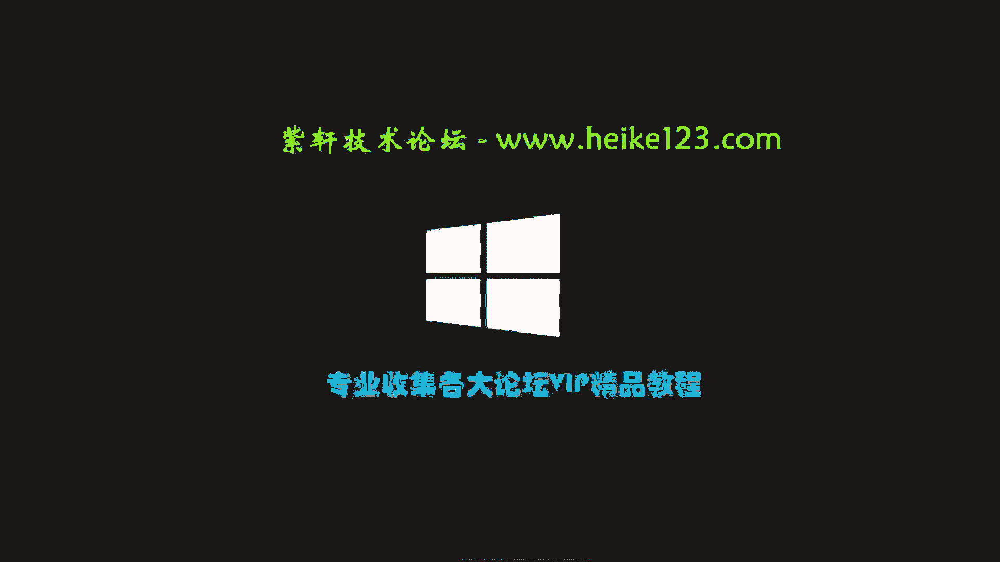
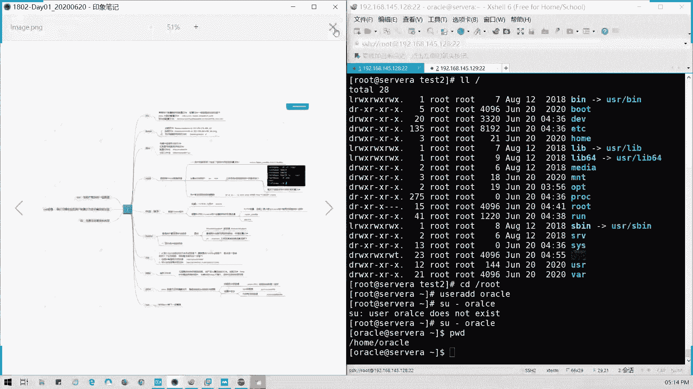

# 拿下证书！Redhat红帽 RHCE8.0认证体系课程 RH124+RH134+RH294三门认证视频教程 - P5：5_Video_Day01_Ch03a_Linux文件系统框架 - 16688888 - BV1734y117vT

第三章我们开个头，从命令行管理文件。首先我们要知道linux里面文件以及目录的一个方式。在linux里面呢，它是一个树形结构啊，从树形结构。然后所有文件跟目录都是从根我们的斜杠啊，简要叫根啊。

我们录我们根挂在点开始。然后这些文件呢不是随意创建，而要遵取我们的文件系统目录的标准，特定的功能节目录呢应要按照我们的功能存放。我们这里有个链接哈CSDN这里。

然后CDN这里我们有有讲关于一些常用的一些目录目录的文件目录的用途啊，然后我们这里的话有一个火化的一个思维导图啊，根目录到底里面做什么用的。我们简单来看一看。放大姐来看一下啊，能看清楚啊，有点小啊。

我们这里跟挂达点我们重点讲几个目录哈。讲解目录首先ETC对吧？我们跟关在，我我们那个。我看一下LL。跟对吧？我们跟灌载点是不是有这么多东西，对不对？这么多目录，我们就讲这一目的用途，好不好？

首先我们讲ETCETC通常是跟我我在放大啊，我看能不能再放大。不能这样这样能不能看得清楚，可以吗？EDC。常常是那个放置我们的配置文件啊。所有的配置文件，也就是它的应用我们的系统。

我们的网卡设备等配置文件都是放在ETC下面。比如说我们的y么仓库，我们的软件仓库配置文件，要么点reple选D是吧？reheadrapple，那我们的网卡的配置文件都是放在这里。知道吗？

这是ETC目的作用。然后还有一个bo，boot主要是放内核的引导文件，以及我们的引导程序有关的，还有内核文件，以及它的尾根尾根知道什么意思吗？就是它的镜像。它系统你要加载你你你要加载镜像。

它就是一加载镜像之后，它是一个伪的根目录。那后我们要切到真正的根目录，对吧？我们才能进行操作。但是它这个切换呢，我们引导的时候，系统已经帮我们做了。但是我们如果在修修改我们救援模式，这些都没有啊。

就它我们手动切换到我们的真正跟目录。就是然后还有就是我们的引导程序有关的一个文件都放在这儿啊，这是不同目录，你们记只要记得只要跟引导有关的，全部放在这里。能明白吧？第3个，DV。

它是deviceDEVIC的一个简写device它是与适件设备有关的文件，尤其是跟磁盘有关的文件全部放到这儿啊。比如说像我们的分区磁盘文件名叫做DEV0NMBM10N1，对不对？

也就是我们MBME磁盘第0个。MVM1磁盘里面的1个第一个设备啊，MVME0N1然后我后面分区的，后面带一个P啊，这个命名方法的话，我们在后面讲快讲设备的时候，我们会讲到它是怎么命名的啊。

我们就记得我们磁盘跟硬件有关的，全部放在第一批目录。root它是超级用户，我们root的加目录，也就是它的工作目录里面比如说像私有变量文件是吧？就它的一些环境变量，什么叫环境变量？

就是我们在企在切到这个用户的时候，我们预加载的一些命令，或者是一些刚才说的一些路径等等是吧？环境变量应该都知道啊，就这预加载一些路径，包括我们我们一些需要执行的一些命令，或者是一些命的别名等等。

就放在这个私有变量里面。明白吗？比如说我自定一个命令别名，对吧？这是不是属于一个环境变量，对吗？就只能在你这个用户上面才能使用。这个是一个私有变量文件啊，我们就放在这儿放在加目录里面。

然后还有就是你切换用用户在root的时候，他工作目录会回到该用户的加目录下，是也就是为他是为了读取我们这个用户的环境变量文件，懂我意思吗？你切换的时候切换切换用户的时候，他会读取我们变量文件。

然后再进驻到我们的用户的我们的。命令好社环境懂吗？然后他还他这个权限呢，他是他的权限比较特殊啊，通常说他就是那个。他用户的加入的权限就只有他用户以及同组的能读跟执行。然后其他你不能访问。

为什么你这个用户，你只你只能自己访，你自己同组的能能能能进，但你其他人能进吗？对吧？比如说你的你的家门对吧？你的家门，你的那个办公桌，你抽屉，那只有你或者是跟你同组相关人才浏览，那其他人能能不能进来？

是不是这样道理？用过加目录你不是随所所有人随便都访问的，懂我意思吗？只有你跟你同组的人，就你的文，他前面一位是文件所有者，后后面的是你同组的人，同组的那个用户，懂吗？

然后后面三后面三个三个呢是代表其他人。所以他用户这目录不是其你其他人是进不来的对吧？一定要你自己或者是他同组用户，这个能理解吗？然后然后还有就是比如说像例子的话，比如说我们创建一个像oracle用户。

对吧？我们比如说我们装数据库，我们要创建一个oracle用户，然后oracle用户呢，他就会放到他就会有自己跟。就我们讲到这个作用例子的话，我们先讲一下home啊，因为它这个作用例子是是跟下面有关系的。

home的话是普通用户的加目录所在的目录，懂吗？root是在直接是斜杠我们的根目录root，对不对？杠root，那普通用户呢是在home下面的一个用户名，刚才说过了。它也是同样包含了环境变量文件。

然后如果我们切换的话，会切换到它的这样目录像，对吧？所以我们的波浪线是代表我们的用户这目录，就是我们。比如说我们这里CD是吧？杠杠 rootot是吧，这波浪线对不对？我们现在都共众目录了，这懂吗？

像我们一个例子，就是我们创建一个用户oracle，对吧？有所爱的。对吧我们让我们切换到我们的oracle的这这用户。哎，我我打错了，ORACLE。是吧我们同我们当前PWD是不是在这个加目下面？懂吧。

然后呢，比如说我们安创建用户，然后我可以设置。特殊的环境变量。比如说我们的刚才的文件执行路径，我们的pass变量，对不对？也就是说我这个用户能执行的程序，那其他用户我不需要给他执行。

那我们是不是要可以给特定用户去。测置我们的环境变量啊，对不对？就例如我们刚才的pass。对吧刚才的执行文件的一个路查找路径，是不是我们可以给除了我们给自己设置，我们也可以给单独的用户设置，对不对？

也可以全局，他既然全能全局也可以局部，懂我意思吗？然后呢，还有就特殊环境面料，比如说像我们的bsh profile，就是我们的一一些加预加载的一些文件，对吧？这两个文件大家稍微记一下就好了。

我们以后会用到啊。然后呢，话我们讲完了，我们讲VAR。VR呢它是大部分日志有关的文件都是在这个目录下。比如说像通常是VR log，对吧？我们VR log目录是存放日志用的啊。

然后自定义如果是除非我们某个服务自定的日志路径，否则基本上都在这个这个目录下，比如说我们像邮件有关的在R mail里面的这个目录存放了邮件相关的日志啊，邮件呢邮件不仅仅是我们普通的那个收件箱。

还包括我们用户之间对吧？用户之间我们内系统内部产生的一些私有邮件，然后它都会存到这里，还有呢跟计划有任务有关的，比如说像我们的一次性计划任务还有我们的周期性计划任务都会存在这里面懂我意思吗？

这VR通常是存放我们的比如说像日志啊。等等，主要是纯日制对吧？还有纯本的一些运行库。TMPt临时文件夹啊，就是说我们大量软件安装的时候，我们会有大量的临时文件。它通常说就是那个它会存放在这里。

就是它会产生一些临时文件啊，就是类似于我们C盘windows里面t对不对？临时的它一般弄完之后说删除。但这个tamp空间你要足够大，否则的话，你可能软件，比如说我要临时解压出来一些数据，对不对？

你的tamp不够大，它会安装失败的。现在prolock是吧？pro目录，它这两个是内存的啊，它是不占磁盘空间，它是启动后的内存数据，只是把它映射出来。它这两个挂它这两个目录。

它它是映射到它是内存映射下来的，所以它不占用任何的磁盘空间。懂吗？不正常任用的磁盘供间，它是从系统启动之后，哪些数据呢？比如说像我们跟。硬件有关的CPU信息是吧？内存有关信息。

还有呢就是我们的进程有关的。它它进程人的话，它目录保存的是一个数字，对不对？进程ID号。好，然后如果ss它有一个ss目录，它就对针对pro做一个整理。这两个目录其实内内它的内容差不多的。

只不过它ss是优化后的。然后还有呢还有几个木录啊这边。USR。这要是跟用户环境变量有关的一些数据啊，跟用户有关的，我们不我们这里不叫user啊，这里全称不叫user。

它是一个将在用户环境变量用户变量里面的数据。像我们一般装的软件啊，保存的一些东西啊，会报保存USR里面，包括我们的可执行文件，对吧？多在这里面OKT呢就是第三方软件，我们会编译到这里。

第三方软件啊OPT对吧？习惯性的就约定俗成的。还有一个叫做lifeveLID这与我们运行库有关的内容。那整个能理解吗？我记我把整个木架给我介绍了一遍，都是从根木开始的。能理解吗？可以的话打个一。

哎，我又回来了。能理解啊，这个这个的话我们已经讲了文件系统结构的用法，就文整个架构都清楚了啊。还有是就这这些啊，就不可跟跟文件分跟目录分开的目录就与开机过程有有关的。就这几个EDCB是吧？

还有DVB这几个目录是不能是不能单独建分区的。我们刚才是自动的话，我们就全部建在根分区下面。那如果我们以后要区分的话，那是不是我们不能单独建分区这这些一定要跟我们的系统跟根分区是一块的。

就跟我们系统统一块的。比如说让你的USR我们的VIR我我们的那个USUSRVIR这些是不是我们可以单还有后目录是不是我们可以单独建分区去存放，对吧？单独画直盘空间，但这几五个目录是不可以的？

它一定要跟根分区在一块啊，所以我们补充这点就是我们这5个目录不能单独的啊，不能单独的单独的存放在一个位置。那好，我们今天先到这里，然后我现在把笔记传上来视频我们统一明天晚上。啊，结束之后我会传上来。

好吧，那我现在我先把笔记传上，然后大家可以稍作整理。然后如果啊明天我们我们早上9点半继续啊，明天早上9点半，然后呢如果现场的同学啊，现场的同学请麻烦请把垃圾带一下啊，把它带一下。

然后那个把东西把现场这些放好。然后明天我们9点半还是现场我们14号课室啊，资料格式，我们先把我们笔记啊，我们把笔记更新一下，我重新传1个1801的1个笔记取代取代这个文件。然后今晚的话大家先把它复习。

然后我们看书本上第三章内容。第三项内容好吧。还有第四章，明天我讲到一个帮助VI编辑器，用户跟组啊，可能会讲到权限，看时间啊。今天先把基本啊基本东西给大家过了，我现在先把笔记再次传上来。

网盘稍后也会有好吧，那我们。今天先到这里，5点16分，我们明天各位不见不散，好吧，9点半。