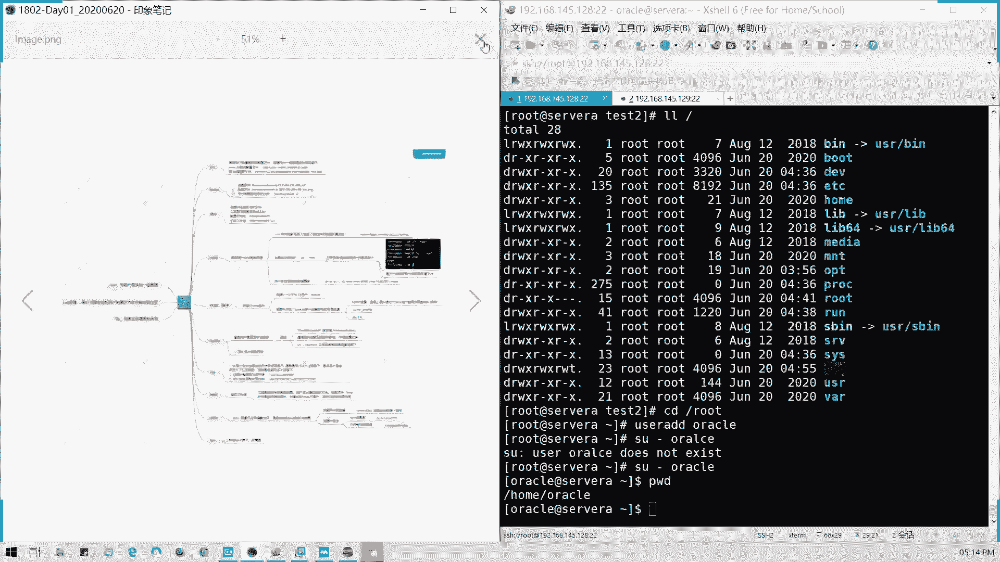

# Linux系统管理：第三章：Linux文件系统框架

## 概述
在本节课中，我们将学习Linux文件系统的基本框架。我们将了解Linux如何以树形结构组织文件和目录，并深入探讨根目录下各个核心子目录的用途和重要性。理解这些是有效管理Linux系统的基础。

## 文件系统结构

Linux采用树形结构来组织文件和目录。所有文件和目录都从一个称为“根”的起点开始，用斜杠 `/` 表示。

这些文件并非随意创建，而是遵循文件系统层次结构标准。特定功能的目录应按照其设计用途存放文件。

以下是根目录下一些重要子目录的用途说明。

### 核心目录详解

**/etc**
此目录通常用于存放系统的配置文件。所有系统和应用程序的配置文件，例如网络配置或软件仓库配置，都位于此目录下。
*   `yum.repos.d/`： 存放Yum软件仓库的配置文件。
*   网卡配置文件也存放在这里。

**/boot**
此目录主要存放与系统启动相关的文件。
*   内核文件。
*   引导加载程序相关的文件。
*   初始化内存磁盘镜像（initramfs），这是一个在系统启动初期加载的临时根文件系统。

**/dev**
此目录是“device”的缩写，存放与硬件设备相关的文件，特别是磁盘设备。
*   磁盘设备文件命名遵循特定规则，例如 `/dev/nvme0n1p1` 表示第一个NVMe磁盘的第一个分区。

**/root**
此目录是超级用户（root）的家目录。它包含该用户的私有环境变量文件。
*   环境变量定义了命令搜索路径、命令别名等，仅在切换到该用户时被加载。
*   目录权限通常设置为仅允许所有者和同组用户访问，例如权限为 `drwxr-x---`。

**/home**
此目录是普通用户家目录的父目录。每个普通用户在此目录下拥有一个以用户名命名的子目录作为其家目录。
*   例如，用户 `oracle` 的家目录是 `/home/oracle`。
*   用户家目录同样包含其私有的环境变量配置文件，如 `.bash_profile`。

**/var**
此目录大部分用于存放经常变化的文件，例如日志文件。
*   `/var/log`： 系统和服务日志的主要存放位置。
*   `/var/mail`： 存放用户邮件。
*   周期性计划任务（cron）的日志也存放在这里。

**/tmp**
此目录是临时文件目录。许多程序在安装或运行时会产生临时文件并存放于此。
*   类似于Windows系统中的临时文件夹。
*   需要确保此目录有足够的磁盘空间。

**/proc 与 /sys**
这两个目录是虚拟文件系统，内容映射自内存，不占用实际磁盘空间。
*   `/proc`： 提供内核和进程信息的接口，例如CPU信息、内存信息和以进程ID命名的目录。
*   `/sys`： 是对 `/proc` 的优化和重构，同样提供系统硬件和内核信息。

**/usr**
此目录存放用户相关的应用程序和文件。
*   系统安装的软件、共享库、文档和可执行文件通常位于此目录下。

**/opt**
此目录通常用于安装第三方可选应用程序。

**/lib 与 /lib64**
此目录存放系统运行所需的核心共享库文件。

## 重要注意事项

上一节我们介绍了各个目录的用途，本节中我们来看看一个关键的限制。

根目录下的某些子目录不能单独划分到不同的磁盘分区，它们必须与根分区 `/` 位于同一块磁盘空间。这些目录包括：
*   `/etc`
*   `/boot`
*   `/dev`
*   `/proc`
*   `/sys`

而其他目录，如 `/home`、`/var`、`/usr` 等，则可以单独分区以方便管理或提高性能。

## 总结
本节课中我们一起学习了Linux文件系统的树形结构框架。我们详细探讨了根目录下各个重要子目录（如 `/etc`、`/home`、`/var` 等）的特定用途，并理解了 `/etc`、`/boot` 等关键目录必须与根分区共存的原则。掌握这些知识是进行系统文件管理和磁盘规划的基础。