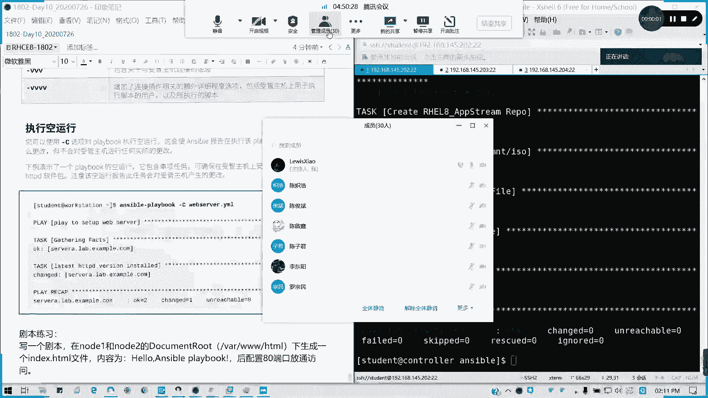
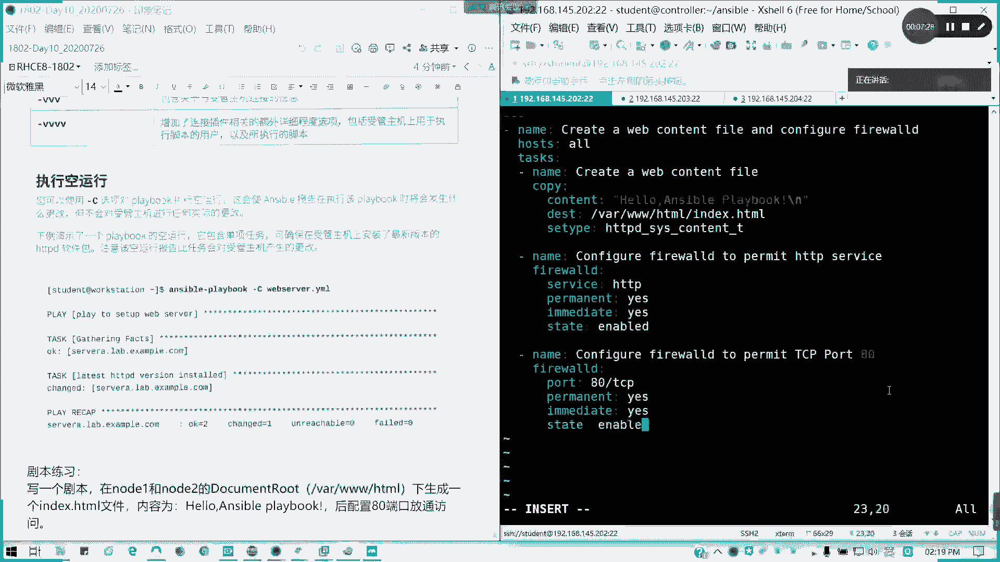
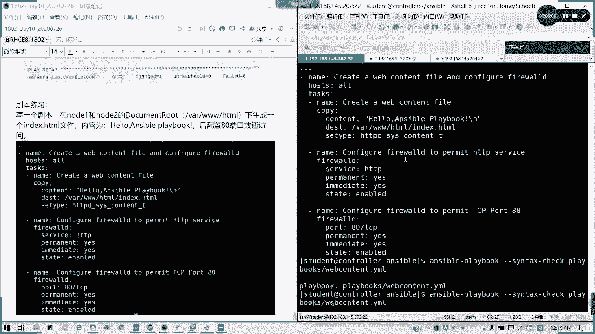
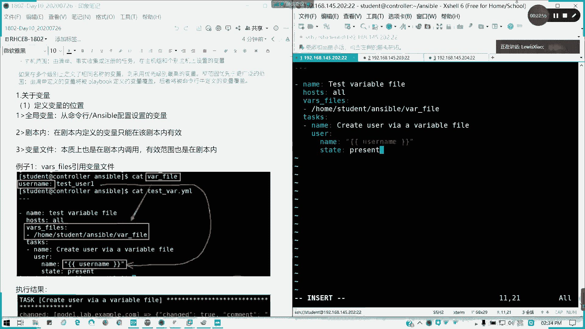
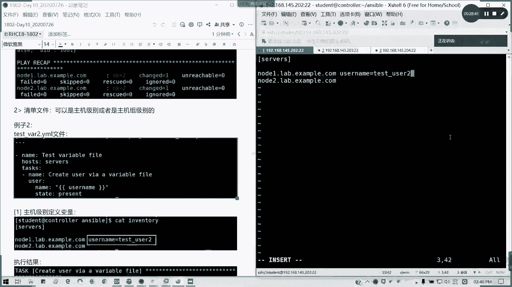
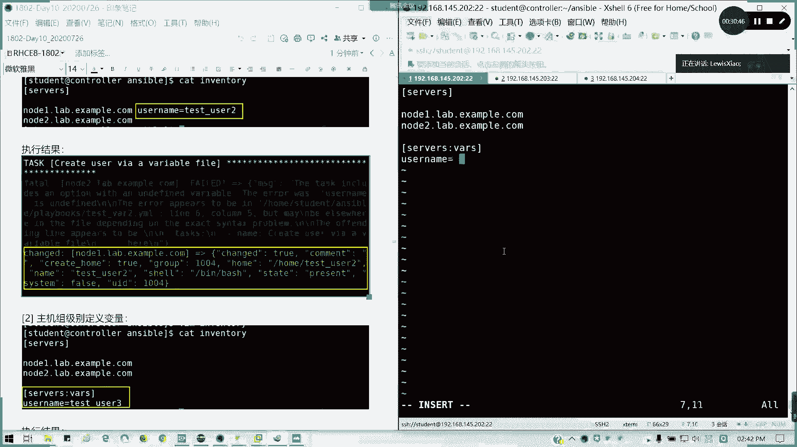
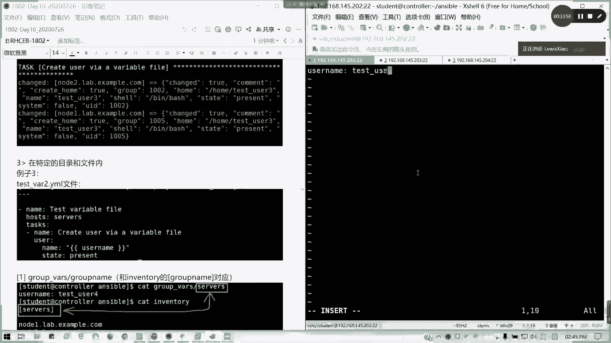
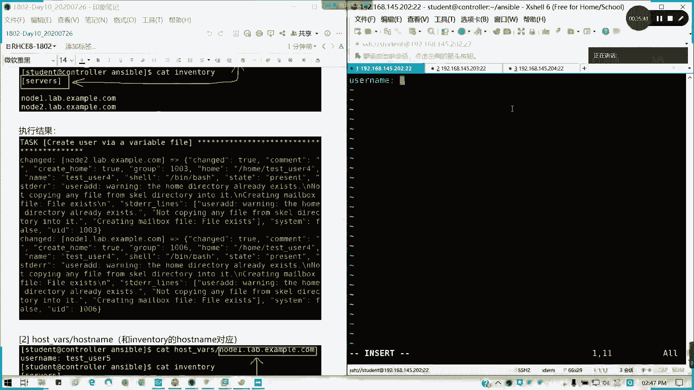

# Ansible 认证课程：第四章：管理变量与事实




在本节课中，我们将要学习 Ansible 中变量的定义、引用和管理方法，以及如何利用系统收集的“事实”信息。变量是自动化任务中存储和复用动态值的关键。


---

## 变量简介

Ansible 支持使用变量来存储数值，例如用户名、密码或软件包列表。通过变量，可以在所有剧本文件中重复利用这些值，从而简化项目的创建和维护，并减少错误数量。

变量可以包含多种动态值，例如：
*   要创建的用户列表
*   需要安装的软件包
*   需要部署或配置的服务
*   需要删除的文件列表

变量命名规则与 Shell 类似，但需注意以下几点：
*   变量名只能包含字母、数字和下划线。
*   变量名必须以字母开头。
*   变量名中不能包含空格、点号（`.`）或美元符号（`$`）等特殊字符。

以下是一些有效和无效的变量名示例：
*   `web_server` （有效）
*   `remote_file` （有效）
*   `foo bar` （无效，包含空格）
*   `192.168.1.1` （无效，以数字开头且包含点号）
*   `$my_var` （无效，以美元符号开头）

---

## 定义变量的位置

变量可以在多个位置定义，其生效范围也不同。主要分为以下几类：

### 1. 在剧本内定义变量

变量可以直接在剧本的 `vars` 部分定义，其作用范围仅限于该剧本。

**示例剧本 `test_vars.yml`：**
```yaml
---
- name: 使用剧本内变量
  hosts: all
  vars:
    user_name: test_user_in_playbook
  tasks:
    - name: 创建用户
      user:
        name: "{{ user_name }}"
        state: present
```



### 2. 通过变量文件定义变量



可以将变量定义在独立的 YAML 文件中，然后在剧本中通过 `vars_files` 选项引入。这种方式有助于将变量与剧本逻辑分离。

**变量文件 `vars/users.yml`：**
```yaml
---
user_name: test_user_from_file
```

**引用变量文件的剧本 `test_vars_file.yml`：**
```yaml
---
- name: 使用变量文件
  hosts: all
  vars_files:
    - vars/users.yml
  tasks:
    - name: 创建用户
      user:
        name: "{{ user_name }}"
        state: present
```

### 3. 在资产清单中定义变量

变量可以直接在主机清单文件中定义，作用域可以是特定主机或主机组。

**在主机级别定义变量（清单文件 `inventory`）：**
```ini
node1 ansible_host=192.168.1.101 user_name=test_user_node1
node2 ansible_host=192.168.1.102
```

**在主机组级别定义变量：**
```ini
[webservers]
node1 ansible_host=192.168.1.101
node2 ansible_host=192.168.1.102

[webservers:vars]
user_name=test_user_group
```

### 4. 使用目录结构组织主机/组变量

Ansible 会自动加载特定目录下的变量文件，这是一种更结构化的管理方式。

*   **主机变量**：在 `host_vars/` 目录下创建以主机名命名的文件（如 `host_vars/node1.yml`）。
*   **组变量**：在 `group_vars/` 目录下创建以组名命名的文件（如 `group_vars/webservers.yml`）。

**示例 `group_vars/webservers.yml`：**
```yaml
---
user_name: test_user_from_group_dir
```

### 5. 通过命令行定义变量

执行剧本时，可以使用 `-e` 或 `--extra-vars` 选项在命令行中直接定义变量，这些变量具有最高优先级。

**命令示例：**
```bash
ansible-playbook site.yml -e "user_name=test_user_cli"
```

---

## 变量的引用与优先级

### 如何引用变量

在 Ansible 剧本中，使用 Jinja2 表达式 `{{ variable_name }}` 来引用变量。为了清晰起见，建议在表达式两侧加上引号。

**代码示例：**
```yaml
tasks:
  - name: 使用变量
    debug:
      msg: "当前用户是 {{ user_name }}"
```



### 变量优先级

当同一个变量在多个位置被定义时，Ansible 会按照以下优先级顺序（从低到高）决定使用哪个值：
1.  命令行值 (`-e`)
2.  剧本内变量 (`vars`)
3.  剧本导入的变量文件 (`vars_files`)
4.  主机清单中定义的变量
5.  主机或组变量目录中的变量 (`host_vars/`, `group_vars/`)

---

## 管理事实

上一节我们介绍了如何定义和使用自定义变量，本节中我们来看看 Ansible 自动收集的系统信息——事实。

### 什么是事实？

事实是 Ansible 在连接受控主机后自动收集的关于该主机的系统信息，例如 IP 地址、操作系统版本、磁盘空间等。这些信息被存储在名为 `ansible_facts` 的变量中。

### 查看事实



可以使用 `setup` 模块来查看所有收集到的事实。

**临时命令示例：**
```bash
ansible node1 -m setup
```
这条命令会输出 `node1` 主机上所有的事实信息，内容非常详细。

### 在剧本中使用事实

事实可以像普通变量一样在剧本中被引用。例如，我们可以根据主机的 IP 地址或发行版来执行不同的任务。



**示例剧本 `use_facts.yml`：**
```yaml
---
- name: 使用事实信息
  hosts: all
  tasks:
    - name: 显示操作系统信息
      debug:
        msg: "此主机运行的是 {{ ansible_facts['distribution'] }} {{ ansible_facts['distribution_version'] }}"

    - name: 显示所有网络接口的 IP 地址
      debug:
        msg: "接口 {{ item.key }} 的 IP 是 {{ item.value.ipv4.address }}"
      loop: "{{ ansible_facts['net_interfaces'] | dict2items }}"
      when: item.value.ipv4 is defined
```

### 禁用事实收集

如果剧本不需要事实信息，可以关闭自动收集以提高执行速度。

**关闭事实收集：**
```yaml
---
- name: 不收集事实的剧本
  hosts: all
  gather_facts: no
  tasks:
    - name: 一个简单任务
      debug:
        msg: "本剧本未收集事实。"
```

---



## 变量与事实的简单练习

以下是结合变量和事实的一个简单练习，帮助巩固理解。



**目标**：创建一个剧本，使用变量定义软件包名，并在安装后使用事实检查服务状态。

**步骤**：
1.  创建一个变量文件 `vars/packages.yml`，定义要安装的软件包。
    ```yaml
    ---
    web_package: httpd
    ```
2.  创建剧本 `exercise.yml`。
    ```yaml
    ---
    - name: 安装软件包并检查服务
      hosts: webservers
      vars_files:
        - vars/packages.yml
      tasks:
        - name: 安装 Web 服务器软件包
          yum:
            name: "{{ web_package }}"
            state: present

        - name: 启动并启用服务
          systemd:
            name: "{{ web_package }}"
            state: started
            enabled: yes

        - name: 显示服务状态（使用事实）
          debug:
            msg: "服务 {{ web_package }} 正在运行。"
          when: ansible_facts.services[web_package].state == "running"
    ```
3.  运行剧本前，确保你的清单文件 `inventory` 中定义了 `webservers` 组。
4.  执行语法检查并运行剧本。
    ```bash
    ansible-playbook exercise.yml --syntax-check
    ansible-playbook exercise.yml
    ```

---

## 总结

本节课中我们一起学习了 Ansible 中变量与事实的核心概念。
*   **变量**是存储动态值的容器，可以在剧本、独立文件、清单或命令行中定义和引用，极大地提高了剧本的灵活性和可重用性。
*   **事实**是 Ansible 自动收集的系统信息，为基于主机状态的决策和配置提供了丰富的数据基础。

理解如何有效地管理和使用变量与事实，是编写强大、可维护的 Ansible 自动化剧本的关键一步。