# Ansible认证课程：P62：Ansible Vault 加密管理


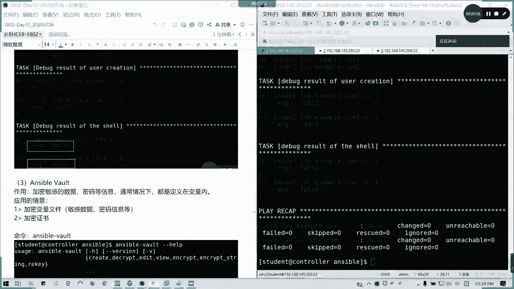

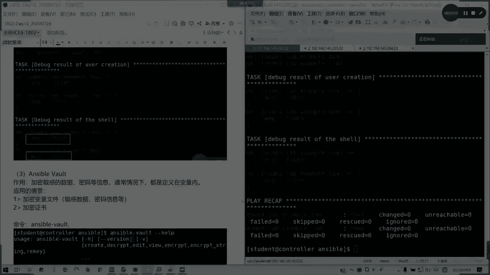

## 概述
在本节课中，我们将要学习 Ansible Vault 的核心功能。Ansible Vault 用于加密敏感数据，例如密码和变量。我们将学习如何创建、查看、编辑、解密加密文件，以及如何在 Playbook 中安全地调用这些加密数据。

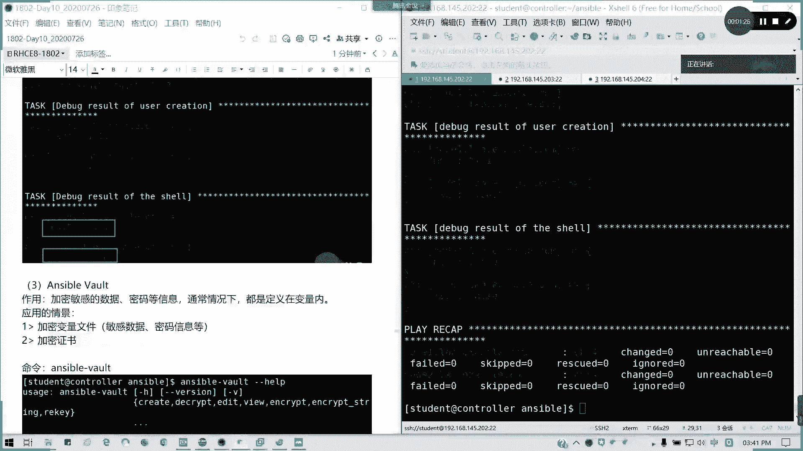

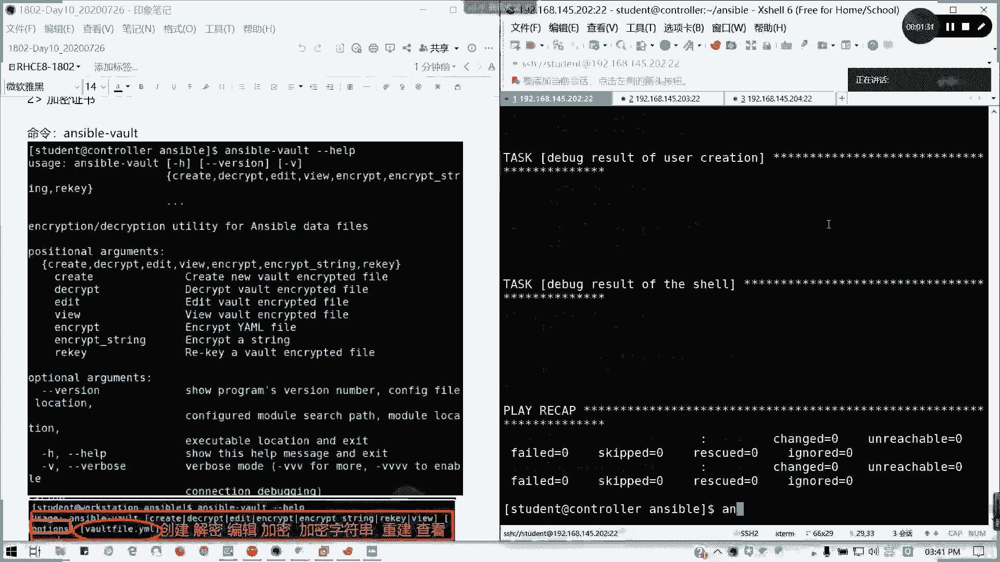

---

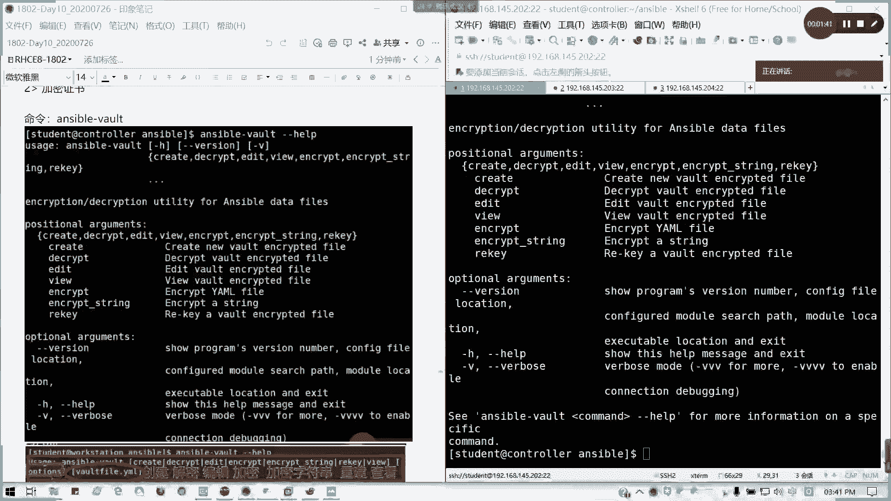

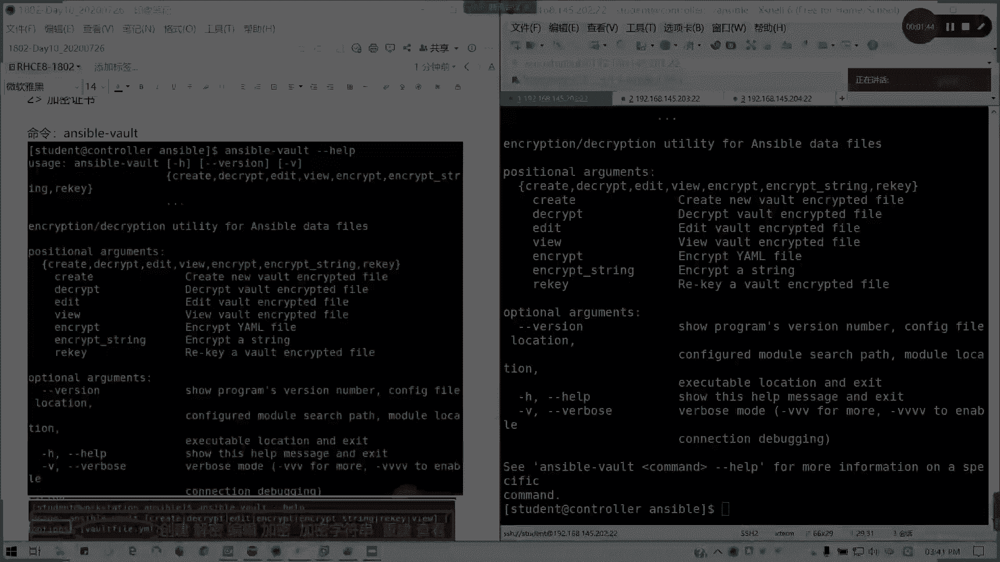

## Ansible Vault 的作用与场景
上一节我们介绍了 Ansible 的其他高级功能，本节中我们来看看 Ansible Vault。

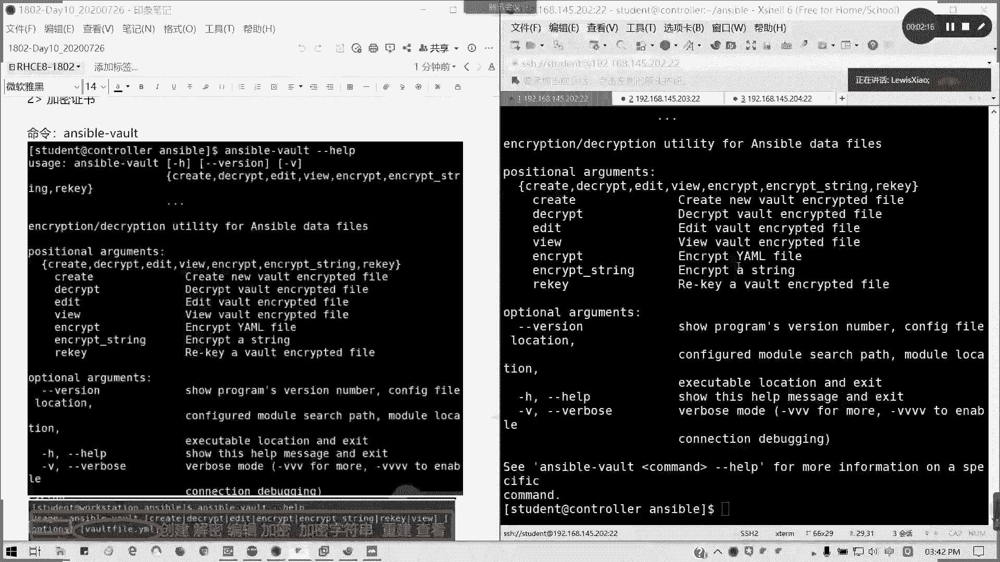

Ansible Vault 的作用是加密敏感数据，例如密码等信息。这些数据通常定义在变量文件中。其典型应用场景是加密变量文件或证书文件。本课程主要讲解加密变量文件。

## Ansible Vault 的基本用法
以下是 `ansible-vault` 命令的常见用法。如果对命令不熟悉，可以使用 `ansible-vault --help` 或 `man ansible-vault` 查看详细帮助。

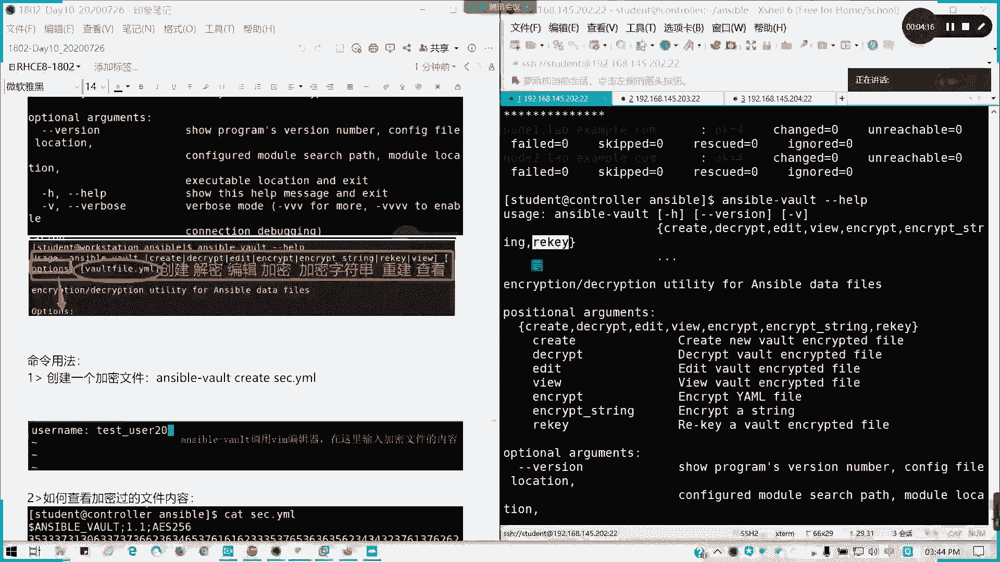

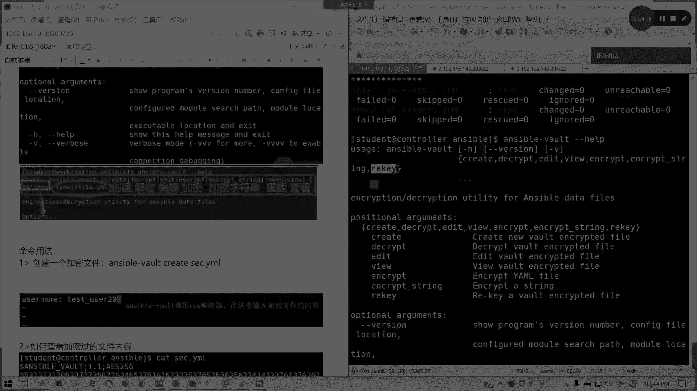

主要功能包括：
*   **创建**加密文件
*   **查看**加密文件内容
*   **编辑**加密文件
*   **解密**加密文件
*   **加密**已存在的文件
*   **更改**加密文件的密码
*   **加密字符串**

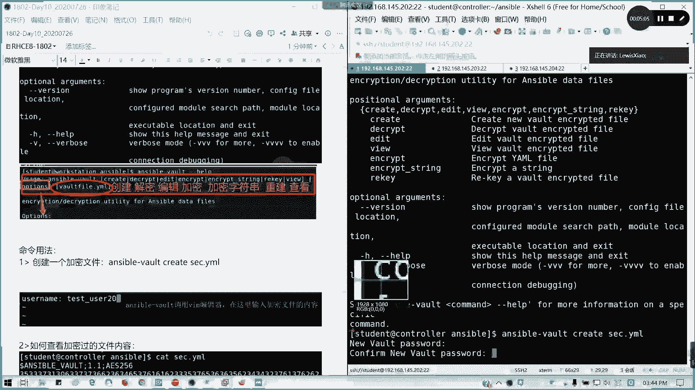

接下来，我们将通过实际操作来讲解其中几个核心功能。

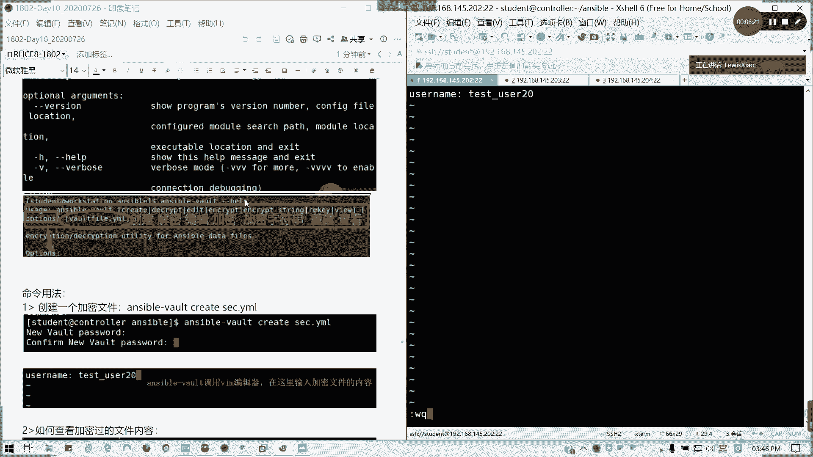

## 创建与查看加密文件
首先，我们学习如何创建一个加密的变量文件。

使用以下命令创建一个名为 `secret.yml` 的加密文件：
```bash
ansible-vault create secret.yml
```
执行命令后，系统会提示你输入并确认加密密码。随后，它会调用 Vim 编辑器，你可以在其中输入要加密的内容。

例如，在编辑器中输入以下变量定义：
```yaml
user_name: tuser
user_id: 20
user_shell: /bin/bash
```
保存并退出后，文件即被加密。使用 `cat secret.yml` 查看，你将看到加密后的乱码内容。

要查看加密文件的原始内容，需使用以下命令：
```bash
ansible-vault view secret.yml
```
系统会提示输入密码，输入正确密码后即可查看明文的变量内容。

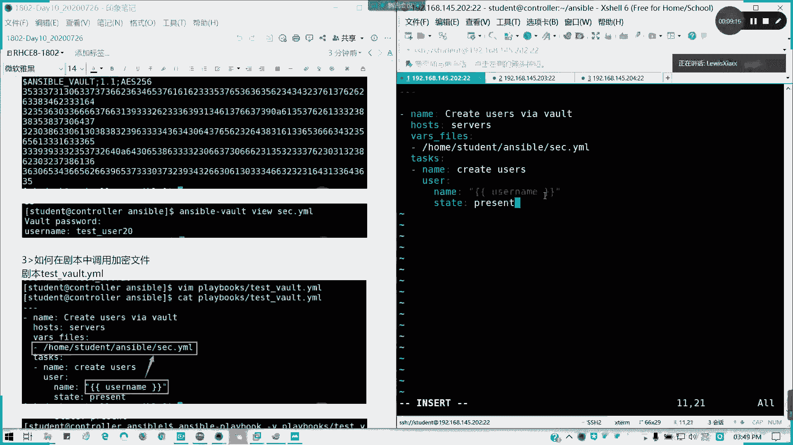

## 在 Playbook 中调用加密文件
我们已经创建了加密文件，现在来看看如何在 Playbook 中调用它。

首先，创建一个名为 `create_users_vault.yml` 的 Playbook：
```yaml
---
- name: Create Users via Vault
  hosts: servers
  vars_files:
    - ./secret.yml
  tasks:
    - name: Create user
      user:
        name: "{{ user_name }}"
        state: present
```
这个 Playbook 通过 `vars_files` 引用了我们之前创建的 `secret.yml` 加密文件。

直接运行此 Playbook 会失败，因为 Ansible 无法获取解密密码。有以下三种方法可以提供密码：

**方法一：运行时交互式输入密码**
使用 `--ask-vault-pass` 参数，运行时会提示输入密码。
```bash
ansible-playbook create_users_vault.yml --ask-vault-pass
```

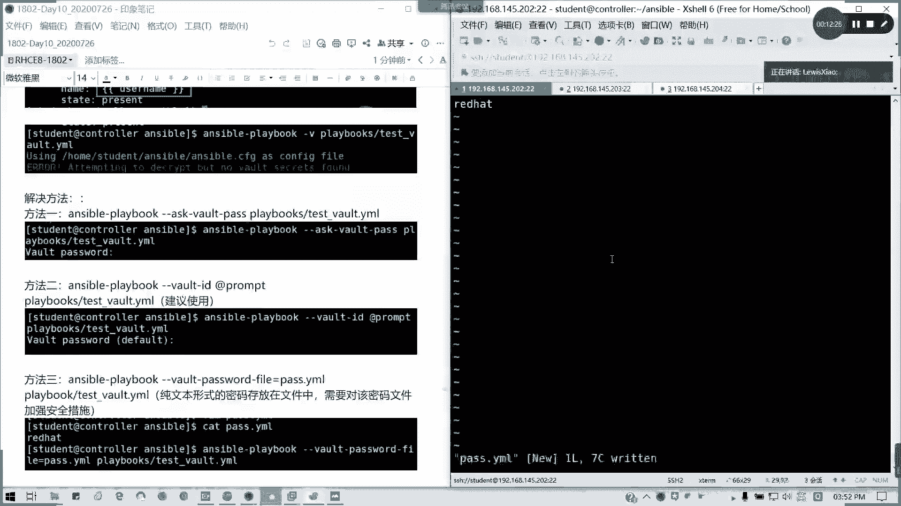

**方法二：通过密码文件（推荐）**
首先，创建一个包含密码的纯文本文件，例如 `pass.txt`，内容就是加密密码（如 `redhat`）。
然后，使用 `--vault-password-file` 参数指定该文件。
```bash
ansible-playbook create_users_vault.yml --vault-password-file=pass.txt
```
**注意**：此密码文件本身是明文的，务必将其设置为隐藏文件（如 `.pass.txt`）并妥善保管。

**方法三：使用 Vault ID（较新版本）**
此方法涉及更复杂的配置，在基础学习中可先了解。它使用 `--vault-id` 参数来标识和提供密码。
```bash
ansible-playbook create_users_vault.yml --vault-id @prompt
```

## 管理加密文件
除了创建和查看，我们还需要掌握对加密文件的日常管理操作。

**解密文件**
使用 `decrypt` 命令可以将加密文件永久解密为明文文件。
```bash
ansible-vault decrypt secret.yml
```

**重新加密文件**
使用 `encrypt` 命令可以重新加密一个已解密的或普通的 YAML 文件。
```bash
ansible-vault encrypt secret.yml
```

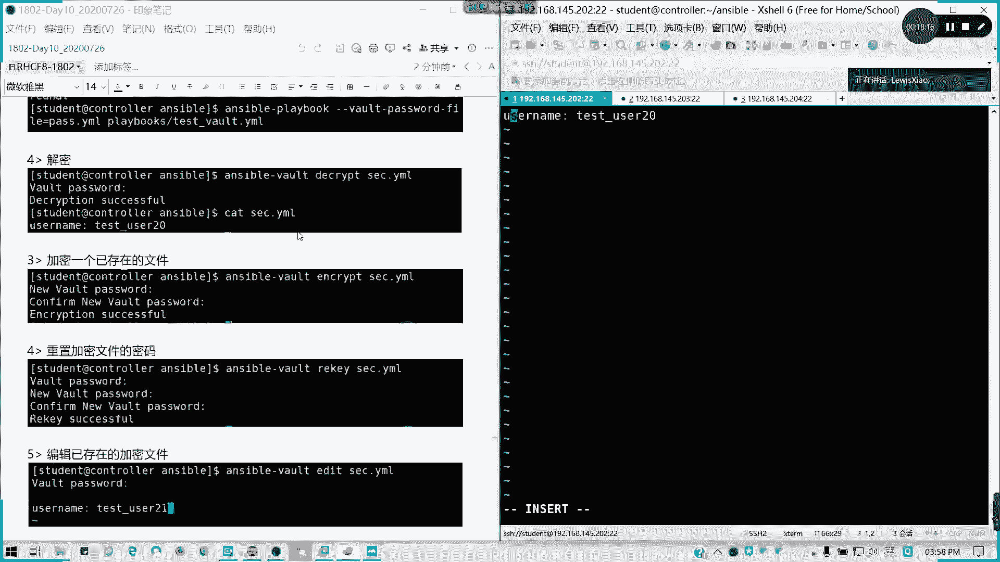

**更改加密密码**
使用 `rekey` 命令可以更改加密文件的密码。命令会先要求输入当前密码，然后输入并确认新密码。
```bash
ansible-vault rekey secret.yml
```

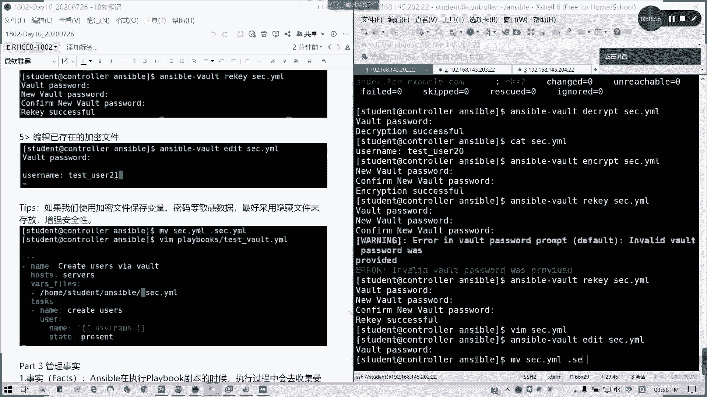

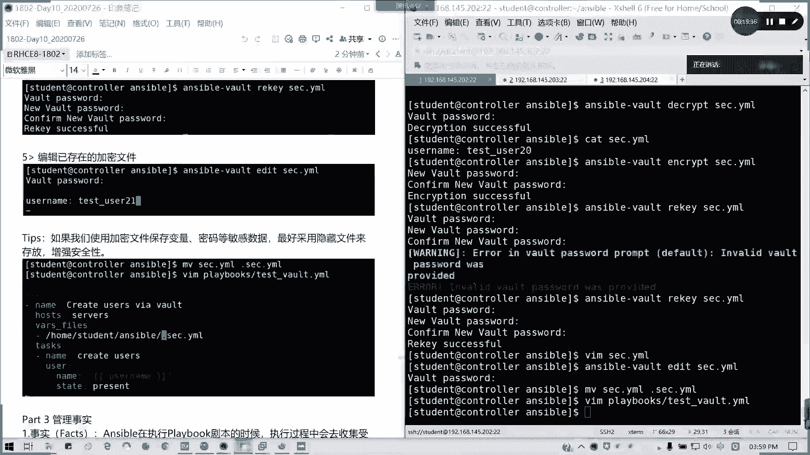

**编辑加密文件**
不能直接用文本编辑器打开加密文件进行编辑。必须使用 `edit` 命令，它会提示输入密码，然后在编辑器中打开解密后的内容供你修改。
```bash
ansible-vault edit secret.yml
```

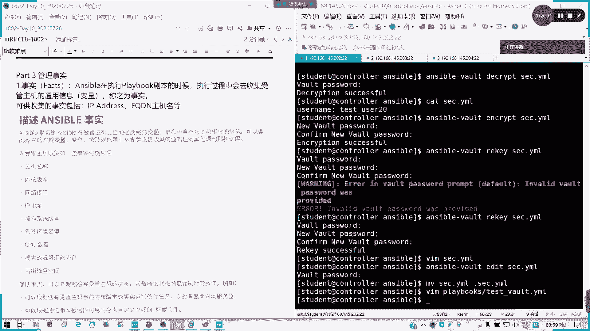

## 总结
本节课中我们一起学习了 Ansible Vault 的使用。我们了解了它的作用——加密敏感数据。我们掌握了创建 (`create`)、查看 (`view`)、编辑 (`edit`)、解密 (`decrypt`) 和更改密码 (`rekey`) 加密文件的方法。最重要的是，我们学会了三种在运行 Playbook 时提供解密密码的方式，其中使用 `--vault-password-file` 指向一个隐藏的密码文件是推荐的做法。合理使用 Ansible Vault 可以显著提升自动化脚本中敏感信息的安全性。