# 拿下证书！Redhat红帽 RHCE8.0认证体系课程 RH124+RH134+RH294三门认证视频教程 - P64：64_Video_Day11_Day09Day10回顾01 - 16688888 - BV1734y117vT

9点56分我们开始录屏啊开始录屏。那我们现在开始我们的课程啊，首先我们Sible我们讲了两天了，对不对？我们讲了两天，然后呢，可能我们现在隔的比较久哈，隔得比较久，我们开始来。

重新给大家梳理一下我们的一个思路。好吧，回以梳理一下思路。首先ensible是什么？enssible用来干嘛的？ensible其实是一个自动linux的一个自动化的一个运维工具啊，自化运维工具。

我们通过这个图啊这个图我们。书上的这个图可以。来进行啊，说完这个图，我们来可以进来可以进行一个。可以通过书上图来进行我们的一个回顾哈，一个回顾。书上的图是什么呢？里面啊我们的控制节点对不对？

我们控制节点，然后呢通过。发号施运方式相当于我们一个指挥部哈，像一个指挥部。然后呢，我里面跟我我的那个下面的下属，我的士兵啊，士兵，然后那个。建立了性任关系，通过我们的。SSH我们的一个无密钥连接。

对不对？通过我们的无密钥连接，然后去建立信任关系，相当于哎我认识你啊，我我知道你是好人，那我以后我连接我这来我我这个客户端的时候，我就不需要去进行一个验证了，对吗？要进行一个验证了，所以的话。然后呢。

我跟你取得了信任关系之后，我是不是可以就是说哎。我默认我就我知道你是一个好人，好了。我可以发号司令，对吧？发号司令，然后是去只同步1一台机或者是多台机，可以执行我们的一个任务，对吧？当执行任务呢。

我们有。讲到起点啊。讲到几点。第一个，我们的控制节点是干嘛的对吧？控制节点主要是承担我们的任务的一个。一个发起方对吧？一个指令的一个提供方。好，然后呢受管主机呢。

售管主机主要是我们的客户端或者是我们的被控端，可以这么讲哈，一个客户端，一个被控端，然后呢，资产清单，对吧？资产清单也就是我们的受控主机的一个列表。可以明白吗？受控主机的一个列表。这剧本呢。

剧本是什么啊？剧本就是我们的一系列的任务，或者是。命令。对吧OK。那接下来我们既然。我们既然要完成这个东西啊，完成这个东西呢。那我们是来来看一下啊，我们来我们来看一下就是如何安装，对吧？如何安装。

如何去配置我们的环境。我们来看到我们的屏幕啊。

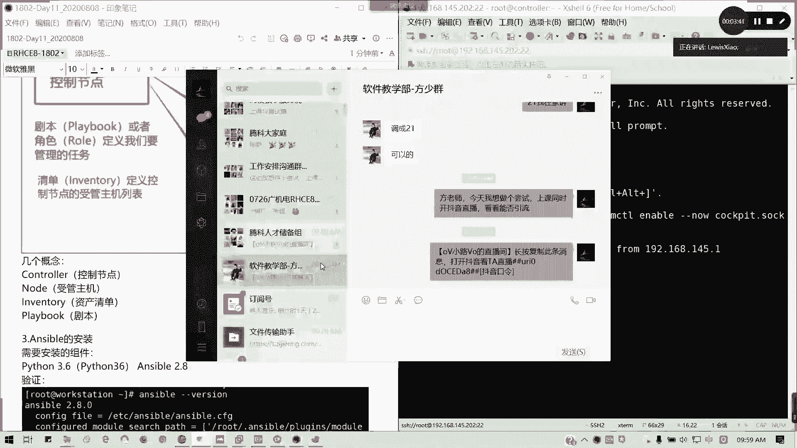

看好屏幕，这里要sible的安装。我们这里的话是用三，我们是用re8来进行。

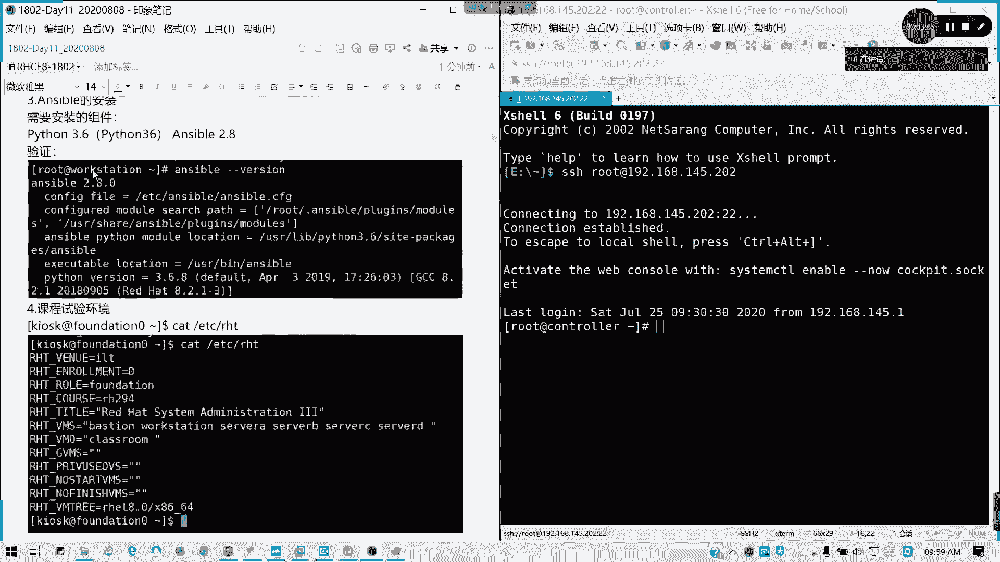

用618进行呢，我们首先是不是我们的那个样元要配好，然后我们是有一个叫做。EPL的啊EPL我们的一个环境啊，EPL我们的一个extra package，我们的一个安装包，对吧？

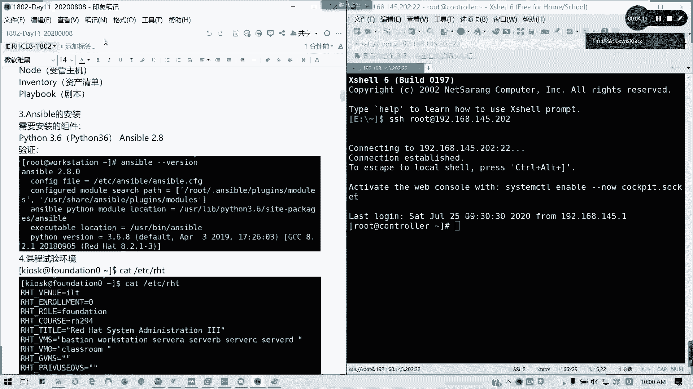

但这个课程实验环境呢，我们这里可以如果大家有运行到我们的课程实验环境的话，那大家的话会看我们可以切到294。但是呢如果是我们像我们上次说的一个独立安装的一个环境就不需要了，懂我意思吗？

课程我们的课我们实验环境呢，通常是在考前辅导，我们接下来9月6号13号我们会进行两天的考前辅导，也是我讲的哈，考前辅导的话，主要是主要就是针的是针对我们的，我们应该说综合练习吧，对吧？综合练习。

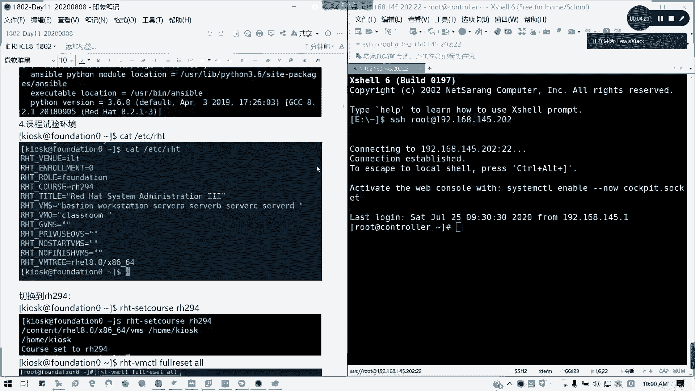

综合练习，也就是针对我们学的东西，然后解我们一个模拟试题来进行我们的一个练习。到时候我们才用到我们的实验环境。现在呢我们就按照我们的一个。

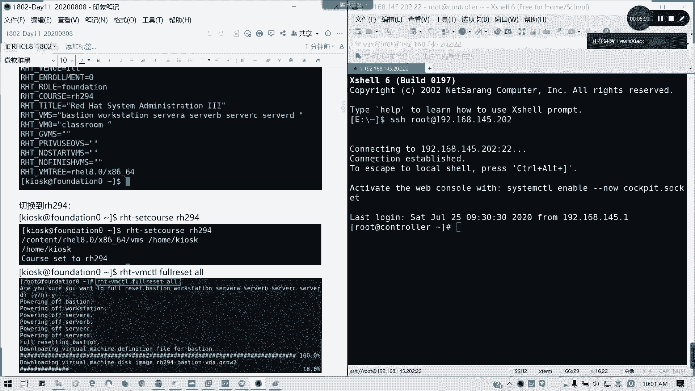

自己搭的一个东西啊，自己搭自己搭的一套环境我们来进行就可以了。这一块的话，大家安装跟配置都知道怎么办的啊。

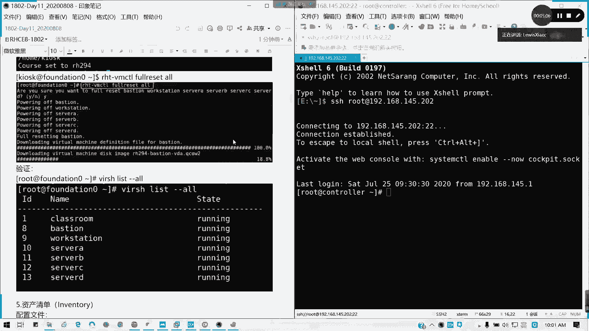

因为其实像上次我们教大家如何去。手动的去配置的话，其实更好。为什么？

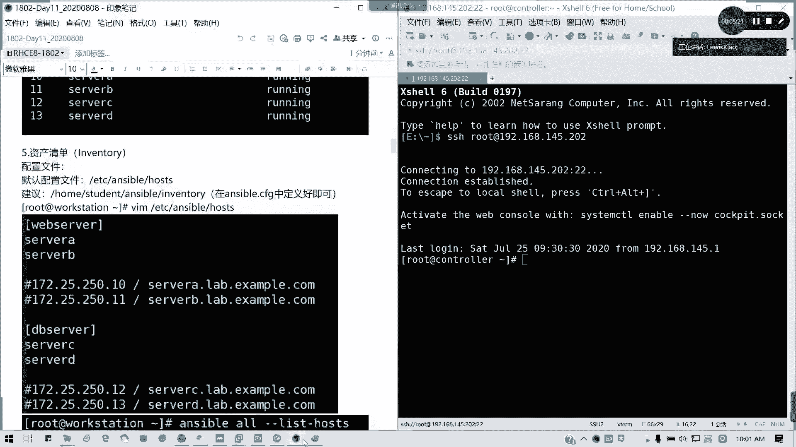

因为呢你手动去安装配置过了，对吧？手动去安装配置过了，那你至那你至少哎我这个应用范围。是不是更大了，对不对？所以我把这这一些地方我重新复制过来，因为这些的话才是我上周。更新的一个内容。对吧。

把这个地方先复制过来哈。因为我刚才贴过来那个地方嗯，那那些知识，这那些还是我之前啊之前就通过我们的一个实验环境来进行的。

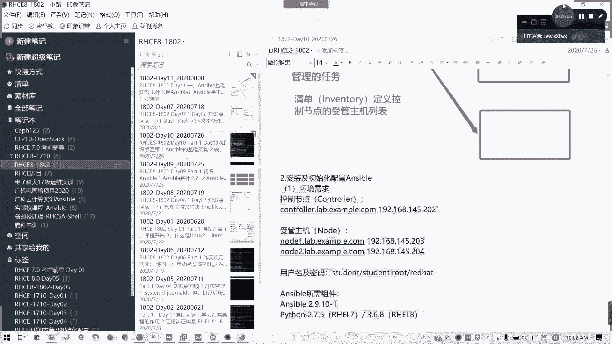

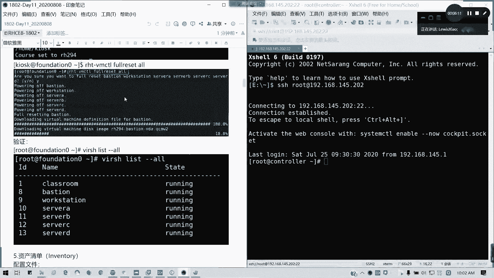

这是第三点哈。第三点，安装跟配饰ensable。然后呢，接下来第四点。安卓怎么知道吧。然后第四点呢，我们的一个初始化配置，对吧？初始化配置资产清单。刚才说的我们的一个受管组机一个列表啊。

收款组织一个列表，我们。默认的配置文件是在我们看一下anible杠杠风，对不对？按刚刚ion的话，我们这里是装的2。9。10，现在最新的版本貌似是有2。9。11了啊。

然后呢我们的默认配置文件是在ETCSS点CF区里面。但是我们后面呢包我们的真实考试或者是我们综合练习呢，我们都是会切到普通用户，我们去自定义一个。就是以工作目录为单位的一个配置文件，懂我意思吗？

以工作目录为配置为单位的一个配置文件。然后呢。我们这个资产清单，我现在切到student用户下面。🎼我现在的enser杠刚f是不是已经我们之前是不是在建已经建立过了，在ens在ensom目录下面。

公众目录下面的一个enser点CG，对不对？好，然后呢。我们看一下资产清单，我们自定义的叫做inventory。inventory呢这里我可以如何我们怎么去定义我们的资产清单。

首先我们是不是可以可以做不分组的单条记录。不分组单调记录，我就直接写域名或者是IP地址。注意域名跟IP地址，它是两条不同的记录，在资产清单里面会视为两条不同记录，能明白我意思吗？然后如果是域名的话。

麻烦请做好应解析。域名请做好运点析。在我们实验的环境里面。因为我们的node一跟note2，我们是没有对外提供服务的对吧？只在局部里面。

所以的话我们必须要在ETC下面的host这个文件在这里我们把应解析3每台机的三台3个域名跟IP全部填到里面。而且这个是不需要去重启服务的，即时生效啊。然后呢，说到当前记录，我们还有分组分组的话。

比如说像我这个node一是在web server组，node2是在DBserv组，对不对？DBserv组，然后分组的话，下面就写各自的成员，然后我们还可以通过。范围来指定我们主机。

比如说node一note2是吧？node一。冒号二是吧，或是点点点点到点点范围是更大或冒号都可以啊。一般我们说冒号两个点的话也就也有这个范围的。可以可以明白吗？你这样的话，有屏幕的话就一边看一边操作嘛。

一一边看一边操作OK然后呢，接下来就是我们还有一个就是组中有组。我们的大组对不对？我们大组，比如说这里我web server是note1DB server是note2。

然后我service里面还有我可以把它汇总成一个大service，然后service是冒号chren，对不对？这service冒号 childrenren。

然后后面的话是web server跟DB server。对吧然后接下来我们会提到一个叫做免密要认证。对吧免费要认证这这这个地方呢，我们是不是在124我们的第十章已经讲过了。

我们在这里的话可以按照默认选项来进行处理。但这里我要给大家说一下，我们在练习综合练习里面，或者是我们的真实的考试环境里面呢。是这样子。他会告诉你哪个用户已经做完了。

就已经就我这几台机器考我们的真实考试应该是6台机器练习，我们综合练习我们的我们的一个模拟环境呢是有5台，其中有也是6台，但7台吧，但是有两台，我们是不需要去动它的。

因为一台classroom台 space是不需要去动它的。考试呢是真实考试，我记得是一台呃有T一一台我呃叫conttrol，然后其他是serv A到servE嗯。作为A导设为E，然后呢。他已经说了。

有几台用就几个用户已经做做了绵密的关系啊，所以的话就记得我们是需要去对应的用户，就是像我这里的student一样。就有些最近的一些啊测试的反馈呢，有些学员为什么只得了11分？那有些人为什么能过？

有些人做到此做，哎，这些题目我会。这题目会，但是为什么只拿了11分？就是因为他没看清楚我的考试说明，没看清楚到底我这个asible，我这个控制端。是要去哪做的？懂我意思吧？就具体用户你要知道。

而不是说你在root下面乱吃不是乱敲一通，你经全部做一遍。哎，我剧本也能跑，也能正常运行，但就是没分，对吧？S股约10个部分，待会儿我会告诉大家的啊，10个部分我上次也估计有提过。我们30号的话。

我们是有那个在在这边，在广州这边是有第二场的考试，而且我看大家考的效果还不错啊，比第一次要好。我们生成这些公司要做后呢，我们是不是通过copy ID啊？对吧。我是通过copy IDD。

然后把它对应的密钥复制到记得是对应的用户上啊。对应的用户上啊，待会跟大家互动一下啊，我们附责对应的用户上，然后这样的话，我是不是可以实现免费登录。然后如果是双向的。

那是不是要反过来做我们现在做的免密是单向的。懂我意思吗？比如说我现在的我是controller，我们现在模拟的目的呢就是发号单项发号司令，那我就做单项就可以了。那如果我们以我们有双向的场合呢。

那是不是要两边都要做？比如说我从note2，我复试文件到note一，那是我要做双向认证。但这个在我们的练习环境，在我们考试是不需要去操心的。然后如何验证我们的主机列表？Anerible杠。哦。

host对不对？list host，对不对？不用杠尬哦啊，我们主机写在前面的。对吧我们当前只写了两台。其实上如果你IP跟我们的域名啊跟我们域名是。他会认成四台的，我们现在只有两台，对不对？正值值。

真实情况下只有两台，我们现在总共4台啊，总共是两台机器而已。我们其实上就是note一跟note2。如果大家把IP跟域名分开写的话。是有4台的。好，接下来我们来看配置文件。配置文件呢我们说过三个优先级。

一个S环境呢不可能没有配置文件。对吧不可能没有配置文件，那优先级最低的呢就是全局的配置了。全区的配置文件在哪哪一个目录呢？在answer Eanwer某录下面的answible点CFG。

如果我们没有为用户或者是没有为工作目录创建配置文件的话，我们默认就在这里了，懂我意思吗？好。它当然里面是有个完整的事例，我们哎怎么配置文文件怎么写呢？就在这里面写。OK然后接下来还有一个就是用户主目录。

我们刚才我们的全局的生效范围是整个系统。好，我们的如果我们在用户的加目录里面。任何用户啊不仅仅是路此啊。我在里面，如果新建一个叫做。点点CFG注意这里有个点，因为它是一个隐藏文件，对吧？隐藏文件。

然后这里建定了之后呢，如果存在此配置，而且当前沟通目录也没有我们的anCFG的话，就用拉来取代。也就是说它的作用范围是当前用户。当前户都生效，然后最优先级最高的话就是我们现在的情况。

我们现在是不是在home student目录下不了艾啊，对吧？在这个目录里面生效优先级最高。他是但是他的生效范围仅限于我们的。当前目录。但这有个好处有个好处，什么好处呢？好，这这这样的好处呢是在。

我们的我们可以应用在多场景，对不对？比如说我这里。我S目录我可以管理。当我其他111234，我node一node2，像我以后这能弄出三都4，我不同项目了，我可以再建立一个工作目录，再放一个配置文件。

那这样的话我可以。不会互相影响，每层每个工作目录的受管主机都是相同的啊，不同的啊都是不同的那这样的话，我们是不是可以那个。每个角度啊，就这样是不是我们可以进行一个。

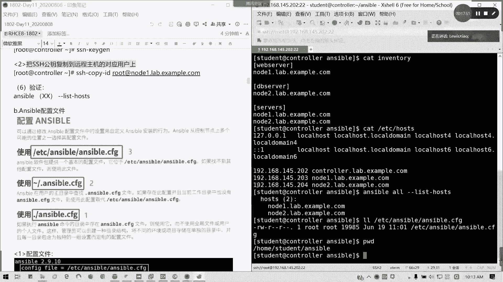

多任务的配置啊。对吧多任务我们可以适应多环境的配置。好。那这样的话，我们讲完我们的配置文件的一个优先级啊，这样好像还有同学刚进来啊，我看今天是32个人，还有在抖音直播间能够看到啊。

看到其他的一些朋友进来。那欢迎各位。然后接下来我们来看一看我们的一个配置文件。这个配置文件优先级，我不用再说了。

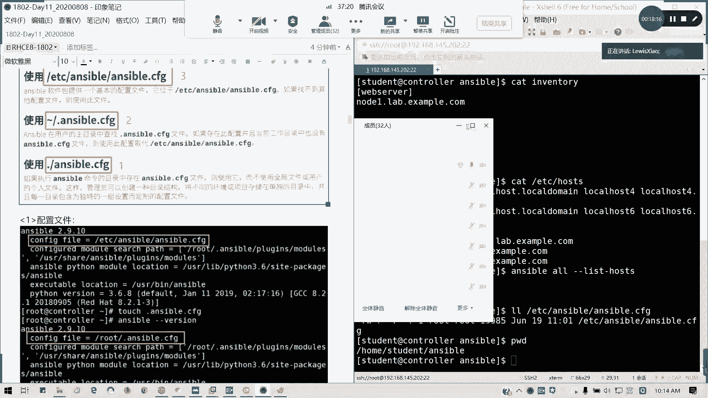

接下来我们来看一下我们的。配置文件的结构啊配置结构。首先deforse配置结是会有的吧。deer配置节有的话，我们接下来配置节里面主要写什么东西呢？首先我们的一个。资产清贷。一个资产清单啊。

一个资产清单。然后呢，资产清单里面定义了我们的售管主机的一个路径啊，售管主机的路径。然后接下来。我连接受管主机的时候，需不需要输入密码？对吧需不要输入密码。然后呢。

还有呢就是我的受管主机的一个远程端口号，对吧？默认我们是通过22来进行我们的远程。那如果。我端口发生改变呢，那是不是这里要改，对吧？跟我们的。🎼一个一个配置文件啊。

🎼在我们的跟我们的ETCSSHSSSHD点comfi。跟这里有关啊。跟这里有关SSHD点config，然后我g一下。井号port对不对？看一下哦，我这里要补答括号，因为减号是一个特殊字符。没有啊。这里。

对不对？跟这里有关系。跟这有关系。如果你受管主机的端口改了，你记得把远程的端口号对应改了。然后还有我们的远程的我们的受管主机的登录用户，对吧？做管主机的登录用户就看到底是我们是用哪个用户了。但记住。

我们还是习惯性的不要用root，用普通用户就可以了。

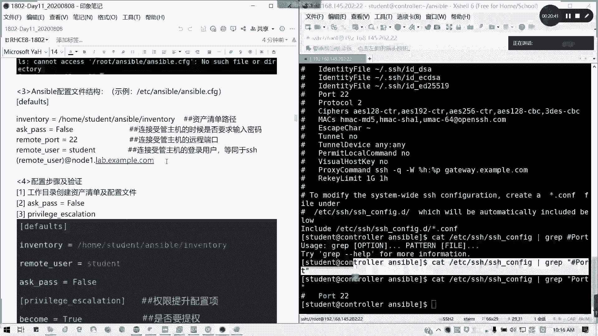

用普通用户啊，这里我们我们记得用普通用户啊。然后呢，接下来。接下来就是一个。一个什么呢？提全对吧？如果我们用普通用户的话，我们通常来说。有些权限你是没办法去执行的。有些权限我是没办法执行的。

比如说像我们上次演示的叫F disk。对不对？像Fdi，我们就没办法去执行我们所有的命令，那我们怎么办呢？配置pricalation。这里推荐啊，它在综合练习，我们拿到的模拟题里面，它是有一个配置。

就是说你用户用户之间是通过哪一种方法来进行提全。通常建议大家用速度啊，SUDO用SU的话，其实也不不太稳妥。因为你要把整个。

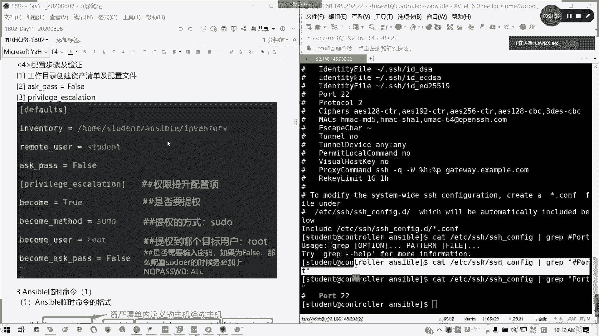

我们的。普通用户我们加到优will组里面，对吧？其加到系统用户组里面，权限太大，还不如数度来的实在，对吧？除了啊我们的privileage acalation呢。

