# Red Hat RHCE 8.0 认证课程：Day 11：Ansible 核心概念回顾与配置 🎯


在本节课中，我们将回顾 Ansible 自动化运维工具的核心概念、安装配置以及关键组件。我们将梳理 Ansible 的工作原理，并详细讲解如何设置控制节点、管理资产清单和配置文件。

---

## 概述

Ansible 是一个用于 Linux 系统自动化的运维工具。它通过一个中心控制节点向多台受管主机发送指令，从而实现批量配置、部署和管理任务。本节课程将帮助您巩固 Ansible 的基础知识，为后续的实践操作打下坚实基础。

---


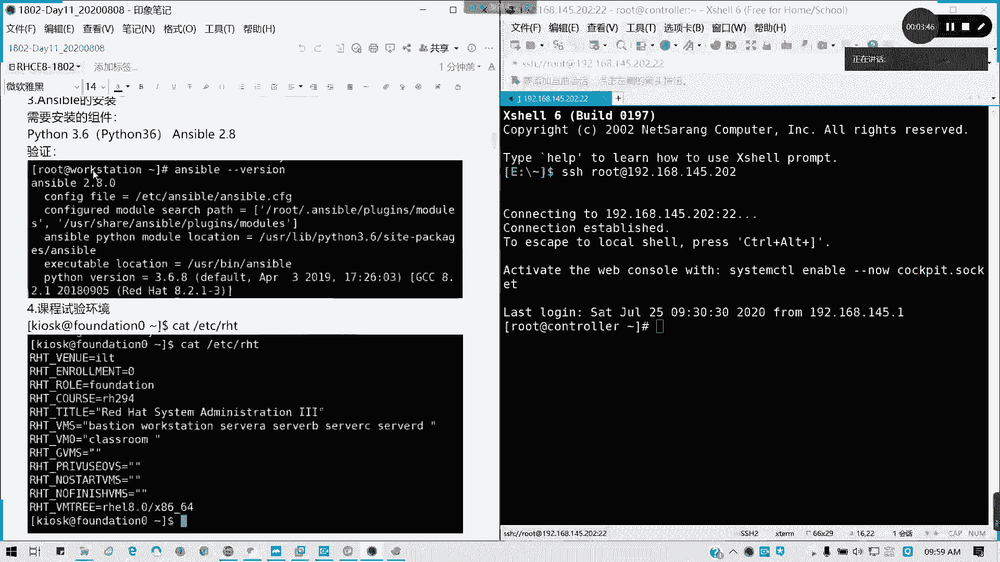

## Ansible 核心架构回顾

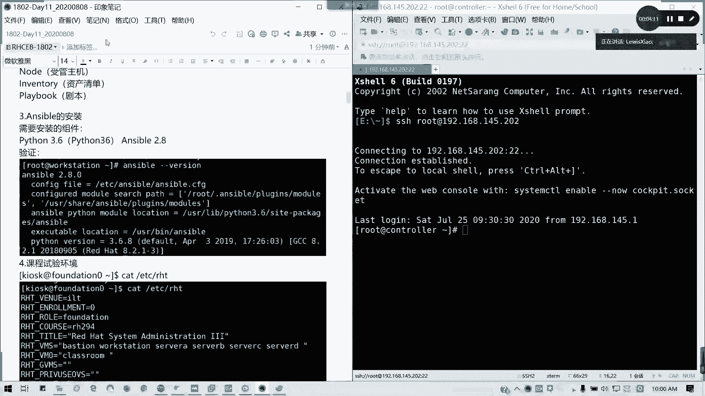

上一节我们介绍了 Ansible 的基本概念，本节中我们来看看其核心架构和工作原理。

Ansible 的架构可以类比为一个指挥部与士兵的关系。控制节点（指挥部）通过 SSH 协议与受管主机（士兵）建立信任关系，然后向其发送指令以执行任务。

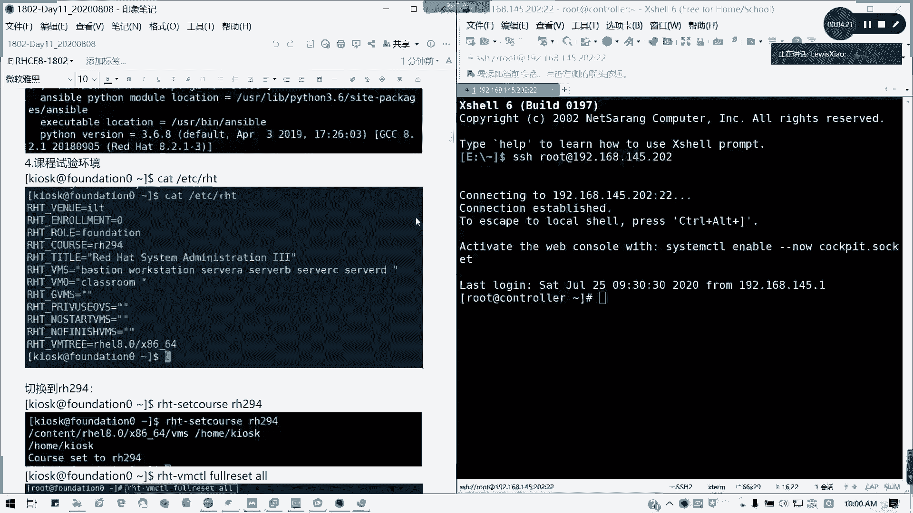

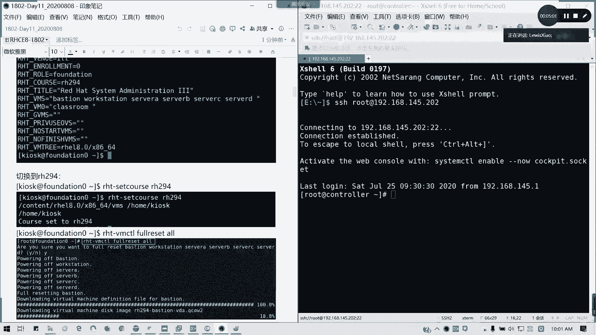

以下是 Ansible 的核心组件：

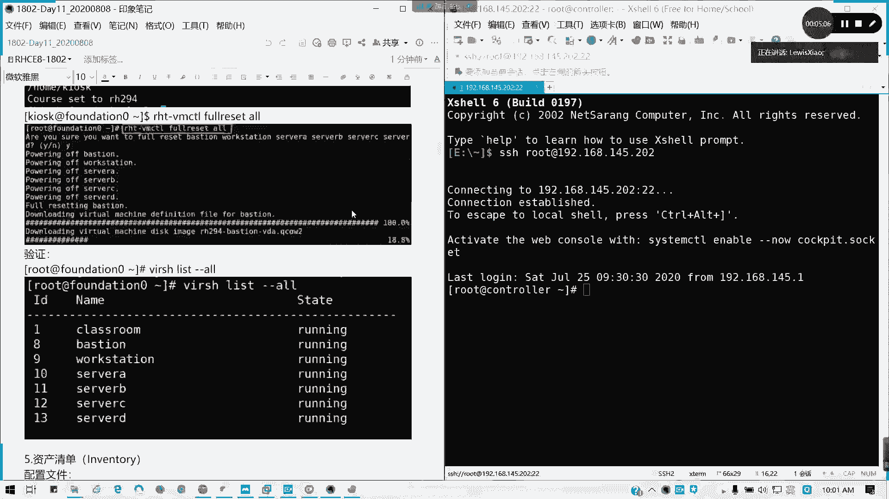

*   **控制节点**：任务和指令的发起方。
*   **受管主机**：接收并执行指令的客户端或被控端。
*   **资产清单**：所有受管主机的列表。
*   **剧本**：由一系列任务或命令组成的自动化脚本。

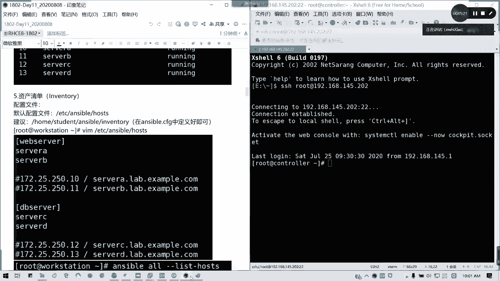

---

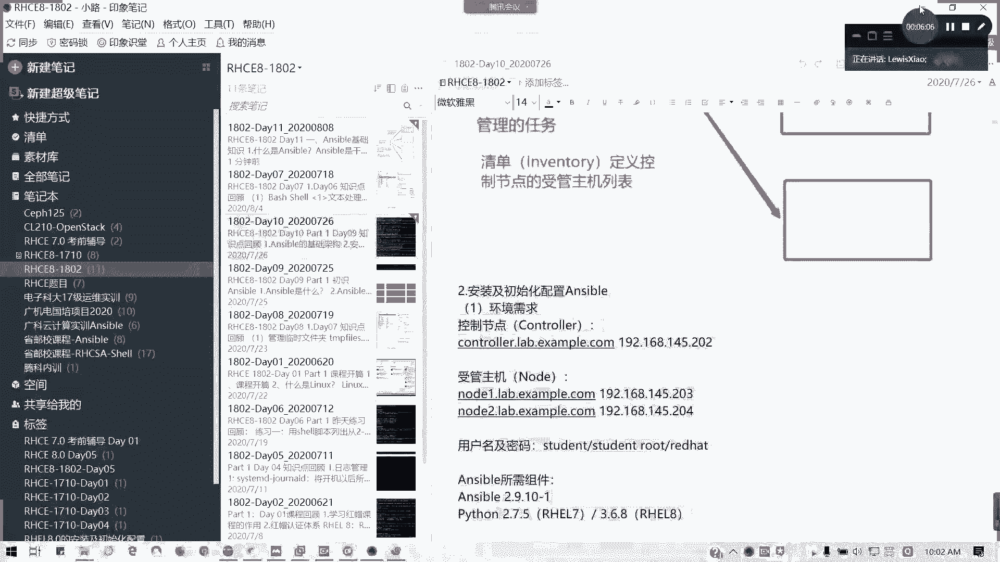

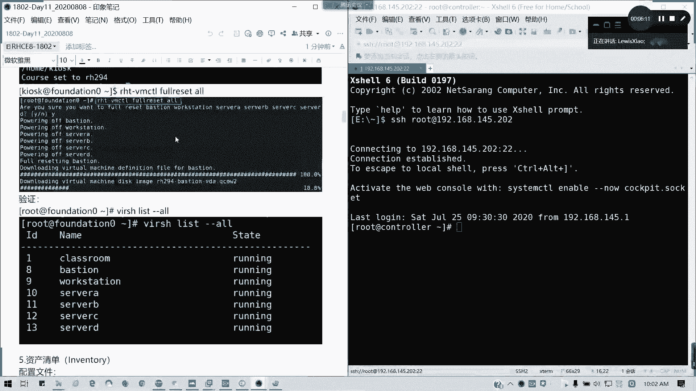

## Ansible 安装与环境配置

了解了核心架构后，我们来看看如何搭建 Ansible 环境。

在 Red Hat Enterprise Linux 8 上安装 Ansible，通常需要配置 EPEL（Extra Packages for Enterprise Linux）仓库。课程实验环境可能已预配置，但掌握手动安装方法能更好地理解其应用范围。

安装命令示例：
```bash
sudo yum install ansible
```

---

## 初始化配置与资产清单

安装完成后，下一步是进行初始化配置，重点是定义资产清单。

资产清单文件列出了所有需要管理的受管主机。默认的全局配置文件位于 `/etc/ansible/ansible.cfg`，但在实际考试或练习中，我们通常在特定工作目录下创建自定义配置文件。

以下是如何定义资产清单：

*   **单条记录（不分组）**：直接写入域名或 IP 地址。注意，域名和 IP 地址被视为不同的记录。使用域名时，请确保已正确配置 DNS 解析或 `/etc/hosts` 文件。
*   **分组记录**：将主机按功能分组，例如 `[webservers]` 或 `[dbservers]`。
*   **使用范围**：可以使用 `node1:node2` 或 `node[1:2]` 的格式指定一个范围的主机。
*   **组中组**：可以创建包含其他子组的大组，例如 `[services:children]`。

验证资产清单的命令是：
```bash
ansible all --list-hosts
```

---

## 建立 SSH 免密认证

要让控制节点能无缝连接受管主机，需要建立 SSH 密钥信任关系。

这通常通过 `ssh-copy-id` 命令将控制节点的公钥复制到受管主机上对应用户的 `~/.ssh/authorized_keys` 文件中来实现。在考试或综合练习中，务必注意题目指定的操作用户，错误用户下的操作将无法得分。

建立单向免密认证（从控制节点到受管主机）是常见场景。若需要双向认证，则需在两端重复此过程。

---

## 配置文件详解

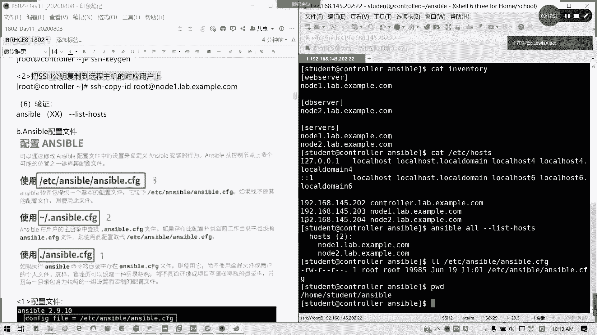

Ansible 的配置文件遵循特定的优先级规则，理解这一点对于多环境管理至关重要。

配置文件的优先级从低到高依次为：
1.  **全局配置** (`/etc/ansible/ansible.cfg`)：对整个系统生效。
2.  **用户主目录配置** (`~/.ansible.cfg`)：对当前用户生效。
3.  **工作目录配置** (`./ansible.cfg`)：仅对当前目录生效，优先级最高。

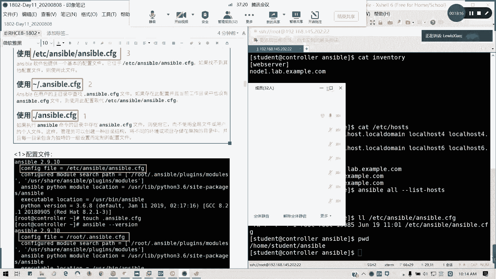

使用工作目录级别的配置文件好处在于，可以为不同的项目或环境创建独立的配置，互不干扰。

配置文件通常包含以下关键部分：

*   **`[defaults]`**：默认配置节。
    *   `inventory`：指定资产清单文件的路径。
    *   `remote_user`：连接受管主机时使用的远程用户名。
    *   `ask_pass`：是否提示输入 SSH 密码。
*   **`[privilege_escalation]`**：权限提升配置。
    *   当使用普通用户执行需要特权的任务时（如磁盘分区 `fdisk`），需要配置此部分。推荐使用 `sudo` 方式进行提权，这比将用户加入 `wheel` 组更为稳妥和安全。

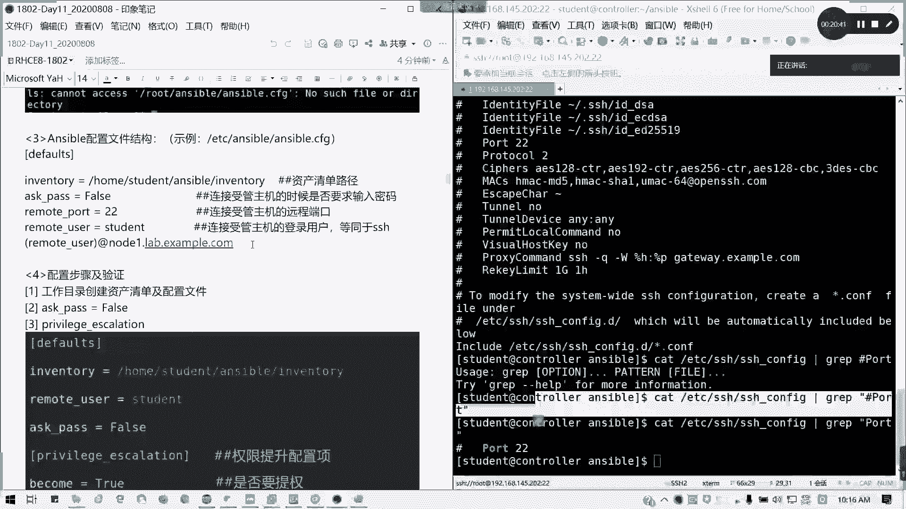

---

## 总结

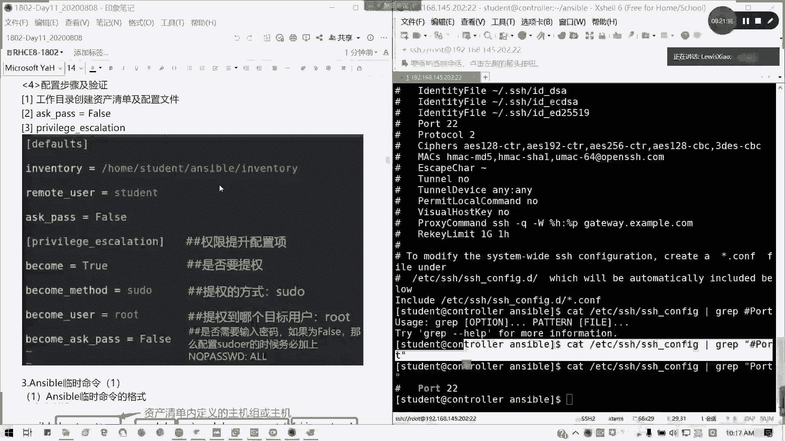

本节课中我们一起学习了 Ansible 自动化工具的核心架构，包括控制节点、受管主机、资产清单和剧本的角色。我们详细讲解了 Ansible 的安装步骤、资产清单的多种定义方法、建立 SSH 免密认证的流程，以及配置文件的优先级和关键选项。掌握这些基础知识是高效使用 Ansible 进行自动化运维的前提。