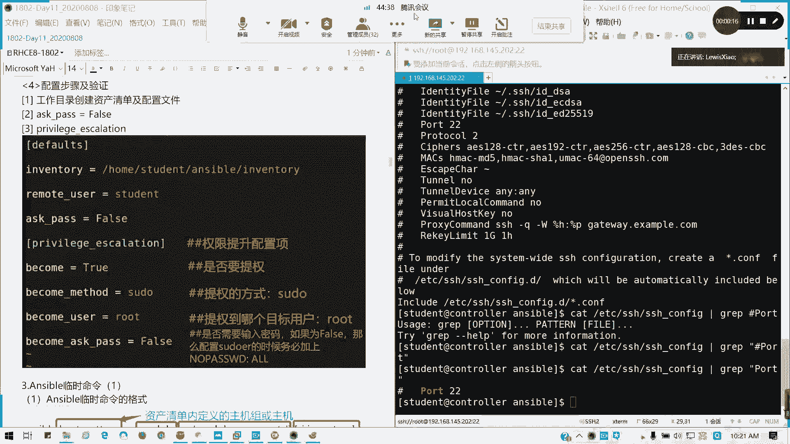
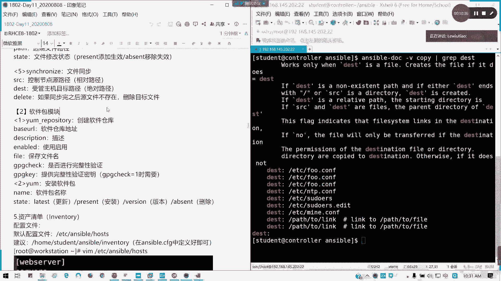
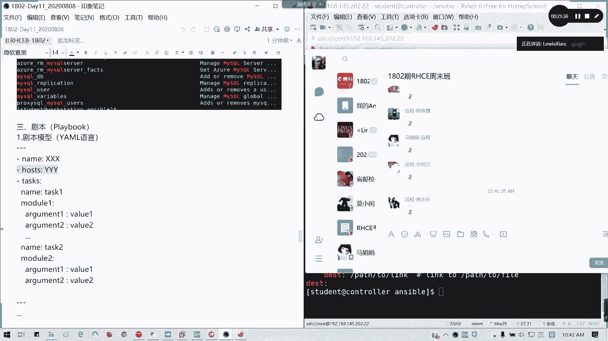
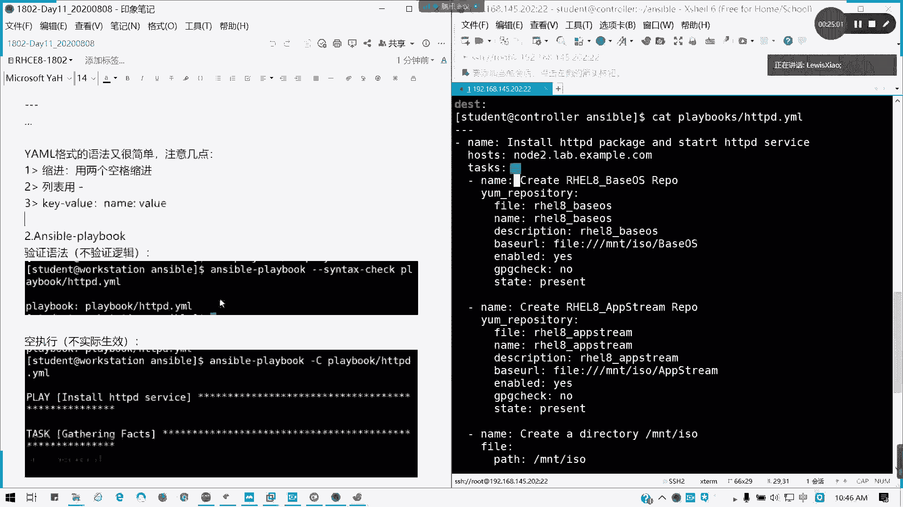
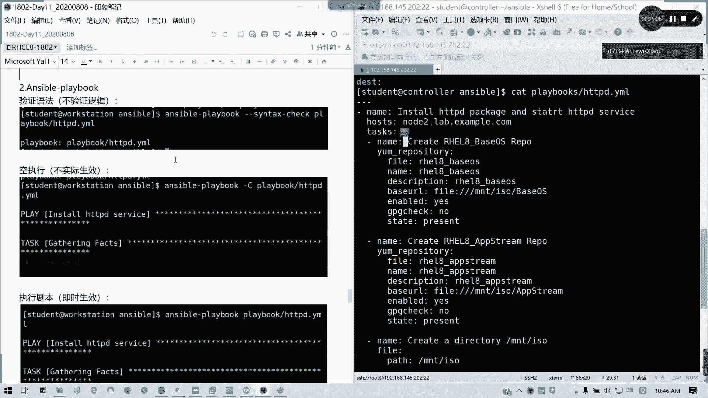
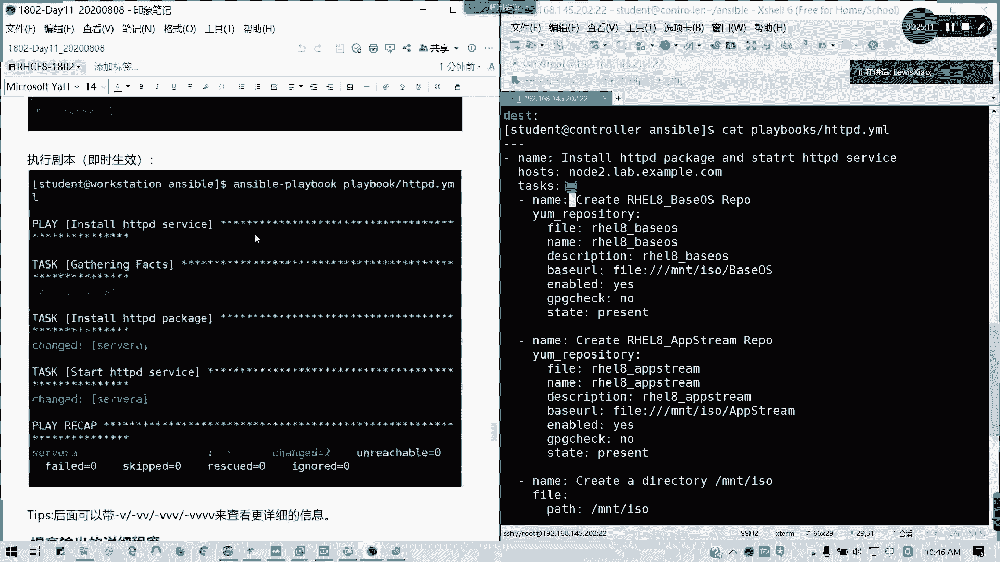
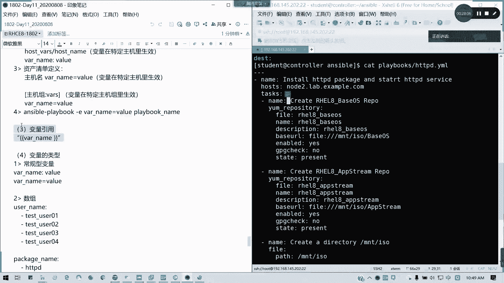
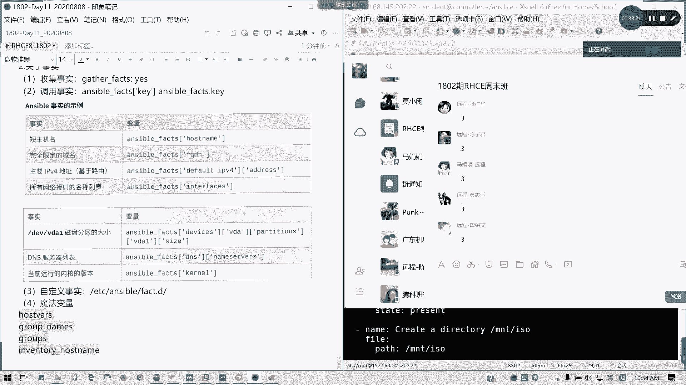
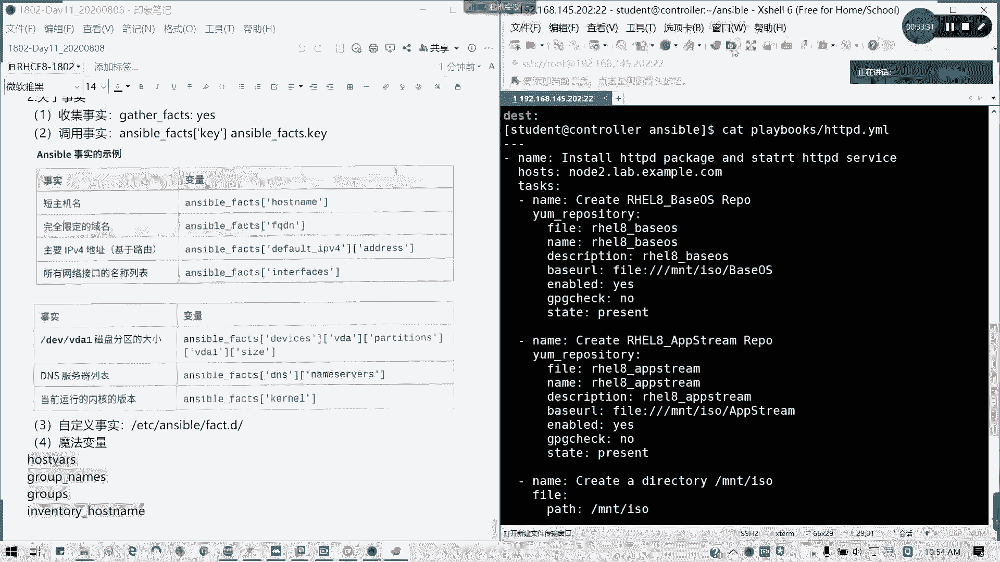
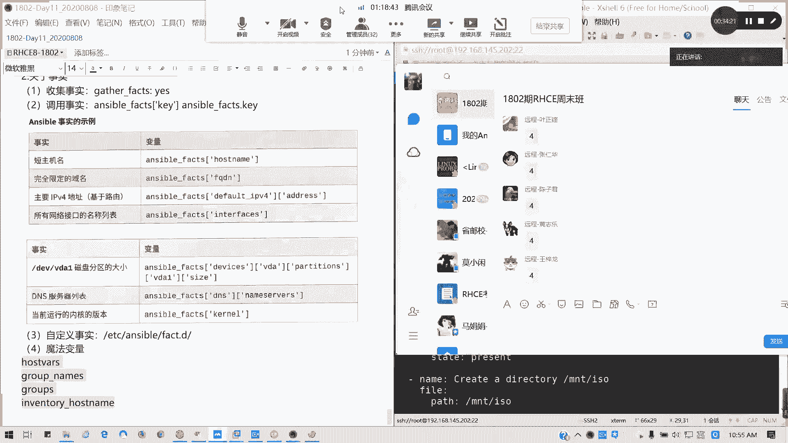

# 红帽 RHCE 8.0 认证课程：Day 11：Day 09 & Day 10 知识回顾 (第二部分)




在本节课中，我们将回顾 Ansible 剧本、变量和事实等核心概念，帮助大家巩固前两天的学习内容。

## 剧本 (Playbook) 回顾

上一节我们介绍了 Ansible 的临时命令和常用模块。本节中，我们来看看如何编写更复杂的任务集合——剧本。

剧本使用 YAML 语言编写，它就像一份详细的“任务清单”，指导 Ansible 按顺序执行一系列操作。

以下是编写剧本的基本结构要点：

*   **起始标记**：以三个横杠 `---` 开始一个剧本。
*   **剧本名称**：使用 `- name` 声明剧本的用途，便于阅读。
*   **目标主机**：通过 `hosts` 指定剧本在哪些受管主机上执行。
*   **任务列表**：`tasks` 下定义具体的任务，每个任务以 `- name` 开头。
*   **缩进规则**：使用两个空格进行缩进，确保层级关系正确。
*   **模块与参数**：在每个任务中指定使用的模块及其参数。

一个简单的剧本示例如下：
```yaml
---
- name: 安装并启动 Apache 服务
  hosts: web_servers
  tasks:
    - name: 安装 httpd 软件包
      yum:
        name: httpd
        state: present

    - name: 启动 httpd 服务并设置开机自启
      service:
        name: httpd
        state: started
        enabled: yes
```

在运行剧本前，建议先进行语法检查：
```bash
ansible-playbook --syntax-check my_playbook.yml
```
也可以使用 `--check` 或 `-C` 参数进行“空运行”（dry-run），模拟执行过程而不做实际更改：
```bash
ansible-playbook -C my_playbook.yml
```
最后，使用 `-v` 参数可以增加输出信息的详细程度，便于调试。



## 变量 (Variables) 回顾

剧本中的任务常常需要根据不同的主机或环境进行调整，这时就需要用到变量。

### 变量定义与命名

变量名可以由字母、数字和下划线组成，但不能以数字或下划线开头，并且中间不能包含点号`.`或空格。

变量可以在多个位置定义，作用域不同：

*   **剧本内定义**：在 `vars:` 部分直接定义。
*   **外部变量文件**：通过 `vars_files:` 引入。
*   **主机/组变量**：在 `host_vars/` 或 `group_vars/` 目录下为特定主机或组定义。
*   **命令行传入**：使用 `-e` 或 `--extra-vars` 选项。

在剧本或清单文件中，定义变量通常使用 `变量名: 值` 的格式（注意冒号后有一个空格）。在主机清单中，则使用 `变量名=值` 的格式。

### 变量类型与引用

变量有多种类型，以适应不同的数据需求。



以下是常见的变量类型：

*   **常规变量**：存储单个值，如 `package_name: httpd`。
*   **列表/数组**：存储同一类型的多个值，使用方括号 `[]`。
*   **字典**：存储键值对，用于描述一个对象的多个属性，使用花括号 `{}`。
*   **注册变量 (register)**：将一个任务的执行结果保存到变量中，供后续任务使用。

在剧本中引用变量时，需要使用双花括号将其括起来：`{{ variable_name }}`。







## 事实 (Facts) 回顾

事实是 Ansible 自动从受管主机收集的系统信息，如主机名、IP地址、磁盘空间等。

要启用事实收集，需要在剧本中设置 `gather_facts: yes`（这是默认值）。收集到的事实可以通过 `ansible_facts` 字典或简写形式 `ansible_facts.键名` 来访问。



例如，获取主机名可以使用 `{{ ansible_facts.hostname }}` 或 `{{ ansible_facts['hostname'] }}`。

除了自动收集的事实，还可以使用“魔法变量”来获取 Ansible 内部信息，例如：

*   `{{ groups }}`：获取所有主机组的字典。
*   `{{ group_names }}`：获取当前主机所属的组列表。
*   `{{ inventory_hostname }}`：获取当前主机在清单中定义的主机名。

## 总结







本节课中我们一起学习了 Ansible 剧本的编写结构、变量的定义与使用方法，以及如何利用系统事实和魔法变量。掌握这些内容是构建复杂、灵活自动化任务的基础。下一节我们将继续回顾更高级的主题。