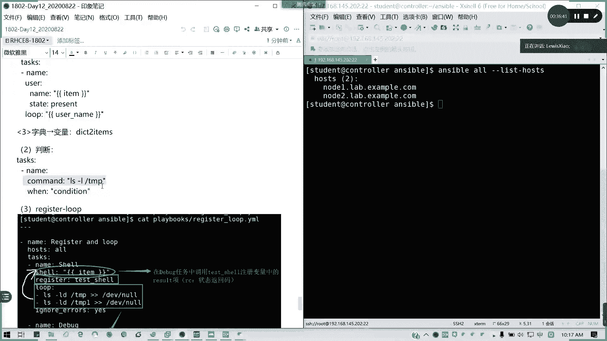
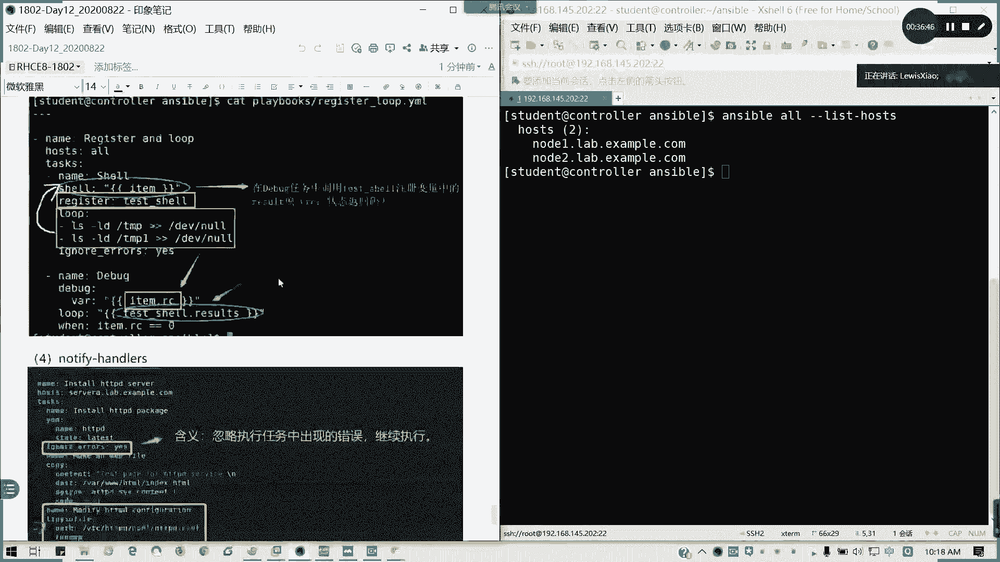
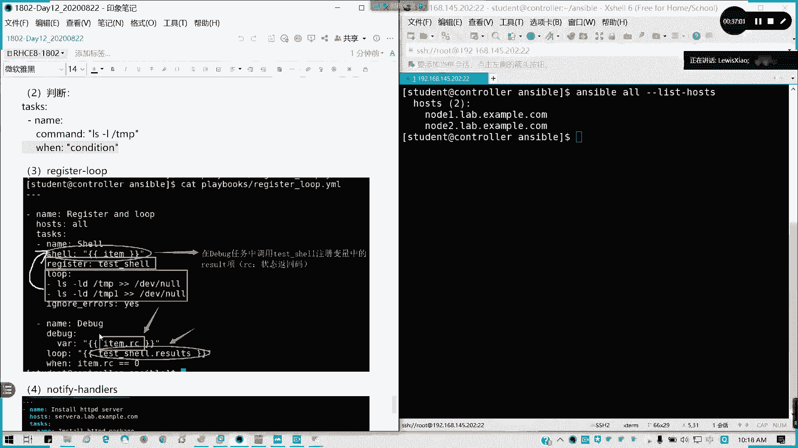
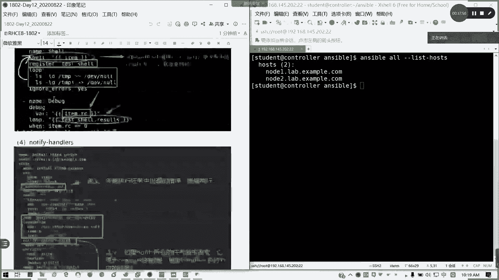
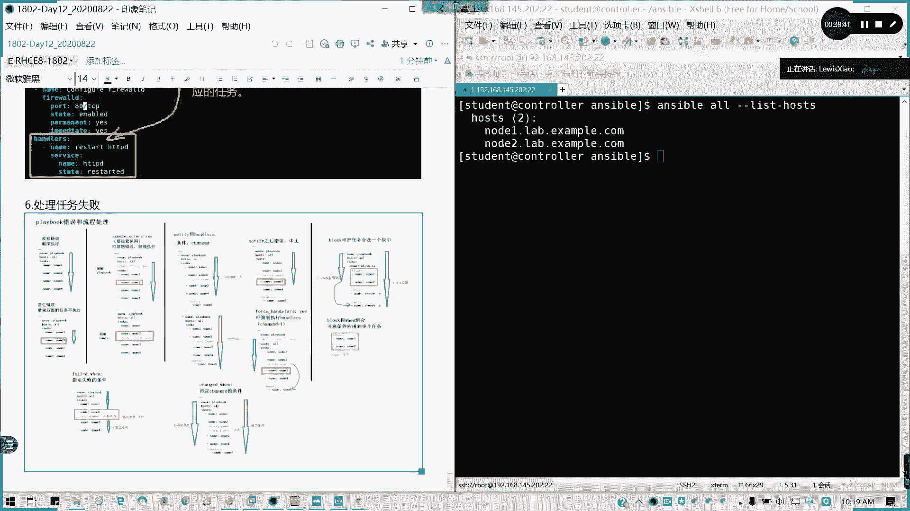
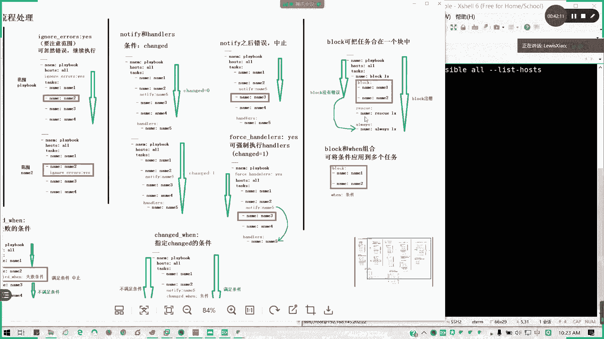
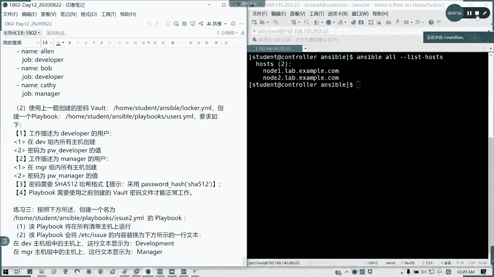

# Ansible 自动化运维：Day12：第9-11天知识回顾


在本节课中，我们将回顾第9天到第11天学习的关键内容，涵盖Ansible的基础架构、配置文件、模块使用、剧本编写、变量与事实以及任务控制。通过本次回顾和练习，旨在巩固前五章的核心概念，为后续学习打下坚实基础。

## 🏗️ 核心架构回顾

上一节我们介绍了Ansible的基础概念，本节中我们来看看其核心架构图。

Ansible的核心架构基于控制节点与受管主机的关系。控制节点作为“指挥部”，通过建立好的连接向受管主机“发号施令”，从而实现批量管理和部署。这个过程主要依赖于以下几个核心组件：

*   **控制节点**：执行Ansible命令和剧本的中央管理主机。
*   **受管主机**：被控制节点管理的目标主机。
*   **资产清单**：一个包含所有受管主机信息的列表文件。
*   **剧本**：定义了要在受管主机上执行的一系列任务，如同演员的“台本”。
*   **角色**：一种更高级、可重用的任务组织方式（本节课会涉及）。

## ⚙️ 安装与初始化配置

理解了架构后，我们需要进行环境准备。本节将回顾Ansible的安装与基础配置步骤。

### 安装Ansible
在控制节点上，只要有互联网和EPEL源，即可通过包管理器轻松安装。

**代码示例：安装Ansible**
```bash
# 在RHEL/CentOS系统上，启用EPEL源后安装
sudo yum install ansible
```

### 配置资产清单
资产清单文件定义了受管主机。其配置灵活，支持多种格式。

以下是资产清单的几种常见配置方式：

1.  **单台主机**：直接列出IP地址或主机名。
    ```
    192.168.1.100
    ```
2.  **主机分组**：将多台主机归入一个组，方便批量管理。
    ```
    [webservers]
    web1.example.com
    web2.example.com
    ```
3.  **嵌套分组**：使用 `children` 关键字将多个组组合成一个大组。
    ```
    [datacenter:children]
    webservers
    databaseservers
    ```
4.  **主机范围**：使用范围简化连续主机名的定义。
    ```
    [apps]
    app[01:10].example.com
    ```

### 建立免密认证
为了让控制节点能无缝连接受管主机，需要建立SSH免密认证。这通常包含两个步骤：

1.  在控制节点生成SSH密钥对。
2.  将公钥复制到受管主机的相应用户目录下。

**代码示例：建立免密认证**
```bash
# 1. 生成密钥对（如果尚未生成）
ssh-keygen

# 2. 将公钥复制到受管主机（例如 node1）
ssh-copy-id user@node1
```

### 验证连接
配置完成后，可以使用以下命令验证Ansible是否能正确识别所有受管主机。

**代码示例：验证资产清单**
```bash
ansible all --list-hosts
```

## 📁 Ansible配置文件

完成了基础连接配置，我们来看看如何通过配置文件定制Ansible的行为。Ansible配置文件的优先级决定了最终生效的配置。

其优先级从高到低依次为：

1.  **环境变量**：例如 `ANSIBLE_CONFIG`。
2.  **当前工作目录下的 `ansible.cfg`**。
3.  **用户家目录下的 `~/.ansible.cfg`**。
4.  **系统默认配置文件 `/etc/ansible/ansible.cfg`**。

一个常见的配置文件示例如下，它配置了使用普通用户连接并启用特权升级：

**代码示例：ansible.cfg**
```ini
[defaults]
inventory = ./inventory
remote_user = student
host_key_checking = False

[privilege_escalation]
become = True
become_method = sudo
become_user = root
become_ask_pass = False
```

**重要提示**：如果在配置中启用了 `become`（特权升级），请确保受管主机上的相应用户已配置正确的 `sudo` 权限。

## 🧩 临时命令与常用模块

Ansible的强大功能通过模块实现。本节回顾如何使用临时命令执行模块，以及一些核心模块的用途。

临时命令的格式为：
**公式：`ansible <主机模式> -m <模块名> -a “<模块参数>” -i <清单文件>`**

以下是一些常用模块及其简要说明：

*   **`copy`**：将文件从控制节点复制到受管主机，或直接在受管主机上生成文件内容。
*   **`file`**：管理文件、目录或链接的属性（创建、删除、修改权限等）。
*   **`fetch`**：将文件从受管主机拉取到控制节点。
*   **`lineinfile`**：确保文件中存在或不存在某一行内容。
*   **`synchronize`**：使用 `rsync` 协议同步文件内容。
*   **`yum_repository`** / **`dnf`**：管理YUM/DNF软件仓库和软件包。
*   **`user`** / **`group`**：管理系统用户和用户组。
*   **`service`**：管理系统服务（启动、停止、启用等）。
*   **`firewalld`**：管理防火墙规则。
*   **`command`** / **`shell`**：在受管主机上执行命令。两者区别在于 `shell` 模块通过shell执行，可以使用管道、重定向等shell特性；而 `command` 模块则直接执行命令，更安全但功能受限。

## 📜 剧本编写基础

临时命令适合简单任务，复杂工作流则需要剧本。本节回顾剧本的基本结构和编写要点。

一个基本的剧本（Playbook）是一个YAML格式文件，包含以下部分：

**代码示例：简单剧本**
```yaml
---
- name: 第一个Play示例
  hosts: webservers
  tasks:
    - name: 确保nginx软件包已安装
      yum:
        name: nginx
        state: present
    - name: 确保nginx服务已启动并启用
      service:
        name: nginx
        state: started
        enabled: yes
```

**编写与执行剧本的关键步骤：**

1.  **语法验证**：使用 `ansible-playbook --syntax-check playbook.yml` 检查YAML语法。
2.  **试运行**：使用 `ansible-playbook -C playbook.yml` 进行空运行，模拟执行过程而不做实际更改。
3.  **实际执行**：使用 `ansible-playbook playbook.yml` 运行剧本。添加 `-v`、`-vv`、`-vvv` 参数可以增加输出详细程度。

**核心注意事项：**
*   YAML对缩进（空格）极其敏感，必须严格保持一致。
*   列表项以 `-` 开头。
*   键值对之间使用冒号加空格分隔。

## 🔤 变量与事实

为了使剧本更灵活，我们需要使用变量。本节回顾变量的定义、引用以及Ansible自动收集的“事实”。

### 变量定义与优先级
变量可以在多个位置定义，优先级从高到低如下：

1.  通过 `-e` 参数在命令行直接传递。
2.  在剧本的 `vars` 部分或 `vars_files` 引用的文件中定义。
3.  在资产清单的主机或组变量中定义（`host_vars/`, `group_vars/`）。
4.  通过 `ansible-vault` 加密的变量文件。

**变量引用公式：`{{ variable_name }}`**

### 变量类型
*   **简单变量**：`variable: value`
*   **列表/数组**：`list_variable: [‘item1‘， ‘item2‘]`
*   **字典**：`dict_variable: {‘key1‘: ‘value1‘， ‘key2‘: ‘value2‘}`
*   **注册变量**：使用 `register` 关键字将一个任务的结果保存到变量中，供后续任务使用。





### 事实
事实是Ansible从受管主机自动收集的系统信息。使用 `ansible hostname -m setup` 可以查看所有事实。



**常用事实引用示例：**
*   **`{{ ansible_facts[“default_ipv4“][“address“] }}`**：获取主IPv4地址。
*   **`{{ ansible_facts.hostname }}`**：获取主机名。



## 🎛️ 任务控制



最后，我们回顾如何控制剧本中任务的执行流程，包括循环、条件判断和错误处理。

### 循环
使用 `loop` 关键字对列表或字典进行循环操作。

**代码示例：循环安装多个软件包**
```yaml
- name: 安装一系列软件包
  yum:
    name: “{{ item }}“
    state: present
  loop:
    - git
    - vim
    - wget
```

### 条件判断
使用 `when` 关键字根据条件决定是否执行任务。

**代码示例：条件判断**
```yaml
- name: 仅在CentOS系统上执行
  command: some_command
  when: ansible_facts[“distribution“] == “CentOS“
```

### 错误处理
*   **`ignore_errors: yes`**：忽略当前任务的错误，继续执行后续任务。
*   **`failed_when`**：自定义任务失败的条件。
*   **`changed_when`**：自定义任务状态“已更改”的条件。
*   **`block`**：将多个任务组合成一个逻辑块，可以统一进行异常捕获（`rescue`）和最终操作（`always`）。

**代码示例：block, rescue, always**
```yaml
- block:
    - name: 尝试执行可能失败的任务
      command: /bin/false
  rescue:
    - name: 当block中任务失败时执行
      debug:
        msg: “任务失败，执行救援步骤“
  always:
    - name: 无论成功失败都执行
      debug:
        msg: “清理步骤“
```



### 触发器
使用 `notify` 和 `handler` 实现触发器。当某个任务的状态发生 **改变** 时，会通知对应的handler执行。

**代码示例：触发器**
```yaml
tasks:
  - name: 修改配置文件
    template:
      src: template.j2
      dest: /etc/app/config.conf
    notify: restart app service # 通知handler

handlers:
  - name: restart app service
    service:
      name: app
      state: restarted
```

---



本节课中我们一起回顾了Ansible前五章的核心知识，包括其架构、安装配置、模块使用、剧本编写、变量与事实管理以及任务控制流程。掌握这些基础是构建复杂自动化任务的前提。接下来，我们将通过练习来巩固这些概念。