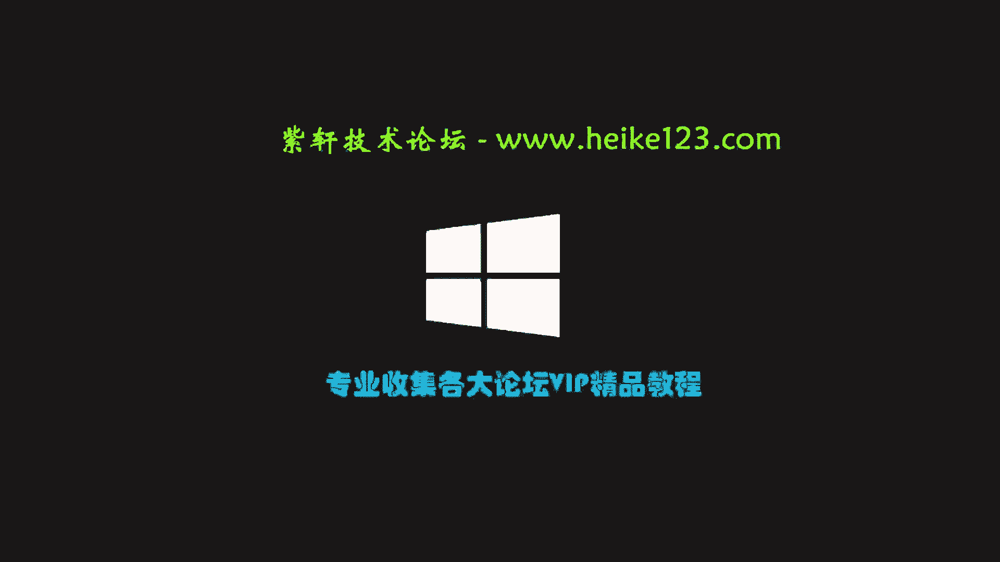
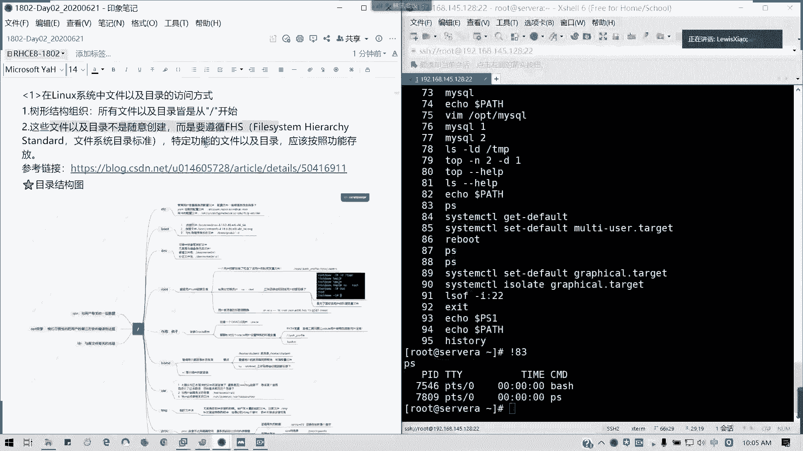
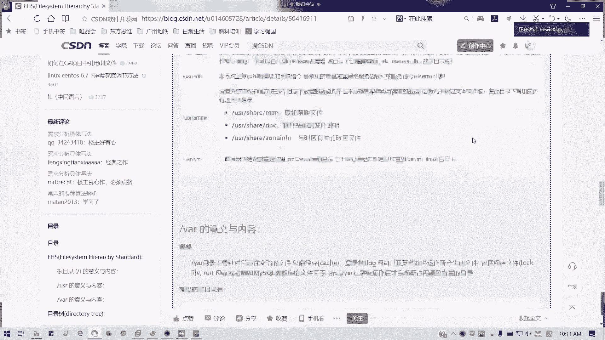
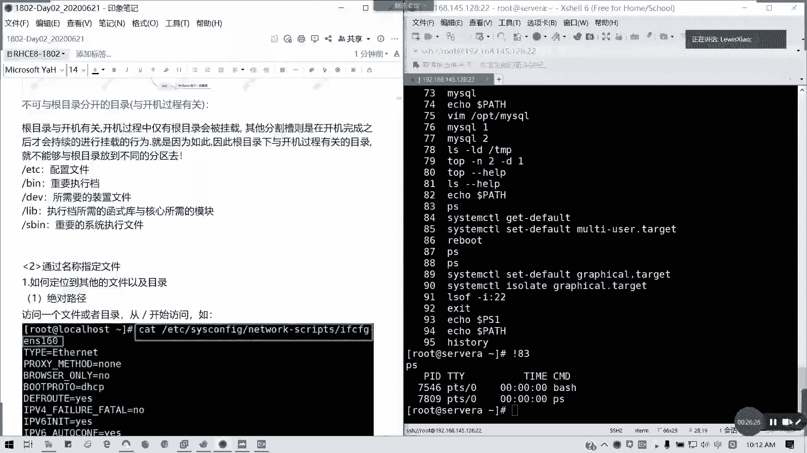

# 拿下证书！Redhat红帽 RHCE8.0认证体系课程 RH124+RH134+RH294三门认证视频教程 - P6：6_Video_Day02_Day01课程回顾 - 16688888 - BV1734y117vT

好，那我们今天开始啊，我是小路师兄。我们先回顾一下我们昨天啊，昨天讲的一些能看到屏幕啊，都能啊。好，包括远程的都可以啊。那行，那我们回顾一下昨天内容，昨天呢我们主要是第一个把大家领入门，对不对？

大家领入门，我们讲了红贸课程的一个学习的一个作用，对吧？现在很多开源，包括我们的一些国产化，对不对？国产化还有一些设备基本上都令个系统，而且而且它有一个安全高效多任务运行的特点。

所以的话现在很受我们的企业用户的一个青睐，对不对？然后第二个我们讲了红贸认证体系。就我们七跟八区别在哪，对不对？我们八主要是讲什么呢？讲ible，就是说重点放在自动化里面，前面的基础还是要讲没有变。

但是后面呢我们是讲了ible自动化运维这一块的话，我们在第10到第13天啊，如果昨天没有来的同学应该知我。家再说一遍啊，所边没有的同学，其实我们的那个。我们的环境呢是不需要用的。

暂时我们要新装一台re8。0的一个虚拟机，然后复制完整克隆台出来就可以了。完复呃，所以我们用两台自己的机器我们都可以做，但是课上的练习我不会讲，因为课上的都是那选择一些概念的题目。

那跟我们我们考试我说过了，我们考试是实操啊，实操的题目。那我们觉得这块的话，大家概念懂就可以，我们重点放在我们操作上面啊，大家这里看到我们八跟七的不同的啊，七主要下下午是考服务，对不对？在七的话。

你看那个截止时间呢，我们的那个考试节止时间是2018年的呃要2020年的8月份啊，20208月份之后呢，你就考不了7了，对吧？考不了7了，所以的话现在学八正治时候啊。

虽然企业现在大规模还在停留在六跟七的阶段。其实八的话有一点点区别，我会说。啊，以后有一些命令的话，八跟七怎么用？包括像我们重启网卡服务，对吧？这个就是其中一个不同啊。然后咱们考试时间考试时间呢。

就大家学完考前辅导之后的，大概一两个月之内就安排。然后呢。上午两个半钟头考CSA考我们前两本书的东西，下午4个小时全部讲ensible全部考ensible啊，4个小时。所以的话难度比7会有所增加。

会有所增加。也就是说你ensible的话，你们剧本你的那一个模板，还有你的角色你要很熟练，然后你的基，因为它是ensible呢是依靠其实如果后面我们学起来，我们都是依靠我们的基础的对吧？

我们基础命令熟的话，我们ensible其实学没有任何问题啊。像CA的话，目前我至少知道有三个方向，而且现在涉及了十几门认证啊，十几门认证。然后呢。我十十几门认证呢，然后呢。

我这边啊我们主要这下面我们有5个方，就是有一个云方向是没有开的课程啊，云方向我没有开的课程，然后呢，重点呢对吧？重点呢就是我们学完这基础和我原来我们ansible呢。是在那个。

CA里面的一门叫DO407，对吧？然后从8点的开始，它下放了30%到50%的内容，放到我们的CE上面。所以的话其实ensible的话，基础知识没有变，只不过后面的大应用可能减少了一点，对吧？

但是在后面我们大家会讲啊。然后记得如果大家要报CA的话，想报CA的话，那这那你的证书我们有效期三年。现在全球呢有有效期内的CA是10两1300左右啊，全球的有效期内的啊，因为。如果你拿其实你先拿着的话。

你到时学完你有没有效的话，大家都认的，对不对？只不过你如果更新有效期的话，你要跟红帽再考一门新的课，或者是重考之前的课啊。然后呢，全国呢也就是600人差不多。600人差不多。然后呢，全球的CE多少人呢？

全球7万多有效期内，然后全国3万左右3万多，这是去年的一个数据啊。我我们讲的是有效期内的，也就是你的证书，你还在红帽，就是我们的我们其实现在证书都没有标有效期。但是他现在红帽的的做法。

就是那个你这你是你拿到考试通过那天起三年内都是有效的。所以它的有它的那个失效日期呢，是在我们的拿到有红帽最新的一个日期之后的三年内啊，所以的话大家其实C一的话只是一个皮毛只是一个基本啊。

所以的话就我希望大家还是就是说拿完之后，我们可以往更好的方向去走，这是我想说的。然后呢，接下来我们还讲了一个，是不是我们如何装红帽8。0。我们走天手把手，而且中间我还翻了车。啊。

因为主要是那个IP获取了一个问题，所以中间我下午又花了一个小时重整了一遍呃，主要是在这主要说在VMware station pro里面创建虚拟机，然后安装系统对吧？系统的步骤，我在第一天的一个。

我的昨天的笔记已经是完完整整的说明了啊，哪怕小白也会弄，对不对？然后呢我们还插了一句，就是我们haos的异同，其实一个是企业应用，一个是社区版啊，也就是一个是靠技术支持跟订阅啊，订阅。

然后这方面我们要获取服务要要要钱啊，也是说白了就是要钱然后呢to呢主要是做社区版就是主要是那些啊开就完全开源。然后你你想那个企业如果说那种要确实完全免费，然后想尝试到新的一些东西的话，那其实就用to。

那两者的命令一模一样，只不过一个就是没支持一个有对不对？然后一个是稳定版，一个是可能有些新的包啊，新的特性，它会提前下放。但它通常版本上呢sosha先出对吧？最成熟先出出了之后半年才会出。

所以最新的版本是8。2啊8。220。20年4月28号出的8。2的版本，但我们现在考试通常是考8。0。它就是功能或者是bug修正的，其他没什么区别啊。然后我们还讲了如何远程的连接远程连接虚拟机。

是不是我们通过虚拟网络配置配置是吧？然后我们跟我们的那个用NATT的方式，只要连通的话，就像我们这样，我们就可以用叉sha或者是用那个呃用其他的sQCRT这些工具。大家都有哈。其实如果在做过运维的话。

都有，对吧？连续期。然后我们昨天下午我们讲了第二章内容叫访问命令行，对不对？访问命令行，我们讲了一个linux的基本框架，主要是它由内核跟shall组成，对不对？内核还有其他组件。

它是linux的一个核心，构构成整个linux系统一个一个核心，对吧？但是我们人如何跟我们的linux系统交互呢？我们不可能是直接去访问它的东西，对不对？不能直接通过，因为你就相当于我们跟台电脑一样。

我们是要通是不是要通过操作系统，对不对？我们要通过一个界面，你不可能就直接去读取，对吧？像我们就就比如我们在左举一个通俗的例子，我们人与人是不是通通过一个语言的媒介交交流，你不可能说直接动动手动脚。

对不对？你语言都不通，那那怎么交流，对不对？就像linux一样，我们通过一个shall的外壳，它这个外壳呢，提供了我们的一个命令行的一个交互。方式或者是或者是我们甚至现在演变成了有一就对于小白来说。

就图形界面嘛。但这里我就不不讲不太多去涉及的图形界面东西，啊，因为我们在实际的生产环境里面，是不是大家基本要用命令行，谁用图形命面在windows上指指点点啊，对吧？

主要windows它的那个它不过他现在power，特别是现在的新版本，因为它主要是也要随大就随大潮流嘛，也也融入了linux的命令行，对不对？像现在的190，好像我记得是1909版本开始。

就是跟lin它是有一个linux命令行的模块，也就是说我们在windows上也可以跑linux命令，对吧？它提供的刷枪环境给我们，所以的话现在linux确实是大行其道，对吧？

很因为windows有些像有些它的闭源，第一个第二个它会有时候蓝屏啊，这不稳定的特性，对不对？所以的话其实我们用临时还是蛮多的啊。呃，我们既然讲到了那个shall，那我们讲到了lin视频你行。

是不是我们在提示服是不是1个PSE的变量，对不对？对吧这个格式还记得吗？括号括起来，它提示模式，括号括起来，大家自己做笔记啊，可以自己做笔记啊。这是昨天的一个回顾。我刚才我昨天也说了。

建议大家自己做笔记，不要再看录我的录屏或者是我的笔记这样。我讲的东西还是我自己的，懂吗？你们自己掌握，你们自己练出来的东西，才是你们自己的啊。这皮次符我们是不是这样用一括号括起来，前面是用户at。主机。

然后空格工众目录，后面是一个。提示符对不对？它斜杠它是它是反斜杠，它是一个转移啊，就是在那个转移的话，它显示它的那个原本的一个功能。然后对于我们的root用户，它的后面是一个对吧？它后面是一个井号。

非普通户它是一个do的。然后如果是他在在用户的所在的工作目录，就例如我们windows下的我的文档，对不对？它就是一个波浪线啊，它一波浪线我我把它吹下吹上一点，不然冷死我了。

然后还有一个我们的pass变量。pass变量这里面写明了我们执行就是我们可执行文件通常的存放的路径。然后呢，如果你要新建你的你新建编辑的软件的话，如果你要直接不通过绝对路进行执行，对吧？

你就可以把我你的软件里面定义的一个路径写到我们pass变量里面就可以了啊，具体的笔记昨天有。然后第三个我们讲终端终端的话，常见的是不是图形界面，还有文本界面，对不对？图形文本两种界面，如何切换，对吧？

懂吧？键盘切换临时的，还有命令切换，分临时跟永久两种具体笔也是昨天有什么叫控制台，也就是我们什么叫控制台，什么叫字符终端，什么叫虚拟终端，应该都知道啊，控制台相当我们就直接我哪一个哪一个键盘。

鼠标我接一个服务器，还有显示器，这样我们直接控制就是控制台，我们的 consoleso。日服终端就是我们从我们那个直接我们的终端，然后我们切到我们的文本界面啊，此时我们不通过任何的那个终端啊。

不通过我们的任何的一个终端，我先把它拉过来啊，它不要挡到我们任何终端是吧？字符界面只要是字符界面，它都是TTY。然后我们从其他的。从其他的终端访问我们这个linux系统，这个linux终端。

那它就是一个虚拟终端。因为它是通过音互联网对吧？通过网络建立一个虚拟的一个通道，对吧？这有通道。但是这个通道呢，如果你有装那个叉 manager，然后后面加载图形界面它也能传，对不对？

像VNC它也能传命界面对吧？字符啊那个图形界面，但通常我们来说我们通过叉或是通过secreCT这些我们连过来的都是文本界面，其实我们无论如何我们用文本界面足够在7里面可能我们在Ld服务。

如果大家有了解过，就是那些轻量级。呃，轻量级那个授权访问就那个数量级访问协，那目录访问协议是吧？就是我们linux的域啊，如果是简单配置，我们这用图形画的会方便一点。但是我后来我也发现了。

哎我们有命令行，对不对？所以我们拜8里面全部命令行啊，全部命令行截有组，所以字符界面，你们就相当于我们一开始装完之后，我们就算了啊。然后怎么远程，怎么退出。对吧都都有啊，怎么远程它，怎么退出都还记得啊。

这里我有简要写。然后接下来讲我们的best shell啊，best shell呢。我们命令之间的一个逻辑。分号。W。与反斜杠。怎么用啊，知道怎么用吗？分号。你连续运行多条命令，中间用分号隔开。

然后前后用空格，不要堆在一块，因为堆在一块，确实你看着眼都花。对吧我们用分号啊分号来隔开顺序执行。对吧。W。两个两个pipe啊，我们就有一个管道，它是前一条命令执行失败的情况下。

它的运行结果不是正常情况下，它才执行后面的命令。与两个N，它是两命前面命令执行成功的情况下，我才执行下调命令。反斜杠。你如果你一条命令，你一行显示不完，或者是我要只比如说我要打开多个文件对吧？

你一行显示不完，我可以在一行就是说在命令一个分命令结束之后，我用斜杠反斜杠回车，对吧？它就这然后它有一个兼括号啊，一个提示符，就是你可以第次级，然后你有多个分命令，多行命令你可以用多个分号。

然后回车间隔出来，然后总输入完一串命令之后回车对吧？就是多行命令懂吗？分号啊，这种存的情我们实际情况可能不常用，但是如大家一定要知道啊，就是我们四种提示符，然后它有tab命令补全，对不对？

tab命令补全，我们涉及到如果在最小化的安装里面可能没有叫没有一个叫做pach compression的一个包啊bach自动补全一个包。然后我们如果在最小装。里面我们通过补这个包。

我们就可以实现针对于命令选项文件的一个补权。如果你是这个补权，它是有唯一性的，按一个t就可以了。如果没有按两下，它会列出来一个列表，对不对？比如说我这里啊。对吧我这么多ss，他列出来的列表，对不对？

如果我。我确定就一个命令了，他会会帮你补存一次就搞定，对不对？包括选项对吧？这么多。然后还对于一些不全的文件及目录，同样道理。对吧。我这样讲都能清楚啊。好，然后还有快捷键。

我们的cttrorl加AEUK左右R。还记得他做什么用吗？contrl加A。移到最开始你命令最开始，contrl加一移到最命令的末尾。cttrorl加一。如果你在命令的末尾的话，如果它就删去前面的内容。

如果你在命令末尾，现在这行就清空了。conttrol加K就是你所在光标后面内容去掉conttrol加左方向键，也就是它移到前一个字一个单词的一个开头右。一个单词的末尾啊。嗯直接查找啊，查找命令的关键字。

它会给出最近的一条命令的一个结果。然后你OK的话，按回车啊就可以执行。然后还有我们讲到一个history，对不对？我们的历史记录，对吧？历史记录我们可以。查看最近的1000条啊。对吧我们这里有九十几条。

然后如果我要执行我的。某条命令，那我用叹号跟上序号就可以了，对吧？然后我们昨天还讲了一个linux一个。我们开篇啊从命令行管理文件我们讲到了从在linux里面，我们那个文件节目录的一个。

构建的一个我们的一个框架啊，文件目录的方式，也个框架啊，访问方式。这里我补充两个字啊，可能我有些笔记里面有错别字，我如果你们有有看到的话提醒我，我会及时改过来。然后我们的linux我们是以一个竖形。

一个倒竖形的结构，对吧？最顶端是一个根挂在点，然后往下就是一层层目录，然后一直到你的文件为止，对不对？就像windows是一个盘符，对吧？盘符，然后一层层目录接了下来。这些文件呢不是随意创建的啊。

它是要遵循我们一个叫做文件系统的目录标准。然后特定的文件跟目录，它要按照一个功能存放，我们这里给了一个链接，对不对？我们给了一个链接CSDA里面它讲的比较全，就是一些啊FSHFSS是怎么回事？

就是我们的文件。

文件系统的目录标准它是一个怎么一回事啊？CSDN有这篇文章。就它这个架这个组织，它会规定我们的一个到底我们的这个文件它要怎么存。所以linux的话，它是linux我们的linux系统啊。

它是遵循的这种方式。但这里的话好像我这个网络问题有点没法打开哈，就是说可能要等一等啊，这个文章唉，我看一下应该能录得开了，对吧？我们的FHS我们的目录规则。有点卡哈。因为他现在fresh组组件的问题啊。

但现在fresh我这边看到一个消息，可能国外的这些的话，基本上fresh都停用了。但是对于中国大陆的话，它是机动自继续提供支持啊。对吧fresh基本上国外已经国外已经相当于是落后了。

已经是被其他的一个技术所取代。但这个我已经画面有经卡了，我就不不不讲不再讲这个了啊。然后我们昨天呢我们还讲到了一个，对吧？它这里啊FHS定义的一个说明，对不对？我一个说明，对不对？

对吧这个网页里面就说明这个根目录它的意义跟内容，对不对？所有的目录都是从根目录衍生出来，然后与开机还原系统修复的动作有关。然后它这这个分区槽，我们的分割槽，就是我们的分区越小越好，对不对？

然后安装软件呢更就要跟根目录不要堆在一块，不然你跟不报的话，你的系统就真的是废了了。就像我们的windows C盘一样，对吧？然后根目录底下FHS我们的文件标准啊，我们文件目录定义标准。

它的一个定义的说明就像并我昨天是不是用的用了我们的那个思维导图，对不对？用思维导图讲了所有我们基本上常见的。一些目录的里面的一些用法。像比如我们没讲到的，像media是吧，它是放移除装置。

像MT是挂额外的挂载装置，我们这里是没有讲的，但我们讲的重要的一些对吧？重要一些目录。然后还有一一些像。就是说非常重要的就是虚拟的文件系统，我们的内存里面，对不对？还有包括我们是不是？错误的时候。

它一些疑失片段放在这里。然后还有就是pro的话，它是虚拟文件系统，它其实在数据在内存里面，所以我们是如果是直接访问的话，我们就是不能直接访问里面的内容的，当我们的进程对不对？进程一些临时信息，对吧？

还有一些我们CPU内存一些信息，它都不是直接放在硬盘，放到我们的硬盘存储里面，它是放在内存里面的，对不对？然后还有就是不可跟跟目录分开的目录，就跟开机过程有关系啊，对吧？就这几个你一定要跟你的根在一块。

通常我们划我们在分区的时候呢，我们第一个我们在企业里面，如果你们学过领子，应该知道，我们首先分一个bo。啊，没事。现下到啊。我们分我们分区的时候，我们先分一下boot，对不对？boot就是引导的。

我们通常说现在新的系统我们分一个区，以前的分256，对吧？然后接下来就是我们的交换分区，就是内内存跟就是我如万万一我们的内存空间使用爆的情况，我们可以。通过硬盘就我们的硬盘一部分。

然后提供给系统作为一个内存交换。但但这个速度呢肯定比内存慢的多。对吧但通常这个分区呢，一般人家就如果你的服务器，我们的机器性能够好，你这个web根本可以不用建。这个不是必备的对吧？如果你的机器。

比如说你超过128256G以上内存，然后你运行的运行的那个占用率，你远远不会超过你内存的占用量的话，你基本上s可以不用的不用的，对吧？但不存一定要。它通常是放内存引导嘛？如果你这个步骤坏的话。

你整个系统是不是起不来，对吧？还有一个根分区，就是我们像一些配置文件啊，重要执行文件呐，对吧？还有我们的库啊，我们设备的一些文件，我们都放在这里。

那根分区呢通常的话都是画一个单独的给它45比如说我们通常说50G100G，对不对？然后接下来就是我们一些目录，比如像像比如说我们这样分出来，我们比如说像一些用户的加目录，像home。

我们是不是可以单独画出来？我们的USR就我们放一些本，我们那些啊。可分享的或不可变动的一些。文件是吧？一些文件，然后还有一些软件系统的软件资源。

它的全称叫做unix softwareware resource，而不叫user哈，这里啊叫做软unix系统软件资源。我们装的软件，是不是我们可以放到这里？对吧目前而下，我们可以放到这里。

所以这个我们我通常目读成user，很多人都读错，以为这是一个user，一个用户目录其实不然它是一个叫做unis软件系统软件资源，懂吧？就装软件我们可以放在这里，对吧？下面的user logo对不对？

然后还有呢就是我们的VNR我们的日志存放目录，或者是我们数据库的存放目录。这也可以单独画开了。懂我意思吗？VROPT也是一样。但是我们在默认我们在教学环境里面，我们就全部堆在跟风区好了。

因为我们实际上我们占用并不大，所以的话我只给了最基本的20G空间。啊，懂我意思吗？然后这个是这个文档呢建议大家去看一看，这个文档其实写的挺好的啊，就关于我们的。

另我们的那个每个部架构及内就意义及内容都有。不过他这里是用了一个就是台湾地区的中文。所以的话它它的话就有些像分区了，它就叫做分割槽，对不对？所以这里的话我们就啊我们就变成一个分区就可以了。好吧。

那我们先休息10分钟，大家如果刚来的话啊，把我们的那个环境这接打开来。然后我们接下来大概在25分或30分左右，我们会讲第二个部分通过名称。

去指定文件，也是我们如何去定义文件啊，如何去访问他。好吧，我们这个我们今天的话每讲一节我会停止录屏啊，停止录屏。然后待会我们继续好吧，给大家消化梳理这个时间，好不好？

