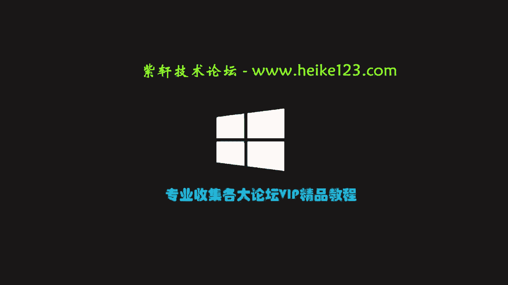
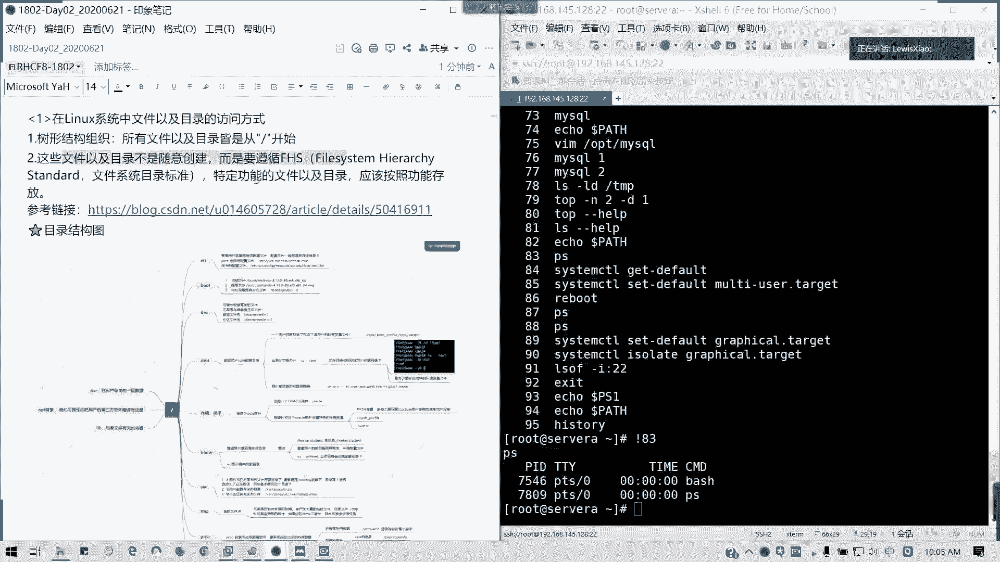
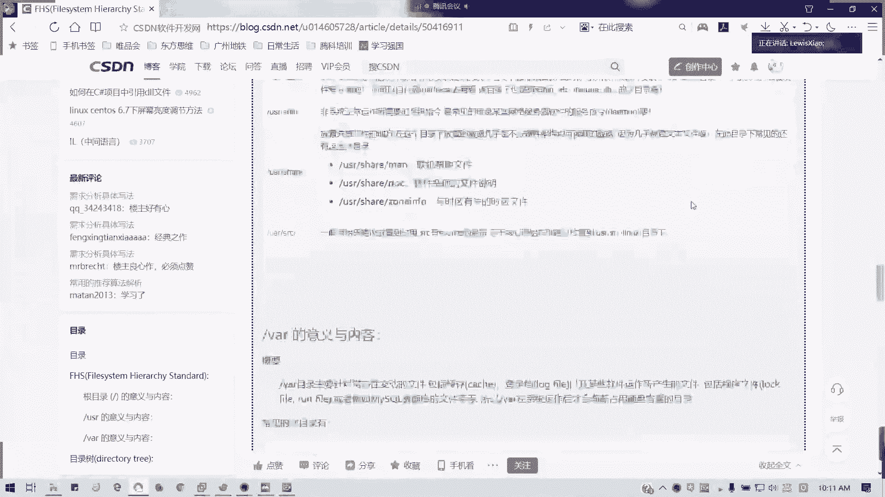
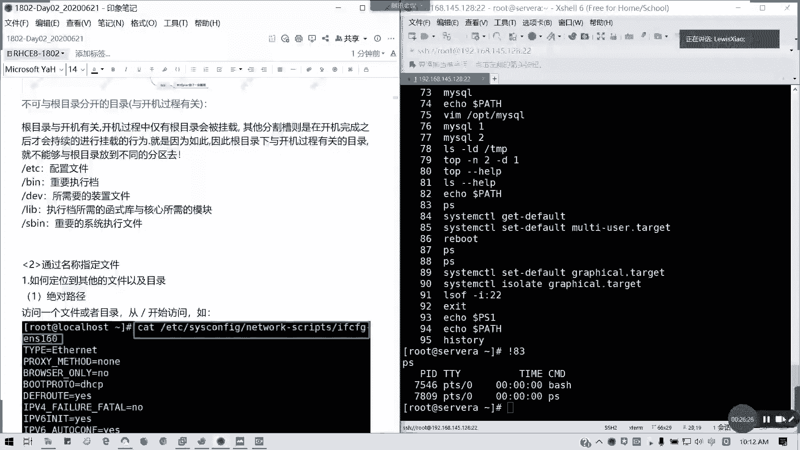

# 红帽RHCE 8.0认证课程：第1天回顾与第2天预告 📚

在本节课中，我们将回顾第一天的核心学习内容，并简要了解第二天将要学习的主题。我们将重点梳理Linux基础概念、命令行操作和文件系统结构，为后续深入学习打下坚实基础。

## 课程回顾：第一天内容 📖

上一节我们介绍了课程的整体安排，本节我们来回顾第一天的具体学习内容。

### 课程引入与认证体系

第一天首先介绍了红帽课程的学习价值。当前开源技术和国产化趋势显著，许多设备都基于Linux系统。Linux因其安全、高效和多任务运行的特点，深受企业用户青睐。

其次，讲解了红帽认证体系，特别是RHCE 7与8版本的核心区别：
*   RHCE 8的重点在于**Ansible自动化运维**，相关内容安排在课程第10至13天。
*   RHCE 7的下午考试侧重于服务配置，而RHCE 8的下午考试（4小时）全部考察Ansible。
*   RHCE 7的考试截止日期为2020年8月，之后将全面转向RHCE 8。
*   虽然企业环境可能仍在使用6或7版本，但学习8版本正当时。两个版本在部分命令上存在差异，例如重启网卡服务的方式。

关于考试：
*   考试分为两部分：上午2.5小时考察前两本书（RH124+RH134）的内容；下午4小时全部考察Ansible。
*   RHCA（红帽认证架构师）是更高级的认证方向，全球有效持证者约1300人，国内约600人。
*   RHCE（红帽认证工程师）是基础认证，全球有效持证者约7万多人，国内约3万多人。
*   认证有效期为自通过考试之日起3年。

### 系统安装与远程连接

我们详细演示了在VMware Workstation Pro中创建虚拟机并安装RHEL 8.0系统的步骤。安装过程中特别需要注意IP地址获取的配置。

我们还探讨了RHEL（Red Hat Enterprise Linux）与CentOS的异同：
*   **RHEL**是企业版，提供技术支持和订阅服务，系统稳定。
*   **CentOS**是社区版，完全免费开源，可能包含更新的软件包和特性，通常比RHEL晚半年发布。
*   两者命令基本一致，当前最新版本为RHEL 8.2，但考试基于RHEL 8.0。

最后，讲解了如何配置虚拟网络（通常使用NAT模式），以便使用Xshell、SecureCRT等工具远程连接和管理Linux虚拟机。

### 访问命令行

我们学习了Linux的基本框架，它由**内核（Kernel）** 和**外壳（Shell）** 组成。内核是系统的核心，而Shell为用户提供了与系统交互的界面，主要是命令行界面。

以下是关于Shell环境的重要知识点：

**Shell提示符（PS1变量）**
Shell提示符的格式由`PS1`变量控制。基本格式为：`[用户@主机名 工作目录]提示符`。
*   对于root用户，提示符是 `#`。
*   对于普通用户，提示符是 `$`。
*   用户的家目录（如`/home/username`）通常用波浪号 `~` 表示。

**PATH变量**
`PATH`变量定义了系统查找可执行文件的路径。当用户输入命令时，系统会按照`PATH`中列出的目录顺序进行查找。如果需要直接运行自行安装的软件，可以将其所在路径添加到`PATH`变量中。

**终端类型**
*   **控制台（Console）**：直接连接在服务器上的键盘、鼠标和显示器。
*   **字符终端/虚拟终端（TTY）**：在文本界面下操作的终端。
*   通过SSH等工具远程连接时，使用的是**虚拟终端**。

**Bash Shell基础操作**
*   **命令分隔符**：使用分号 `;` 可以在一行内顺序执行多条命令。
*   **逻辑运算符**：
    *   `||` （或）：前一条命令执行**失败**时，才执行后一条命令。
    *   `&&` （与）：前一条命令执行**成功**时，才执行后一条命令。
*   **续行符**：使用反斜杠 `\` 可以将一条长命令分成多行书写。
*   **命令补全**：按 `Tab` 键可以自动补全命令、选项或文件/目录名。按一次补全唯一项，按两次列出所有可能项。
*   **常用快捷键**：
    *   `Ctrl + A`：光标移动到行首。
    *   `Ctrl + E`：光标移动到行尾。
    *   `Ctrl + U`：删除光标之前的所有内容。
    *   `Ctrl + K`：删除光标之后的所有内容。
    *   `Ctrl + 左右方向键`：以单词为单位移动光标。
    *   `Ctrl + R`：反向搜索历史命令。
*   **历史命令**：使用 `history` 命令查看最近执行的命令（默认保存约1000条）。使用 `!序号` 可以快速执行历史记录中对应序号的命令。

### Linux文件系统结构

Linux文件系统采用**倒树形结构**，所有文件和目录都从**根目录（/）** 开始。这种结构遵循 **FHS（文件系统层次结构标准）**，该标准规定了特定功能和类型的文件应存放的目录位置。

以下是一些关键目录及其作用：
*   `/boot`：存放系统启动相关的文件，如内核。通常单独分区。
*   `/` （根目录）：包含系统运行所必需的核心文件，如配置文件、库文件、设备文件等。通常单独分区。
*   `/home`：普通用户的家目录。通常单独分区。
*   `/usr`：存放系统软件资源（Unix Software Resource），安装的应用程序常放在此处。
*   `/var`：存放经常变化的文件，如日志、数据库文件。通常单独分区。
*   `/opt`：存放第三方可选应用程序。
*   `/proc`：虚拟文件系统，数据存放在内存中，反映系统内核和进程的实时信息。
*   `/dev`：存放设备文件。
*   `/etc`：存放系统配置文件。
*   `/tmp`：存放临时文件。

在企业环境中，常见的分区方案包括为 `/boot`、`/`、`/home`、`/var` 等目录单独划分分区，以提高安全性和管理灵活性。在学习环境中，为了方便，通常将所有内容放在根分区。

## 下节预告 🔮

在接下来的课程中，我们将进入新的章节：**通过名称指定文件**。我们将学习如何准确地定位和访问文件系统中的文件，这是进行文件管理和系统操作的基础技能。

本节课中我们一起回顾了红帽认证的概况、Linux系统的安装、命令行访问的基础知识以及文件系统的核心结构。掌握这些概念是后续学习Ansible自动化和更高级系统管理任务的基石。请大家确保实验环境就绪，我们稍后继续学习。