# 拿下证书！Redhat红帽 RHCE8.0认证体系课程 RH124+RH134+RH294三门认证视频教程 - P70：70_Video_Day12_第911天综合练习 - 16688888 - BV1734y117vT

好，那我们时间关系啊，我们来看这三题。我啊大家反正做完天高小话，可以在我们的群上可以扣一下。这个题号啊，我来看看第一题啊，第一题的话创建个facebook指点一下功能。第一个列出目录中的内容。

如果任务运行异常，则自动创建目录啊。任务状态发生改变时候，新建一个文件叫tex five。然后呢，无论执是是是否正常，都在我们的t file里面输出一段话。好，我们来看一看。我看一下啊剧本。一开始对吧？

我我我我这个名字叫练习01。所有机器上运行。然后我这里我暂且忽吁，就我设置一个忽略所说。有可能他支付和执现可能失败了。所以说我们这里加个in errorsy。任务。我这里使用一个任务框。

然后这里我定一个任务快啊，对吧？框里面第一个任务名称。我是不是列出你面目中的内容啊？然后用很慢的或者是用笑多行。帮室友也可以啊。最有的参数就本身就命令吧。然后我这里。我可以保存为register变量。

如果我需要的话啊，但这里的话好像我暂时不需要，所以的话我就不会保存。第二个任务。我可以这己可以创建一个文件。放空文件放过。用范模范。但不止一种方法啊，我这里只的是我设例的一个方法。TMP里面的tDR。

你们太差。Now state。他实。然后我任务发生改变，我可以自己可以成为第一个条件。这也可以写一个表达式，比如说我直接写处就行了，对吧？所有的你所有的状态，我的任务都发生相当发生改变。

那这里的话通常跟n梯板连用，但是我这里如果不写也没问题啊。那接下来我上面的如果我的任务会发生失败的话，我是不是写个rescue啊？rescue任务是不是我是当任务不存我这文件夹不存在的时候。创建目录。

对吧。用fi。模块。TMP testDR pass的路线n states director。Dirory。然后无论任务是否执行成功，那就在always里面添加一行。top品模块。Conent。对吧。

就输出一句话，写到文件里面。可以的对吧？

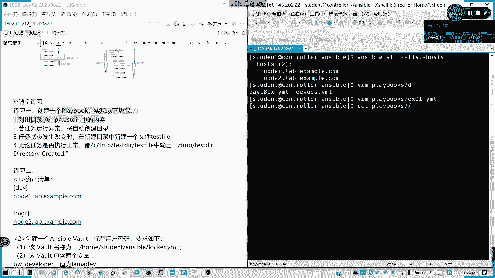

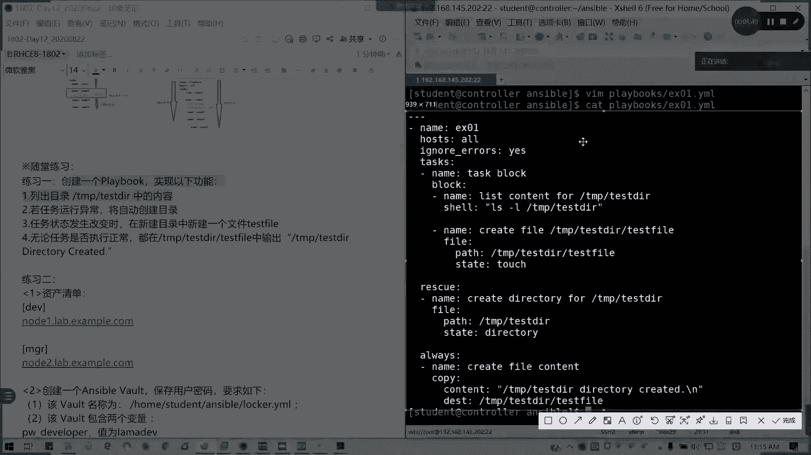

但我这为发生改变时候，我就还是加上加上这句吧。全出来了。在这里我没有说什么条件，我们就直接写个处就行了。语法应该是没问题的。如果明白的话，我看一下啊。如果这道题明白的话，请扣A。

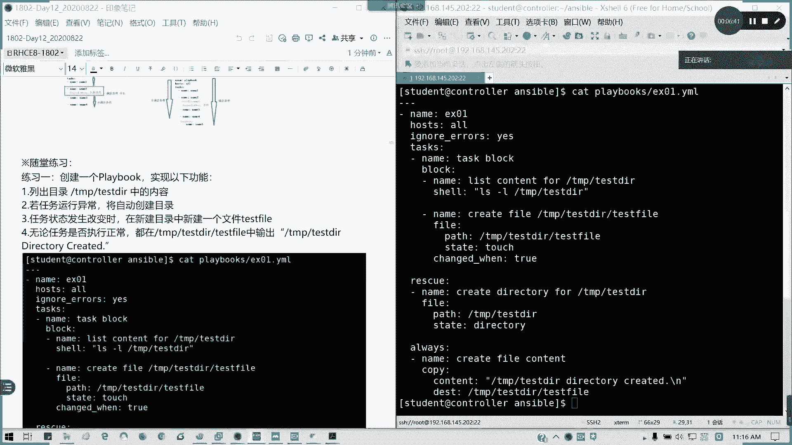

有问题可以提问。没有任何提问啊。能理解吗？现场的各位。可理解不？我要用res9和alwayice，我必然用prolock的。家人呢都不在了。好，然后我们练习二呢练习二是一个综合性的题目。

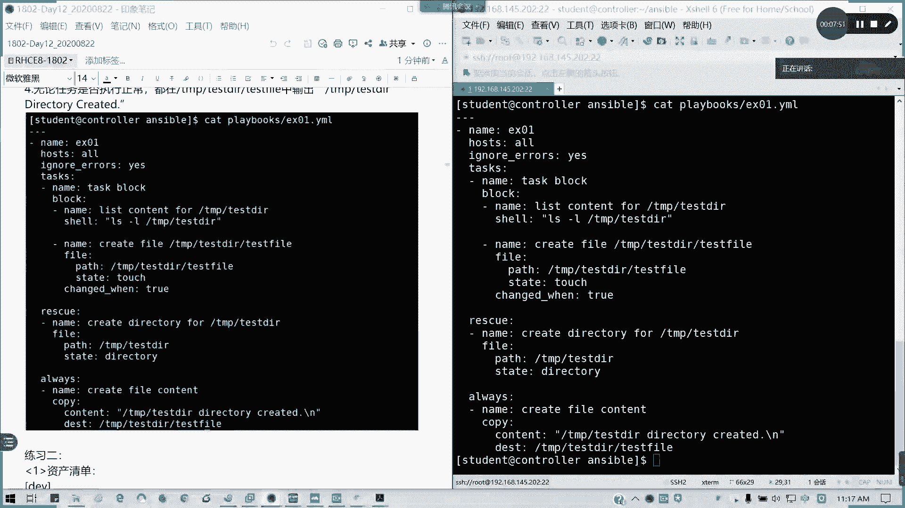

面其的是一个综合性提库。首先我们把自然清单稍微定一下。我这里是写我这里的配置文件。是写在后s者里面的啊。所以我就直接编辑用最后s的文件。我是是吧，我使用这个清单。但这个service啊，我这里没问题啊。

我这里这里先注释一下，待会我再我再把它弄回来。哇。好，清单完了。接下来我创建SObo，我要。保存用户密码。对啊，保存密码，然后密码这个word加密码码是那。是写在文件里面的。对吧。

然后我内容呢就是两个变量的词。那我们来看一看。我先建一个secre点TST。我把密码直接写在文这个文件里面。对吧。然后呢，我去编成一个locer的样么，这里哦因为我已经有了这个文件，我就直接。

Anible done play book， but as a what。没有吧。对吧。我内容直接我用answible create我我用那个ansible create。

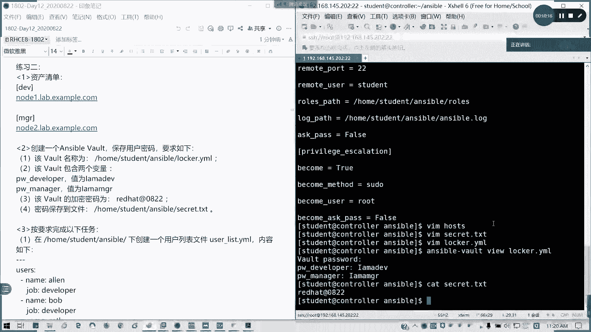

是吧。我按怎不归，我这个是编辑我密码内容啊。

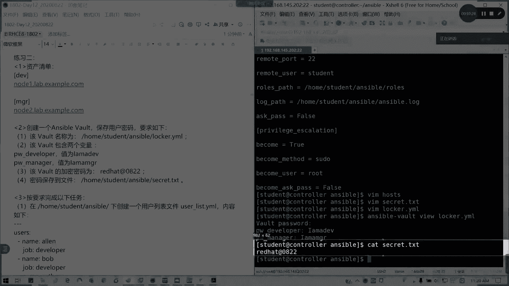

然后接下来我用一个anible vote create。然后用vo password。用用create，然后后面我直接用got possible等于这个文件，就相当于我用这个文件的密码。对吧。

来创建我们的locker的样么，直接就将他加密了，不用再输入了。懂我意思吧。然后输入这些值的话就是。懂了吧？就直接用变量值这样书代替。然后呢，接下来我要完成什么东西呢？我创建一个user类事情。

在前面我已经做好的了，user list点1么，我可以看一下它内容，我就这这么写，对吧？就把这复制进去就行了，这是第一步。第二步，使用上提的vo，我们要来那个创建一个叫user减压模。我就不写了。

直接给大家看一下剧本吧。这里的话我们要改一下啊，这是manager啊。因为这也是两个要点，就是第一个我们的变量文件，我们要引用足，对不对？再看一下啊。这里的话首先我的那个。剧本开头。

我这个是那个我的做我的名我的任务名称就是通过bot去创建我们的用户。然后呢，作用于作用主社款主题是不是两个组的？第一V跟这两个组。然后我引用的第一个是我的用用户清单，其实它是一个字典。

然后第二个它是引用的密码文件，密码加密了对吧？即账密的密码在写里面。然后现在我要创建用户，对吧？给第一批主创建用户，那我们循环是不是我们刚才在这里定义的users里面的一个变量组名里面的一些值，对吧？

然后呢，我可以我那个用户名是item点亮，对不对？它的它的那个循环列表里面的一个项。item点name。对吧。密码就是取自于我们的呃locker里面的PWdevelop。

然后后面用管道用哈西512512维进行加密。这句话。啊，他说5然后S然后SHA512用管道。然后com就是it点job，对吧？然后MGR也是一样。然后这里我们加一个判断条件。有两个哈，一个是我的。

他是在DEV里面创建。我们的。是不是在DEV组上面创建我们develop工作描述为develop的用户。然后在MGR组里面创建我们的工密码，就用我们的工作描述为manage的用户。

所以的话我们是不是直接写那个inventory host name in growth，对吧？直接就写的哎我的主机在这个组里面，我就符，然后还有我们的这两个条件都要符合啊。或是你有用两个N点行。

对吧满足条件我就创建用户。好啊。然后使用boss文件工作呢，其实呢我们就。我们在安onefacebook的时候，playbook的时候直接带参数就可以了。

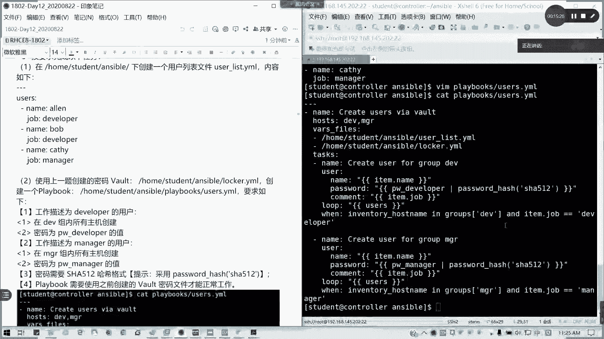

我们在运行验证的时候，请采用它。对吧用vol passport fire直接带我们的sect点TS7。就可以了。懂我意思吧？这道题如果明白的，请打字母B。能能听懂了吧。这型的名白，请扣字补兵。

然后接下第三个题目，第三个题目的话，一个isu2。1，然后呢。我将会在里面替换这一个文本啊，你们看一下。也是分组啊，在所有主义上运行。我这里的剧本也是OK的了，对吧？

replace可这里的话有些人就用line file什么的。其实我这里最简单的就是copy全覆盖。对吧。copy的话，你可以把整个文本就替换你指定内容的。你用li line换 home用。

我们没想到repressse模块也是可以的。对吧反正像像我们综合练习也好，考试也好。里面怎么方便，怎么来啊，只要能达到目标。他只要结果啊不用不不这个库存，这个就是我们的。

第三就第练习三的一个参考的一个标准，参考的一个做法。能理解里面什么意思吗？当这个主机是第一B组的时候，就会输出，就会把那ETCS那个文件内容写成dement。然后MGR如果是他的主机名在MGR组里面。

那就把对应的，把这个文件改成编积。

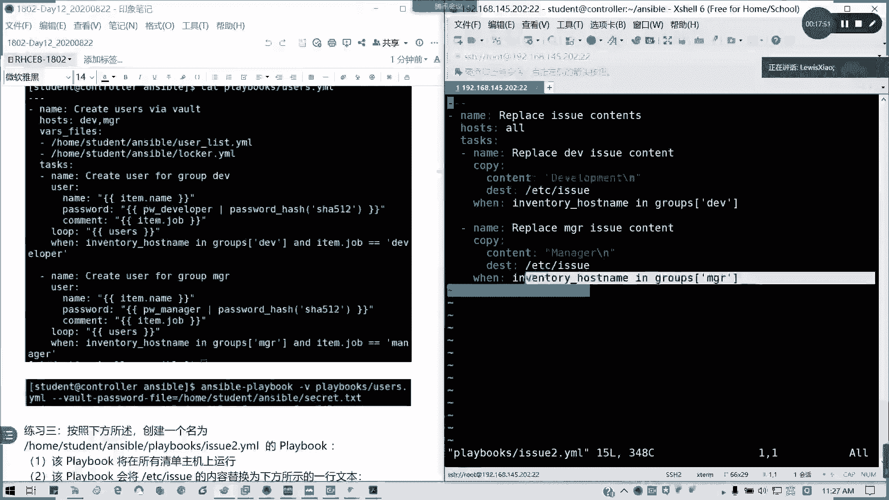

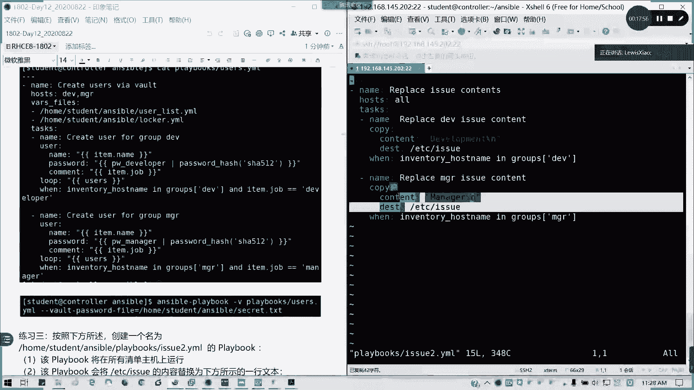

懂了吧嗯。考泰的。直接在售款主机上面生成啊。

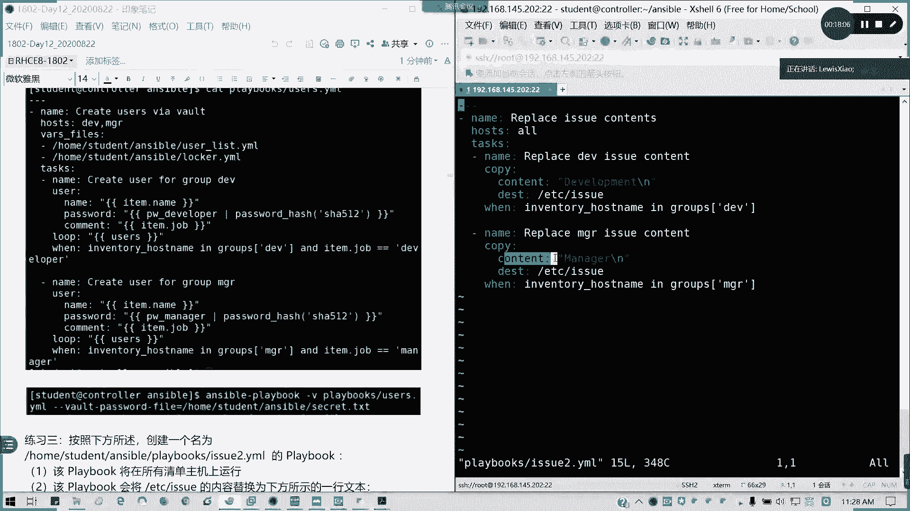

或者用拉 in find homereplace都可以。没有问题啊。皮肤我讲我讲起来就很简单了。Yeah。男し？代替source吗？source你它toppy你可以从我们的控制主机文件。

控制节点文件复制文件上收完主机，也可以直接在授款主机上面生成或替换文件内容。对啊，可以啊。好，这道题如果没问题，请扣C。执行可以自己执行下，没太的问题的。其他的呢就只有张中华一个人在后面两道题。

明白了吗？现场都明白了不？看就明白，做就不会。那这个的话其实其实说白了有思路就简单了。那要不给一点时间给你们消化一下。对吧十0分钟给大家消化一下，待会讲第六章。这三道题其实比较有代表性。

特别是第二题的综合练习。可能会出现在我们综合练习题的后面几道题。就是那个加密的那个东西。从我那识考试的话。类似的屏幕。这这Sible总共16题。16题4个小时。就是他们拍。4个小时。

其实很多人都一个小时出来，一个多小时。就下午考下午考下午就考一次，就就考一次，我不考其他了哦。上午就考CSA嘛。你看。自自信心爆棚了。间那几。今天下午。很多人，但是有坑的哈，特别是要注意考试。

就到时注意我们的前面的说明。双午。到底是用哪个用户来执行的？我的这些文件到底放在哪？因为上次在一开始考时候有两个两位考生，我们两个学员真的没注意，全程在录ot下做，结果就考了11分。

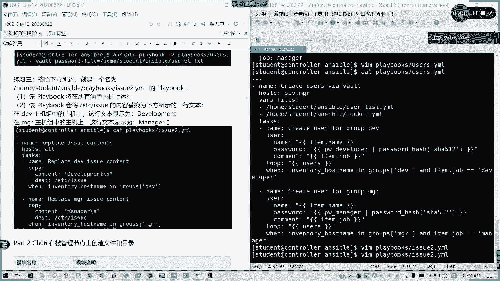

对啊。所以这特别注意啊，哪些用户做的绵密，哪些用户我我的我的那控制节点是哪个用户跟跟售授款主义哪个用户。已经做了授信关系。然后到底我是调用远程主机，哪个用户在执行？要注意。否则你放错的话，全部当没分。

好吧，给大家10分钟休息时间，40分我们讲第六章。最迟不超过45分啊。