# 拿下证书！Redhat红帽 RHCE8.0认证体系课程：P70：第911天综合练习 🧩


在本节课中，我们将通过三道综合练习题来巩固之前所学的Ansible知识。这些练习涵盖了任务块、错误处理、变量加密、条件判断和文件操作等核心概念，是RHCE考试中常见的题型。

---

## 练习一：使用任务块处理异常与状态变化

上一节我们介绍了Ansible的基础模块，本节中我们来看看如何使用任务块（block）来组织任务，并处理执行过程中的异常和状态变化。

**任务要求**：
1.  列出指定目录的内容。
2.  如果任务运行异常，则自动创建该目录。
3.  任务状态发生改变时，新建一个名为 `test.txt` 的文件。
4.  无论任务执行是否正常，都在 `test.txt` 文件中输出一段话。

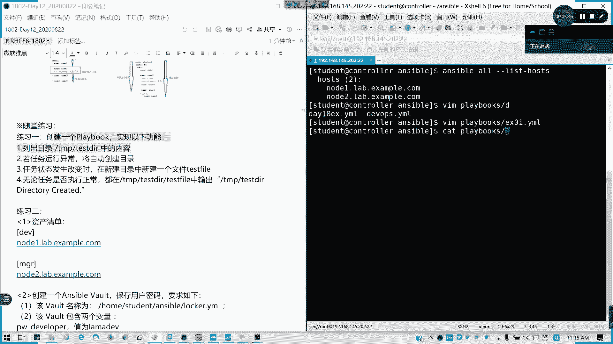

以下是实现该功能的Playbook示例：

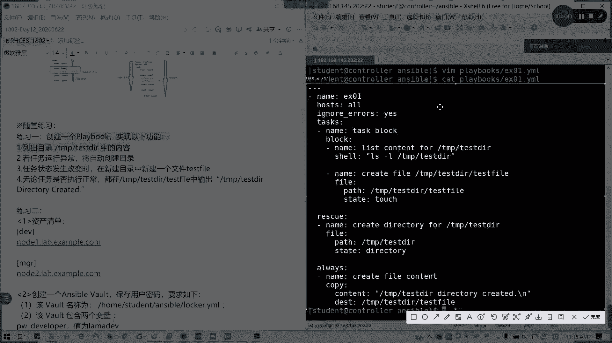

```yaml
---
- name: 练习01
  hosts: all
  ignore_errors: yes
  tasks:
    - block:
        - name: 列出目录内容
          command: ls /tmp/testDir
          register: result

        - name: 任务状态改变时创建文件
          file:
            path: /tmp/test.txt
            state: touch
          when: true
      rescue:
        - name: 创建目录（当任务失败时）
          file:
            path: /tmp/testDir
            state: directory
      always:
        - name: 无论成功与否都写入内容
          copy:
            content: “任务执行完毕”
            dest: /tmp/test.txt
```

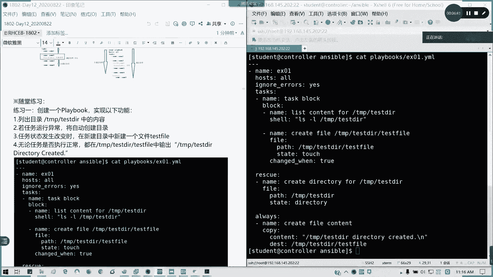

**代码解析**：
*   `block`：将需要监控的主要任务（列出目录、创建文件）组合在一起。
*   `rescue`：当`block`中的任务执行失败时，运行此处的任务（创建目录）。
*   `always`：无论`block`中的任务成功还是失败，最后都会运行此处的任务（写入文件）。
*   `when: true`：这是一个简单的条件表达式，表示总是触发。更常见的做法是结合`changed_when`来精确判断任务状态是否改变。

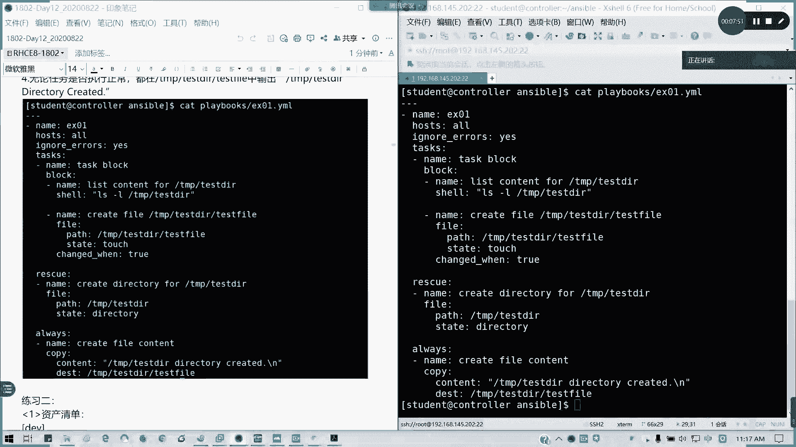

---

## 练习二：使用加密变量创建用户（综合练习）

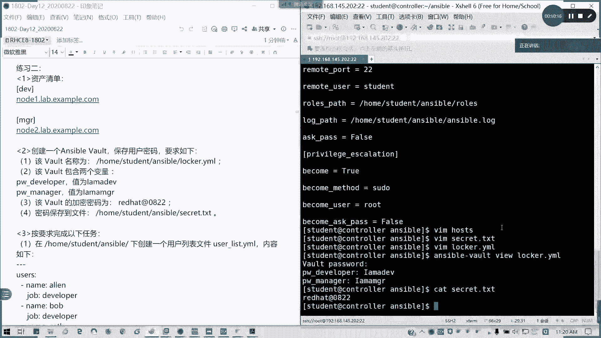

接下来我们看一个综合性更强的题目，它涉及清单管理、变量加密和条件循环。

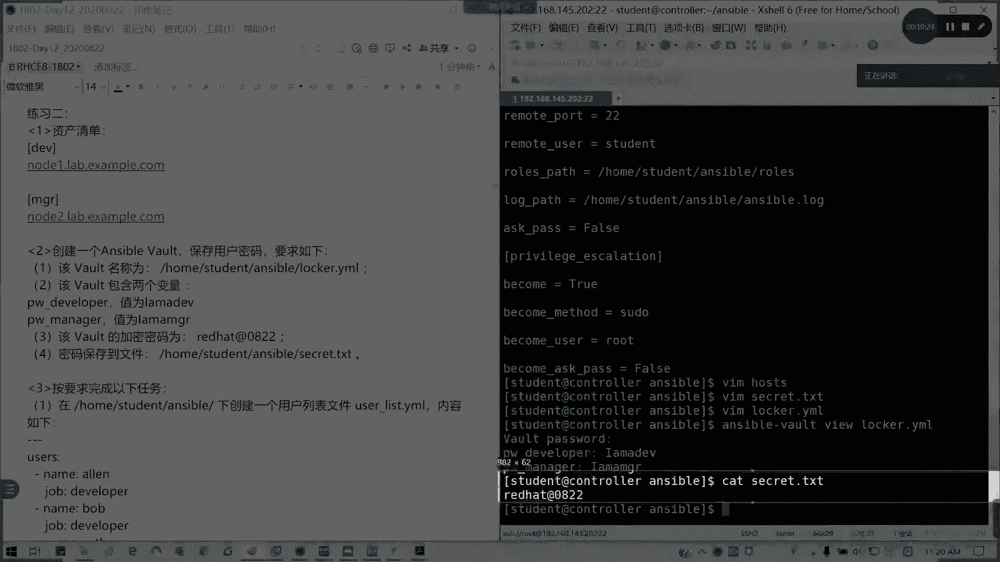

**任务要求**：
1.  定义主机清单，包含 `dev` 和 `mgr` 两个主机组。
2.  创建一个加密的变量文件（vault），用于安全地存储用户密码。
3.  编写Playbook，根据不同的主机组，创建具有特定属性的用户。

以下是分步实现：

**第一步：定义主机清单**
编辑 `/etc/ansible/hosts` 文件，定义主机组。
```
[dev]
servera.example.com

[mgr]
serverb.example.com
```

**第二步：创建加密的变量文件**
首先，将明文密码写入一个临时文件（如 `secret.txt`）。
```
my_dev_pass
my_mgr_pass
```
然后，使用 `ansible-vault` 命令创建加密的YAML文件。
```bash
ansible-vault create vars/users.yml
```
在编辑器中输入变量内容：
```yaml
---
pw_dev: “my_dev_pass”
pw_mgr: “my_mgr_pass”
```

**第三步：编写创建用户的Playbook**
以下是Playbook `create_users.yml` 的内容：
```yaml
---
- name: 通过Vault创建用户
  hosts: dev, mgr
  vars_files:
    - vars/users.yml
  vars:
    users:
      dev:
        - name: alice
          job: developer
        - name: bob
          job: developer
      mgr:
        - name: charlie
          job: manager
  tasks:
    - name: 为dev组创建用户
      user:
        name: “{{ item.name }}”
        password: “{{ pw_dev | password_hash(‘sha512’) }}”
        comment: “{{ item.job }}”
      loop: “{{ users.dev }}”
      when: inventory_hostname in groups[‘dev’]

    - name: 为mgr组创建用户
      user:
        name: “{{ item.name }}”
        password: “{{ pw_mgr | password_hash(‘sha512’) }}”
        comment: “{{ item.job }}”
      loop: “{{ users.mgr }}”
      when: inventory_hostname in groups[‘mgr’]
```

**第四步：运行Playbook**
运行Playbook时需要提供加密文件的密码。
```bash
ansible-playbook create_users.yml --ask-vault-pass
# 或者，如果密码存储在文件中
ansible-playbook create_users.yml --vault-password-file secret.txt
```

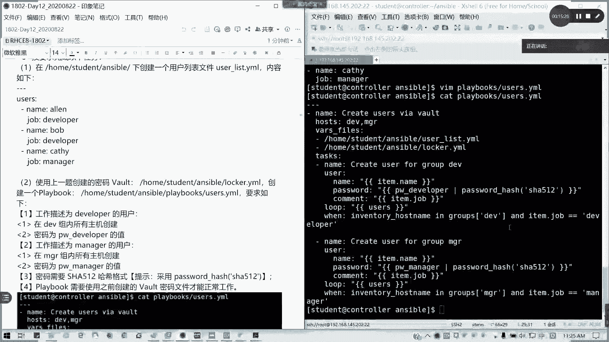

---

## 练习三：根据主机组替换文件内容

最后，我们来看一个根据主机组动态修改文件内容的练习。

**任务要求**：
在所有主机上运行一个任务，根据主机所属的组（`dev` 或 `mgr`），将 `/etc/issue` 文件的内容替换为不同的文本。

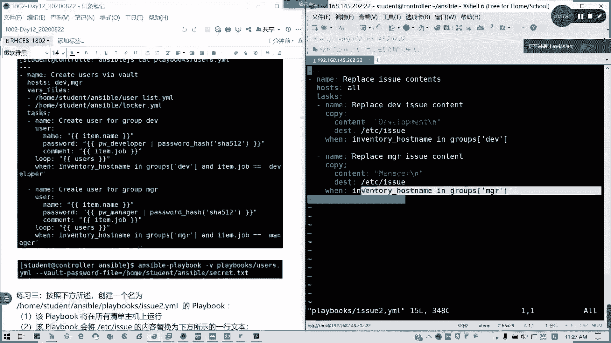

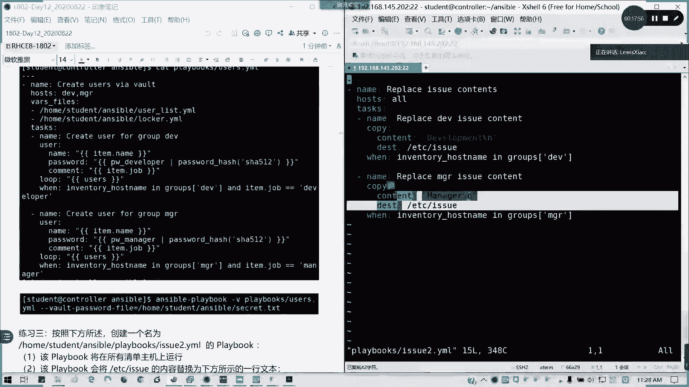

以下是实现该功能的Playbook示例：
```yaml
---
- name: 根据主机组替换文件内容
  hosts: all
  tasks:
    - name: 为dev组设置内容
      copy:
        content: “Development Environment\n”
        dest: /etc/issue
      when: inventory_hostname in groups[‘dev’]

    - name: 为mgr组设置内容
      copy:
        content: “Management Environment\n”
        dest: /etc/issue
      when: inventory_hostname in groups[‘mgr’]
```

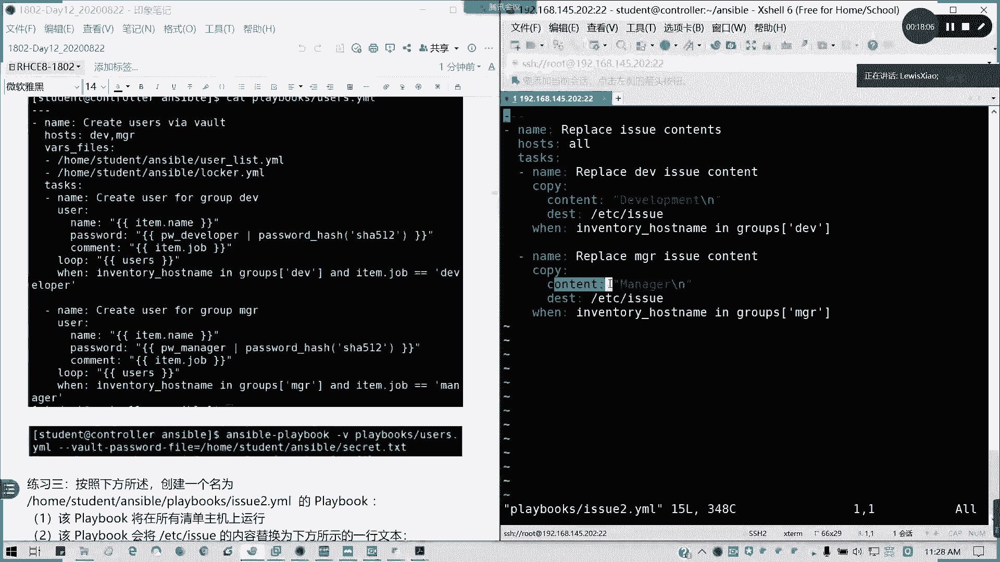

**方法说明**：
*   这里使用了 `copy` 模块的 `content` 参数直接生成文件内容。你也可以使用 `lineinfile` 或 `replace` 模块来修改文件的特定部分。
*   关键点在于 `when` 条件判断，它确保每个任务只在其条件满足的主机上执行。

---

## 总结与考试提醒 📝

本节课中我们一起学习了三道Ansible综合练习题，涵盖了：
1.  **任务块（block）、救援（rescue）和始终执行（always）** 的用法，用于结构化任务和错误处理。
2.  **使用ansible-vault加密敏感变量**，并在Playbook中安全调用。
3.  **结合循环（loop）、条件判断（when）和主机组信息**，实现动态、差异化的配置管理。

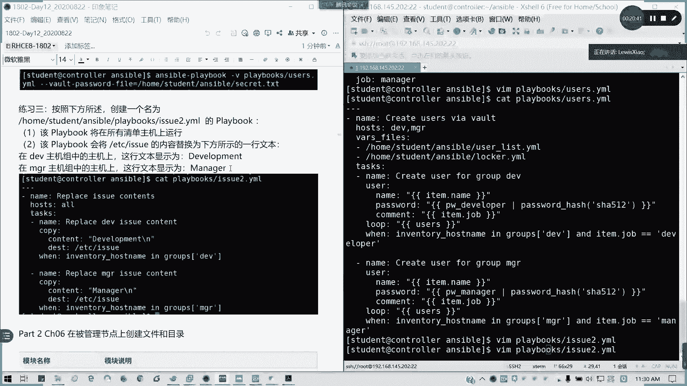

这些是RHCE考试中的核心技能。在考试中，请务必注意：
*   **执行身份**：明确使用哪个用户（如 `student` 或 `root`）在控制节点和执行节点上操作。
*   **文件路径**：确认Playbook、变量文件等资源的正确存放位置。
*   **连接配置**：确保控制节点与受管主机之间已建立正确的SSH信任关系。

思路清晰是解题的关键，理解每个模块的作用和组合方式，就能高效地完成自动化任务。