# 拿下证书！Redhat红帽 RHCE8.0认证体系课程 RH124+RH134+RH294三门认证视频教程 - P71：71_Video_Day12_RH294_Ch06_文件目录管理及JINJA2模板 - 16688888 - BV1734y117vT

第六章。第六章在被管理节点上创建文件的目录。这里的话我们主要涉及的模块有以下这些。但是呢我们已讲过模块是不是有5个？那我这里我就不讲了，不讲这5个模块，或是讲我没讲过三个模块。

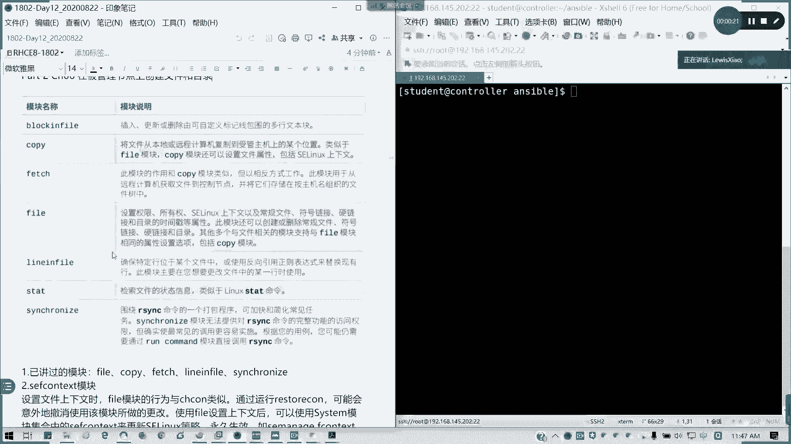

一个叫做SEFcon，这是上设置安全上下文的啊。安全上下文跟ch类似。其实我们可以集成在user我们就在f模块里面写，对不对？copy模块里面写，对吧？但我们当那时候写的话，如果是写的SEt。

那就是默认上下文。但是通常它是临时生效，如果设置永久的话，我们是通过这个啊。我这里已经有一个有已经写完了1个SEF contest在这里啊，就我们的index点HTML，我可以设置它的。

有就默认安全上下文这个文件啊为HTPD杠C杠口间杠T，也就是我们的web文件的一个安全上下文，上当可也可以访问，对不对？

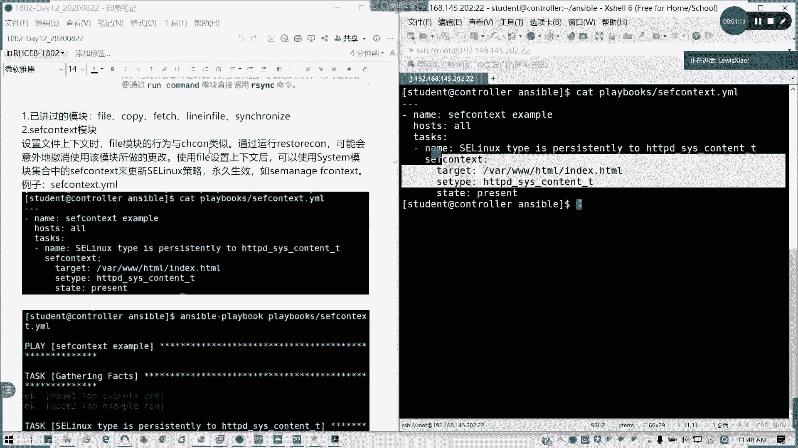

运行结果大概这样子啊，如果启用SA6ux的话，我们通常在我们当然我们现在是不需要啊。如果是最小化安装的话，我们是需要安装python3labSinux的。如果是最小化安装。T的话是这个。

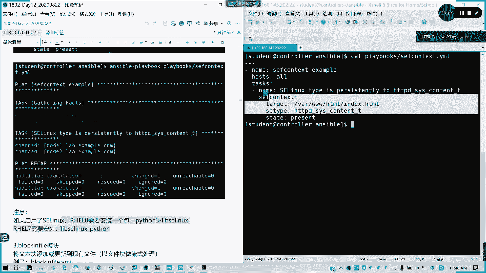

能有吗？这个是设置安全上下文了。

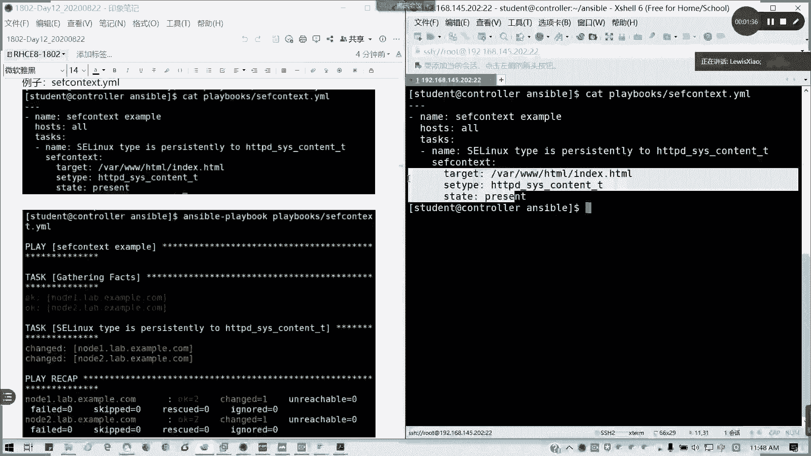

然后呢，还有就是broing file。我们之前有学过一个lying fire。lying file呢是可以按行来添加我们的，就修添加修改文件内容。但是broing fire呢它是以。

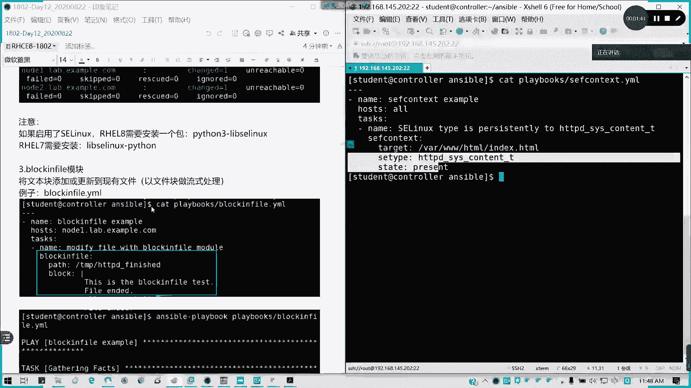

文本块的形式来处理。对吧文本快与文件快来做流失处理。我们看一下这个剧本。我这个当然我在之前，因为我刚刚刚结束完，就是中职老师国徽班，所以这剧本我还有。Brop in fire。对吧比如说note一。

我之前不是有1个HTP里面finish吗？然后我在里面追加东西，记着记住它的格式是要在前面加一个pad，然后后面追加啊。

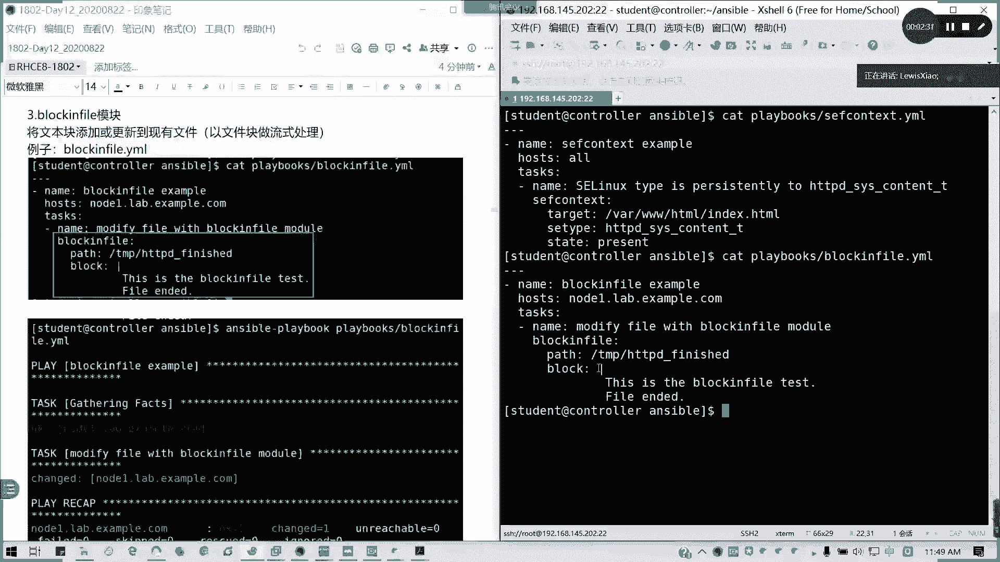

后面追加。我们的内容就是用rock参数pass呢就是指明你要修改的文件的一个。路径用绝对或相对都可以。然后呢，后面brolock加竖线之后呢，是在后面追加的。后面追加之后呢，我们会看到一个。

我这里已经是做做完了一个实验啊，所以的话我们直接看结果。剧本知道怎么写的吧？

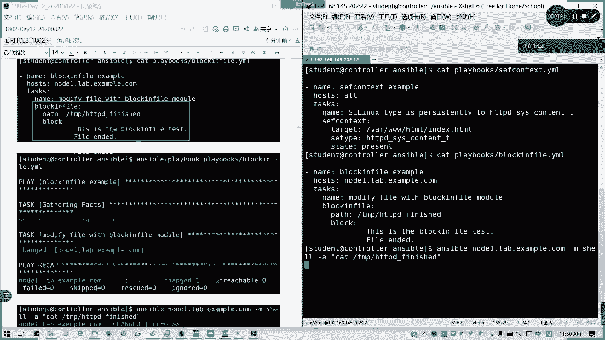

他会在现在啊现在我们。🎼没有追加到没问题。我跑这个剧本answeribleplaybook。

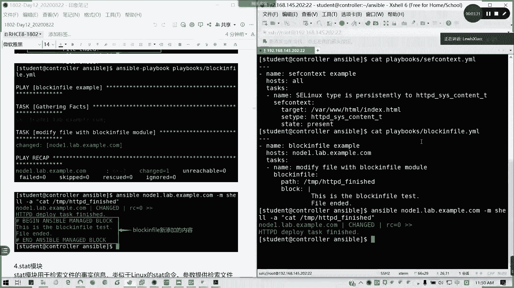

杠Vplay books里面的叫做brown in fire。你看change啊，他已经发生改变，然后他报的报的信息就是brolock insert，对吧？直接插入了。我们看一下这个文件的结果。

看到没有？跟我的讲义里面是一样的。它就在这一行之后，整个快插内容，但是它前面有加一个注释，叫做begin and manage block跟跟and answer manage block。

但这两个行是不会显示在我们具体的文件里面的，对吧？它是就是我里面插了多少内容，你多少行，它是按照块，就是我们四方体，就是我们正方形这组们的立方体立方形对吧？长方体正方体，反正你往下插多少段。

它都会写在里面。这叫这这个模块叫做broing by。那没有啊，被没有不。然后接下来有个state模块。state模块呢是根据文件的事实信息，类似搜检索文件的一个事实信息，参数参数提供检索文件属性。

确定文件校换盒等功能。它是一个包它是会返回一个包含文件状态值的一个散列的一个字典啊，因此我们单独编量引引引用各项信息。我们看一下state一点样本。这个剧本我们在node一上。

我要收集这个ETC passWD里面的MD5是吧？哎，我要收集它的MD5信MD5的加密信息，WMD5这个值，然后我要输入它的一个校验和。我为了输入校验盒呢，我会将它的输出结果。

保存保存到我们的注册变量原造里面。懂我意思吧？那后面说说。在里面伪造点state。里面有一个叫trans，也就是我们的教验盒。输出结果。

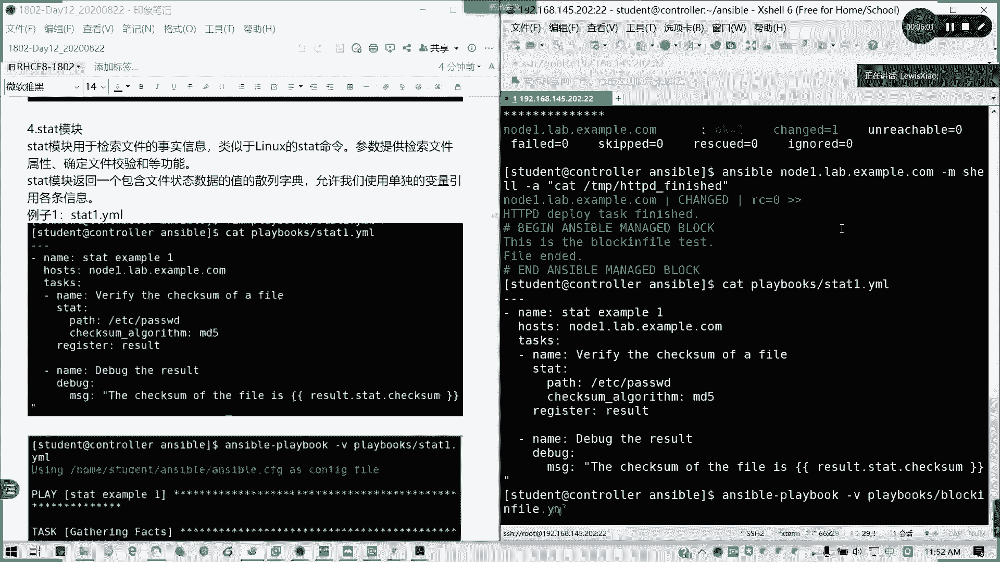

我要看一遍啊。为什么state check out呢？我们来来通过杠V来就看能看得到看得到了啊，它里面就是veify我们自己定义的一个任务啊，是吧？它它的是整个state参数，这整个结果是这这一块吧。

我们整个结果是不是这一块啊？然后他的state里面的。check some对不对？它的校用盒，其实所以输出的话是这个。这一行啊这个结果这里我这样好又又不一样了，懂吧？然后像有些返回值的话。

是由ensible dock记录，然后并并或者我们注册一个变量，并显示其他的可用信息。对吧我会返回所有。对C two点压来讲这个东西。对吧我将这个state，我的文件状态，我保存到一个注册变量。

叫做state下划限比造。然后我可以通过debug是吧，debug模块你知道怎么用的吧？它可以显示屏幕上输出指定信息，也可以输出我们的一个指定的变量值。

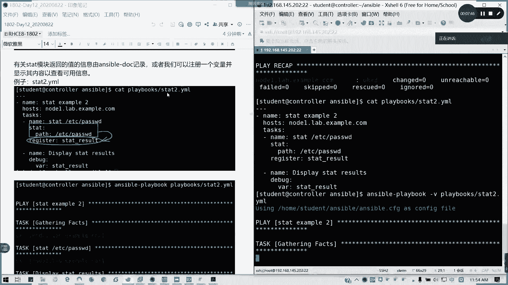

对吧。输出了这么多的我们的文件状态信息是吧？那区块它大小啊，它属性啊，它修改时间啊等等，对吧？明白我意思吗？

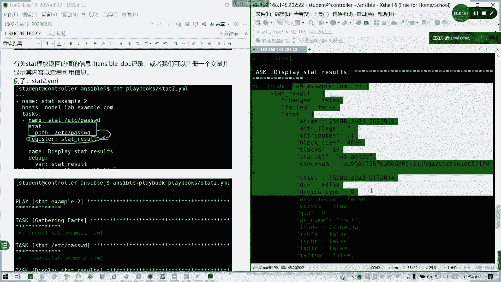

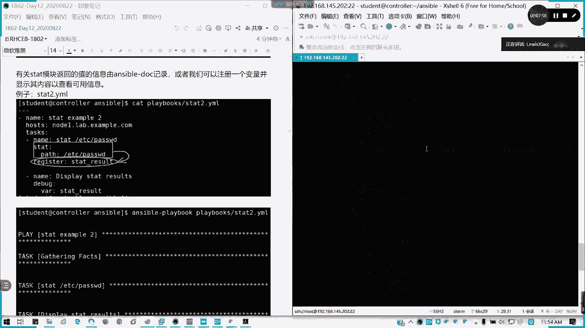

好，我们讲就这这个是第一部分。第六章的第一部分管理文件跟目录，我们就补充了这三个三个模块啊，going five state，还有那个叫做SDF contest这三个模块。好吧，那接下来我们来讲。

一个这张的一个核心叫金家兔的模板。

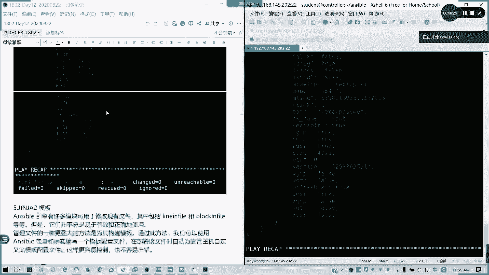

这个里面综合练习，包括考试都会考的啊，至至少一题。sible引擎呢有许多模块可以修改现有文件，其实包括我们linefin跟fin等等。但是它不能总是这么用吧，对吧？

管理文件一个更强大的一个办法呢就是构建模板，像我们编程，像我们做一个。文本文件都有模板是吧？只要我像我们写东西，做有模板再套进去就可以了，是吧？它其其实我们可以构建模板，通过这个方法呢。

可以使用S5变量跟事实来编写一个模板配置文件。在部署该文件的时候，自动为收完主机自定义，对吧？这样我可以容易控制，也不会出错。其实也就是我写一个模板之后呢，我我通过模板升给复制对应的主机上。

我就可以将它里面的变量转化为相应的值。懂我意思了吗？模板的作用。金加它是采用金加兔的格式啊，金加兔格式也是基于python的。好，我们来重点来看这几个相关的风格符。

一个是中间我们ESPRexpression代表是表达式啊。如果是大括号把根号括起来的，是用于表达式或是逻辑。比如说循环判断，我们待会会讲到一个叫做经销。

就是错误跟意就是我们的模板里面要怎么写才是正确的啊。然后还有一就是两个大括号括起来，就是用于下我们的最终或输出我们的表达式以及变的一个结果。在呈现时候呢，它会自动变为我们的实际的个值。

然后还有comment就用于注释啊。大化星号代表注释不会出现在最终的文件里面。然后我们接下来讲完了这个，就大家知道这几个分隔符之后呢，我们要我我们开始要构建模板了。新加兔模板有多个元素组成组成。

数据变量以及表达式。在呈现模板时候呢，这些变量和表达式会被替换回对应的值。模板里面可以在推book里面的变量组里面去指定啊，可以将受关组件事实作为变量。我们来看一下这个。我这已经写好了啊。

写好了叫做template deployy。兔点压的哈。这个剧本文件我来解释一下是干嘛的。好吧，首先。我这个。我我这个剧本文件呢是一个we的我们的阿帕奇啊，还知道吧？阿帕奇我们是不是有配置文件。

是有个叫HTDPD点comHTDPD点com呢，我如我一般来说我因为每台机构特定的一个配置。那好，我可以以此来做模板，我会复制到对应主机上对吧？我这里就讲一个HTTPD模板的一个部署。

然后假假设我的那个后在note2在note2附属在HTTPD模板，然后呢我收集试试啊，因为这里的话因为每个模板的话，里面。我有个有一个情令，就是我们的先听的1个IP地址。是不一样的。

对吧每台机器我提供服务的我的外我们的IP地址是不一样的。对吧。可以明白我意思吧？所以的话我们这里。会做模板来对它进行替换啊，对它进行替换替换。我们来分析一下里面的步骤。

我这里我可以顺便我打开一个note two。我打开note two，我首先来第一个，我要构建我们的模板文件。首先大家你我要在节点上面，我要装好我们的web服务啊，H阿帕奇也就我们HTDBD装好之后呢。

我可以通过贵我们的文本处理三节课，对吧？文本处理三节课可以把这句话知道什么意思吗？我可以通过break把开头式空格带井号的所有行，以及仅把多了开头的所有行去掉。留下来了，是不是全部都资金水？

对吧全部都是我们配置项。那我这里我执行一下给大家看一看。然后我ca迪，我我摸一下。TMP里面的 time too。是不是剩下的就这些了哦。

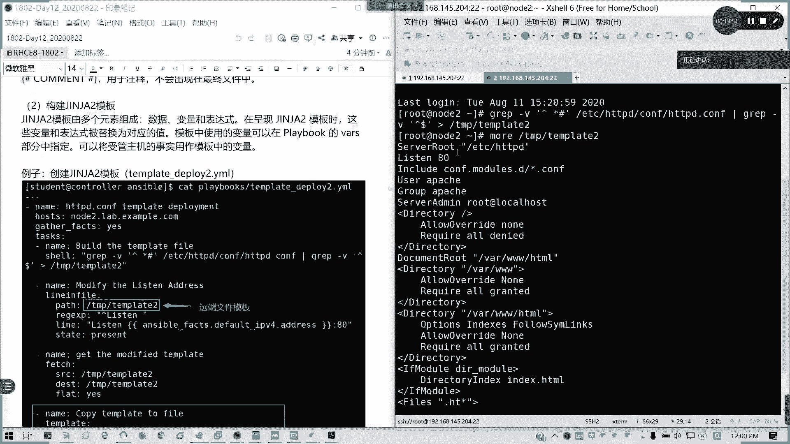

懂了吧？空格带空格带星号的，它它中它原本文件是怎么样的呢？我给他对齐对比一下。

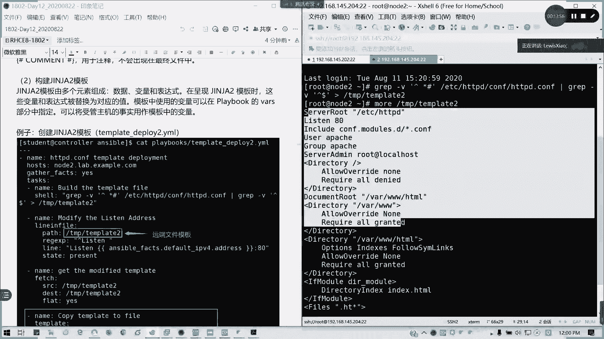

好像在已经被替换过了。就有没有替换过，前面是型号空格的对，信号空格这些我们原本的文件呢。我们可以，我付我我我我看一下，我我给你看一下ETCus需要告诉里面。有。HDPD。有examp的给你看一下。

因为这里我是我都已经替换过了SGPD然后呢。Defa。给看看默认配存是怎么样子的。我意思去掉就这些。这些是不是全部都是注释啊？那我模板是不不需要这些东西啊？我自定一个模板之后我把图师去掉就行了。

然后把这这些留下。对吧关键的配置项我要留下，但是我这些打井号的全部不需要。懂我意思吧？所以做一个简览模板呢，我的最终的呈现效果，现在这个已经改过了啊。我最终呈现效果是不是这样？是是简化很多。好。

这是我的第一步的一个作用。第一步的一个作用就是我们呈现模板。然后接下来我要修改模板，修改模板的作用呢就是把特定的。比如说我就是这里就是把我们的。listson这一行，因为listson这行干什么用呢？

就是我们的。监听我们的IP地址，对不对？IP地址。那IP地址怎么获取呢？我们在我们学过anl事实管理情况下，是不是在an里面的defa下划线IPV4点啊。

里面的 addressdress是不是可以获取到我们的IP地址？对吧。所以这一点就这一个部分就是利用我们的均加兔模板来替换的。懂我意思吗？把用用line块把这个远端文件模板，把它这一把我们的。

这一个字段listson这里把它换掉。懂我意思吧？好，然后呢接下来因接下来我们要用到一个tempatetempate复制的时候，它才会把我们的模板。🎼复制过去之后，将它的变量转换为它的转换为实际的值。

但是我们会考虑到，因为之前的话很多人就直接哎我就这我就直接做这一步，但是有问题。因为你修改的，我们是在node2上面去专门的服务，对吧？我们是在node2上面去装这个服务。

那这个文件我并不在控制节点上面，我们temperate的作用是在控制主机上面是吧？在控制主机上面，然后我把。模板修改的话就复制过去。但是我这个文件并不在模控的主机上。

那我是不是可以加一个flash模块啊？把这个文件拉过来，到时再我们有一个思路是吧？但家有其他思路可以告诉我啊，可以，我们可以把这个文件拉过来再放过去。可以对吧。然后放过去的时候。

我们用tempatetempate，这个就是复制模板到对应主机上，而且它会把模板里面的金加兔啊这一块的值替换成实际的值。所以这里的话是tempate，主要指定source跟 destinationin。

就可以啊。懂我意思吧？

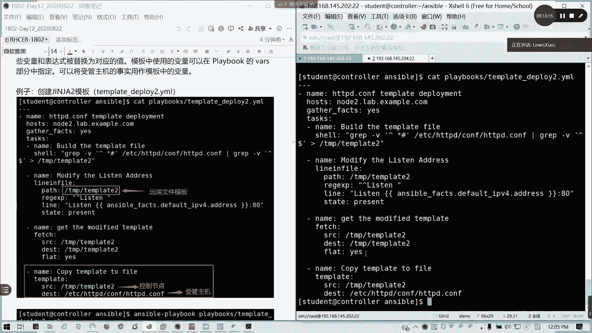

好，运行的结果我们来看一看。

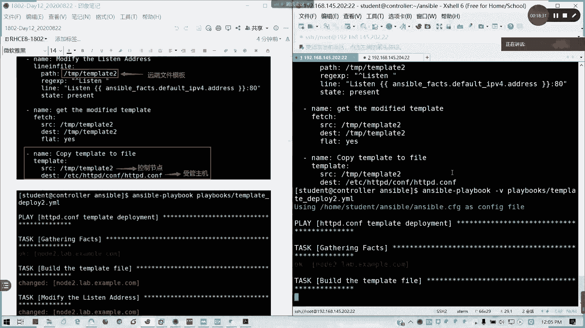

你看这里的话先改了模板之后呢。对吧复制过去之后呢，我它拉回拉回来。早复制到回复制回去。就相当于我把这个模板应用到了实际的配置文件里面。懂我意思吧。然后这里有人会问了，copy模块跟tempate模块。

如果copy模块，我这里我比如说我就写1个TMP host。我这里写就是SO里面就获取我们的IP地址列表，IP地址，还有我们的完整主机名。能能懂我意思吧？我们金价通模板，我这里写的两个。

是不是我们通过安O安f里面来调用，对吧？然后我用copy tape的样给大家看一下。我这里。日ho一new2分别用toppy。他的t两个模块，然后给大家做一下对比。这个文件我是专门写来对比的。好。

我们来看其中一台文件，其中一个一台机器。呃，Sible啊还是用临时命令吧。能听懂吗？对吧？我开两个文件，同时开两个文件。host杠一，还有TMP。喂，还有还有host杠2。第一个。后s杠一是第行那容。

我复制的话内容原封不动。懂会说。内容原封不动。第二个。我用t的是不是被经被替换了？所以新加这模板其实好多地方都在这里。我写我最对应的变量，我我我我要部署模板，对应的变量，就我们写好对应的一个语句。

我们的模板语句之后呢，我复通过tempate模块复制到对应的数完主机上，它的值就会被替换成实际的值。懂我意思吧？我用copy的话，我这里没变过了，原封不动。能明白吧？

对吧那这里的话我就我要我用后期后4这样看就知道知道了啊。所以小学呢。注意啊，这里的话它是视为那个变量跟表达式是要至于标记跟分格符风格符就我们空格啊，空格之间。所以的话我们主要讲这三个。没问的话。

请扣字我D。那接下我们讲学案的判断。那今天我进度会稍快点，有没有最后一天了。明白这块这块明白话，请扣司亩地。好，接下来我们讲执行加授，我们中午就把第二章讲完就行了。下午重点讲角色哈。呃。

金雕兔呢它有一个语法啊，循环的语法是for变量引列表。我们用判断循环的一个表达式就是百分号。哦。到上班课吧。然后呢，我来看一下啊。语法是这样的，for变量音列表或是某些表达式都可以啊。

然后里面就如果满足条件，就是文本内容，比如调用变量对吧？调用变量，然后后面结尾是and for。新加图的格式啊，and for结尾懂了吧？它使用一个force来提供功能。然后我们循环里面的列表里面啊。

我们这里的话我可以通过一个模板，我这里就这这里我的书本上结束我就不看了。我还以一个例子来告诉大家。这里我先去我用新加to four，我这是循环创建用户啊。就选在这个就一个用户模板，我把它打不出来。

不是创建用户，这是一个导出用户模板的一个对吧？我这里定一个用户，就是变量user，然后。这个模板是有一些好的。啊，然后在我这个变量user在我们的user变量里面，如果它满足条件的话。

我就批量输出我们user量这样打下来。然后我看一下具体的剧本。惊吓兔。放对点压嘛。均价突后一张后。这里我是是定了一个变量组，里面有user，一个user2，对吧？别束速，然后我copytate。

我t是不是写在这里了？对吧。源头是这个，然后我负责userC，那我们来看一下执行结果。我们在在所有主义上实现。

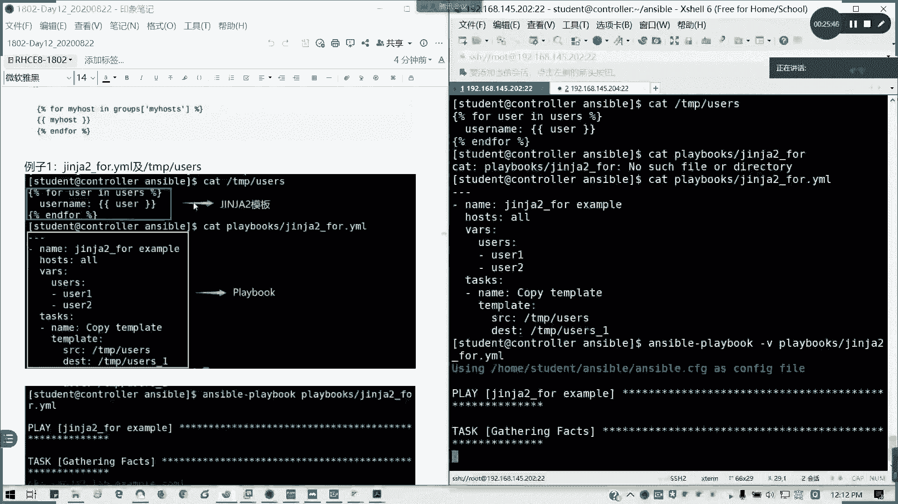

好，我们来看一下anible。我看一台机械就行了。TMP的我刚才复制到一个文件叫做users一是吧？看到没有？我的模板我给我呈现的结果是这个。

对吧forouruser inuser这个变量在user这个列标变量列表组里面，我就会循环输出它这个。对吧user name，然后输出对应的user值。在我们copy完模板之后呢，他会。

变成Uer1跟Uer2，对不对？懂我意思吧？然后我也可以有另外一个例子，就是我来输出我的IP地址跟主机名。我们这个。模板叫做后点追 two。通常我们写新加出模板的话，我们会以点J注作为结尾。

对吧for hosting group service啊，我这里改一下，我这里改要改一下清单了。把service这个放出来。然后把DEVM去掉。把他打上复士。对吧如果主机hosse这个变量是主机。

在这个组里面，在server这个主机组里面，那我就输出内容输出为。他的IPPC地址以及它的完整储机名。我这样解释能听懂吗？然后我来看一下均加for two点1。剧本怎么写的？

我直接copy temperate啊，下一集目录的后s点追 two。然后复制到TMBhost里面，授款主机是service组，懂我意思吧？好，我们来看一下。

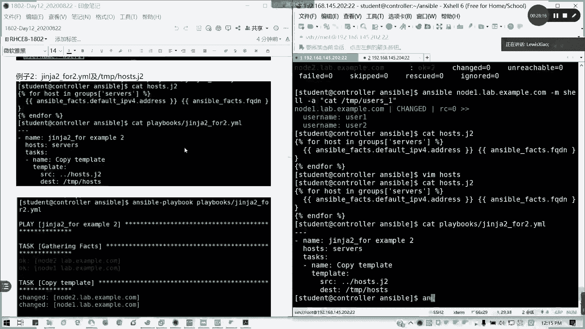

这也是模板文件你要存在的啊。好，刷是OK我们看一下。は。这里无足不意外，它会复制两次啊复制两次，但无所谓啊无所谓。因为两台手机的话，它复制两次无所谓啊，只要但是我们能看到这个更改。

它会把我们的模板是不是替换成。替换人值了是吧？好，这个是君加 for一个循环。均家if呢我if我们讲的判断啊，判断是满足条件里面，但这里满足条件它是会在文本里面添加内容。

就加fo的话也是相当于添加内容啊，输出内容的这些模板就连模板就是把。拿来加内容用的，不是用做什么判断啊，逻辑处理是这样。像金家衣服，它是这样衣服条件，然后语，然后后面是语句是吧？我们的添加内容。

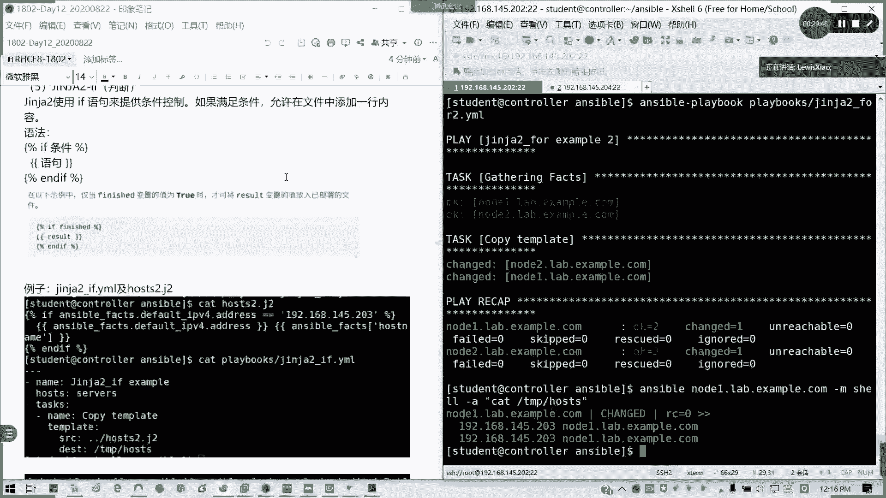

添加内容语句。然后后面有and的if。作为结束。到这里我有一个。一个例子。我这里再写一个post点 to点追 two。这个模板我是会写到一个post name。短组织名。好吧嗯。当主任名。

如果iphone findVV4address就它的。地址是203对吧？他会输加往往里面往模板里面把它在既有文件里面加一个内容。好，我们来看一下。剧本在这里。金加意。同样也是复制模板。

我们看一下执行结果。对啊，都发生改变。来看一下是不是我note2，我就不输出任何东西了。但note一。我最喜欢哦啊。node一是有东西对吧？就是道短组里面，那n是空的。懂我意思吗？

因为他判断条件就是我的IP地址是140035来做。懂我意思吧。好，接下来我们第六章已经讲完，如果懂的话，请扣个一啊，字母一。没办法写扣个字母一哈。好，接下来有一个练习。当你拿做一下啊。我要生成一个模板。

生成一个模板之后呢。跟跟ETCho相同的一个格式。然后呢创建一个facebook。后要么，然后允许在连在我们serv组的主机生成1个EDC myho文件。然后完成之后呢。

service主机组主机上文件EDC byho应该为每台售款。每台售管主机。来添加一下内容，这两个是有的啊。然后还有后面就是留空完之后，就是IP地址。对吧然后注意写清单主机名称的显示次序不重要。

就如果哪怕他颠倒的显示，也没以看到很别。那这道练题请大做一下。就章我经讲完了。可以思考一下怎么做。其实也可以用我们的水。循环吗？那这个IP地址呢是根据实习的IP来来定的。嗯，这只是一个事例。

单方点先思考一下，然后请行要重处理。反正我们下午七八九张。第十章也会讲。内容不算多啊。可以给大家看一下我们的参考做法啊。参考做法的话，其实我们模板这两前面几行固定不变的，对吧？固定不变的可以写在上面。

然后呢，后面我用循环，但这里要用ho bus啊，用ho bus，因为要输输对应的主机主机的一个名称的啊，对主机名称IP地址。所以的话这里的话我我用ho bus来做。所以你既然用ho bus呢就不能。

就不能使用我们的。点了全部使用框框，这样框起来，主要是输出我们的几个东西，一个是IP地址完整主机名以及减减掉的主机名，然后用and for结尾。然后后面我们复这个模板。然后执行完之后呢。

我们可以来看一下1个ETC。My host。所有主机我们运行完之后呢，应该是这样的一个结果。这样结果才正确的。因为时间关系，我就先把这个练习先讲了。好吧，现在12点27分，我们下午2点钟2点05分啊。

过5分钟我们讲第七章及之后的内容。好，中午啊先休息啊。下午见。