# RHCE8.0认证体系课程：第六章：文件目录管理及JINJA2模板


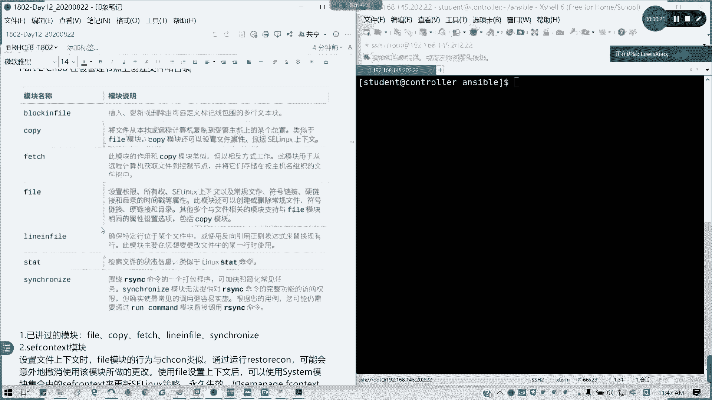

在本节课中，我们将学习如何在被管理节点上创建和管理文件与目录，并深入探讨使用JINJA2模板来动态生成配置文件的核心技术。这是RHCE考试中的重点内容。

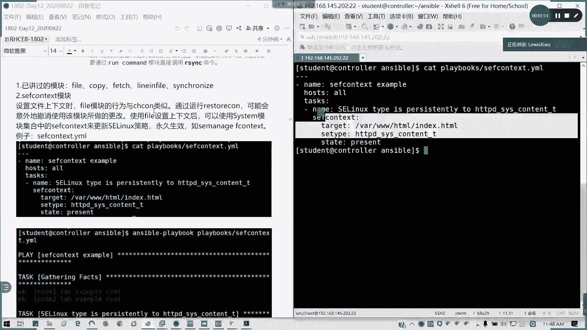

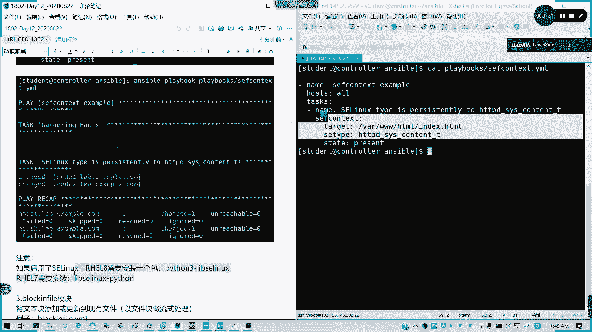

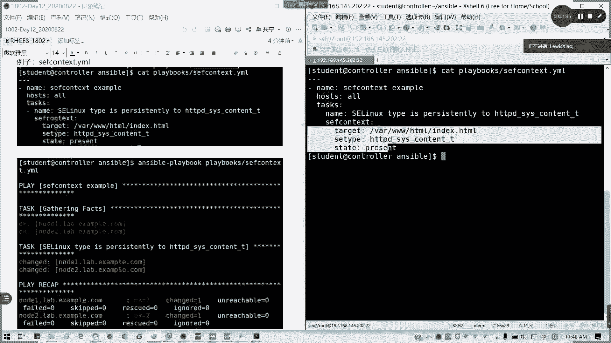

## 补充文件管理模块

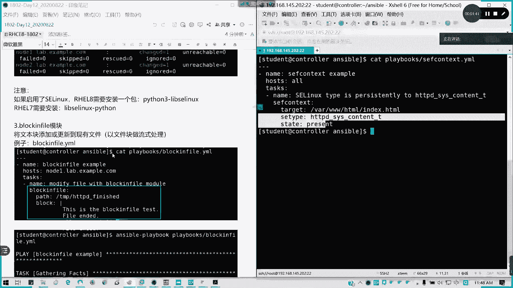

上一节我们介绍了基础的模块，本节中我们来看看三个补充的文件管理模块：`sefcontext`、`blockinfile` 和 `stat`。

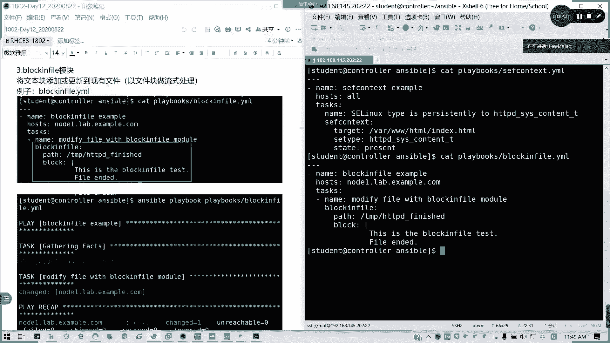

### 设置安全上下文：`sefcontext` 模块

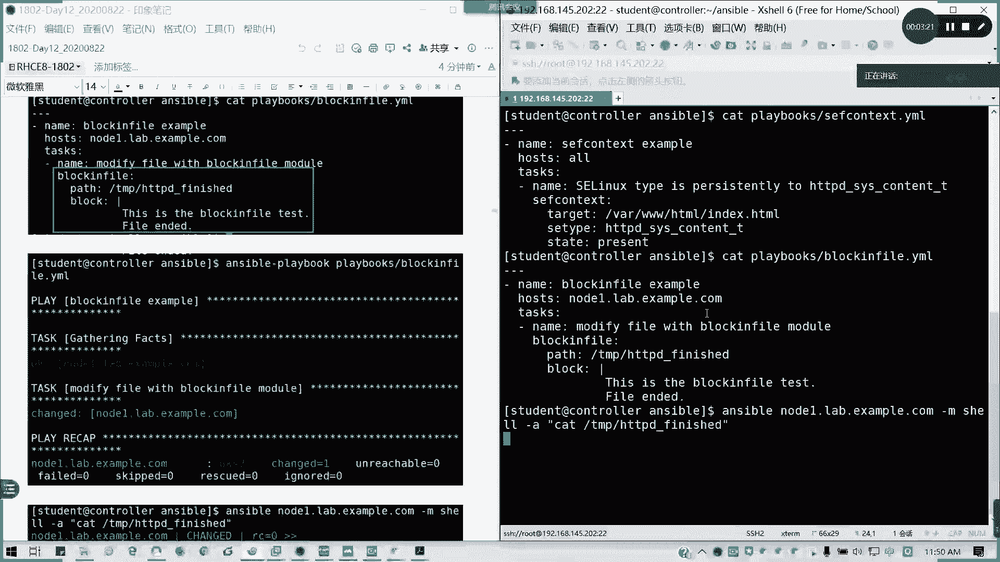

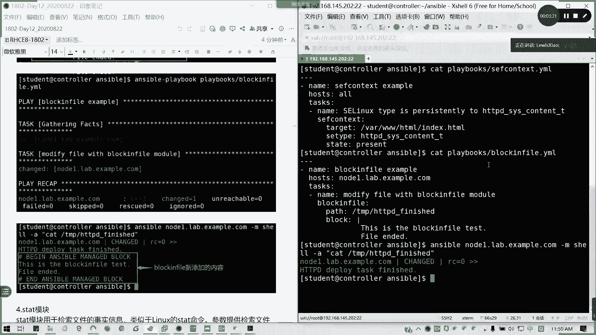

`sefcontext` 模块用于设置文件或目录的SELinux安全上下文，其功能类似于 `chcon` 命令。虽然可以在 `file` 或 `copy` 模块中设置上下文，但使用 `sefcontext` 可以设置永久生效的上下文规则。

**核心概念公式**：
```
sefcontext: target=<文件路径> setype=<安全上下文类型>
```

例如，为Web服务器的索引文件设置默认安全上下文：
```yaml
- name: 设置 index.html 的 SELinux 上下文
  sefcontext:
    target: /var/www/html/index.html
    setype: httpd_sys_content_t
```
运行此任务后，文件的安全上下文将被永久设置为Web服务可访问的类型。如果系统是最小化安装，可能需要先安装 `python3-libselinux` 包。

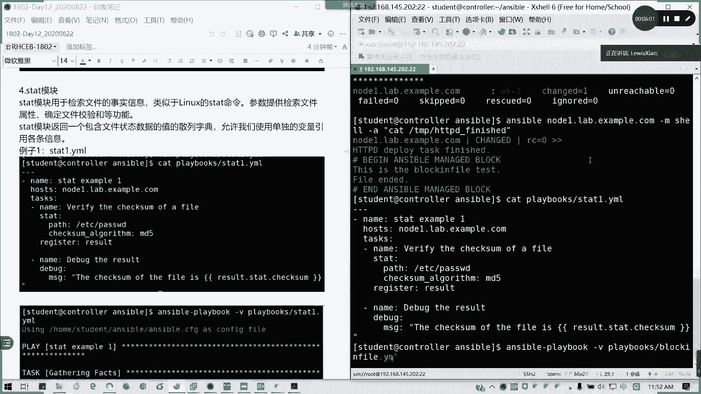

### 以块形式管理文件：`blockinfile` 模块

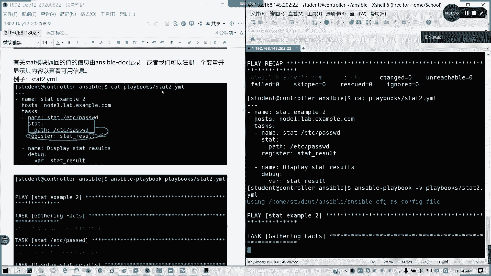

`blockinfile` 模块用于以文本块的形式在文件中插入、修改或删除内容，这与按行操作的 `lineinfile` 模块不同。

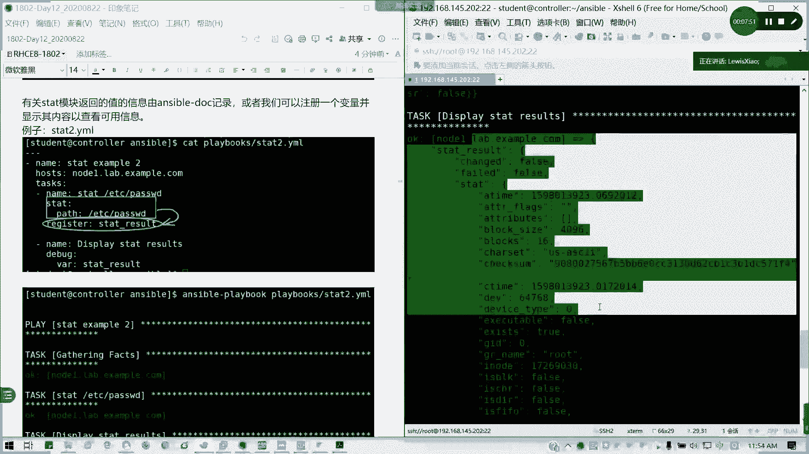

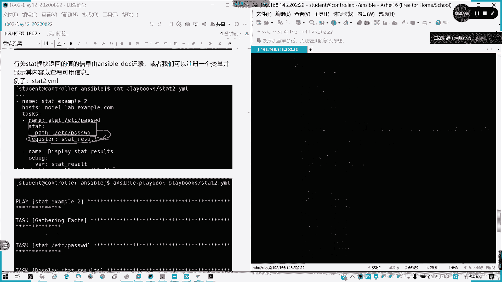

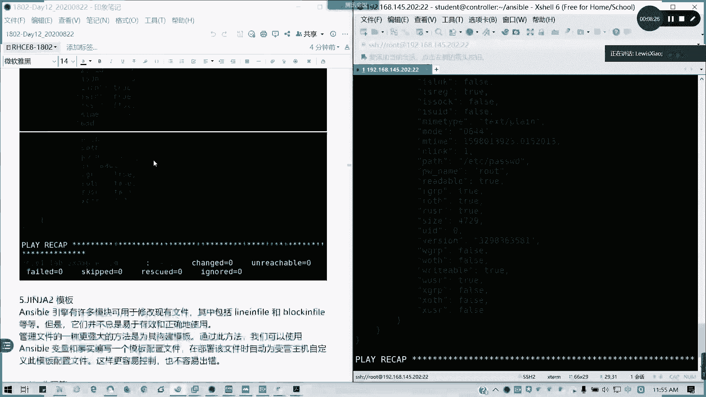

以下是使用 `blockinfile` 模块的示例：
```yaml
- name: 在配置文件中插入一个文本块
  blockinfile:
    path: /etc/httpd/conf/httpd.conf
    block: |
      # 这是一个由Ansible管理的配置块
      ServerName {{ ansible_fqdn }}
      DocumentRoot /var/www/html
```
执行后，模块会在指定文件中插入一个文本块，并在块的首尾添加由Ansible管理的标记注释（这些注释不会影响文件功能）。

### 检索文件状态信息：`stat` 模块

`stat` 模块用于检索文件的详细状态信息（类似于 `stat` 命令），并返回一个包含文件属性的字典。这常用于获取文件的校验和、修改时间等，以便进行条件判断或验证。

**核心概念代码**：
```yaml
- name: 获取 /etc/passwd 文件的MD5校验和
  stat:
    path: /etc/passwd
    checksum_algorithm: md5
  register: file_stat

- name: 输出文件的MD5校验和
  debug:
    msg: "文件的MD5校验和是：{{ file_stat.stat.checksum }}"
```
`stat` 模块返回的信息非常丰富，您可以通过注册变量（如 `file_stat`）来引用各项属性，例如 `file_stat.stat.size`（文件大小）、`file_stat.stat.mtime`（修改时间）等。

## 使用JINJA2模板动态生成文件

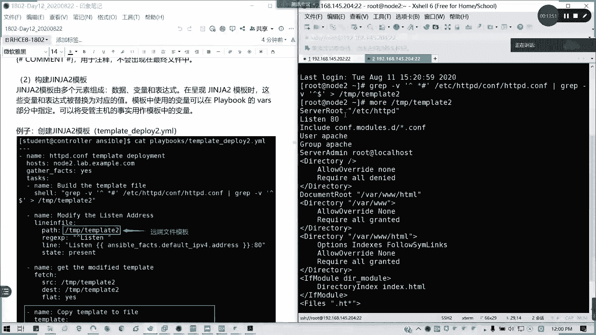

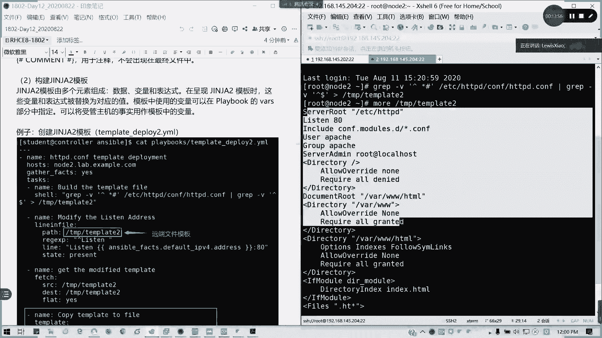

管理文件的更强大方法是使用JINJA2模板。它允许您编写一个包含变量和逻辑的模板文件，Ansible在部署时会根据每台主机的具体情况（变量和事实）自动填充内容，实现配置的批量定制化部署。

### JINJA2模板基础语法

JINJA2模板基于Python，使用特定的分隔符来嵌入逻辑和变量：

*   **``**：用于执行控制语句，如循环和条件判断。
*   **`{{ ... }}`**：用于输出变量或表达式的值。
*   **`{# ... #}`**：用于注释，这些内容不会出现在最终生成的文件中。

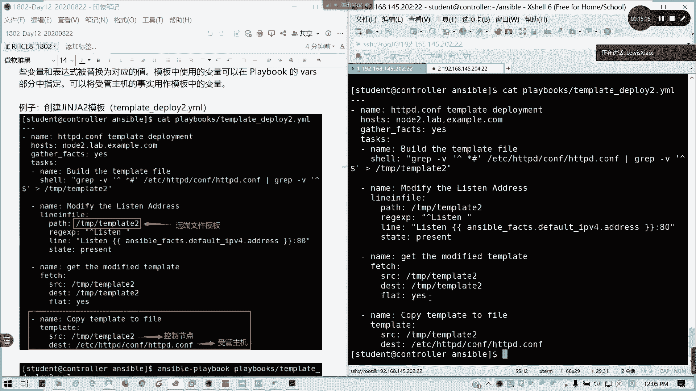

### 模板应用实战：部署Apache配置文件

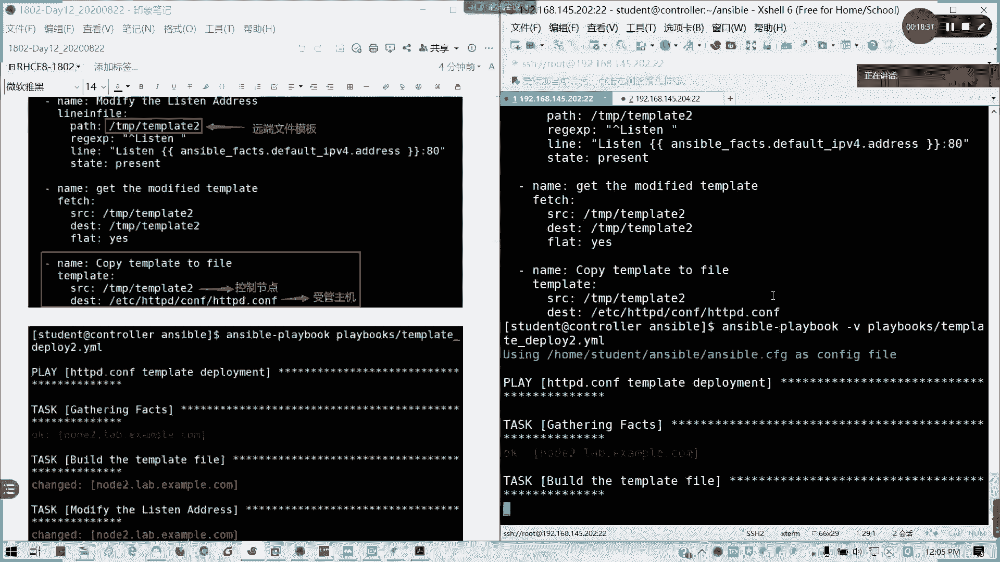

让我们通过一个部署Apache（httpd）配置文件的例子来理解模板的工作流程。目标是动态设置每台主机的监听IP地址。

**步骤概述**：
1.  **准备模板**：从一个干净的httpd配置开始，移除所有注释行。
2.  **修改模板**：在模板中，将监听地址 `Listen` 的行替换为JINJA2变量。
3.  **使用模板模块**：通过 `template` 模块将模板复制到目标主机，变量会被自动替换为主机的实际IP地址。

**示例Playbook (`template_deploy.yml`)**：
```yaml
---
- name: 部署自定义的Apache配置
  hosts: node2
  tasks:
    - name: 安装Apache服务
      yum:
        name: httpd
        state: present

    - name: 从目标主机获取干净的配置作为模板基础
      fetch:
        src: /etc/httpd/conf/httpd.conf
        dest: /tmp/httpd.conf.bak
        flat: yes

    - name: 处理模板，替换监听地址
      lineinfile:
        path: /tmp/httpd.conf.bak
        regexp: '^Listen'
        line: "Listen {{ ansible_default_ipv4.address }}:80"
      delegate_to: localhost

    - name: 使用模板部署配置
      template:
        src: /tmp/httpd.conf.bak
        dest: /etc/httpd/conf/httpd.conf
```
在这个例子中，`{{ ansible_default_ipv4.address }}` 会在执行时被替换为 `node2` 主机的实际IP地址。

**`copy` 与 `template` 模块的关键区别**：
*   `copy`：原样复制文件，不处理其中的JINJA2语法。
*   `template`：复制前会解析并渲染文件中的所有JINJA2变量和表达式。

### JINJA2模板中的控制结构

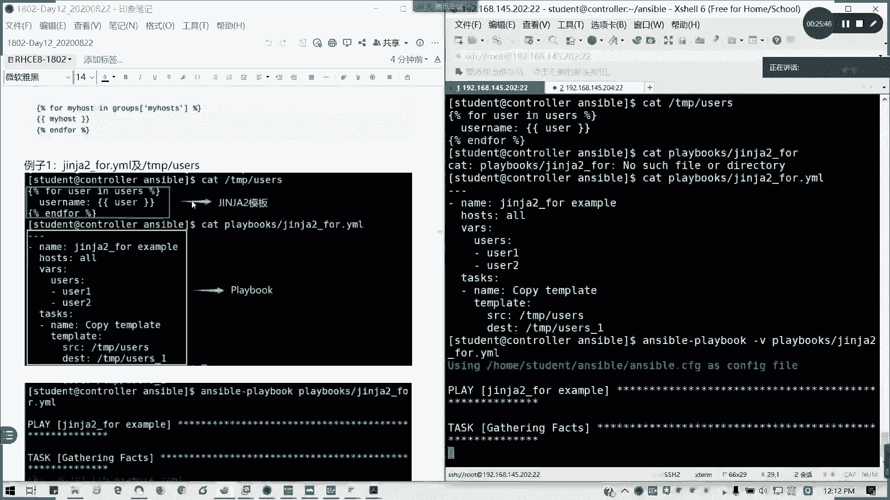

除了变量替换，JINJA2还支持复杂的逻辑控制。

#### 循环：``
循环用于在模板中生成重复的结构，例如批量创建用户配置或生成主机列表。

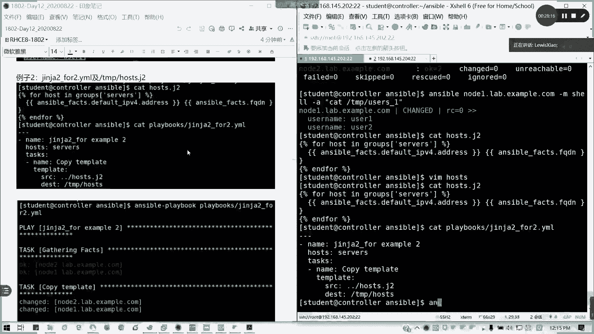

**语法示例**：
```jinja2

用户名: {{ user.name }}
UID: {{ user.uid }}

```
对应的Playbook可能定义变量 `user_list` 为一个字典列表，循环会为列表中的每个字典输出一段内容。

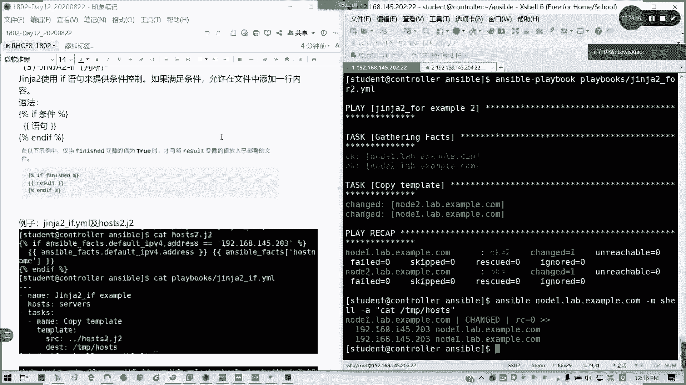

#### 条件判断：``
条件判断允许根据变量值动态决定在最终文件中包含哪些内容。

**语法示例**：
```jinja2
主机名: {{ ansible_hostname }}

# 这是一台特殊的主机，添加额外配置
SpecialOption enabled

```
在这个例子中，只有当主机的IP地址是 `192.168.1.100` 时，`SpecialOption enabled` 这行才会被添加到生成的文件中。

## 本章总结

本节课中我们一起学习了：
1.  三个补充的文件管理模块：**`sefcontext`**（设置SELinux上下文）、**`blockinfile`**（块文件编辑）和 **`stat`**（获取文件状态）。
2.  **JINJA2模板**的核心概念，它是Ansible实现配置动态化的关键工具。
3.  JINJA2的基本语法：使用 `{{ }}` 输出变量，使用 `` 进行循环 (`for`) 和条件判断 (`if`)。
4.  通过一个部署Apache配置的完整案例，理解了从准备模板、修改变量到使用 `template` 模块部署的完整工作流程。
5.  明确了 `template` 模块与 `copy` 模块的本质区别在于是否渲染JINJA2语法。

掌握JINJA2模板是迈向Ansible高级自动化的重要一步，它极大地提升了配置管理的灵活性和效率。