# 拿下证书！Redhat红帽 RHCE8.0认证体系课程 RH124+RH134+RH294三门认证视频教程 - P72：72_Video_Day12_RH294_Ch07_管理大项目 - 16688888 - BV1734y117vT

好了，北京时间2点12分啊，2点12分。我们现在的话开始我们最后半天的内容。这半天内容的话好几张啊。首先我们来看一下管理大项目。但是管理大项目这里呢引用清单主机这里其实我们一开始的时候是不是已经讲过了？

对吧一开始的话我可以使用默认清单，我也可以自定义自己的清单文件，对不对？自定清单文件帮我们收完主机这里，对吧？收款主机这里既可以写IP也可以写域名，但是域IP跟域名是两个不一样的东西啊。

怎么引用就怎么怎么怎么写都怎么调用。前面三个我直接跳过，因为呢是不是我们在在我的复习也已经涉及到了。然后通配符通配符啊，星号跟O是一模一样的。这里的后心啊。是你可以引号星号等于哦一模一样。

然后还有就是我可以用。比如说像这里新点lefting账点com，那到底代表是什么主机同样是通配服，没有太多问题。够唔够掂啊。OK然后接下来是列表，列表话，我可以在后面可以这样子逗号分割，没问题吧。

然后还有就是我们的。And。对吧and跟not也就是说这如果说是说一个group一 and group2，那就既属于group一也属于group2的主机。如果是飞的话，就排除啊。

但飞的就note的话是排除它的一个，就是说我在这个组里面，但是排除它以外就排除某台主机以外了，就前面加个飞就可以了。然后还有一个就动态清单。

动态清单的话其实就是比如我可以用asboardinvent的命令，可以动态去更新。我们可以将它导出导出来，是吧？让动态导出来。然后呢通过杠I选项来指定或者通过杠I来指定我们的清单文件对吧？

或者是直接通我们是习惯来说就是通过配置文件来指定。到这里的话，我们可以其实可以输出成一个追审格式之后呢，是吧？可以把我们当前现上输出输出的一个追审格式，然后再把它导出成一个文件都是没问题的，对不对？

那我这里是用host，对不对？懂我意思吧？

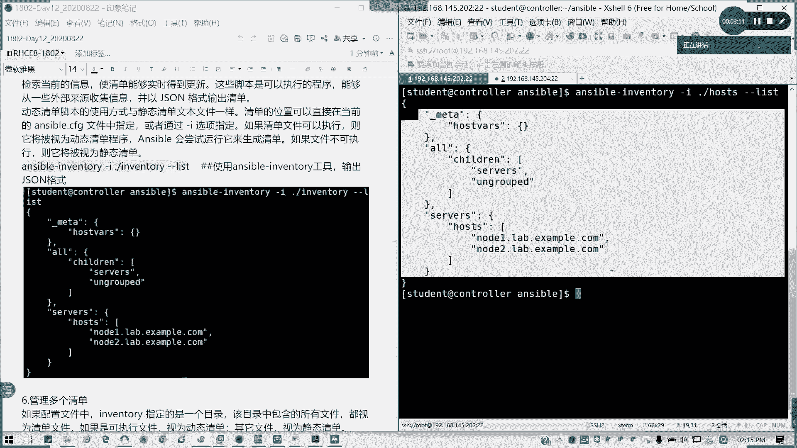

多个清单也是可以的。多个清单的话，我就需要再把我们的inventory。把文件。改成目录。对吧然后里面再写多个清单。就可以了。但多性的呢如果啊。如果你已经在动态清单里面定义了，但概静态清单里面。

如果有成为一个。静态清单组的一个子组的话，那在添加静态清单里面，你必须要占位哈，不要不要不写。但这里个话我们已经就这里不做太大要求，所以的话，我们就。

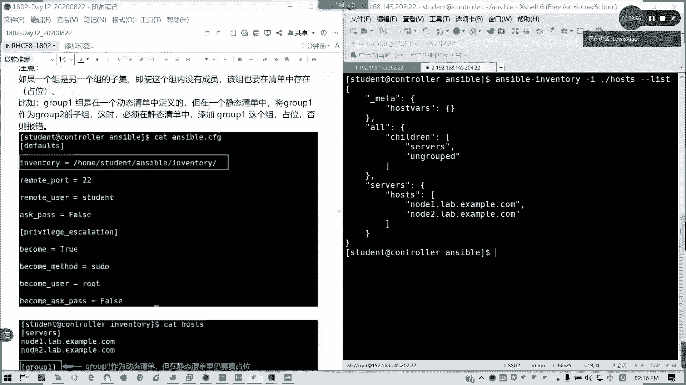

这里我做为一个注释哈，就是说如果过币是动态清单，但是过二的话，它是作为一个子组的话，那这里我我玩流通。对吧还要写，但是我要留空留空就可以了。因为它是一个动态清单，懂我意思吧？可以，它是可变的啊。

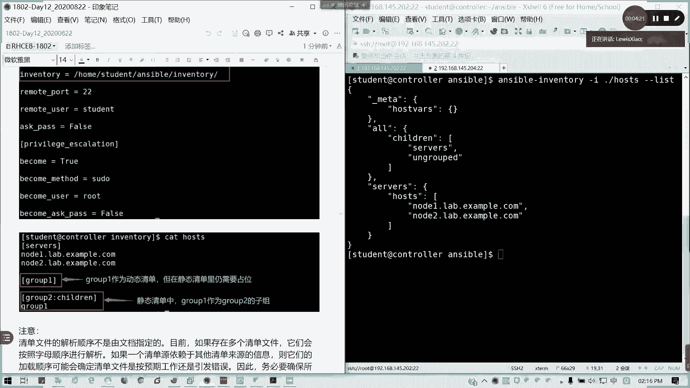

好，说完这个我们来注意看到一下一个分叉。正常来说。ible去处理每一个剧本的时候呢，会逐一对每一个任务进行一个执行。那执行完列表之后，它会按顺序哈。所以的话它通常所有的所有主机在任何主机。

我在剧本里面启动下一个任务之前完成，对吧？它是会每个playbook会完成变当再跑下一个了，理论上我可以同时连接到所有主机是吧？但是如果是数百台数百万台的话，那就不行了。我们可以通过设置我们的分叉。

我们的fox来控制。其实fox我们可以简单理解就是。我在前我我就说我在前五个说完主机上面完成第一个任务，然后在其他完成第一个任务。进行第二轮就这样，它是限制我们的一个。主题数好吧。

所以我们的主机数在这里我们可以看到我们的fok设置啊。fox默认是5啊，也就同时我可以支持5台主机并发。一个分叉啊并发。然后如果超5台的话，他要排队。但这里如果设成一的话。

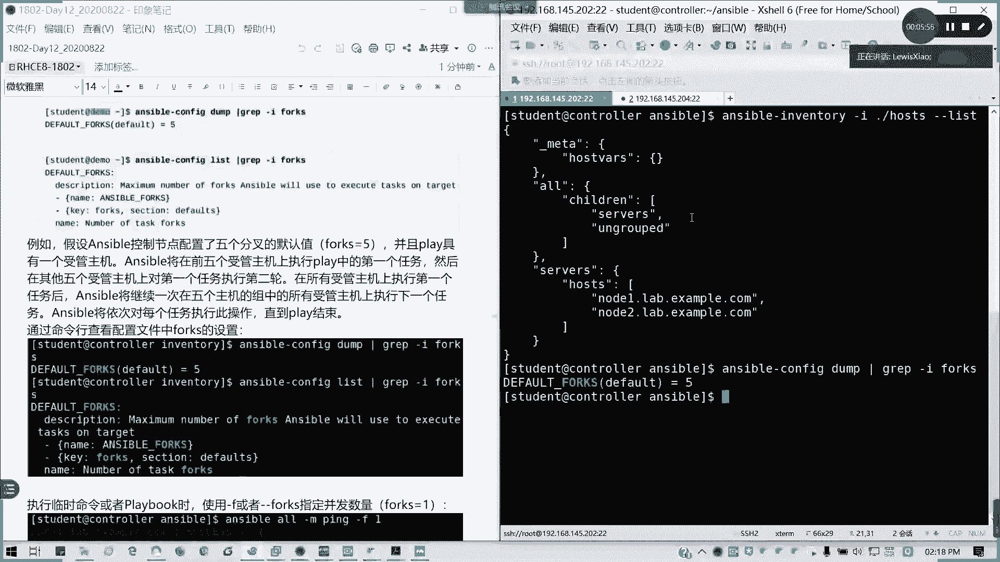

我可以用杠F是吧？对指定并发数量。明临时命令用杠F杠杠fox都可以。对吧他完成一台，再完成第二台。懂我意思吧？Fox。我我这里因为我主机数量太少，那默认是5的话一下子跑完了。如果不限制的话。

是会这样子的。唰了一下，全部出来，对吧？我刚刚设置为一的话，是不是就一个一个来了？然后我也可以在比如说我HDDPD我某个剧本里面我可以加上杠F或者杠杠fox参数都是可以的。

比如说我们之前做过的HTDPHTTPD的部署。我加到杠F等于你们就可以看看一下什么区别了。你看看note1note2，然后这里我一台主机先出来，再再出来后边的。但我这些任务我已经做完的了。

所以说到时显就OK状态。但是我想大家知道的话，就看它的一个过程是不是明显慢了很多。

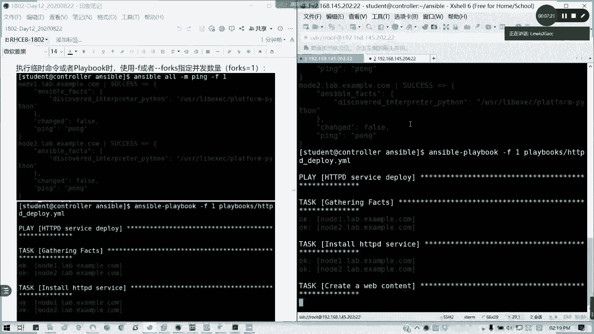

对吧OK。我故意把HDPE算失败了啊。明白我意思吧？它是并发数量，然后还有一个滚动更新，滚动更新呢。就是说。比如说我说预期所有任务可能会导致说你的顺序没有，就是说有任务可能会有意外啊。

就是说我突然我这个比如说我一开始就是说我听。一开始的话，如果同一同一更新的话，我们要依次。比如说我们像有些这样应用的话，我要批量停服务，我要停止一台时候才能停下面一台。但但有但如果按照默认机制的话。

它全部同时就是吧刷了一下全屏掉，那到时可能会有宕机的危险，对不对？像我们这里可以设设定sereal，是吧？设定一个sreal。来限制。说我每次批1辆女程数量跟刚才的分叉不一样。刚才的分叉呢是说我。

一个任务里面我一台这就做多少台可以同时运行。但是C轮呢就是我来控制说哎我一台机跑完。这任不说我在跑另外一台。原理是不一样的。比如说我的B3。压。看一下啊。

之前我们是写写了个之前我们有那个写了一个P量部署的，是采用brolock。来进行。然后我这里我写了一个。fox不行的哈，我要写一个改成sal啊。fox在全局参数配置的。我现在改一下playbook的。

b3点样b3点样本文件呢是一个区域块化的。HGDPD的一个部署，就是我前前后加了一个bo，对吧？那我这里改成CL。唯一。分批运行啊，每次只允许一台运行一台主机。那好。看一下运行过程。

就是我先把弄的一跑完。

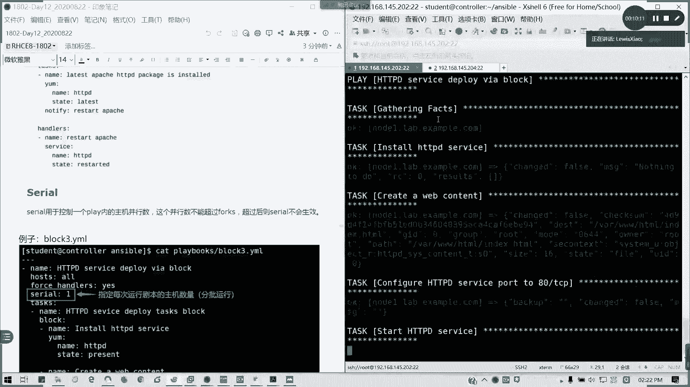

只是note2没有动，对吧？好，我再回来跑note2。懂我意思吧？他是这里是不是说限制说就是说哎我一个序列我只跑一台机器或者跑多少，通过sal来指定，默认的话是没有限，默认是没限这个的，没限这个值的。

看有没有现这个值，我们用。1月我来看一下。没有对吧？f的它并发数是有限制的，有默认时间是5个。但是对于sri，我多每次任务说我批我只在几就是说每批按批量放放多少，没有，就像我们疫情一样，是吧？

每次放多少人进去也是一样的，懂吧。注意它是控制里面的主机并行数，它这个并行数不能超过的分叉数，如超过的话，不会生效。比如说我fox直线为我我当时我的fox线为一，但我是2，那不行的。他是按照最低标准来。

我意思吧？你每次只只允许运行一台机，只运行一个任务的话，一个一个任务的话，那你的C路有多大也没用啊。能没有我睡了。然后接下来来讲一下包含跟导入啊，包含导入。通常说我们的我们现在学我们现在学剧本的话。

其实我可以去逐接去，就去我去做一个管理。但是现在我们如果一个剧本全部我所有任务全部堆在一个剧本上，是不是这个剧本会很爆炸。对吧几百上千行，有时候出错还不知让，对吧？修改都还那都还都还嫌麻烦。

所以的话通常我们可以其实现在像艾我这么智能，我们可以通过。模块化的方式将多个剧本组合成一个大剧本，对吧？或者是像文件里面的任务列表，我们插入了，插入进来。这样的话是不是我们可以。重用对吧？可以复用。

还有易于管理是吧？你就说像我们分工合作里面，我ABCD我就不用全部堆在一块，我就各司其职嘛。然后插然后通过引用把它插进来，对不对？有问题的话，比如说我A出问题，我就改A就行了。我不不用去动整个剧本。

懂我意思吧？那exible呢可以使用两种操作内容带入我们的剧本，可以包含，你可以导入。但两者不同的是这样，包含是一个动态操作，它是会在运行期间到达之后再处理。它运行到那一步的话，他才会把它动态包含进来。

他才会处理处理我们那个就是说这个包含包含剧本里面的内容。如果是导入的话，它会在最初解析的时候话，会把剧本全导入。就当当时的状态已经设定了，那我就从开始跑，懂我意思吧？一个导入是静态的，包含的是动态的。

包含是你走到那儿你才做你的做你的事情。但是如果是导入了啊，我一开始我就把你先安安顿好了，好后我我就我就按照按照既定的开始了。懂我意思吧？接下来我们讲两个操作，一个叫做包含啊，一个叫导入哈。

导入facebook我们可以用一个叫做inport playbook的一个。参数。这里下划线哈。我这里我提前学好了一个剧本。inport freebook是吧？

inport prebook我可以在包含列表的一外部文件啊来导入，也就会我可以导入多个。当然它导入呢是一个完整的一个剧本，所以只能在顶层使用，不能在我们的具体的任务里面使用，对吧？

不能在我们里面就是我们任务里面去定义去使用，我们只能在顶层，像我这里的话，是吧？我我这里我是导入两两个剧本，对吧？然后他就会从一开始就顺序执行它。懂我意思吧？他注意这两个剧本是完整的。

你不能说在pas里面导入剧本啊。不行的。所以在顶层，也就是在一开始定义的时候，我们就要有有这些东西了。这是导入剧本。那导入任务呢。导入任务我们可以啊将任务文件里面的任务列表保住或包含啊包含在。

我们的剧本里面，但是这个剧本呢它是任务文件是一个平面列表文件，平面列表文件什么意思呢？像我这里一个一个例子。task这里我加一个这里我说明一个叫做引port task，对吧？这个文件我来看一下。

这文件我只写了任务本身，我没有写头写尾。所以它是一个平面电表，知道是什么意思吗？我只写了任务，我没有写说前面的什么售管主机啊名字啊等等这些，反正我该干什么，我就写我我就写这一段就好了。写任务段写任务段。

然后我把它这里。在上面的我的剧本导不进来。

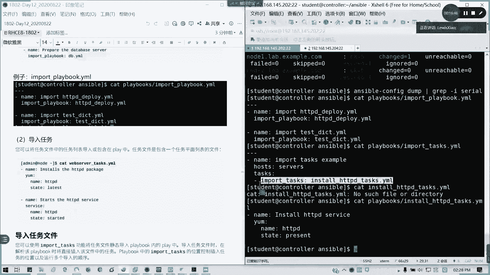

不好意思啊。其实也就是说我这个剧本我是写这么多任务，然后我再背包含这来，也就是相当于我把这个我把这一我我我把这一段贴到上面去。就把如果这样看比较顺眼，我这一段就相当于贴到下面来了。

还有一个包含任务觉得都比较动态的过程啊。

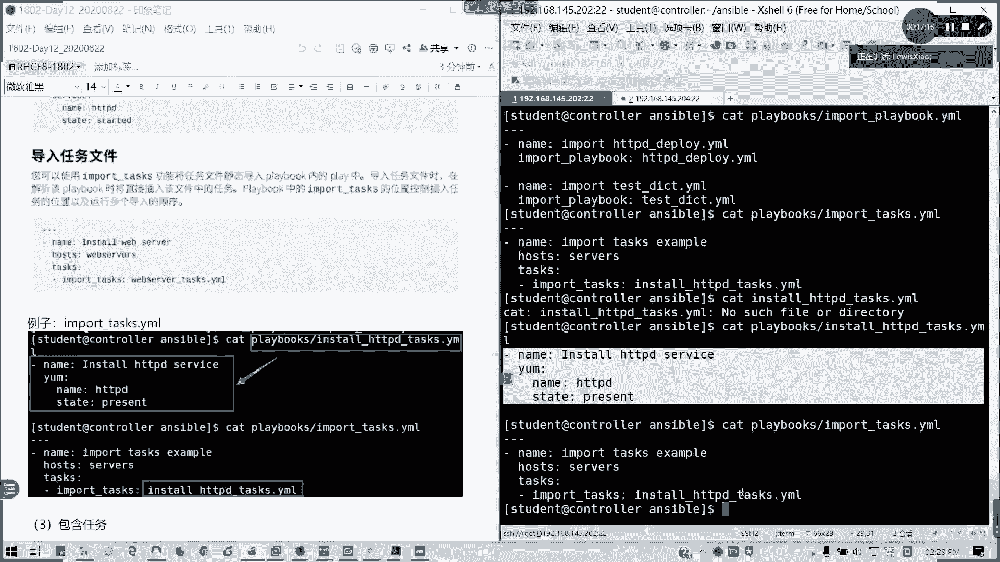

包含的话动态处理。不就是他动态处理什么意思呢？我在我在剧本没有没有执行到这个部分的时候呢。

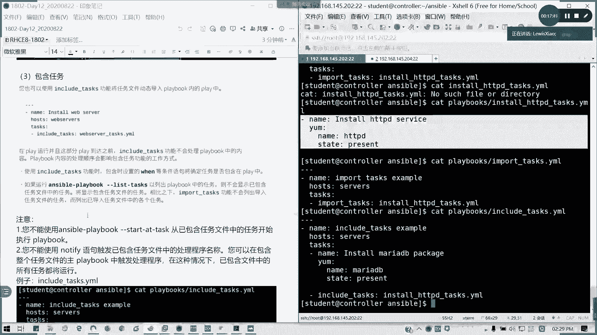

我这我这个剧本是不会被导入的，对吧？我这我还是引我还是包我是这这里我还是这个任务，但是我是才包含，对吧？我先顺序执行到这儿，他才会包含我们的任，他还才会把这个任务引进来。所以注意啊。

我们有一个tdy task，如果是包含的话，我不能使用这个命令，但这个命这个t task这个运行选项我们在历址上会找到。然后呢也不能使用notify handler，对吧？因为我包含的话。

我还没处理到这一步呢。我这都文件还没保，还还还没还弄进来的。但是我如果是包含整个任务文件的。就不能说我在这里用notify，就ininin这里使用notifify。

但是我在整个使用nifyify是可以的。然后尽量使用变量啊，尽量使用变量来进行，那这样会更好，对吧？因为这这样使用变量的话有什么好处呢？就合并之后呢，我可以。对吧我可以来使直接使用。

就是说这通篇我们变量之后可以解决。就不用说我这里再替A定A变量，那边定B变量会很麻烦的。然后第七章呢，其实我们就讲这么多。第七章重其实就是我们当然我们在练综练习波考试的话，我们是不会说特意会定到这一点。

但这里的话就主要是一个清单，我们讲过了，主要是关于一个并发，还有。

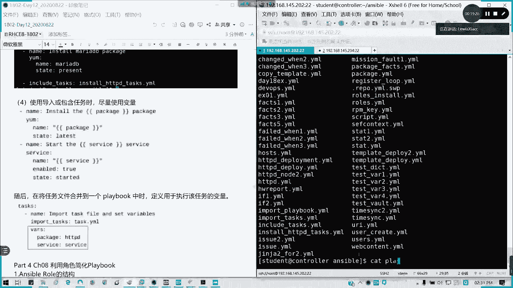

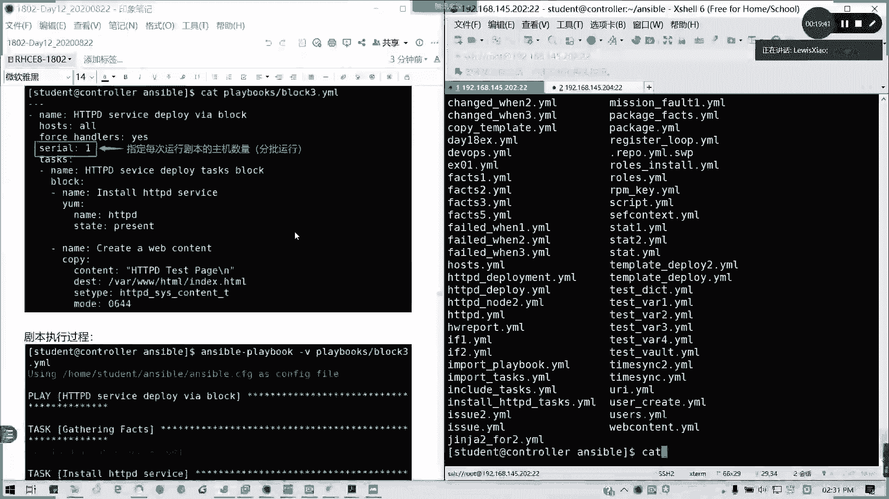

分批啊。也也也就是一个主机并行数，这两个要注意。其他的话最导入这这些啊。

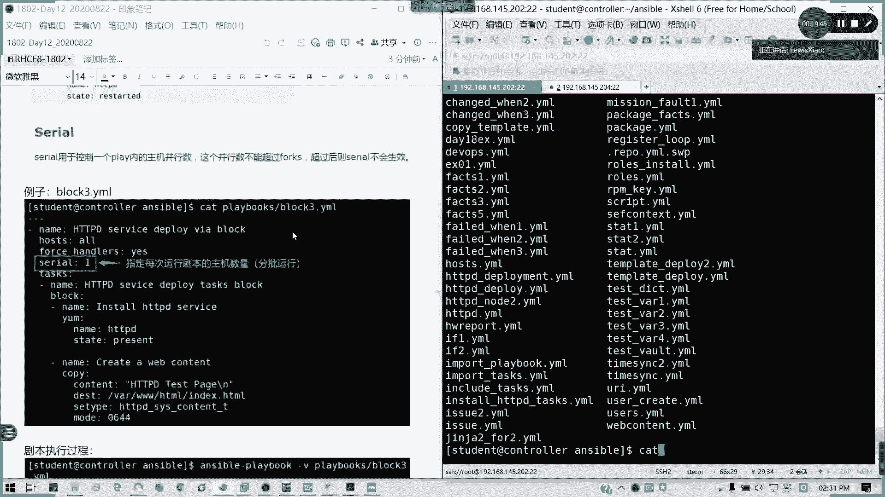

这是我们在常态化的一个操作。常态化上面我们可以在没学到角色之前，我们是可以做一个操作。但是学到角色之后呢，那证明我们不需要了啊。接下来我们来看到角色，角色这个可以大大来简化啊，简化我们的剧本编写。

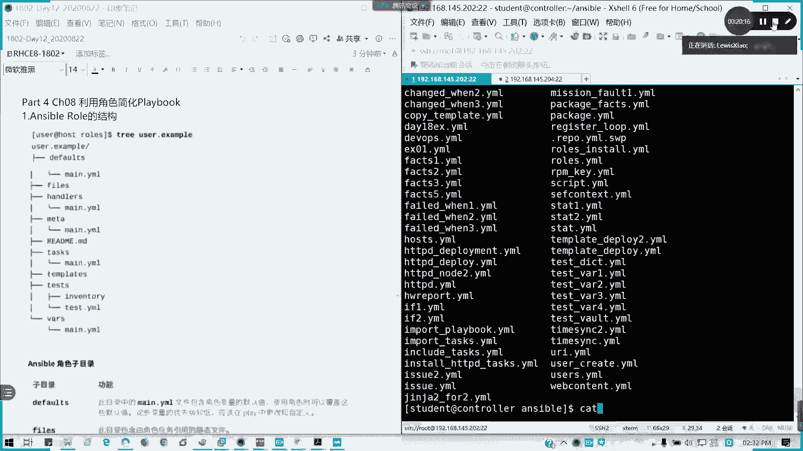