# 拿下证书！Redhat红帽 RHCE8.0认证体系课程：P72：管理大项目


## 概述
在本节课中，我们将学习如何管理大型的 Ansible 项目。主要内容包括：如何灵活地引用清单中的主机、控制任务的并发执行（分叉与滚动更新），以及通过包含和导入功能实现 Playbook 的模块化组织。这些技巧能帮助你更高效地管理成百上千台主机和复杂的自动化任务。

---

## 引用清单主机
上一节我们介绍了 Ansible 的基础，本节中我们来看看如何更灵活地引用清单中的主机。

我们可以使用默认清单，也可以自定义清单文件。在自定义清单文件中，主机可以用 IP 地址或域名来指定，但需注意 IP 和域名是不同的。

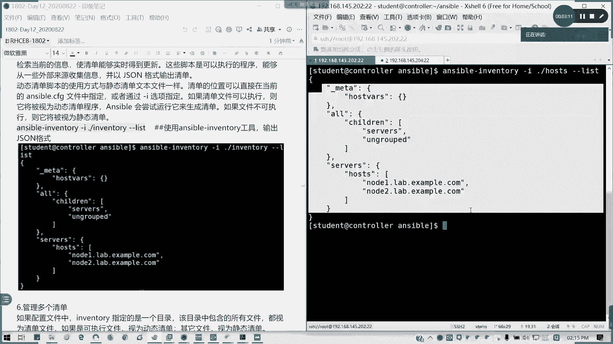

以下是引用主机的几种常见模式：

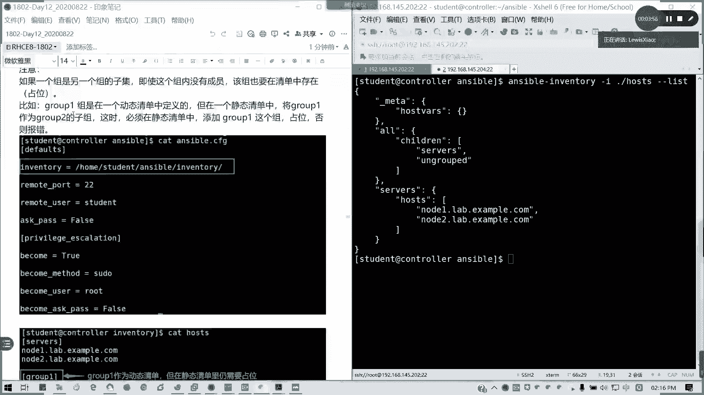

*   **通配符模式**：`*` 与 `all` 的作用完全相同，都代表所有主机。例如，`*.example.com` 代表所有 `example.com` 域下的主机。
*   **列表模式**：可以使用逗号分隔多个主机或组名。
*   **逻辑组合模式**：
    *   `group1:&group2`：代表既属于 `group1` 也属于 `group2` 的主机。
    *   `group1:!host1`：代表属于 `group1` 但不包括 `host1` 的主机。

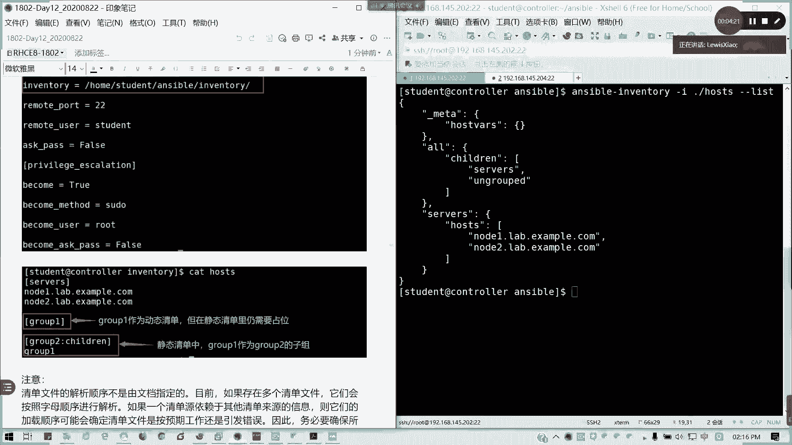

此外，还可以使用动态清单。例如，使用 `ansible-inventory` 命令可以动态生成清单，并通过 `-i` 选项指定或导出为 JSON 格式文件。

---

## 使用多个清单
为了管理更复杂的场景，我们可以使用多个清单文件。

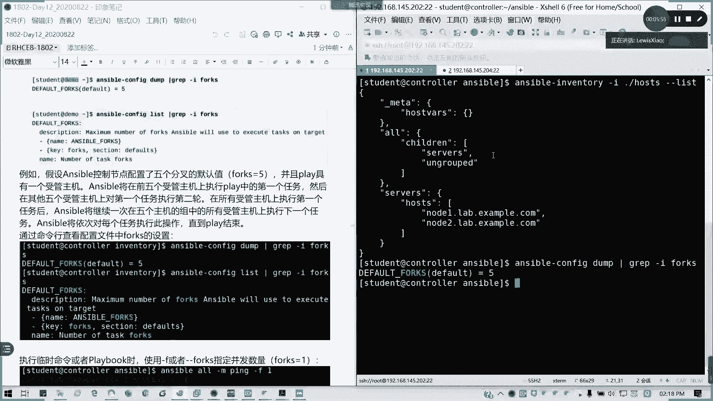

具体做法是将清单配置从一个文件改为一个目录，然后在该目录下存放多个清单文件。如果动态清单中定义的组是静态清单中某个组的子组，那么在静态清单中需要为该子组留一个空占位符。

例如，在静态清单文件中：
```ini
[group2]
# 此为占位符，实际成员由动态清单提供
```

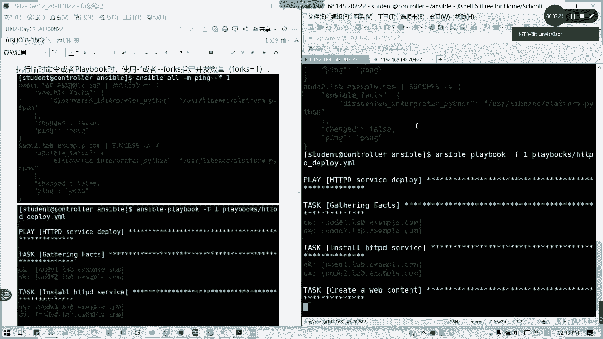

---

## 管理并行执行：分叉
默认情况下，Ansible 按顺序执行 Playbook 中的每个任务，并且会等待所有主机完成当前任务后，再在所有主机上开始下一个任务。虽然它能同时连接所有主机，但在管理数百或数千台主机时，这可能会造成性能瓶颈。

我们可以通过设置 **分叉（fork）** 来控制 Ansible 的并行度。分叉数定义了 Ansible 可以同时管理的主机数量。

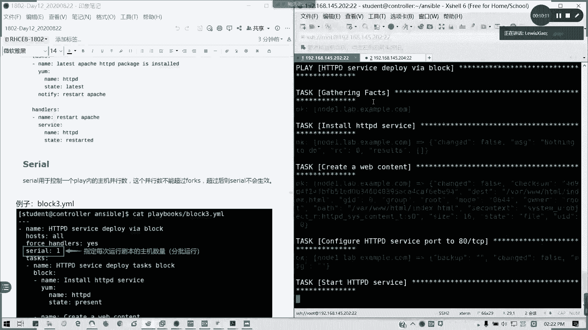

*   默认分叉数为 **5**。
*   可以在命令行中临时指定：`ansible-playbook playbook.yml -f 10` 或 `ansible-playbook playbook.yml --forks=10`。
*   如果设置分叉数为 1，Ansible 将在一台主机上完全执行所有任务后，再处理下一台主机。

---

## 管理滚动更新
在某些场景下（例如批量重启服务），我们可能不希望所有主机同时执行任务，而是分批进行，以避免服务全部中断的风险。这时可以使用 **滚动更新（serial）**。

滚动更新通过 `serial` 关键字控制每批处理的主机数量。它与分叉不同：
*   **分叉** 控制单个任务同时在多少台主机上运行。
*   **滚动更新** 控制整个 Play 或 Playbook 按批次执行，一批完成后才进行下一批。

在 Playbook 中定义：
```yaml
- hosts: all
  serial: 2
  tasks:
    - name: 示例任务
      debug:
        msg: "正在分批执行"
```
**注意**：每批的并行主机数不会超过分叉数。如果 `serial` 值大于 `fork` 值，将以 `fork` 值为准。

---

## 模块化组织：包含与导入
当一个 Playbook 变得非常庞大时，维护和排错会变得困难。Ansible 支持通过 **包含（include）** 和 **导入（import）** 功能，将任务或 Playbook 模块化，实现代码复用和易于管理。

两者的核心区别在于处理时机：
*   **导入** 是静态操作。在 Playbook 解析的最初阶段，就会将指定文件的内容完全导入并合并。
*   **包含** 是动态操作。只有当 Playbook 执行到该 `include` 语句时，才会动态地读取并处理包含文件的内容。

### 导入 Playbook
使用 `import_playbook` 指令可以导入一个完整的 Playbook 文件。此指令只能在 Playbook 的顶层使用，不能在某个任务内部使用。

示例：
```yaml
# main.yml
- import_playbook: webserver.yml
- import_playbook: dbserver.yml
```

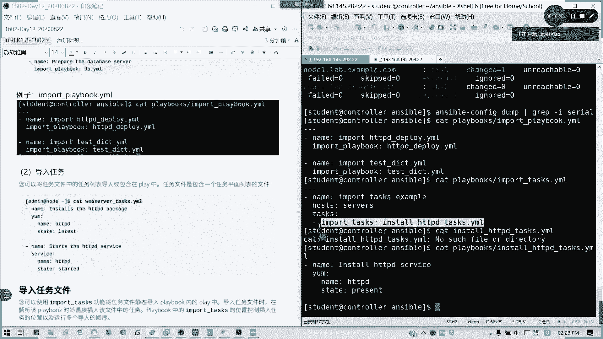

### 导入任务文件
使用 `import_tasks` 可以导入一个只包含任务列表的平面文件。任务文件本身不包含 `hosts`、`vars` 等 Playbook 头部信息。

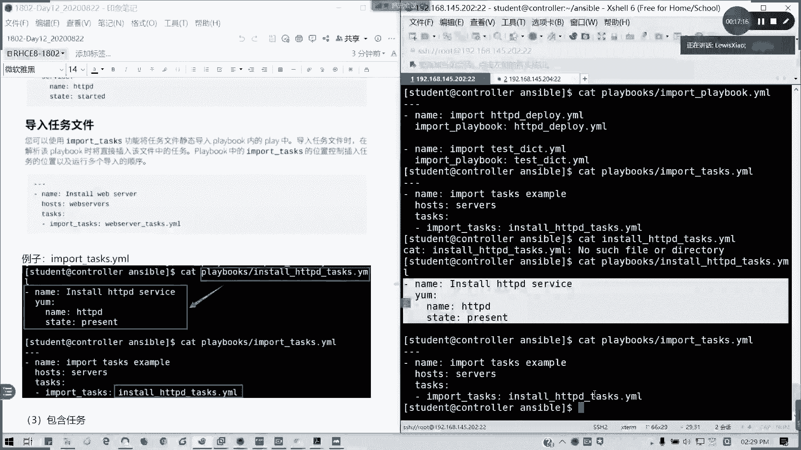

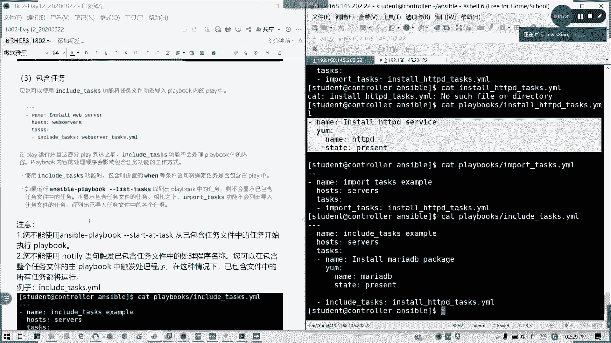

示例任务文件 `setup_apache.yml`：
```yaml
- name: 安装 Apache
  yum:
    name: httpd
    state: present

- name: 启动 Apache
  service:
    name: httpd
    state: started
    enabled: yes
```
在主 Playbook 中导入：
```yaml
- hosts: web_servers
  tasks:
    - import_tasks: setup_apache.yml
```

### 包含任务文件
使用 `include_tasks` 可以动态包含任务文件。这意味着，包含的文件内容可能在运行时根据变量或其他条件发生变化。

**重要限制**：对于动态包含的任务文件：
*   不能对其使用 `tags` 或 `notify` 触发处理程序（handler）。
*   鼓励使用变量来增加灵活性。

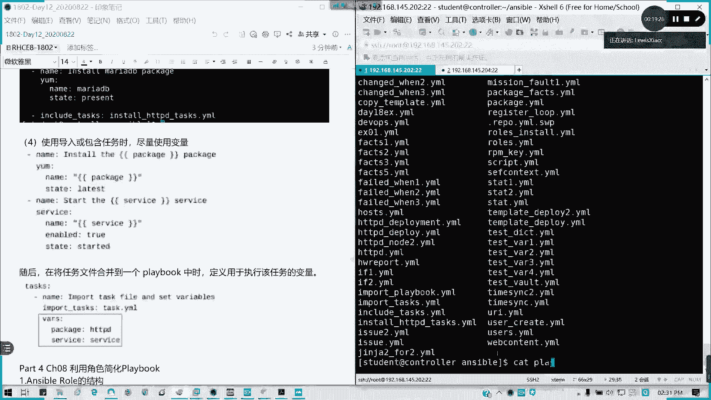

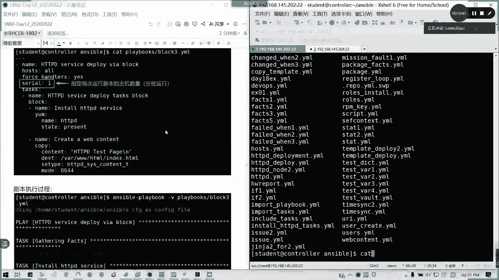

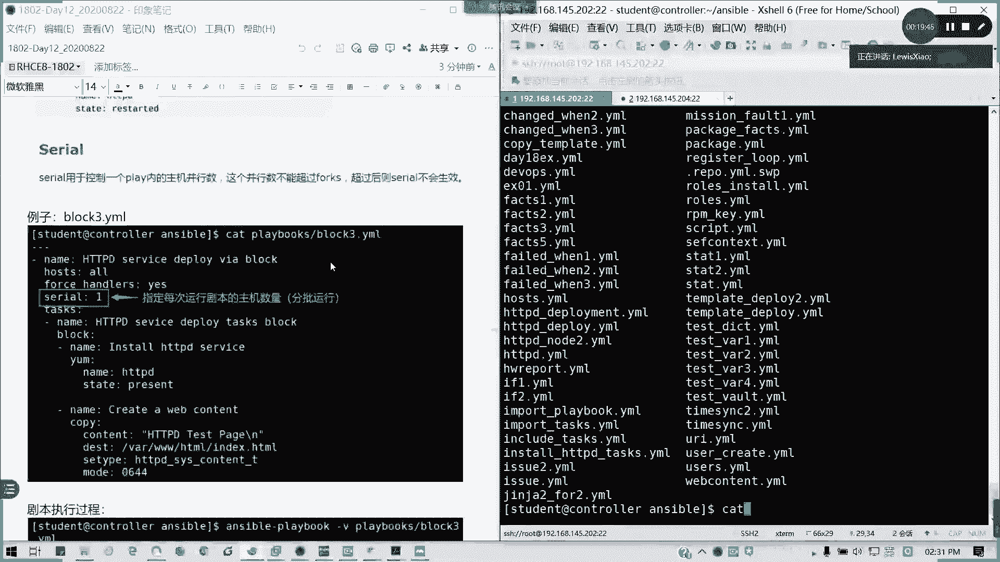

---

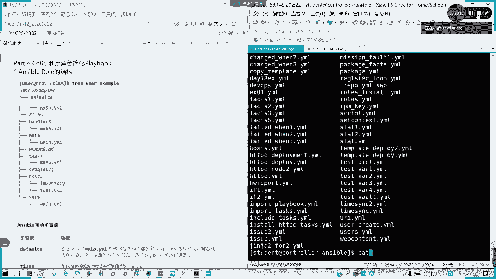

## 总结
本节课中我们一起学习了管理大型 Ansible 项目的关键技巧。我们回顾了灵活引用清单主机的方法，重点掌握了通过 **分叉（fork）** 控制任务并发数，以及通过 **滚动更新（serial）** 实现安全的分批部署。最后，我们探讨了如何使用 **导入（import）** 和 **包含（include）** 来模块化组织 Playbook，从而提高代码的可重用性和可维护性。这些概念是构建高效、可靠自动化流程的基础。