# 拿下证书！Redhat红帽 RHCE8.0认证体系课程 RH124+RH134+RH294三门认证视频教程 - P73：73.Video_Day12_RH294_Ch08_Ansible RolE - 16688888 - BV1734y117vT

角色这一个我们在那个我们角策这这这一个部分啊，在练习里面，包括我们我们实际的考试里面是会有涉及的。特设里的主要是包含几个部分内容。第一个是自定义角色。你你要自己会角色，我们简单的理解，就是我们。

打包工装。把多个任文件通过既定的一个结构进行打包封装。然后我在调用的时候，我是只要调用它的角色就可以了。懂我意思吧？可以自定义。而且然后还有一个就是我们要要掌握就是一个ansiblegax。

来来调用跟就是说直接引用我们。人家写好的一个东西。写好的一个角色。所以来看一下我们角色的一个结构。比如说这里可以看到角色结构是怎么样的吗？🎼比如说我这里我已经写好一个角色了，我用t tree命令知道吧？

我可以列出数字列表。ose里面我这里有1个HTKD我就写好了。或者是我写个若一。是吧。他的一个层级。非常的清楚。比如说default默认定义default，它是可以定义一些变量的默认值，对吧？

我们来看一下角色子目录啊，角色这些的话，这子目不用我们自己建。我们在初始化角色的时候就有啊。对啊，所以这些目录其实你看起来是不是其实蛮好的。我不用在整个剧本，不需要在整个anible剧本里面。

我不需要把全部它全部从头到尾写下来。我只需要把各个部分写好之后，分门别类放在每个文件夹，而且这些我还不用什么相对路径啊等等，我直接引用一个文件名就搞定了。这是方是不是很方便？

对吧像我们每个目录做什么用途呢？像default，它可以定义。其实我们主要是它每个目录都有一个man点压魔了，man点压么。然后像里面可以定义角色变量，这个默认值，使用角色可以拿它来当覆盖，对吧？

我在可以定这这里可以定义变量。当然这些变量优先级比较低。通常我们直接在剧本里面去定义。对吧这也是相对于全局的一个全局角色的一个。变量的一个默认。那么值，然后files就像刚才我们的一些引用的一些文件。

是不是可以放在这里？比如说我要复制一个我我角色里面，我要定义我把一个手，我比如说我HTTPD的一个服务。我就可以放在这里啊。对啊。就你要copy，你要去同你要去同步到对到那个授完主机的地方。

是不是可以放把文件放到fas里面了？n handles就是我们的一个角色处理程，我们的处理程序。就是你notify发这我整个角色我我里面的任务发生改变的时候。我直行程序是不是我可以放在这里啊？

就不用再拍 book背book里面整篇就写了。peddos放在这儿。mata呢主要是一些版权的东西，就是那个像，比如说像作者啊、许可证啊、平台啊，包些我需要依赖另外哪些角色啊，对吧？

就是俗称我们的版权的东西，也是也也也是也是一个叫做对吧？我们在HTTV是不是有个。原语言嘛一个语嘛，原数据嘛，就写在这matter是写在这里了，就这这这些。这这些作权信息，然后task这个比较重要。

就是我们所有的任务定义，也就是我们剧本里面的task部分。全部写在这儿。当然如果我有多有多个的话。对吧有多个的话，我们全我们可以把多个，就刚才我们分片嘛，把每个ts我们写在这里。

然后通过在man点样模里面进行一个顺序的编排。就可以了。然后temperature我们刚刚学，我们上午是不是刚刚讲过就加 two？模板的模板的定义，我我模板的文件就可以放在这儿。Pemperate。

模板啊。test是关于测试的。就包含清单跟playbook，就是我如果要进行会议度的话，我可以把中把清单。把测试角测试剧本写在这儿。Thus。优先级最高的就是在man就是角色我们的角色的变量。

对吧变量值通常我们内部用途内内部的用途啊，通常最高的我们就就是说能么优先使用这变量化，在bus里面的man点压某进行定义。所以我们角色包含12345678。

还有一个reme的MD这个MD文件呢我可以来编自己编辑一下。对。🎼这里可以就是我说明一些什么别要求啊，作者信息啊，还有视例啊，对吧？其实也就相当于我自己。

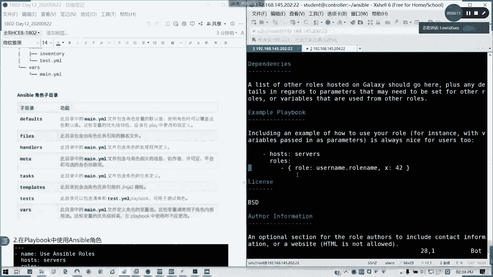

其实我简单说明是在那里写就是一个哎。打包。把我分成别人，就是我写就在类似我们编程里面打包打包操作，对吧？把所以这个时候说的话，如果有问题，我那我引用的时候，我只需要干嘛呢？我只需要调用角色就可以了。

我主我的剧本我啥都不用写。我就调用rs来使用角我们调用我们的角色。在playbook里面使用角色非常简单，对于一个每每一个定义的角色角色任务中间处理程序等等，都是按顺序导入的。

角色中任何的我们copycr或是引导入导入啊含任务呢都可以引用的相它的相关文件模板跟任务文件，而且无需相对或企调路性名称，你只需要写个文件名就可以了。他会按照默认的入口去找他嘛，对吧？

所以的话他已经定了路径了。然后当然角色里面呢，我可以。优先去调用它的一个值。对吧我可以在角色里面，我调比如说这里Y1Y2，我在调用对ro里面，那ro的默认的，如果有Y引用到V一跟V2这两个变量。

那它会优先比de比刚比我们的va跟default里面定义的变量更优先。那接下来我们来创建角色框架，可能我想的稍微快一丢丢哈。我们来创建角色框架。首先我们要定义我们的角色路径，我们角色成放路径。

我们一开始在SC区时候没提到的。角色路径。最好就是吧。Rose下划线pass。你要使用角色的话，必须要定好角色路径哦。这个文件夹你要自己创的。定好决策路径之后呢。

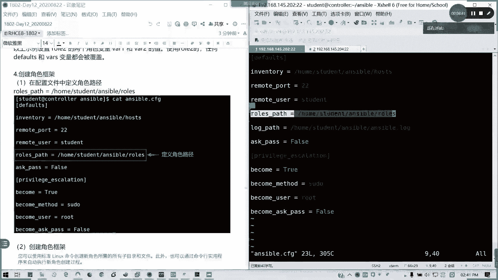

我们可以用ansible galaxyy这个命令行工具啊，这但这里我先先讲它的一个创建角色的一个用一个用法。后面我们会详细介绍它，它可以用于网网络上下载角色，或者定义这些角色的一个管理啊。

我们可以用标准linux命令来创建角色。我们这里定好路径保证退出之后呢。比如说我这里asible。隔街来食。然后呢。IID。初始化。然后比如说这里我就创建一个叫做row。问下IIT不对哈。

这ro的话不能用作我们的一个角色一个名称。比如说我自己叫叫做。My。买肉好吧。对吧用弱是不行的啊，弱弱这个关键词不能用的。然后呢，我这里的话，我就会在我们的rose目录下。看到了？哎，我看在哪里啊。哎。

怎么没有呢？我看一下啊。给总建老师。에서 보 세 줄。我是在home student answer里面的ros啊。

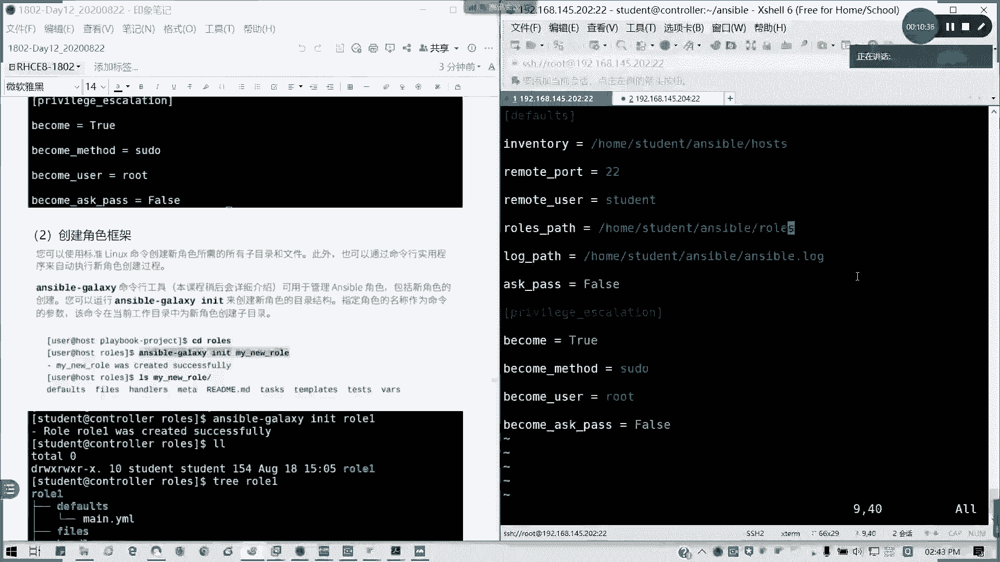

好像这里出现的问题，我看一下他在买肉里面创创建的，我看一下是不是加一个横杠。

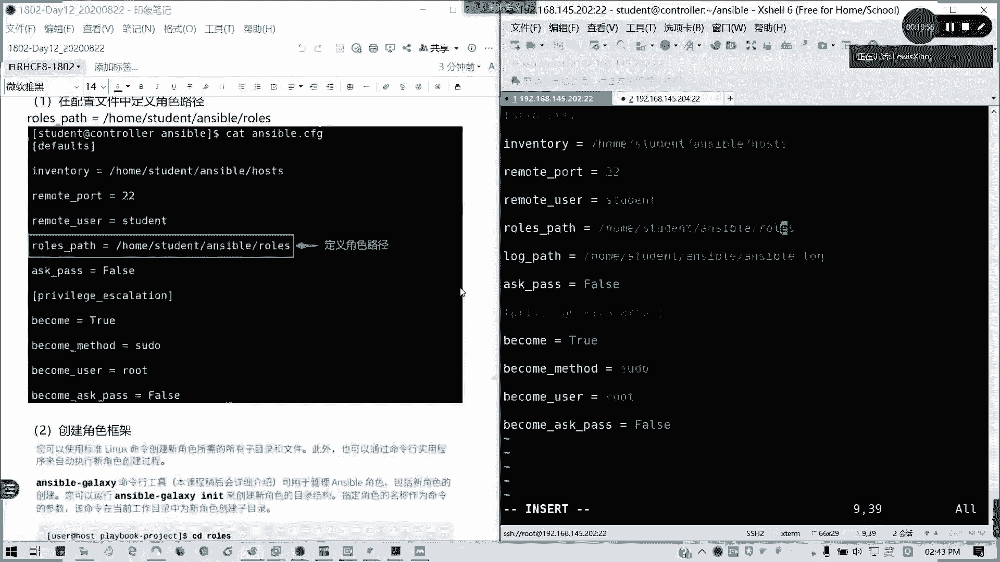

这这斜杠。我再创建一个新的角色，看他会在哪里创。我们哦哦我刚才没签目录哈。我要去到切到我们的指定目录下面啊。我要CD。到入rose目录里面啊，CD到CD我们创建这个目录，前提我要创建这个roose目录。

就我指定的哪一个角色或动用用哪一个。但在我们的练习说明里面都会有。🎼rose目le我自己用anible。看 galaxyaxy I9。比如说我就就叫买肉。

Yeah my role was created successfully。然后呢，我用吹以命令。都有。

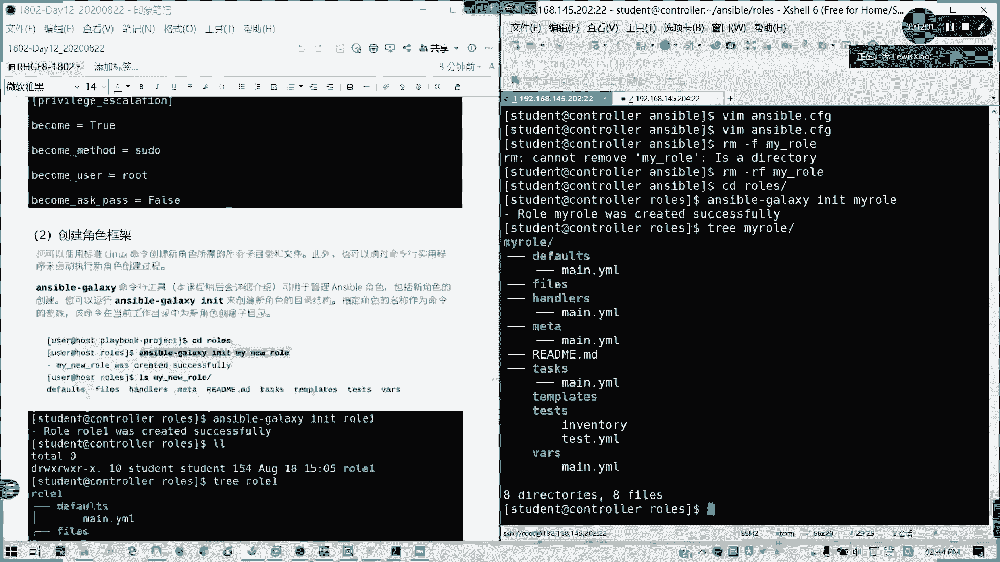

那都有呢，我们要编写任务呢，其实就在task里面面点样模写就可以了。要定义的话，就在这里写vas定义变量。他每个每他就已经创建些文件，就已经告诉你哎，我的角色。我的我我要那个。我要写任务，我要定变量。

我要定模板，嗯，我都可以在这里面去操作。然后角色依赖呢可以在me里面用dependencies这去做，但它通常只是依赖到一次啊，也依赖一次。然后它不就是说如果其他角色会不会被复，不会被再次运行啊。

当然这里的话我们通常很少用。就我依赖我我会这个角色主在运行的过程之中，我会依赖到其他角色。是有这个选项的啊。然后。如何使用？就是直接rose刚才讲了，对吧？然，关一个优先级。

变量里面优先级哪个最优先是吧？如果在以通过以下方式定义的相同变量，那它的dorse目录中定义的变量将会覆盖。首先清单文件里面定义的。对吧主机跟主还有robus，还有hos bus，我们讲过的对吧？

还有呢就是嵌套变量嵌套里面在bus里面定义，还有在ro关键字定义也是会就是说我们以上的变量定义生效之后呢，我们的dorce里面变量定义的变量就没有用了。啊。

注意vas关键字定义的变量不会替换在角色目vas里面定义同变量的啊的值它是两回事儿。在剧本里面的vas它不会被替换掉。剧本跟我们的角色里面vas的man点样么里面定义的变量是两回事儿。好，接下来。

实验啊实验大家先看一下。实验任务啊，我要自己创建一个。H T P。D哈。部署服部署这个阿帕提夫。其实我们在之前是不是写过类似剧本，写了两三个了。嗯，那我要给大家考虑一下，我现在把它应用到角色里面。

我要怎么分拆。给大家考虑一下这个问题，这个是大致的一个框架啊。大致的框架可以是这样子的。这里做一个参考，然后现在给大家大概1一点时间吧。自己试一下，如何我去写一个ro。是吧。

县城剧本是不是有我们包括我们的。我们之前写的brock，还有我们的呃那个在第三章我们当时就写，当时不是写了一个，就是说从样母原来一开始啊。然然然然从一开始从无到有的一个过程，包服务，包防火墙，对不是？

把它拆怎么拆，现在考虑一下。行吧，再考虑一下，就是说我们的这个角色怎么写。大概的一个框架提示大提示给大家。然后呢，现在给大家时间考虑一下，好吧。然后我们稍后会。分析分析分解这个角色。

然后来说明怎么去建立。现在给大家1来分钟时间考虑一下怎么去组合。任务呢我们分开在这里是吧？然后呢。变量是需要定义的啊变量需要定义的。然后配置文件里面可能还含有变量，所以的话要注意啊。

所以这些的话是我们的一个思路。那下面呢我们。我具体我来演示一下啊。演示一下要怎么做。现在在我们讲义里面有，首先我定义这个S wordCF区，对吧？我们我们来角色位置。

🎼要弄好，然后这里的话我来新建一个rose角色。

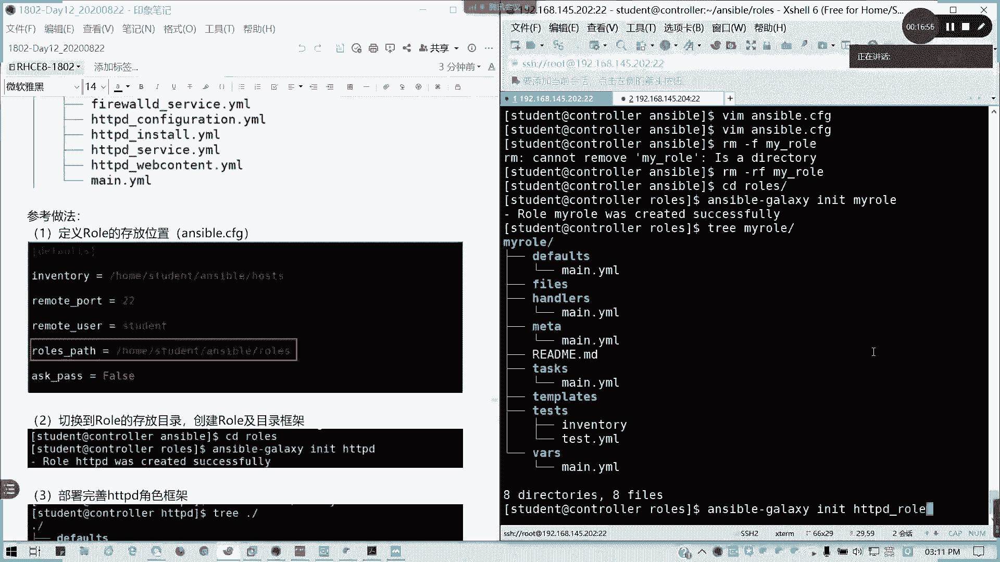

对吧我新建完一个角色角色之后呢，我来看一下角色框架。

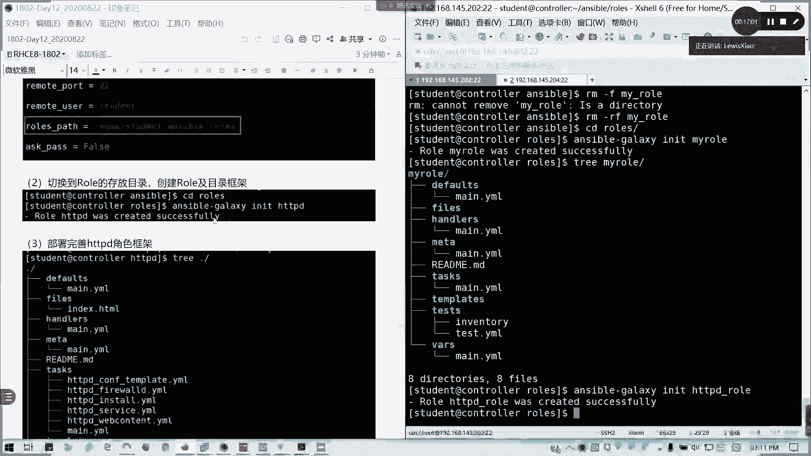

是吧这个是我部署完的了，对吧？这我我右边左边是我部署完的，我已经部署完的一些框架。那我们来逐一来讲一下怎么去形成我们的一个完整的一个角色来看一下啊。

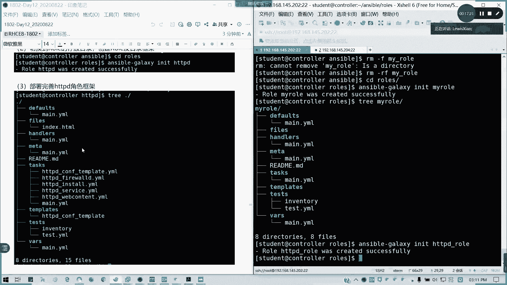

现在只有8个文件，我们总共是15个文件。好，首先我们来定义我们的分任务。我们装一个服务的话，你看到。我这一个一个一个来写。对吧。我就我这里只写任务，不写其他的头头部尾部。我然后我这里改用我的电量。

因为待会会会会在vas那里定义我们的安装包的一个变量。这是第一个。完成了。安装的完成了。然后接下来就是我们的we部内容。其实外部内容呢就是我们复制一个文件。那是不是这样的话，我会我会我会将那个。所有的。

我们的一整个大的项目分拆成一个小一个个小块啊。对吧。那我这样的话，我是不是我我将我我维护那个我我对角色进行维护的话，我我只维护一个小东西就行了。所以说我这里的destinationV are。

3WHTML。对吧。这里我不需要用相对或者绝对路径，我直接写着文件名就可以了。因为它会放在一个ffi的文件夹里面。好，第二个写完。第三个我们要这里。写一个复一个模板的一个复制。

但这个模板我要事先先生成啊，待会我我生成这个模板。我先把任务全写完。那这里。因为涉及到一个重启服务，因为修改配置文件是不要重启服务的。所以的话我就这里我设一个notify。然后这个任务什么时候才执行呢？

它的端口已经定义好的情况下。所以我这里会。我我是是是不是讲了一个就某个变量定义的话，底一定义好，我们就可以作为一个判断条件，对吧？HTP points defined我就这么写。这里是第三个。

第四个我们防火侠。

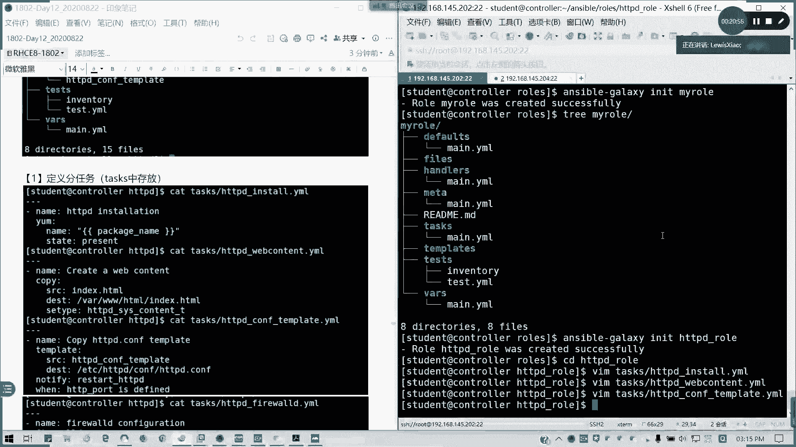

同样也是。端口。定义有存在定义之后，我们才进行这个操作，没有端口，你防火枪放射有什么意义？P configuration。老了。财我低是吧。Partt。80TCP。Pmanent。Yes。

 immediate。立即生效。Yes。State。En label。文同样我这个端我的HTTPport我要存在。特别是我们自定义端口的时候啊。这角色你可以把端口写改成别的对吧？

但是我但是你的端口你需要存载，我才能去。修改建防火墙，对吧？然后呢，还有一个服务，我们还有一个服务，是不是我其实我们已经把我们的任务已经拆解了。🤧咳嗯。对吧启动服务是调动service模块。然后。

那我这里的话，我直接调用我的package name也可以，或直接写HTTPD都行。所以其实外服务我我在课程表里面有，虽然我没有单独拿开来讲，但是我在aner里面已经涉及了。对吧。对不要说我偷工减料了。

Stay started， enable。yes，对不？启动并启用。同样我这个端口需要定义。以定义才可以dide。

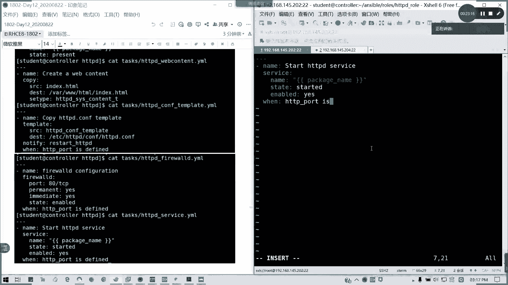

5个任务完成，我们要主要我要把它整合起来。我们通过inport task。

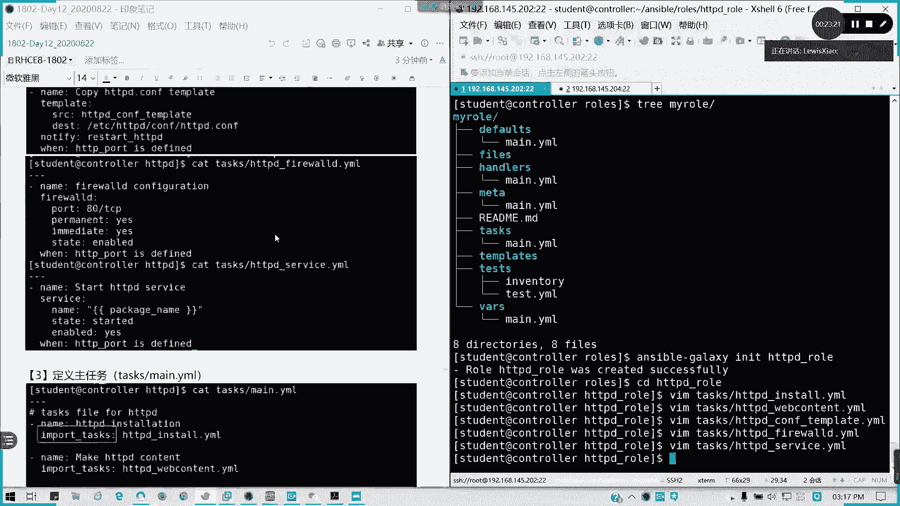

inport，我们再卖点压毛啊。🎼他已经帮我们写好了前几行，那我们就接下来开始就行了。就其实在这个man点压某呢，相当于我把。这些任务。这有异议。全部导入进来。对吧。嗯。就相当当于各个部件。

然后我这里只是一个。框架。好吧。这个框架把它倒起来，就像我们组装桌子一样，装桌子什么东西一样，你是是不是有各个部件先砌起来，然后砌砌好，然后再再拼装嘛，懂吧？这里的话们导出各个文件。

我们就不用详细再写一个剧本里面了。模板的复制。第四个防火箱的配置。嗯。最后是启动服务。对吧。

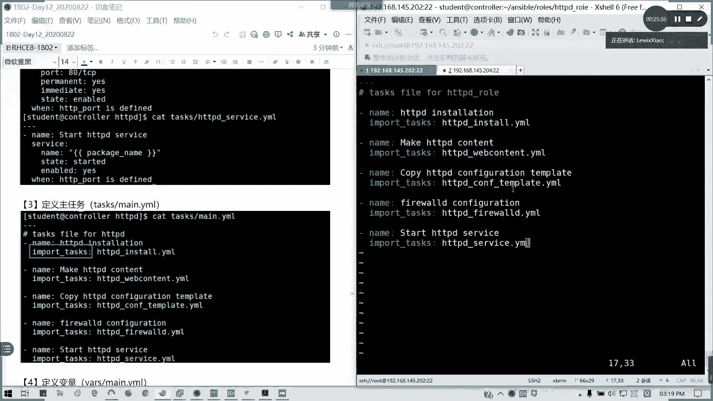

那相当于我5个，这task部分我经完成了。5个分任务组成一个大任务。OK接下变量。

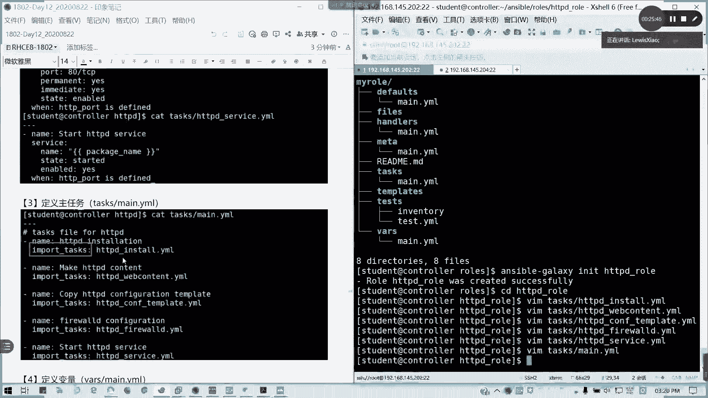

对我主要定义哪些变量呢？packackage there对吧？那是用到。那我们的HTTVport。B0。变量定义完首页文件。🤧咳。inex等下我这里的话我就把文件放在这就行了。

然后我这里就定一个hello。There。Yes。The test。配置我就定义简单定义啊，这是属页文件。然后接下来我要定一个模板。

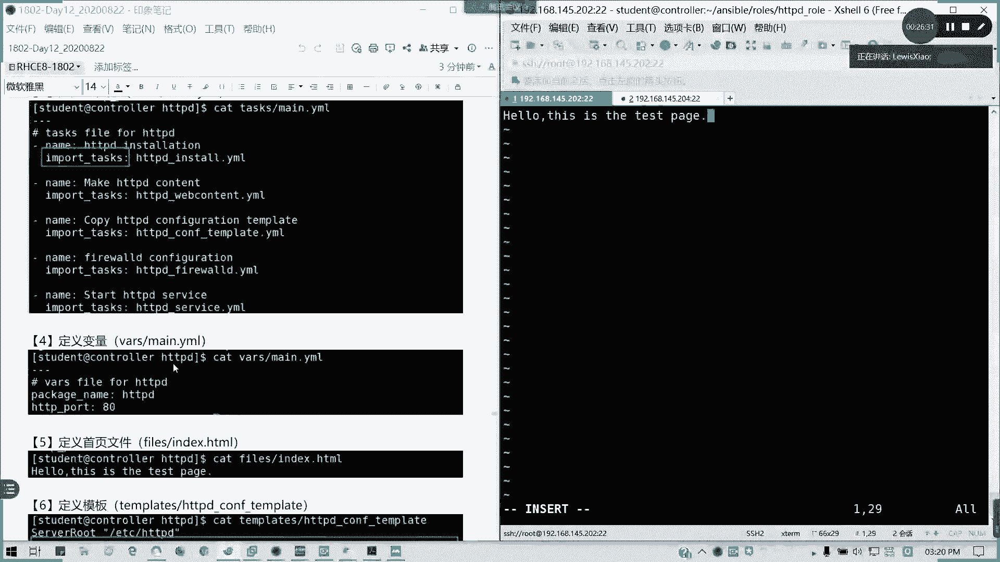

模板呢我们在原我们在这里，我们刚才有拉回来一个是吧？我们在TMP的t two。看一下是不是这个。这个文件是我拉回来的，就刚才我们在第六段时候就已经是有做出这个模板，那我直接CP过来好了。我放在我的。

Temperate里面。

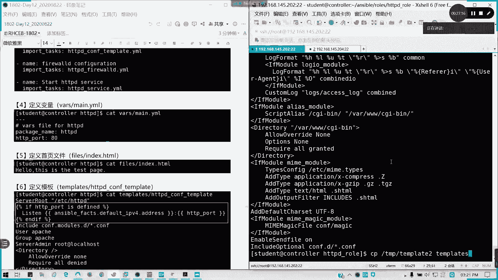

这名字的话要跟我刚才。定义的时候定义的名字要类似要一样。不然的话，你没法复制。

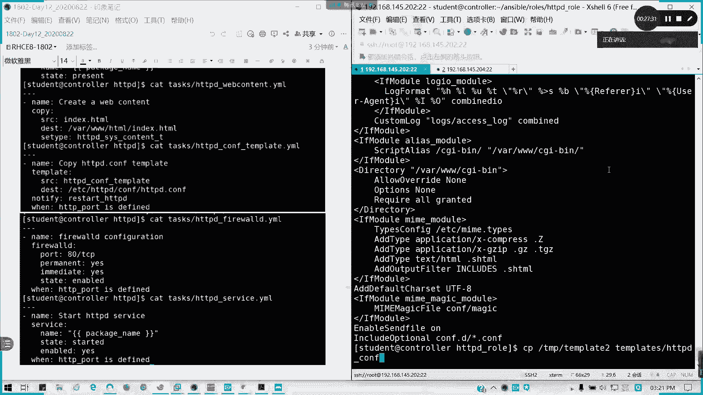

然后这个模板呢。

我们看一下，稍微做一下修改。

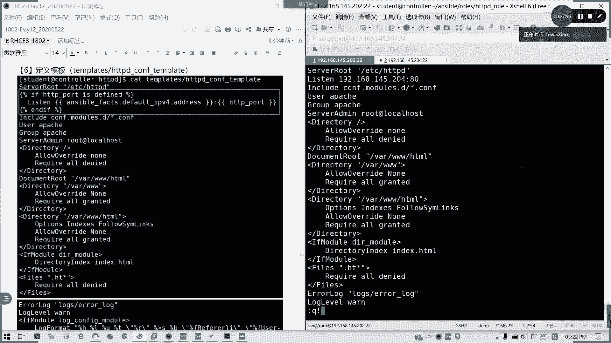

稍微做一下修改哈。这里在listson这里。是吧listsson这里我们这里在修改，因为这里我们要做一个模板，这里经是是一个机0的IP的，对不对？好，我做一下修改，把它替换成三句话的均家缩模板。

if是吧。用判断可以吗？As if H T TP port is defined。然后呢。这里我就在在里面把它替换成银行，对吧？listen。Anserable fat。dfa下线IBV4。

点address对不对？是不是我们能可能获取到我们的默认的IP的地址啊？然后冒号是吧，他listson的这个的话，像我们刚才的这个1192，刚才的我们的192168，刚才是这样子的啊。

刚才是我这里我打一个井号啊，我刚才是不是这样子，我就做一个注释，我们就写成这样一个格式就可以了。HDDP小线port是吧？我们自己定行的一个端口变量。如果是特别是我们如果是自定义，不是80的话。

是需要这么做的。好好，最后别忘了。And if。对吧。

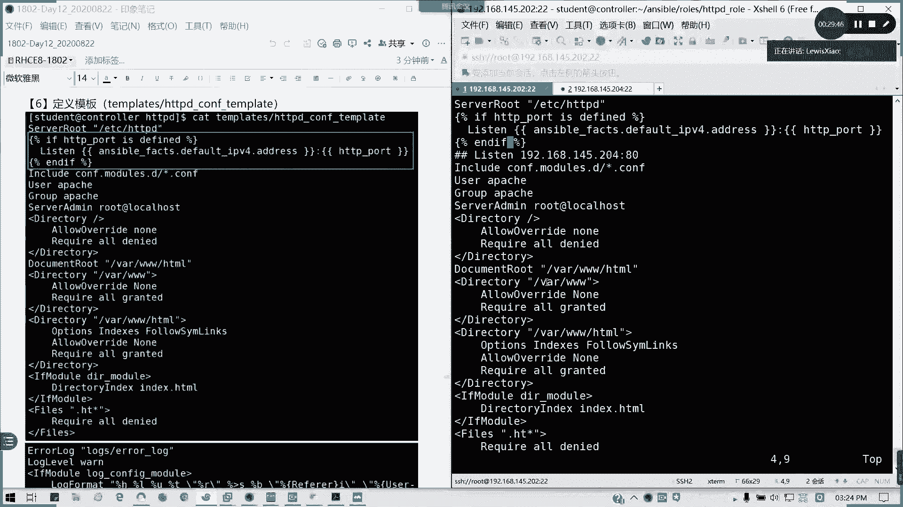

我把这行我定完，我这行就可以删了。

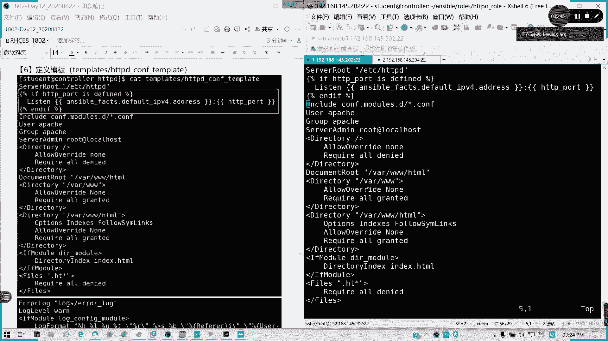

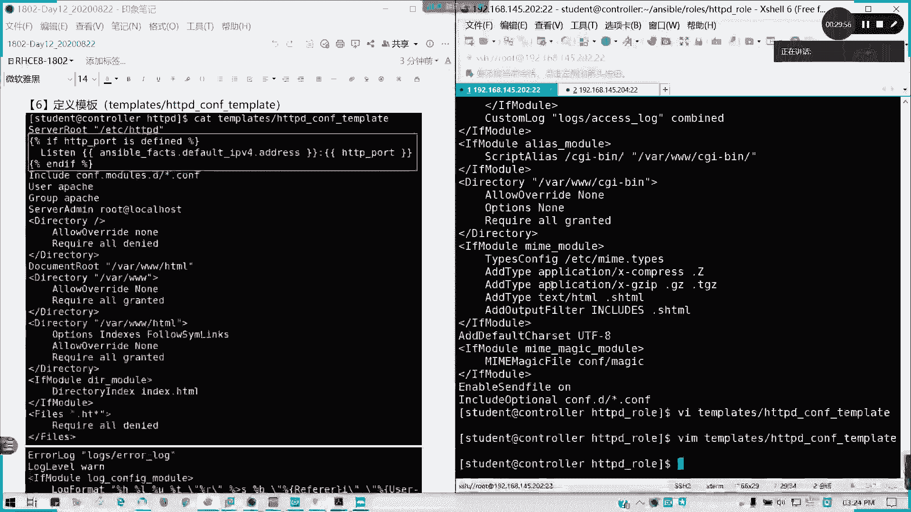

然后还有一个角色处理。刚才就是问我们写是不是我们写了handlenotify呀，那我们handle是不是要是不是要搞啊？handlerers那里man点杨某再接这一起。好。这里。

直接写handndal的处理啊。就省略的一个handdora了。re斯star HDPD。然后呢，service模块。Ne。note1。不不不用写啊，HDVD啊。然后呢，state。

We started。Enable。Yes。对吧。那至此呢我们所有的模块已经写完。那接下来我们要写一个剧本。我们回到拍始我的目录下。对吧。直接。我写完之后，我直接调动角色就可以了。有没有问题？

直接在rose这里，我调1个HTPD的角色就可以了。

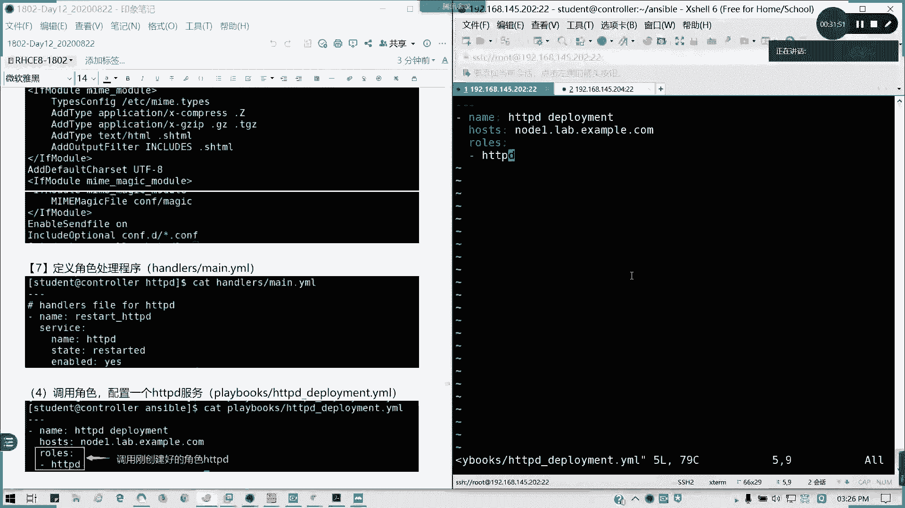

那开始运行吧。看到没有？他会直接去找我们的。任务对吧？当我们的角色里面的所有内容，他都会写在里面。就去直接会去运行他。能明白吗？我么看一下我现在Q。可以的是吧？我就是相当于我一整一条龙服务。

我全部打包搞定。然后我现在看一下我的角色。🤧咳。🎼roose里面的HDPD。对吧我总共写了15个文件。其实刚才呢刚才我应该是这样子，我这里我我没有留言啊，应该是HDPDro啊。这才对的。可以再跑一遍。

没问题啊。

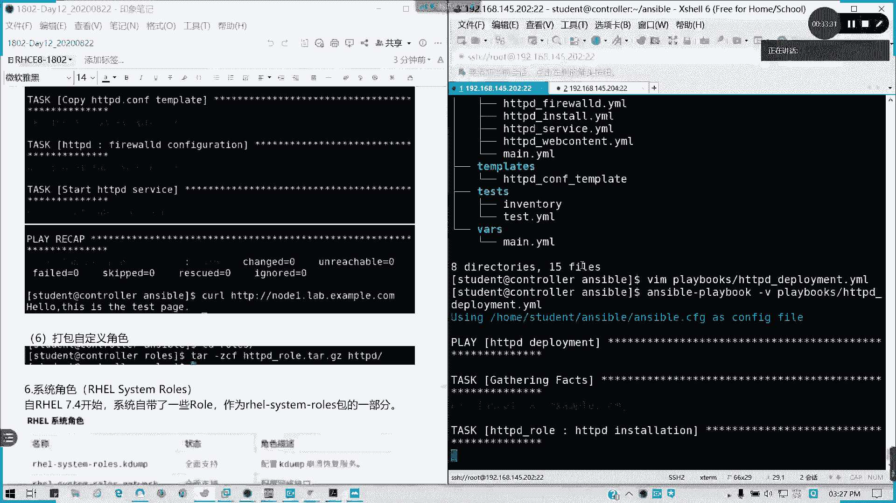

就反正我们专门别的机定好内容啊都会在里面。懂我意思吧。一样的结果啊。然后后呢我角色角色弄完之后，我可以打包，然后通过s不ge鞋进行安装。因为它是一个我们s不ge型呢，它安装角色是支持压缩包的。

OK这这一块能明白了吗？可以的话，请打一个字母F各位眼神的各位现场的各位能明白吗？其实也就是把我们整一个完整的一个剧本把它分拆。有问题可以提。包括我们像部署数据库啊，像所跑一些什么MQ啊。

或者类类类似的像那个reads等等那些程序。你如果不会用那字母的话，你都可以使用角色来进行了。就不需要一个去效编例，对不对？那效率是很高特别高。人家装了一天可能装搞不到十几二十台机器。

我我我我大概十分钟可能几千台机器我就完成了。然后接下来还有一个系统角色啊，系统角色从红帽7。4开始。系统都自带一些角色作为。HL它现在有两个啊，一个叫HVLsstem rose。

一个叫linux systemtem rose啊。它作为其中的一一部分，它系统角色里面包含像崩溃复符、网络接口配置管理SC news。网络时间同步postse face。保家，还有我们调优，对吧？

🤧比如说我们。这里的话。我们可以通过在我们的控制，我们的那个控制主主机上安装我们的RRT system rose然。他装完之后，他是会放在那个。这里要通过录制来安装啊。我们可以DNF杠弯。好。他需要。

System。Roose。我们可以装这个包，嗯装这个包的话，我们会有这个就系统角色啊，它通常会装在我们的usUSR share里面的S和目录下面。他这些角色已经是写好的了，可以直接拿来用啊。

像这个例子的话，我试过哈这个系统角色配置NDP呢它。只能在anerible2。8以前的版本运行。2。9的话，它已经有些做了一些改变。所以的话原来的剧本已经。存在一些问题了啊。

但是这个实验怎么在哪里做成成功呢？在我们的方我们的官方练习环境里面。可以成功。业急环境我在上周已经传到就已经发了地址给各位，然后也说明了里面的用户名和密码。这实验呢我试过在这里做是有问题啊。嗯。

我就已经我复制过系统角色啊。🎼time的M就本来我想做一个就是说同步系统时间的。我这里我看下我我我不用改，我不改那个。地址我就写那个。很错的。

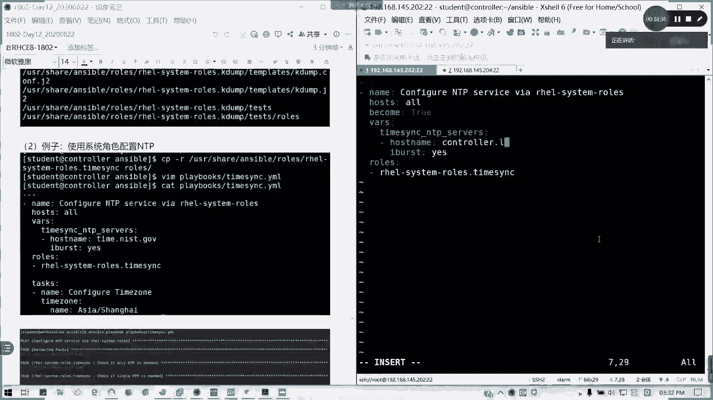

我会通过自己的时间看能不能行啊。诶。哦。我角色名字没改，这里它其实就它有带两个，一个是通的，一个linkux这种角色啊。我可以复制一下CP。我这角色我可以把它复制过来CP杠R约发血安波里面的。

Thoseose R，H E， L。sytem rose点time side。好，复制到我们L丝目录点com。看现在能不能原件。哦。这个运行的话可能会出现问题，它会出现一个红红观判断版本的一个问题。

对吧但在2。8里面，我在我们的。官方实用环境里面。就发给大一个练习环境里面是可以成功的。所以这个可能是一个版本性的一个问题。它就是这个判断出的出了错啊。那这个例子的话，大家可以在。

我直接配置文timeATTP参数啊，time在格ATTP参数，我配置一个直间同步服务器，然后直接用系统角色来进行一个时间同步。但我在2。9这里会出现问题。大家可以试一下，用2。8啊，用我们的官方2。

82。7去试一试，应该能成功。然后呢。接下来还有一个第八道最最后一个点就是aner galaxy。galaxy galaxyaxy这是一个命令，这一个工具来的。

可以使用enser galaxyalaxy来部署角色。当然它有一个网站，galaxy点enser点comm，它是一个公共资源内容库。就上面的话是有很多的。一些。

对S某的爱好者来开发使用的就已经做好的一些决策，我们可以直接拿来用。那我这里的话可以。通过anerible。家老师。search比如说我要找ready相关的，然后是适用于我们企业版。平台是企业版的。

rose我们的角色。就是网络出问题了吗？还是怎么办？好很久都没反应啊。有的像这些的话都是找问你是关键是。比如说我找想找一个叫作者叫Dearin盖的。对吧。那。我可以用anible。当给子。In4。

1ing。对。点readice这个角色，我们看一下它的信息。V for啊，V叫什么工具吧。

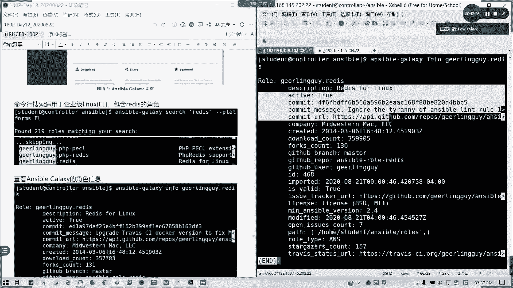

它是它是一个叫做建制型的数据库。嗯。这个俩已经写好的了。版本是1。3。8月4号才放，8月21号才修改的。就网上就网上人家直接直接写的。

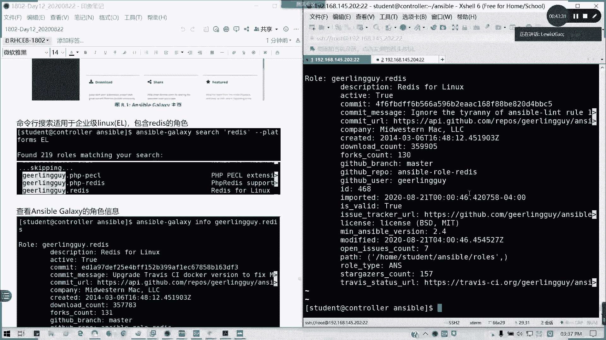

也就是说我们可以直接拿来用。比如说我要下载角色，我就可以用enssible。得到四。电 store。好，直接。查。指定他的报名，我就可以下载到我们的ro录录架。如果杠P可以指定下载目录。

通道命名他就是作者点角策名。是。然后我们也可以用指定的文件，就自己写一个文件。对吧。喂。太慢了。劳动文出理有没问题？这我们自己可以自己定义文件。这样我们可以进行到版本。它的来源在哪里，对吧？

帮他的那个是吧，我们1。6已经下载成功了，那我们就而且他也帮我们解压了，首则我们就可以直接调换这个角色。对吧。所这个其实拿来主义嘛，我们用截截图我有有需要的话。

像我们像S do我们就可以查看出在Sgalax呢，我们可以直接拿别人的角色，就看我们需要什么组件，就可以拿来用。像我们像什么map catch啊，PP啊，这些网上都有纪念的角色。

就不用自己去写一个部署啊，什么文件的还等等的都有。那什么HApro呀。像HA box啊，什么都有，就各种各样的。只要ensible他想就是说别人编辑的像这也有很多人编辑HA boss，对不对？Zg。

Id还有。CFFI等等都都有。还有dbo用的对吧？呃，非常方便啊。然后像指定文件的话，我可以写。就是说我可以写一个指定文件，然后。要求这理文件相当于我们一个安装安装的一个小小一个一个小配置。

一个小配置文件。然后根据他的安装角色也可以。那这不做要求哈，那我们也可以查看我们下载用S case list。可以查一下我们当前。下载并使用的哪些角色？然后我可以移除。可以删除角色用remove。

然后打包机安装的话就这两行。懂吧，打爆之后，我不我装角色的时候，我不用另外再解压。我就可以直接。来运用我们所需要的一个角色。其实角色蛮方便的啊，利用它来简化我们的剧本管理。所以呢地方商我们先讲到这儿。

明白的话，请打一个字母区。接下来我们会提到故障排除。然后还有最后一个部内容就是自定义。レ个ス的。另外个的。我没有讲到些模块。接下来接下来我们休息15分钟，讲第九道。讲的有点快啊。

但但这些的话就是我们之前之前是讲的很慢的。我们讲变量事实，讲任务控制是吧？讲常务模块我都讲的很慢的了。但这块的话其实就是我们的一个极大成的一个整合，希望大家能跟得上速度哈。然后呢。

接下来我们休息15分钟，3天，大概最迟不超过4点钟。我们来讲S波故障排除。