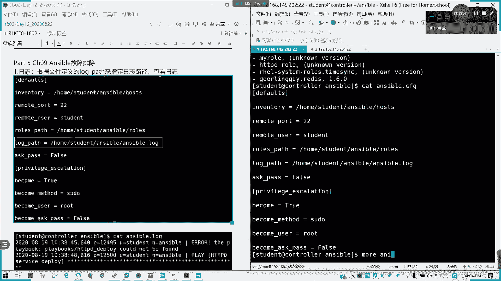
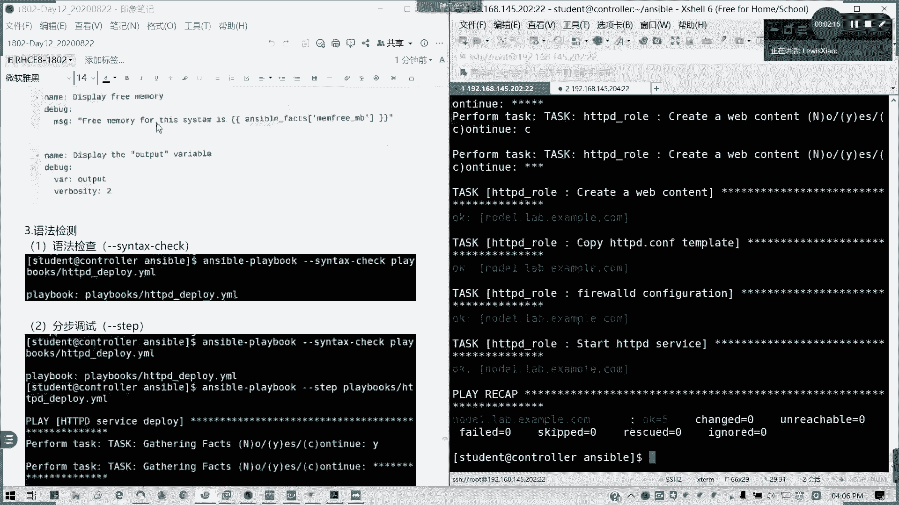
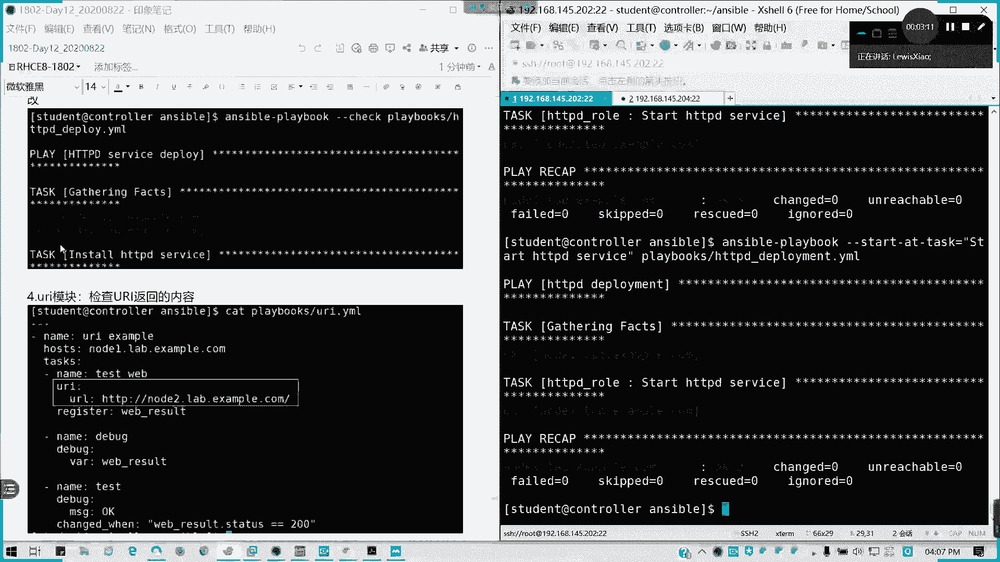
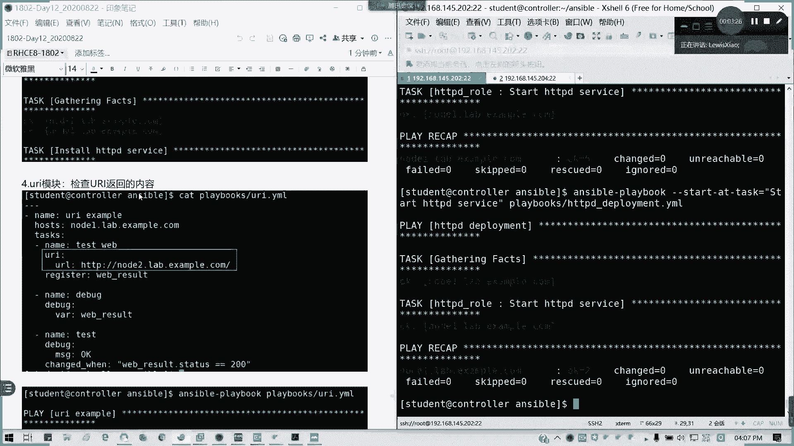
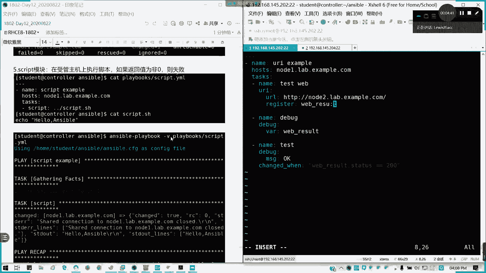
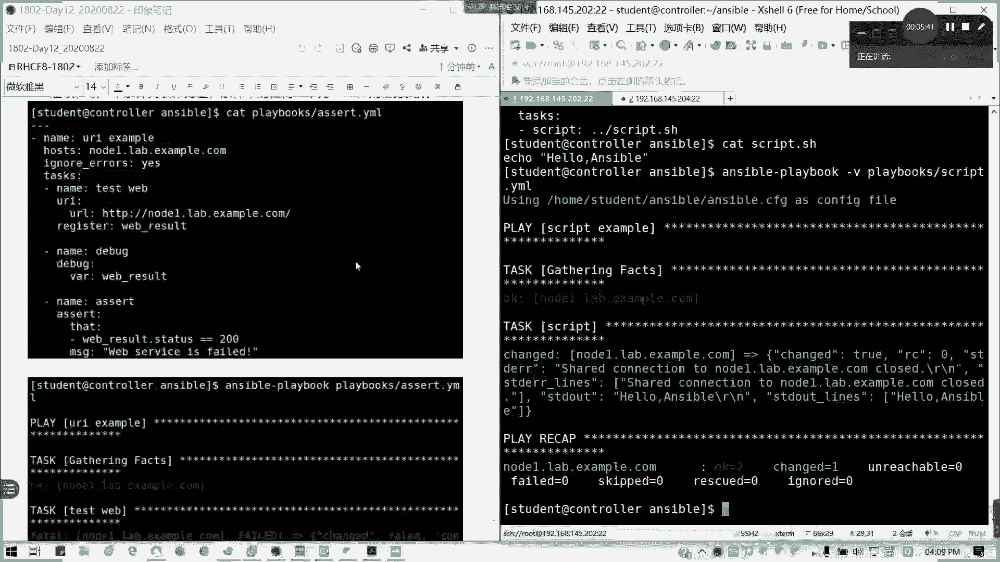
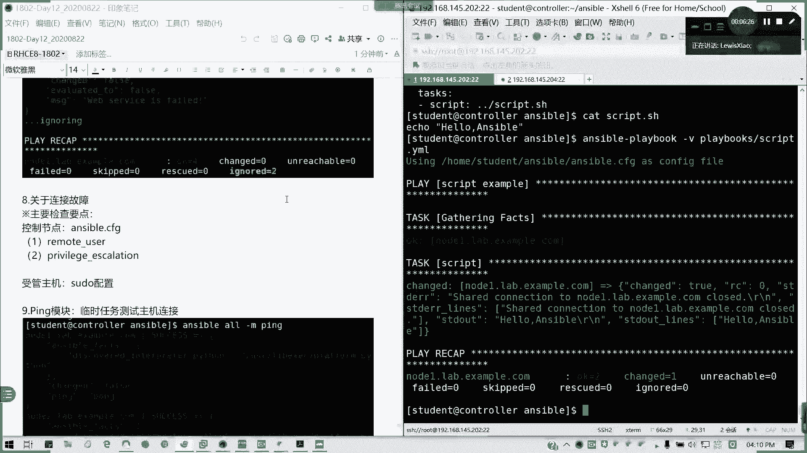

# 拿下证书！Redhat红帽 RHCE8.0认证体系课程 RH124+RH134+RH294三门认证视频教程 - P74：74_Video_Day12_RH294_Ch09_AnsibleTroubleShooting - 16688888 - BV1734y117vT

好，各位啊，我们接下来第九章的容，剩下最后一个小时。第九第十章我只会提到比较重点的一个词函啊呃，今划任务这些，其他的我就不会再提了。因为其他的有些已经讲过了。好，第九章。故障排除，我们可以定一个路径啊。

第一个日志路径来查看日志。比如说我这里。这里有一个log pass。🤧这里定义了一个S点logg，那我可以通过。

Sible。点logG来查看我们的对应的一个日日志来排除问题。这个是一个方法。然后呢，debug模块我们是不是讲过了？有MSG直接在屏幕上面显示指定内容，还有。我们可以输出到我们的1个VR变量。

然后直再导出来。好，这是第二个我们也讲过了啊，这我们已经讲过了。第3个。语法检测。st check很熟悉啦，然后还有一个分布调试。stepep啊。看他每一步都会问你到底调不调，不调的。如果yes的话。

它就运行。如果你按。嗯。他就跳过。懂吧？按C的话是继续。按C的话，它就一直会到结束。就YYN跟C嘛，yes no跟 continuetin嘛。

理解了吧？分布调试。然后还有就是从指定任务开始运行。指定任务后面是我们的叫做start。A task。后面等于跟我们的任务的数name的这个标题。就只我我除了运行线上之外，我就我就只做这一步内容。懂吧？

从指定的步骤开始做开始执行剧本。显示详细过程我不用再说了吧。V是吧。冒烟运行。

冒烟也就是我们的空运型。然后还有就是我们的URI模块。UI模块是用来检测我们的URL返回的内容。

这有一个剧本啊。我这已经提前写好啊，play box里面的UII。这也是检测我们note2能不能正常访问啊，如果可以返回OK。我这个剧本的作用在这里。然后UI参数下面写URL，然后选具体地址。

然后我把那个。运行的结果保存到一个注册变量，然后通过把注册变量输出来。然后呢，我这个提示信息，我要把这注就是说里面的stateatus等于200。才会输出这OK的信息。懂我意思吧？死亏模块死亏模块的话。

就是在。数管主机上运行我们的控制主机上的脚本。如果。非得就失败。

比如说我这里要运行一个scr点SH，我看下crip点SH有什么用。我就 echo口一个hello festivalible，对吧？对吧。他扫个叫代码分零的话，你就任务是失败的。state模块我们讲过了。

啊设的模块呢主要是。非有模块的另外一种替代选择。指定任务失败的条件。

我们费偶呢通常跟外剧人用。然后呢。关连接故障，我们检查什么东西？对吧连接故障主要检查的要点，第一就是通常我们那个anible如果执行任务。执以任务会失败或者连接不了数外主机。首先我要检查。

和用户连接对吧？是是否我们指定对了我们远程的连接用户？

然后。如果是股东用户，你的提现做了没有？然后收款主机是不是要熟速配置啊？很多人都忽略了这一点啊。你要提前配置没有做的话。连接会出问题的。然后在后面的P。跟shall command的模块。

这个我不用再讲了吧，我们早上已经讲过了，就是第九章我们就这么。过了哈。故障排除不算不算难。其实呢。就主要是知道哎，我出问题我要怎么查，然后我们怎么去。去测试空运行是吧？然看这详细结果。就可以了。好。

第九章结束，我们接下来剩余的时间，最后一章。