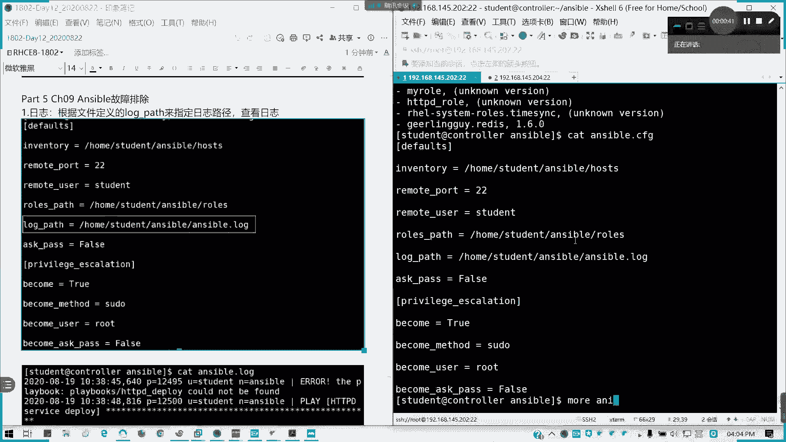
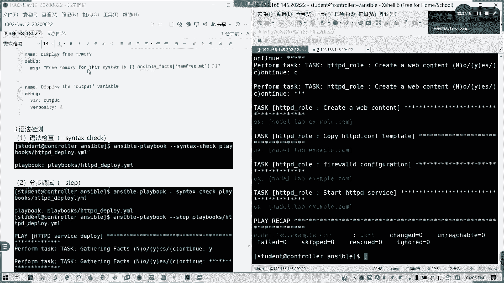
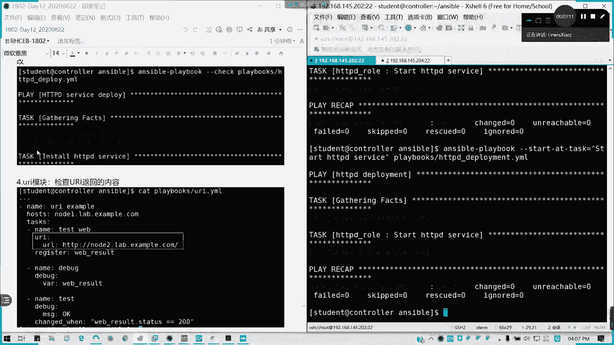
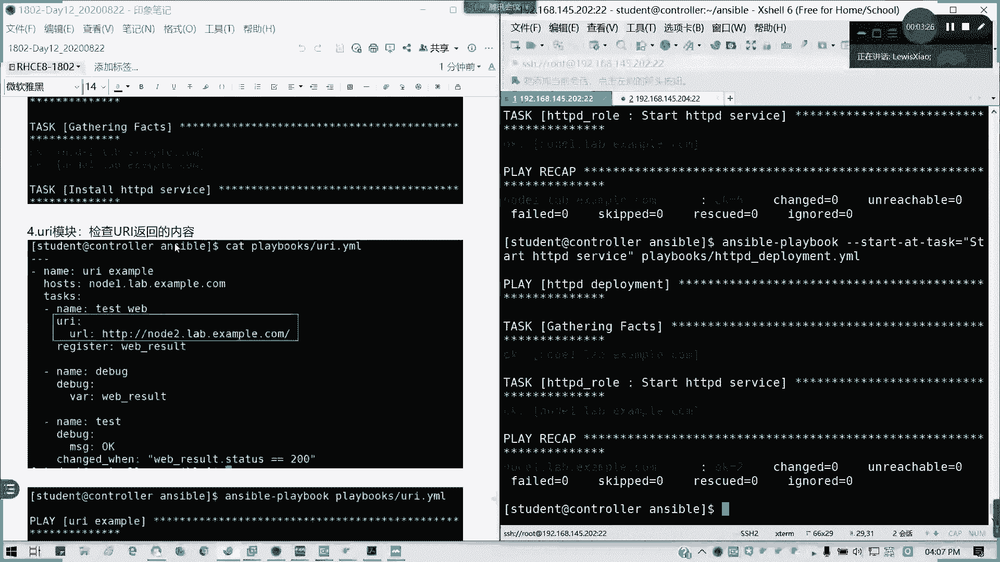
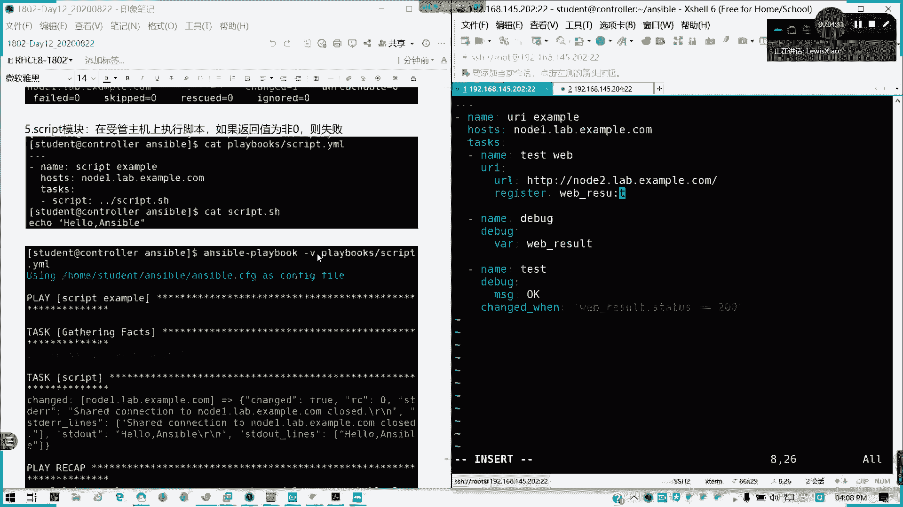
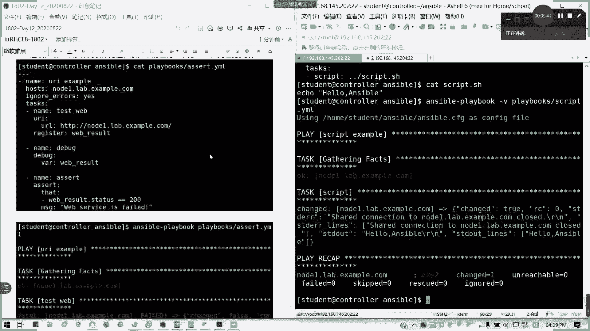
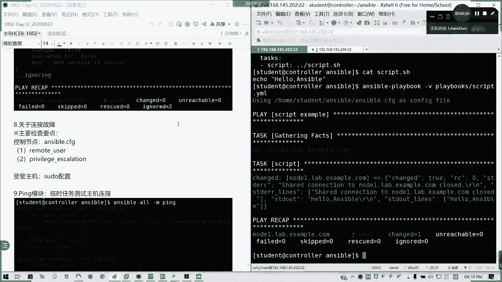

# Red Hat RHCE 8.0 认证课程：第九章：Ansible 故障排除 🔧

在本章中，我们将学习如何对 Ansible 剧本和任务进行故障排除。掌握这些技巧对于诊断和解决自动化部署过程中的问题至关重要。


## 概述

当 Ansible 剧本执行失败或未按预期工作时，我们需要系统的方法来定位问题。本章将介绍多种故障排除工具和技术，包括查看日志、使用调试模块、语法检查以及分步执行等。

## 故障排除方法

以下是几种常用的 Ansible 故障排除方法。



### 1. 查看日志文件

第一个方法是检查 Ansible 的日志文件。你可以在配置文件中定义一个日志路径。

例如，在 `ansible.cfg` 文件中设置：
```ini
log_path = /var/log/ansible.log
```
之后，你可以通过查看 `/var/log/ansible.log` 文件来获取详细的执行日志，从而帮助排除问题。

### 2. 使用 debug 模块

`debug` 模块是我们已经学习过的工具。它主要有两种用途：
*   使用 `msg` 参数直接在屏幕上显示指定内容。
*   将变量的值输出到屏幕。

例如：
```yaml
- debug:
    msg: "这是一个调试信息"
- debug:
    var: my_variable
```



### 3. 语法检查

使用 `ansible-playbook` 命令的 `--syntax-check` 选项可以检查剧本的语法是否正确，而无需实际执行。
```bash
ansible-playbook playbook.yml --syntax-check
```

### 4. 分步调试

使用 `--step` 选项可以进入分步调试模式。在此模式下，Ansible 会在执行每个任务前询问你是否继续。
*   按 `y` 或 `yes`：执行当前任务。
*   按 `n` 或 `no`：跳过当前任务。
*   按 `c` 或 `continue`：继续执行剩余的所有任务，不再询问。



### 5. 从指定任务开始运行

使用 `--start-at-task` 选项可以从剧本中指定的任务名称开始执行，跳过之前的所有任务。
```bash
ansible-playbook playbook.yml --start-at-task="安装 Nginx"
```



### 6. 显示详细执行过程

使用 `-v`、`-vv`、`-vvv` 或 `-vvvv` 选项可以输出不同详细程度的执行信息，这对于了解任务执行的内部细节非常有帮助。
```bash
ansible-playbook playbook.yml -vv
```

### 7. 空运行（冒烟测试）

使用 `--check` 选项可以进行空运行（Dry Run）。此模式会模拟执行剧本，但不会对受管主机做出任何实际更改，用于预测剧本执行的结果。
```bash
ansible-playbook playbook.yml --check
```

### 8. 使用 uri 模块测试网络连接



`uri` 模块可用于测试 URL 的可访问性并检查返回的状态码。

以下是一个示例剧本，用于测试 `node2` 主机上的 Web 服务是否返回 `200 OK`：
```yaml
- name: 测试 Web 服务
  hosts: node2
  tasks:
    - name: 检查网页
      uri:
        url: http://localhost
      register: webpage_result

    - name: 输出结果
      debug:
        msg: "服务访问正常"
      when: webpage_result.status == 200
```
这个任务会访问指定的 URL，并将结果注册到变量 `webpage_result` 中。只有当状态码为 200 时，才会输出“服务访问正常”的信息。

### 9. 使用 script 模块执行脚本

`script` 模块用于在受管主机上运行控制节点上的脚本。如果脚本的退出代码不为 0，任务将被标记为失败。



例如，控制节点上有一个脚本 `script.sh`：
```bash
#!/bin/bash
echo “Hello from Ansible”
```
在剧本中调用：
```yaml
- name: 运行远程脚本
  script: /path/to/script.sh
```

### 10. 使用 fail 和 assert 模块处理失败

`fail` 模块用于在满足特定条件时主动使任务失败，通常与 `when` 条件语句结合使用。
`assert` 模块是 `fail` 的另一种替代选择，用于声明任务继续执行必须满足的条件。



### 11. 连接故障排查

当 Ansible 无法连接到受管主机时，请按以下顺序检查：
1.  **连接用户**：检查剧本或清单中指定的远程连接用户是否正确。
2.  **提权配置**：如果使用 `become`（如 `sudo`），确保受管主机上的提权配置（如 `/etc/sudoers`）正确无误。
3.  **SSH 配置**：确保控制节点可以通过 SSH 连接到受管主机，并且已提前配置好 SSH 密钥认证或密码。

### 12. 使用 ping 和 command 模块测试基础连接

`ping` 模块用于测试受管主机的可连接性。
`command` 模块用于在受管主机上执行简单的命令，以测试基础功能是否正常。
这两个模块在之前的章节中已经详细介绍过。

## 总结

在本章中，我们一起学习了 Ansible 故障排除的核心方法。我们了解了如何通过日志、调试模块和多种运行选项（如语法检查、分步调试、空运行）来定位问题。我们还介绍了使用特定模块（如 `uri`、`script`、`fail`）进行测试和错误处理，并梳理了连接故障的排查思路。掌握这些技巧将使你能够更高效地诊断和解决 Ansible 自动化过程中的各类问题。