# 拿下证书！Redhat红帽 RHCE8.0认证体系课程 RH124+RH134+RH294三门认证视频教程 - P7：7_Video_Day02_Ch03b_从命令行管理文件 - 16688888 - BV1734y117vT

好，我们回来啊，我们看到刚才是不是有人提的问题啊，提个问题就是说那个王子龙提的问题啊，为啥USR听之前听老师讲啊，全称就是unice。system resource这个没有错啊没有错。我刚才已经讲了。

对吧？不是用户目录啊，不是用户目录。不是用户目录啊，记得我们是所有的那个约定俗成的linux软件包，我们都可以装在这儿啊，装在这。所以的话这这个的话大家请不要误解啊，不要误解成那个用户啊。

这个不叫所以我不懂user，也是这个原因。叫做USR，它是3，它是那个unice软件资源，对吧？因为系统软件资源的一个缩写啊，它这个这它是这三个单词缩写。所以的话我们这里不读user啊，你不要弄错。

所以你的理解啊，你老师给你理解是对的。好，那我们接下来我们讲第二章啊，没有其他问题，我们讲第二章，刚才稍微久了一点点啊。unic shopware resource，我看的。

resources system或shoptware都可以啊，系统资源软件资源都可以啊。那么在这里的话，其实在这里的资源是相对于啊相对来说sway resource会更好啊。因为它是软件，不是系统资源。

懂吗？它系统资源它只是占一部分，但是它软件资源呢我可以装，就我可以把软件装到里面，懂吗？王泽忠。这次要我去查证过的，查证过的话，这个是没有问题。好，那我们接下来我们看一下，我们回到我们课件啊。

回到我们课件，我们看一下那个主要内容啊，我们待我们讲的主要内容就是如何通过名称去指定文件，我们这里清一下屏，我看一下我开启录屏没有啊，开了啊。

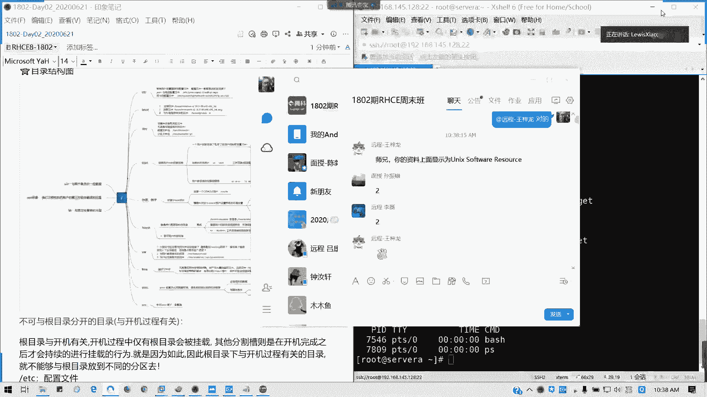

首先我们在使用我们访问文件的时候，是不是我们要知道他路径啊？对吧如何去定位个文件？首首先啊就文件目录我们统称文件。因为目录车是一个特殊的文件，对不对？所有在lininux系统里面一切接文件。

包括我们的设备是吧？我们的配置文件，我们的引导都是文件，包括我们目录链接等等。我们可以可以认为啊一切接文件啊。然后呢。如何去访问一个目录，对不对？我们一般从跟挂载点开始访问。比如说我们的网卡配置。

对吧我们敲的多的话，基本上我不用t都就可以出来。对吧。是不是我们的那个网卡配置，它是不是从我们的目录，我们文件是不是一级一级的。

从根开始ETC目录sconfi目录network script script目录？就网络脚本的这个目录。然后后面我们的网卡配置文件的名称叫做IFCFC区杠ENS160，对不对？所以我们上图里面啊。

它就是一个绝对路径，对吧？什么叫绝对路径？我们可以理解为完整路径。可以吗？比如类似情景，比如说我们C盘的window system32driver里面ETC host这个文件知道改什么用的吗？

做什么用的吗？这个文件知道做什么用的吗？就相当于我们的。linux下的ETC hostst，我们做硬件析用的。什么叫应解析？强行将域名跟IP进行一个捆绑。也就是说它不通过其他互联网的域名。

我们的域名系统DNS去查找，直接以它为优先，对吧？你在里面指定你的IP对应的域名是啥？就是啥？他们两者的关系是相当于在本地范围内生效，在你当前的主机的范围内生效，懂吗？这是应解析哈。

我们通常通常域如果域名解析服务器是不是要钱了，对吧？我们买域名解析服务器不是要钱了。那这种应解器呢，就是我们实验环境，我们通常会使用。

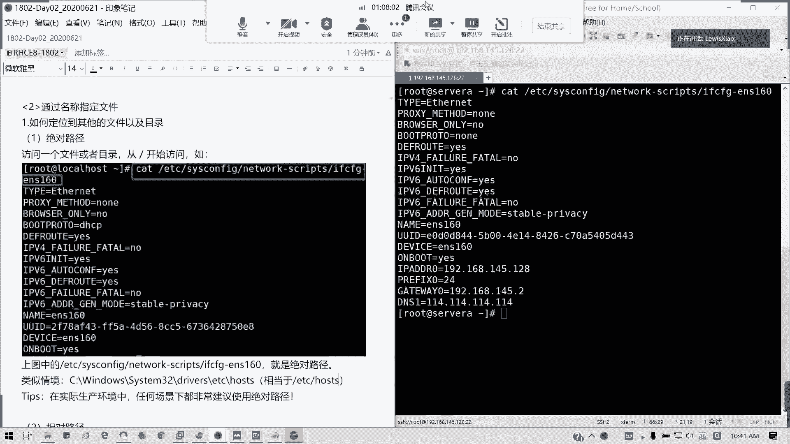

然后我们在。没有你可以太补权啊，但是我建议大家如果能够记的话，就直接打全就可以了，对吧？你可以t补全了，如果因为没有t怎么办呢？你就补一个包呗，对吧？那如果不能补呢，那你就只能只能自剂了，对不对？

懂不啊，我已经说了，然后呢，什么叫相对路径？相对路径和相对你的工作目录而言，什么叫工作目录。我们前面这一串就工作目录，也就是你当前所在的目录，对吧？然后我们初始目录呢。

就是我们的用户每个用户的初始目录呢，就是我们的加目录啊。

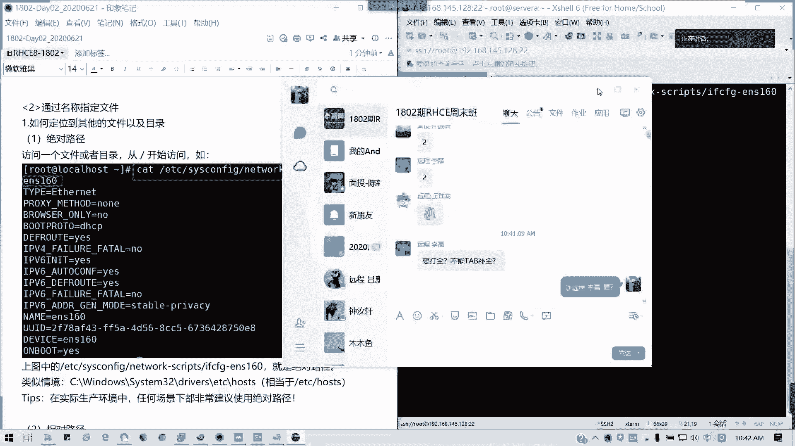

🎼它就是说相对于你的工作当前的工作目录而言，你的目标路径要怎么访问到，对吧？比如说我们的我们进入1个ETC目录，那我们这里的话，我们这列出我们网卡文件，那相对于这个目录而言。

是不是我直接就s confi是吧？network script，然后IFCFG对不对？对吧。这是相对于我当前是不是在ETC目录啊，对我们PWD是不是可以列出我们当前的工作目录，对不对？ETC啊。

所以呢它是根会根据你的参考值来做决定。所以参考值呢，也就是根据我们的工作目录里面的文件的我们不同啊，工作每个目录目录不同，我们就可以这个情况是就是说这个情况是根据你的工作目来做决定的。

就类似于我们的C盘windows环境下的目录下我们访问这个啊，访问 system什三个这个是吧？是不是相对路径啊，对吧？我们工作目录已经在C盘windows下面了，对不对？然后对于相对路径而言呢。

我们的波浪是吧？我们的波浪线我们讲过吧，我们的波浪线就是相当于我们的嘉目路。对吧。然后上一个的工作目录，我们用我们我们比如说我们这样目，我们上一个工作目录是不是用杠对吧？

上一个作工作目录我们用用杠来表示，然后。比如说这个student的话是吧，用户的这目录是吧？如果是student用户的话，我们的加目是home student呢？没有错吧。然后点代表当前路径啊。

比如说通常我们访问一个11个文一个目录，比如说切进去点杠。confi对不对？也是一样的，对不对？点的话就是当前工作目的路径，然后点点。说上一节。大家明白吗？🎼有疑问啊有疑问及时在我们群里提啊。

可以随时打断，我会看到大家。因为如果我看到我的我的QQ图标在闪的话，这群图标在闪我就知道了。然后呢，访问文件的相关相关的命令哈。比如说我们现在在加目录的话，我们PWD显示当前的工作路径是不是root啊。

对吧？然后我们切换到一个网卡的网卡的配置文件工作目录ETCfi。Network script。那我们在PWD下，是不是当当前的工作路路的工作完整的路径，完整的工作路径是不是这个？这是PWD的用法。

我们接下来这一章我们讲一些基本命令，大家可以跟着操作，不要再看啊。所有远程现场的面授同学都是。然后呢，我们LS啊，各位其实基本上我们这个班好像没女生了。对吧远程我不知道有没有现场全是一堆啊。

我我们叫做那个马拉楼，对不对？

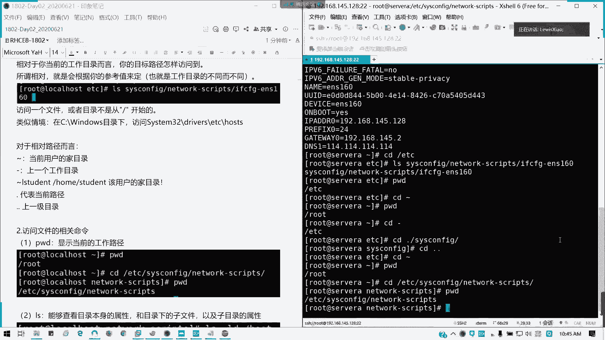

因为我上个班是有女生的，上上我上个讲个班是有女生的说女生有时候真的解释会比较费劲一点点啊，但没关系，女生的第六感非常强。所以的话如果他一点就通的话，那基本上学生没什么问题啊。和尚。😊，没有。

我们至少有头发哈。没有女生是吗？好，我们讲第二个命令LS。有诶。你是女的吗？嗯。什么叫需要的话，我可以是你兼制女的。然后啊好行，我去那个什么整形就，把你那个切了哈。😊，好，这个我们开玩笑。

我们看一下第二个命令LS这个命令我们用的非常多。它是可以显示目录本身的一个属。属性，然后呢。或者是此目录下子文件以及子目录属性。也就是我它可以列出属性用的啊。比如说我们这里的话，我们显示boott文件。

不同文件属性，那怎么怎么弄呢？是吧？我们L它默认是显示下面的文件，对不对？如果加L的话，它就显示详细的信息。就以像这里的话，后面加个D就显示目录的属性。对吧。对吧然后加上杠L的话，就是一个长串输出。

懂吗？长串输出，也就是我们的具体的每一项啊。LL为什么LL有时候我们的ensible里面用不了呢？我想提大家一个问题，你我知道陈启欣说了啊，LL等于LS杠L，但是为什么你用不了呢？

我们在我们为什么在那个ansible里面，我们特别是ensserible，你有没有试过啊，我们调用那个模需要模块里面是用不了LL这命令的。但是我能用LS4杠L为什么？对，毕绍文说的对，它是别名啊。

它是我们定义在超市我默认定义的一个alliaas一个别名。但是alliaas我这个我教大家怎么做啊。类别名，比如说。哎呀，你不要你不要玩这种东西啊。不要玩这种东西啊，千万不要玩这种东西啊，有对吧？

我之前我我学员给我的这个例子啊。😊，千万不要玩这种东西，真的有啊，有有的就乱D别名，结果你他妈CD命令直接就过，直接直接就整个这台机报废了好吗？😡，真的有这种东西的，所以这种别名不要乱定义哈。😊。

好奇害死猫啊，要怕要害死人了。现在。有真的有，就是我对，没有，他找你喝茶，喝那种什么可以聊人生的那种。然后第三天你就不用来了。对吧？这个茶意很意义很深啊，不是龙井，不是普洱，也不是绿茶，对不对？

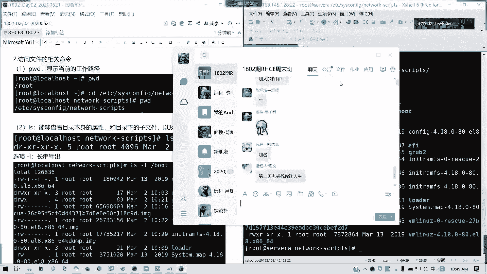

好像学到什么不得了的技能，这种千万不要哈千万不要啊，我这是一个反练入门等于入从入门到入狱，从入门到从那个开始到放弃，对不对？😊，好，我们AOS长串输出这本相当LL1样的对吧？然后长串输出我们的用法。

我们解释一下。首先。第一列。代表你的文就这一条啊，我们写的是这一个地方啊，我们这里笔记也有啊。都导出来了，那我撤销行不行？撤掉撤掉。好，没了。你们敢听我们拍死你们啊。然后呢，我们看一下啊。

看一下我们的文件类型啊，我们左边啊我们从左到右来看啊，你们可以在你们的自己电脑上，比如说你打LOS杠L，然让你们任意一个目录啊，你们看一下。哇哦，然后呢，二次元就出来了。好吧，我们看那个文件类型哈。

我们文件类型前面的这一页是文文件类型，就是最边边的最左边的那个。一杠代表文件。第。代表目录是吧？然后还有L代表我们的链接文件，我们可以简单理解为快捷方式。比如说我们的。ETC是吧，LS杠L。EDC。

ss confi里面的SElinux，我们后面有讲到这个SElinux的东西啊。它这个是L，然后后面有个没有看到它是相当于快捷方式，也就是实际上它这个只是一个快捷方式，一个符号链接，它是一个软链接。

然后连接到上一级目录SC的config。实际上也就是它我们访问这个文件，相当于访问它。懂我意思吗？这个先给大家一个概念，待会会教大家一个软硬链接到底怎么回事啊，只有一句口诀就可以记得清楚。

这里我先给大家一个概念，L是链接文件。第一。我看下。LN杠S跟杠跟S入软链接，然后硬链接呢。B是快设备。看来很多人有基础啊。对吧。这我们看到我们的第一块磁盘。

我们装的是不是MVN10MME0MVME0N1对不对？它是一个快设备，就比如说我们磁盘是吧？我们存储它是就是为什么叫快设备呢？它是它设备上它它是一个就是我们文件是存储在一个一个块里面，懂吗？

一个区块里面，所以我们叫快设备B全称叫brock。对吧L我们全称叫link啊，LYNK链接第一的话directory目录对不对？然后呢，还有一个套接字啊，套接字用于通信的一个文件啊，我们它这一个叫S啊。

如果我们有装my circle的话，有装my circle的话，这里我就不演示了。如果没装my circle的话，它有一个如果大家都知道啊，我们的my是merB的话，它有一个套接字是吧？

my circle点sck啊，懂吗？它这个套接字文件，套接做什么用呢？它是用于服务的链接。对吧服务的链接我们通常如果最差一个知识啊，如果我们连接那个my circlecle啊。

my circleqcle我们连接的方法大家应该有接触过吧，或或少少有接多多少少有接触过mysql吧。my circlecle链接方式有两种，一种是通过TCPIP协议，我们就是IP加端口，对不对？

是不是我们可以连带我们服务，对吗？我们这左边的例子啊，是不是可以连带我们服务？😊，像这里是吧，带杠P后面带端口，对不对？第二种直接通过套监式，就是mysql的话，后面杠大SOK。

也可以连接到我们的服务里面。这个知那知道套街是做什么用的吗？通信端口用来通信的作用啊，用来做我们的远程，或者是我们的就是跟我们的中间键，跟我们的服务做链接的时候使用的。

他的通常它套件至后面文件的后缀是点sock。啊。S是套接式，然后还有一个就是C。字符串设备对吧？然后我们这里有一篇文章叫做字符串设，字符设备跟快设备的一个。系い。没没事啊。它这两种呢。

我们设我们快设备呢就是能够随机不需要访问我们固定大小数据线的设备叫快设备，就最常见度硬盘，对不对？最常见的硬盘，我们我们通常设备类型有字符快跟网络，对不对？

然后字符设备只要字符设备呢就是按字符流的方式有序访问，对吧？比如说我们的串口，我们键盘，键盘是不是一样一个一个字符敲进去，它才会它的识别，然后在我们屏幕显示出来，那这种是不是字符设备啊，对吧？

然后快设备的话，有硬盘的话，你存你每个数据你你数据可能分分别存在不同的区块里面，那我们访问的话，它是不是不需要按照数区来访问啊，那这个是不是字符设备啊，对吧？如果他是以字符流的形式来访问的话。

它就归归根于字符设备。如果是随机的话，就归快设备。这区别就是说它能不能被随机访问。对不对？像键盘我们不行是吧？比如说我们出这个fox，我们无理这个它就按照输入完全相同顺序返回这三个字符组线数据流。

对不对？但是硬盘就不一样了，它可能就是读取上面任意快，然后就转去读取别的快的内容。而且读取的快呢在磁盘上面不一定要连续，也就是随机的，懂吗？所以我们磁盘硬盘通常叫快设备，对吧？懂我意思吗？

对吧他这个是一个区别哈。什么叫次什么字符怎么个快设备啊？像这里我们直接MVM10，我们是一个硬盘载体啊，这里不是它的一个子子逻辑硬盘，它是一个一个快一个快载体，它在里面是随机的。

但是我们接口出来是不是一个顺序的，对不对？就是那种通电信号，对不对？通用信号它是一个顺序的，所以的话它是我们一一大块硬盘，一块硬盘，我们它是一个次符设备。

因为它是通过电流的大小的一个切换通了什么12伏5伏，对不对？还有数据流，它是顺序的，但是硬盘里面分区它是随机的，懂我意思吗？它随机放在任何快，所以的话我们硬盘分区做为一个快设备。

但是我们的硬盘本身我们的接口对不对？我们硬盘接口是不是做为一个字符啊，这符设备，就就是它是顺序的，我输出输入什么电就那电流电流电流它是有特定一个表示的，对不对？我们输入什么，它就得到什么？我们MVM。

相当于一个总线协议，对不对？协议的话，它是不是相当于一个字符型？明白我意思吗？MVM10不是硬盘了，MVM10N1才是一块硬盘。能理解吗？远程的各位。可以的话，打一个Y哈，可以打打个Y，我看一下啊。

就这几种设备啊，我们的文件。什么叫一个命令改一个名字吗？什么意思啊？不是啊，这个是详述它的一个设备类型是吧？杠D。S是吧L还有B，还有C。代表什么东西啊？在外行人，他们他们就是乱就是乱七八糟的。

但是如果在我们讲来，我们要知道他前面。写了这些字符，它代表了什么类型，明白我意思吗？明白了现场各位请举手，不明白的可以提问。123你不明白不是？都都 ok。OK了，有问题吗？RWXRWX等等光啊。

你让我请董取名啊。我现在在讲前面就是我第一看到没有？我框的都是第一个，对吧？况制第一个不要不要走神啊，第一个代表他的文件类型。然后接下来我们讲权限。这块东西。对吧你们看到RWX。

然后后面有一些杠杠杠杠杠杠杠，对不对？总共9位，然后后面可能再加一个点。对吧这块就是我们的文件的权限。然后这里呢我做一个初的笔记啊，我们权限呢我们一个文件呢，它有它的权限可以有三类啊，可以有三类。

就是对于三类用户的一个权限，我这里能看得清楚我的字，对吧？三个RWS分别代表我这个文件的所有者，也就是文件是谁创建的那它所有者就是谁。懂吗？所有者欧呢。第二个是文件所有者所属的那个组。是吧。他默认的话。

他所有者跟所索组的话就是沿用他的一个所有者的设置，就他的同组的人，他的权限是什么？第3个，他们两个除外，除他们两两种类两种人之外，他的其他人的权限。明白我意思意思吗？刚才提问的可以吗？

两三者的权限是不一样的啊。然后具于这具这具体的一个最具体的一个权限RWS分别代表哪我们有两种，一种叫数值法，一种叫记号法，对吧？这两种的话，我们会在第。六章的时候，关于这第六第七章第七章的时候。

我们讲文件权限的时候会给大家详细说明。我们这里先有一个概念。所以我们第二列这里是第一个哈文件类型，第二列权限，我看一下大家什么问题。421对，没有错啊。这个这个后面我再讲，因为这里也有很多小。

就有些部分是完全没有基础的。所以我就还是要详细讲，好吧，这是第二个。第3个。文件个数对吧？文件及其本身下属目录的文件总个数。如果它是一个文件的话，它的文件数是不是一，对不对？

然后比如说我这个EFI目录对吧？boot里面的EFI目录。它为什么是三呢？是吧？我CD下EFI看我我LS杠LS杠LLL，然后EFI。🎼它里面还有一个目录，对不对？EFI。Very hard对。

他这种的话就是它下属目录跟文件总个数啊，就下属的而已啊，总它这里标的是3啊。三跟2啊，这个是它加上它本身啊，它本身可能会有隐藏的。因隐藏。因为隐藏的话，我们要LA。才知道啊，我看一下三是怎么来的。

它是一个文件根目的一个总个数，这点。这点不是啊。不是这样子的。点不是开启SAinux啊，这个点不是这样子啊。这点的话是有那个我想想啊，它是一个开应该是开启了那个就是说我们特殊权限。

特殊权限就是写保护那个才有用的啊。这这个点的话，后面我们再说。

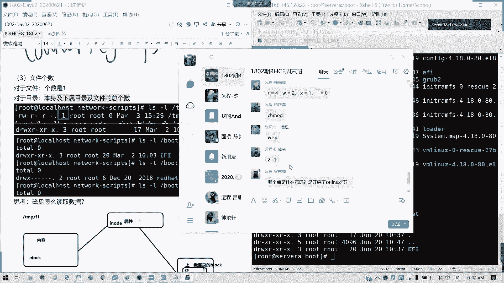

然后我们思考一下我们盘是怎么读取数，我们是怎么读取数据是吧？我们。通常我们一个比如说我们TMP的FE的内容是我们怎么读取的。通常呢我们是通我们访问文件内容呢，首先它会访问一个。

对吧他会有记录一个什么信息呢？像我们这些有一个I know的概念啊，I know概念I know的概念呢是怎么样呢？我们比如说我们TFPFE的一个文件。🎼它是一个我们这里M touch啊。

我们怎么访问的里面呢？我们他是是不是我们那个MS杠I是吧？我们这里这样I的话，我们可以输出它的一个iodedes。Iode是什么呢？是我们在磁盘里面的一个索引，对不对？我们存。保存文件的时候。

我们磁盘是怎么去定位我们的文件呢？我们文件系统是怎么定位呢？它不是说你具体放在哪个文件夹，它这样的话你太复杂了，对不吧？那那那我那我有有时候你的文件夹里放太多或重复怎么办？它是有一个叫做索引值的东西。

对吧？一我们放建一个文件，放这一个文件或一个目录，它是有一个固定的一个索引的，唯一的一个索引编号，我们叫做i note值啊。识别I诺号。对。叫做识别号啊，iodode。

也就是文件我在我们这个文件系统存放位置，它是一串数字来表示的。比如说我这个TMPFE的文件，它的一个iod号叫662230，也就是它的唯一的一个位置，你别的是抢不走，对吧？

一个文件或者一个目录只有唯一的一个iod号啊，然后它iod号，它里面记录了它的文件文件，它这个记录什么东西呢？一个属iodode号，一个属性，对吧？还有它的一个。文件啊。我干嘛我要上课啊，他那个在找我。

我要拍个照，我要证明我没事啊。因为因为最近的话我确实就是说比较没有怎么，对吧？我我我基本上就是说可能你。啊，不能不行，我我这个手机太烂了，主要是违被蚊子咬。上的7天课确实挺累的啊，我在学校我待了5天。

然后呢，就在那个是吧，在我们这个待两天。所以的话我是一直在工作状态，所以的话就真这没什么时间跟家里不再联系。所以确实也抱歉啊，特别今天啊，今天是父亲节，我希望大家如果可以的话啊，给老爸。

如果是自己给老爸打个电话啊，呃老今天吧，对吧？所以想到这个，我确然有点惭愧啊，因为因为我妈突然发微信过来，怕我说到底出什么事情。因为儿行千里母担忧嘛，很正常，可理解。但然后我妈我妈就老是担心哎呃。

肖老师会不会被那个被外面人拐了，或者是被卖了，还是说你欠你银行钱，你出，你在你在你的别人好像被传销都出不来。对吧所以我要把。我的。安全我的安全，我要报备给他不。不然我去动唱歌，哎，好烦啊。

我我都已经走走开始走这条路了。好，我们继续讲啊，这个知道吗？然后他记录的东西就是我上一次跟目录区块，因为它要连接的嘛，对不对？我们一一边是记录我们文件内容，然后一边呢就是我们记录上一个目录，它的区块。

那这样的话，那那是不是我们就是说上一个目录里面，我可以反止就它的位置是吧？我可它就可以定义到我们的具体位置里面啊，这个懂吗？就它记录我们简单的说思考一下我们的硬盘怎么读取数据，也就这样。

它里面记进入了我们的区块内容，然后还有它上一个目录，对吧？就它有联系的，懂我意思吗？它上一个目录，比如说TMP，它有两个文件F1F2，对不对？它的区块分别是一，对不对？还有它的到底的内容怎么样。

就brolock里面其实它存的是文件的内容，懂我意思吗？那行，我稍稍等我几分钟，因为我被蚊子已经被蚊子叮咬了，不行了，我先去拿一下防蚊水擦一下，然后一两分钟时间好吧，我直接带回来。所以我看现对。

是不是可以可以通过iod来io是如果你删掉的话，in它是会它它是会放在那里。但是你删除文件，它并不会删掉in记录，除非它覆盖了啊。啊，将来成为那个。人父人母都是一样的啊，都会你我们。

下一个note它是会那个怎么说呢？如果创建相同，你可以去试一下啊，你可以删掉那个F1。我比如说我删掉那个F1，我再覆盖一遍啊，我再覆盖一遍。大家可以看一看啊，可以看一看我们这个操作会不会这样啊。

我比如说我删掉M杠FTMPF1。然后我再建回1个F1。然后看的iodote是不是一样。是一样的啊，所以证明它如果是相同文件的话，它没有发生任何更改，它的一个in是不会变的。如果差取一个F2，我列列一下。

是变了，我们存储需要位置就变了，对不对？所以这个就可以解决我们梁志成同学的一个问题啊。懂吗？我们就可以解答两个志诚同学问题了，这个这个可以理解吗？我们不同文件的话，我们所以我们删除这个文件的话。

我拍一下拍一下它啊。这里我们艾特相当于我们这在这里拍了啊。不同文件的话，安odeode是不一样的对吧？但是如果是硬链接那除外，硬链接指向的安ode是相同的，懂我意思吗？软链接就不一样了。

这个我们后面会见讲到一个软硬链接啊。

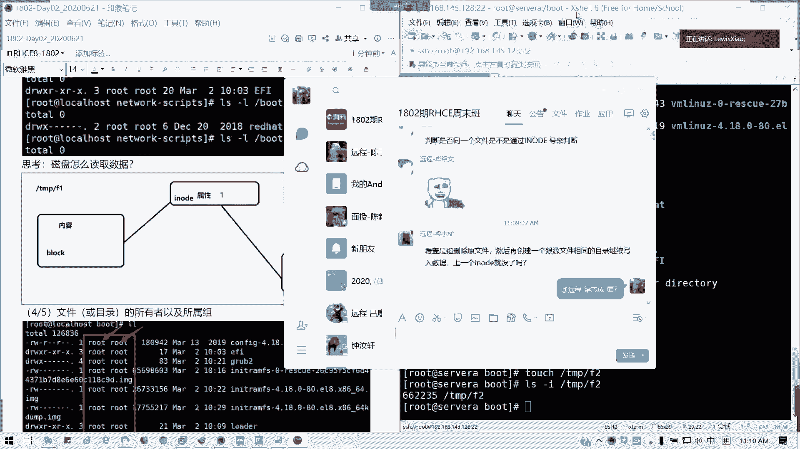

好。嗯，他自己试一下啊，可以。然后我们接下来我们讲第四列跟第五列。第四列第五列分别代表你文件或目录的所有者，还有所属的组啊。懂吗？从鼠的组。第四列。第五列啊。就是他的那个他到底是谁创建的是吧？

他所有者是谁，但这个字是可以改的，这个所有者是可以改的组也是可以改的。懂我意思吗？第四列第五列，第六列是文件或目录所占磁盘空间的大小，它这里是以字节来表示，如果我们后面加上一个H，那这它是以人类可读的。

比如说它有分字节KB照句等等，这些是吧？这是我们人类可读的方式。如果他你不打的话，它就默认就是一串，它就会以字节单位，那主是计算的很麻烦。对吧。接下来。

最后就我们日期它是它这里不是代表我们文件的创建时间，它是代表文件或目录最后一次被修改的时间。也就是你什么时候改的，我就什么我就这前什么时候，比如说我刚才的TMPF1。对吧我们是这里的时间是不太准确的啊。

这个是因为他减了减了好多小时，所以的话是显示了20号的23。09分啊，有文字啊，你们自己拍一下，有文字。有有有我看到这里你那里。对我们我被咬了哈。然后呢。😊，改变文件名不会改变，因为它的内容没有变。

它你的索引没有变化啊。这个是真这个是真的啊，就刚才陈思浩，我们那个陈我们的陈志师弟我们问的问题，改变内容，改变文件名，文件内容改变文件不变，他的I度是不会变的。好吗？我飞到你那边去了啊。小心。

这个文子的话确实确实那个有点毒哈，我已经要已经被咬了两个包了。然后呢，这也是想最后一次修改的时间。比如说我现在我VI1下VIM1下F1是吧？我输一下内容，123234对吧？我随便输入什么内容。对吧哎。

我又变成快捷键脑。

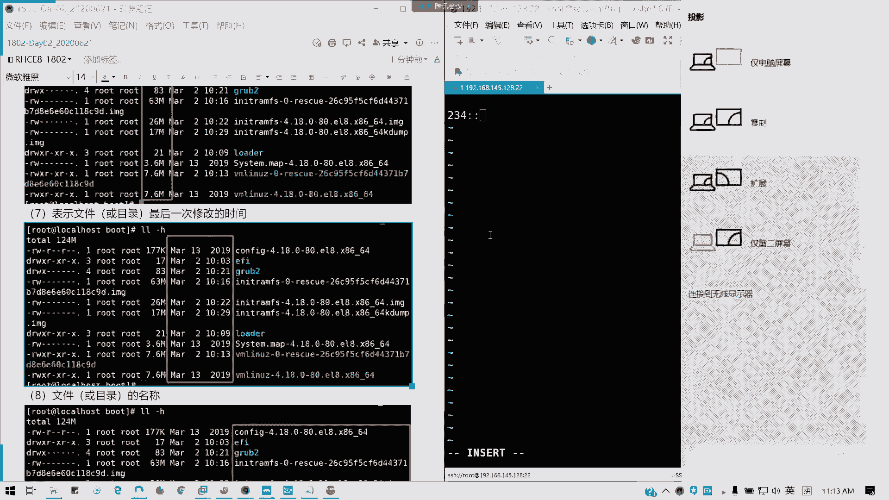

好，WQ我们看一下我们的LLFE。是不是我们的时间已经发生改变？对吧所以我们的内容本来是一个空白的文件，是不是里面加了东西，对不对？所以的话这里写的是文件或目录，最后一次被修改的时间啊。

或者写修改时间也可以都一样。对的啊，陈思浩同学啊陈思浩同学可以这么理解啊，然后后面最后一列就是文件跟目录的名称，这个都都知道哈。

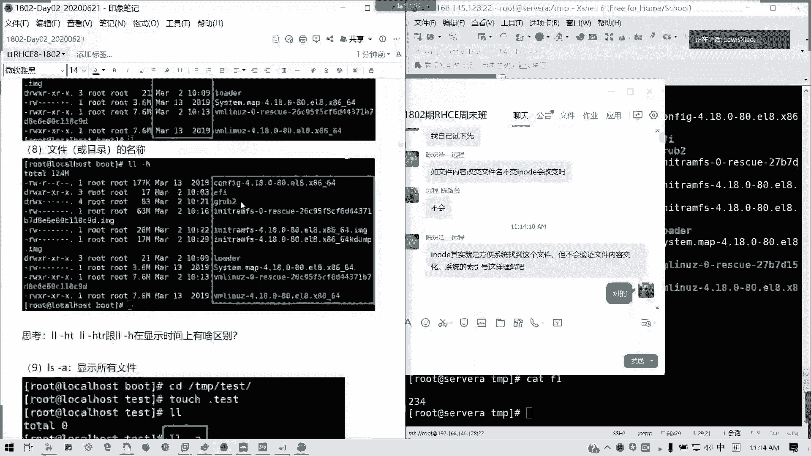

然我们可以看一下那个LL杠HTHTR杠H显示时间有什么区别啊。我们这样讲到时间，我们可以看一下啊，HT它是显示的是。

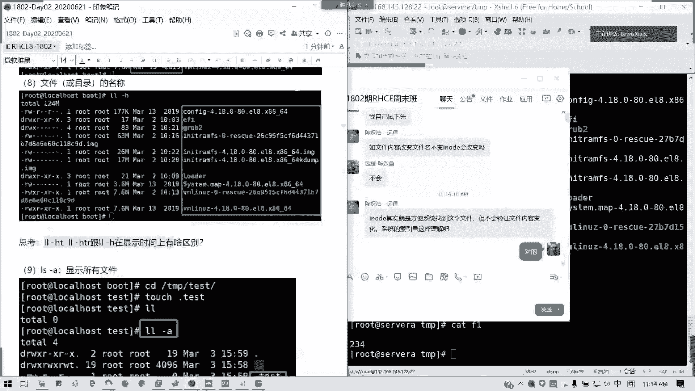

是吧都是那个。这是我们的月日时间对不对？然后HTR呢。就这几个他前身就有区别了。看一下F1呢，我看下。就排他这是是一个排序啊，如果HT的话。HT的话，它是。倒叙对吧？从新到旧懂吗？HTR呢。从旧到新。

然后杠H就是以文件名来排。懂我意思吗？这个思考题啊就是给大家这么一个解法，懂了懂了吗？代T参数它是按时间。来做排序啊，按时间做排序。然后我们因为有隐藏文件在啊，隐藏文件在。所以的话我们这里的话。

如果我们那个创建隐藏文件，那我们怎么显示出来呢？比如说我CD我我新建一个test目录。的TP上面。然后touch是吧。哦，有了是吧？然后我进入到 test目录。

然后我们新建一个隐藏文件叫touch点test。好吧。我创建两个吧，然后我LL普通人是不是没有显示出来，对吧？点开头的就像我们windows里面隐藏属性一样，它就是一个隐藏文件啊，隐藏文件。

那我们杠A是吧？是不是它就全部显出来了，包括它的当前的一个点，还有我们上级目录，它都算在我们的文件个数里面，懂吧？所以它总共这里是4条4个条目，懂我意思吗？它是连当前的一个目录，一个标记。

加上上一层目录都有，可以理解吗？为什么是4total，为什么是4。我们这里创建了两个临时文件，对吧？两两两个隐藏文件，然后再加上一个当前目录，还有一个上一级目录的一个索引。总共有4个。可以理解吧？

在lininux系统下呢，隐藏为是点开头，就像类似我们windows里面打了一个隐藏属性啊。window里面就隐藏属性，然后在linux下就点开头就是隐藏的了。好，我们讲一下LS杠D啊。

LS杠D它是显示目录本身的一个属性。如果不带杠D呢，它就目录情况下显示出。该文件下面的子文件跟子目录属性就是不显示它本身是吧？我们比如说LF。杠D是吧，TMP。是吧他显示本身的一个。目录属性跟文件是吧？

我们带L的话，长串输出，对吧？如果不带的话，是不是它显示下面东西啊？对吧。然后我们这里也可以用L点。对吧L点现在列出我们的属下的一个文件内容。L点是等于LS杠D的对吧？不过L点呢，它是相当于杠AD啊。

我们这我。杠A应该是L点的话，我们等于LS杠A不是杠D哈。这里的话我我们就要更正一下。好吧。L点等于LS杠A啊，我们这里的话应该命令在这里啊。懂吗？然后L然后LL是L杠L的别名。

我们通可以通过ADS命令，就刚才说的别名命令，我们可以验证啊这里。Aliaas。L点等于LS杠D其实LXLS杠D也是对的啊。所以的话这里的话我们还是回来啊L点等于LS杠D，然后标颜色是吧？

我们的LL是不是等于LS杠L啊，对吧？所以这也是一个系统的一个别名，但是如果是在我们后面S学到的话，我们是不能用LL命令，因为它这个别名它默认不读取。嗯。这里我们系统定义的很多像CP是吧？

像我们的复制文件，它有透明带杠I参数，有时种交互式。啊，相互是附是。还有各种gra，对不对？

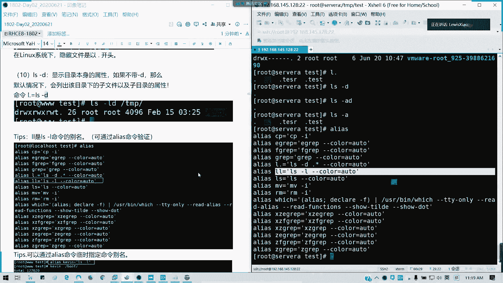

那我们也可以用alas去指定别人。比如说。我们可以指定alas，比如说我叫做那个。listase点2是吧，等于。LS杠L我这里头我们可以手动指定一个别名。对吧。我们可以手动指定个别名，对不对？

这我们临时的啊，如果要永久的话，我们写到一个bch RRC里面。然后我现在我就写list thereR，然后bo。

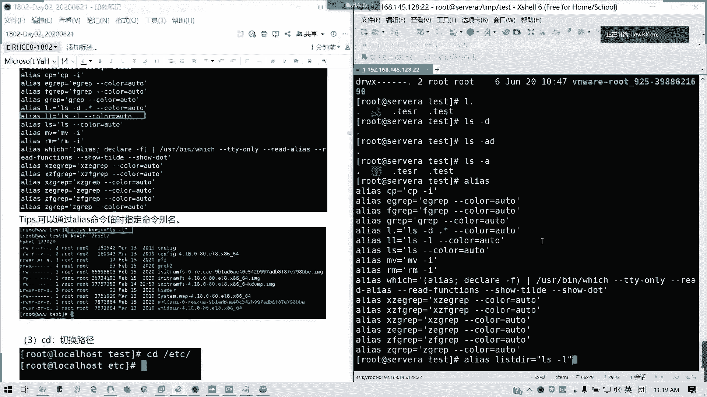

是吧。懂吗？可以自定义别名，但是注意啊，你不要乱来啊，就刚才那个什么从入门到入意的这个就不要了啊，懂吧？有些方便我们操作的，我们可以指定别名。但是如果一些其他的像一些涉及到删除，特别是删除，对吧？

这些东西你就千万要谨慎，懂吗？删的东西呃，就是说这确实你怎么就就不回来啊，你增加修改，你们按按规定做是可以，但是不要乱删，好吧。LS命令有没有问题，有问题可以提问啊。LS命令有没有问题？没有的话。

我们讲CD啊CD就是切换路径，这个跟windows是一样，然后常用用法也差不多啊，如果比windows就多了1个CD波浪键，就切换到加目录。其他的一样啊，两点上一级点当前目录对不对？

上两点上一上一级波浪线加目录，然后上一个目录CD杠是吧？列出它的目录懂吧？就就进入他的那个。我们上一次的目录对吧？这个知道吧？然后接下来我们知道怎么列出来怎么切换目录。

那我们要我们要学如何去管理目录管理目录啊，创我们先教大家如何创建目录啊，创建目录MKDIR。很多人真的我去教学生的话，他们连创新目都都不知道怎么创。或者就是在图形号界面鼠标右键新建文件夹。对吧。好。

MKDR比如说我创建1个TMP目录下面的t2。这个已经存在了，我们刚才创建过一个目录，对不对？比如说我创建一个test3，对吧？这test3，然后LS杠LD是吧？我们可以看到它的目录这个目录的属性。

台3。对不对？刚刚创建的。如果他的父目录不存在。比如说我的层绩创建目录，我的副目录不存在，那我们可是不是可以加杠P参数啊？递归创建。对吧。懂吗？我们这个t4这个目录它是不存在的。但是我要创造下节目录。

他就会帮你递归制作，记得带上杠P啊。然后删除呢，我们这里用RMDIR，但是用的不多哈。但是这里的话记得我们用绝对路径，因为用相对路径很容易出错啊。RMDR，比如说我删掉一个tex2跟tt3。对吧。太3。

然后t4的话，我删除不了，为什么？因为我们的那个。我们文件不是空的对吧？我文件不是空的，就是它的目录不是空的，所以你不能删啊。你它如果按DL，它只能删除空目录。那么通常情况下，我们是用LM。RM对不对？

但RM这目这个文这个命令呢通常是用来删文件的。对吧他为了告诉我你这个文，这是一个目录，对不对？那如果是递归删除，那可以吗？后面加杠L。对吧。他就一层层问你是不递归删除，对不对？

先问你说那个就进我们先就说切切换到他这个目录，然后他发现了有一个1111个那空目录，对不对？太4，然后删完之后再回来再删。这是他删除的一个原理啊，懂吧。像这里RM的话，它是一个交互式的对吧？交互式。

我们看到我们的那个别名是IM杠I。然后如果强制删除就是RM杠F哦就不不问你Y不歪了，直接就删了，对不对？所以不要。求你们了。不要这样。我受不了了。不要笑啊，很多人就是这样手误的啊。😊，懂我意思吗？

露个点直接哦呜呼对吧？哦吼对吧？你你哪怕你直前一秒钟，0。1秒，你就你都文件肯定肯定挂了。对吧因为root实在是那种杀人犯，我都能做的对吧？超级管理员啥都能做，那是不是权限太大了？

所以我的话我们在运维我们实际的生产环境，是不是一般root权限都是掌握在大佬手里的。对吧掌握在我们的经理或主我们的主管手里的，我们通常就用普通命令普通用户，对不对？这才是最安全的。而且我们要加审计。

对吧运维审计就是审计这些。所以的话这个特别要注意啊，不要乱来啊，root这个用户不要真真的对吧？太危险了。对啊，有保保垒机，就是运维审计系统啊。有录像的，就有时候这我以前被查过，就是不小心敲了一个重启。

然后不后面别人追被追查了都有。都有的。保垒机你一看录像，他会把你所有的操作全部记录起来，完全可以追根溯源的啊。造是了什么？这样敲了个U杠都被屌是吧？

对吧所有我们在实际生产环境里面都是有堡垒期去帮我们做记录的。其实这也是为了避免说我们操作失误，对不对？它也限制了某部分权限，对不对？对吧。所以你的选项参数你放在哪里都没有关系，你可以放在后面啊。

所以我我抛出一个思考题啊，哎嘿嘿这三个什么不一样？这个问题我每个班我都会问，对吧？星杠星跟点杠星是是什么不一样？有人能回答我吗？我看群里面有没有人回答我啊，思考一下以下三个命的异同。第三个呢。

王子第一个跟第三个是一样的。第三个跟第四第一个一样的意思。但第二个你都危险了。对吧我当时就是有一个同事，他要上一个文件，解他他他就说帮客户解决问题的时候，就那那那是一台生产机器。

是提供web服务的一台机器跟数据库的，要帮客户上一个文件M杠F型杠FIF杠0。直接崩掉，还好有客但着客户的话，马上这个服务器就就你一重启就完蛋，对吧？바을！你傻了吗？你拔电源。对吧。数据恢复啊，对啊。

你有容灾吗？对吧？你有做你有做你整体的做镜像吗？对不对？像现在的话，以前你知道以前那种的，你那道以前的我那种情况是单机的，你恢复的话只是文件级别做，你以没有在基础结架构做，所以这个很危险，对吧？很危险。

所以的话建议大家不要乱删除啊。到数据算副本嘛，双双击至少是多机热备上上存储，然后容灾，然后还有E地机房。对不对？现在各种都有啊，然后像学校这种更真更更简单粗暴争霸卡、还原卡是吧？一重启。

你几几前做的东西全都没掉，对不对？对啊，陈志浩说的没错啊，现在基本上都是这样，就是存储，包括存储镜像也好，存储，你要做镜像，你要做增备，就每天增倍每周完倍吧。包括像我们在存储级别，我们在IO级别嘛。

IO级别都直接恢复了。对啊，就是以直接对照文件区块，对不对？而不是我们文件系统，你磁盘照样恢复都没问题，现在都能做，然后容灾你多机房，对不对？你如果这边服务停了，我可以启用备用的，对不对？马上无缝切换。

可能时间会稍微短，可能你会察觉不到，对不对？而且负载均衡异地啦，对啊？异地一异程啊，你看这些什么腾讯啊，移动电信啊，联通机房啊，还有大疆ID这全部都是这样做，但是我们以前偏这工作第一在单位全是单机。

单网线单机很危险的。对吧要如果多机的话，对吧？两地三中心嘛，对吗？两地三中心这个概念大家都应该知道啊。所以现在的真的我们发展现在你你至少你我们教过你我们将来在CA里面学集群也是有讲到这个东西的。

就包括opent，我们的那个s是不是都有多多个备份的，多都有多个副本的，对不对？你不可能只有一个副本吧，想想死，你就做一台吧。对吧我甚至看到有些医院的话，你知还在人手运维。

然后他他就一个业务对ledds嘛，ID嘛，这seF里面做的。有network是可以背的，现在很多的就我们就在那个IO级别，就存储的IO级别，我们的基础测试级别当我们像存储啊，还有就是我们的HA是吧？

做HA做f over对吧？做那个两地三中心都可以啊，现在基本上都是这样，但是我们腾客好像没貌似没目前没有这么做，大家可以。到时可以体验体验建议啊把把这把这个我可以提验建议把它做起来啊，对吧？

像学校那就更简单粗暴，连预都什么都没有，对吧？就直接学学校那种机器啊，就是说学生能能做实验就行。然后里面装一个还原卡，就重启就定时还原C盘，更简单粗暴，对不对？然后他们有一些店员直接就下课时之后。

电脑都不管直接趴就走。对吧只是总总店员一拉就走，千万我们在家，哪怕在家你都不敢怎么样，你你敢不敢就突然你你你你人家家里什么东西又开始时，你直接拉电源。然后在数据中心更加危险，对不对？

这些机器都算4小4小时开的，一拉的话，你可能机特别老机器都起不来。我甚至我试过啊，就在我早期工作的时候，你知道一台机器十几年是吧？拍拍有三年什么意思啊？然后你看这里面十几年。

然后然后机器一一关机就起不来，然后起来之后，你人站在机箱后面，我们在一个人在前面按电源，一个人后面解下线，然后突然我们人变成我们我们那个人我们这个人就变成一个人入吸尘器。他就那个风吹出来。

在那哇一堆灰尘啊，对吧？当时有些机器真的用了18年十年都不淘汰了。但是现在一般企业呢就是用5年左右，对吧？3到5年铁定报废，然后报废机器在我们这里还是香饽饽，对吧？因为服务器呢。

它虽然它的那个性能它的那个架构啊，就服务器用的CPU它架构可能是两年前，或者是就说隔一代或隔两代，对不对？但它的性能是因为它是要求稳定为主。稳定，然后他收有之话，为什么服务器启动那么慢？

因为他要加载很多的一些。硬件模块。对。硬件模块。所以的话它启服服务器我们是只要记它的稳定性就行了。只所以的话不要说一台服务器开机8分钟10分钟，这是很正常的现象。这次我还试过说有硬件模块故障的时候。

它一服务器台你他他妈开机才40分钟1个小时。都有。对吧。你看它这种重启是有风险吧，是吧？网卡卡死reck，我们集群我们re克就断了，一他磁盘这里掉了，特别是有时候你还不是掉一个磁盘。

你要掉你readread，我说掉两个，对吧？有时像这样的。然后还有就是像有些人就直接你看直截了当做瑞的0。快是快，但你一经盘坏，你就拜拜对吧？通常说我们是怎么做的呢？在系统盘，你系统盘里除非你是多机。

而且你做的齐全，而且你钓鱼台没有风险的话，你可以做单盘论0。一般的话我们是系统盘做read的一。对吧。啊。就直通嘛，追bo嘛，但直通的话也有问题啊。为d5一般是用用在我们写写不平凡的时候。

就会我们一般服务。然后像有些也要高有于的做re6，甚至是1010是数据库的主力啊，主力基本上数据库都做10的，因为它是兼顾了种余跟速度，然后还有就是50跟60，对不对？调就是说他。比较少。

但是他的话主要是兼顾的就是一个对吧？你看人家都说了，魏我直接掉2块牌，你数据怎么恢复啊？read0不是0加1啊，是1加00加1就read01了，0。01就是先调代化再做re1，那你一个盘挂的不是全挂吗？

等于一样的，就几个分组就挂了吧，对吧？read10是你是先做镜像，然后再然后再把分两个分组调代化，所以你挂你只要不挂一边的磁盘都没有关系，同一边的，你不要坏2块，你坏2块，你坏在两边没有问题，对不对？

对啊，开盘啊这种你知道我澄清，你知道我这笔记本电脑，我当时有一台公18年的时候又共司了笔记本。他就星机买不4个月，硬盘直接挂掉啊，SSD的我，1个180G的，然后结果他妈看的是固件问题。

然后而且没没得恢复的。人家当时多心疼啊，数据全没了，就后面是找各种同事啊，或者是我移动云盘里面存的东西才恢复了百分之七八十。对吧。其实SSD也是有风险的。所以的话我们要就说它它的话呢一它是不是磁头的啊。

寿命一道，这些的话它也会对吧？所以的话就最好的话，你们要像有些人家里有钱买nice的，或者是我们不重要的东西。放云盘，重要的千万不要放云盘啊，因为现在互网行动经常查的，懂吧？有些人就把机密文件放云盘。

直接你就你第二天你的公司就被查了，对吧？记住不要把机密文件放在云盘啊，你宁愿放在私有云，就是单位里面的私有云还好过，对吧？他一查查到一个某就某某单位是吧，某单位2020年是吧。

才成本预算这类的都是一个机密文件，所以千万不要乱丢云盘。云盘云不是一个安全十分安全的地方，对吧？懂吗？所这个我提醒大家一点啊。做备份，然后有些单位的话，它是有防泄密的对吧？防水，我们有防火。

防火是防外来的，防泄密是防出出具的对吧？而且有些还文件不落地，对不对？文件不落地啊，这这对都有些现在的话，基本上信息安全管控的非常的严格啊，像有些你这直接作狱，然后你封掉你的U盘，封你的SB接口。

对不对？光驱不给用，很正常的，对吧。我们基本上都是私有云，就单位里面的内部私有云或者网盘的资源都是这样。所以这我顺便就提到了一个数据安全的问题啊。

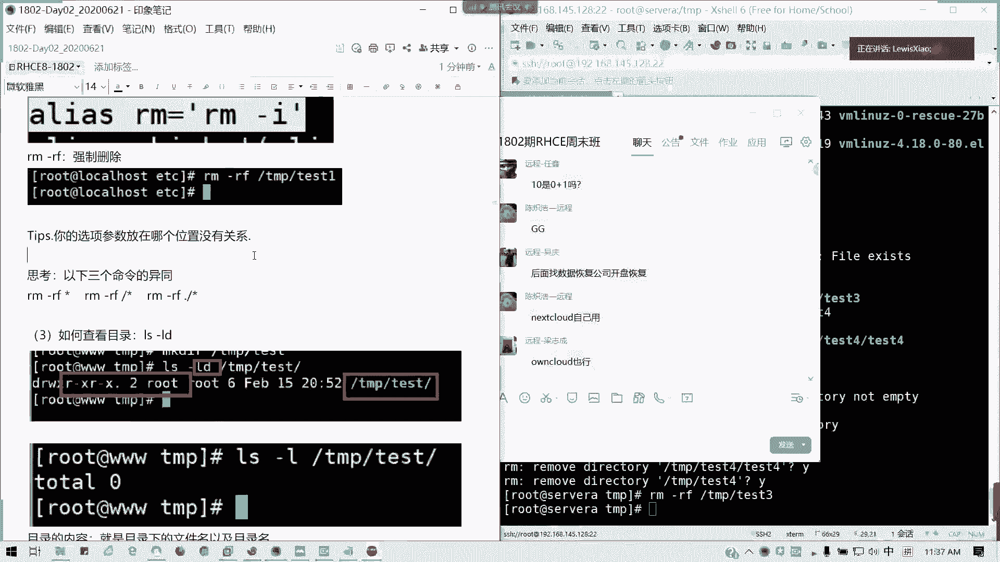

你们经验多啊，现在产品这里很多，但都是要钱的啊。好，我们讲到的这个LOS这个就知道了吧，我就直接跳过啊。三级担保都是有要求的。三级等保特别像地铁，像江通集团有一些收费收费网对吧？都是要三级。

现在最高等保等级保护是4级嘛，普通的二级等保都可以，一级等保没没没有人做了啊，一级等保就等于相当于没什么虚，就相当形用虚设啊。三级等保一般都是比较严，比如说这样容灾，你要你要你应急响应要多要多少时间。

对吧？你的数据会复制你你的网络中断，你不能超过多少。然后你的连通率要99。9%是吧？99是吧？然后你的数据啊要防泄密啊这些的，你要做好，现在很多企业都搞三级的。然后你要做异地容在中心，对吧？

然后你要链路至少两条，对不对？多重链路等等，这些都是啊，自己搭建硬盘也是有风险的。小心啊，万一你这个云盘里面有漏洞被人破了呢？好。跑远了啊，但是这个我顺便强调一下，因为有人问到了。好。

我们看一下我们的移动目录MV对吧？

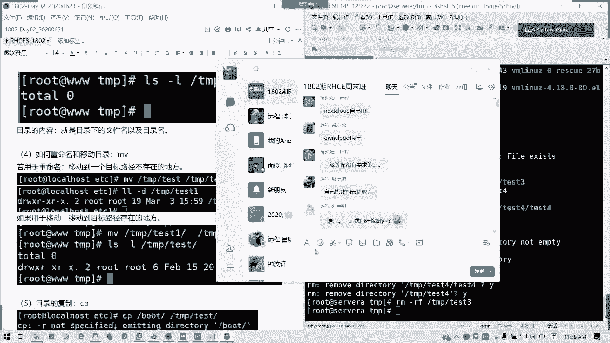

比如说从我们移到一个不存在的地方，是不是相当于重命名啊？所以我们重命名是没有叫做没有rename这个命令的，我们就相当于一个啊MV就可以啊，对吧？对吧。杠低哈。

MV如果把一个文件移动到一个目标不存在的地方，那相当于是重命名。如果是移动到存在的地方。那是不是？移动就是移动了，懂我意思吗？可以明白吗？MV既可以重命名，又可以移动文件。接着两叫CP啊，CP的话。

它是用于目录或文件的复制啊。杠R的就复递归啊，递归复制，然后杠A呢就等于PR，它是递归复制，之外，还要还要保留我们文件的一个属性，懂我意思吗？可以懂吗？如果你他复制的话，你复制单个，你可以不加任何参数。

比如说我CP。bo是吧。🎼然后TMP。Test。对吧它里面的话，他要求说你里面有文件啊，所以就要杠L递归复制。或是在前面参数在前面后面都没所谓啊。然后我们TNP test对不对？对不对？

我们是不bo里面的内容，对不对？然后杠A的话就把我原来的那那些。属性都带上，对吧？我们如果新附的话，我们是他的权他的那些权限啊，它的属性都新的，就按照默认来。如果要保留的话。

就是带杠A或者是直接杠PR两者一样。就是CP的啊。然后接下来我们讲文件文件的话，刚才我们讲到我们创建空文件是不是touch啊。对吧。然后还有一个A。然后我。A口也可以拿来创建。

但是A口它是有占一个字节的touch，它是零啊。E口的话就相当于标准输入输出t里面的F2。🎼大家我们的TMPt里面LL。我们的F1F2是不是有区别啊，这里啊。Ale呢相当于我们已经出一个空格。

所以它占了一个。一个字节，那touch上是完全空文件，所以是0。然后呢，我们查看文件内容cat是吧？我们比如说我们的我们是可以，比如说我们CP啊，我们的ETC passWD这是一个存放用户的信息的一个。

专属配置文件啊test我复制到这里，然后我查看一下是吧？TMP目录下的ts目录里面的pasWD对位？我一旦我我把文件复制到一个存在目录，上不是文件，它会创建一个创建一个一模一样文件，然后在别的目录。

对不对？我们这样ca是不是一次性写完显示完。然后如要输出行号的话，就cat加N杠N啊，输出我们的行号，对吧？No。我们要分屏输出怎么办呢？more。更多啊。但他只能往后翻，不能往前翻。对吧专业。

懂我意思吗？好吧。但它是不能往后翻啊，它是那个它的用法是怎么样呢？我们到这里，它是按页翻的。如果是空格键是往下翻一页，enter键是往下翻一行。他就不能往上翻，所以我们只能通过鼠标的拖。来显示一些内容。

对不对？然后我们还有就是如果要查找文字里可也可以查找功能。比如说查找一个叫做。查找一个叫做student。这里它也可以可以可以实现我们查找功能，它就会把它条目之前的对吧？

把这条目之前的几行把它skiing掉，跳过跳过显示，然后显示到我们我有5包号我们stu那一行，懂我意思吗？可以吗？在默偶模式下，我们是可以直接。来查找的啊，还有一个就是如果要分屏输出我们。

还有一个叫lesss。这也不是少的意思啊。对吧他是可以。往上翻又可以往下翻，懂吧？既可以往上又可以往下，然后方向键是吧，往上翻一行往下翻一行，然后p up是往上翻一页，空格键往下翻一页，对吧？

查找关键字，然后我也可以查找。上一个关键字是吧，N是下一个关键字，它是patter no fall了。然后上一个关键字是不是按大减N对吧？小N就下一个大减上一个懂吗？这是less的用法。这个K也是啊。

对吧？JK也是对不对？看到吗？就往上跟往下翻一行啊，翻一行的话，我们这里是K啊。对吧这里就应该很清楚了。像这往下翻一页的话，我们可以用配置 down。懂了吗？let's more cat如何查看文件。

明白了。那t。查看文件头啊，pad是头，对不对？Head TMP test。🎼Pass。默认文件下查看文件的投时行。然后我要加杠N的话，是不是我要查看多少行，比如说杠N一是不是显示第一行，好吧。

这里我要跟加空格哈。对吧。明白我意思吗？杠N显示多少行，默认十行tail呢尾部。默认显示最后是行。杠恩。比如说我显示最后一啊，我又是这个空格啊，对吧？显示最后一行懂吗？然后还有还有一个叫不断刷新的。

就显查看一个文件末尾啊，文如果我们文件里面有新增内容的话，那是不是它的这个杠F是不是？他就不断的去刷新，对吧？它就不会填在那里。然后我们cttrol加C才可以退出，对不对？杠F通常我们来干嘛呢？

查看日志，我们排排账用的。就比如说我们一个服务出现异常，然后我们用tellF杠F，我们监监听我们这个日志文件。然后我在旁边另外一个窗口做一个操作。那是不是它会生成相应的日志，所以te的话。

其实我们用的会更多，对吧？用来排故障的情场合会很多。文件的复制CP我们刚才讲了，应该知道啊，跟目录复制是一模一样的。单V一样。对吧。就刚才说了常规文件管理命令啊，这都OK。然后呢我们稍微我看一下。

现在我们讲了一小时多了，那我们稍微休息一下给大家。点外卖或者怎么样，好吧，我们可能12点出头，我们讲一下软硬链接。

