# Linux文件管理基础：第2章：从命令行管理文件


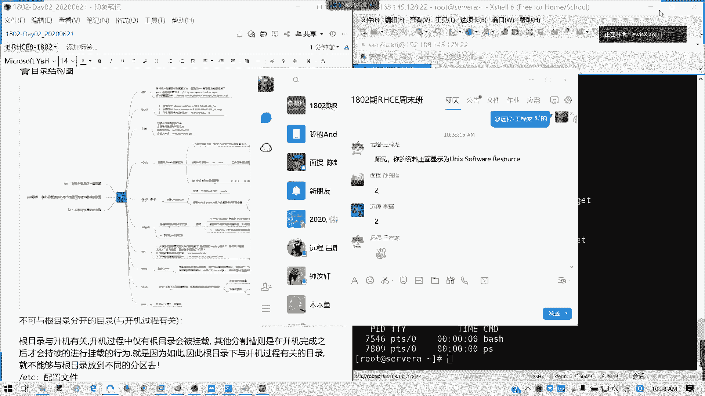

在本节课中，我们将学习如何通过命令行来管理Linux系统中的文件和目录。我们将从理解文件路径开始，逐步学习查看、创建、移动、复制和删除文件与目录的核心命令。

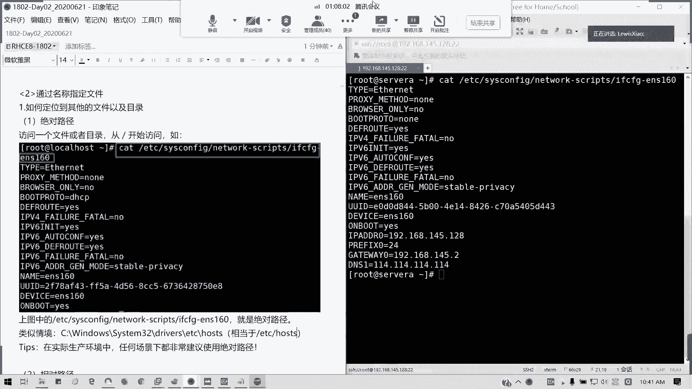

## 概述：理解文件路径

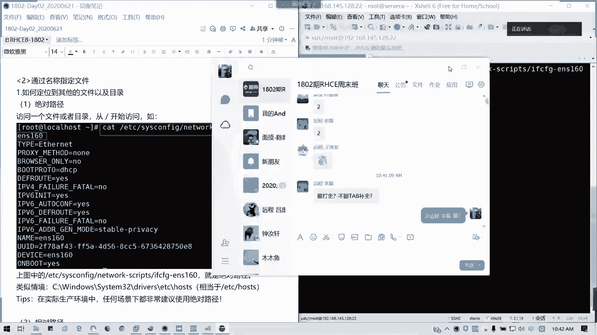

在Linux系统中，一切皆文件，包括目录、设备、配置等。访问文件首先需要知道其路径。

**绝对路径**是从根目录（`/`）开始的完整路径。例如，网卡配置文件的绝对路径是：
```
/etc/sysconfig/network-scripts/ifcfg-ens160
```
这类似于Windows系统中的 `C:\Windows\System32\drivers\etc\hosts`。

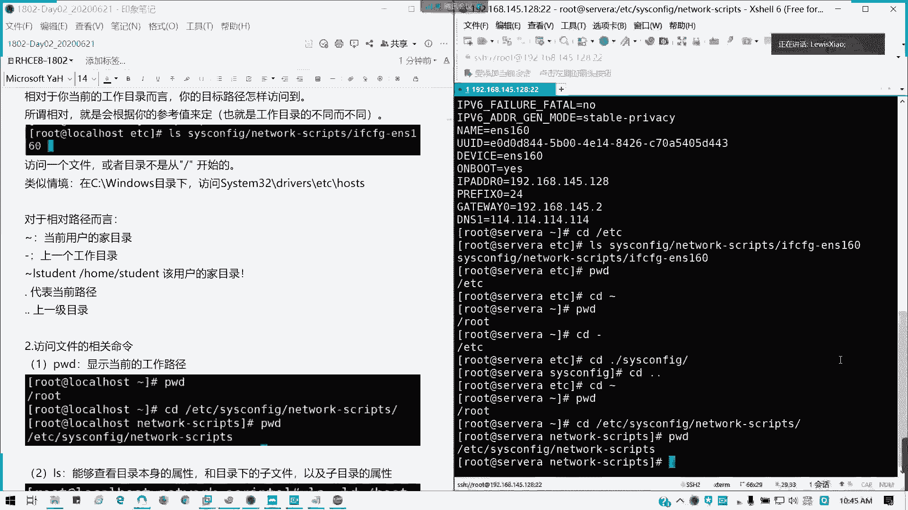

**相对路径**是相对于当前工作目录的路径。当前工作目录可以用 `pwd` 命令查看。每个用户登录后的初始目录是其家目录（`~`）。

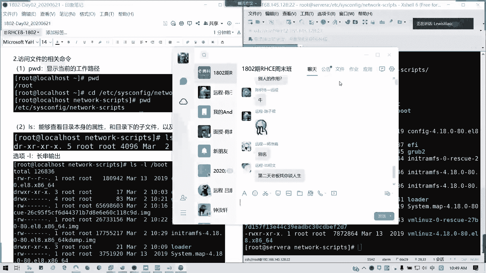

以下是相对路径中常用的特殊符号：
*   `~` 代表当前用户的家目录。
*   `.` 代表当前目录。
*   `..` 代表上一级目录。

上一节我们介绍了文件路径的概念，本节中我们来看看如何查看和切换目录。

## 查看与切换目录

### `pwd` 命令
`pwd` 命令用于显示当前所在的工作目录。
```bash
pwd
```

### `cd` 命令
`cd` 命令用于切换工作目录，其用法与Windows命令提示符类似。
```bash
cd /etc/sysconfig  # 切换到绝对路径
cd network-scripts # 切换到当前目录下的子目录（相对路径）
cd ..              # 切换到上一级目录
cd ~               # 切换到当前用户的家目录
cd -               # 切换到上一次所在的目录
```

### `ls` 命令
`ls` 命令用于列出目录内容或文件属性，是最常用的命令之一。

默认情况下，`ls` 列出当前目录下的文件和子目录名。添加 `-l` 选项可以以长格式显示详细信息，`-d` 选项可以显示目录本身的属性而非其内容。

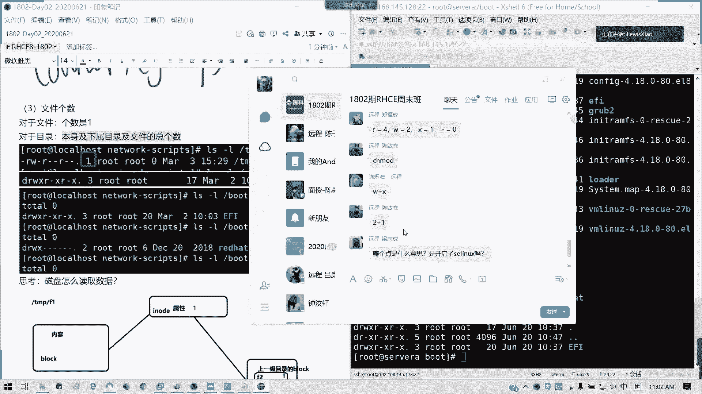

一个常见的疑问是：为什么有时可以直接使用 `ll` 命令？这是因为 `ll` 通常是 `ls -l` 命令的别名。别名是用户为命令定义的快捷方式，但并非所有环境都默认设置了这个别名。

以下是 `ls -l` 命令输出中各列的含义详解：

1.  **文件类型与权限**：第一列的第一个字符表示文件类型，后续九个字符表示权限。
    *   `-`：普通文件
    *   `d`：目录
    *   `l`：符号链接（软链接），可理解为快捷方式
    *   `b`：块设备文件（如硬盘）
    *   `c`：字符设备文件（如键盘）
    *   `s`：套接字文件（用于进程间通信）
    *   `p`：管道文件
2.  **硬链接数**：第二列的数字表示指向该文件inode的硬链接数量。
3.  **所有者**：第三列表示文件的所有者。
4.  **所属组**：第四列表示文件所属的用户组。
5.  **文件大小**：第五列表示文件大小，默认以字节为单位。使用 `-h` 选项可以显示为人类易读的格式（如K、M、G）。
6.  **修改时间**：第六列表示文件或目录内容最后一次被修改的时间。
7.  **名称**：第七列是文件或目录的名称。

`ls` 命令的其他常用选项：
*   `-a`：显示所有文件，包括以 `.` 开头的隐藏文件。
*   `-t`：按修改时间排序，最新的在前。
*   `-r`：反向排序。
*   `-R`：递归列出子目录内容。

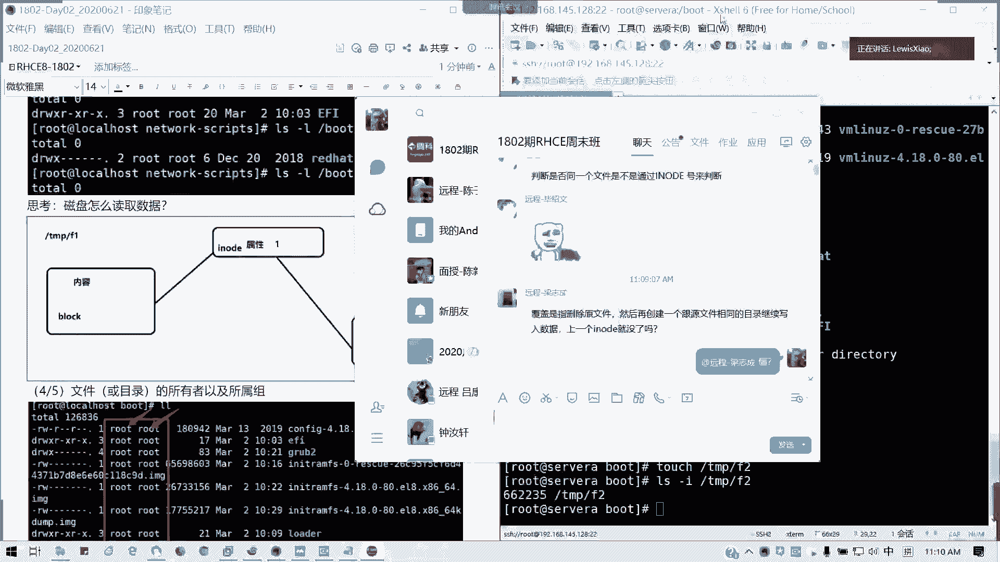

了解了如何查看目录和文件信息后，接下来我们学习如何创建和删除目录。

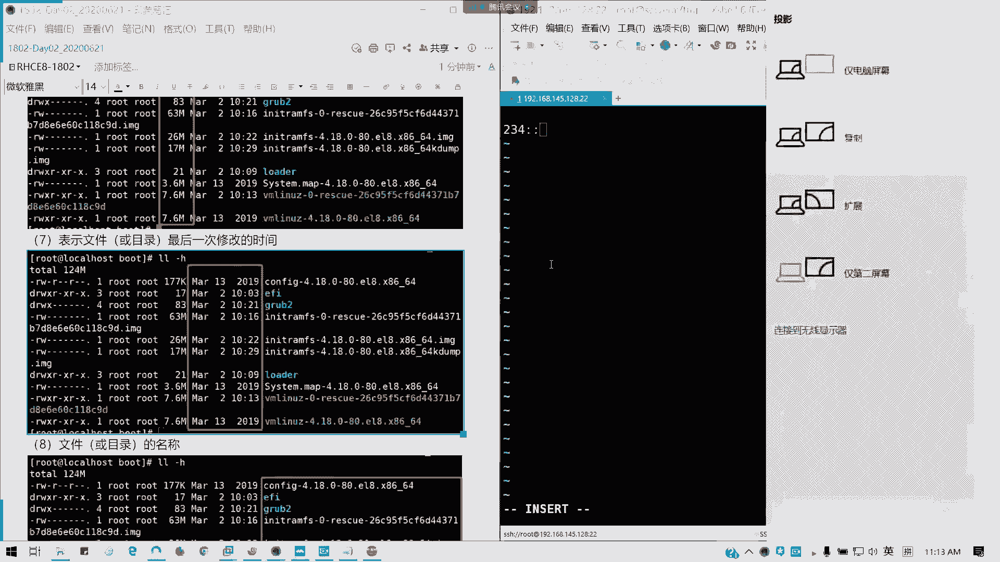

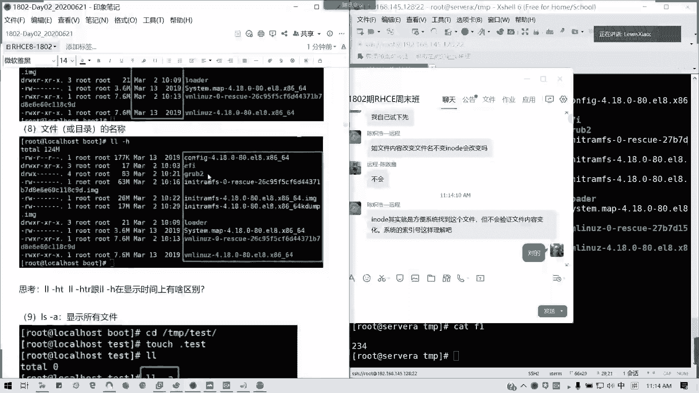

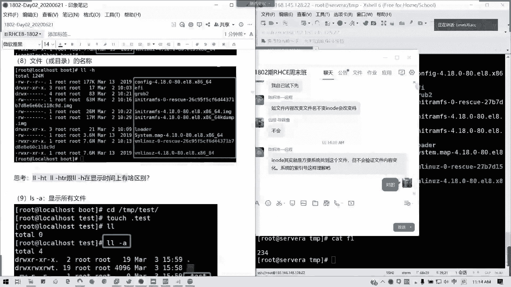

## 创建与删除目录

### `mkdir` 命令
`mkdir` 命令用于创建新目录。
```bash
mkdir new_folder      # 在当前目录创建名为 new_folder 的目录
mkdir /tmp/test       # 在 /tmp 目录下创建 test 目录
mkdir -p a/b/c        # 递归创建目录。如果父目录 a 或 a/b 不存在，也会一并创建。
```

### `rmdir` 命令
`rmdir` 命令用于删除**空目录**。
```bash
rmdir empty_folder    # 删除名为 empty_folder 的空目录
```
如果目录非空，`rmdir` 会报错。更通用的删除命令是 `rm`。

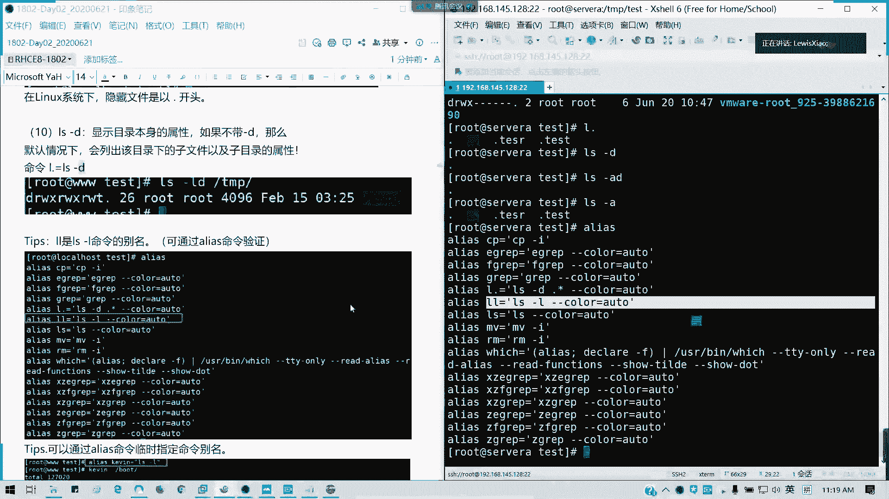

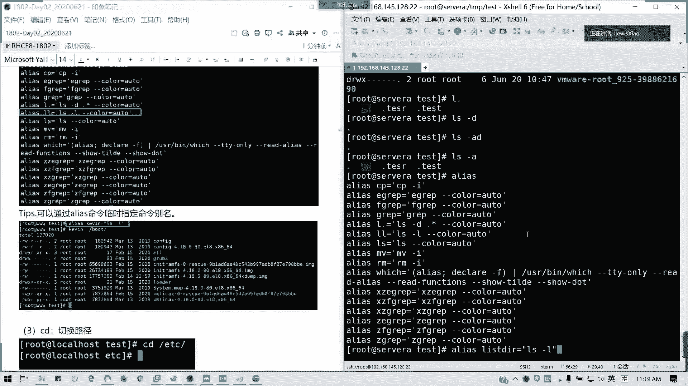

### `rm` 命令
`rm` 命令主要用于删除文件，但配合 `-r` 选项可以递归删除目录及其内容。
```bash
rm file.txt           # 删除文件 file.txt
rm -r folder_name     # 递归删除目录 folder_name 及其内部所有内容
rm -rf folder_name    # 强制递归删除，不进行任何确认提示（请谨慎使用！）
```
**警告**：`rm -rf /` 或类似的命令会强制删除根目录下的所有文件，导致系统毁灭性损坏，切勿尝试！

学会了目录操作，文件的基本管理命令也非常类似。

## 文件的基本操作

### 创建文件
`touch` 命令常用于创建新的空文件，或更新已有文件的时间戳。
```bash
touch new_file.txt    # 创建一个名为 new_file.txt 的空文件
```

### 复制文件/目录 (`cp`)
`cp` 命令用于复制文件或目录。
```bash
cp source.txt dest.txt           # 将 source.txt 复制为 dest.txt
cp file.txt /tmp/                # 将 file.txt 复制到 /tmp 目录下
cp -r source_dir/ dest_dir/      # 递归复制整个目录
cp -a source_dir/ dest_dir/      # 归档复制，保留文件所有属性（如权限、时间戳）
```

### 移动/重命名文件/目录 (`mv`)
`mv` 命令用于移动或重命名文件/目录。
```bash
mv old_name.txt new_name.txt     # 将文件重命名
mv file.txt /tmp/                # 将文件移动到 /tmp 目录
mv dir1/ /tmp/                   # 将目录移动到 /tmp 目录
```
如果目标位置不存在，则执行重命名；如果目标位置是已存在的目录，则执行移动。

### 查看文件内容
有多个命令可以查看文件内容，适用于不同场景。

**`cat`**：一次性显示整个文件内容。
```bash
cat /etc/passwd
cat -n /etc/passwd  # 显示行号
```

**`more`**：分页显示文件内容，只能向下翻页。
```bash
more /etc/passwd
# 空格键：向下翻一页
# Enter键：向下翻一行
# /keyword：搜索关键字
```

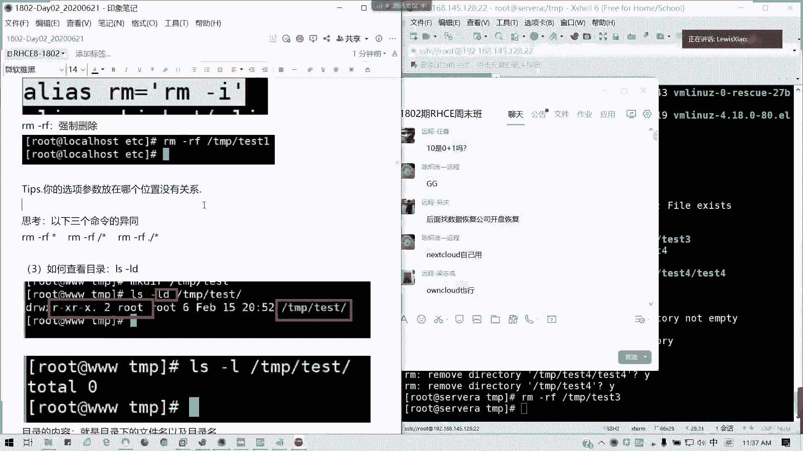

**`less`**：功能更强的分页阅读器，可以上下翻页和搜索。
```bash
less /etc/passwd
# 空格键或 Page Down：向下翻一页
# b 键或 Page Up：向上翻一页
# 上下箭头：上下翻一行
# /keyword：向下搜索关键字
# ?keyword：向上搜索关键字
# n：跳至下一个匹配项
# N：跳至上一个匹配项
# q：退出
```

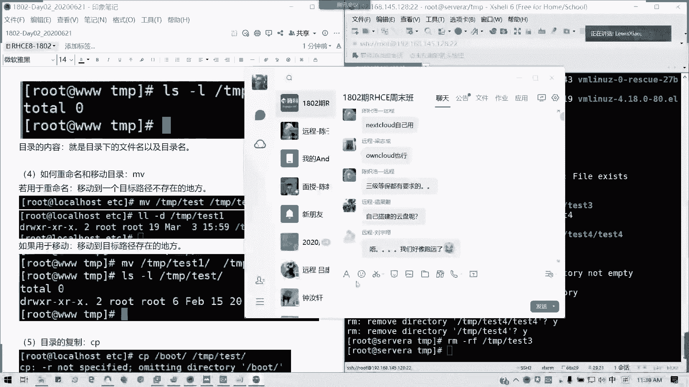

**`head`**：查看文件开头部分，默认显示10行。
```bash
head /etc/passwd
head -n 5 /etc/passwd  # 查看前5行
```

**`tail`**：查看文件末尾部分，默认显示10行。`-f` 选项常用于实时追踪日志文件的新增内容。
```bash
tail /var/log/messages
tail -n 20 /var/log/messages  # 查看最后20行
tail -f /var/log/secure       # 实时监控该日志文件的更新
# Ctrl+C 可退出监控
```

## 总结

本节课中我们一起学习了Linux命令行下管理文件和目录的核心技能。我们首先理解了绝对路径和相对路径的区别，然后掌握了使用 `pwd`、`cd`、`ls` 来查看和导航目录结构。接着，我们学习了使用 `mkdir`、`rmdir`/`rm` 来创建和删除目录，以及使用 `touch`、`cp`、`mv` 来创建、复制、移动和重命名文件。最后，我们了解了 `cat`、`more`、`less`、`head`、`tail` 等多个用于查看文件内容的命令及其适用场景。这些命令是日常Linux系统操作的基础，请务必熟练掌握。