# 拿下证书！Redhat红帽 RHCE8.0认证体系课程：P8：获取帮助


在本节课中，我们将要学习Linux系统中的软硬链接、通配符以及如何获取命令帮助。这些是日常系统管理和RHCE认证考试中必备的基础技能。

## 软硬链接详解 🔗

上一节我们介绍了文件管理，本节中我们来看看如何创建文件的链接。链接分为软链接和硬链接，它们类似于Windows中的快捷方式，但原理不同。

**软链接**完全等同于Windows的快捷方式。它是一个独立的文件，仅包含指向目标文件的路径。如果目标文件被删除，软链接将失效。

**硬链接**则是为同一个文件数据块创建另一个访问入口。两个文件名指向同一个`inode`（索引节点）。只要数据块未被完全删除（即所有硬链接未被删除），文件内容就依然存在。

以下是创建链接的命令：
```bash
# 创建软链接
ln -s /path/to/target /path/to/link_name

# 创建硬链接
ln /path/to/target /path/to/link_name
```

### 链接特性对比

以下是软链接和硬链接的核心特性对比：

*   **指向对象**：软链接指向文件名；硬链接指向`inode`。
*   **跨分区/文件系统**：软链接可以；硬链接不可以。
*   **针对目录**：软链接可以；硬链接不可以。
*   **原文件删除后**：软链接失效；硬链接依然有效（除非所有硬链接都被删除）。

### 文件访问原理

理解链接有助于理解Linux文件系统访问原理。系统通过`inode`查找文件的属性和数据块位置。硬链接直接共享同一个`inode`；软链接则是一个独立的文件，其内容存储着目标文件的路径，访问时需要二次解析。

## 通配符使用技巧 ✨

通配符可以帮助我们通过模糊匹配的方式，更高效地查找和操作文件与目录。

以下是常用的通配符及其含义：

*   `*`：匹配任意长度（包括零个）的任意字符。
    *   示例：`ls *.txt` 列出所有`.txt`文件。
*   `?`：匹配任意单个字符。
    *   示例：`ls file?.txt` 匹配`file1.txt`, `fileA.txt`等。
*   `[ ]`：匹配括号内任意一个字符。
    *   示例：`ls file[0-9].txt` 匹配`file0.txt`到`file9.txt`。
*   `[! ]` 或 `[^ ]`：匹配不在括号内的任意一个字符。
    *   示例：`ls file[!0-9].txt` 匹配不以数字结尾的`file?.txt`。
*   `{ }`：扩展匹配，匹配括号内用逗号分隔的任意一个模式。
    *   示例：`ls file{1,2,3}.txt` 等价于 `ls file1.txt file2.txt file3.txt`。

## 如何获取命令帮助 📖

在Linux系统中，当你忘记命令用法时，有多种方式可以快速获取帮助。RHCE考试环境允许使用这些帮助工具。

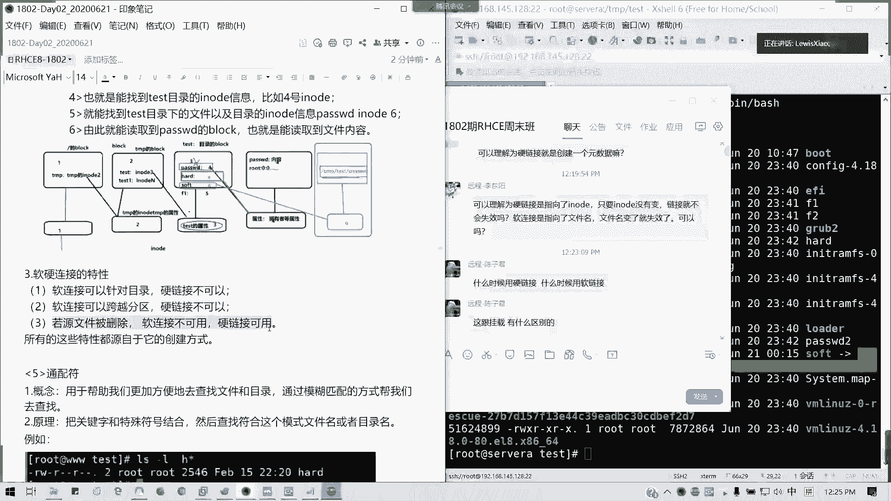

### 使用 `--help` 选项

大多数命令都支持`--help`或`-h`选项，可以输出简洁的使用说明。

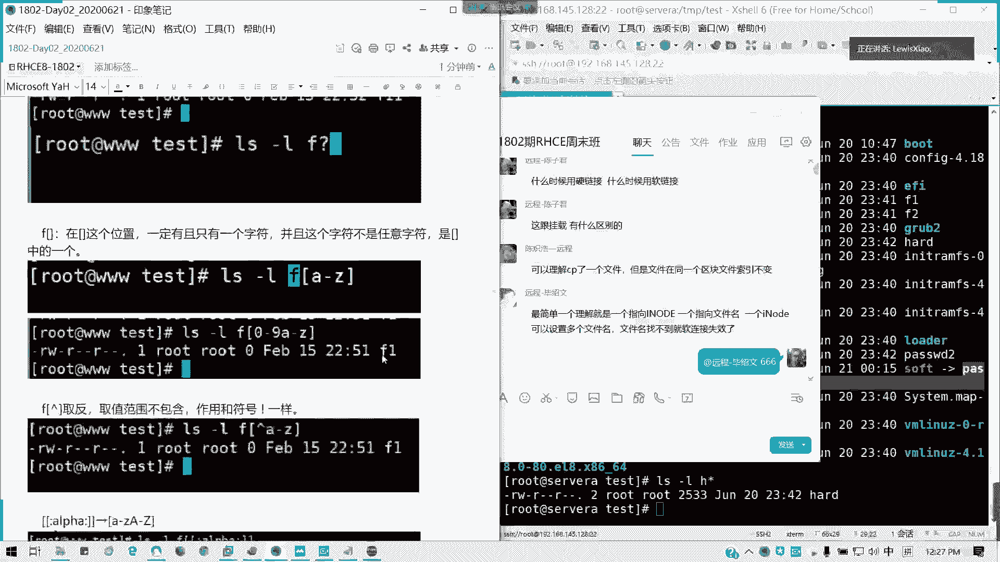

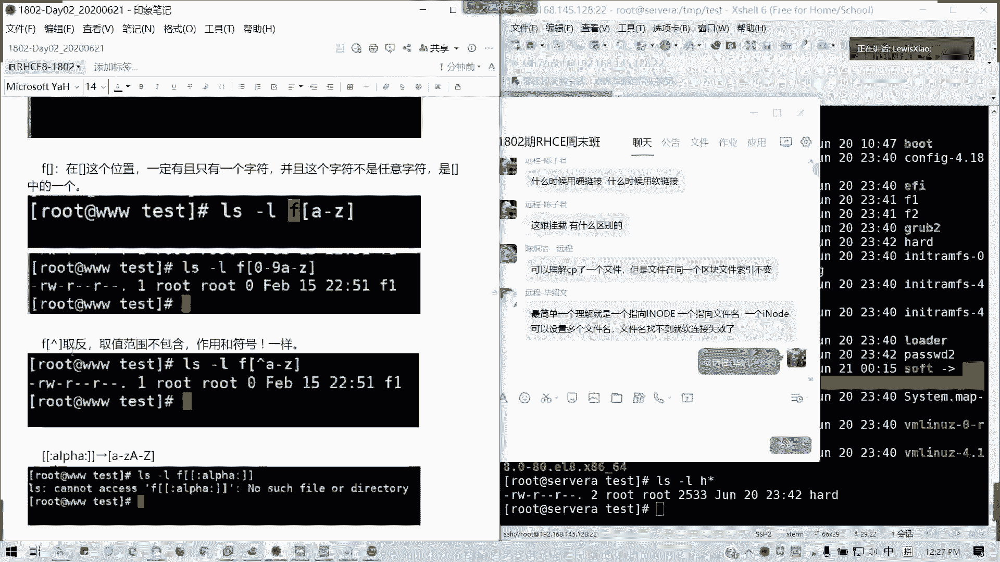

```bash
ls --help
```

### 使用 `man` 手册

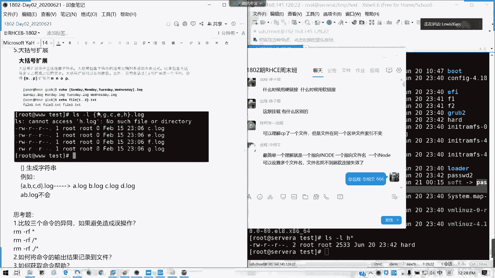

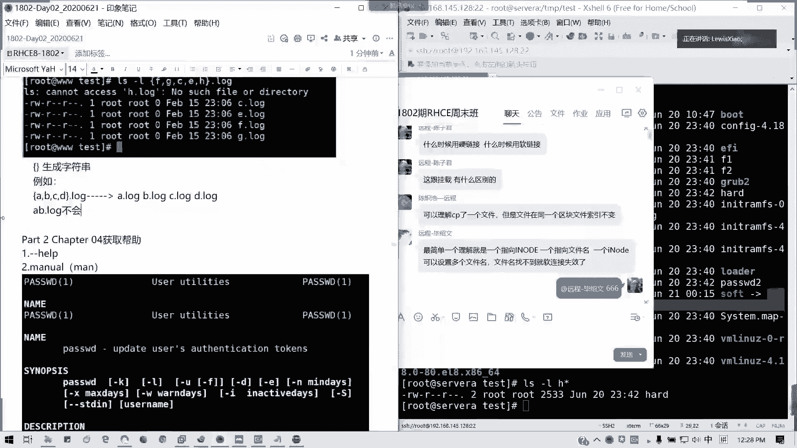

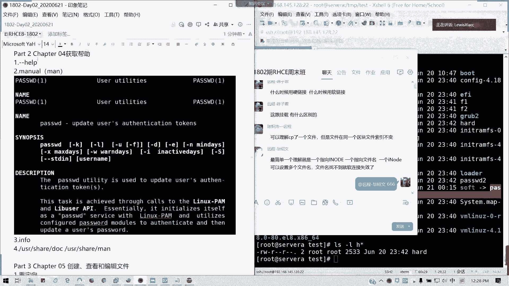

`man`（manual）手册是Linux最全面的帮助文档。口诀是“男人就要man一下”。

```bash
# 查看命令的完整手册
man ls

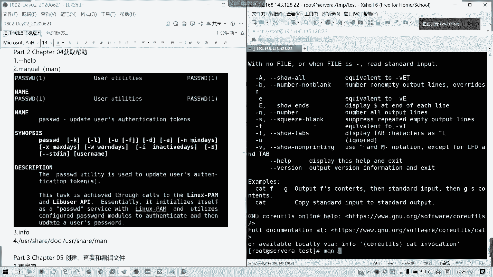

# 在手册中搜索关键词
man -k password
```
`man`手册分为多个章节，常用的是：
*   **第1章**：用户命令。
*   **第5章**：配置文件格式。

### 其他帮助途径

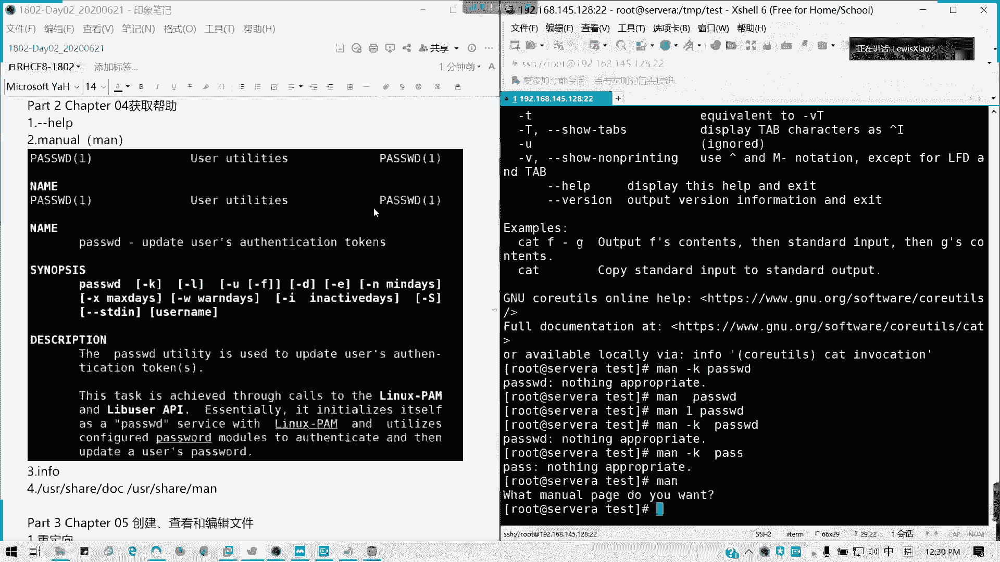

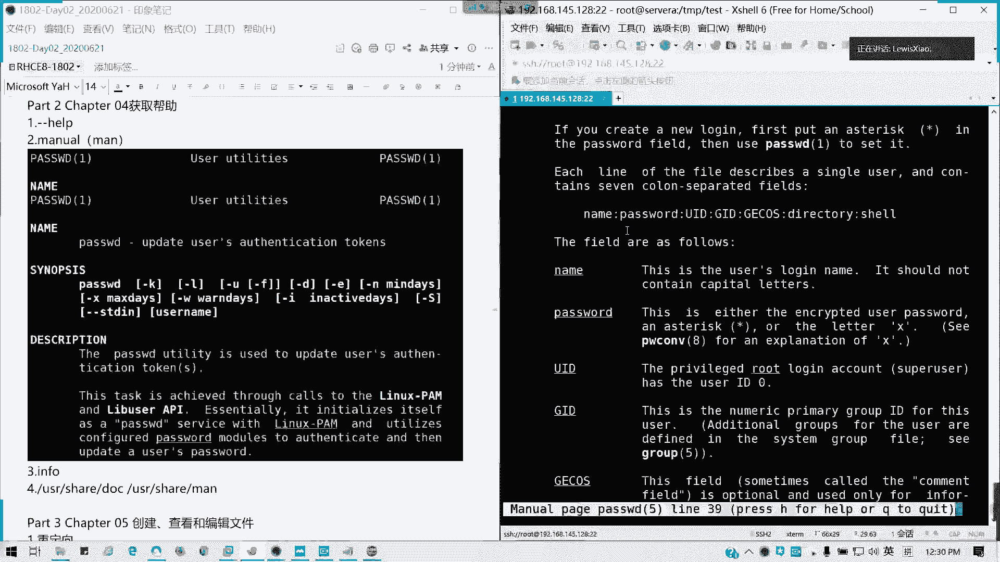

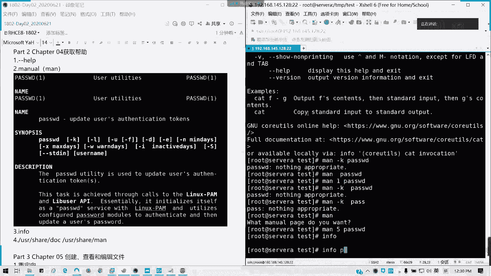

*   `info`命令：另一种格式的文档查看器，通常是`man`手册的更详细版本。
    ```bash
    info ls
    ```
*   **文档目录**：系统的官方文档存放在以下目录，可供查阅：
    *   `/usr/share/doc`：包含软件包的具体文档。
    *   `/usr/share/man`：`man`手册页的存储位置。

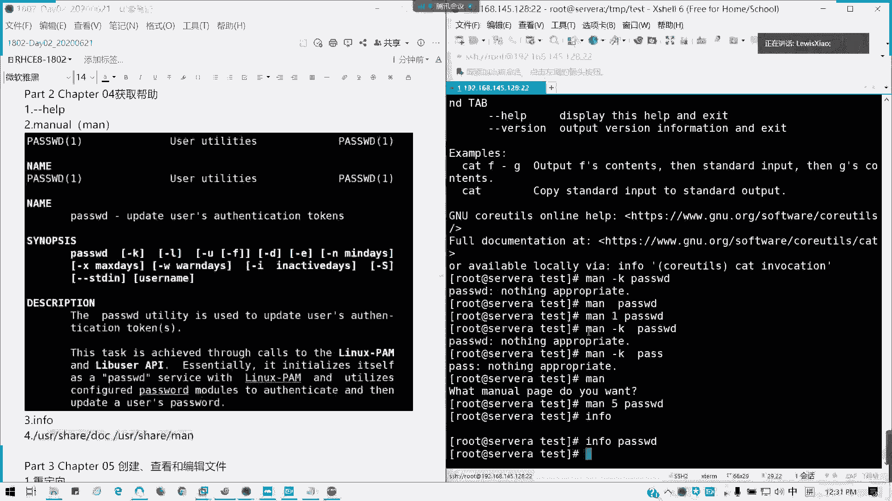

---

本节课中我们一起学习了Linux的软硬链接概念与创建方法，掌握了使用通配符进行文件模糊匹配的技巧，并了解了在命令行中获取帮助的多种途径（`--help`、`man`、`info`）。这些是高效使用和管理Linux系统的基础，请务必熟练掌握。