# Linux运维RHCSA+RHC培训教程：P15：用户管理、用户信息文件详解 👤

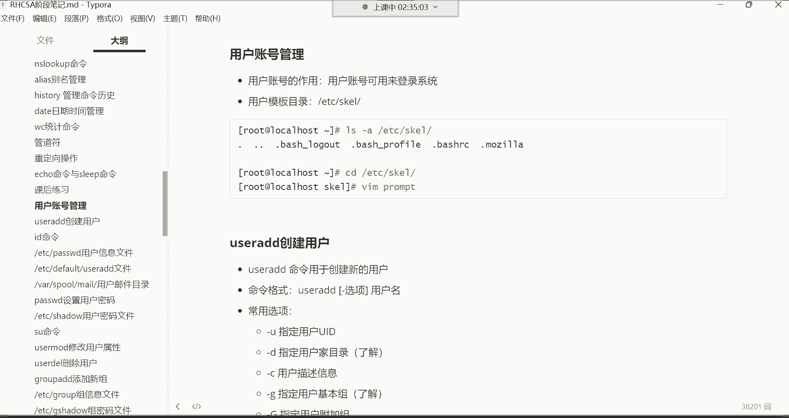

在本节课中，我们将要学习Linux系统中的用户管理，特别是用户账号的创建以及核心配置文件 `/etc/passwd` 的详细解读。理解这些内容是进行系统管理和权限控制的基础。

## 用户账号概述

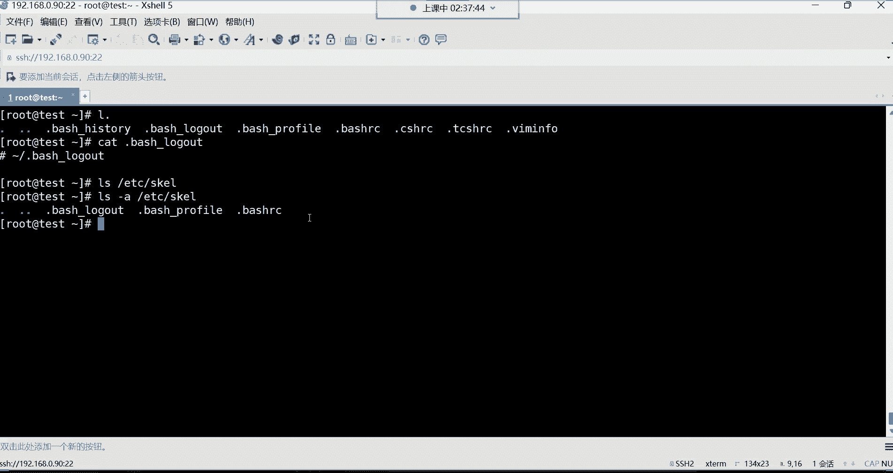

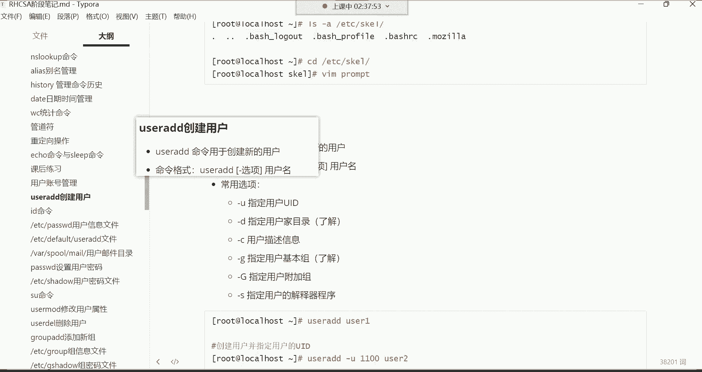

用户账号是登录和使用Linux系统的基础。系统中有两类主要用户：超级管理员 `root` 和普通用户。`root` 用户拥有最高权限，而普通用户由管理员创建，权限受到限制。在企业环境中，`root` 权限通常只授予核心运维人员，普通员工则使用权限较小的普通用户账号，以保障系统安全。

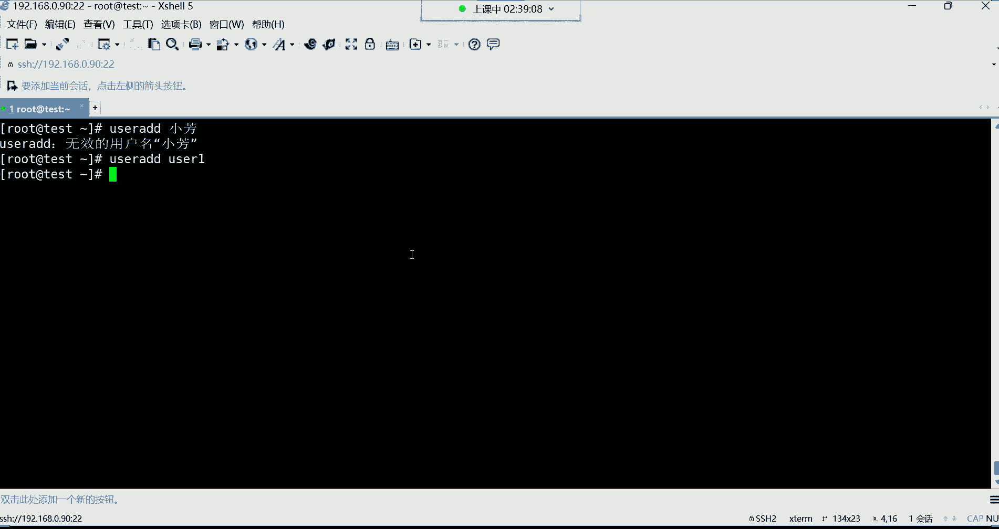

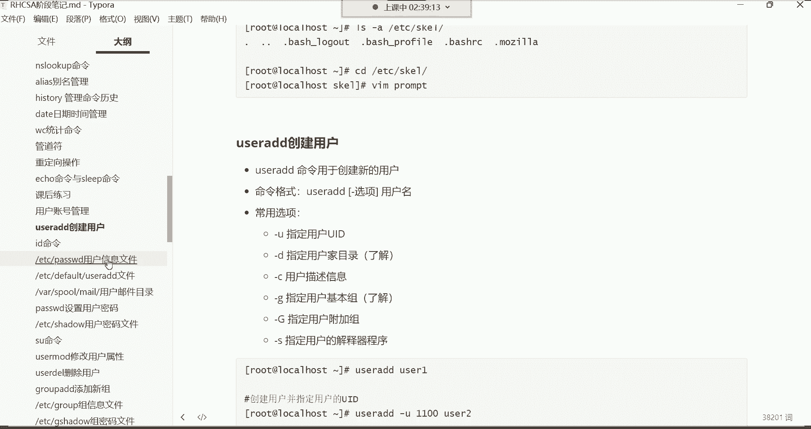

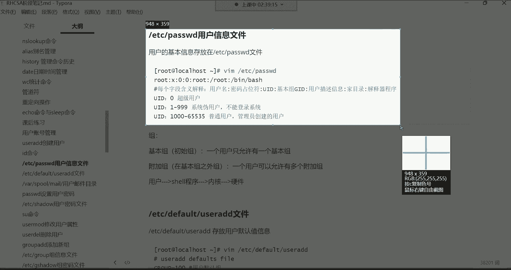

## 用户模板目录

在深入了解用户创建之前，我们先简单了解一个概念：用户模板目录 `/etc/skel`。这个目录包含了创建新用户时，会自动复制到其家目录下的默认配置文件（如 `.bashrc`、`.bash_profile`）。这些文件为用户提供了初始的Shell环境配置，例如命令别名和历史记录设置。了解其存在即可，日常使用中无需深入修改。

## 创建用户命令：`useradd`

创建新用户的命令是 `useradd`，该命令只有 `root` 用户有权执行。其基本语法非常简单：

```bash
useradd [选项] 用户名
```

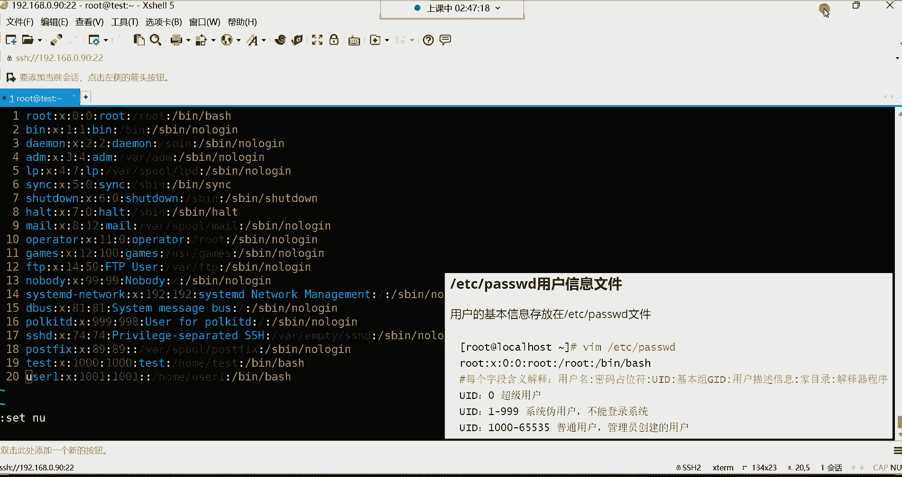

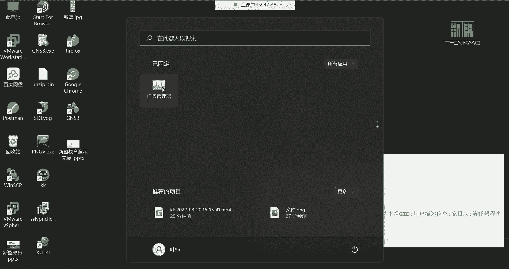

例如，创建一个名为 `user1` 的用户：

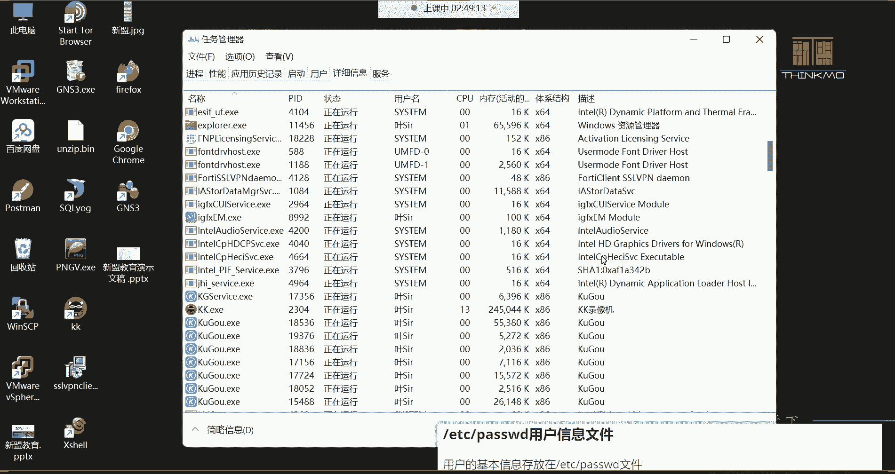

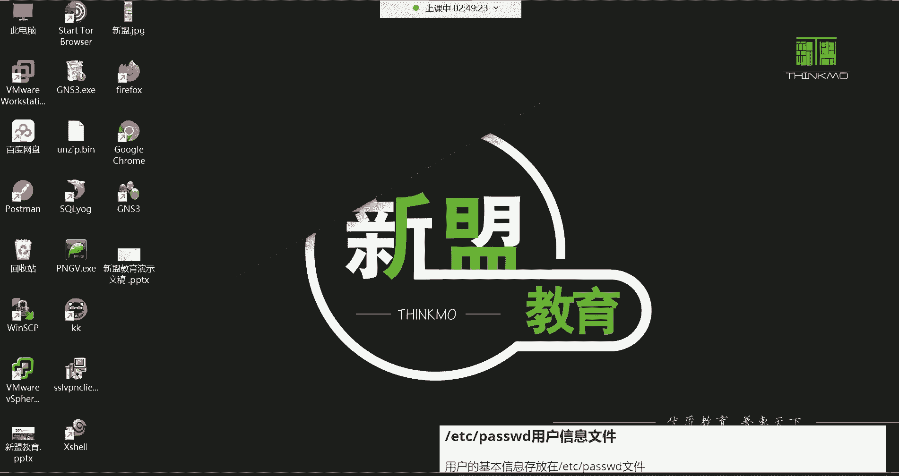

```bash
useradd user1
```

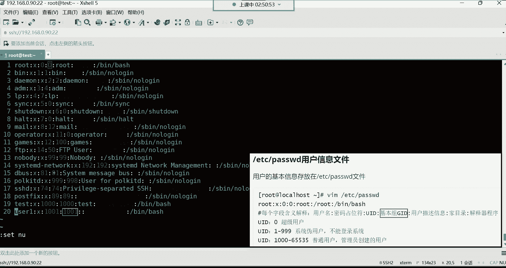

执行后，用户 `user1` 的信息就被记录在系统中。但此时该用户尚未设置密码，还无法用于登录。接下来，我们需要了解用户信息存储在哪里。

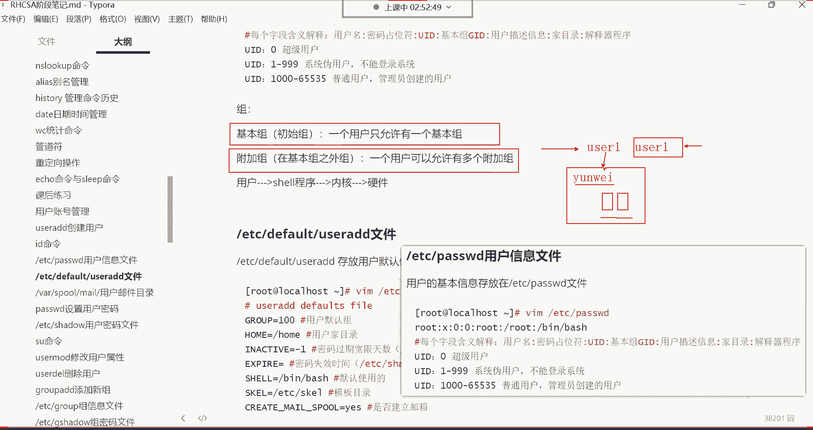

## 用户信息文件：`/etc/passwd` 详解

用户创建后，其基本信息存储在 `/etc/passwd` 文件中。这个文件是系统用户管理的核心，每一行代表一个用户账号，每行内容以冒号 `:` 分隔为7个字段。

以下是查看该文件的命令：

```bash
cat /etc/passwd
```

为了更好地理解，我们可以打开行号显示：

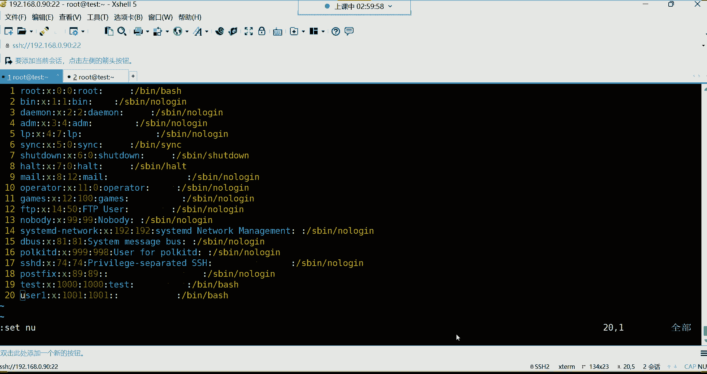

```bash
cat -n /etc/passwd
```

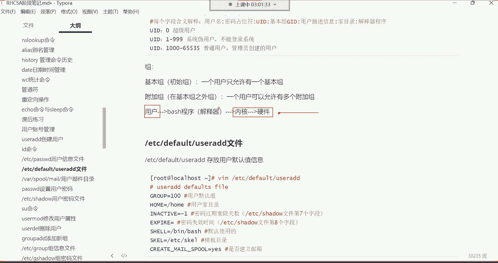

文件内容看似复杂，但遵循严格的格式。每一行的7个字段含义如下：

1.  **用户名**：用户登录时使用的名称。
2.  **密码占位符**：历史上这里存放加密密码，现在密码已移至 `/etc/shadow` 文件，此处统一用 `x` 表示。
3.  **用户ID (UID)**：用户的唯一数字标识符。
    *   **UID 0**：超级管理员（`root`）。
    *   **UID 1-999**：系统伪用户，供系统进程使用，不能登录系统。
    *   **UID 1000-65535**：普通用户，由管理员创建。
4.  **基本组ID (GID)**：用户所属初始组的数字ID。通常与UID相同。
5.  **描述信息 (GECOS)**：用户的备注信息，如全名、电话等，可为空。
6.  **家目录**：用户登录后的初始工作目录。
7.  **登录Shell**：用户登录后使用的命令解释器。默认为 `/bin/bash`。如果设置为 `/sbin/nologin`，则该用户无法登录系统。

**核心概念**：用户的超级管理员身份并非由用户名 `root` 决定，而是由其 **UID** 是否为 **0** 决定。如果将普通用户的UID改为0，该用户也将获得超级管理员权限。

## `useradd` 命令常用选项

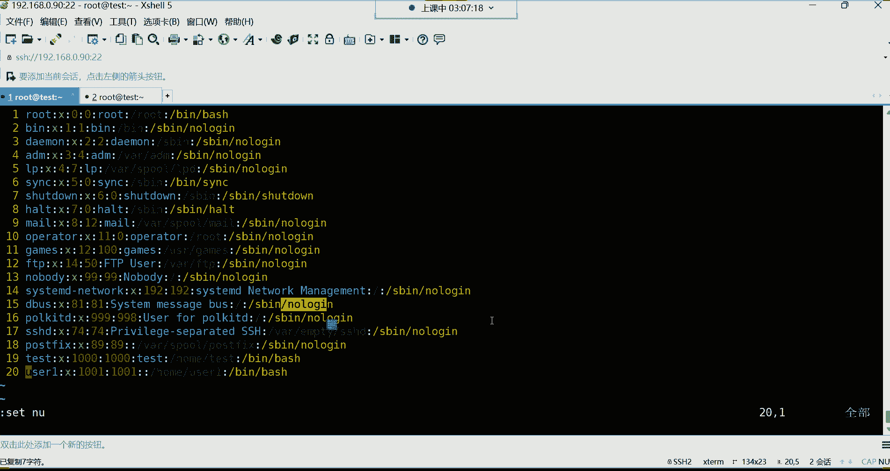

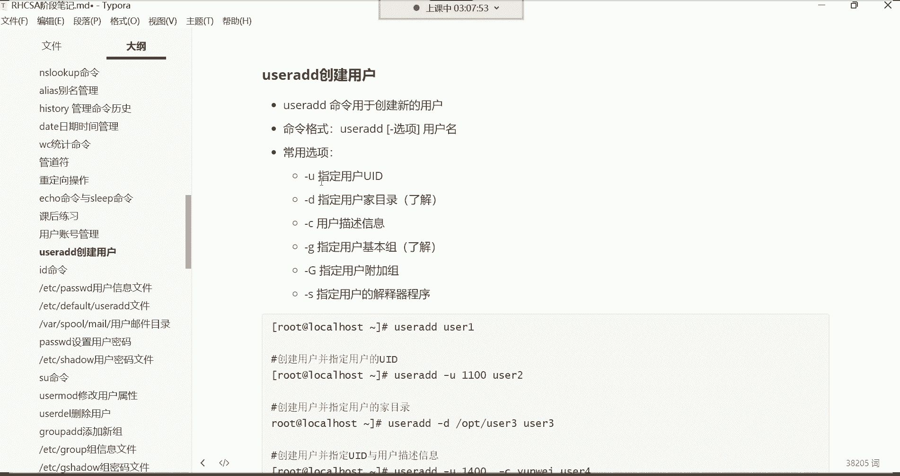

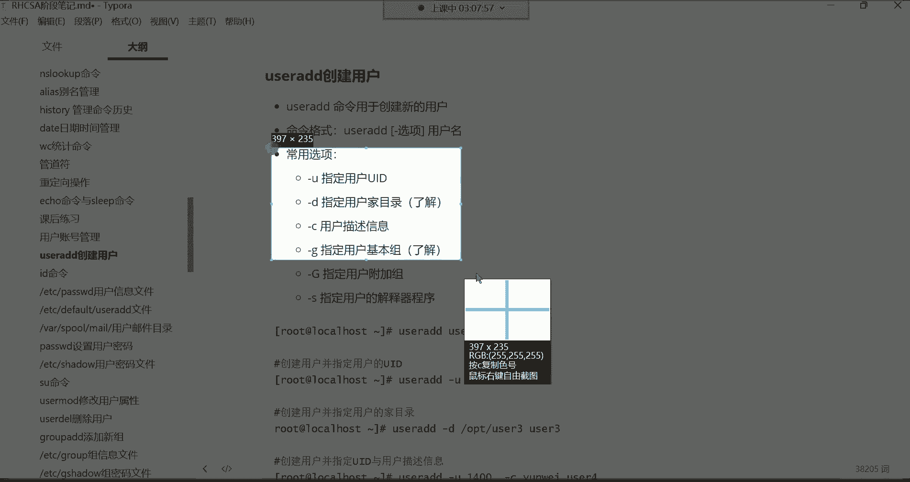

上一节我们介绍了用户信息文件的结构，本节中我们来看看如何使用 `useradd` 命令的选项来定制化创建用户。

`useradd` 命令支持多个选项，用于指定用户的各类属性。以下是一些常用选项：

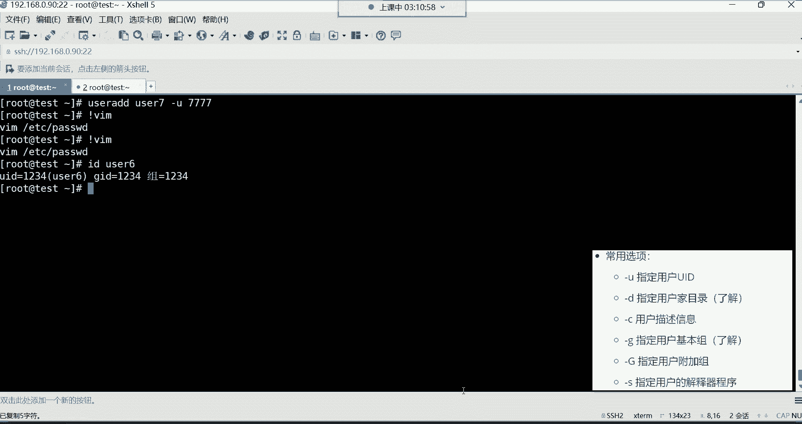

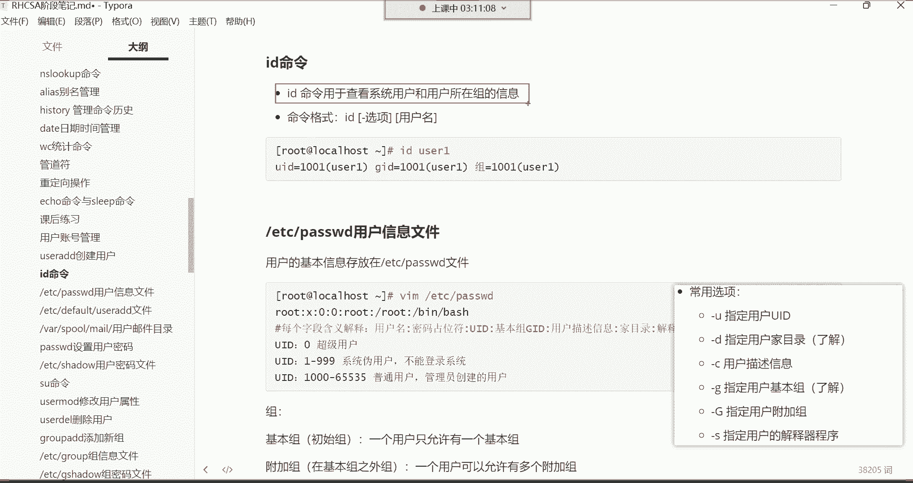

*   **`-u UID`**：指定用户的UID。
    ```bash
    useradd -u 6666 user6
    ```
*   **`-d 目录`**：指定用户的家目录。
    ```bash
    useradd -d /user3 user3
    ```
*   **`-c “备注”`**：添加用户的描述信息。
    ```bash
    useradd -c “运维部, tel:123456” user2
    ```
*   **`-G 组名1,组名2,...`**：指定用户的附加组（用户可属于多个组）。
    ```bash
    useradd -G dev,test user5
    ```
*   **`-s Shell路径`**：指定用户的登录Shell。
    ```bash
    useradd -s /sbin/nologin user8 # 创建不能登录的用户
    ```

这些选项可以组合使用，没有严格的顺序要求。例如：

```bash
useradd -u 2345 -c “开发工程师” -G ops,dev -s /bin/sh user100
```

## 查看用户和组信息：`id` 命令

创建用户后，可以使用 `id` 命令查看用户的UID、GID以及所属的所有组。

```bash
id 用户名
```

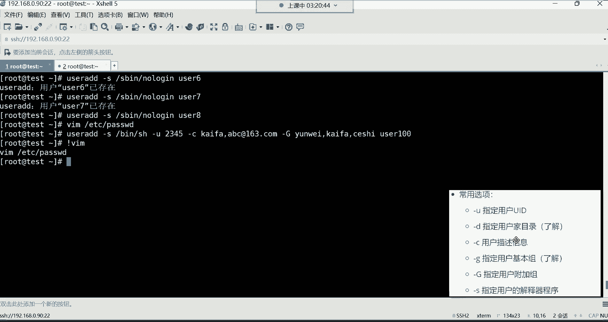

例如：
```bash
id user5
```
输出会显示用户 `user5` 的UID、基本组GID以及所属的附加组列表。

---

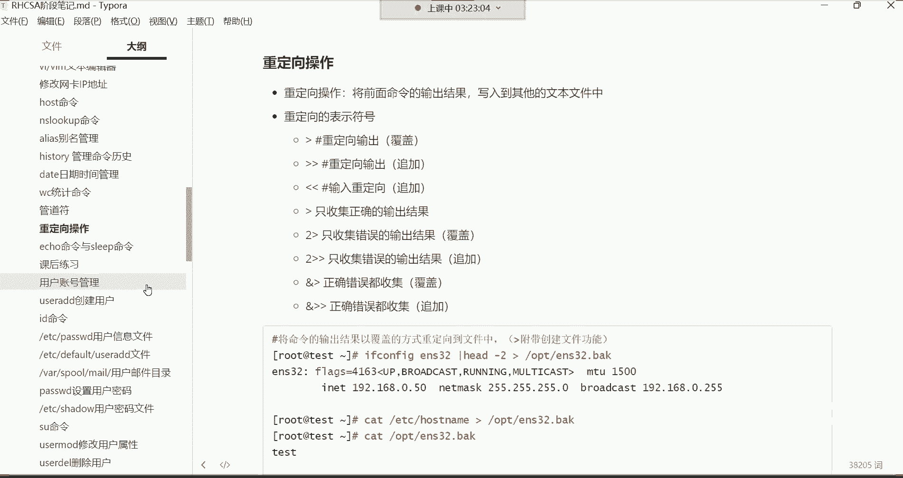

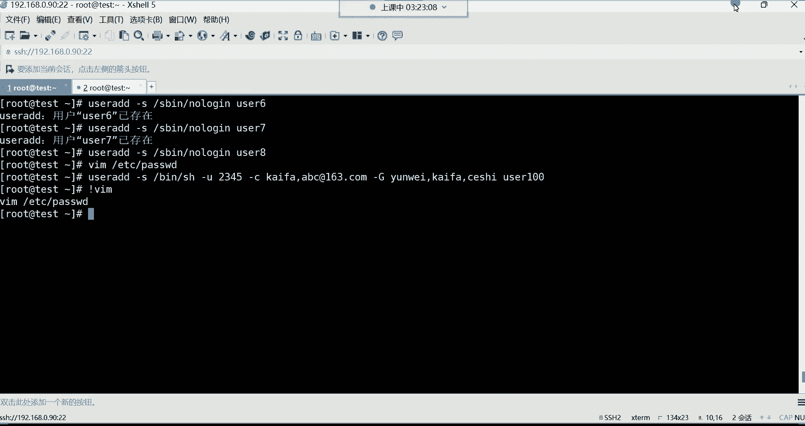

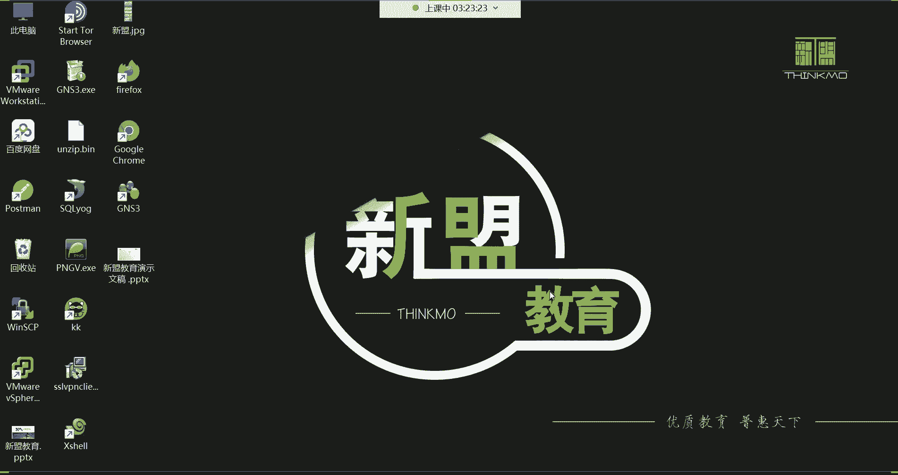

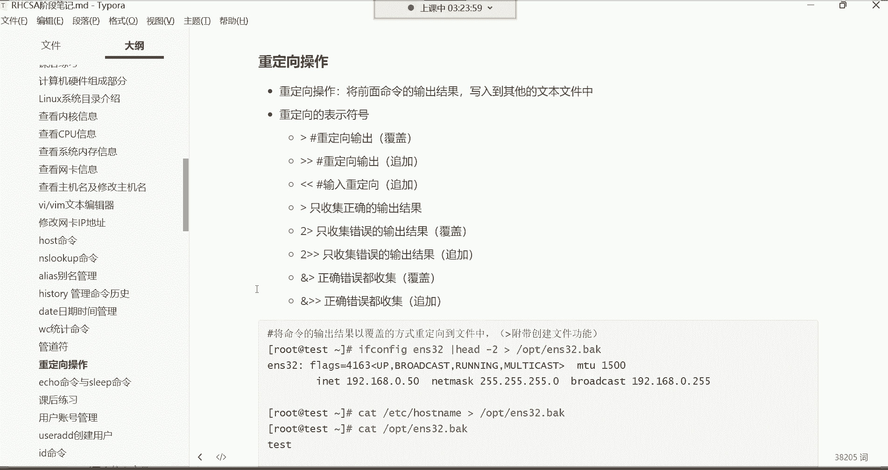

本节课中我们一起学习了Linux用户管理的基础知识。我们了解了用户账号的分类、用户信息文件 `/etc/passwd` 的详细结构（共7个字段），掌握了使用 `useradd` 命令及其常用选项创建和定制用户的方法，并学会了使用 `id` 命令查看用户信息。理解用户和组是后续学习文件权限和系统安全管理的重要基石。