# Linux运维RHCSA+RHCE培训教程：P18：红帽RHCSA-18.chmod权限管理 🔐

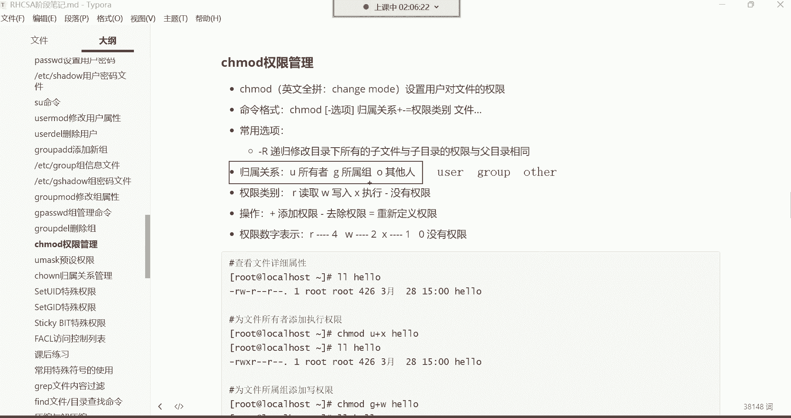

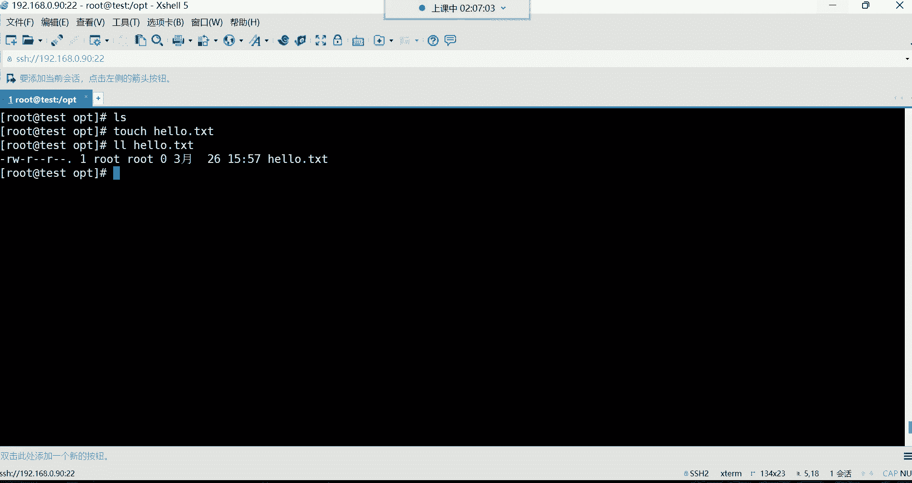

## 概述
在本节课中，我们将要学习Linux系统中至关重要的权限管理。权限是Linux安全体系的核心，它严格规定了系统中的用户可以对哪些文件进行哪些操作。我们将从理解文件归属关系开始，逐步学习如何查看、设置和修改文件与目录的权限，并最终理解权限如何与之前学习的用户和组管理相结合，实现对系统资源的精细化控制。

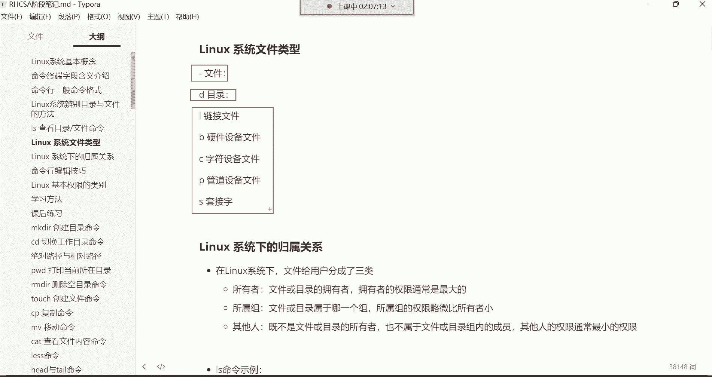

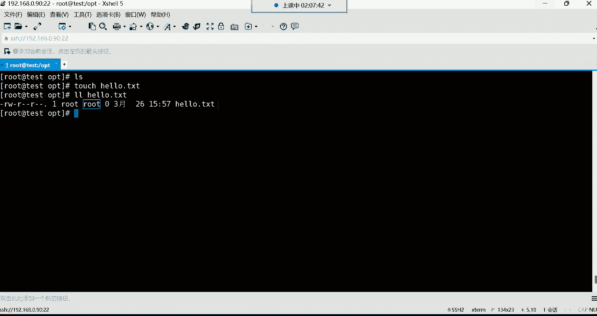

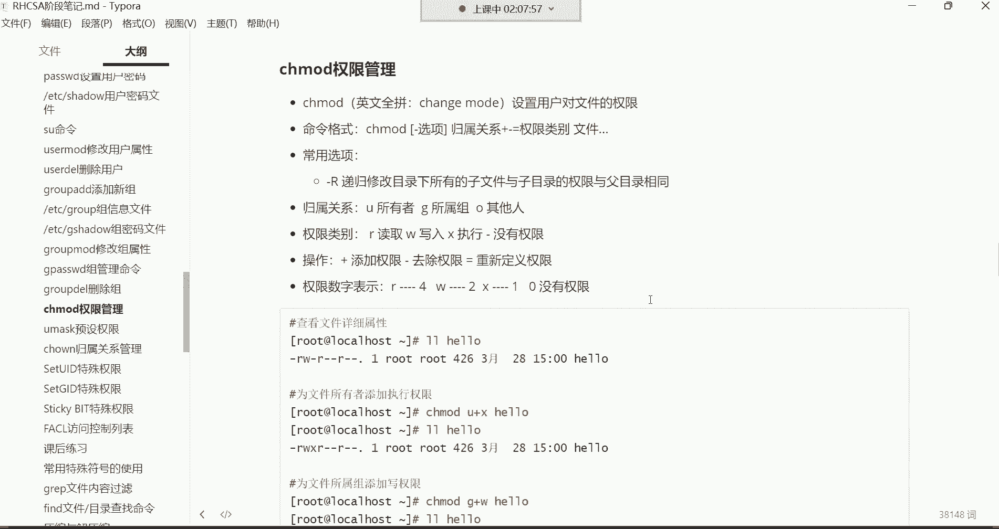

---

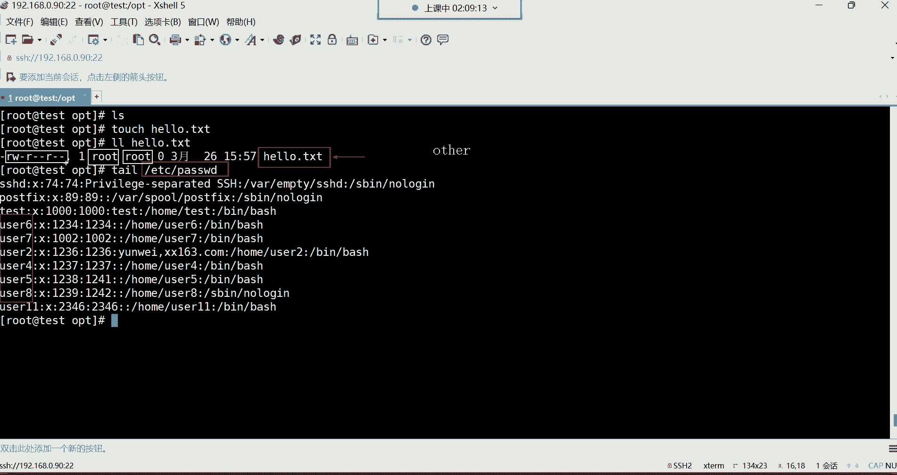

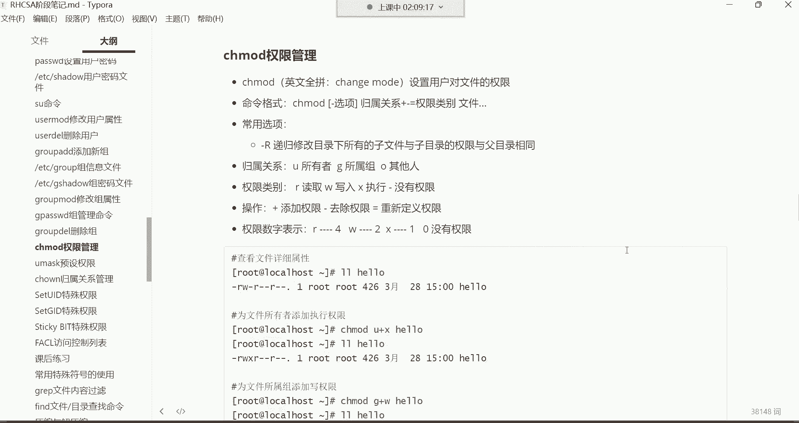

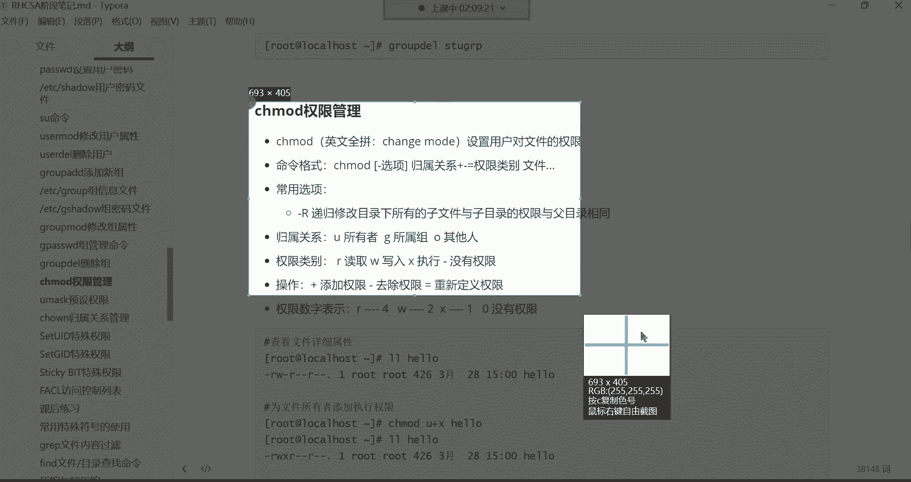

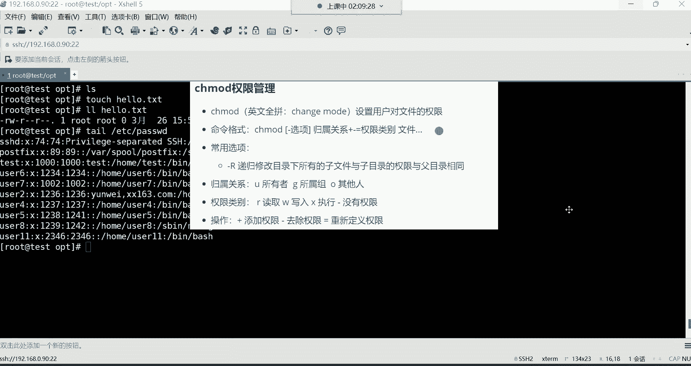

## 归属关系复习
上一节我们介绍了用户和组的管理，本节中我们来看看权限如何与它们关联。首先，我们需要理解文件的归属关系。

任何文件或目录都有三类归属关系：
*   **所有者 (User, U)**：文件的创建者，通常是文件的拥有者。
*   **所有组 (Group, G)**：文件所属的用户组。
*   **其他人 (Other, O)**：既不是文件所有者，也不在文件所属组内的其他所有用户。

我们可以使用 `ls -l` 命令查看文件的归属关系和权限。例如，在 `/opt` 目录下创建一个文件：
```bash
cd /opt
touch hello.txt
ls -l hello.txt
```
输出可能类似于：
```
-rw-r--r--. 1 root root 0 Apr 10 10:00 hello.txt
```
*   第一个字符 `-` 表示这是一个普通文件。
*   接下来的 `rw-`、`r--`、`r--` 是权限位，我们稍后详解。
*   第一个 `root` 是文件的所有者。
*   第二个 `root` 是文件的所有组。

对于这个文件，`root` 用户是所有者，`root` 组是所有组。系统内的其他用户（如 `user6`）既不是所有者，也不在 `root` 组内，因此他们被归类为“其他人”。

---

## 基本权限详解
理解了归属关系后，我们来看看如何解读和设置具体的权限。

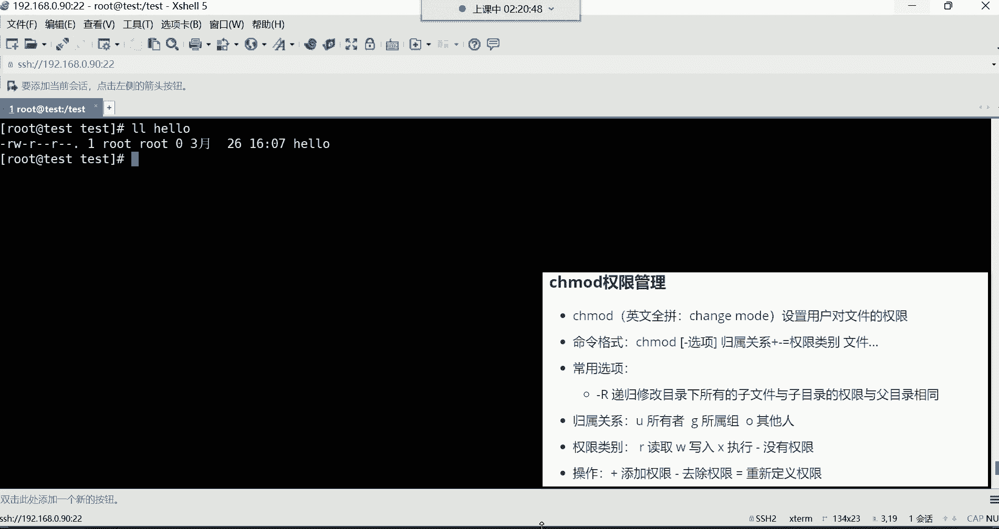

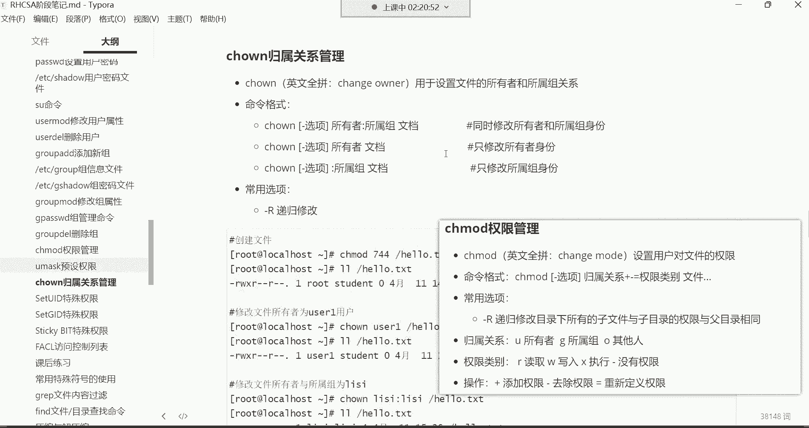

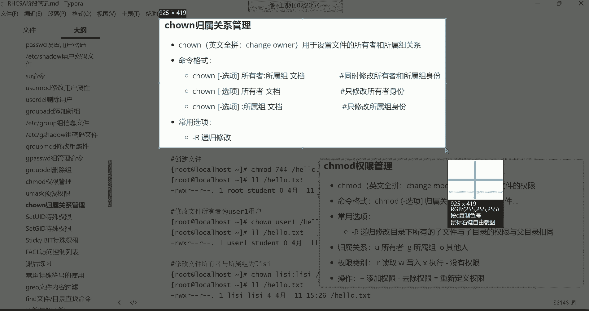

### 权限类别与表示
基本权限分为三类：
*   **读 (Read, r)**：可以查看文件内容。
*   **写 (Write, w)**：可以修改、删除文件内容。
*   **执行 (Execute, x)**：可以运行该文件（如果是可执行程序或脚本）。

权限位由9个字符组成，分为三组，每组三个字符，顺序固定为 `rwx`。
*   第一组（第1-3位）：**所有者 (U)** 的权限。
*   第二组（第4-6位）：**所有组 (G)** 的权限。
*   第三组（第7-9位）：**其他人 (O)** 的权限。

如果某个权限被赋予，则显示对应的字母（`r`, `w`, `x`）；如果没有，则用短横线 `-` 表示。

以 `-rw-r--r--` 为例：
*   所有者 (`root`) 权限：`rw-`，即可读、可写，但**不可执行**。
*   所有组 (`root`组) 权限：`r--`，即**只读**。
*   其他人权限：`r--`，即**只读**。

### 权限验证实验
为了更直观地理解，我们创建一个实验环境。**注意：使用 `root` 用户验证权限效果不明显，因为 `root` 是超级用户，通常不受权限限制。** 我们将使用普通用户进行验证。

1.  **创建测试环境**：
    ```bash
    mkdir /test
    cd /test
    touch hello.sh
    ```
2.  **创建组和用户**：
    ```bash
    groupadd ops # 创建一个名为ops的组（运维组）
    useradd tom
    passwd tom # 为tom用户设置密码，例如‘1’
    gpasswd -a tom ops # 将tom用户加入ops组
    ```
3.  **修改文件归属**：
    ```bash
    chown :ops hello.sh # 将hello.sh文件的所有组改为ops组
    ls -l hello.sh
    ```
    现在，文件 `hello.sh` 的所有者是 `root`，所有组是 `ops`。`tom` 用户在 `ops` 组内，因此他对该文件的权限继承自“所有组”的权限位。

---

## 修改权限：chmod命令
我们可以使用 `chmod` 命令来修改文件或目录的权限。主要有两种表示法：字母表示法和数字表示法。

### 字母表示法
语法格式：`chmod [ugoa][+-=][rwx] 文件/目录`
*   `[ugoa]`：指定权限作用对象。
    *   `u`：所有者 (User)
    *   `g`：所有组 (Group)
    *   `o`：其他人 (Other)
    *   `a`：所有人 (All)，是 `ugo` 的简写
*   `[+-=]`：指定操作。
    *   `+`：添加权限
    *   `-`：移除权限
    *   `=`：精确设置权限（覆盖原有）
*   `[rwx]`：权限类型。

以下是具体操作示例：
*   为所有者添加执行权限：`chmod u+x hello.sh`
*   为所有组添加写和执行权限：`chmod g+wx hello.sh`
*   移除其他人的读权限：`chmod o-r hello.sh`
*   使用逗号分隔，同时为多类对象设置权限：
    ```bash
    chmod u=rwx,g=rx,o= hello.sh
    ```
    这条命令将所有者权限设为 `rwx`，所有组权限设为 `r-x`，其他人权限设为 `---`（无任何权限）。

### 数字表示法（八进制）
每个权限类别可以用一个数字表示：
*   `r` (读) = **4**
*   `w` (写) = **2**
*   `x` (执行) = **1**
*   `-` (无) = **0**

将同一归属关系（U/G/O）的权限数字相加，即可得到该组的权限值。最终用三个数字（分别代表U、G、O）来设置权限。

例如，权限 `rwxr-xr--` 对应的数字计算如下：
*   所有者 `u`：`rwx` = 4+2+1 = **7**
*   所有组 `g`：`r-x` = 4+0+1 = **5**
*   其他人 `o`：`r--` = 4+0+0 = **4**
*   因此，对应的数字权限是 **754**。

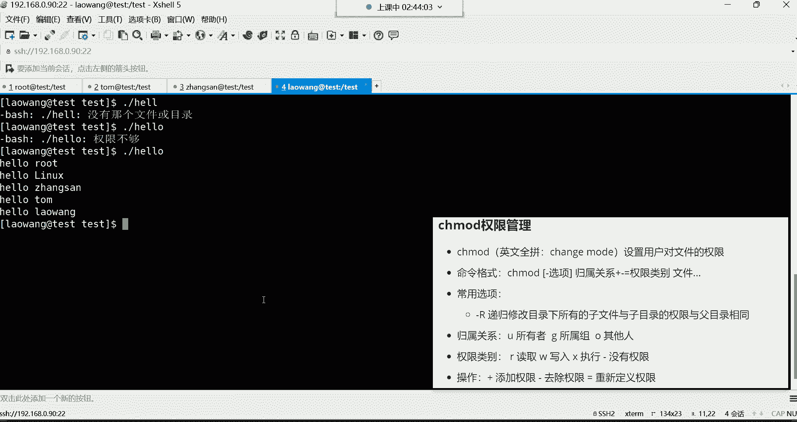

设置权限时，直接使用数字即可：
```bash
chmod 754 hello.sh
```
**注意**：使用数字表示法时，必须提供完整的三个数字，不能省略。例如 `chmod 6 file` 会被系统理解为 `chmod 006 file`，导致所有者和所有组权限被清空。

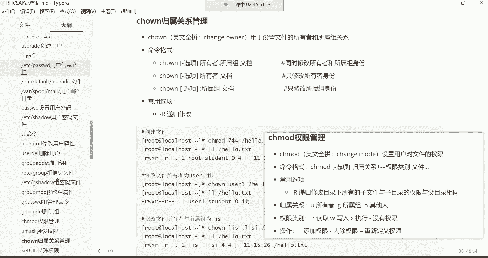

---

## 文件与目录权限的区别 🗂️ vs 📄
这是权限学习中的一个关键点。`rwx` 对文件和目录的含义有根本性不同。

### 文件权限 (`rwx`)
针对的是**文件内容本身**。
*   `r`：可以读取文件内容（如 `cat`, `less`）。
*   `w`：可以修改文件内容（如 `vim`, `echo >>`）。**注意**：这通常不包含删除文件本身的权限。
*   `x`：可以将文件作为命令或脚本执行（如 `./script.sh`）。

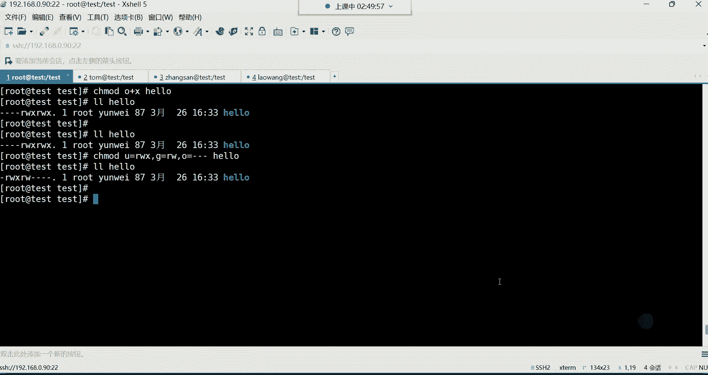

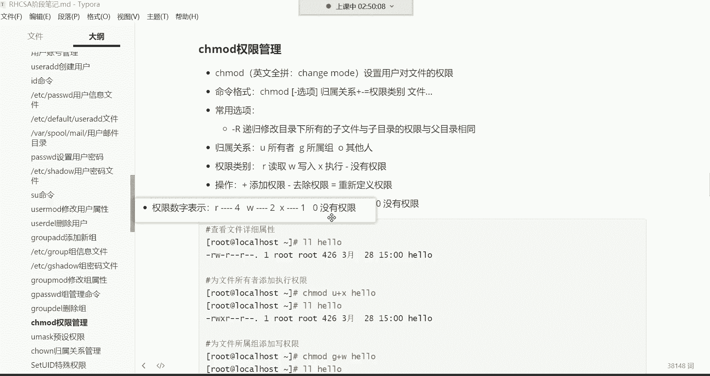

### 目录权限 (`rwx`)
针对的是**目录条目（即目录下的文件名列表）**。
*   `r`：可以列出目录下的内容（如 `ls` 目录名）。没有 `r` 权限，即使知道文件名也无法通过 `ls` 看到。
*   `w`：可以在目录内**创建、删除、重命名**文件或子目录。**这是删除文件的关键**！用户即使对文件本身没有 `w` 权限，只要对其父目录有 `w` 权限，就可以删除该文件。
*   `x`：可以进入或穿越该目录（如 `cd` 目录名）。这是访问目录及其下文件/子目录的**基础权限**。没有 `x` 权限，即使有 `r` 权限也无法 `ls` 目录内容，更无法访问目录下的文件。

### 关键实验
1.  用户对文件有 `rwx` 权限，但对文件所在目录**没有 `w` 权限**，则他**不能删除**该文件。
2.  用户对文件**只有 `r` 权限**，但对文件所在目录**有 `w` 权限**，则他**可以删除**该文件。
3.  用户对目录**有 `x` 无 `r`**，他可以 `cd` 进入目录，但无法 `ls` 查看内容。不过，如果他**知道目录内某个文件的完整路径**，仍然可以访问它（例如 `cat /test/known_file.txt`）。

这解释了为什么普通用户通常不能在 `/etc`、`/bin` 等系统目录下随意创建或删除文件——因为他们对这些目录没有 `w` 权限。

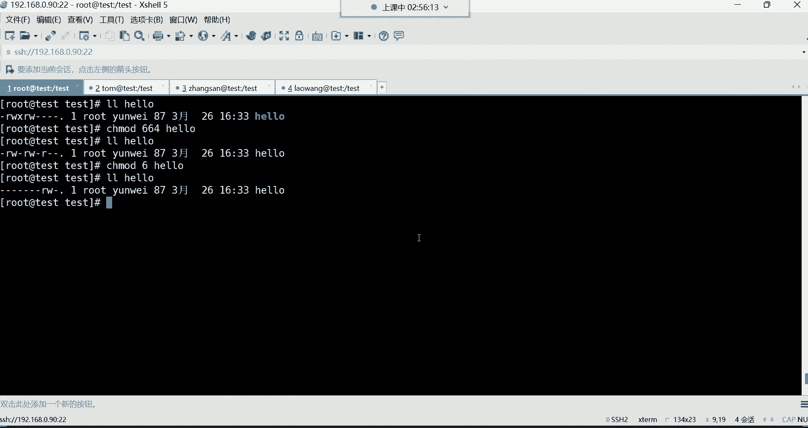

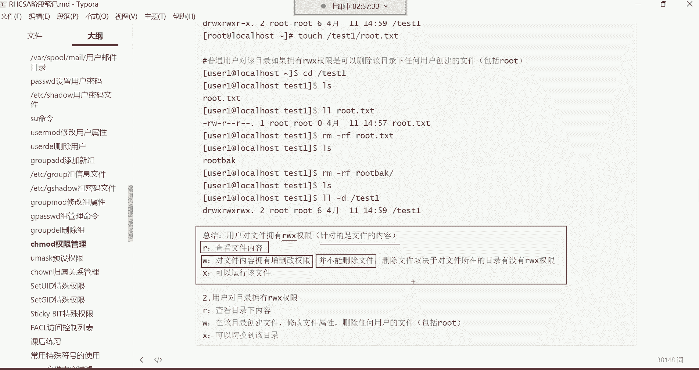

---

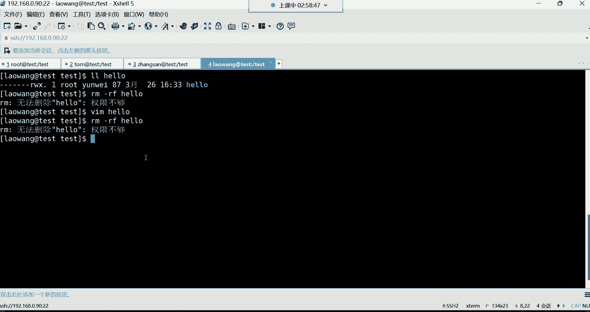

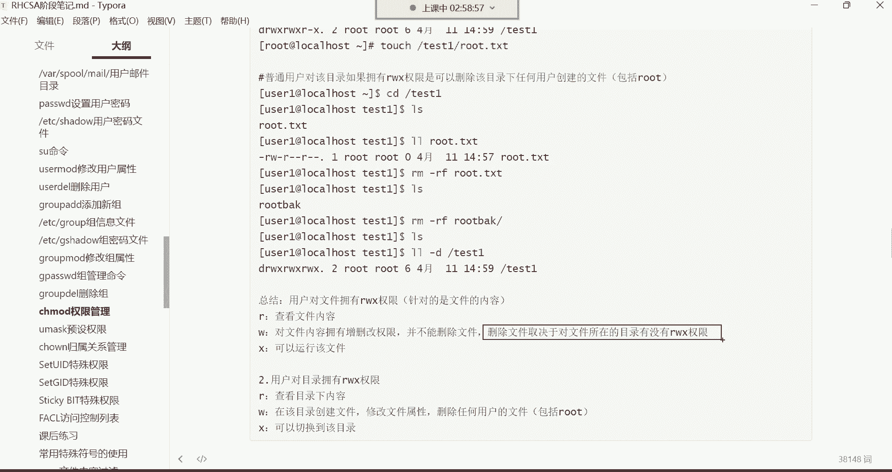

## 修改归属：chown命令
除了权限，我们还可以修改文件的所有者和所有组。这通常需要 `root` 权限。
命令格式：`chown [选项] 所有者[:所有组] 文件/目录`
常用选项 `-R`：递归处理，用于目录，会修改目录内所有子项。

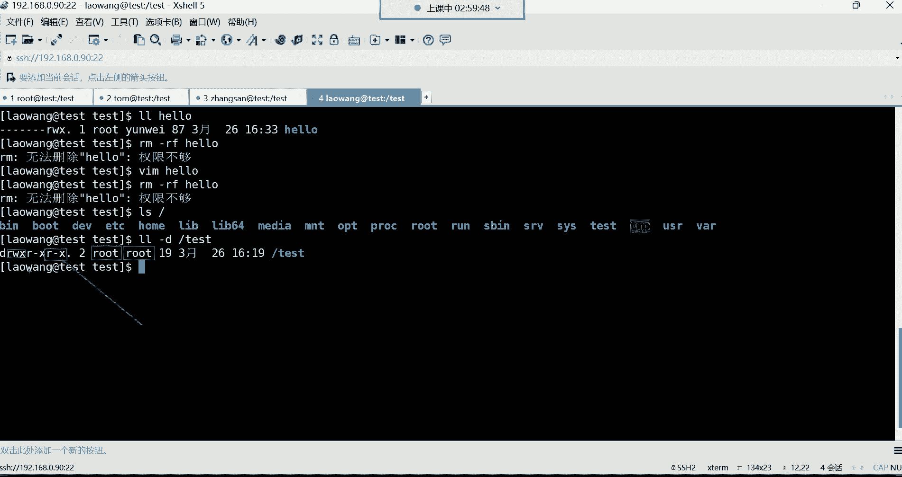

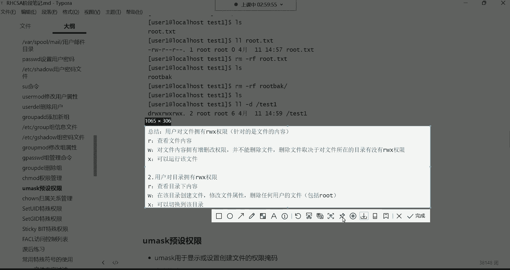

示例：
```bash
chown tom hello.sh          # 仅修改所有者为tom
chown :ops hello.sh         # 仅修改所有组为ops
chown tom:ops hello.sh      # 同时修改所有者和所有组
chown -R tom:ops /project   # 递归修改/project目录下所有文件的归属
```

---

## 默认权限与umask
当我们创建新的文件或目录时，系统会赋予一个默认的权限。这个默认权限由 `umask`（权限掩码）值决定。

*   **目录的默认最大权限**：`777` (`rwxrwxrwx`)
*   **文件的默认最大权限**：`666` (`rw-rw-rw-`)（文件默认不带执行权限，出于安全考虑）

`umask` 值定义了要从默认最大权限中**去除**哪些权限。它是一个四位八进制数，我们通常关注后三位。

查看当前 `umask` 值：
```bash
umask
# 或使用-S选项以字母形式查看
umask -S
```
输出可能是 `0022`。以字母形式查看 `u=rwx,g=rx,o=rx`。

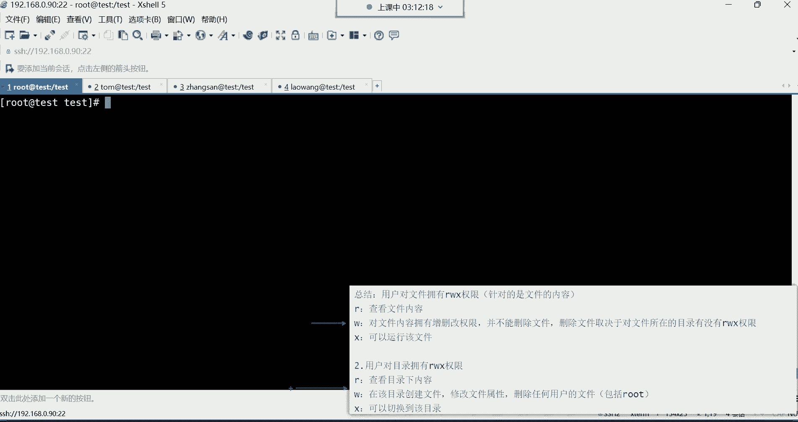

**计算最终权限**：**默认最大权限** 减去 **umask值**（注意是位相减）。
*   对于目录：`777 - 022 = 755` -> `rwxr-xr-x`
*   对于文件：`666 - 022 = 644` -> `rw-r--r--`

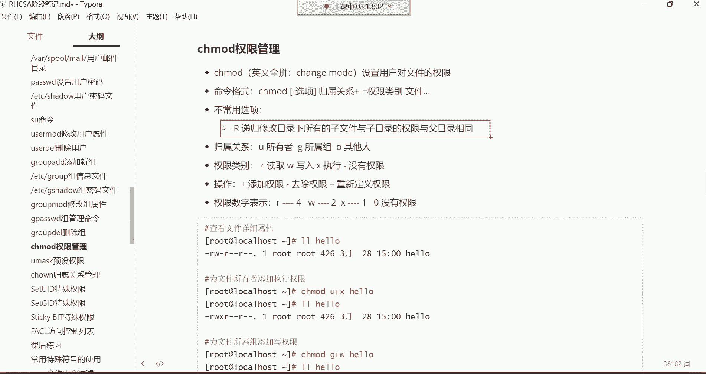

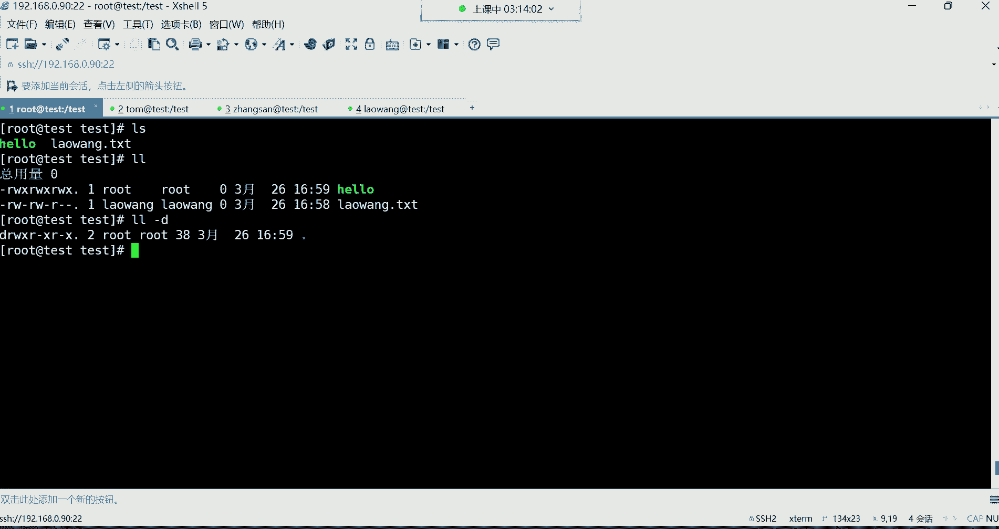

临时修改 `umask`（仅对当前Shell有效）：
```bash
umask 0027
```
永久修改需要将 `umask 0027` 写入用户的家目录配置文件（如 `~/.bashrc`）中。

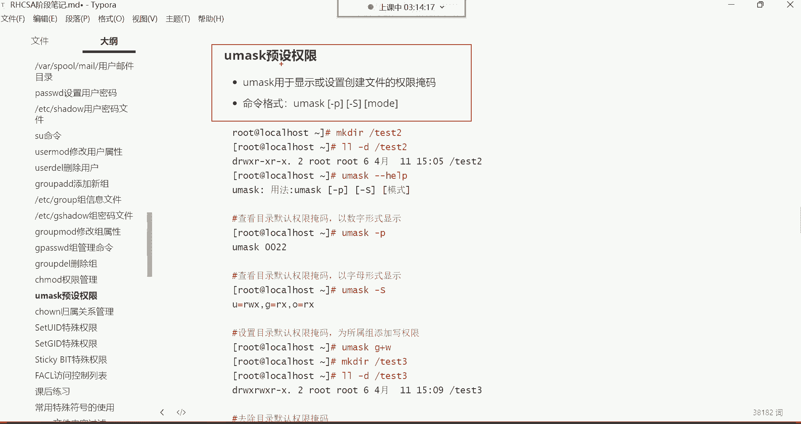

---

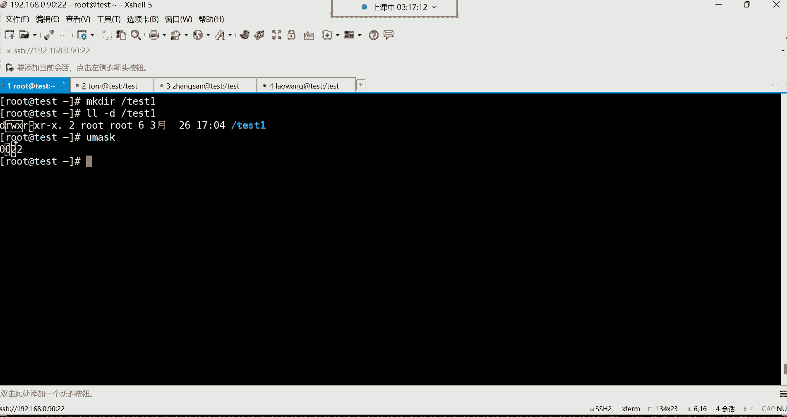

## 总结
本节课中我们一起学习了Linux权限管理的核心知识：

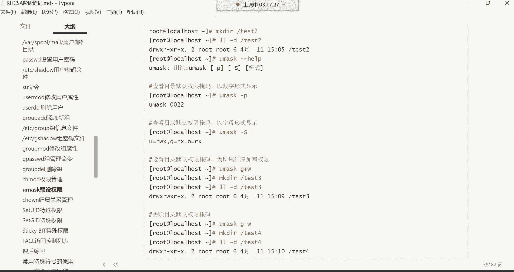

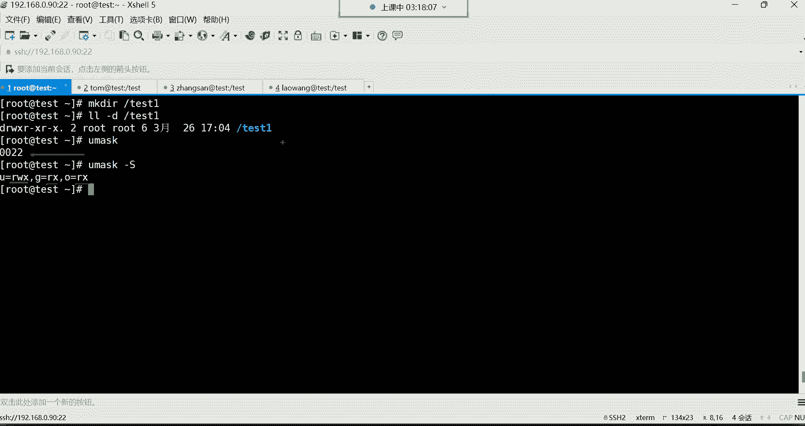

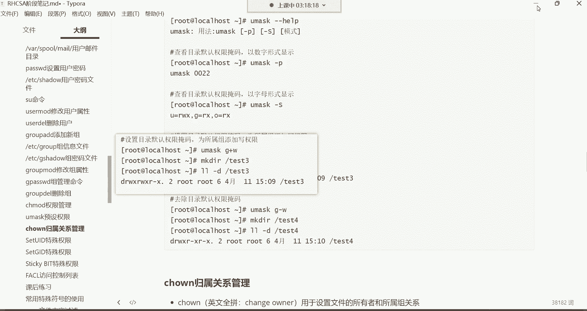

1.  **理解归属**：明确了文件的所有者(U)、所有组(G)和其他人(O)这三类关系。
2.  **掌握权限**：学会了读(r)、写(w)、执行(x)权限的含义，以及如何通过9位字符 (`rwxr-xr--`) 来解读权限。
3.  **修改权限**：熟练使用 `chmod` 命令的字母法 (`u+x, g-w`) 和数字法 (`755`) 来修改权限。
4.  **关键区别**：深刻理解了 `rwx` 权限对**文件**（操作内容）和**目录**（操作条目）的**不同含义**，特别是目录的 `w` 权限是删除文件的关键。
5.  **修改归属**：使用 `chown` 命令改变文件的所有者和所属组。
6.  **默认权限**：了解了 `umask` 如何影响新建文件和目录的初始权限。

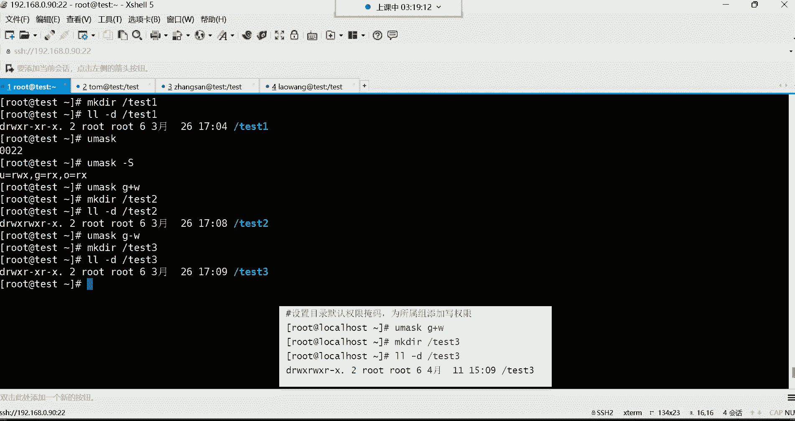

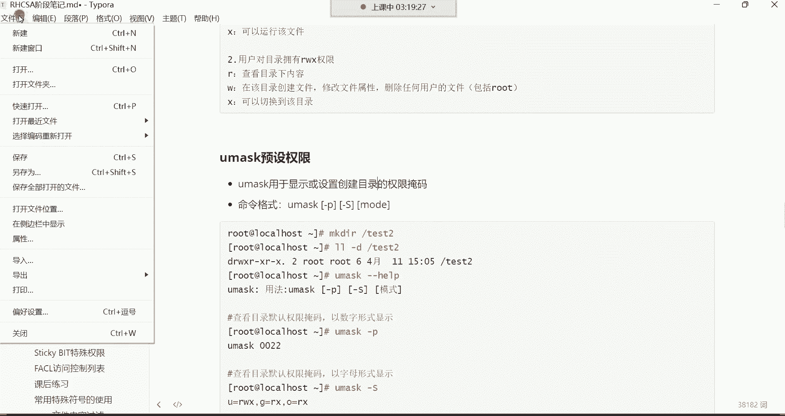

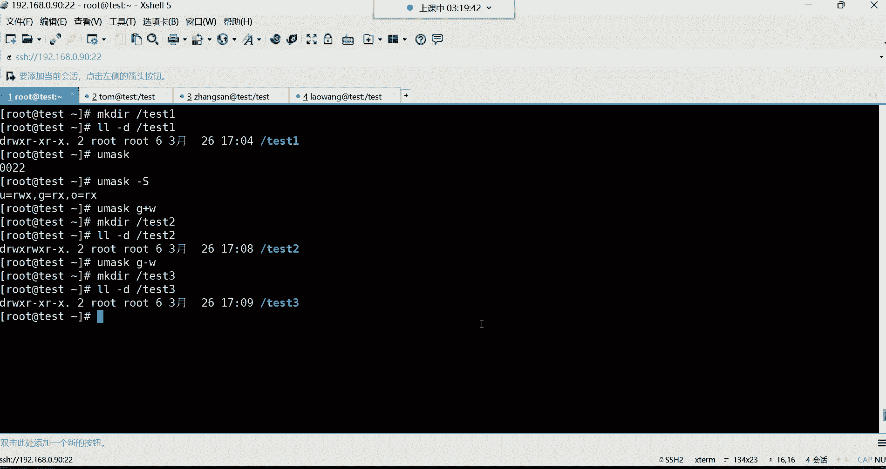

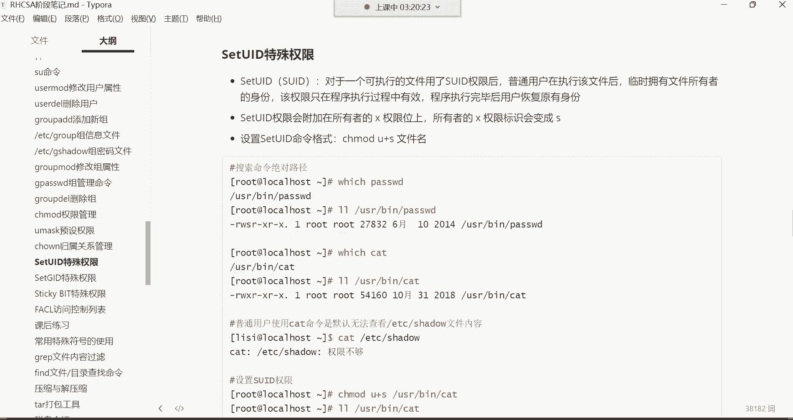

权限管理是Linux系统安全与多用户协作的基石。它将用户、组和文件系统紧密联系起来，使你能够精确控制“谁”可以对“什么资源”进行“何种操作”。请务必通过实践加深理解，这是成为一名合格Linux系统管理员的重要一步。