# 新盟教育-Linux运维RHCSA+RHCE培训教程：P1：云计算与Linux系统介绍

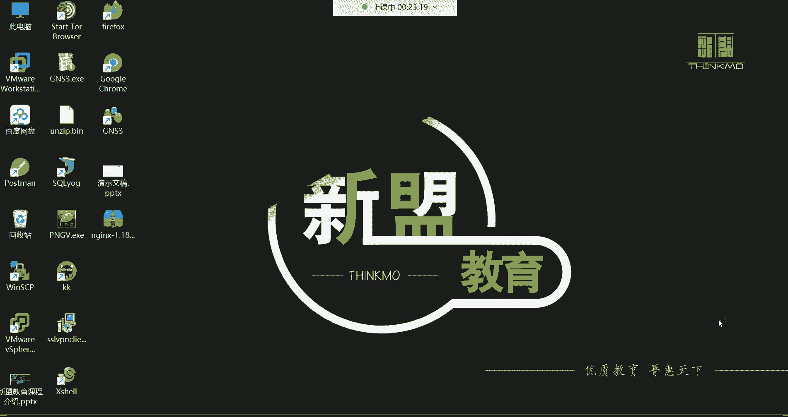

## 概述
在本节课中，我们将学习云计算的基本概念、Linux系统的核心知识以及它们之间的关系。课程旨在帮助初学者理解行业背景，明确学习目标，并为后续的Linux运维技术学习打下坚实基础。

---

## 什么是云计算？☁️

上一节我们概述了课程内容，本节中我们来详细看看什么是云计算。

云计算在20年前是一个相对模糊的概念。2000年深圳IT领袖峰会上，当记者问及中国互联网巨头对云计算前景的看法时，各方观点不一。马云对此充满信心，随后阿里巴巴投入巨资，由王坚博士带领团队历经8年研发，最终在2009年9月10日创立了阿里云。

如今，阿里云在全球20多个地区设有数据中心，并已成为全球第三大云服务提供商。排名第一的是亚马逊的AWS，第二是微软的Azure。

那么，云厂商与我们有何关系？它们主要对外提供服务。阿里云服务的客户遍布制造业、金融、政务、交通、医疗、电信、能源等多个行业，包括12306、中石化、飞利浦、微博、知乎等知名企业和平台。

### 云计算的优势
为了理解云计算的优势，我们可以从一个例子入手：假设你想创办一家公司并运行一个网站。

在传统模式下，你需要：
1.  购买物理服务器。
2.  购置机柜、机架来放置服务器。
3.  建设或租用IDC机房，以提供稳定的电力、网络、温湿度控制、防火防灾等环境。
这个过程成本高昂，尤其对于初创公司而言负担较重。

而有了云计算之后：
1.  云厂商已建设好大型数据中心。
2.  你只需在云平台上按需租用“云主机”（本质上是虚拟机）。
3.  云主机已配备CPU、内存、硬盘、网络和操作系统。
4.  你只需将网站部署到云主机上即可。

用户无需关心底层硬件、机房设施等复杂问题，实现了资源的按需使用和付费。这本质上是**网络的资源出租**，类似于生活中的租房、住酒店或去网吧，极大地降低了技术门槛和初期成本。

### 云计算的三种服务模式
云计算主要提供三种服务模式：

以下是三种服务模式的详细介绍：
*   **IaaS（基础设施即服务）**：为用户提供计算、存储、网络等最基础的硬件资源。用户需要自己在租用的云主机上安装操作系统、部署应用。这就像买了一台“裸机”，只有硬件。
*   **PaaS（平台即服务）**：在IaaS的基础上，为用户提供一个现成的软件平台或框架（如特定的运行环境、中间件、监控框架）。用户可以直接在此平台上开发和部署应用，无需管理底层系统和中间件。这就像买了一台预装好操作系统的电脑。
*   **SaaS（软件即服务）**：为用户提供完整的、可直接使用的软件应用（如企业邮箱、在线CRM系统）。用户无需关心任何底层技术，就像“拎包入住”五星级酒店，所有维护工作由服务商负责。不过，由于数据安全和定制化需求，企业核心业务较少完全采用此模式。

---

## 什么是Linux？🐧

了解了云计算后，本节我们来看看Linux是什么，以及它与云计算有何关联。

Linux是一个**类Unix的操作系统内核**。内核是计算机系统的核心，类似于人的大脑，负责管理计算机的所有硬件和软件资源，例如控制CPU调度、内存分配、硬件驱动等。

关于读音，`Linux` 或 `Linux` 都是常见的读法，没有绝对的对错。

### Linux的起源：与Unix的关系
Unix是另一个操作系统内核，诞生于1970年，最初由贝尔实验室的肯·汤普森用汇编语言编写，后由C语言之父丹尼斯·里奇用C语言重写。Unix是商业系统，需要付费使用。

Linux则由林纳斯·托瓦兹于1991年用C语言编写，并且是**免费开源**的。它继承了Unix的许多设计思想和风格。Linux选择企鹅作为吉祥物，象征着其像南极一样不属于任何商业实体，是全球开发者共有的自由软件。

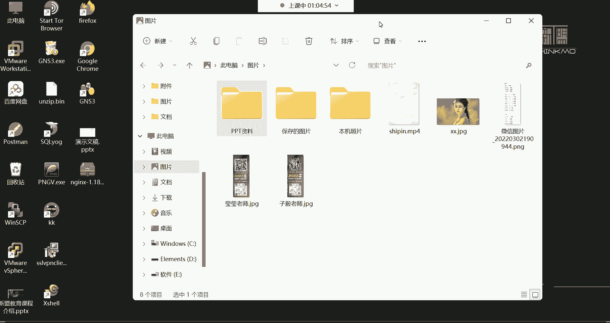

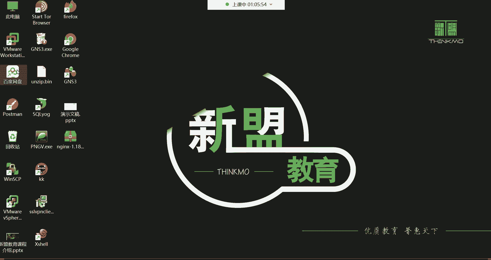

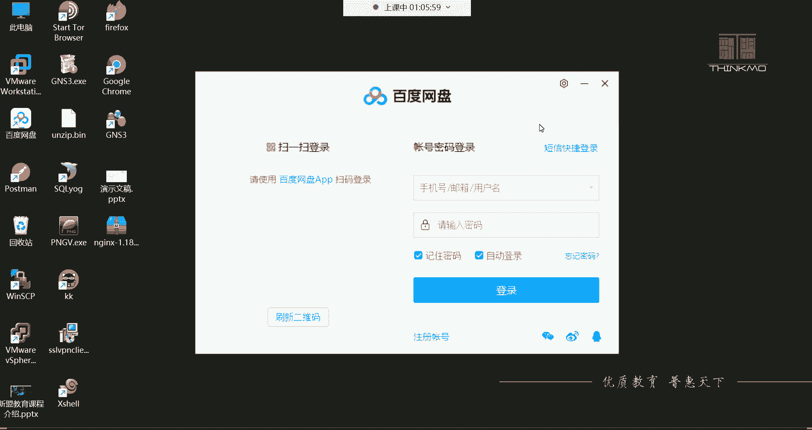

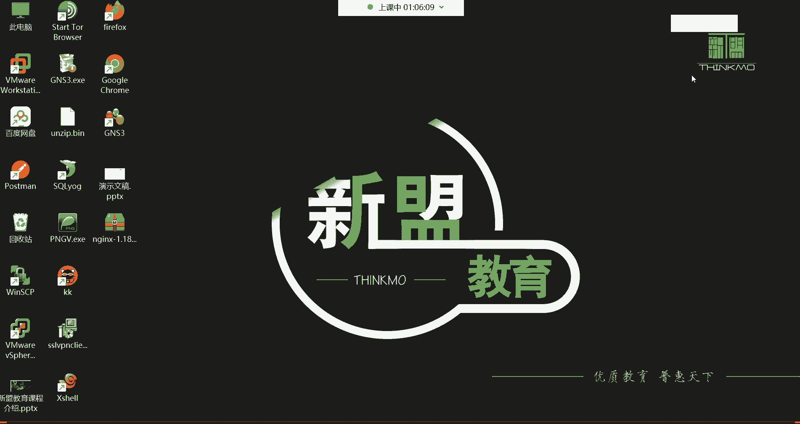

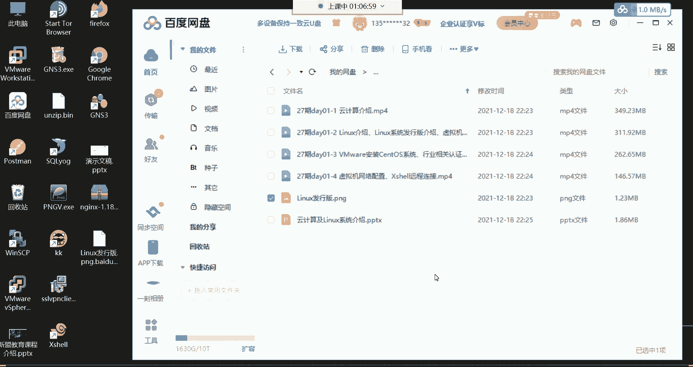

后来，Linux内核加入了GNU（自由软件基金会）项目，形成了完整的**GNU/Linux**操作系统。我们日常在Linux系统中使用的大部分命令工具都来自GNU项目。

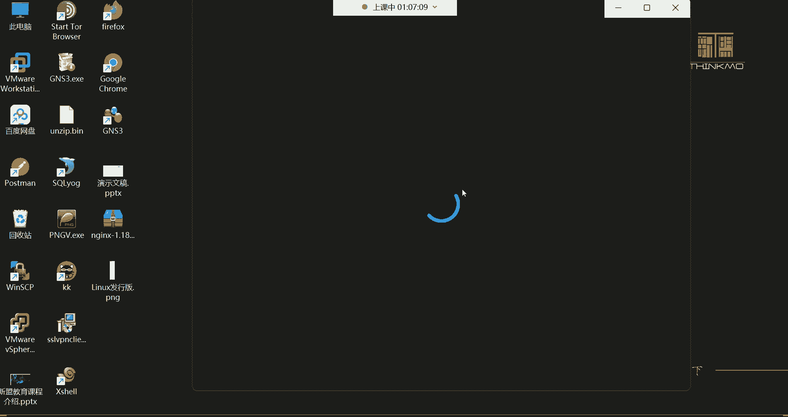

### 基于Linux内核的发行版
Linux本身只是一个内核，基于此内核，不同的组织和社区打包了各种软件和工具，形成了众多不同的“发行版”操作系统。

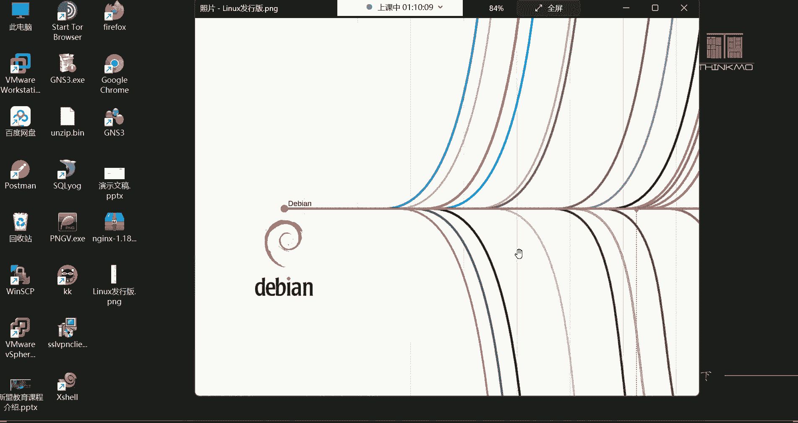

以下是一些常见且重要的Linux发行版：
*   **Red Hat Enterprise Linux (RHEL)**：红帽企业版Linux，主要应用于企业服务器领域。它是一个**收费**的系统，费用主要来自于官方提供的技术支持、安全更新和保修服务。
*   **CentOS**：社区企业操作系统，可以看作是RHEL的**免费克隆版**。它同样稳定，适用于服务器，但不提供官方的商业支持。**（注：CentOS 8之后已转向CentOS Stream，性质有所变化）**
*   **Fedora**：红帽公司赞助的社区版，以技术激进著称，包含大量最新软件和功能，适合桌面用户和开发者尝鲜。
*   **Ubuntu**：基于Debian，以桌面应用友好著称，拥有庞大的社区和丰富的软件库。它主要流行于开发者和桌面用户领域，也常用于嵌入式开发。
*   **openSUSE**：在欧洲非常流行的桌面系统，同样以优秀的图形界面和易用性闻名。
*   **Debian**：以稳定性著称，是许多发行版（如Ubuntu）的基础，在服务器和桌面都有应用。

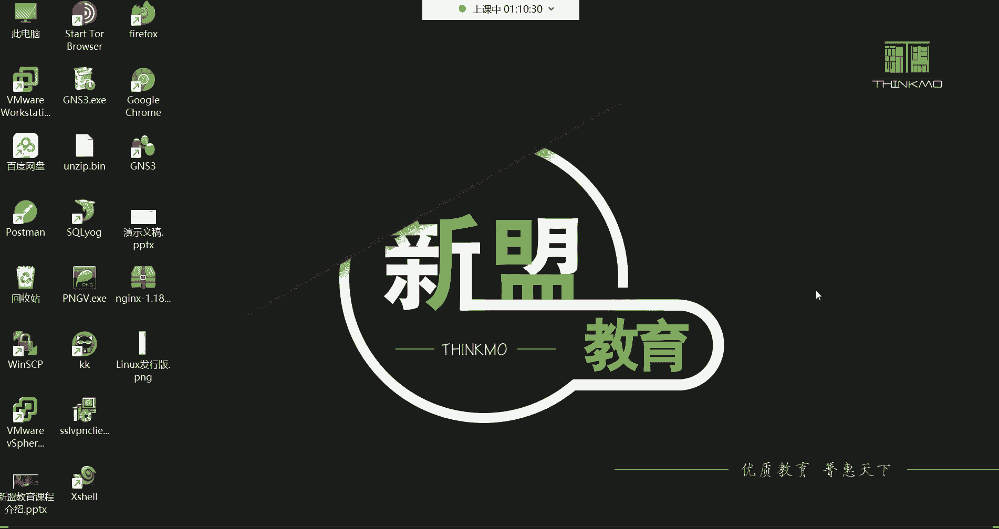

**服务器与桌面系统的选择**：对于服务器环境，稳定性和资源效率至关重要。因此，像RHEL、CentOS这类没有默认图形界面、主要通过命令行管理的发行版是主流选择。而Ubuntu、openSUSE等带有友好图形界面的发行版，因为会消耗更多系统资源，通常不作为生产环境服务器的首选。

---

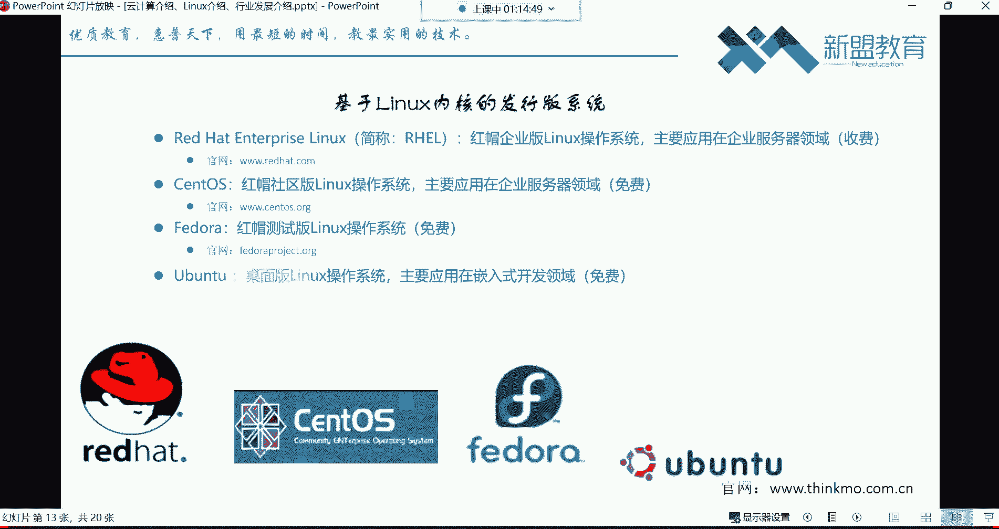

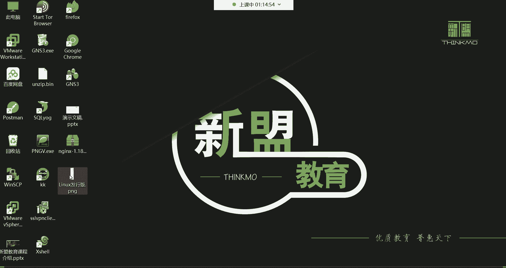

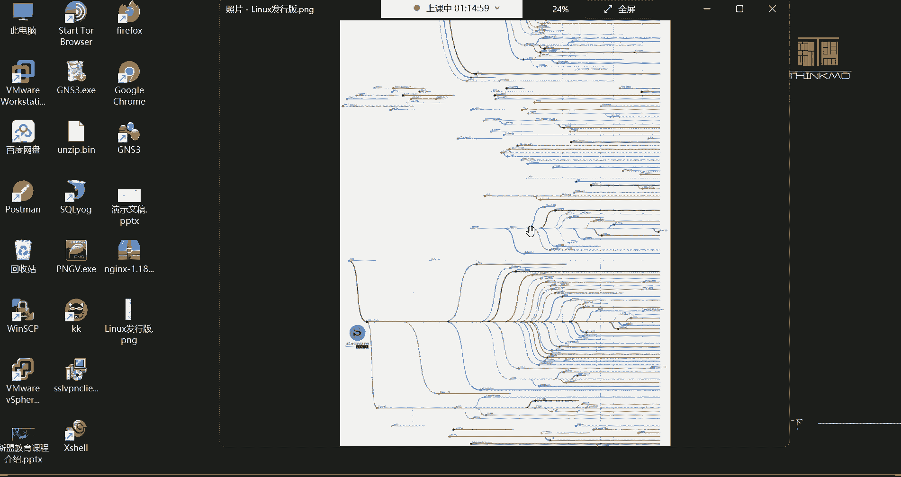

## 总结
本节课我们一起学习了云计算和Linux系统的基础知识。

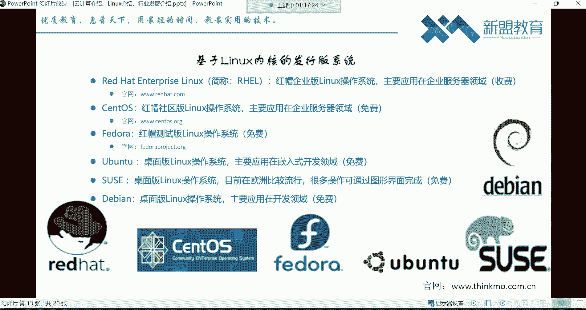

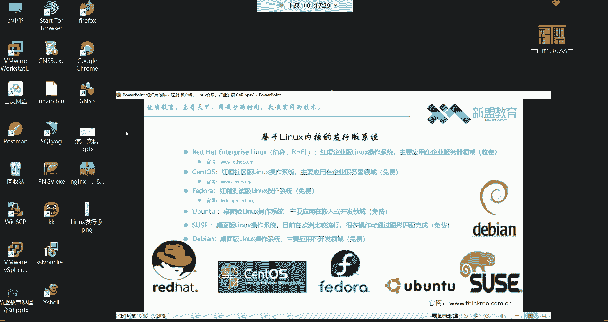

我们了解到，**云计算的本质是网络资源的出租**（IaaS/PaaS/SaaS），它让企业和个人能够以更低的成本和更高的灵活性获取IT资源。而**Linux是一个免费开源的操作系统内核**，基于它衍生出了众多发行版，其中RHEL/CentOS系列因其稳定性和在企业服务器领域的广泛应用，成为我们学习Linux运维的重点。

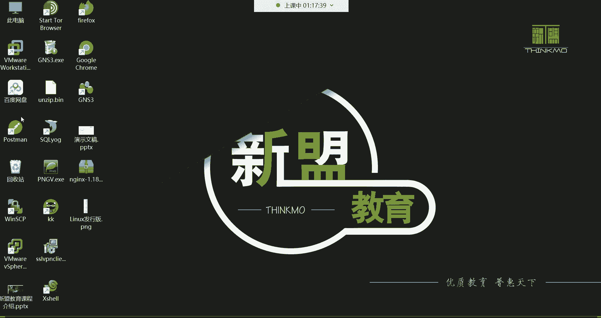

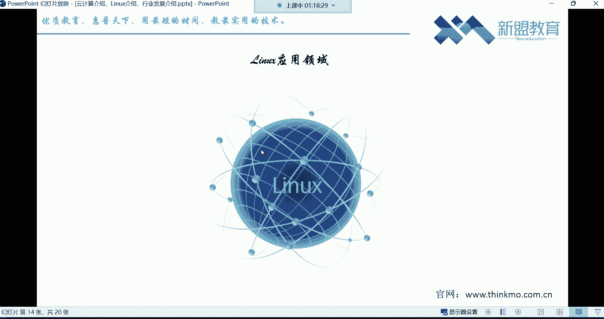

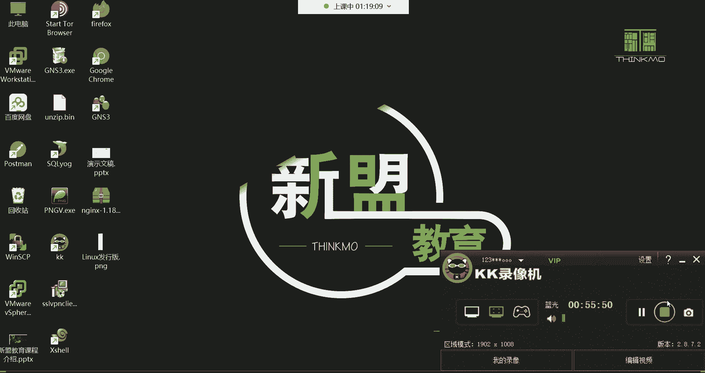

理解这些背景知识，有助于我们明确学习方向：掌握Linux，尤其是面向服务器的发行版的管理技能，是在云计算时代从事运维工作的基石。接下来，我们将开始动手安装Linux系统，进入实际操作的学习阶段。